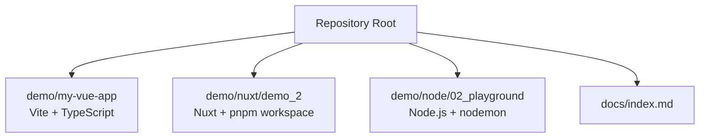
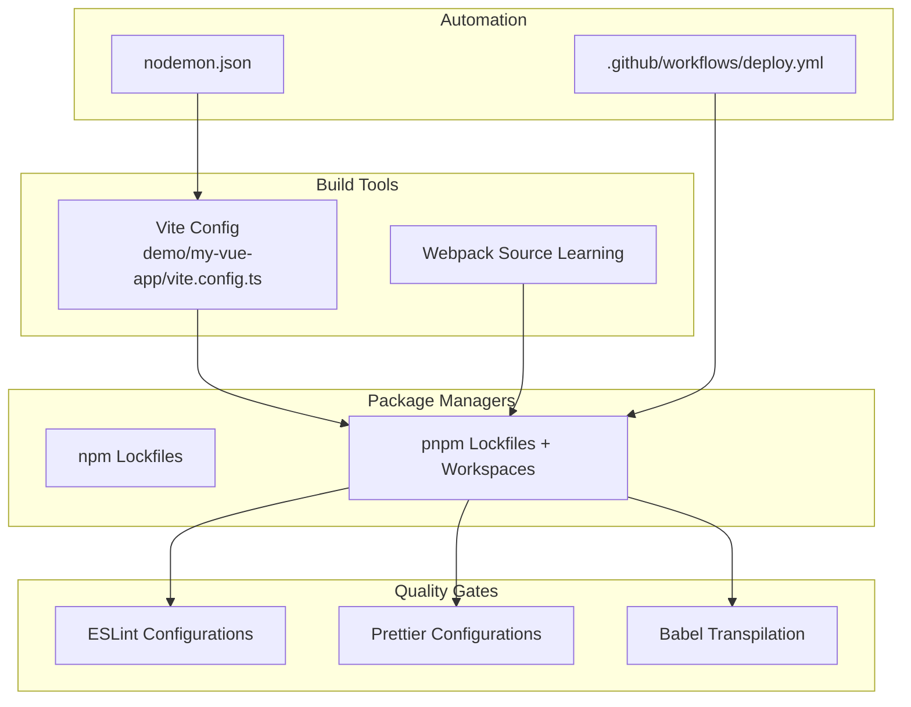
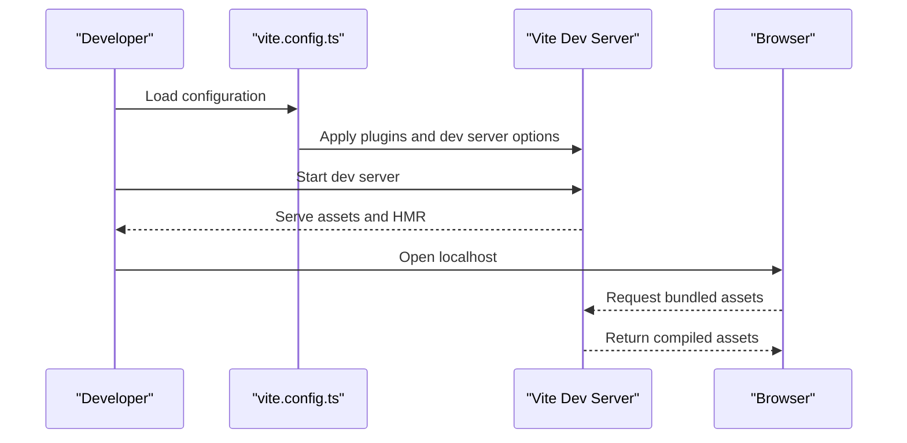
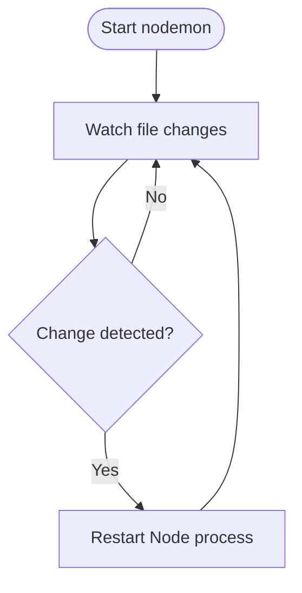
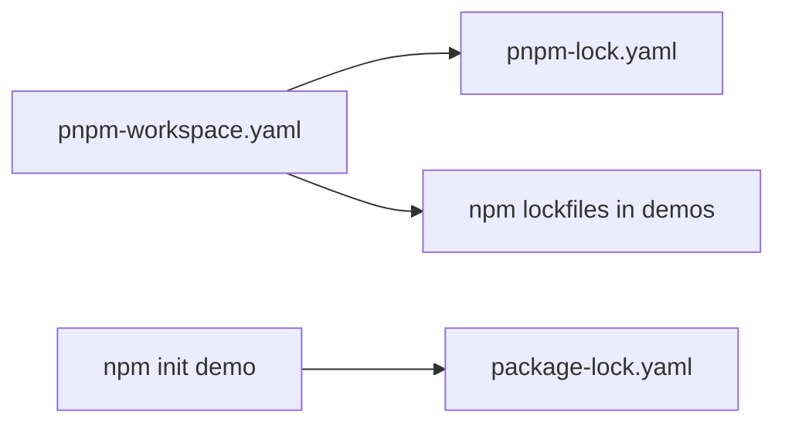
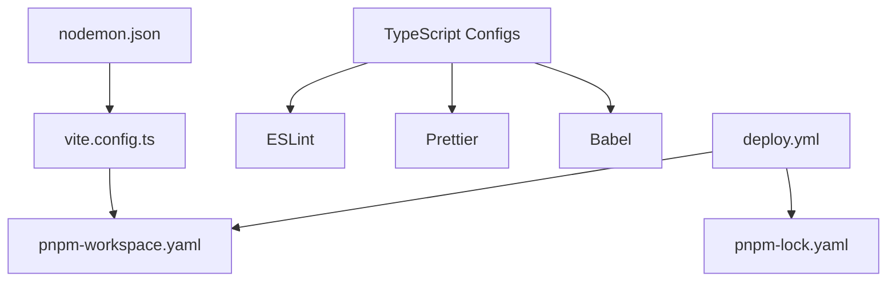

# Engineering Practices

<cite>
**Referenced Files in This Document**
- [README.md](file://README.md)
- [package.json](file://package.json)
- [pnpm-workspace.yaml](file://demo/nuxt/demo_2/pnpm-workspace.yaml)
- [pnpm-workspace.yaml](file://源码学习/vite@5.2.11/pnpm-workspace.yaml)
- [pnpm-workspace.yaml](file://源码学习/pinia-2@2.3.1/pnpm-workspace.yaml)
- [vite.config.ts](file://demo/my-vue-app/vite.config.ts)
- [tsconfig.app.json](file://demo/my-vue-app/tsconfig.app.json)
- [tsconfig.json](file://demo/my-vue-app/tsconfig.json)
- [tsconfig.node.json](file://demo/my-vue-app/tsconfig.node.json)
- [package.json](file://demo/my-vue-app/package.json)
- [package.json](file://demo/node/01模块/package.json)
- [package.json](file://demo/node/02_playground/package.json)
- [package.json](file://demo/npm/init/package.json)
- [package.json](file://demo/nuxt/demo_2/package.json)
- [package.json](file://源码学习/vite@5.2.11/package.json)
- [package.json](file://源码学习/pinia-2@2.3.1/package.json)
- [package.json](file://源码学习/webpack@5.68.0/package.json)
- [nodemon.json](file://demo/node/02_playground/nodemon.json)
- [.npmrc](file://demo/nuxt/demo_2/.npmrc)
- [pnpm-lock.yaml](file://demo/node/01模块/pnpm-lock.yaml)
- [pnpm-lock.yaml](file://demo/node/02_playground/pnpm-lock.yaml)
- [pnpm-lock.yaml](file://demo/nuxt/demo_2/pnpm-lock.yaml)
- [pnpm-lock.yaml](file://源码学习/vite@5.2.11/pnpm-lock.yaml)
- [pnpm-lock.yaml](file://源码学习/pinia-2@2.3.1/pnpm-lock.yaml)
- [pnpm-lock.yaml](file://源码学习/webpack@5.68.0/pnpm-lock.yaml)
- [deploy.yml](file://.github/workflows/deploy.yml)
- [index.md](file://docs/index.md)
</cite>

## Table of Contents
1. [Introduction](#introduction)
2. [Project Structure](#project-structure)
3. [Core Components](#core-components)
4. [Architecture Overview](#architecture-overview)
5. [Detailed Component Analysis](#detailed-component-analysis)
6. [Dependency Analysis](#dependency-analysis)
7. [Performance Considerations](#performance-considerations)
8. [Troubleshooting Guide](#troubleshooting-guide)
9. [Conclusion](#conclusion)
10. [Appendices](#appendices)

## Introduction
This document consolidates engineering practices for modern frontend and Node.js development workflows in this repository. It covers build tooling ecosystems (Vite, Webpack), development automation, code quality standards (ESLint, Prettier, Babel), package management strategies (npm and pnpm), workspace configuration, version control workflows (Git), and TypeScript integration for type safety and advanced JavaScript features. The content balances conceptual guidance for newcomers and technical depth for experienced engineers optimizing their workflows.

## Project Structure
The repository includes:
- A Vite-based Vue application demonstrating modern build tooling and TypeScript configuration.
- A Nuxt 2 project showcasing pnpm workspaces, monorepo-style dependency management, and deployment automation.
- A Node.js playground integrating nodemon for development automation.
- Multiple demos and source learning projects for build tools (Vite, Webpack), package managers (npm, pnpm), and linting/formatter tools.

**Diagram sources**
- [README.md](file://README.md)
- [index.md](file://docs/index.md)

**Section sources**
- [README.md](file://README.md)
- [index.md](file://docs/index.md)

## Core Components
- Build Tooling Ecosystem
  - Vite: Used in the Vue demo for fast dev server and optimized builds.
  - Webpack: Present in the source learning area for deep-dive study.
- Development Automation
  - nodemon for Node.js development reloads.
  - GitHub Actions for CI/CD deployment.
- Code Quality Standards
  - ESLint and Prettier configured across projects.
  - Babel used for transpilation in Nuxt demo.
- Package Management Strategies
  - npm and pnpm usage demonstrated with lockfiles and workspace configs.
- Version Control Workflows
  - Git-based branching and collaboration patterns supported by CI/CD.
- TypeScript Integration
  - Strict TS configurations in the Vue demo and Nuxt demo.

**Section sources**
- [vite.config.ts](file://demo/my-vue-app/vite.config.ts)
- [package.json](file://demo/my-vue-app/package.json)
- [tsconfig.app.json](file://demo/my-vue-app/tsconfig.app.json)
- [tsconfig.json](file://demo/my-vue-app/tsconfig.json)
- [tsconfig.node.json](file://demo/my-vue-app/tsconfig.node.json)
- [package.json](file://demo/nuxt/demo_2/package.json)
- [pnpm-workspace.yaml](file://demo/nuxt/demo_2/pnpm-workspace.yaml)
- [nodemon.json](file://demo/node/02_playground/nodemon.json)
- [deploy.yml](file://.github/workflows/deploy.yml)

## Architecture Overview
The engineering stack integrates build tools, package managers, and quality gates across multiple projects. The Vite-based Vue app focuses on rapid iteration and modern tooling. The Nuxt project emphasizes monorepo-style management via pnpm workspaces and deployment automation. Node.js playgrounds demonstrate development automation with nodemon. CI/CD ensures consistent deployment.

**Diagram sources**
- [vite.config.ts](file://demo/my-vue-app/vite.config.ts)
- [package.json](file://demo/my-vue-app/package.json)
- [package.json](file://demo/nuxt/demo_2/package.json)
- [pnpm-workspace.yaml](file://demo/nuxt/demo_2/pnpm-workspace.yaml)
- [pnpm-lock.yaml](file://demo/nuxt/demo_2/pnpm-lock.yaml)
- [nodemon.json](file://demo/node/02_playground/nodemon.json)
- [deploy.yml](file://.github/workflows/deploy.yml)

## Detailed Component Analysis

### Vite Build Tooling
- Purpose: Fast development server and optimized production builds for modern web apps.
- Configuration: The Vue demo includes a dedicated Vite configuration file for bundling, aliasing, and plugin setups.
- TypeScript Integration: The Vue demo uses separate TS config files for application and Node environments, enabling strict type checking and accurate intellisense.

**Diagram sources**
- [vite.config.ts](file://demo/my-vue-app/vite.config.ts)

**Section sources**
- [vite.config.ts](file://demo/my-vue-app/vite.config.ts)
- [tsconfig.app.json](file://demo/my-vue-app/tsconfig.app.json)
- [tsconfig.json](file://demo/my-vue-app/tsconfig.json)
- [tsconfig.node.json](file://demo/my-vue-app/tsconfig.node.json)

### Webpack Build Tooling
- Purpose: Study and understand classic bundling, loaders, and plugins for legacy and educational contexts.
- Usage: Included in the source learning area for deeper understanding of bundler internals.

**Section sources**
- [package.json](file://源码学习/webpack@5.68.0/package.json)

### Development Automation with nodemon
- Purpose: Automatic restart of Node.js applications during development.
- Configuration: The Node playground includes a nodemon configuration file to watch for file changes and restart the process.

**Diagram sources**
- [nodemon.json](file://demo/node/02_playground/nodemon.json)

**Section sources**
- [nodemon.json](file://demo/node/02_playground/nodemon.json)

### Code Quality Standards (ESLint, Prettier, Babel)
- ESLint: Enforced across projects to maintain consistent code style and catch potential errors early.
- Prettier: Applied for automatic code formatting to reduce friction in team workflows.
- Babel: Used in the Nuxt demo to transpile modern JavaScript to compatible targets, ensuring broad browser support.

**Section sources**
- [package.json](file://demo/nuxt/demo_2/package.json)
- [package.json](file://demo/my-vue-app/package.json)

### Package Management Strategies (npm and pnpm)
- npm: Demonstrated with lockfiles and basic init usage in the repository’s demos.
- pnpm: Preferred for monorepos and workspace management, evidenced by pnpm-workspace.yaml and pnpm-lock.yaml files across multiple projects.

**Diagram sources**
- [pnpm-workspace.yaml](file://demo/nuxt/demo_2/pnpm-workspace.yaml)
- [pnpm-lock.yaml](file://demo/nuxt/demo_2/pnpm-lock.yaml)
- [pnpm-lock.yaml](file://demo/node/02_playground/pnpm-lock.yaml)
- [package.json](file://demo/npm/init/package.json)

**Section sources**
- [pnpm-workspace.yaml](file://demo/nuxt/demo_2/pnpm-workspace.yaml)
- [pnpm-workspace.yaml](file://源码学习/vite@5.2.11/pnpm-workspace.yaml)
- [pnpm-workspace.yaml](file://源码学习/pinia-2@2.3.1/pnpm-workspace.yaml)
- [pnpm-lock.yaml](file://demo/nuxt/demo_2/pnpm-lock.yaml)
- [pnpm-lock.yaml](file://源码学习/vite@5.2.11/pnpm-lock.yaml)
- [package.json](file://demo/npm/init/package.json)

### Workspace Configuration
- pnpm workspaces enable monorepo-style development across multiple packages, sharing a single lockfile and hoisting dependencies to optimize disk usage and install speed.
- Examples are present in the Nuxt demo and core tooling repositories.

**Section sources**
- [pnpm-workspace.yaml](file://demo/nuxt/demo_2/pnpm-workspace.yaml)
- [pnpm-workspace.yaml](file://源码学习/vite@5.2.11/pnpm-workspace.yaml)
- [pnpm-workspace.yaml](file://源码学习/pinia-2@2.3.1/pnpm-workspace.yaml)

### Version Control Workflows (Git)
- Branching and collaboration patterns are supported by Git and automated via GitHub Actions for continuous deployment.
- CI/CD pipeline triggers on pushes and pull requests to ensure consistent builds and deployments.

**Section sources**
- [deploy.yml](file://.github/workflows/deploy.yml)

### TypeScript Integration and Type Safety
- The Vue demo includes separate TS configuration files for application and Node environments, enabling strict type checking and accurate intellisense.
- Advanced JavaScript features are leveraged alongside TypeScript for modern development practices.

**Section sources**
- [tsconfig.app.json](file://demo/my-vue-app/tsconfig.app.json)
- [tsconfig.json](file://demo/my-vue-app/tsconfig.json)
- [tsconfig.node.json](file://demo/my-vue-app/tsconfig.node.json)

## Dependency Analysis
The repository demonstrates a layered dependency model:
- Build tools depend on package managers (npm/pnpm) and quality tools (ESLint/Prettier/Babel).
- Monorepo workspaces coordinate shared dependencies across multiple packages.
- CI/CD depends on package manager lockfiles and workspace configurations.

**Diagram sources**
- [vite.config.ts](file://demo/my-vue-app/vite.config.ts)
- [tsconfig.app.json](file://demo/my-vue-app/tsconfig.app.json)
- [pnpm-workspace.yaml](file://demo/nuxt/demo_2/pnpm-workspace.yaml)
- [pnpm-lock.yaml](file://demo/nuxt/demo_2/pnpm-lock.yaml)
- [package.json](file://demo/my-vue-app/package.json)
- [nodemon.json](file://demo/node/02_playground/nodemon.json)
- [deploy.yml](file://.github/workflows/deploy.yml)

**Section sources**
- [pnpm-workspace.yaml](file://demo/nuxt/demo_2/pnpm-workspace.yaml)
- [pnpm-lock.yaml](file://demo/nuxt/demo_2/pnpm-lock.yaml)
- [package.json](file://demo/my-vue-app/package.json)
- [deploy.yml](file://.github/workflows/deploy.yml)

## Performance Considerations
- Prefer pnpm workspaces for monorepos to reduce duplication and accelerate installs.
- Use Vite for rapid development and optimized production builds.
- Configure TypeScript strict mode to catch issues early and improve DX.
- Keep ESLint and Prettier configurations aligned across the team to minimize merge conflicts and maintain consistency.

## Troubleshooting Guide
- Build Failures
  - Verify Vite configuration and plugin compatibility.
  - Check TypeScript configuration files for environment-specific settings.
- Dependency Issues
  - Confirm pnpm workspace configuration and lockfile integrity.
  - Validate npm vs pnpm usage consistency across the project.
- Formatting and Linting
  - Align editor integrations with ESLint and Prettier configurations.
- Development Reloads
  - Review nodemon configuration for watched paths and restart behavior.
- CI/CD Failures
  - Inspect GitHub Actions logs and ensure workspace and lockfile consistency.

**Section sources**
- [vite.config.ts](file://demo/my-vue-app/vite.config.ts)
- [tsconfig.app.json](file://demo/my-vue-app/tsconfig.app.json)
- [pnpm-workspace.yaml](file://demo/nuxt/demo_2/pnpm-workspace.yaml)
- [pnpm-lock.yaml](file://demo/nuxt/demo_2/pnpm-lock.yaml)
- [nodemon.json](file://demo/node/02_playground/nodemon.json)
- [deploy.yml](file://.github/workflows/deploy.yml)

## Conclusion
This repository showcases a cohesive set of modern engineering practices: Vite-driven development, robust TypeScript integration, pnpm workspace management, ESLint and Prettier for code quality, Babel for transpilation, and CI/CD automation. Adopting these patterns accelerates development velocity, improves code quality, and streamlines collaboration across teams.

## Appendices
- Beginner-Friendly Tips
  - Start with the Vue + Vite demo to learn modern build tooling and TypeScript basics.
  - Use pnpm workspaces for organizing multiple packages in a single repository.
  - Integrate ESLint and Prettier in your editor to auto-format and catch errors.
- Advanced Optimizations
  - Fine-tune Vite plugins and aliases for performance-sensitive applications.
  - Leverage monorepo caching and incremental builds in CI/CD.
  - Centralize Babel presets and env targets for consistent transpilation across packages.