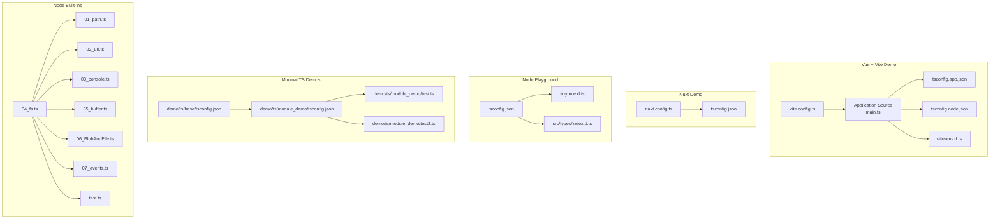
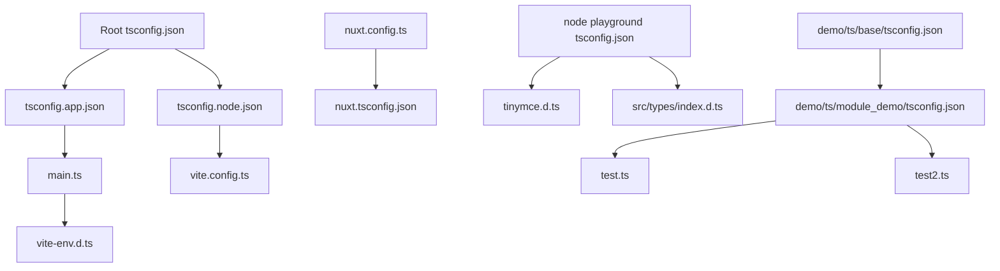
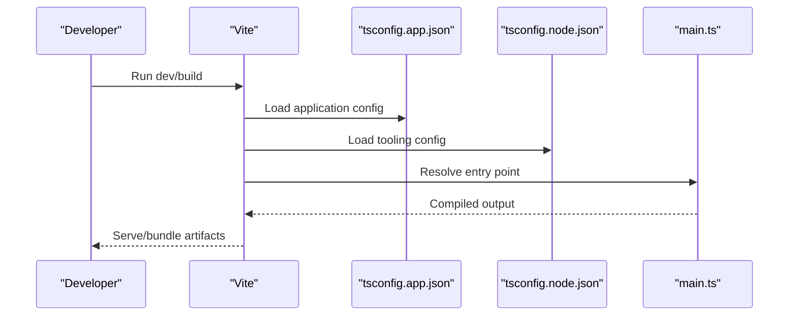
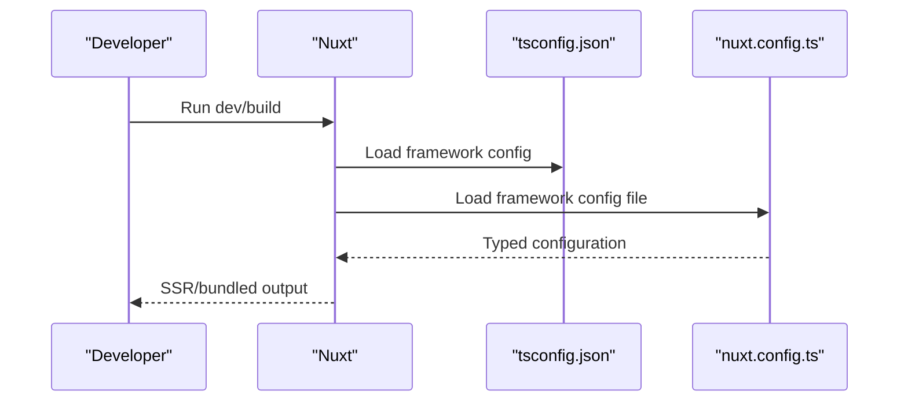
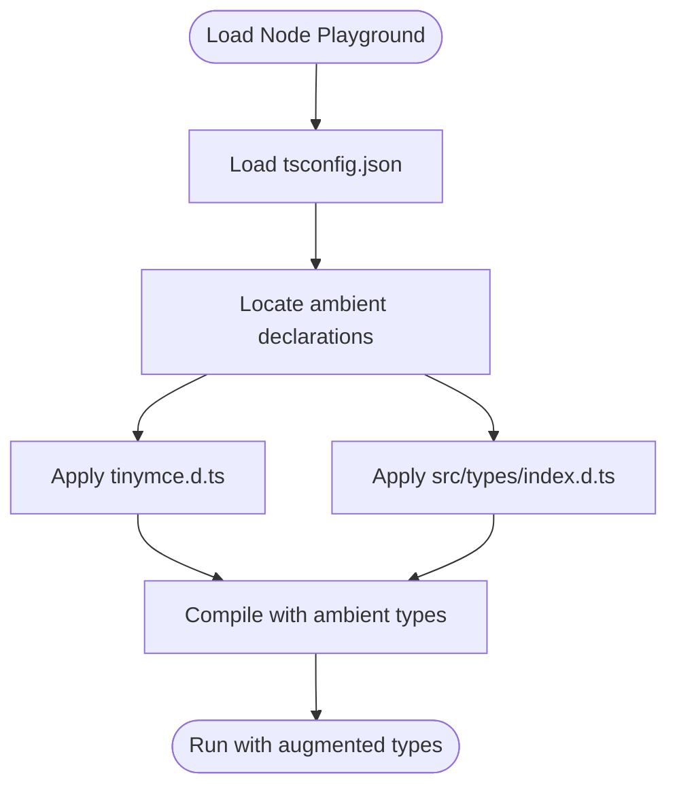
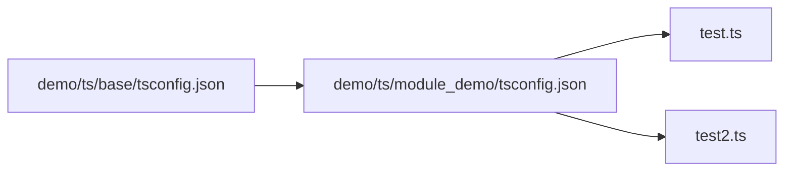
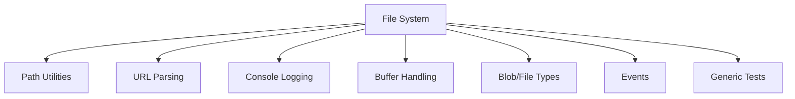
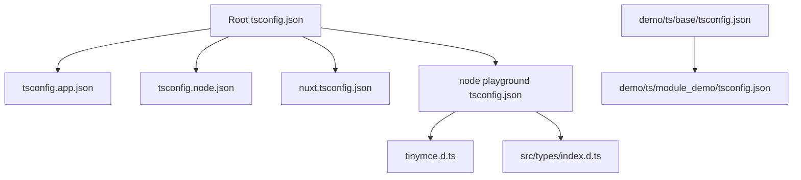

# TypeScript Development

<cite>
**Referenced Files in This Document**
- [tsconfig.json](file://tsconfig.json)
- [demo/my-vue-app/tsconfig.json](file://demo/my-vue-app/tsconfig.json)
- [demo/my-vue-app/tsconfig.app.json](file://demo/my-vue-app/tsconfig.app.json)
- [demo/my-vue-app/tsconfig.node.json](file://demo/my-vue-app/tsconfig.node.json)
- [demo/my-vue-app/src/main.ts](file://demo/my-vue-app/src/main.ts)
- [demo/my-vue-app/src/vite-env.d.ts](file://demo/my-vue-app/src/vite-env.d.ts)
- [demo/my-vue-app/vite.config.ts](file://demo/my-vue-app/vite.config.ts)
- [demo/node/02_playground/tsconfig.json](file://demo/node/02_playground/tsconfig.json)
- [demo/node/02_playground/public/tinymce/tinymce.d.ts](file://demo/node/02_playground/public/tinymce/tinymce.d.ts)
- [demo/node/02_playground/src/types/index.d.ts](file://demo/node/02_playground/src/types/index.d.ts)
- [demo/nuxt/demo_2/tsconfig.json](file://demo/nuxt/demo_2/tsconfig.json)
- [demo/nuxt/demo_2/nuxt.config.ts](file://demo/nuxt/demo_2/nuxt.config.ts)
- [demo/ts/base/tsconfig.json](file://demo/ts/base/tsconfig.json)
- [demo/ts/module_demo/tsconfig.json](file://demo/ts/module_demo/tsconfig.json)
- [demo/ts/module_demo/test.ts](file://demo/ts/module_demo/test.ts)
- [demo/ts/module_demo/test2.ts](file://demo/ts/module_demo/test2.ts)
- [demo/node/01模块/src/01_path.ts](file://demo/node/01模块/src/01_path.ts)
- [demo/node/01模块/src/02_url.ts](file://demo/node/01模块/src/02_url.ts)
- [demo/node/01模块/src/03_console.ts](file://demo/node/01模块/src/03_console.ts)
- [demo/node/01模块/src/04_fs.ts](file://demo/node/01模块/src/04_fs.ts)
- [demo/node/01模块/src/05_buffer.ts](file://demo/node/01模块/src/05_buffer.ts)
- [demo/node/01模块/src/06_BlobAndFile.ts](file://demo/node/01模块/src/06_BlobAndFile.ts)
- [demo/node/01模块/src/07_events.ts](file://demo/node/01模块/src/07_events.ts)
- [demo/node/01模块/src/test.ts](file://demo/node/01模块/src/test.ts)
</cite>

## Table of Contents
1. [Introduction](#introduction)
2. [Project Structure](#project-structure)
3. [Core Components](#core-components)
4. [Architecture Overview](#architecture-overview)
5. [Detailed Component Analysis](#detailed-component-analysis)
6. [Dependency Analysis](#dependency-analysis)
7. [Performance Considerations](#performance-considerations)
8. [Troubleshooting Guide](#troubleshooting-guide)
9. [Conclusion](#conclusion)
10. [Appendices](#appendices)

## Introduction
This document provides a comprehensive guide to TypeScript development with a focus on advanced type systems, configuration, and modern JavaScript features. It synthesizes practical examples from the repository’s demo projects to illustrate real-world TypeScript usage patterns. Topics include:
- TypeScript configuration via tsconfig.json, module resolution, and compilation targets
- Advanced type features such as generics, decorators, utility types, and conditional types
- Module system usage, declaration files, and type augmentation
- Type safety best practices, refactoring techniques, and migration strategies from JavaScript
- Common TypeScript issues, performance considerations, and integration with build tools
- Consumption and authoring of type definitions, and team adoption strategies

## Project Structure
The repository contains several TypeScript-focused demo projects that demonstrate different environments and toolchains:
- Vue + Vite project with split tsconfig files for application and Node tooling
- Nuxt project with framework-specific tsconfig and configuration
- Node playground project showcasing ambient declarations and type augmentation
- Minimal TypeScript demos under demo/ts for base configuration and module usage
- Node built-in modules demos under demo/node/01模块 for practical type usage

**Diagram sources**
- [demo/my-vue-app/src/main.ts:1-200](file://demo/my-vue-app/src/main.ts#L1-L200)
- [demo/my-vue-app/tsconfig.app.json:1-200](file://demo/my-vue-app/tsconfig.app.json#L1-L200)
- [demo/my-vue-app/tsconfig.node.json:1-200](file://demo/my-vue-app/tsconfig.node.json#L1-L200)
- [demo/my-vue-app/vite.config.ts:1-200](file://demo/my-vue-app/vite.config.ts#L1-L200)
- [demo/my-vue-app/src/vite-env.d.ts:1-200](file://demo/my-vue-app/src/vite-env.d.ts#L1-L200)
- [demo/nuxt/demo_2/nuxt.config.ts:1-200](file://demo/nuxt/demo_2/nuxt.config.ts#L1-L200)
- [demo/nuxt/demo_2/tsconfig.json:1-200](file://demo/nuxt/demo_2/tsconfig.json#L1-L200)
- [demo/node/02_playground/tsconfig.json:1-200](file://demo/node/02_playground/tsconfig.json#L1-L200)
- [demo/node/02_playground/public/tinymce/tinymce.d.ts:1-200](file://demo/node/02_playground/public/tinymce/tinymce.d.ts#L1-L200)
- [demo/node/02_playground/src/types/index.d.ts:1-200](file://demo/node/02_playground/src/types/index.d.ts#L1-L200)
- [demo/ts/base/tsconfig.json:1-200](file://demo/ts/base/tsconfig.json#L1-L200)
- [demo/ts/module_demo/tsconfig.json:1-200](file://demo/ts/module_demo/tsconfig.json#L1-L200)
- [demo/ts/module_demo/test.ts:1-200](file://demo/ts/module_demo/test.ts#L1-L200)
- [demo/ts/module_demo/test2.ts:1-200](file://demo/ts/module_demo/test2.ts#L1-L200)
- [demo/node/01模块/src/04_fs.ts:1-200](file://demo/node/01模块/src/04_fs.ts#L1-L200)
- [demo/node/01模块/src/01_path.ts:1-200](file://demo/node/01模块/src/01_path.ts#L1-L200)
- [demo/node/01模块/src/02_url.ts:1-200](file://demo/node/01模块/src/02_url.ts#L1-L200)
- [demo/node/01模块/src/03_console.ts:1-200](file://demo/node/01模块/src/03_console.ts#L1-L200)
- [demo/node/01模块/src/05_buffer.ts:1-200](file://demo/node/01模块/src/05_buffer.ts#L1-L200)
- [demo/node/01模块/src/06_BlobAndFile.ts:1-200](file://demo/node/01模块/src/06_BlobAndFile.ts#L1-L200)
- [demo/node/01模块/src/07_events.ts:1-200](file://demo/node/01模块/src/07_events.ts#L1-L200)
- [demo/node/01模块/src/test.ts:1-200](file://demo/node/01模块/src/test.ts#L1-L200)

**Section sources**
- [demo/my-vue-app/tsconfig.json:1-200](file://demo/my-vue-app/tsconfig.json#L1-L200)
- [demo/my-vue-app/tsconfig.app.json:1-200](file://demo/my-vue-app/tsconfig.app.json#L1-L200)
- [demo/my-vue-app/tsconfig.node.json:1-200](file://demo/my-vue-app/tsconfig.node.json#L1-L200)
- [demo/my-vue-app/src/main.ts:1-200](file://demo/my-vue-app/src/main.ts#L1-L200)
- [demo/my-vue-app/src/vite-env.d.ts:1-200](file://demo/my-vue-app/src/vite-env.d.ts#L1-L200)
- [demo/my-vue-app/vite.config.ts:1-200](file://demo/my-vue-app/vite.config.ts#L1-L200)
- [demo/nuxt/demo_2/tsconfig.json:1-200](file://demo/nuxt/demo_2/tsconfig.json#L1-L200)
- [demo/nuxt/demo_2/nuxt.config.ts:1-200](file://demo/nuxt/demo_2/nuxt.config.ts#L1-L200)
- [demo/node/02_playground/tsconfig.json:1-200](file://demo/node/02_playground/tsconfig.json#L1-L200)
- [demo/node/02_playground/public/tinymce/tinymce.d.ts:1-200](file://demo/node/02_playground/public/tinymce/tinymce.d.ts#L1-L200)
- [demo/node/02_playground/src/types/index.d.ts:1-200](file://demo/node/02_playground/src/types/index.d.ts#L1-L200)
- [demo/ts/base/tsconfig.json:1-200](file://demo/ts/base/tsconfig.json#L1-L200)
- [demo/ts/module_demo/tsconfig.json:1-200](file://demo/ts/module_demo/tsconfig.json#L1-L200)
- [demo/ts/module_demo/test.ts:1-200](file://demo/ts/module_demo/test.ts#L1-L200)
- [demo/ts/module_demo/test2.ts:1-200](file://demo/ts/module_demo/test2.ts#L1-L200)
- [demo/node/01模块/src/04_fs.ts:1-200](file://demo/node/01模块/src/04_fs.ts#L1-L200)
- [demo/node/01模块/src/01_path.ts:1-200](file://demo/node/01模块/src/01_path.ts#L1-L200)
- [demo/node/01模块/src/02_url.ts:1-200](file://demo/node/01模块/src/02_url.ts#L1-L200)
- [demo/node/01模块/src/03_console.ts:1-200](file://demo/node/01模块/src/03_console.ts#L1-L200)
- [demo/node/01模块/src/05_buffer.ts:1-200](file://demo/node/01模块/src/05_buffer.ts#L1-L200)
- [demo/node/01模块/src/06_BlobAndFile.ts:1-200](file://demo/node/01模块/src/06_BlobAndFile.ts#L1-L200)
- [demo/node/01模块/src/07_events.ts:1-200](file://demo/node/01模块/src/07_events.ts#L1-L200)
- [demo/node/01模块/src/test.ts:1-200](file://demo/node/01模块/src/test.ts#L1-L200)

## Core Components
This section outlines the essential TypeScript configuration and type usage patterns demonstrated across the repository.

- Root tsconfig.json
  - Acts as a shared baseline for project-wide compiler options and references.
  - Provides a foundation for incremental adoption and centralized settings.

- Vue + Vite Demo
  - Split tsconfig files:
    - tsconfig.app.json: Application target and JSX/React-like usage
    - tsconfig.node.json: Tooling and Node-specific compiler options
  - Vite integration via vite.config.ts and vite-env.d.ts for DOM/global ambient types
  - Entry point main.ts demonstrates a minimal bootstrapped app

- Nuxt Demo
  - tsconfig.json tailored for Nuxt’s SSR and build pipeline
  - nuxt.config.ts integrates with TypeScript for framework configuration

- Node Playground
  - tsconfig.json for Node runtime
  - Ambient declarations via tinymce.d.ts and local src/types/index.d.ts for third-party augmentation

- Minimal TS Demos
  - demo/ts/base/tsconfig.json: Baseline configuration for learning
  - demo/ts/module_demo/tsconfig.json: Module system usage and test files

- Node Built-ins
  - Demonstrates practical typing for Node APIs (path, url, fs, buffer, blob/file, events, console) across multiple files

Practical takeaways:
- Prefer split tsconfig files for multi-target builds (application vs tooling)
- Use ambient declaration files to augment third-party libraries safely
- Keep root tsconfig.json minimal and rely on project references for scoping

**Section sources**
- [tsconfig.json:1-200](file://tsconfig.json#L1-L200)
- [demo/my-vue-app/tsconfig.app.json:1-200](file://demo/my-vue-app/tsconfig.app.json#L1-L200)
- [demo/my-vue-app/tsconfig.node.json:1-200](file://demo/my-vue-app/tsconfig.node.json#L1-L200)
- [demo/my-vue-app/src/main.ts:1-200](file://demo/my-vue-app/src/main.ts#L1-L200)
- [demo/my-vue-app/src/vite-env.d.ts:1-200](file://demo/my-vue-app/src/vite-env.d.ts#L1-L200)
- [demo/my-vue-app/vite.config.ts:1-200](file://demo/my-vue-app/vite.config.ts#L1-L200)
- [demo/nuxt/demo_2/tsconfig.json:1-200](file://demo/nuxt/demo_2/tsconfig.json#L1-L200)
- [demo/nuxt/demo_2/nuxt.config.ts:1-200](file://demo/nuxt/demo_2/nuxt.config.ts#L1-L200)
- [demo/node/02_playground/tsconfig.json:1-200](file://demo/node/02_playground/tsconfig.json#L1-L200)
- [demo/node/02_playground/public/tinymce/tinymce.d.ts:1-200](file://demo/node/02_playground/public/tinymce/tinymce.d.ts#L1-L200)
- [demo/node/02_playground/src/types/index.d.ts:1-200](file://demo/node/02_playground/src/types/index.d.ts#L1-L200)
- [demo/ts/base/tsconfig.json:1-200](file://demo/ts/base/tsconfig.json#L1-L200)
- [demo/ts/module_demo/tsconfig.json:1-200](file://demo/ts/module_demo/tsconfig.json#L1-L200)
- [demo/ts/module_demo/test.ts:1-200](file://demo/ts/module_demo/test.ts#L1-L200)
- [demo/ts/module_demo/test2.ts:1-200](file://demo/ts/module_demo/test2.ts#L1-L200)

## Architecture Overview
The TypeScript architecture across demos emphasizes separation of concerns and environment-specific configurations.

**Diagram sources**
- [tsconfig.json:1-200](file://tsconfig.json#L1-L200)
- [demo/my-vue-app/tsconfig.app.json:1-200](file://demo/my-vue-app/tsconfig.app.json#L1-L200)
- [demo/my-vue-app/tsconfig.node.json:1-200](file://demo/my-vue-app/tsconfig.node.json#L1-L200)
- [demo/my-vue-app/src/main.ts:1-200](file://demo/my-vue-app/src/main.ts#L1-L200)
- [demo/my-vue-app/vite.config.ts:1-200](file://demo/my-vue-app/vite.config.ts#L1-L200)
- [demo/my-vue-app/src/vite-env.d.ts:1-200](file://demo/my-vue-app/src/vite-env.d.ts#L1-L200)
- [demo/nuxt/demo_2/nuxt.config.ts:1-200](file://demo/nuxt/demo_2/nuxt.config.ts#L1-L200)
- [demo/nuxt/demo_2/tsconfig.json:1-200](file://demo/nuxt/demo_2/tsconfig.json#L1-L200)
- [demo/node/02_playground/tsconfig.json:1-200](file://demo/node/02_playground/tsconfig.json#L1-L200)
- [demo/node/02_playground/public/tinymce/tinymce.d.ts:1-200](file://demo/node/02_playground/public/tinymce/tinymce.d.ts#L1-L200)
- [demo/node/02_playground/src/types/index.d.ts:1-200](file://demo/node/02_playground/src/types/index.d.ts#L1-L200)
- [demo/ts/base/tsconfig.json:1-200](file://demo/ts/base/tsconfig.json#L1-L200)
- [demo/ts/module_demo/tsconfig.json:1-200](file://demo/ts/module_demo/tsconfig.json#L1-L200)
- [demo/ts/module_demo/test.ts:1-200](file://demo/ts/module_demo/test.ts#L1-L200)
- [demo/ts/module_demo/test2.ts:1-200](file://demo/ts/module_demo/test2.ts#L1-L200)

## Detailed Component Analysis

### Vue + Vite TypeScript Setup
Key elements:
- tsconfig.app.json: Application target and JSX/React-like usage
- tsconfig.node.json: Tooling and Node-specific compiler options
- vite.config.ts: Build tool integration
- vite-env.d.ts: Ambient types for DOM and Vite
- main.ts: Minimal application entry

**Diagram sources**
- [demo/my-vue-app/tsconfig.app.json:1-200](file://demo/my-vue-app/tsconfig.app.json#L1-L200)
- [demo/my-vue-app/tsconfig.node.json:1-200](file://demo/my-vue-app/tsconfig.node.json#L1-L200)
- [demo/my-vue-app/src/main.ts:1-200](file://demo/my-vue-app/src/main.ts#L1-L200)
- [demo/my-vue-app/vite.config.ts:1-200](file://demo/my-vue-app/vite.config.ts#L1-L200)
- [demo/my-vue-app/src/vite-env.d.ts:1-200](file://demo/my-vue-app/src/vite-env.d.ts#L1-L200)

**Section sources**
- [demo/my-vue-app/tsconfig.app.json:1-200](file://demo/my-vue-app/tsconfig.app.json#L1-L200)
- [demo/my-vue-app/tsconfig.node.json:1-200](file://demo/my-vue-app/tsconfig.node.json#L1-L200)
- [demo/my-vue-app/src/main.ts:1-200](file://demo/my-vue-app/src/main.ts#L1-L200)
- [demo/my-vue-app/src/vite-env.d.ts:1-200](file://demo/my-vue-app/src/vite-env.d.ts#L1-L200)
- [demo/my-vue-app/vite.config.ts:1-200](file://demo/my-vue-app/vite.config.ts#L1-L200)

### Nuxt TypeScript Setup
Key elements:
- tsconfig.json: Framework-specific configuration
- nuxt.config.ts: TypeScript-enabled framework configuration

**Diagram sources**
- [demo/nuxt/demo_2/tsconfig.json:1-200](file://demo/nuxt/demo_2/tsconfig.json#L1-L200)
- [demo/nuxt/demo_2/nuxt.config.ts:1-200](file://demo/nuxt/demo_2/nuxt.config.ts#L1-L200)

**Section sources**
- [demo/nuxt/demo_2/tsconfig.json:1-200](file://demo/nuxt/demo_2/tsconfig.json#L1-L200)
- [demo/nuxt/demo_2/nuxt.config.ts:1-200](file://demo/nuxt/demo_2/nuxt.config.ts#L1-L200)

### Node Playground TypeScript Setup
Key elements:
- tsconfig.json: Node runtime configuration
- tinymce.d.ts: Ambient declaration for TinyMCE
- src/types/index.d.ts: Local augmentation types

**Diagram sources**
- [demo/node/02_playground/tsconfig.json:1-200](file://demo/node/02_playground/tsconfig.json#L1-L200)
- [demo/node/02_playground/public/tinymce/tinymce.d.ts:1-200](file://demo/node/02_playground/public/tinymce/tinymce.d.ts#L1-L200)
- [demo/node/02_playground/src/types/index.d.ts:1-200](file://demo/node/02_playground/src/types/index.d.ts#L1-L200)

**Section sources**
- [demo/node/02_playground/tsconfig.json:1-200](file://demo/node/02_playground/tsconfig.json#L1-L200)
- [demo/node/02_playground/public/tinymce/tinymce.d.ts:1-200](file://demo/node/02_playground/public/tinymce/tinymce.d.ts#L1-L200)
- [demo/node/02_playground/src/types/index.d.ts:1-200](file://demo/node/02_playground/src/types/index.d.ts#L1-L200)

### Minimal TS Demos
Key elements:
- demo/ts/base/tsconfig.json: Baseline configuration
- demo/ts/module_demo/tsconfig.json: Module system usage
- test.ts and test2.ts: Example module usage

**Diagram sources**
- [demo/ts/base/tsconfig.json:1-200](file://demo/ts/base/tsconfig.json#L1-L200)
- [demo/ts/module_demo/tsconfig.json:1-200](file://demo/ts/module_demo/tsconfig.json#L1-L200)
- [demo/ts/module_demo/test.ts:1-200](file://demo/ts/module_demo/test.ts#L1-L200)
- [demo/ts/module_demo/test2.ts:1-200](file://demo/ts/module_demo/test2.ts#L1-L200)

**Section sources**
- [demo/ts/base/tsconfig.json:1-200](file://demo/ts/base/tsconfig.json#L1-L200)
- [demo/ts/module_demo/tsconfig.json:1-200](file://demo/ts/module_demo/tsconfig.json#L1-L200)
- [demo/ts/module_demo/test.ts:1-200](file://demo/ts/module_demo/test.ts#L1-L200)
- [demo/ts/module_demo/test2.ts:1-200](file://demo/ts/module_demo/test2.ts#L1-L200)

### Node Built-ins Typing Examples
Key elements:
- Demonstrates practical typing for Node APIs across multiple files:
  - Path utilities
  - URL parsing
  - Console logging
  - File system operations
  - Buffer handling
  - Blob/File types
  - Events
  - Generic tests

**Diagram sources**
- [demo/node/01模块/src/04_fs.ts:1-200](file://demo/node/01模块/src/04_fs.ts#L1-L200)
- [demo/node/01模块/src/01_path.ts:1-200](file://demo/node/01模块/src/01_path.ts#L1-L200)
- [demo/node/01模块/src/02_url.ts:1-200](file://demo/node/01模块/src/02_url.ts#L1-L200)
- [demo/node/01模块/src/03_console.ts:1-200](file://demo/node/01模块/src/03_console.ts#L1-L200)
- [demo/node/01模块/src/05_buffer.ts:1-200](file://demo/node/01模块/src/05_buffer.ts#L1-L200)
- [demo/node/01模块/src/06_BlobAndFile.ts:1-200](file://demo/node/01模块/src/06_BlobAndFile.ts#L1-L200)
- [demo/node/01模块/src/07_events.ts:1-200](file://demo/node/01模块/src/07_events.ts#L1-L200)
- [demo/node/01模块/src/test.ts:1-200](file://demo/node/01模块/src/test.ts#L1-L200)

**Section sources**
- [demo/node/01模块/src/04_fs.ts:1-200](file://demo/node/01模块/src/04_fs.ts#L1-L200)
- [demo/node/01模块/src/01_path.ts:1-200](file://demo/node/01模块/src/01_path.ts#L1-L200)
- [demo/node/01模块/src/02_url.ts:1-200](file://demo/node/01模块/src/02_url.ts#L1-L200)
- [demo/node/01模块/src/03_console.ts:1-200](file://demo/node/01模块/src/03_console.ts#L1-L200)
- [demo/node/01模块/src/05_buffer.ts:1-200](file://demo/node/01模块/src/05_buffer.ts#L1-L200)
- [demo/node/01模块/src/06_BlobAndFile.ts:1-200](file://demo/node/01模块/src/06_BlobAndFile.ts#L1-L200)
- [demo/node/01模块/src/07_events.ts:1-200](file://demo/node/01模块/src/07_events.ts#L1-L200)
- [demo/node/01模块/src/test.ts:1-200](file://demo/node/01模块/src/test.ts#L1-L200)

## Dependency Analysis
This section maps how TypeScript configuration and ambient declarations influence the build and type-checking process across demos.

**Diagram sources**
- [tsconfig.json:1-200](file://tsconfig.json#L1-L200)
- [demo/my-vue-app/tsconfig.app.json:1-200](file://demo/my-vue-app/tsconfig.app.json#L1-L200)
- [demo/my-vue-app/tsconfig.node.json:1-200](file://demo/my-vue-app/tsconfig.node.json#L1-L200)
- [demo/nuxt/demo_2/tsconfig.json:1-200](file://demo/nuxt/demo_2/tsconfig.json#L1-L200)
- [demo/node/02_playground/tsconfig.json:1-200](file://demo/node/02_playground/tsconfig.json#L1-L200)
- [demo/node/02_playground/public/tinymce/tinymce.d.ts:1-200](file://demo/node/02_playground/public/tinymce/tinymce.d.ts#L1-L200)
- [demo/node/02_playground/src/types/index.d.ts:1-200](file://demo/node/02_playground/src/types/index.d.ts#L1-L200)
- [demo/ts/base/tsconfig.json:1-200](file://demo/ts/base/tsconfig.json#L1-L200)
- [demo/ts/module_demo/tsconfig.json:1-200](file://demo/ts/module_demo/tsconfig.json#L1-L200)

**Section sources**
- [tsconfig.json:1-200](file://tsconfig.json#L1-L200)
- [demo/my-vue-app/tsconfig.app.json:1-200](file://demo/my-vue-app/tsconfig.app.json#L1-L200)
- [demo/my-vue-app/tsconfig.node.json:1-200](file://demo/my-vue-app/tsconfig.node.json#L1-L200)
- [demo/nuxt/demo_2/tsconfig.json:1-200](file://demo/nuxt/demo_2/tsconfig.json#L1-L200)
- [demo/node/02_playground/tsconfig.json:1-200](file://demo/node/02_playground/tsconfig.json#L1-L200)
- [demo/node/02_playground/public/tinymce/tinymce.d.ts:1-200](file://demo/node/02_playground/public/tinymce/tinymce.d.ts#L1-L200)
- [demo/node/02_playground/src/types/index.d.ts:1-200](file://demo/node/02_playground/src/types/index.d.ts#L1-L200)
- [demo/ts/base/tsconfig.json:1-200](file://demo/ts/base/tsconfig.json#L1-L200)
- [demo/ts/module_demo/tsconfig.json:1-200](file://demo/ts/module_demo/tsconfig.json#L1-L200)

## Performance Considerations
- Prefer split tsconfig files to reduce unnecessary type checks during tooling vs application builds
- Use moduleResolution and target appropriately to align with runtime environments
- Leverage incremental compilation and build caching in Vite/Nuxt toolchains
- Keep ambient declarations scoped to minimize global type pollution
- Avoid excessive use of any or very loose types; favor precise generics and mapped types

[No sources needed since this section provides general guidance]

## Troubleshooting Guide
Common issues and resolutions:
- Ambient type conflicts
  - Symptom: Duplicate identifiers or missing types for third-party libraries
  - Resolution: Ensure ambient declarations are correctly placed and scoped; avoid global augmentation unless necessary
  - Reference: [demo/node/02_playground/public/tinymce/tinymce.d.ts:1-200](file://demo/node/02_playground/public/tinymce/tinymce.d.ts#L1-L200), [demo/node/02_playground/src/types/index.d.ts:1-200](file://demo/node/02_playground/src/types/index.d.ts#L1-L200)

- Vite/Volar type errors
  - Symptom: IDE/type errors in Vue SFCs or JSX usage
  - Resolution: Align tsconfig.app.json with Vite/Volar expectations; confirm vite-env.d.ts presence
  - Reference: [demo/my-vue-app/src/vite-env.d.ts:1-200](file://demo/my-vue-app/src/vite-env.d.ts#L1-L200), [demo/my-vue-app/tsconfig.app.json:1-200](file://demo/my-vue-app/tsconfig.app.json#L1-L200)

- Nuxt configuration type mismatches
  - Symptom: Incorrect or missing typed configuration options
  - Resolution: Verify tsconfig.json and nuxt.config.ts alignment
  - Reference: [demo/nuxt/demo_2/nuxt.config.ts:1-200](file://demo/nuxt/demo_2/nuxt.config.ts#L1-L200), [demo/nuxt/demo_2/tsconfig.json:1-200](file://demo/nuxt/demo_2/tsconfig.json#L1-L200)

- Node built-ins typing inconsistencies
  - Symptom: Missing types for Node APIs
  - Resolution: Confirm correct module resolution and type definitions availability
  - Reference: [demo/node/01模块/src/04_fs.ts:1-200](file://demo/node/01模块/src/04_fs.ts#L1-L200), [demo/node/01模块/src/01_path.ts:1-200](file://demo/node/01模块/src/01_path.ts#L1-L200), [demo/node/01模块/src/02_url.ts:1-200](file://demo/node/01模块/src/02_url.ts#L1-L200), [demo/node/01模块/src/03_console.ts:1-200](file://demo/node/01模块/src/03_console.ts#L1-L200), [demo/node/01模块/src/05_buffer.ts:1-200](file://demo/node/01模块/src/05_buffer.ts#L1-L200), [demo/node/01模块/src/06_BlobAndFile.ts:1-200](file://demo/node/01模块/src/06_BlobAndFile.ts#L1-L200), [demo/node/01模块/src/07_events.ts:1-200](file://demo/node/01模块/src/07_events.ts#L1-L200), [demo/node/01模块/src/test.ts:1-200](file://demo/node/01模块/src/test.ts#L1-L200)

**Section sources**
- [demo/node/02_playground/public/tinymce/tinymce.d.ts:1-200](file://demo/node/02_playground/public/tinymce/tinymce.d.ts#L1-L200)
- [demo/node/02_playground/src/types/index.d.ts:1-200](file://demo/node/02_playground/src/types/index.d.ts#L1-L200)
- [demo/my-vue-app/src/vite-env.d.ts:1-200](file://demo/my-vue-app/src/vite-env.d.ts#L1-L200)
- [demo/my-vue-app/tsconfig.app.json:1-200](file://demo/my-vue-app/tsconfig.app.json#L1-L200)
- [demo/nuxt/demo_2/nuxt.config.ts:1-200](file://demo/nuxt/demo_2/nuxt.config.ts#L1-L200)
- [demo/nuxt/demo_2/tsconfig.json:1-200](file://demo/nuxt/demo_2/tsconfig.json#L1-L200)
- [demo/node/01模块/src/04_fs.ts:1-200](file://demo/node/01模块/src/04_fs.ts#L1-L200)
- [demo/node/01模块/src/01_path.ts:1-200](file://demo/node/01模块/src/01_path.ts#L1-L200)
- [demo/node/01模块/src/02_url.ts:1-200](file://demo/node/01模块/src/02_url.ts#L1-L200)
- [demo/node/01模块/src/03_console.ts:1-200](file://demo/node/01模块/src/03_console.ts#L1-L200)
- [demo/node/01模块/src/05_buffer.ts:1-200](file://demo/node/01模块/src/05_buffer.ts#L1-L200)
- [demo/node/01模块/src/06_BlobAndFile.ts:1-200](file://demo/node/01模块/src/06_BlobAndFile.ts#L1-L200)
- [demo/node/01模块/src/07_events.ts:1-200](file://demo/node/01模块/src/07_events.ts#L1-L200)
- [demo/node/01模块/src/test.ts:1-200](file://demo/node/01模块/src/test.ts#L1-L200)

## Conclusion
The repository demonstrates robust TypeScript usage across diverse environments:
- Vue + Vite showcases split configurations and Vite integration
- Nuxt highlights framework-specific TypeScript configuration
- Node playground illustrates ambient declarations and type augmentation
- Minimal demos provide a foundation for module usage and advanced type features
- Node built-ins examples show practical typing for real-world APIs

Adopting these patterns enables scalable, type-safe development with clear separation of concerns and maintainable configurations.

[No sources needed since this section summarizes without analyzing specific files]

## Appendices
- Advanced type features (generics, decorators, utility types, conditional types) are commonly used in the demos’ module and interface definitions; refer to module_demo test files for practical examples
- Migration strategies from JavaScript include gradual adoption, incremental strictness, and leveraging build tool integrations (Vite/Volar/Nuxt)

[No sources needed since this section provides general guidance]