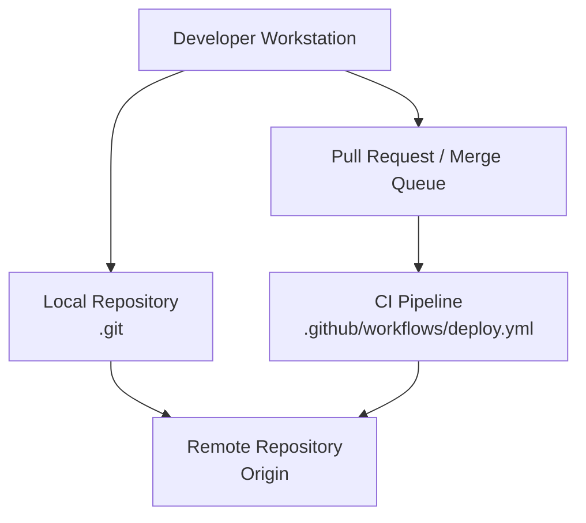
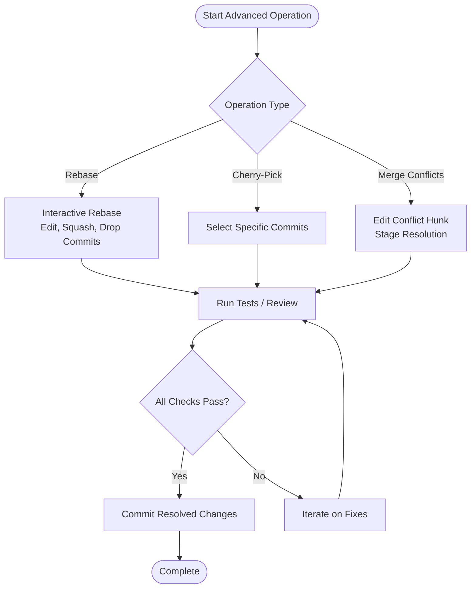
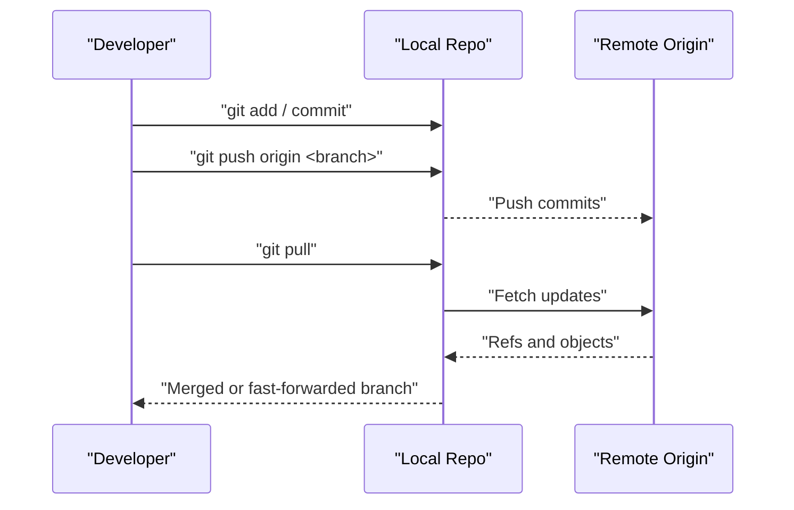
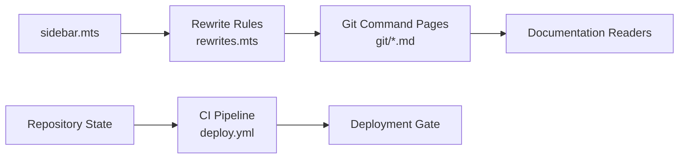
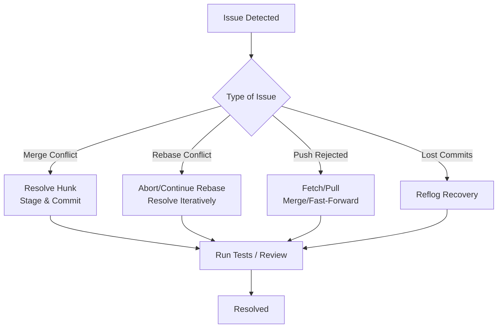

# Version Control and Collaboration

<cite>
**Referenced Files in This Document**
- [sidebar.mts](file://docs/.vitepress/config/sidebar.mts)
- [rewrites.mts](file://docs/.vitepress/config/rewrites.mts)
- [.gitignore](file://.gitignore)
- [README.md](file://README.md)
- [deploy.yml](file://.github/workflows/deploy.yml)
</cite>

## Table of Contents
1. [Introduction](#introduction)
2. [Project Structure](#project-structure)
3. [Core Components](#core-components)
4. [Architecture Overview](#architecture-overview)
5. [Detailed Component Analysis](#detailed-component-analysis)
6. [Dependency Analysis](#dependency-analysis)
7. [Performance Considerations](#performance-considerations)
8. [Troubleshooting Guide](#troubleshooting-guide)
9. [Conclusion](#conclusion)
10. [Appendices](#appendices)

## Introduction
This document consolidates version control and collaboration practices grounded in Git workflows and team coordination. It covers repository setup, branch management, commit strategies, advanced operations (rebasing, cherry-picking, merge conflict resolution), remote workflows, pull request processes, code review procedures, branching strategies (including Git Flow and GitHub Flow), collaborative workflows (feature branches, release management), best practices for commit messages and issue tracking integration, and automated CI/CD pipeline alignment.

## Project Structure
The repository includes a dedicated Git documentation subsystem integrated into the documentation site. The navigation exposes a “Git Commands” section with categorized topics such as configuration, initialization, status, staging, committing, branches, switching, merging, tags, stashing, remotes, fetching, pulling, pushing, cherry-picking, reverting, rebasing, showing details, and logging. URL rewriting ensures clean routing to individual command pages.

```mermaid
graph TB
subgraph "Documentation Site"
SB["Sidebar<br/>\"Git Commands\" section"]
RW["Rewrite Rules<br/>Route aliases to /git/*"]
GC["Git Command Pages<br/>git-*.md"]
end
SB --> RW
RW --> GC
```

**Diagram sources**
- [sidebar.mts:1252-1392](file://docs/.vitepress/config/sidebar.mts#L1252-L1392)
- [rewrites.mts:253-269](file://docs/.vitepress/config/rewrites.mts#L253-L269)

**Section sources**
- [sidebar.mts:1252-1392](file://docs/.vitepress/config/sidebar.mts#L1252-L1392)
- [rewrites.mts:253-269](file://docs/.vitepress/config/rewrites.mts#L253-L269)

## Core Components
- Git command taxonomy and navigation: The documentation site organizes Git commands into logical groups (setup/configuration, creation, basics, branches/merges, sharing/updating, patches, inspection/comparison), enabling quick discovery and cross-linking.
- Routing and aliasing: Rewrite rules map legacy documentation paths to canonical /git/* routes, ensuring consistent URLs for Git command pages.
- Repository metadata: Global ignore rules and top-level documentation provide baseline collaboration hygiene and project context.

Practical implications:
- Onboarding contributors benefit from structured navigation and canonical URLs.
- Maintainers can evolve content without breaking links via rewrite rules.
- Consistent ignore rules reduce noise and improve repository health.

**Section sources**
- [sidebar.mts:1252-1392](file://docs/.vitepress/config/sidebar.mts#L1252-L1392)
- [rewrites.mts:253-269](file://docs/.vitepress/config/rewrites.mts#L253-L269)
- [.gitignore](file://.gitignore)
- [README.md](file://README.md)

## Architecture Overview
The Git collaboration architecture integrates local development, remote synchronization, and CI/CD automation. The diagram below maps the primary components and their interactions.



**Diagram sources**
- [deploy.yml](file://.github/workflows/deploy.yml)

**Section sources**
- [deploy.yml](file://.github/workflows/deploy.yml)

## Detailed Component Analysis

### Git Fundamentals
- Repository setup: Initialize repositories locally and clone remote origins. Configure user identity and editor preferences for consistent commits.
- Branch management: Create, list, switch, and delete branches. Use feature branches to isolate work and maintain a clean main/trunk.
- Commit strategies: Keep commits small, focused, and atomic. Write clear commit messages aligned with conventional formats.

Best practices:
- Use meaningful branch names and prefixes (e.g., feature/, fix/, chore/) to clarify intent.
- Squash or reword commits before merging to maintain a clean history.

**Section sources**
- [sidebar.mts:1252-1392](file://docs/.vitepress/config/sidebar.mts#L1252-L1392)

### Advanced Git Features
- Rebasing: Reapply commits on top of another base tip to keep histories linear. Useful for cleaning up local history before sharing.
- Cherry-picking: Apply specific commits from one branch to another. Use for targeted fixes or selective inclusion.
- Merge conflict resolution: Resolve conflicts by editing conflicted hunks, testing changes, and committing the resolved state.



**Diagram sources**
- [sidebar.mts:1252-1392](file://docs/.vitepress/config/sidebar.mts#L1252-L1392)

**Section sources**
- [sidebar.mts:1252-1392](file://docs/.vitepress/config/sidebar.mts#L1252-L1392)

### Remote Repository Workflows
- Managing remotes: Add, rename, remove, and inspect remote repositories. Set push/pull defaults to streamline collaboration.
- Fetching and pulling: Fetch updates without auto-merging; pull to integrate remote changes into your working branch.
- Pushing: Share local commits with collaborators. Enforce fast-forward or require reviews via protected branches.



**Diagram sources**
- [sidebar.mts:1252-1392](file://docs/.vitepress/config/sidebar.mts#L1252-L1392)

**Section sources**
- [sidebar.mts:1252-1392](file://docs/.vitepress/config/sidebar.mts#L1252-L1392)

### Pull Requests and Code Reviews
- Create pull requests to propose changes, request reviews, and enable discussions before merging.
- Use review tools to annotate lines, suggest changes, approve, and ensure checks pass.
- Merge after approvals and successful CI runs.

Collaboration tips:
- Keep PRs small and focused.
- Reference related issues and include screenshots or reproduction steps when applicable.

**Section sources**
- [sidebar.mts:1252-1392](file://docs/.vitepress/config/sidebar.mts#L1252-L1392)

### Branching Strategies
- Git Flow: Use develop/main branches with feature, release, and hotfix branches to manage releases and long-lived development.
- GitHub Flow: Simplified model with a single main branch and short-lived feature branches; deploy frequently and keep main production-ready.

Choose strategy based on release cadence and risk tolerance.

**Section sources**
- [sidebar.mts:1252-1392](file://docs/.vitepress/config/sidebar.mts#L1252-L1392)

### Collaborative Workflows
- Feature branches: Develop isolated features; open PRs early for visibility.
- Release management: Tag releases, cut release branches, and backport fixes as needed.
- Team coordination: Establish standards for commit messages, PR templates, and review guidelines.

**Section sources**
- [sidebar.mts:1252-1392](file://docs/.vitepress/config/sidebar.mts#L1252-L1392)

### Practical Examples and Commands
- Initialization and configuration: git init, git clone, git config
- Staging and committing: git add, git commit, git status
- Branching and switching: git branch, git switch
- Sharing and updating: git remote, git fetch, git pull, git push
- Patch operations: git cherry-pick, git revert, git rebase
- Inspection: git show, git log

These commands are cataloged under the “Git Commands” section with canonical routes for easy access.

**Section sources**
- [sidebar.mts:1252-1392](file://docs/.vitepress/config/sidebar.mts#L1252-L1392)
- [rewrites.mts:253-269](file://docs/.vitepress/config/rewrites.mts#L253-L269)

## Dependency Analysis
The documentation site depends on the sidebar and rewrite configurations to expose Git command pages consistently. The CI pipeline depends on repository state and branch protections to gate deployments.



**Diagram sources**
- [sidebar.mts:1252-1392](file://docs/.vitepress/config/sidebar.mts#L1252-L1392)
- [rewrites.mts:253-269](file://docs/.vitepress/config/rewrites.mts#L253-L269)
- [deploy.yml](file://.github/workflows/deploy.yml)

**Section sources**
- [sidebar.mts:1252-1392](file://docs/.vitepress/config/sidebar.mts#L1252-L1392)
- [rewrites.mts:253-269](file://docs/.vitepress/config/rewrites.mts#L253-L269)
- [deploy.yml](file://.github/workflows/deploy.yml)

## Performance Considerations
- Keep histories linear with strategic rebasing to simplify merges and reduce conflict density.
- Prefer shallow clones for large repositories when depth is sufficient.
- Use .gitignore to exclude unnecessary files and caches to minimize network overhead.

[No sources needed since this section provides general guidance]

## Troubleshooting Guide
Common issues and resolutions:
- Merge conflicts: Edit conflicted files, stage resolutions, and commit. Verify tests and review coverage.
- Rebase conflicts: Abort or continue rebasing; resolve conflicts iteratively.
- Push rejected due to non-fast-forward: Incorporate remote changes (pull or fetch) and retry.
- Lost commits after rebase: Use reflog to recover dropped commits before finalizing.



**Section sources**
- [sidebar.mts:1252-1392](file://docs/.vitepress/config/sidebar.mts#L1252-L1392)

## Conclusion
A robust Git and collaboration strategy hinges on disciplined workflows, clear communication, and automated quality gates. The documented command taxonomy, routing, and CI integration provide a scalable foundation for teams to collaborate effectively, maintain clean histories, and deliver reliably.

[No sources needed since this section summarizes without analyzing specific files]

## Appendices

### Best Practices Checklist
- Commit messages: Clear, imperative, scoped; reference issues.
- Branch hygiene: Short-lived feature branches; regular updates from base.
- Code review: Explicit approval; passing checks; minimal diffs.
- CI/CD: Automated tests, linting, and deployment gating.

**Section sources**
- [sidebar.mts:1252-1392](file://docs/.vitepress/config/sidebar.mts#L1252-L1392)
- [deploy.yml](file://.github/workflows/deploy.yml)