# Browser Technologies

<cite>
**Referenced Files in This Document**
- [README.md](file://README.md)
- [docs/index.md](file://docs/index.md)
- [docs/01_前端/03_js/10_DOM.md](file://docs/01_前端/03_js/10_DOM.md)
- [docs/01_前端/03_js/13_DOM_事件.md](file://docs/01_前端/03_js/13_DOM_事件.md)
- [docs/01_前端/03_js/15_cookie.md](file://docs/01_前端/03_js/15_cookie.md)
- [docs/01_前端/03_js/16_WebStorage.md](file://docs/01_前端/03_js/16_WebStorage.md)
- [docs/01_前端/03_js/17_IndexedDB.md](file://docs/01_前端/03_js/17_IndexedDB.md)
- [docs/01_前端/03_js/23_webSocket.md](file://docs/01_前端/03_js/23_webSocket.md)
- [docs/01_前端/04_浏览器/06_跨站请求伪造_CSRF.md](file://docs/01_前端/04_浏览器/06_跨站请求伪造_CSRF.md)
- [docs/04_更多/02_开发者工具/24_性能.md](file://docs/04_更多/02_开发者工具/24_性能.md)
- [docs/04_更多/02_开发者工具/25_渲染.md](file://docs/04_更多/02_开发者工具/25_渲染.md)
- [docs/04_更多/02_开发者工具/26_渲染性能问题.md](file://docs/04_更多/02_开发者工具/26_渲染性能问题.md)
- [docs/04_更多/02_开发者工具/13_应用_PWA.md](file://docs/04_更多/02_开发者工具/13_应用_PWA.md)
- [docs/04_更多/02_开发者工具/14_应用_存储.md](file://docs/04_更多/02_开发者工具/14_应用_存储.md)
- [docs/04_更多/02_开发者工具/15_应用_后台服务.md](file://docs/04_更多/02_开发者工具/15_应用_后台服务.md)
- [docs/04_更多/02_开发者工具/16_应用_框架.md](file://docs/04_更多/02_开发者工具/16_应用_框架.md)
- [docs/04_更多/02_开发者工具/17_源代码.md](file://docs/04_更多/02_开发者工具/17_源代码.md)
- [docs/04_更多/02_开发者工具/18_源代码_查看文件.md](file://docs/04_更多/02_开发者工具/18_源代码_查看文件.md)
- [docs/04_更多/02_开发者工具/19_源代码_代码段.md](file://docs/04_更多/02_开发者工具/19_源代码_代码段.md)
- [docs/04_更多/02_开发者工具/20_源代码_编辑文件.md](file://docs/04_更多/02_开发者工具/20_源代码_编辑文件.md)
- [docs/04_更多/02_开发者工具/21_源代码_本地替换.md](file://docs/04_更多/02_开发者工具/21_源代码_本地替换.md)
- [docs/04_更多/02_开发者工具/22_源代码_断点.md](file://docs/04_更多/02_开发者工具/22_源代码_断点.md)
- [docs/04_更多/02_开发者工具/23_源代码_调试.md](file://docs/04_更多/02_开发者工具/23_源代码_调试.md)
- [docs/.vitepress/config/sidebar.mts](file://docs/.vitepress/config/sidebar.mts)
- [docs/.vitepress/config/rewrites.mts](file://docs/.vitepress/config/rewrites.mts)
- [源码学习/vue@2.6.14/_源码/platforms/web/runtime/transition-util.js](file://源码学习/vue@2.6.14/_源码/platforms/web/runtime/transition-util.js)
- [源码学习/vue@2.6.14/_源码/platforms/web/util/element.js](file://源码学习/vue@2.6.14/_源码/platforms/web/util/element.js)
- [源码学习/vite@5.2.11/playground/worker/worker/main-classic.js](file://源码学习/vite@5.2.11/playground/worker/worker/main-classic.js)
- [源码学习/vite@5.2.11/playground/worker/worker/main-url.js](file://源码学习/vite@5.2.11/playground/worker/worker/main-url.js)
- [源码学习/vite@5.2.11/playground/worker/worker/main-module.js](file://源码学习/vite@5.2.11/playground/worker/worker/main-module.js)
- [源码学习/vite@5.2.11/playground/worker/worker/main-deeply-nested.js](file://源码学习/vite@5.2.11/playground/worker/worker/main-deeply-nested.js)
- [源码学习/vite@5.2.11/playground/worker/__tests__/es/worker-es.spec.ts](file://源码学习/vite@5.2.11/playground/worker/__tests__/es/worker-es.spec.ts)
- [源码学习/vite@5.2.11/playground/worker/__tests__/iife/worker-iife.spec.ts](file://源码学习/vite@5.2.11/playground/worker/__tests__/iife/worker-iife.spec.ts)
- [源码学习/vite@5.2.11/playground/worker/__tests__/relative-base/worker-relative-base.spec.ts](file://源码学习/vite@5.2.11/playground/worker/__tests__/relative-base/worker-relative-base.spec.ts)
- [源码学习/webpack@5.68.0/webpack 依赖包/webpack-dev-server/client/modules/logger/index.js](file://源码学习/webpack@5.68.0/webpack 依赖包/webpack-dev-server/client/modules/logger/index.js)
- [源码学习/webpack@5.68.0/webpack 依赖包/webpack-dev-server/client/modules/sockjs-client/index.js](file://源码学习/webpack@5.68.0/webpack 依赖包/webpack-dev-server/client/modules/sockjs-client/index.js)
- [源码学习/vue@3.5.26/code/temp/packages/runtime-core/src/profiling.d.ts](file://源码学习/vue@3.5.26/code/temp/packages/runtime-core/src/profiling.d.ts)
</cite>

## Table of Contents
1. [Introduction](#introduction)
2. [Project Structure](#project-structure)
3. [Core Components](#core-components)
4. [Architecture Overview](#architecture-overview)
5. [Detailed Component Analysis](#detailed-component-analysis)
6. [Dependency Analysis](#dependency-analysis)
7. [Performance Considerations](#performance-considerations)
8. [Troubleshooting Guide](#troubleshooting-guide)
9. [Conclusion](#conclusion)
10. [Appendices](#appendices)

## Introduction
This document consolidates browser technologies and modern web APIs from the repository’s documentation and code samples. It focuses on DOM manipulation, storage mechanisms, web workers, performance optimization, developer tools, debugging techniques, cross-browser compatibility, WebSocket communication, service workers, CSP policies, security considerations, and practical feature detection and polyfill strategies. The content is derived from the repository’s documentation and selected source files that demonstrate real-world usage patterns.

## Project Structure
The repository organizes browser-related topics under a dedicated documentation tree and includes hands-on examples in build tooling and framework code. The most relevant areas for this document are:
- Frontend documentation covering HTML/CSS/JS fundamentals, DOM, events, storage, IndexedDB, and WebSocket.
- Developer Tools documentation with performance, rendering, application panels, and sources.
- Build tooling examples demonstrating Web Worker usage and bundling behavior.
- Framework internals showing DOM transitions, element detection, and profiling hooks.

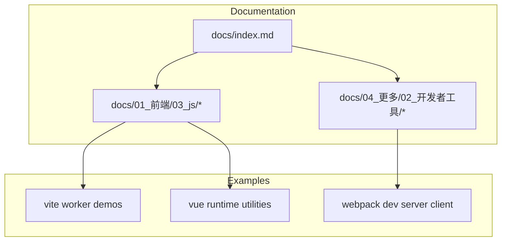

**Section sources**
- [README.md](file://README.md)
- [docs/index.md](file://docs/index.md)

## Core Components
- DOM Manipulation and Events: DOM fundamentals, event handling, and transition utilities.
- Storage Mechanisms: Cookies, localStorage/sessionStorage, and IndexedDB.
- Web Workers: Classic and module workers, SharedWorker, inlining, and nested worker patterns.
- Performance and Profiling: Rendering metrics, measurement utilities, and logging.
- Developer Tools: Application panel coverage (PWA, storage, background services, frameworks), Sources, Performance, Memory, Rendering, Animations, Coverage.
- Cross-Browser Compatibility: Feature detection and vendor-specific handling.
- Security and CSP: CSRF protection and policy considerations.
- Modern Web APIs: WebSocket, service workers, and related communication patterns.

**Section sources**
- [docs/01_前端/03_js/10_DOM.md](file://docs/01_前端/03_js/10_DOM.md)
- [docs/01_前端/03_js/13_DOM_事件.md](file://docs/01_前端/03_js/13_DOM_事件.md)
- [docs/01_前端/03_js/15_cookie.md](file://docs/01_前端/03_js/15_cookie.md)
- [docs/01_前端/03_js/16_WebStorage.md](file://docs/01_前端/03_js/16_WebStorage.md)
- [docs/01_前端/03_js/17_IndexedDB.md](file://docs/01_前端/03_js/17_IndexedDB.md)
- [docs/01_前端/03_js/23_webSocket.md](file://docs/01_前端/03_js/23_webSocket.md)
- [docs/01_前端/04_浏览器/06_跨站请求伪造_CSRF.md](file://docs/01_前端/04_浏览器/06_跨站请求伪造_CSRF.md)
- [docs/04_更多/02_开发者工具/24_性能.md](file://docs/04_更多/02_开发者工具/24_性能.md)
- [docs/04_更多/02_开发者工具/25_渲染.md](file://docs/04_更多/02_开发者工具/25_渲染.md)
- [docs/04_更多/02_开发者工具/26_渲染性能问题.md](file://docs/04_更多/02_开发者工具/26_渲染性能问题.md)
- [docs/04_更多/02_开发者工具/13_应用_PWA.md](file://docs/04_更多/02_开发者工具/13_应用_PWA.md)
- [docs/04_更多/02_开发者工具/14_应用_存储.md](file://docs/04_更多/02_开发者工具/14_应用_存储.md)
- [docs/04_更多/02_开发者工具/15_应用_后台服务.md](file://docs/04_更多/02_开发者工具/15_应用_后台服务.md)
- [docs/04_更多/02_开发者工具/16_应用_框架.md](file://docs/04_更多/02_开发者工具/16_应用_框架.md)
- [docs/04_更多/02_开发者工具/17_源代码.md](file://docs/04_更多/02_开发者工具/17_源代码.md)
- [docs/04_更多/02_开发者工具/18_源代码_查看文件.md](file://docs/04_更多/02_开发者工具/18_源代码_查看文件.md)
- [docs/04_更多/02_开发者工具/19_源代码_代码段.md](file://docs/04_更多/02_开发者工具/19_源代码_代码段.md)
- [docs/04_更多/02_开发者工具/20_源代码_编辑文件.md](file://docs/04_更多/02_开发者工具/20_源代码_编辑文件.md)
- [docs/04_更多/02_开发者工具/21_源代码_本地替换.md](file://docs/04_更多/02_开发者工具/21_源代码_本地替换.md)
- [docs/04_更多/02_开发者工具/22_源代码_断点.md](file://docs/04_更多/02_开发者工具/22_源代码_断点.md)
- [docs/04_更多/02_开发者工具/23_源代码_调试.md](file://docs/04_更多/02_开发者工具/23_源代码_调试.md)

## Architecture Overview
The browser technology stack integrates DOM APIs, storage, networking, and worker threads, coordinated by developer tools and build tooling. The following diagram maps the major components and their relationships.

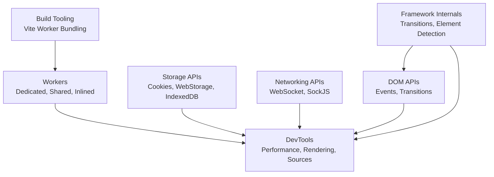

**Diagram sources**
- [docs/01_前端/03_js/10_DOM.md](file://docs/01_前端/03_js/10_DOM.md)
- [docs/01_前端/03_js/13_DOM_事件.md](file://docs/01_前端/03_js/13_DOM_事件.md)
- [docs/01_前端/03_js/15_cookie.md](file://docs/01_前端/03_js/15_cookie.md)
- [docs/01_前端/03_js/16_WebStorage.md](file://docs/01_前端/03_js/16_WebStorage.md)
- [docs/01_前端/03_js/17_IndexedDB.md](file://docs/01_前端/03_js/17_IndexedDB.md)
- [docs/01_前端/03_js/23_webSocket.md](file://docs/01_前端/03_js/23_webSocket.md)
- [docs/04_更多/02_开发者工具/24_性能.md](file://docs/04_更多/02_开发者工具/24_性能.md)
- [docs/04_更多/02_开发者工具/25_渲染.md](file://docs/04_更多/02_开发者工具/25_渲染.md)
- [docs/04_更多/02_开发者工具/17_源代码.md](file://docs/04_更多/02_开发者工具/17_源代码.md)
- [源码学习/vite@5.2.11/playground/worker/worker/main-classic.js](file://源码学习/vite@5.2.11/playground/worker/worker/main-classic.js)
- [源码学习/vite@5.2.11/playground/worker/worker/main-url.js](file://源码学习/vite@5.2.11/playground/worker/worker/main-url.js)
- [源码学习/vite@5.2.11/playground/worker/worker/main-module.js](file://源码学习/vite@5.2.11/playground/worker/worker/main-module.js)
- [源码学习/vue@2.6.14/_源码/platforms/web/runtime/transition-util.js](file://源码学习/vue@2.6.14/_源码/platforms/web/runtime/transition-util.js)
- [源码学习/webpack@5.68.0/webpack 依赖包/webpack-dev-server/client/modules/logger/index.js](file://源码学习/webpack@5.68.0/webpack 依赖包/webpack-dev-server/client/modules/logger/index.js)

## Detailed Component Analysis

### DOM Manipulation and Events
- DOM fundamentals and event handling form the backbone of interactive web experiences.
- Transition utilities demonstrate measuring CSS transitions/animations and handling vendor differences.

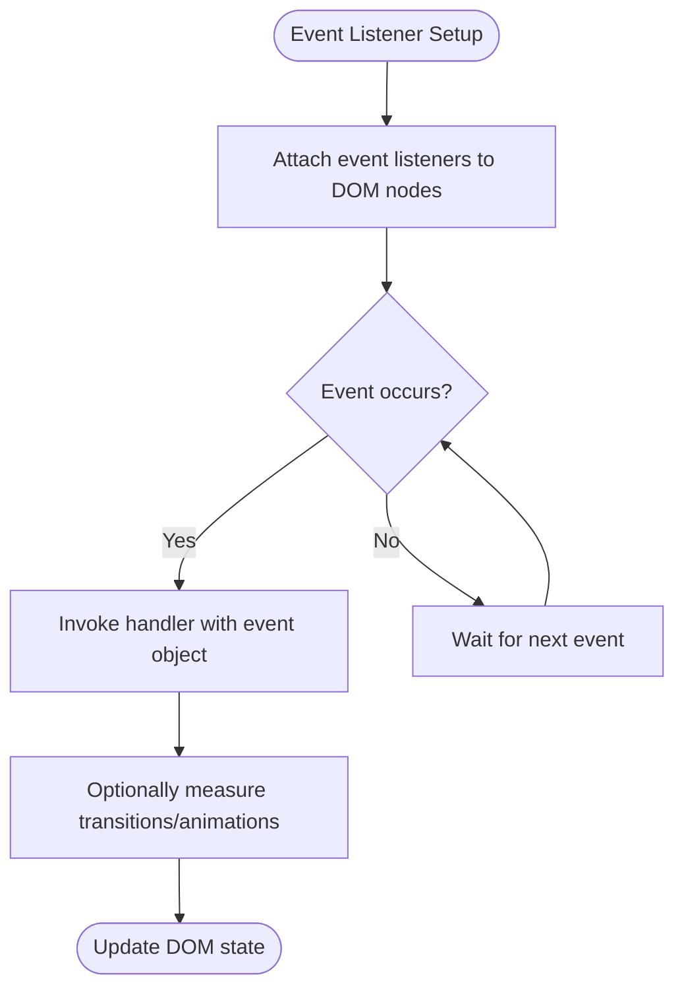

**Diagram sources**
- [docs/01_前端/03_js/10_DOM.md](file://docs/01_前端/03_js/10_DOM.md)
- [docs/01_前端/03_js/13_DOM_事件.md](file://docs/01_前端/03_js/13_DOM_事件.md)
- [源码学习/vue@2.6.14/_源码/platforms/web/runtime/transition-util.js](file://源码学习/vue@2.6.14/_源码/platforms/web/runtime/transition-util.js)

**Section sources**
- [docs/01_前端/03_js/10_DOM.md](file://docs/01_前端/03_js/10_DOM.md)
- [docs/01_前端/03_js/13_DOM_事件.md](file://docs/01_前端/03_js/13_DOM_事件.md)
- [源码学习/vue@2.6.14/_源码/platforms/web/runtime/transition-util.js](file://源码学习/vue@2.6.14/_源码/platforms/web/runtime/transition-util.js)

### Storage Mechanisms
- Cookies: Server-controlled state with attributes and security considerations.
- WebStorage: Key-value storage via localStorage/sessionStorage.
- IndexedDB: Client-side database for structured data and large objects.

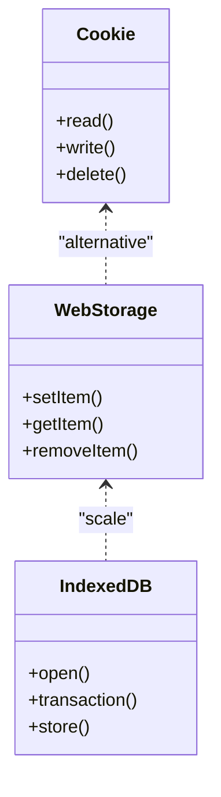

**Diagram sources**
- [docs/01_前端/03_js/15_cookie.md](file://docs/01_前端/03_js/15_cookie.md)
- [docs/01_frontend/03_js/16_WebStorage.md](file://docs/01_前端/03_js/16_WebStorage.md)
- [docs/01_前端/03_js/17_IndexedDB.md](file://docs/01_前端/03_js/17_IndexedDB.md)

**Section sources**
- [docs/01_前端/03_js/15_cookie.md](file://docs/01_前端/03_js/15_cookie.md)
- [docs/01_前端/03_js/16_WebStorage.md](file://docs/01_前端/03_js/16_WebStorage.md)
- [docs/01_前端/03_js/17_IndexedDB.md](file://docs/01_前端/03_js/17_IndexedDB.md)

### Web Workers and SharedWorker
- Dedicated workers process tasks off the main thread.
- SharedWorker allows multiple browsing contexts to share a single worker.
- Vite demonstrates module vs classic workers, URL-based worker creation, inlined workers, and nested worker scenarios.

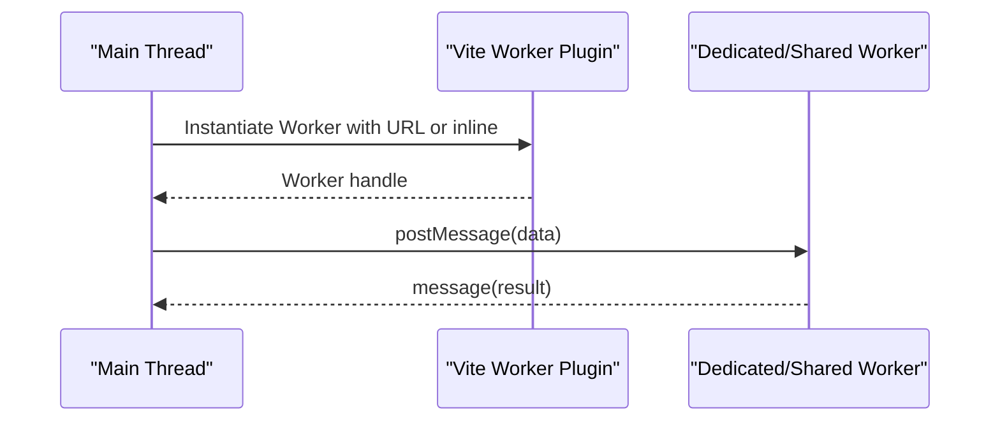

**Diagram sources**
- [源码学习/vite@5.2.11/playground/worker/worker/main-classic.js](file://源码学习/vite@5.2.11/playground/worker/worker/main-classic.js)
- [源码学习/vite@5.2.11/playground/worker/worker/main-url.js](file://源码学习/vite@5.2.11/playground/worker/worker/main-url.js)
- [源码学习/vite@5.2.11/playground/worker/worker/main-module.js](file://源码学习/vite@5.2.11/playground/worker/worker/main-module.js)
- [源码学习/vite@5.2.11/playground/worker/worker/main-deeply-nested.js](file://源码学习/vite@5.2.11/playground/worker/worker/main-deeply-nested.js)

**Section sources**
- [源码学习/vite@5.2.11/playground/worker/worker/main-classic.js](file://源码学习/vite@5.2.11/playground/worker/worker/main-classic.js)
- [源码学习/vite@5.2.11/playground/worker/worker/main-url.js](file://源码学习/vite@5.2.11/playground/worker/worker/main-url.js)
- [源码学习/vite@5.2.11/playground/worker/worker/main-module.js](file://源码学习/vite@5.2.11/playground/worker/worker/main-module.js)
- [源码学习/vite@5.2.11/playground/worker/worker/main-deeply-nested.js](file://源码学习/vite@5.2.11/playground/worker/worker/main-deeply-nested.js)
- [源码学习/vite@5.2.11/playground/worker/__tests__/es/worker-es.spec.ts](file://源码学习/vite@5.2.11/playground/worker/__tests__/es/worker-es.spec.ts)
- [源码学习/vite@5.2.11/playground/worker/__tests__/iife/worker-iife.spec.ts](file://源码学习/vite@5.2.11/playground/worker/__tests__/iife/worker-iife.spec.ts)
- [源码学习/vite@5.2.11/playground/worker/__tests__/relative-base/worker-relative-base.spec.ts](file://源码学习/vite@5.2.11/playground/worker/__tests__/relative-base/worker-relative-base.spec.ts)

### Performance Optimization and Profiling
- Rendering metrics and transition timing inform layout and paint performance.
- Logging utilities support profiling and time measurements in development servers.
- Vue profiling hooks enable component-level measurement.

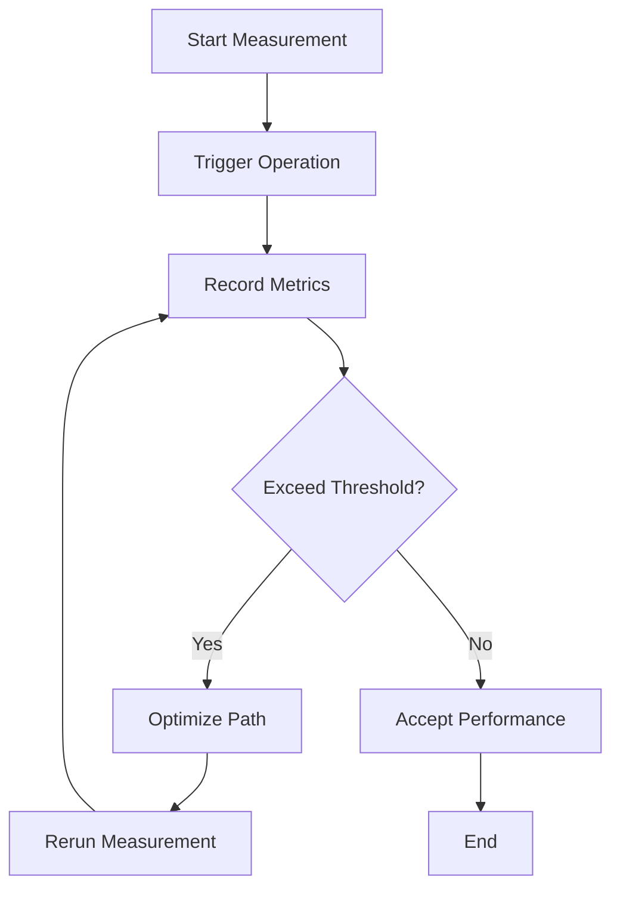

**Diagram sources**
- [源码学习/vue@2.6.14/_源码/platforms/web/runtime/transition-util.js](file://源码学习/vue@2.6.14/_源码/platforms/web/runtime/transition-util.js)
- [源码学习/webpack@5.68.0/webpack 依赖包/webpack-dev-server/client/modules/logger/index.js](file://源码学习/webpack@5.68.0/webpack 依赖包/webpack-dev-server/client/modules/logger/index.js)
- [源码学习/vue@3.5.26/code/temp/packages/runtime-core/src/profiling.d.ts](file://源码学习/vue@3.5.26/code/temp/packages/runtime-core/src/profiling.d.ts)

**Section sources**
- [docs/04_更多/02_开发者工具/24_性能.md](file://docs/04_更多/02_开发者工具/24_性能.md)
- [docs/04_更多/02_开发者工具/25_渲染.md](file://docs/04_更多/02_开发者工具/25_渲染.md)
- [docs/04_更多/02_开发者工具/26_渲染性能问题.md](file://docs/04_更多/02_开发者工具/26_渲染性能问题.md)
- [源码学习/vue@2.6.14/_源码/platforms/web/runtime/transition-util.js](file://源码学习/vue@2.6.14/_源码/platforms/web/runtime/transition-util.js)
- [源码学习/webpack@5.68.0/webpack 依赖包/webpack-dev-server/client/modules/logger/index.js](file://源码学习/webpack@5.68.0/webpack 依赖包/webpack-dev-server/client/modules/logger/index.js)
- [源码学习/vue@3.5.26/code/temp/packages/runtime-core/src/profiling.d.ts](file://源码学习/vue@3.5.26/code/temp/packages/runtime-core/src/profiling.d.ts)

### Developer Tools and Debugging
- Application panel covers PWA, storage, background services, and framework insights.
- Sources provide file viewing, snippets, editing, local overrides, breakpoints, and debugging.
- Performance and Rendering panels support timeline analysis and effect inspection.

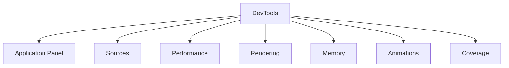

**Diagram sources**
- [docs/.vitepress/config/sidebar.mts](file://docs/.vitepress/config/sidebar.mts)
- [docs/.vitepress/config/rewrites.mts](file://docs/.vitepress/config/rewrites.mts)
- [docs/04_更多/02_开发者工具/13_应用_PWA.md](file://docs/04_更多/02_开发者工具/13_应用_PWA.md)
- [docs/04_更多/02_开发者工具/14_应用_存储.md](file://docs/04_更多/02_开发者工具/14_应用_存储.md)
- [docs/04_更多/02_开发者工具/15_应用_后台服务.md](file://docs/04_更多/02_开发者工具/15_应用_后台服务.md)
- [docs/04_更多/02_开发者工具/16_应用_框架.md](file://docs/04_更多/02_开发者工具/16_应用_框架.md)
- [docs/04_更多/02_开发者工具/17_源代码.md](file://docs/04_更多/02_开发者工具/17_源代码.md)
- [docs/04_更多/02_开发者工具/18_源代码_查看文件.md](file://docs/04_更多/02_开发者工具/18_源代码_查看文件.md)
- [docs/04_更多/02_开发者工具/19_源代码_代码段.md](file://docs/04_更多/02_开发者工具/19_源代码_代码段.md)
- [docs/04_更多/02_开发者工具/20_源代码_编辑文件.md](file://docs/04_更多/02_开发者工具/20_源代码_编辑文件.md)
- [docs/04_更多/02_开发者工具/21_源代码_本地替换.md](file://docs/04_更多/02_开发者工具/21_源代码_本地替换.md)
- [docs/04_更多/02_开发者工具/22_源代码_断点.md](file://docs/04_更多/02_开发者工具/22_源代码_断点.md)
- [docs/04_更多/02_开发者工具/23_源代码_调试.md](file://docs/04_更多/02_开发者工具/23_源代码_调试.md)
- [docs/04_更多/02_开发者工具/24_性能.md](file://docs/04_更多/02_开发者工具/24_性能.md)
- [docs/04_更多/02_开发者工具/25_渲染.md](file://docs/04_更多/02_开发者工具/25_渲染.md)
- [docs/04_更多/02_开发者工具/26_渲染性能问题.md](file://docs/04_更多/02_开发者工具/26_渲染性能问题.md)

**Section sources**
- [docs/.vitepress/config/sidebar.mts](file://docs/.vitepress/config/sidebar.mts)
- [docs/.vitepress/config/rewrites.mts](file://docs/.vitepress/config/rewrites.mts)

### Cross-Browser Compatibility Strategies
- Feature detection ensures graceful fallbacks for unsupported APIs.
- Vendor-specific handling accounts for differences in CSS property parsing and DOM behavior.

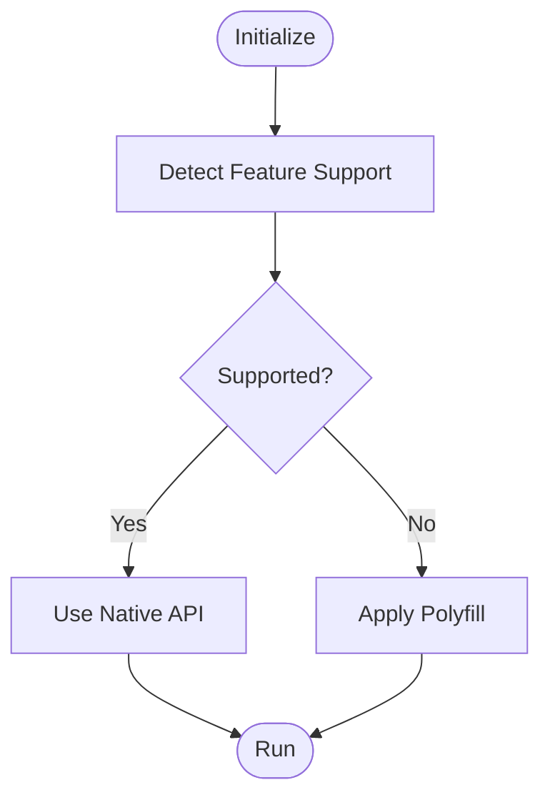

**Diagram sources**
- [源码学习/vue@2.6.14/_源码/platforms/web/util/element.js](file://源码学习/vue@2.6.14/_源码/platforms/web/util/element.js)

**Section sources**
- [源码学习/vue@2.6.14/_源码/platforms/web/util/element.js](file://源码学习/vue@2.6.14/_源码/platforms/web/util/element.js)

### WebSocket Communication
- WebSocket enables bidirectional real-time communication.
- Legacy transport fallbacks (e.g., SockJS) improve compatibility and resilience.

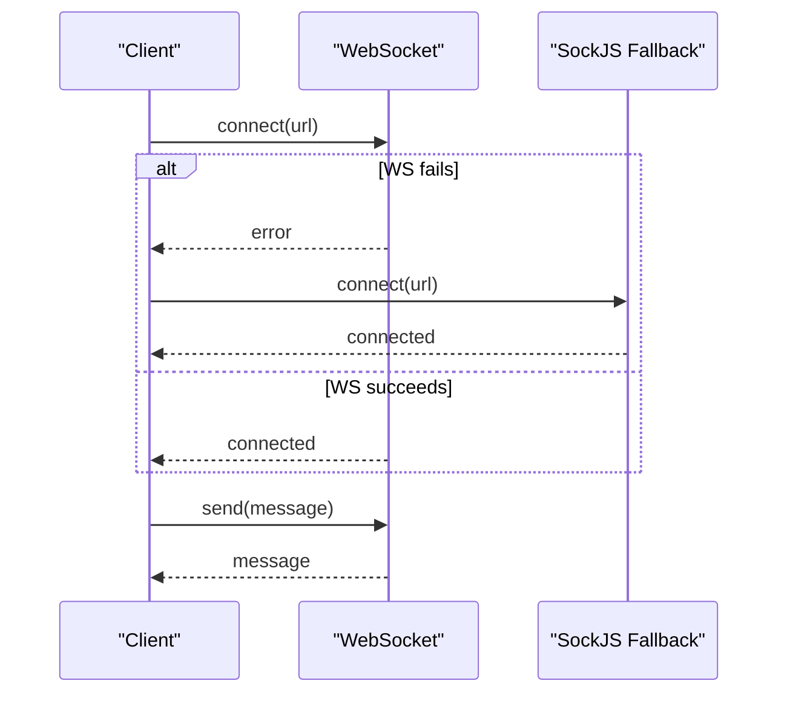

**Diagram sources**
- [docs/01_前端/03_js/23_webSocket.md](file://docs/01_前端/03_js/23_webSocket.md)
- [源码学习/webpack@5.68.0/webpack 依赖包/webpack-dev-server/client/modules/sockjs-client/index.js](file://源码学习/webpack@5.68.0/webpack 依赖包/webpack-dev-server/client/modules/sockjs-client/index.js)

**Section sources**
- [docs/01_前端/03_js/23_webSocket.md](file://docs/01_前端/03_js/23_webSocket.md)
- [源码学习/webpack@5.68.0/webpack 依赖包/webpack-dev-server/client/modules/sockjs-client/index.js](file://源码学习/webpack@5.68.0/webpack 依赖包/webpack-dev-server/client/modules/sockjs-client/index.js)

### Service Workers and Background Services
- Service workers act as proxy between web apps and network/cache, enabling offline and background capabilities.
- Application panel provides visibility into service worker lifecycle and background services.

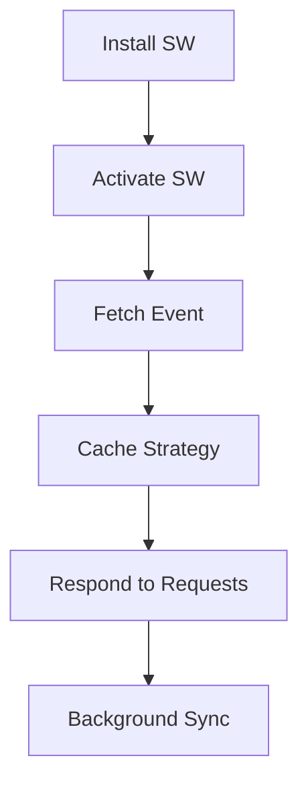

**Diagram sources**
- [docs/04_更多/02_开发者工具/15_应用_后台服务.md](file://docs/04_更多/02_开发者工具/15_应用_后台服务.md)
- [docs/04_更多/02_开发者工具/13_应用_PWA.md](file://docs/04_更多/02_开发者工具/13_应用_PWA.md)

**Section sources**
- [docs/04_更多/02_开发者工具/15_应用_后台服务.md](file://docs/04_更多/02_开发者工具/15_应用_后台服务.md)
- [docs/04_更多/02_开发者工具/13_应用_PWA.md](file://docs/04_更多/02_开发者工具/13_应用_PWA.md)

### CSP Policies and Security Considerations
- Content Security Policy (CSP) directives restrict resource loading and execution.
- CSRF protection strategies mitigate cross-site request forgery risks.

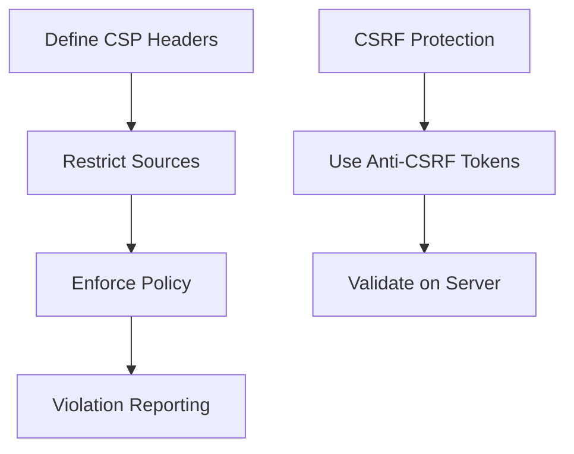

**Diagram sources**
- [docs/01_前端/04_浏览器/06_跨站请求伪造_CSRF.md](file://docs/01_前端/04_浏览器/06_跨站请求伪造_CSRF.md)

**Section sources**
- [docs/01_前端/04_浏览器/06_跨站请求伪造_CSRF.md](file://docs/01_前端/04_浏览器/06_跨站请求伪造_CSRF.md)

### Practical Examples: Feature Detection, Polyfills, and Progressive Enhancement
- Feature detection determines whether native APIs are available.
- Polyfills provide fallback implementations for missing features.
- Progressive enhancement builds core functionality first, then enhances with advanced features.

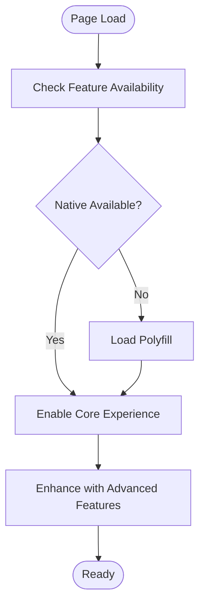

**Diagram sources**
- [源码学习/vue@2.6.14/_源码/platforms/web/util/element.js](file://源码学习/vue@2.6.14/_源码/platforms/web/util/element.js)

**Section sources**
- [源码学习/vue@2.6.14/_源码/platforms/web/util/element.js](file://源码学习/vue@2.6.14/_源码/platforms/web/util/element.js)

## Dependency Analysis
The browser ecosystem exhibits layered dependencies:
- DOM and events depend on platform APIs.
- Storage APIs complement each other for different data sizes and persistence needs.
- Workers depend on build tooling for bundling and inlining.
- Developer tools depend on browser APIs and framework internals for accurate diagnostics.

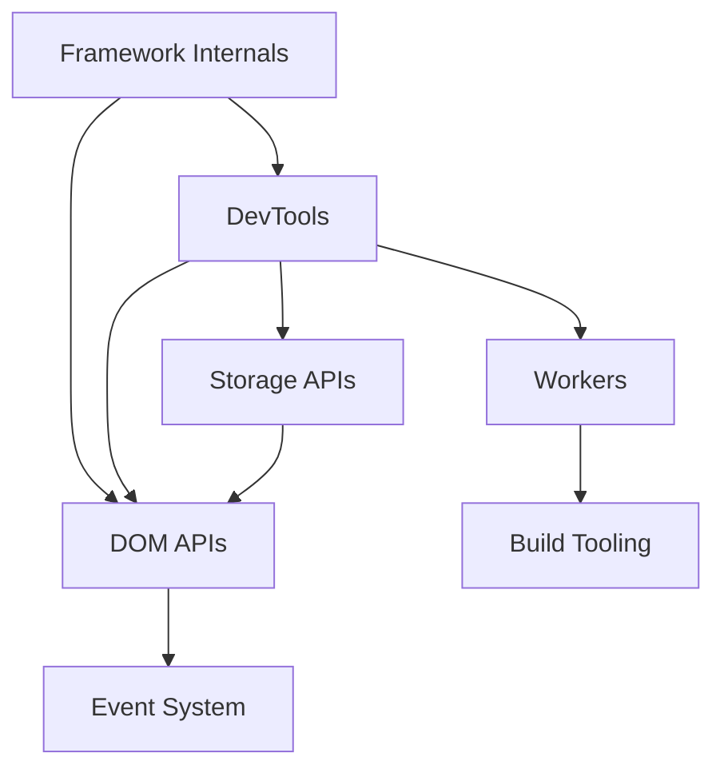

**Diagram sources**
- [docs/01_前端/03_js/10_DOM.md](file://docs/01_前端/03_js/10_DOM.md)
- [docs/01_前端/03_js/16_WebStorage.md](file://docs/01_前端/03_js/16_WebStorage.md)
- [源码学习/vite@5.2.11/playground/worker/__tests__/es/worker-es.spec.ts](file://源码学习/vite@5.2.11/playground/worker/__tests__/es/worker-es.spec.ts)
- [源码学习/vue@2.6.14/_源码/platforms/web/runtime/transition-util.js](file://源码学习/vue@2.6.14/_源码/platforms/web/runtime/transition-util.js)

**Section sources**
- [docs/01_前端/03_js/10_DOM.md](file://docs/01_前端/03_js/10_DOM.md)
- [docs/01_前端/03_js/16_WebStorage.md](file://docs/01_前端/03_js/16_WebStorage.md)
- [源码学习/vite@5.2.11/playground/worker/__tests__/es/worker-es.spec.ts](file://源码学习/vite@5.2.11/playground/worker/__tests__/es/worker-es.spec.ts)
- [源码学习/vue@2.6.14/_源码/platforms/web/runtime/transition-util.js](file://源码学习/vue@2.6.14/_源码/platforms/web/runtime/transition-util.js)

## Performance Considerations
- Prefer module workers for better isolation and caching.
- Minimize synchronous DOM reads/writes; batch updates when possible.
- Use performance APIs to profile long tasks and render-blocking operations.
- Employ lazy loading and code splitting to reduce initial payload.

[No sources needed since this section provides general guidance]

## Troubleshooting Guide
- Use DevTools Performance and Rendering panels to identify bottlenecks.
- Inspect Application panel for service worker and storage issues.
- Leverage Sources panel for breakpoints and step-through debugging.
- Apply logging utilities to capture timing and profiling data during development.

**Section sources**
- [docs/04_更多/02_开发者工具/24_性能.md](file://docs/04_更多/02_开发者工具/24_性能.md)
- [docs/04_更多/02_开发者工具/25_渲染.md](file://docs/04_更多/02_开发者工具/25_渲染.md)
- [docs/04_更多/02_开发者工具/17_源代码.md](file://docs/04_更多/02_开发者工具/17_源代码.md)
- [源码学习/webpack@5.68.0/webpack 依赖包/webpack-dev-server/client/modules/logger/index.js](file://源码学习/webpack@5.68.0/webpack 依赖包/webpack-dev-server/client/modules/logger/index.js)

## Conclusion
This document synthesized browser technologies and modern web APIs from the repository’s documentation and examples. It covered DOM manipulation, storage, workers, performance, developer tools, cross-browser compatibility, security, and practical enhancement strategies. The included diagrams and sources provide a foundation for building robust, maintainable, and performant web applications.

[No sources needed since this section summarizes without analyzing specific files]

## Appendices
- Additional resources and links are organized under the documentation sidebar and rewrites for easy navigation.

**Section sources**
- [docs/.vitepress/config/sidebar.mts](file://docs/.vitepress/config/sidebar.mts)
- [docs/.vitepress/config/rewrites.mts](file://docs/.vitepress/config/rewrites.mts)