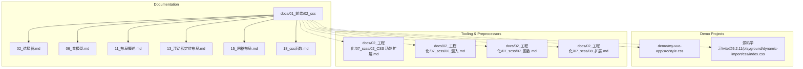
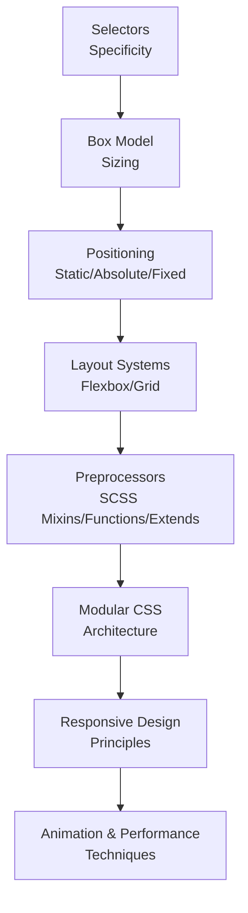
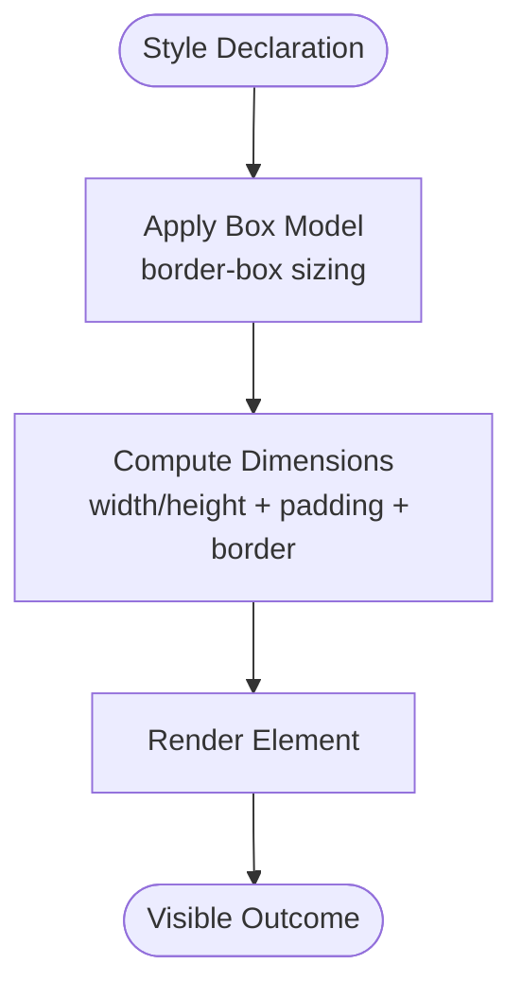
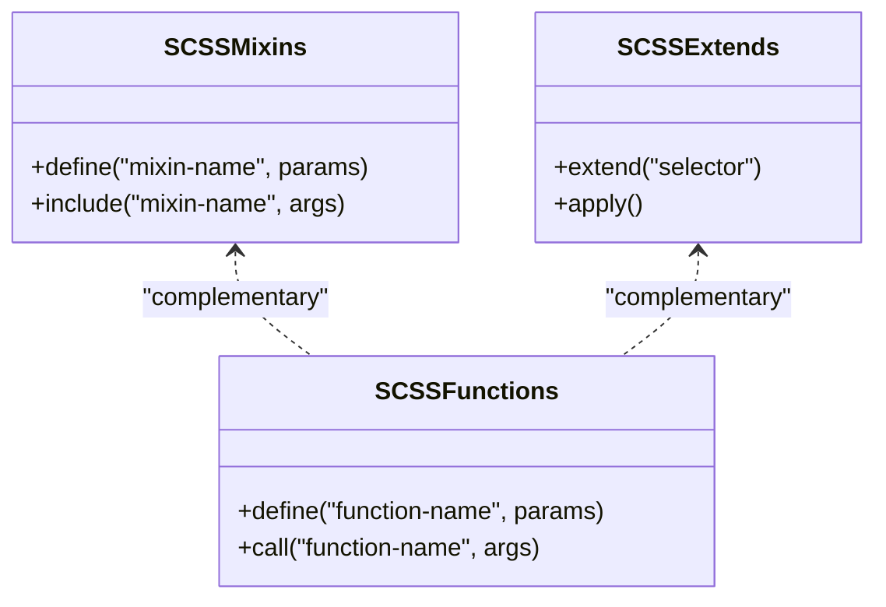
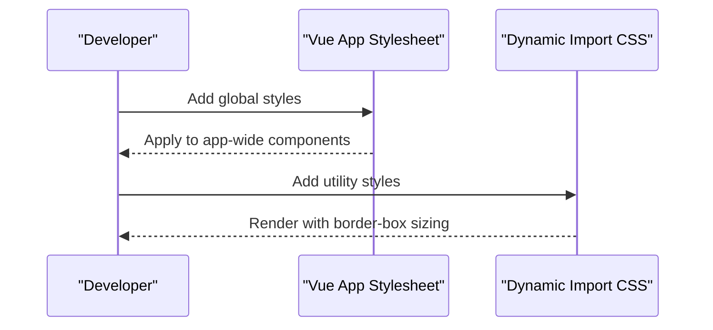
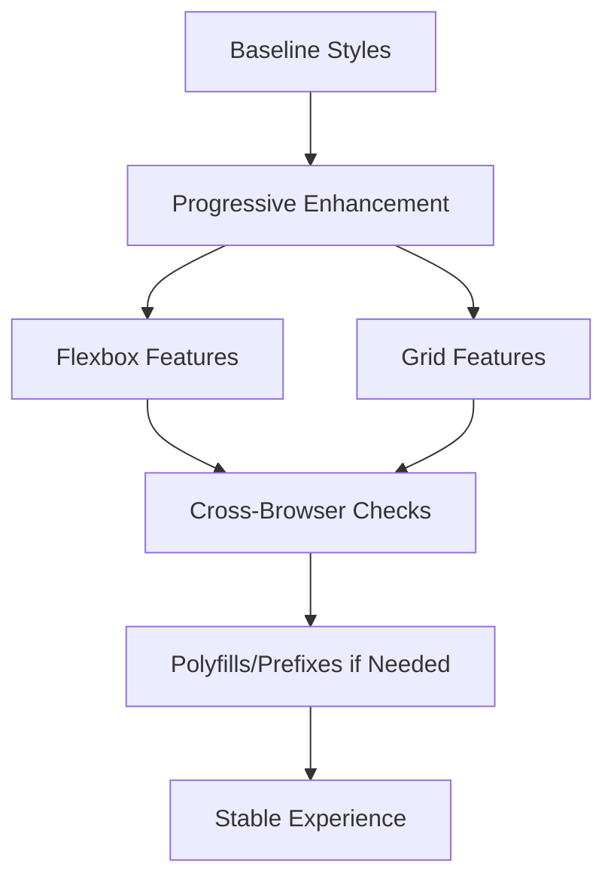
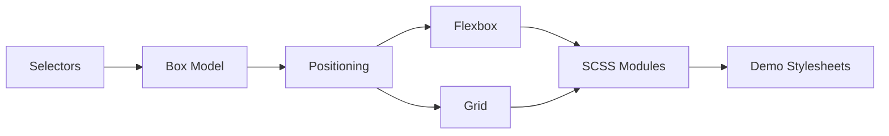

# CSS Styling and Layout

<cite>
**Referenced Files in This Document**
- [style.css](file://demo/my-vue-app/src/style.css)
- [index.css](file://源码学习/vite@5.2.11/playground/dynamic-import/css/index.css)
- [CHANGELOG.md](file://demo/node/02_playground/public/tinymce/CHANGELOG.md)
- [01_index.md](file://docs/01_前端/02_css/01_index.md)
- [02_选择器.md](file://docs/01_前端/02_css/02_选择器.md)
- [06_盒模型.md](file://docs/01_前端/02_css/06_盒模型.md)
- [11_布局概述.md](file://docs/01_前端/02_css/11_布局概述.md)
- [13_浮动和定位布局.md](file://docs/01_前端/02_css/13_浮动和定位布局.md)
- [15_网格布局.md](file://docs/01_前端/02_css/15_网格布局.md)
- [18_css函数.md](file://docs/01_前端/02_css/18_css函数.md)
- [02_CSS 功能扩展.md](file://docs/02_工程化/07_scss/02_CSS 功能扩展.md)
- [06_混入.md](file://docs/02_工程化/07_scss/06_混入.md)
- [07_函数.md](file://docs/02_工程化/07_scss/07_函数.md)
- [08_扩展.md](file://docs/02_工程化/07_scss/08_扩展.md)
</cite>

## Table of Contents
1. [Introduction](#introduction)
2. [Project Structure](#project-structure)
3. [Core Components](#core-components)
4. [Architecture Overview](#architecture-overview)
5. [Detailed Component Analysis](#detailed-component-analysis)
6. [Dependency Analysis](#dependency-analysis)
7. [Performance Considerations](#performance-considerations)
8. [Troubleshooting Guide](#troubleshooting-guide)
9. [Conclusion](#conclusion)
10. [Appendices](#appendices)

## Introduction
This document consolidates CSS styling and layout techniques present across the repository’s documentation and demos. It covers selectors and specificity, the box model, positioning, Flexbox and Grid layouts, responsive design, CSS architecture patterns, animation techniques, performance optimization, preprocessors, custom properties, modular methodologies, and cross-browser compatibility with progressive enhancement strategies. Practical examples are grounded in real files and topics from the repository.

## Project Structure
The repository organizes CSS knowledge in a dedicated front-end section and includes small CSS samples and compiled assets. The primary learning materials reside under docs/01_前端/02_css, while working examples appear in demo projects and build artifacts.

**Diagram sources**
- [01_index.md](file://docs/01_前端/02_css/01_index.md)
- [02_选择器.md](file://docs/01_前端/02_css/02_选择器.md)
- [06_盒模型.md](file://docs/01_前端/02_css/06_盒模型.md)
- [11_布局概述.md](file://docs/01_前端/02_css/11_布局概述.md)
- [13_浮动和定位布局.md](file://docs/01_前端/02_css/13_浮动和定位布局.md)
- [15_网格布局.md](file://docs/01_前端/02_css/15_网格布局.md)
- [18_css函数.md](file://docs/01_前端/02_css/18_css函数.md)
- [style.css](file://demo/my-vue-app/src/style.css)
- [index.css](file://源码学习/vite@5.2.11/playground/dynamic-import/css/index.css)
- [02_CSS 功能扩展.md](file://docs/02_工程化/07_scss/02_CSS 功能扩展.md)
- [06_混入.md](file://docs/02_工程化/07_scss/06_混入.md)
- [07_函数.md](file://docs/02_工程化/07_scss/07_函数.md)
- [08_扩展.md](file://docs/02_工程化/07_scss/08_扩展.md)

**Section sources**
- [01_index.md](file://docs/01_前端/02_css/01_index.md)
- [style.css](file://demo/my-vue-app/src/style.css)
- [index.css](file://源码学习/vite@5.2.11/playground/dynamic-import/css/index.css)

## Core Components
- Selectors and specificity: Foundational selector types and specificity rules are documented in the CSS section.
- Box model: The box model and sizing behavior are covered in dedicated documentation.
- Positioning and layout: Floating, absolute/fixed/static positioning, and modern layout approaches are explained across multiple documents.
- Flexbox and Grid: Both layout systems are documented with conceptual coverage and examples.
- Functions and values: CSS functions and unit/value handling are documented.
- Preprocessors and modularization: SCSS documentation outlines mixins, functions, and extends for scalable styles.
- Animation and performance: While not explicitly cataloged here, animation and performance are implied by modern layout and preprocessor usage.

**Section sources**
- [02_选择器.md](file://docs/01_前端/02_css/02_选择器.md)
- [06_盒模型.md](file://docs/01_前端/02_css/06_盒模型.md)
- [11_布局概述.md](file://docs/01_前端/02_css/11_布局概述.md)
- [13_浮动和定位布局.md](file://docs/01_前端/02_css/13_浮动和定位布局.md)
- [15_网格布局.md](file://docs/01_前端/02_css/15_网格布局.md)
- [18_css函数.md](file://docs/01_前端/02_css/18_css函数.md)
- [02_CSS 功能扩展.md](file://docs/02_工程化/07_scss/02_CSS 功能扩展.md)
- [06_混入.md](file://docs/02_工程化/07_scss/06_混入.md)
- [07_函数.md](file://docs/02_工程化/07_scss/07_函数.md)
- [08_扩展.md](file://docs/02_工程化/07_scss/08_扩展.md)

## Architecture Overview
The CSS architecture in this repository emphasizes:
- Conceptual foundations (selectors, box model, positioning)
- Modern layout systems (Flexbox/Grid)
- Tooling via SCSS (mixins, functions, extends)
- Practical examples in demo projects and build outputs

[No sources needed since this diagram shows conceptual workflow, not actual code structure]

## Detailed Component Analysis

### Selectors and Specificity
- Selector types and specificity hierarchy are documented, enabling predictable cascade resolution.
- Practical implication: Prefer lower-specificity selectors where possible and avoid overuse of ID selectors for maintainability.

**Section sources**
- [02_选择器.md](file://docs/01_前端/02_css/02_选择器.md)

### Box Model and Sizing
- The box model and sizing behavior are documented, including border-box considerations.
- Example reference: A minimal CSS snippet demonstrates border-box sizing and a color property.

**Diagram sources**
- [06_盒模型.md](file://docs/01_前端/02_css/06_盒模型.md)
- [index.css](file://源码学习/vite@5.2.11/playground/dynamic-import/css/index.css)

**Section sources**
- [06_盒模型.md](file://docs/01_前端/02_css/06_盒模型.md)
- [index.css](file://源码学习/vite@5.2.11/playground/dynamic-import/css/index.css)

### Positioning and Layout Fundamentals
- Positioning modes (static, relative, absolute, fixed) and floating are documented.
- These form the foundation for modern layout systems and responsive behavior.

**Section sources**
- [13_浮动和定位布局.md](file://docs/01_前端/02_css/13_浮动和定位布局.md)
- [11_布局概述.md](file://docs/01_前端/02_css/11_布局概述.md)

### Flexbox Layout
- Flexbox is documented as a modern layout system suitable for flexible containers and items.
- Practical usage: Combine container and item rules to achieve alignment, wrapping, and distribution.

**Section sources**
- [11_布局概述.md](file://docs/01_前端/02_css/11_布局概述.md)

### Grid Layout
- Grid is documented as a two-dimensional layout system for complex page structures.
- Practical usage: Define grid areas and tracks to create robust, responsive designs.

**Section sources**
- [15_网格布局.md](file://docs/01_前端/02_css/15_网格布局.md)

### Responsive Design Principles
- Responsive design is part of the CSS curriculum, focusing on adaptability across devices and screen sizes.
- Practical usage: Combine Grid/Flexbox with media queries and flexible units.

**Section sources**
- [11_布局概述.md](file://docs/01_frontend/02_css/11_布局概述.md)

### CSS Functions and Values
- CSS functions and value handling are documented, supporting dynamic and computed styles.

**Section sources**
- [18_css函数.md](file://docs/01_前端/02_css/18_css函数.md)

### Preprocessors: SCSS Mixins, Functions, and Extends
- SCSS enables scalable CSS through mixins, functions, and extends.
- Practical usage: Encapsulate repeated patterns in mixins, compute values with functions, and reuse styles with extends.

**Diagram sources**
- [06_混入.md](file://docs/02_工程化/07_scss/06_混入.md)
- [07_函数.md](file://docs/02_工程化/07_scss/07_函数.md)
- [08_扩展.md](file://docs/02_工程化/07_scss/08_扩展.md)

**Section sources**
- [02_CSS 功能扩展.md](file://docs/02_工程化/07_scss/02_CSS 功能扩展.md)
- [06_混入.md](file://docs/02_工程化/07_scss/06_混入.md)
- [07_函数.md](file://docs/02_工程化/07_scss/07_函数.md)
- [08_扩展.md](file://docs/02_工程化/07_scss/08_扩展.md)

### Practical Examples from Demo Projects
- A Vue app demonstrates global styles in a dedicated stylesheet.
- A dynamic import playground showcases a minimal CSS file applying border-box sizing and color.

**Diagram sources**
- [style.css](file://demo/my-vue-app/src/style.css)
- [index.css](file://源码学习/vite@5.2.11/playground/dynamic-import/css/index.css)

**Section sources**
- [style.css](file://demo/my-vue-app/src/style.css)
- [index.css](file://源码学习/vite@5.2.11/playground/dynamic-import/css/index.css)

### Cross-Browser Compatibility and Progressive Enhancement
- A TinyMCE changelog entry highlights UI rendering fixes when the document body uses flex display, indicating browser-specific quirks and the need for defensive CSS.
- Strategy: Start with baseline styles, progressively enhance with advanced layout features, and test across browsers.

**Diagram sources**
- [CHANGELOG.md](file://demo/node/02_playground/public/tinymce/CHANGELOG.md)

**Section sources**
- [CHANGELOG.md](file://demo/node/02_playground/public/tinymce/CHANGELOG.md)

## Dependency Analysis
- Documentation dependencies: CSS fundamentals depend on conceptual understanding of selectors, box model, and layout systems.
- Tooling dependencies: SCSS modules depend on mixins/functions/extends to remain maintainable.
- Demo dependencies: Global stylesheets depend on component-level styles; build outputs reflect processed styles.

[No sources needed since this diagram shows conceptual relationships, not specific code structure]

## Performance Considerations
- Prefer efficient selectors and avoid deep specificity wars.
- Use Flexbox/Grid for complex layouts to reduce nested wrappers.
- Minimize layout thrashing by batching reads/writes.
- Optimize animations with transform/opacity and hardware acceleration where appropriate.
- Leverage SCSS for code reuse and reduced CSS size.

[No sources needed since this section provides general guidance]

## Troubleshooting Guide
- Rendering regressions with flex containers: Review browser-specific behaviors and adjust fallbacks.
- UI positioning issues: Verify stacking contexts and z-index usage.
- Build artifact discrepancies: Confirm preprocessing steps and bundler configurations.

**Section sources**
- [CHANGELOG.md](file://demo/node/02_playground/public/tinymce/CHANGELOG.md)

## Conclusion
This repository’s CSS materials establish a solid foundation in selectors, box model, positioning, and modern layout systems, complemented by SCSS tooling and practical demo examples. By combining these concepts with responsive design, progressive enhancement, and performance-conscious practices, developers can build maintainable, cross-browser–friendly styles.

[No sources needed since this section summarizes without analyzing specific files]

## Appendices
- Additional resources: Explore the CSS documentation chapters for deeper dives into each topic area.

[No sources needed since this section provides general guidance]