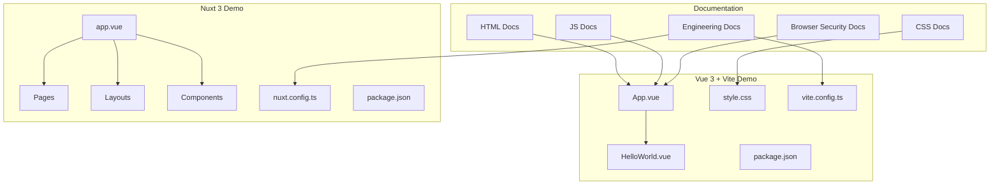
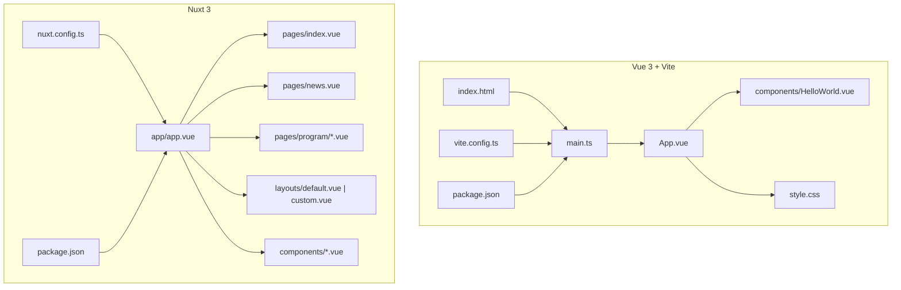
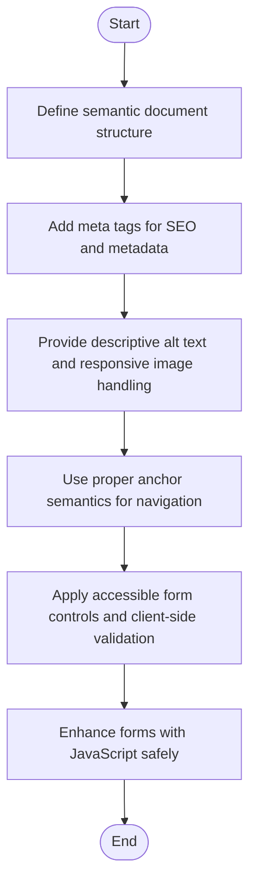
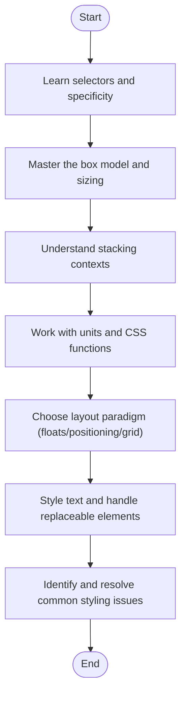
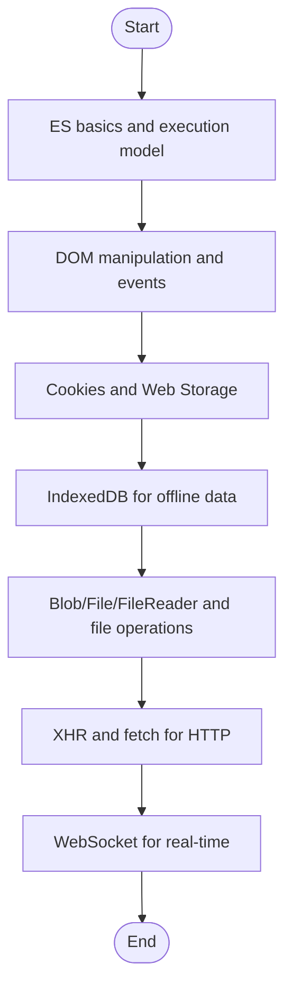
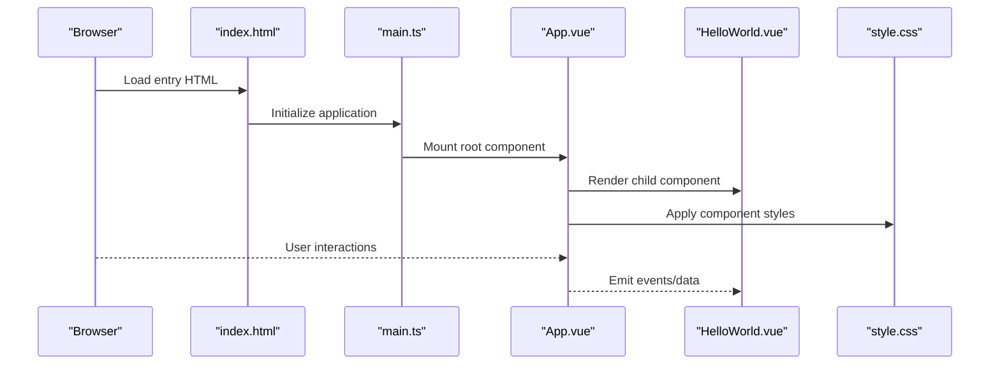
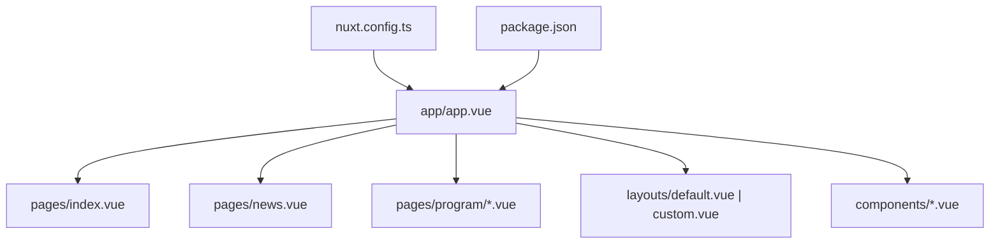
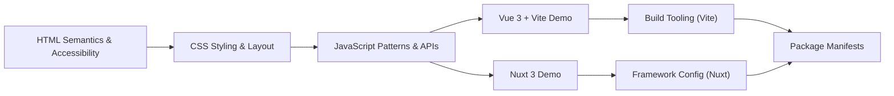

# Frontend Development

<cite>
**Referenced Files in This Document**
- [README.md](file://README.md)
- [index.md](file://docs/index.md)
- [01_index.md](file://docs/01_前端/01_html/01_index.md)
- [04_meta.md](file://docs/01_前端/01_html/04_meta.md)
- [05_img.md](file://docs/01_前端/01_html/05_img.md)
- [06_a.md](file://docs/01_前端/01_html/06_a.md)
- [07_form.md](file://docs/01_前端/01_html/07_form.md)
- [08_form_data.md](file://docs/01_前端/01_html/08_form_data.md)
- [09_form_js.md](file://docs/01_前端/01_html/09_form_js.md)
- [01_index.md](file://docs/01_前端/02_css/01_index.md)
- [02_选择器.md](file://docs/01_前端/02_css/02_选择器.md)
- [04_伪类.md](file://docs/01_前端/02_css/04_伪类.md)
- [06_盒模型.md](file://docs/01_前端/02_css/06_盒模型.md)
- [07_层叠上下文.md](file://docs/01_前端/02_css/07_层叠上下文.md)
- [09_值和单位.md](file://docs/01_前端/02_css/09_值和单位.md)
- [11_布局概述.md](file://docs/01_前端/02_css/11_布局概述.md)
- [13_浮动和定位布局.md](file://docs/01_前端/02_css/13_浮动和定位布局.md)
- [15_网格布局.md](file://docs/01_前端/02_css/15_网格布局.md)
- [16_样式问题.md](file://docs/01_前端/02_css/16_样式问题.md)
- [18_css函数.md](file://docs/01_前端/02_css/18_css函数.md)
- [19_可替换元素.md](file://docs/01_前端/02_css/19_可替换元素.md)
- [20_文本.md](file://docs/01_前端/02_css/20_文本.md)
- [01_ES基本概念.md](file://docs/01_前端/03_js/01_ES基本概念.md)
- [07_JS执行机制-执行上下文.md](file://docs/01_前端/03_js/07_JS执行机制-执行上下文.md)
- [09_JS数据类型-函数和闭包.md](file://docs/01_前端/03_js/09_JS数据类型-函数和闭包.md)
- [10_DOM.md](file://docs/01_前端/03_js/10_DOM.md)
- [13_DOM_事件.md](file://docs/01_前端/03_js/13_DOM_事件.md)
- [14_DOM_事件类型.md](file://docs/01_前端/03_js/14_DOM_事件类型.md)
- [15_cookie.md](file://docs/01_前端/03_js/15_cookie.md)
- [16_WebStorage.md](file://docs/01_前端/03_js/16_WebStorage.md)
- [17_IndexedDB.md](file://docs/01_前端/03_js/17_IndexedDB.md)
- [19_Blob、File和FileReader.md](file://docs/01_前端/03_js/19_Blob、File和FileReader.md)
- [20_文件操作.md](file://docs/01_前端/03_js/20_文件操作.md)
- [21_XHR.md](file://docs/01_前端/03_js/21_XHR.md)
- [23_webSocket.md](file://docs/01_前端/03_js/23_webSocket.md)
- [06_跨站请求伪造_CSRF.md](file://docs/01_前端/04_浏览器/06_跨站请求伪造_CSRF.md)
- [01_HMR.md](file://docs/02_工程化/03_vite/01_HMR.md)
- [02_配置文件.md](file://docs/02_工程化/05_babel/02_配置文件.md)
- [03_格式化程序.md](file://docs/02_工程化/02_eslint/03_格式化程序.md)
- [04_插件.md](file://docs/02_工程化/02_eslint/04_插件.md)
- [02_CSS 功能扩展.md](file://docs/02_工程化/07_scss/02_CSS 功能扩展.md)
- [03_SassScript.md](file://docs/02_工程化/07_scss/03_SassScript.md)
- [04_规则.md](file://docs/02_工程化/07_scss/04_规则.md)
- [05_流控制规则.md](file://docs/02_工程化/07_scss/05_流控制规则.md)
- [06_混入.md](file://docs/02_工程化/07_scss/06_混入.md)
- [07_函数.md](file://docs/02_工程化/07_scss/07_函数.md)
- [08_扩展.md](file://docs/02_工程化/07_scss/08_扩展.md)
- [01_home.md](file://docs/02_工程化/08_Prettier/01_home.md)
- [01_home.md](file://docs/02_工程化/09_Browserslist/01_home.md)
- [01_pnpm.md](file://docs/02_工程化/10_pnpm/01_pnpm.md)
- [02_工作空间.md](file://docs/02_工程化/10_pnpm/02_工作空间.md)
- [03_问题.md](file://docs/02_工程化/10_pnpm/03_问题.md)
- [App.vue](file://demo/my-vue-app/src/App.vue)
- [HelloWorld.vue](file://demo/my-vue-app/src/components/HelloWorld.vue)
- [style.css](file://demo/my-vue-app/src/style.css)
- [index.html](file://demo/my-vue-app/index.html)
- [main.ts](file://demo/my-vue-app/src/main.ts)
- [vite.config.ts](file://demo/my-vue-app/vite.config.ts)
- [package.json](file://demo/my-vue-app/package.json)
- [app.vue](file://demo/nuxt/demo_2/app/app.vue)
- [index.vue](file://demo/nuxt/demo_2/app/pages/index.vue)
- [news.vue](file://demo/nuxt/demo_2/app/pages/news.vue)
- [govService.vue](file://demo/nuxt/demo_2/app/pages/program/govService.vue)
- [manufacture.vue](file://demo/nuxt/demo_2/app/pages/program/manufacture.vue)
- [default.vue](file://demo/nuxt/demo_2/app/layouts/default.vue)
- [custom.vue](file://demo/nuxt/demo_2/app/layouts/custom.vue)
- [Program.vue](file://demo/nuxt/demo_2/app/components/Program.vue)
- [news/Table.vue](file://demo/nuxt/demo_2/app/components/news/Table.vue)
- [nuxt.config.ts](file://demo/nuxt/demo_2/nuxt.config.ts)
- [package.json](file://demo/nuxt/demo_2/package.json)
</cite>

## Table of Contents
1. [Introduction](#introduction)
2. [Project Structure](#project-structure)
3. [Core Components](#core-components)
4. [Architecture Overview](#architecture-overview)
5. [Detailed Component Analysis](#detailed-component-analysis)
6. [Dependency Analysis](#dependency-analysis)
7. [Performance Considerations](#performance-considerations)
8. [Troubleshooting Guide](#troubleshooting-guide)
9. [Conclusion](#conclusion)
10. [Appendices](#appendices)

## Introduction
This document presents a comprehensive guide to frontend development centered on HTML, CSS, JavaScript, and modern framework practices. It synthesizes pedagogical approaches for learners—from foundational web technologies to advanced application architectures—while providing technical depth for experienced developers. The content is grounded in the repository’s frontend documentation and practical examples, including a Vue 3/Vite application and a Nuxt 3 application. The guide emphasizes semantics and accessibility in HTML, robust CSS methodologies and layout strategies, JavaScript programming patterns and browser APIs, and modern framework development workflows.

## Project Structure
The frontend knowledge area is organized into thematic sections:
- HTML fundamentals and accessibility
- CSS architecture, selectors, layout systems, and best practices
- JavaScript core concepts, DOM manipulation, events, storage, networking, and real-time communication
- Browser security and anti-patterns
- Build tooling and engineering practices (Vite, ESLint, Babel, SCSS, Prettier, Browserslist, pnpm)

Practical examples are included via:
- A Vue 3 + Vite starter application demonstrating component composition, styles, and build configuration
- A Nuxt 3 application showcasing routing, layouts, pages, and component composition

**Diagram sources**
- [01_index.md](file://docs/01_前端/01_html/01_index.md)
- [01_index.md](file://docs/01_前端/02_css/01_index.md)
- [01_ES基本概念.md](file://docs/01_前端/03_js/01_ES基本概念.md)
- [06_跨站请求伪造_CSRF.md](file://docs/01_前端/04_浏览器/06_跨站请求伪造_CSRF.md)
- [01_HMR.md](file://docs/02_工程化/03_vite/01_HMR.md)
- [App.vue](file://demo/my-vue-app/src/App.vue)
- [HelloWorld.vue](file://demo/my-vue-app/src/components/HelloWorld.vue)
- [style.css](file://demo/my-vue-app/src/style.css)
- [vite.config.ts](file://demo/my-vue-app/vite.config.ts)
- [app.vue](file://demo/nuxt/demo_2/app/app.vue)
- [index.vue](file://demo/nuxt/demo_2/app/pages/index.vue)
- [news.vue](file://demo/nuxt/demo_2/app/pages/news.vue)
- [govService.vue](file://demo/nuxt/demo_2/app/pages/program/govService.vue)
- [manufacture.vue](file://demo/nuxt/demo_2/app/pages/program/manufacture.vue)
- [default.vue](file://demo/nuxt/demo_2/app/layouts/default.vue)
- [custom.vue](file://demo/nuxt/demo_2/app/layouts/custom.vue)
- [Program.vue](file://demo/nuxt/demo_2/app/components/Program.vue)
- [news/Table.vue](file://demo/nuxt/demo_2/app/components/news/Table.vue)
- [nuxt.config.ts](file://demo/nuxt/demo_2/nuxt.config.ts)

**Section sources**
- [README.md](file://README.md)
- [index.md](file://docs/index.md)

## Core Components
This section outlines the essential frontend pillars covered in the repository and how they interrelate in modern development.

- HTML semantics and accessibility
  - Semantic markup and document structure
  - Meta tags and SEO fundamentals
  - Images and links with accessibility considerations
  - Forms and form data handling
  - JavaScript-enhanced forms

- CSS architecture and layout
  - Selectors, pseudo-classes, and specificity
  - Box model, stacking contexts, and positioning
  - Values, units, and CSS functions
  - Layout paradigms: floats, positioning, grid
  - Text rendering and replaceable elements
  - Common styling pitfalls and solutions

- JavaScript programming patterns and browser APIs
  - ES fundamentals and execution model
  - DOM manipulation and event handling
  - Cookies, localStorage/sessionStorage, IndexedDB
  - Blob/File/FileReader and file operations
  - XHR and fetch for network requests
  - WebSocket for real-time communication

- Modern framework development
  - Vue 3 + Vite: component composition, styles, and build pipeline
  - Nuxt 3: pages, layouts, components, and configuration

- Engineering practices
  - Vite HMR and build configuration
  - ESLint formatting and plugin ecosystem
  - Babel configuration and presets
  - SCSS features: rules, mixins, functions, extends
  - Prettier, Browserslist, and pnpm workflows

**Section sources**
- [01_index.md](file://docs/01_前端/01_html/01_index.md)
- [04_meta.md](file://docs/01_前端/01_html/04_meta.md)
- [05_img.md](file://docs/01_前端/01_html/05_img.md)
- [06_a.md](file://docs/01_前端/01_html/06_a.md)
- [07_form.md](file://docs/01_前端/01_html/07_form.md)
- [08_form_data.md](file://docs/01_前端/01_html/08_form_data.md)
- [09_form_js.md](file://docs/01_前端/01_html/09_form_js.md)
- [01_index.md](file://docs/01_前端/02_css/01_index.md)
- [02_选择器.md](file://docs/01_前端/02_css/02_选择器.md)
- [04_伪类.md](file://docs/01_前端/02_css/04_伪类.md)
- [06_盒模型.md](file://docs/01_前端/02_css/06_盒模型.md)
- [07_层叠上下文.md](file://docs/01_前端/02_css/07_层叠上下文.md)
- [09_值和单位.md](file://docs/01_前端/02_css/09_值和单位.md)
- [11_布局概述.md](file://docs/01_前端/02_css/11_布局概述.md)
- [13_浮动和定位布局.md](file://docs/01_前端/02_css/13_浮动和定位布局.md)
- [15_网格布局.md](file://docs/01_前端/02_css/15_网格布局.md)
- [16_样式问题.md](file://docs/01_前端/02_css/16_样式问题.md)
- [18_css函数.md](file://docs/01_前端/02_css/18_css函数.md)
- [19_可替换元素.md](file://docs/01_前端/02_css/19_可替换元素.md)
- [20_文本.md](file://docs/01_前端/02_css/20_文本.md)
- [01_ES基本概念.md](file://docs/01_前端/03_js/01_ES基本概念.md)
- [07_JS执行机制-执行上下文.md](file://docs/01_前端/03_js/07_JS执行机制-执行上下文.md)
- [09_JS数据类型-函数和闭包.md](file://docs/01_frontend/03_js/09_JS数据类型-函数和闭包.md)
- [10_DOM.md](file://docs/01_前端/03_js/10_DOM.md)
- [13_DOM_事件.md](file://docs/01_前端/03_js/13_DOM_事件.md)
- [14_DOM_事件类型.md](file://docs/01_前端/03_js/14_DOM_事件类型.md)
- [15_cookie.md](file://docs/01_前端/03_js/15_cookie.md)
- [16_WebStorage.md](file://docs/01_前端/03_js/16_WebStorage.md)
- [17_IndexedDB.md](file://docs/01_前端/03_js/17_IndexedDB.md)
- [19_Blob、File和FileReader.md](file://docs/01_前端/03_js/19_Blob、File和FileReader.md)
- [20_文件操作.md](file://docs/01_前端/03_js/20_文件操作.md)
- [21_XHR.md](file://docs/01_前端/03_js/21_XHR.md)
- [23_webSocket.md](file://docs/01_前端/03_js/23_webSocket.md)
- [06_跨站请求伪造_CSRF.md](file://docs/01_前端/04_浏览器/06_跨站请求伪造_CSRF.md)
- [01_HMR.md](file://docs/02_工程化/03_vite/01_HMR.md)
- [02_配置文件.md](file://docs/02_工程化/05_babel/02_配置文件.md)
- [03_格式化程序.md](file://docs/02_工程化/02_eslint/03_格式化程序.md)
- [04_插件.md](file://docs/02_工程化/02_eslint/04_插件.md)
- [02_CSS 功能扩展.md](file://docs/02_工程化/07_scss/02_CSS 功能扩展.md)
- [03_SassScript.md](file://docs/02_工程化/07_scss/03_SassScript.md)
- [04_规则.md](file://docs/02_工程化/07_scss/04_规则.md)
- [05_流控制规则.md](file://docs/02_工程化/07_scss/05_流控制规则.md)
- [06_混入.md](file://docs/02_工程化/07_scss/06_混入.md)
- [07_函数.md](file://docs/02_工程化/07_scss/07_函数.md)
- [08_扩展.md](file://docs/02_工程化/07_scss/08_扩展.md)
- [01_home.md](file://docs/02_工程化/08_Prettier/01_home.md)
- [01_home.md](file://docs/02_工程化/09_Browserslist/01_home.md)
- [01_pnpm.md](file://docs/02_工程化/10_pnpm/01_pnpm.md)
- [02_工作空间.md](file://docs/02_工程化/10_pnpm/02_工作空间.md)
- [03_问题.md](file://docs/02_工程化/10_pnpm/03_问题.md)

## Architecture Overview
The frontend architecture integrates documentation-driven learning with practical framework demos. The Vue 3 + Vite demo illustrates a component-centric structure with a dedicated style sheet and build configuration. The Nuxt 3 demo demonstrates a file-based routing and layout system with page-specific views and shared components.

**Diagram sources**
- [index.html](file://demo/my-vue-app/index.html)
- [main.ts](file://demo/my-vue-app/src/main.ts)
- [App.vue](file://demo/my-vue-app/src/App.vue)
- [HelloWorld.vue](file://demo/my-vue-app/src/components/HelloWorld.vue)
- [style.css](file://demo/my-vue-app/src/style.css)
- [vite.config.ts](file://demo/my-vue-app/vite.config.ts)
- [package.json](file://demo/my-vue-app/package.json)
- [app.vue](file://demo/nuxt/demo_2/app/app.vue)
- [index.vue](file://demo/nuxt/demo_2/app/pages/index.vue)
- [news.vue](file://demo/nuxt/demo_2/app/pages/news.vue)
- [govService.vue](file://demo/nuxt/demo_2/app/pages/program/govService.vue)
- [manufacture.vue](file://demo/nuxt/demo_2/app/pages/program/manufacture.vue)
- [default.vue](file://demo/nuxt/demo_2/app/layouts/default.vue)
- [custom.vue](file://demo/nuxt/demo_2/app/layouts/custom.vue)
- [Program.vue](file://demo/nuxt/demo_2/app/components/Program.vue)
- [nuxt.config.ts](file://demo/nuxt/demo_2/nuxt.config.ts)
- [package.json](file://demo/nuxt/demo_2/package.json)

## Detailed Component Analysis

### HTML Semantics and Accessibility
- Purpose: Establish meaningful document structure and improve accessibility for assistive technologies.
- Topics covered:
  - Semantic elements and document outline
  - Meta tags for SEO and social media
  - Image alt attributes and responsive images
  - Anchor links and navigation semantics
  - Form controls, validation, and accessible labeling
  - JavaScript-enhanced form interactions

**Diagram sources**
- [01_index.md](file://docs/01_前端/01_html/01_index.md)
- [04_meta.md](file://docs/01_前端/01_html/04_meta.md)
- [05_img.md](file://docs/01_前端/01_html/05_img.md)
- [06_a.md](file://docs/01_前端/01_html/06_a.md)
- [07_form.md](file://docs/01_前端/01_html/07_form.md)
- [08_form_data.md](file://docs/01_前端/01_html/08_form_data.md)
- [09_form_js.md](file://docs/01_前端/01_html/09_form_js.md)

**Section sources**
- [01_index.md](file://docs/01_前端/01_html/01_index.md)
- [04_meta.md](file://docs/01_前端/01_html/04_meta.md)
- [05_img.md](file://docs/01_前端/01_html/05_img.md)
- [06_a.md](file://docs/01_前端/01_html/06_a.md)
- [07_form.md](file://docs/01_前端/01_html/07_form.md)
- [08_form_data.md](file://docs/01_前端/01_html/08_form_data.md)
- [09_form_js.md](file://docs/01_前端/01_html/09_form_js.md)

### CSS Styling and Layout Techniques
- Purpose: Provide a structured approach to styling and layout with maintainable architecture.
- Topics covered:
  - Selectors, pseudo-classes, and specificity management
  - Box model, margins, padding, borders, and sizing
  - Stacking contexts and z-index behavior
  - Units, values, and CSS functions for dynamic styles
  - Layout paradigms: floats, positioning, and CSS Grid
  - Text rendering, typography, and replaceable elements
  - Common styling issues and resolution strategies

**Diagram sources**
- [01_index.md](file://docs/01_前端/02_css/01_index.md)
- [02_选择器.md](file://docs/01_前端/02_css/02_选择器.md)
- [04_伪类.md](file://docs/01_前端/02_css/04_伪类.md)
- [06_盒模型.md](file://docs/01_前端/02_css/06_盒模型.md)
- [07_层叠上下文.md](file://docs/01_前端/02_css/07_层叠上下文.md)
- [09_值和单位.md](file://docs/01_前端/02_css/09_值和单位.md)
- [11_布局概述.md](file://docs/01_前端/02_css/11_布局概述.md)
- [13_浮动和定位布局.md](file://docs/01_前端/02_css/13_浮动和定位布局.md)
- [15_网格布局.md](file://docs/01_前端/02_css/15_网格布局.md)
- [16_样式问题.md](file://docs/01_前端/02_css/16_样式问题.md)
- [18_css函数.md](file://docs/01_前端/02_css/18_css函数.md)
- [19_可替换元素.md](file://docs/01_前端/02_css/19_可替换元素.md)
- [20_文本.md](file://docs/01_前端/02_css/20_文本.md)

**Section sources**
- [01_index.md](file://docs/01_前端/02_css/01_index.md)
- [02_选择器.md](file://docs/01_前端/02_css/02_选择器.md)
- [04_伪类.md](file://docs/01_前端/02_css/04_伪类.md)
- [06_盒模型.md](file://docs/01_前端/02_css/06_盒模型.md)
- [07_层叠上下文.md](file://docs/01_前端/02_css/07_层叠上下文.md)
- [09_值和单位.md](file://docs/01_前端/02_css/09_值和单位.md)
- [11_布局概述.md](file://docs/01_前端/02_css/11_布局概述.md)
- [13_浮动和定位布局.md](file://docs/01_前端/02_css/13_浮动和定位布局.md)
- [15_网格布局.md](file://docs/01_前端/02_css/15_网格布局.md)
- [16_样式问题.md](file://docs/01_前端/02_css/16_样式问题.md)
- [18_css函数.md](file://docs/01_前端/02_css/18_css函数.md)
- [19_可替换元素.md](file://docs/01_前端/02_css/19_可替换元素.md)
- [20_文本.md](file://docs/01_前端/02_css/20_文本.md)

### JavaScript Programming Patterns and Browser APIs
- Purpose: Equip developers with core scripting patterns and browser capabilities.
- Topics covered:
  - ES fundamentals and execution context
  - DOM manipulation and event handling
  - Storage mechanisms: cookies, localStorage, sessionStorage, IndexedDB
  - File handling with Blob, File, FileReader
  - Networking: XMLHttpRequest and modern fetch
  - Real-time communication with WebSocket

**Diagram sources**
- [01_ES基本概念.md](file://docs/01_前端/03_js/01_ES基本概念.md)
- [07_JS执行机制-执行上下文.md](file://docs/01_前端/03_js/07_JS执行机制-执行上下文.md)
- [09_JS数据类型-函数和闭包.md](file://docs/01_前端/03_js/09_JS数据类型-函数和闭包.md)
- [10_DOM.md](file://docs/01_前端/03_js/10_DOM.md)
- [13_DOM_事件.md](file://docs/01_前端/03_js/13_DOM_事件.md)
- [14_DOM_事件类型.md](file://docs/01_前端/03_js/14_DOM_事件类型.md)
- [15_cookie.md](file://docs/01_前端/03_js/15_cookie.md)
- [16_WebStorage.md](file://docs/01_前端/03_js/16_WebStorage.md)
- [17_IndexedDB.md](file://docs/01_前端/03_js/17_IndexedDB.md)
- [19_Blob、File和FileReader.md](file://docs/01_前端/03_js/19_Blob、File和FileReader.md)
- [20_文件操作.md](file://docs/01_前端/03_js/20_文件操作.md)
- [21_XHR.md](file://docs/01_前端/03_js/21_XHR.md)
- [23_webSocket.md](file://docs/01_前端/03_js/23_webSocket.md)

**Section sources**
- [01_ES基本概念.md](file://docs/01_前端/03_js/01_ES基本概念.md)
- [07_JS执行机制-执行上下文.md](file://docs/01_前端/03_js/07_JS执行机制-执行上下文.md)
- [09_JS数据类型-函数和闭包.md](file://docs/01_前端/03_js/09_JS数据类型-函数和闭包.md)
- [10_DOM.md](file://docs/01_前端/03_js/10_DOM.md)
- [13_DOM_事件.md](file://docs/01_前端/03_js/13_DOM_事件.md)
- [14_DOM_事件类型.md](file://docs/01_前端/03_js/14_DOM_事件类型.md)
- [15_cookie.md](file://docs/01_前端/03_js/15_cookie.md)
- [16_WebStorage.md](file://docs/01_前端/03_js/16_WebStorage.md)
- [17_IndexedDB.md](file://docs/01_前端/03_js/17_IndexedDB.md)
- [19_Blob、File和FileReader.md](file://docs/01_前端/03_js/19_Blob、File和FileReader.md)
- [20_文件操作.md](file://docs/01_前端/03_js/20_文件操作.md)
- [21_XHR.md](file://docs/01_前端/03_js/21_XHR.md)
- [23_webSocket.md](file://docs/01_前端/03_js/23_webSocket.md)

### Vue.js Application Development (Vue 3 + Vite)
- Purpose: Demonstrate component composition, styling, and build configuration in a modern Vue 3 application.
- Key elements:
  - Root component and component hierarchy
  - Styles applied to components
  - Build configuration and dev server integration
  - Package dependencies and scripts

**Diagram sources**
- [index.html](file://demo/my-vue-app/index.html)
- [main.ts](file://demo/my-vue-app/src/main.ts)
- [App.vue](file://demo/my-vue-app/src/App.vue)
- [HelloWorld.vue](file://demo/my-vue-app/src/components/HelloWorld.vue)
- [style.css](file://demo/my-vue-app/src/style.css)
- [vite.config.ts](file://demo/my-vue-app/vite.config.ts)
- [package.json](file://demo/my-vue-app/package.json)

**Section sources**
- [App.vue](file://demo/my-vue-app/src/App.vue)
- [HelloWorld.vue](file://demo/my-vue-app/src/components/HelloWorld.vue)
- [style.css](file://demo/my-vue-app/src/style.css)
- [index.html](file://demo/my-vue-app/index.html)
- [main.ts](file://demo/my-vue-app/src/main.ts)
- [vite.config.ts](file://demo/my-vue-app/vite.config.ts)
- [package.json](file://demo/my-vue-app/package.json)

### Nuxt.js Application Development (Nuxt 3)
- Purpose: Illustrate file-based routing, layouts, pages, and components in a Nuxt 3 application.
- Key elements:
  - Pages directory for route segments
  - Layouts for consistent page wrappers
  - Components for reusable UI
  - Configuration for framework behavior

**Diagram sources**
- [app.vue](file://demo/nuxt/demo_2/app/app.vue)
- [index.vue](file://demo/nuxt/demo_2/app/pages/index.vue)
- [news.vue](file://demo/nuxt/demo_2/app/pages/news.vue)
- [govService.vue](file://demo/nuxt/demo_2/app/pages/program/govService.vue)
- [manufacture.vue](file://demo/nuxt/demo_2/app/pages/program/manufacture.vue)
- [default.vue](file://demo/nuxt/demo_2/app/layouts/default.vue)
- [custom.vue](file://demo/nuxt/demo_2/app/layouts/custom.vue)
- [Program.vue](file://demo/nuxt/demo_2/app/components/Program.vue)
- [nuxt.config.ts](file://demo/nuxt/demo_2/nuxt.config.ts)
- [package.json](file://demo/nuxt/demo_2/package.json)

**Section sources**
- [app.vue](file://demo/nuxt/demo_2/app/app.vue)
- [index.vue](file://demo/nuxt/demo_2/app/pages/index.vue)
- [news.vue](file://demo/nuxt/demo_2/app/pages/news.vue)
- [govService.vue](file://demo/nuxt/demo_2/app/pages/program/govService.vue)
- [manufacture.vue](file://demo/nuxt/demo_2/app/pages/program/manufacture.vue)
- [default.vue](file://demo/nuxt/demo_2/app/layouts/default.vue)
- [custom.vue](file://demo/nuxt/demo_2/app/layouts/custom.vue)
- [Program.vue](file://demo/nuxt/demo_2/app/components/Program.vue)
- [nuxt.config.ts](file://demo/nuxt/demo_2/nuxt.config.ts)
- [package.json](file://demo/nuxt/demo_2/package.json)

## Dependency Analysis
This section maps dependencies among frontend concepts and tools:
- HTML depends on semantics and accessibility guidelines
- CSS depends on selector and layout strategies
- JavaScript depends on DOM APIs and browser capabilities
- Framework demos depend on build tool configurations and package manifests

**Diagram sources**
- [01_index.md](file://docs/01_前端/01_html/01_index.md)
- [01_index.md](file://docs/01_前端/02_css/01_index.md)
- [01_ES基本概念.md](file://docs/01_前端/03_js/01_ES基本概念.md)
- [App.vue](file://demo/my-vue-app/src/App.vue)
- [vite.config.ts](file://demo/my-vue-app/vite.config.ts)
- [package.json](file://demo/my-vue-app/package.json)
- [app.vue](file://demo/nuxt/demo_2/app/app.vue)
- [nuxt.config.ts](file://demo/nuxt/demo_2/nuxt.config.ts)
- [package.json](file://demo/nuxt/demo_2/package.json)

**Section sources**
- [01_index.md](file://docs/01_前端/01_html/01_index.md)
- [01_index.md](file://docs/01_前端/02_css/01_index.md)
- [01_ES基本概念.md](file://docs/01_前端/03_js/01_ES基本概念.md)
- [App.vue](file://demo/my-vue-app/src/App.vue)
- [vite.config.ts](file://demo/my-vue-app/vite.config.ts)
- [package.json](file://demo/my-vue-app/package.json)
- [app.vue](file://demo/nuxt/demo_2/app/app.vue)
- [nuxt.config.ts](file://demo/nuxt/demo_2/nuxt.config.ts)
- [package.json](file://demo/nuxt/demo_2/package.json)

## Performance Considerations
- Optimize CSS selectors and avoid excessive specificity
- Minimize reflows and repaints through efficient layout and transform usage
- Prefer lightweight JavaScript patterns and defer non-critical scripts
- Leverage framework-level optimizations (lazy loading, code splitting)
- Use build tools configured for production bundles and asset optimization

[No sources needed since this section provides general guidance]

## Troubleshooting Guide
Common issues and resolutions:
- HTML accessibility failures: ensure semantic elements and descriptive metadata
- CSS specificity wars: refactor selectors and adopt modular architecture
- DOM event leaks: detach listeners and manage component lifecycles
- Storage quota exceeded: implement cleanup and graceful degradation
- Network errors: handle fetch/XHR errors and implement retry/backoff
- WebSocket disconnections: add reconnection logic and heartbeat checks

**Section sources**
- [01_index.md](file://docs/01_前端/01_html/01_index.md)
- [01_index.md](file://docs/01_前端/02_css/01_index.md)
- [10_DOM.md](file://docs/01_前端/03_js/10_DOM.md)
- [15_cookie.md](file://docs/01_前端/03_js/15_cookie.md)
- [16_WebStorage.md](file://docs/01_前端/03_js/16_WebStorage.md)
- [17_IndexedDB.md](file://docs/01_前端/03_js/17_IndexedDB.md)
- [21_XHR.md](file://docs/01_前端/03_js/21_XHR.md)
- [23_webSocket.md](file://docs/01_前端/03_js/23_webSocket.md)

## Conclusion
This guide consolidates foundational frontend knowledge with modern framework practices. By combining documented principles with hands-on examples from Vue 3 + Vite and Nuxt 3, learners can progress from HTML semantics and CSS architecture to JavaScript patterns and full-stack framework development. The engineering practices outlined support scalable, maintainable workflows aligned with current industry standards.

[No sources needed since this section summarizes without analyzing specific files]

## Appendices
- Practical patterns and best practices are integrated throughout the guide with references to relevant documentation and demo files.

[No sources needed since this section provides general guidance]