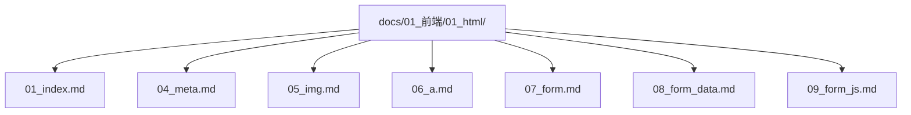
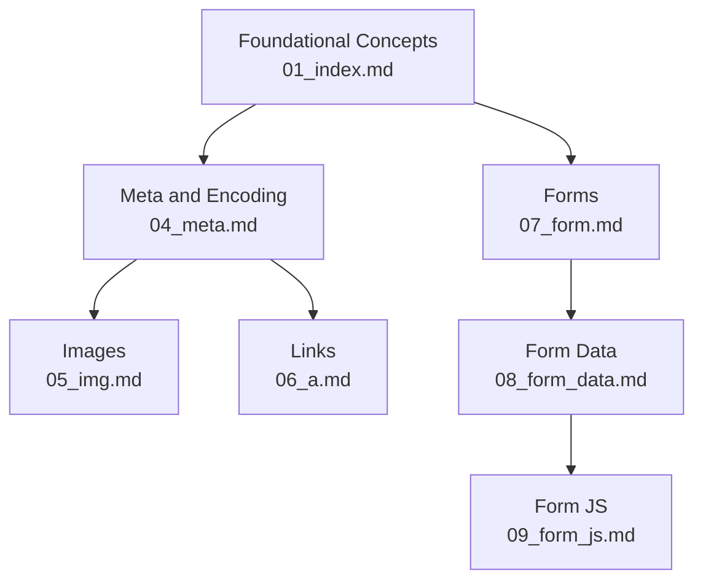
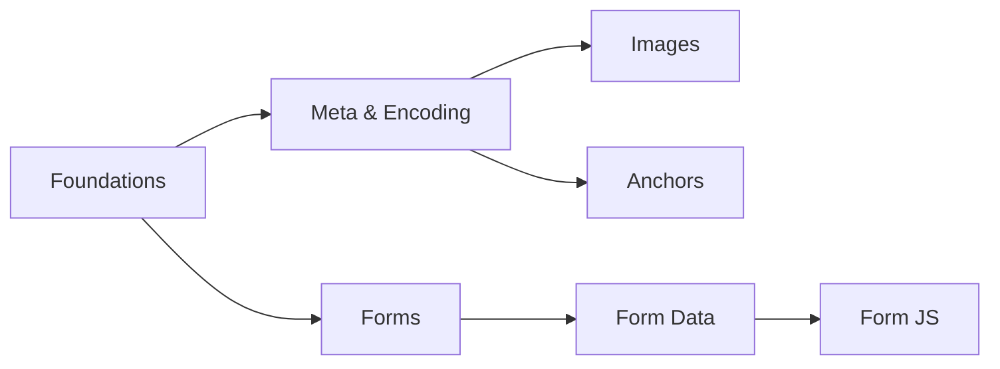

# HTML Fundamentals

<cite>
**Referenced Files in This Document**
- [01_index.md](file://docs/01_前端/01_html/01_index.md)
- [04_meta.md](file://docs/01_前端/01_html/04_meta.md)
- [05_img.md](file://docs/01_前端/01_html/05_img.md)
- [06_a.md](file://docs/01_前端/01_html/06_a.md)
- [07_form.md](file://docs/01_前端/01_html/07_form.md)
- [08_form_data.md](file://docs/01_前端/01_html/08_form_data.md)
- [09_form_js.md](file://docs/01_前端/01_html/09_form_js.md)
- [index.md](file://docs/index.md)
</cite>

## Table of Contents
1. [Introduction](#introduction)
2. [Project Structure](#project-structure)
3. [Core Components](#core-components)
4. [Architecture Overview](#architecture-overview)
5. [Detailed Component Analysis](#detailed-component-analysis)
6. [Dependency Analysis](#dependency-analysis)
7. [Performance Considerations](#performance-considerations)
8. [Troubleshooting Guide](#troubleshooting-guide)
9. [Conclusion](#conclusion)
10. [Appendices](#appendices)

## Introduction
This document consolidates HTML fundamentals from the repository’s HTML documentation set. It covers basic elements, semantic markup, forms, accessibility, HTML5 features, meta tags, character encoding, document structure, and SEO-related best practices. Practical patterns and recommended approaches are derived from the repository’s authored materials.

## Project Structure
The HTML documentation is organized as a series of focused topics under docs/01_前端/01_html/. Each file addresses a specific aspect of HTML fundamentals, enabling progressive learning and reference lookup.

**Diagram sources**
- [01_index.md](file://docs/01_前端/01_html/01_index.md)
- [04_meta.md](file://docs/01_前端/01_html/04_meta.md)
- [05_img.md](file://docs/01_前端/01_html/05_img.md)
- [06_a.md](file://docs/01_前端/01_html/06_a.md)
- [07_form.md](file://docs/01_前端/01_html/07_form.md)
- [08_form_data.md](file://docs/01_前端/01_html/08_form_data.md)
- [09_form_js.md](file://docs/01_前端/01_html/09_form_js.md)

**Section sources**
- [index.md](file://docs/index.md)
- [01_index.md](file://docs/01_前端/01_html/01_index.md)

## Core Components
- Basic HTML elements and document structure
- Semantic markup and accessibility
- Forms: structure, validation, and submission
- Meta tags and character encoding
- Image and anchor usage patterns
- HTML5 features and modern practices

These components are covered across the HTML documentation files and are synthesized here to provide a cohesive learning path.

**Section sources**
- [01_index.md](file://docs/01_前端/01_html/01_index.md)
- [04_meta.md](file://docs/01_前端/01_html/04_meta.md)
- [05_img.md](file://docs/01_前端/01_html/05_img.md)
- [06_a.md](file://docs/01_前端/01_html/06_a.md)
- [07_form.md](file://docs/01_前端/01_html/07_form.md)
- [08_form_data.md](file://docs/01_前端/01_html/08_form_data.md)
- [09_form_js.md](file://docs/01_前端/01_html/09_form_js.md)

## Architecture Overview
The HTML fundamentals material is structured as a modular knowledge base:
- Foundational concepts in 01_index.md
- Meta and document metadata in 04_meta.md
- Media and linking in 05_img.md and 06_a.md
- Forms in 07_form.md, 08_form_data.md, and 09_form_js.md

**Diagram sources**
- [01_index.md](file://docs/01_前端/01_html/01_index.md)
- [04_meta.md](file://docs/01_frontend/01_html/04_meta.md)
- [05_img.md](file://docs/01_frontend/01_html/05_img.md)
- [06_a.md](file://docs/01_frontend/01_html/06_a.md)
- [07_form.md](file://docs/01_frontend/01_html/07_form.md)
- [08_form_data.md](file://docs/01_frontend/01_html/08_form_data.md)
- [09_form_js.md](file://docs/01_frontend/01_html/09_form_js.md)

## Detailed Component Analysis

### Basic Elements and Document Structure
- Document outline and DOCTYPE considerations
- Head vs body sections and their roles
- Structural elements for content hierarchy

Practical guidance:
- Use semantic headings to define page structure
- Keep head concise and metadata-focused
- Place interactive and dynamic content in body

**Section sources**
- [01_index.md](file://docs/01_前端/01_html/01_index.md)

### Semantic Markup and Accessibility
- Importance of semantics for screen readers and SEO
- ARIA attributes and roles where appropriate
- Accessible color contrast and focus indicators

Best practices:
- Prefer native elements over generic divs/ spans
- Provide meaningful alt text for images
- Ensure keyboard navigability and visible focus states

**Section sources**
- [01_index.md](file://docs/01_前端/01_html/01_index.md)
- [05_img.md](file://docs/01_前端/01_html/05_img.md)

### Meta Tags and Character Encoding
- Essential meta tags for viewport, description, and author
- Character encoding declaration and its impact
- Robots and social media meta tags

Implementation tips:
- Always declare encoding early in the head
- Use concise, keyword-rich descriptions
- Configure viewport for responsive design

**Section sources**
- [04_meta.md](file://docs/01_前端/01_html/04_meta.md)

### Images and Anchors
- Proper image embedding and lazy loading
- Alt attributes for accessibility and SEO
- Anchor usage for navigation and external links

Patterns:
- Use srcset and sizes for responsive images
- Open external links in new tabs with rel="noopener noreferrer"
- Internal navigation via anchor links

**Section sources**
- [05_img.md](file://docs/01_前端/01_html/05_img.md)
- [06_a.md](file://docs/01_前端/01_html/06_a.md)

### Forms: Structure, Validation, and Submission
- Form layout and grouping with fieldsets and legends
- Input types and validation attributes
- Server-side and client-side validation strategies

Guidelines:
- Group related controls with fieldsets
- Provide clear labels and help text
- Combine HTML5 validation with server checks

**Section sources**
- [07_form.md](file://docs/01_前端/01_html/07_form.md)

### Form Data Handling
- Understanding form encodings and multipart boundaries
- Managing special characters and sanitization
- Handling file uploads and binary data

Recommendations:
- Choose appropriate enctype for file uploads
- Sanitize and validate all incoming data
- Apply CSRF protection on submissions

**Section sources**
- [08_form_data.md](file://docs/01_前端/01_html/08_form_data.md)

### Form JavaScript Integration
- Enhancing UX with client-side scripting
- Real-time validation and feedback
- Preventing duplicate submissions

Approaches:
- Debounce input handlers for performance
- Provide immediate, actionable feedback
- Disable submit button after first click

**Section sources**
- [09_form_js.md](file://docs/01_前端/01_html/09_form_js.md)

### HTML5 Features and Modern Practices
- New structural and semantic elements
- Microdata and structured content
- Offline caching and service workers (contextual)

Notes:
- Use HTML5 elements thoughtfully to improve semantics
- Avoid overusing microformats; prefer JSON-LD for rich snippets

**Section sources**
- [01_index.md](file://docs/01_前端/01_html/01_index.md)

### Relationship Between HTML Structure and SEO
- Heading hierarchy and content importance
- Metadata and crawlability signals
- Structured data and schema markup

Tips:
- Maintain a single H1 per page
- Include schema.org markup where relevant
- Ensure fast loading and mobile-friendly structure

**Section sources**
- [04_meta.md](file://docs/01_前端/01_html/04_meta.md)
- [01_index.md](file://docs/01_前端/01_html/01_index.md)

## Dependency Analysis
The HTML documentation topics are loosely coupled, allowing independent study while reinforcing shared principles:
- Foundational concepts inform meta, images, anchors, and forms
- Meta and encoding underpin all page rendering
- Forms depend on images/anchors for complete UX
- JS enhances but does not replace HTML structure

**Diagram sources**
- [01_index.md](file://docs/01_前端/01_html/01_index.md)
- [04_meta.md](file://docs/01_前端/01_html/04_meta.md)
- [05_img.md](file://docs/01_前端/01_html/05_img.md)
- [06_a.md](file://docs/01_前端/01_html/06_a.md)
- [07_form.md](file://docs/01_前端/01_html/07_form.md)
- [08_form_data.md](file://docs/01_前端/01_html/08_form_data.md)
- [09_form_js.md](file://docs/01_前端/01_html/09_form_js.md)

## Performance Considerations
- Minimize render-blocking resources in head
- Defer non-critical JavaScript
- Optimize images and avoid unnecessary markup
- Use semantic elements to reduce DOM bloat

[No sources needed since this section provides general guidance]

## Troubleshooting Guide
Common issues and resolutions:
- Encoding problems: ensure consistent UTF-8 declaration
- Broken images: verify paths and alt attributes
- Form submission failures: check action/target/enctype
- Accessibility errors: confirm labels, ARIA usage, and keyboard navigation

**Section sources**
- [04_meta.md](file://docs/01_前端/01_html/04_meta.md)
- [05_img.md](file://docs/01_前端/01_html/05_img.md)
- [07_form.md](file://docs/01_前端/01_html/07_form.md)

## Conclusion
The repository’s HTML documentation provides a practical, modular foundation for building accessible, semantic, and SEO-friendly web pages. By combining strong document structure, proper metadata, thoughtful forms, and modern HTML5 practices, developers can create robust frontends that work well across devices and assistive technologies.

[No sources needed since this section summarizes without analyzing specific files]

## Appendices
- Practical patterns and examples are documented across the HTML topic files and can be referenced by topic number.

[No sources needed since this section provides general guidance]