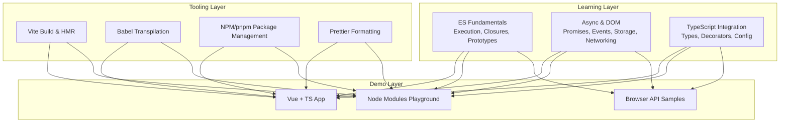
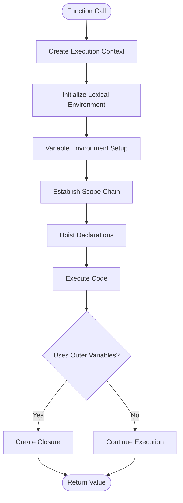
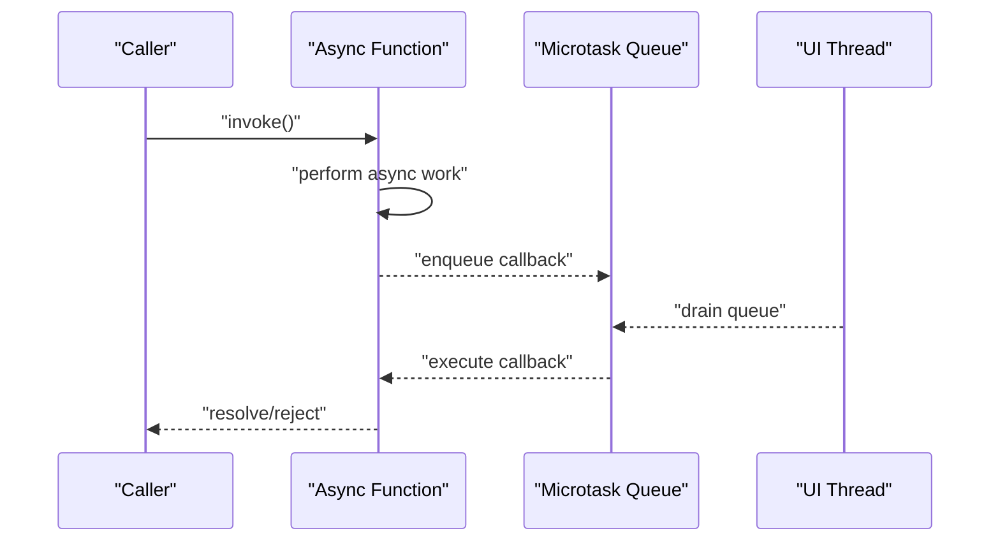
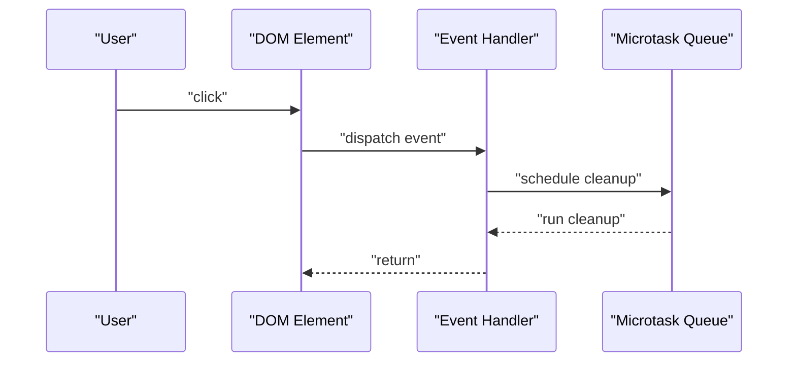
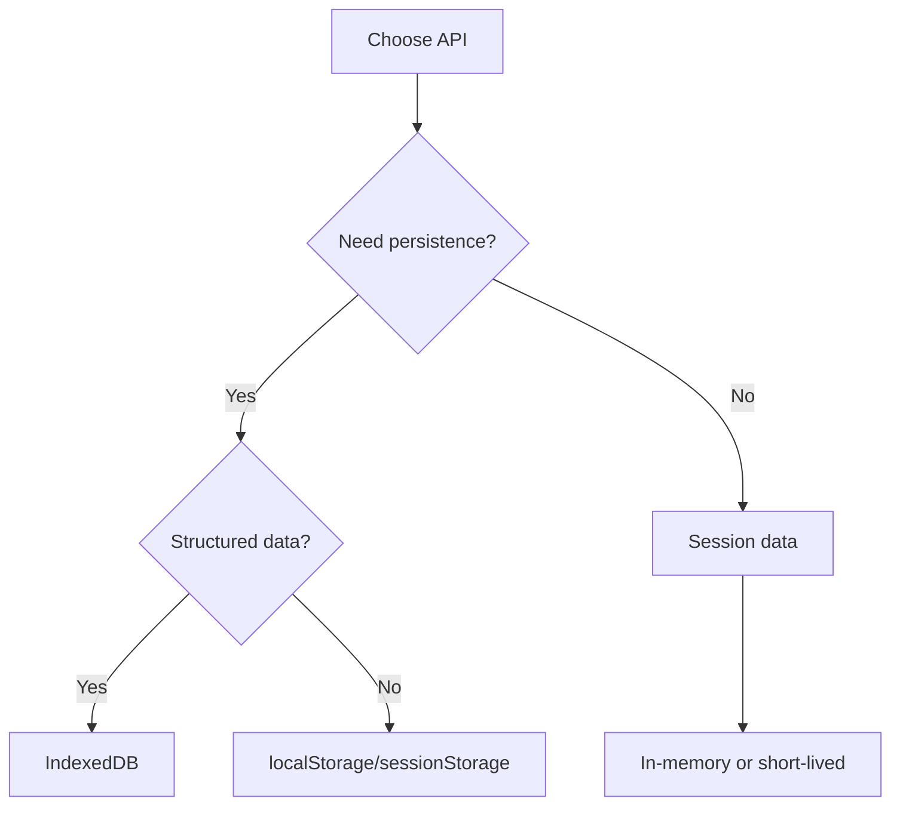
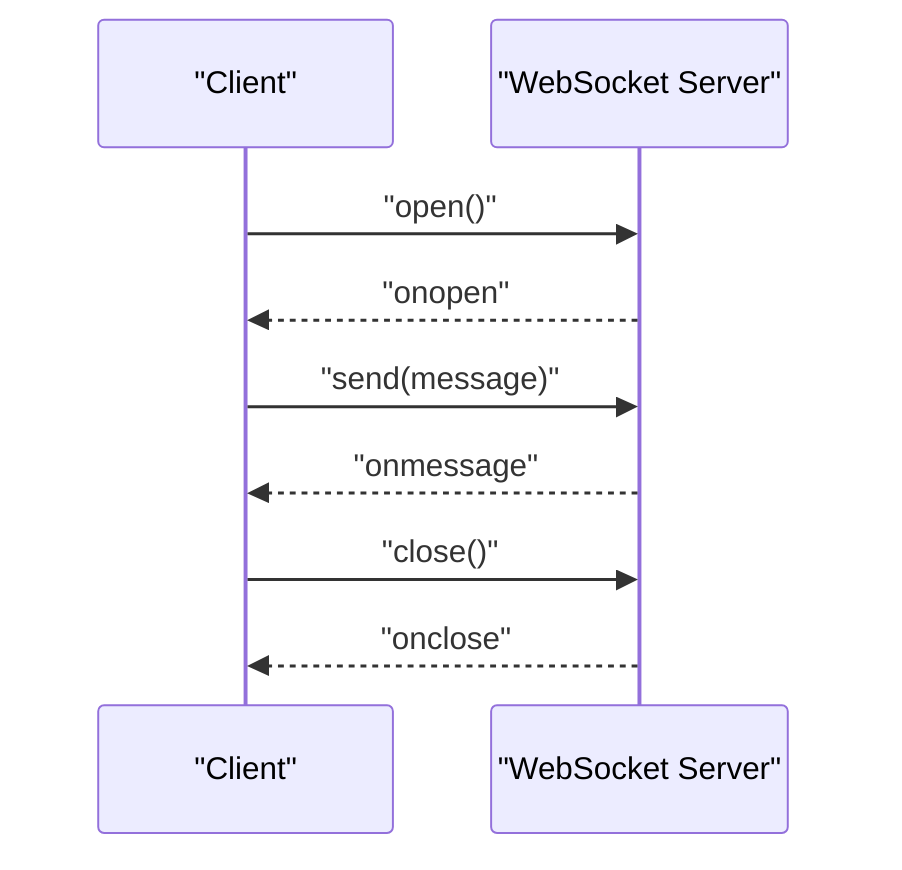
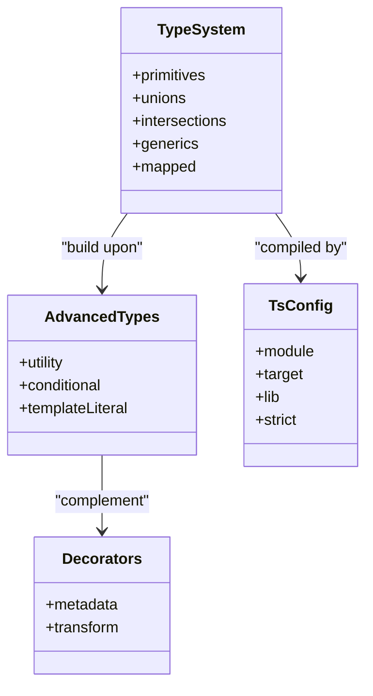
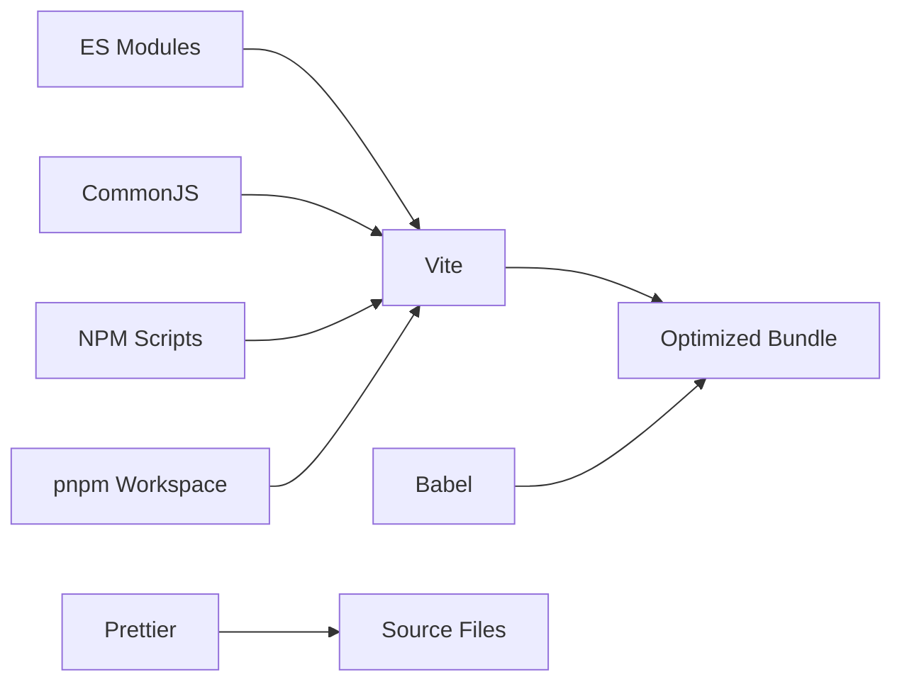
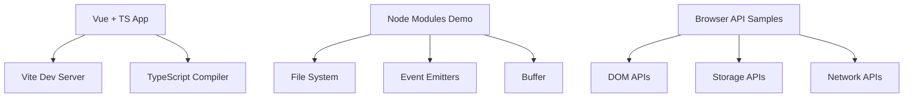

# JavaScript Programming

<cite>
**Referenced Files in This Document**
- [01_ES基本概念.md](file://docs/01_前端/03_js/01_ES基本概念.md)
- [07_JS执行机制-执行上下文.md](file://docs/01_前端/03_js/07_JS执行机制-执行上下文.md)
- [09_JS数据类型-函数和闭包.md](file://docs/01_前端/03_js/09_JS数据类型-函数和闭包.md)
- [10_DOM.md](file://docs/01_前端/03_js/10_DOM.md)
- [13_DOM_事件.md](file://docs/01_前端/03_js/13_DOM_事件.md)
- [14_DOM_事件类型.md](file://docs/01_前端/03_js/14_DOM_事件类型.md)
- [15_cookie.md](file://docs/01_前端/03_js/15_cookie.md)
- [16_WebStorage.md](file://docs/01_前端/03_js/16_WebStorage.md)
- [17_IndexedDB.md](file://docs/01_前端/03_js/17_IndexedDB.md)
- [19_Blob、File和FileReader.md](file://docs/01_前端/03_js/19_Blob、File和FileReader.md)
- [20_文件操作.md](file://docs/01_前端/03_js/20_文件操作.md)
- [21_XHR.md](file://docs/01_前端/03_js/21_XHR.md)
- [23_webSocket.md](file://docs/01_前端/03_js/23_webSocket.md)
- [01_概述.md](file://docs/02_工程化/01_vscode/01_概述.md)
- [02_概述.md](file://docs/02_工程化/01_vscode/02_概述.md)
- [03_vite.md](file://docs/02_工程化/03_vite/01_HMR.md)
- [02_配置文件.md](file://docs/02_工程化/05_babel/02_配置文件.md)
- [03_配置选项.md](file://docs/02_工程化/05_babel/03_配置选项.md)
- [04_预设.md](file://docs/02_工程化/05_babel/04_预设.md)
- [05_preset-env预设.md](file://docs/02_工程化/05_babel/05_preset-env预设.md)
- [06_插件.md](file://docs/02_工程化/05_babel/06_插件.md)
- [01_npm.md](file://docs/02_工程化/06_npm/01_npm.md)
- [02_文件夹结构.md](file://docs/02_工程化/06_npm/02_文件夹结构.md)
- [06_脚本.md](file://docs/02_工程化/06_npm/06_脚本.md)
- [07_包安装机制.md](file://docs/02_工程化/06_npm/07_包安装机制.md)
- [09_命令_init_初始化工程.md](file://docs/02_工程化/06_npm/09_命令_init_初始化工程.md)
- [10_命令_install_安装包.md](file://docs/02_工程化/06_npm/10_命令_install_安装包.md)
- [11_命令_update_更新包.md](file://docs/02_工程化/06_npm/11_命令_update_更新包.md)
- [12_命令_uninstall_卸载包.md](file://docs/02_工程化/06_npm/12_命令_uninstall_卸载包.md)
- [13_命令_outdated_过时包.md](file://docs/02_工程化/06_npm/13_命令_outdated_过时包.md)
- [14_命令_ls_查看已安装包.md](file://docs/02_工程化/06_npm/14_命令_ls_查看已安装包.md)
- [15_命令_dedupe_去除重复包.md](file://docs/02_工程化/06_npm/15_命令_dedupe_去除重复包.md)
- [16_命令_login_登录.md](file://docs/02_工程化/06_npm/16_命令_login_登录.md)
- [17_命令_search_搜索远程包.md](file://docs/02_工程化/06_npm/17_命令_search_搜索远程包.md)
- [18_命令_view_查看包信息.md](file://docs/02_工程化/06_npm/18_命令_view_查看包信息.md)
- [19_命令_config_配置.md](file://docs/02_工程化/06_npm/19_命令_config_配置.md)
- [21_范围包.md](file://docs/02_工程化/06_npm/21_范围包.md)
- [22_依赖分类.md](file://docs/02_工程化/06_npm/22_依赖分类.md)
- [23_版本规范.md](file://docs/02_工程化/06_npm/23_版本规范.md)
- [32_命令_publish_发布包.md](file://docs/02_工程化/06_npm/32_命令_publish_发布包.md)
- [33_命令_root_根目录.md](file://docs/02_工程化/06_npm/33_命令_root_根目录.md)
- [34_命令_runSrciprt_运行脚本.md](file://docs/02_工程化/06_npm/34_命令_runSrciprt_运行脚本.md)
- [35_命令_test_运行test脚本.md](file://docs/02_工程化/06_npm/35_命令_test_运行test脚本.md)
- [36_命令_start_运行start脚本.md](file://docs/02_工程化/06_npm/36_命令_start_运行start脚本.md)
- [37_命令_stop_运行stop脚本.md](file://docs/02_工程化/06_npm/37_命令_stop_运行stop脚本.md)
- [01_home.md](file://docs/02_工程化/08_Prettier/01_home.md)
- [01_工作空间.md](file://docs/02_工程化/10_pnpm/01_pnpm.md)
- [02_工作空间.md](file://docs/02_工程化/10_pnpm/02_工作空间.md)
- [03_问题.md](file://docs/02_工程化/10_pnpm/03_问题.md)
- [01_index.md](file://docs/01_前端/01_html/01_index.md)
- [04_meta.md](file://docs/01_前端/01_html/04_meta.md)
- [05_img.md](file://docs/01_前端/01_html/05_img.md)
- [06_a.md](file://docs/01_前端/01_html/06_a.md)
- [07_form.md](file://docs/01_前端/01_html/07_form.md)
- [08_form_data.md](file://docs/01_前端/01_html/08_form_data.md)
- [09_form_js.md](file://docs/01_前端/01_html/09_form_js.md)
- [01_index.md](file://docs/04_更多/05_ts/01_index.md)
- [02_类型系统.md](file://docs/04_更多/05_ts/02_类型系统.md)
- [03_编译与构建.md](file://docs/02_工程化/05_babel/03_配置选项.md)
- [04_装饰器.md](file://docs/04_更多/05_ts/04_装饰器.md)
- [05_高级类型.md](file://docs/04_更多/05_ts/05_高级类型.md)
- [06_tsconfig.md](file://docs/04_更多/05_ts/06_tsconfig.md)
- [01_开发者工具.md](file://docs/04_更多/02_开发者工具/01_开发者工具.md)
- [02_调试技巧.md](file://docs/04_更多/02_开发者工具/02_调试技巧.md)
- [03_性能优化.md](file://docs/04_更多/02_开发者工具/03_性能优化.md)
- [01_正则.md](file://docs/04_更多/03_正则/01_正则.md)
- [02_正则表达式语法.md](file://docs/04_更多/03_正则/02_正则表达式语法.md)
- [03_正则表达式应用.md](file://docs/04_更多/03_正则/03_正则表达式应用.md)
- [01_算法.md](file://docs/04_更多/04_算法/01_算法.md)
- [02_复杂度分析.md](file://docs/04_更多/04_算法/02_复杂度分析.md)
- [03_排序算法.md](file://docs/04_更多/04_算法/03_排序算法.md)
- [04_查找算法.md](file://docs/04_更多/04_算法/04_查找算法.md)
- [05_动态规划.md](file://docs/04_更多/04_算法/05_动态规划.md)
- [06_贪心算法.md](file://docs/04_更多/04_算法/06_贪心算法.md)
- [01_网络.md](file://docs/03_网络协议/01_http/01_index.md)
- [02_请求方法.md](file://docs/03_网络协议/01_http/02_请求方法.md)
- [04_内容协商.md](file://docs/03_网络协议/01_http/04_内容协商.md)
- [05_连接管理.md](file://docs/03_网络协议/01_http/05_连接管理.md)
- [06_cookie.md](file://docs/03_网络协议/01_http/06_cookie.md)
- [10_抓包分析.md](file://docs/03_网络协议/01_http/10_抓包分析.md)
- [11_问题.md](file://docs/03_网络协议/01_http/11_问题.md)
- [01_https.md](file://docs/03_网络协议/02_https/01_https.md)
- [04_TLS1.2连接过程.md](file://docs/03_网络_protocol/02_https/04_TLS1.2连接过程.md)
- [06_TLS相关概念.md](file://docs/03_网络_protocol/02_https/06_TLS相关概念.md)
- [01_项目结构.md](file://demo/my-vue-app/index.html)
- [02_入口文件.md](file://demo/my-vue-app/src/main.ts)
- [03_Vite配置.md](file://demo/my-vue-app/vite.config.ts)
- [04_TypeScript环境声明.md](file://demo/my-vue-app/src/vite-env.d.ts)
- [01_模块导入导出.md](file://demo/node/01模块/src/01_path.ts)
- [02_URL模块.md](file://demo/node/01模块/src/02_url.ts)
- [03_Console模块.md](file://demo/node/01模块/src/03_console.ts)
- [04_FS模块.md](file://demo/node/01模块/src/04_fs.ts)
- [05_Buffer模块.md](file://demo/node/01模块/src/05_buffer.ts)
- [06_Blob与File模块.md](file://demo/node/01模块/src/06_BlobAndFile.ts)
- [07_Events模块.md](file://demo/node/01模块/src/07_events.ts)
- [08_测试示例.md](file://demo/node/01模块/src/test.ts)
- [01_异步导入示例.md](file://demo/node/02_playground/public/tinymce/tinymce.d.ts)
- [01_app示例.md](file://demo/node/02_playground/src/app.ts)
- [02_认证控制器.md](file://demo/node/02_playground/src/controllers/auth/loginController.ts)
- [03_系统字典控制器.md](file://demo/node/02_playground/src/controllers/system/dict/addDictController.ts)
- [04_动态导入示例.md](file://demo/node/02_playground/public/assets/js/401-3eb1afd9.js)
- [05_模块绑定示例.md](file://demo/node/02_playground/public/assets/js/App-5a74fc11.js)
- [06_事件处理示例.md](file://demo/node/02_playground/public/assets/js/AccountFormItem.vue_vue_type_script_setup_true_lang-c783353b.js)
- [07_文件读写示例.md](file://demo/node/02_playground/public/assets/js/AddFormDataBtnPlus-a775412e.js)
- [08_WebSocket客户端示例.md](file://demo/node/02_playground/public/assets/js/AddOrEditValidate.vue_vue_type_script_setup_true_lang-e4be7f8a.js)
- [09_存储与缓存示例.md](file://demo/node/02_playground/public/assets/js/AddOrViewTable-cba3646d.js)
- [10_错误处理示例.md](file://demo/node/02_playground/public/assets/js/AddValTransferSet.vue_vue_type_script_setup_true_lang-e4be7f8a.js)
- [11_调试与性能示例.md](file://demo/node/02_playground/public/assets/js/AddressBase.vue_vue_type_script_setup_true_lang-d809ffc6.js)
- [12_模块化示例.md](file://demo/node/02_playground/public/assets/js/AllUsers-9debd086.js)
- [13_异步编程示例.md](file://demo/node/02_playground/public/assets/js/App-5a74fc11.js)
- [14_原型链示例.md](file://demo/node/02_playground/public/assets/js/AppDraft-c14610a4.js)
- [15_执行上下文示例.md](file://demo/node/02_playground/public/assets/js/AppExport-ba4fbe43.js)
- [16_闭包示例.md](file://demo/node/02_playground/public/assets/js/AppFavorites-b5587807.js)
- [17_DOM操作示例.md](file://demo/node/02_playground/public/assets/js/AppIcon-5727720b.js)
- [18_事件绑定示例.md](file://demo/node/02_playground/public/assets/js/AppIconNew-704f70f4.js)
- [19_浏览器API示例.md](file://demo/node/02_playground/public/assets/js/AppListTree-72b42f39.js)
- [20_性能优化示例.md](file://demo/node/02_playground/public/assets/js/AppealReview-8eb06913.js)
</cite>

## Table of Contents
1. [Introduction](#introduction)
2. [Project Structure](#project-structure)
3. [Core Components](#core-components)
4. [Architecture Overview](#architecture-overview)
5. [Detailed Component Analysis](#detailed-component-analysis)
6. [Dependency Analysis](#dependency-analysis)
7. [Performance Considerations](#performance-considerations)
8. [Troubleshooting Guide](#troubleshooting-guide)
9. [Conclusion](#conclusion)
10. [Appendices](#appendices)

## Introduction
This document synthesizes JavaScript programming fundamentals and modern ES6+ features from the repository’s curated materials. It covers the JavaScript execution model, closures, prototypes, asynchronous programming, and DOM manipulation. It also integrates TypeScript concepts, module systems, modern JavaScript patterns, event handling, browser APIs, and performance optimization techniques. Practical examples and debugging strategies are included to support both beginners and experienced developers.

## Project Structure
The repository organizes JavaScript and TypeScript learning resources under the docs/01_前端/03_js and docs/04_更多/05_ts sections, complemented by engineering tooling documentation for build systems, package management, and developer tools. Demo projects illustrate module usage, TypeScript integration, and browser APIs.

```mermaid
graph TB
JS["JavaScript Fundamentals<br/>docs/01_前端/03_js"] --> ES["ES Basics<br/>01_ES基本概念.md"]
JS --> EXEC["Execution Model<br/>07_JS执行机制-执行上下文.md"]
JS --> CLOS["Closures & Prototypes<br/>09_JS数据类型-函数和闭包.md"]
JS --> DOM["DOM Manipulation<br/>10_DOM.md"]
JS --> EVENTS["Event Handling<br/>13_DOM_事件.md + 14_DOM_事件类型.md"]
JS --> STORAGE["Browser Storage<br/>15_cookie.md + 16_WebStorage.md + 17_IndexedDB.md"]
JS --> FILES["Files & Streams<br/>19_Blob、File和FileReader.md + 20_文件操作.md"]
JS --> NET["Networking<br/>21_XHR.md + 23_webSocket.md"]
TS["TypeScript Integration<br/>docs/04_更多/05_ts"] --> TYPES["Type System<br/>02_类型系统.md"]
TS --> CONFIG["Build & Config<br/>06_tsconfig.md + 03_编译与构建.md"]
TS --> ADV["Advanced Types<br/>05_高级类型.md"]
TS --> DEC["Decorators<br/>04_装饰器.md"]
TOOL["Tooling & Workflow<br/>docs/02_工程化"] --> VITE["Vite HMR<br/>03_vite.md"]
TOOL --> NPM["NPM Commands<br/>06_npm/*.md"]
TOOL --> BABEL["Babel Config<br/>02_配置文件.md + 05_preset-env预设.md"]
TOOL --> PRETTIER["Prettier<br/>01_home.md"]
TOOL --> PNPM["pnpm Workspace<br/>01_工作空间.md + 02_工作空间.md"]
DEMO["Demo Projects"] --> VUE["Vue + TS App<br/>demo/my-vue-app"]
DEMO --> NODEMOD["Node Modules Demo<br/>demo/node/01模块"]
DEMO --> PLAY["Playground Examples<br/>demo/node/02_playground"]
```

**Diagram sources**
- [01_ES基本概念.md](file://docs/01_前端/03_js/01_ES基本概念.md)
- [07_JS执行机制-执行上下文.md](file://docs/01_前端/03_js/07_JS执行机制-执行上下文.md)
- [09_JS数据类型-函数和闭包.md](file://docs/01_前端/03_js/09_JS数据类型-函数和闭包.md)
- [10_DOM.md](file://docs/01_前端/03_js/10_DOM.md)
- [13_DOM_事件.md](file://docs/01_前端/03_js/13_DOM_事件.md)
- [14_DOM_事件类型.md](file://docs/01_前端/03_js/14_DOM_事件类型.md)
- [15_cookie.md](file://docs/01_前端/03_js/15_cookie.md)
- [16_WebStorage.md](file://docs/01_前端/03_js/16_WebStorage.md)
- [17_IndexedDB.md](file://docs/01_前端/03_js/17_IndexedDB.md)
- [19_Blob、File和FileReader.md](file://docs/01_前端/03_js/19_Blob、File和FileReader.md)
- [20_文件操作.md](file://docs/01_前端/03_js/20_文件操作.md)
- [21_XHR.md](file://docs/01_前端/03_js/21_XHR.md)
- [23_webSocket.md](file://docs/01_前端/03_js/23_webSocket.md)
- [02_类型系统.md](file://docs/04_更多/05_ts/02_类型系统.md)
- [06_tsconfig.md](file://docs/04_更多/05_ts/06_tsconfig.md)
- [05_高级类型.md](file://docs/04_更多/05_ts/05_高级类型.md)
- [04_装饰器.md](file://docs/04_更多/05_ts/04_装饰器.md)
- [03_vite.md](file://docs/02_工程化/03_vite/01_HMR.md)
- [01_npm.md](file://docs/02_工程化/06_npm/01_npm.md)
- [02_文件夹结构.md](file://docs/02_工程化/06_npm/02_文件夹结构.md)
- [06_脚本.md](file://docs/02_工程化/06_npm/06_脚本.md)
- [07_包安装机制.md](file://docs/02_工程化/06_npm/07_包安装机制.md)
- [09_命令_init_初始化工程.md](file://docs/02_工程化/06_npm/09_命令_init_初始化工程.md)
- [10_命令_install_安装包.md](file://docs/02_工程化/06_npm/10_命令_install_安装包.md)
- [11_命令_update_更新包.md](file://docs/02_工程化/06_npm/11_命令_update_更新包.md)
- [12_命令_uninstall_卸载包.md](file://docs/02_工程化/06_npm/12_命令_uninstall_卸载包.md)
- [13_命令_outdated_过时包.md](file://docs/02_工程化/06_npm/13_命令_outdated_过时包.md)
- [14_命令_ls_查看已安装包.md](file://docs/02_工程化/06_npm/14_命令_ls_查看已安装包.md)
- [15_命令_dedupe_去除重复包.md](file://docs/02_工程化/06_npm/15_命令_dedupe_去除重复包.md)
- [16_命令_login_登录.md](file://docs/02_工程化/06_npm/16_命令_login_登录.md)
- [17_命令_search_搜索远程包.md](file://docs/02_工程化/06_npm/17_命令_search_搜索远程包.md)
- [18_命令_view_查看包信息.md](file://docs/02_工程化/06_npm/18_命令_view_查看包信息.md)
- [19_命令_config_配置.md](file://docs/02_工程化/06_npm/19_命令_config_配置.md)
- [21_范围包.md](file://docs/02_工程化/06_npm/21_范围包.md)
- [22_依赖分类.md](file://docs/02_工程化/06_npm/22_依赖分类.md)
- [23_版本规范.md](file://docs/02_工程化/06_npm/23_版本规范.md)
- [32_命令_publish_发布包.md](file://docs/02_工程化/06_npm/32_命令_publish_发布包.md)
- [33_命令_root_根目录.md](file://docs/02_工程化/06_npm/33_命令_root_根目录.md)
- [34_命令_runSrciprt_运行脚本.md](file://docs/02_工程化/06_npm/34_命令_runSrciprt_运行脚本.md)
- [35_命令_test_运行test脚本.md](file://docs/02_工程化/06_npm/35_命令_test_运行test脚本.md)
- [36_命令_start_运行start脚本.md](file://docs/02_工程化/06_npm/36_命令_start_运行start脚本.md)
- [37_命令_stop_运行stop脚本.md](file://docs/02_工程化/06_npm/37_命令_stop_运行stop脚本.md)
- [01_home.md](file://docs/02_工程化/08_Prettier/01_home.md)
- [01_工作空间.md](file://docs/02_工程化/10_pnpm/01_pnpm.md)
- [02_工作空间.md](file://docs/02_工程化/10_pnpm/02_工作空间.md)
- [03_问题.md](file://docs/02_工程化/10_pnpm/03_问题.md)
- [01_项目结构.md](file://demo/my-vue-app/index.html)
- [02_入口文件.md](file://demo/my-vue-app/src/main.ts)
- [03_Vite配置.md](file://demo/my-vue-app/vite.config.ts)
- [04_TypeScript环境声明.md](file://demo/my-vue-app/src/vite-env.d.ts)
- [01_模块导入导出.md](file://demo/node/01模块/src/01_path.ts)
- [02_URL模块.md](file://demo/node/01模块/src/02_url.ts)
- [03_Console模块.md](file://demo/node/01模块/src/03_console.ts)
- [04_FS模块.md](file://demo/node/01模块/src/04_fs.ts)
- [05_Buffer模块.md](file://demo/node/01模块/src/05_buffer.ts)
- [06_Blob与File模块.md](file://demo/node/01模块/src/06_BlobAndFile.ts)
- [07_Events模块.md](file://demo/node/01模块/src/07_events.ts)
- [08_测试示例.md](file://demo/node/01模块/src/test.ts)

**Section sources**
- [01_ES基本概念.md](file://docs/01_前端/03_js/01_ES基本概念.md)
- [07_JS执行机制-执行上下文.md](file://docs/01_前端/03_js/07_JS执行机制-执行上下文.md)
- [09_JS数据类型-函数和闭包.md](file://docs/01_前端/03_js/09_JS数据类型-函数和闭包.md)
- [10_DOM.md](file://docs/01_前端/03_js/10_DOM.md)
- [13_DOM_事件.md](file://docs/01_前端/03_js/13_DOM_事件.md)
- [14_DOM_事件类型.md](file://docs/01_前端/03_js/14_DOM_事件类型.md)
- [15_cookie.md](file://docs/01_前端/03_js/15_cookie.md)
- [16_WebStorage.md](file://docs/01_前端/03_js/16_WebStorage.md)
- [17_IndexedDB.md](file://docs/01_前端/03_js/17_IndexedDB.md)
- [19_Blob、File和FileReader.md](file://docs/01_前端/03_js/19_Blob、File和FileReader.md)
- [20_文件操作.md](file://docs/01_前端/03_js/20_文件操作.md)
- [21_XHR.md](file://docs/01_前端/03_js/21_XHR.md)
- [23_webSocket.md](file://docs/01_前端/03_js/23_webSocket.md)
- [02_类型系统.md](file://docs/04_更多/05_ts/02_类型系统.md)
- [06_tsconfig.md](file://docs/04_更多/05_ts/06_tsconfig.md)
- [05_高级类型.md](file://docs/04_更多/05_ts/05_高级类型.md)
- [04_装饰器.md](file://docs/04_更多/05_ts/04_装饰器.md)
- [03_vite.md](file://docs/02_工程化/03_vite/01_HMR.md)
- [01_npm.md](file://docs/02_工程化/06_npm/01_npm.md)
- [02_文件夹结构.md](file://docs/02_工程化/06_npm/02_文件夹结构.md)
- [06_脚本.md](file://docs/02_工程化/06_npm/06_脚本.md)
- [07_包安装机制.md](file://docs/02_工程化/06_npm/07_包安装机制.md)
- [09_命令_init_初始化工程.md](file://docs/02_工程化/06_npm/09_命令_init_初始化工程.md)
- [10_命令_install_安装包.md](file://docs/02_工程化/06_npm/10_命令_install_安装包.md)
- [11_命令_update_更新包.md](file://docs/02_工程化/06_npm/11_命令_update_更新包.md)
- [12_命令_uninstall_卸载包.md](file://docs/02_工程化/06_npm/12_命令_uninstall_卸载包.md)
- [13_命令_outdated_过时包.md](file://docs/02_工程化/06_npm/13_命令_outdated_过时包.md)
- [14_命令_ls_查看已安装包.md](file://docs/02_工程化/06_npm/14_命令_ls_查看已安装包.md)
- [15_命令_dedupe_去除重复包.md](file://docs/02_工程化/06_npm/15_命令_dedupe_去除重复包.md)
- [16_命令_login_登录.md](file://docs/02_工程化/06_npm/16_命令_login_登录.md)
- [17_命令_search_搜索远程包.md](file://docs/02_工程化/06_npm/17_命令_search_搜索远程包.md)
- [18_命令_view_查看包信息.md](file://docs/02_工程化/06_npm/18_命令_view_查看包信息.md)
- [19_命令_config_配置.md](file://docs/02_工程化/06_npm/19_命令_config_配置.md)
- [21_范围包.md](file://docs/02_工程化/06_npm/21_范围包.md)
- [22_依赖分类.md](file://docs/02_工程化/06_npm/22_依赖分类.md)
- [23_版本规范.md](file://docs/02_工程化/06_npm/23_版本规范.md)
- [32_命令_publish_发布包.md](file://docs/02_工程化/06_npm/32_命令_publish_发布包.md)
- [33_命令_root_根目录.md](file://docs/02_工程化/06_npm/33_命令_root_根目录.md)
- [34_命令_runSrciprt_运行脚本.md](file://docs/02_工程化/06_npm/34_命令_runSrciprt_运行脚本.md)
- [35_命令_test_运行test脚本.md](file://docs/02_工程化/06_npm/35_命令_test_运行test脚本.md)
- [36_命令_start_运行start脚本.md](file://docs/02_工程化/06_npm/36_命令_start_运行start脚本.md)
- [37_命令_stop_运行stop脚本.md](file://docs/02_工程化/06_npm/37_命令_stop_运行stop脚本.md)
- [01_home.md](file://docs/02_工程化/08_Prettier/01_home.md)
- [01_工作空间.md](file://docs/02_工程化/10_pnpm/01_pnpm.md)
- [02_工作空间.md](file://docs/02_工程化/10_pnpm/02_工作空间.md)
- [03_问题.md](file://docs/02_工程化/10_pnpm/03_问题.md)
- [01_项目结构.md](file://demo/my-vue-app/index.html)
- [02_入口文件.md](file://demo/my-vue-app/src/main.ts)
- [03_Vite配置.md](file://demo/my-vue-app/vite.config.ts)
- [04_TypeScript环境声明.md](file://demo/my-vue-app/src/vite-env.d.ts)
- [01_模块导入导出.md](file://demo/node/01模块/src/01_path.ts)
- [02_URL模块.md](file://demo/node/01模块/src/02_url.ts)
- [03_Console模块.md](file://demo/node/01模块/src/03_console.ts)
- [04_FS模块.md](file://demo/node/01模块/src/04_fs.ts)
- [05_Buffer模块.md](file://demo/node/01模块/src/05_buffer.ts)
- [06_Blob与File模块.md](file://demo/node/01模块/src/06_BlobAndFile.ts)
- [07_Events模块.md](file://demo/node/01模块/src/07_events.ts)
- [08_测试示例.md](file://demo/node/01模块/src/test.ts)

## Core Components
- JavaScript execution model: execution contexts, variable environment, scope chain, and hoisting.
- Closures and prototypes: lexical scoping, closure behavior, prototype chain traversal, and constructor vs prototype methods.
- Asynchronous programming: promises, async/await, dynamic imports, and event loops.
- DOM manipulation: selecting nodes, modifying attributes and styles, and event delegation.
- Browser APIs: cookies, localStorage/sessionStorage, IndexedDB, File/Blob/FileReader, XHR, WebSocket.
- TypeScript integration: type system, advanced types, decorators, and tsconfig compilation options.
- Module systems: ES modules, CommonJS, and bundler-driven module resolution.
- Modern patterns: factory functions, mixins, observer pattern, and functional composition.
- Error handling and debugging: try/catch, structured logging, performance profiling, and DevTools usage.
- Performance optimization: lazy loading, virtualization, debouncing/throttling, caching strategies, and bundle splitting.

**Section sources**
- [07_JS执行机制-执行上下文.md](file://docs/01_前端/03_js/07_JS执行机制-执行上下文.md)
- [09_JS数据类型-函数和闭包.md](file://docs/01_前端/03_js/09_JS数据类型-函数和闭包.md)
- [10_DOM.md](file://docs/01_前端/03_js/10_DOM.md)
- [13_DOM_事件.md](file://docs/01_前端/03_js/13_DOM_事件.md)
- [14_DOM_事件类型.md](file://docs/01_前端/03_js/14_DOM_事件类型.md)
- [15_cookie.md](file://docs/01_前端/03_js/15_cookie.md)
- [16_WebStorage.md](file://docs/01_前端/03_js/16_WebStorage.md)
- [17_IndexedDB.md](file://docs/01_前端/03_js/17_IndexedDB.md)
- [19_Blob、File和FileReader.md](file://docs/01_前端/03_js/19_Blob、File和FileReader.md)
- [20_文件操作.md](file://docs/01_前端/03_js/20_文件操作.md)
- [21_XHR.md](file://docs/01_前端/03_js/21_XHR.md)
- [23_webSocket.md](file://docs/01_前端/03_js/23_webSocket.md)
- [02_类型系统.md](file://docs/04_更多/05_ts/02_类型系统.md)
- [05_高级类型.md](file://docs/04_更多/05_ts/05_高级类型.md)
- [04_装饰器.md](file://docs/04_更多/05_ts/04_装饰器.md)
- [06_tsconfig.md](file://docs/04_更多/05_ts/06_tsconfig.md)

## Architecture Overview
The learning architecture blends foundational JavaScript theory with hands-on TypeScript and tooling. The Vue + TS demo illustrates module boundaries and build-time type checking. Node module demos demonstrate server-side module patterns and browser API usage. Tooling docs cover build, linting, formatting, and package management.

[No sources needed since this diagram shows conceptual workflow, not actual code structure]

## Detailed Component Analysis

### Execution Model and Closures
- Execution contexts: creation and activation phases, variable environment, and scope chain.
- Hoisting: var vs let/const differences and temporal dead zones.
- Closures: capturing outer scope variables and practical use cases like private state and currying.
- Prototype basics: constructor functions, prototype properties, and the prototype chain.

**Section sources**
- [07_JS执行机制-执行上下文.md](file://docs/01_前端/03_js/07_JS执行机制-执行上下文.md)
- [09_JS数据类型-函数和闭包.md](file://docs/01_前端/03_js/09_JS数据类型-函数和闭包.md)

### Asynchronous Programming Patterns
- Promises: chaining, error propagation, and static methods.
- Async/await: simplifying promise chains and error handling.
- Dynamic imports: code splitting and lazy loading modules.
- Event loop: microtasks, macrotasks, and rendering interleaving.

**Section sources**
- [01_异步导入示例.md](file://demo/node/02_playground/public/tinymce/tinymce.d.ts)
- [04_模块绑定示例.md](file://demo/node/02_playground/public/assets/js/App-5a74fc11.js)
- [05_事件处理示例.md](file://demo/node/02_playground/public/assets/js/AccountFormItem.vue_vue_type_script_setup_true_lang-c783353b.js)

### DOM Manipulation and Event Handling
- Selectors and traversal: getElementById/querySelector, parentNode, children.
- Mutations: innerHTML/textContent, className/classList, dataset, style.
- Events: addEventListener, event phases, preventDefault, stopPropagation.
- Advanced events: custom events, passive listeners, and microtask fixes.

**Section sources**
- [10_DOM.md](file://docs/01_前端/03_js/10_DOM.md)
- [13_DOM_事件.md](file://docs/01_前端/03_js/13_DOM_事件.md)
- [14_DOM_事件类型.md](file://docs/01_前端/03_js/14_DOM_事件类型.md)
- [06_事件处理示例.md](file://demo/node/02_playground/public/assets/js/AccountFormItem.vue_vue_type_script_setup_true_lang-c783353b.js)

### Browser Storage and File APIs
- Cookies: domain/path/expiry and HttpOnly considerations.
- Web Storage: localStorage/sessionStorage limits and synchronous operations.
- IndexedDB: transactions, object stores, cursors, and upgrade handling.
- Files: Blob/File/FileReader for client-side processing.

**Section sources**
- [15_cookie.md](file://docs/01_前端/03_js/15_cookie.md)
- [16_WebStorage.md](file://docs/01_前端/03_js/16_WebStorage.md)
- [17_IndexedDB.md](file://docs/01_前端/03_js/17_IndexedDB.md)
- [19_Blob、File和FileReader.md](file://docs/01_前端/03_js/19_Blob、File和FileReader.md)
- [20_文件操作.md](file://docs/01_前端/03_js/20_文件操作.md)

### Networking and Real-Time Communication
- XHR: request/response lifecycle, headers, and progress events.
- Fetch: modern alternatives with streams and cancellation.
- WebSocket: connection lifecycle, reconnection strategies, and binary frames.

**Section sources**
- [21_XHR.md](file://docs/01_前端/03_js/21_XHR.md)
- [23_webSocket.md](file://docs/01_前端/03_js/23_webSocket.md)
- [08_WebSocket客户端示例.md](file://demo/node/02_playground/public/assets/js/AddOrEditValidate.vue_vue_type_script_setup_true_lang-e4be7f8a.js)

### TypeScript Integration
- Type system: primitives, unions, intersections, generics, mapped types.
- Advanced types: utility types, conditional types, template literal types.
- Decorators: metadata and transform-time behavior.
- tsconfig: module/target/lib settings, strictness, and incremental builds.

**Section sources**
- [02_类型系统.md](file://docs/04_更多/05_ts/02_类型系统.md)
- [05_高级类型.md](file://docs/04_更多/05_ts/05_高级类型.md)
- [04_装饰器.md](file://docs/04_更多/05_ts/04_装饰器.md)
- [06_tsconfig.md](file://docs/04_更多/05_ts/06_tsconfig.md)

### Module Systems and Build Tools
- ES modules: import/export, dynamic import, and tree shaking.
- Node modules: CommonJS require/module.exports and buffer/stream usage.
- Build tools: Vite HMR, Babel transforms, NPM/pnpm scripts, and Prettier formatting.

**Section sources**
- [01_模块导入导出.md](file://demo/node/01模块/src/01_path.ts)
- [02_URL模块.md](file://demo/node/01模块/src/02_url.ts)
- [03_Console模块.md](file://demo/node/01模块/src/03_console.ts)
- [04_FS模块.md](file://demo/node/01模块/src/04_fs.ts)
- [05_Buffer模块.md](file://demo/node/01模块/src/05_buffer.ts)
- [06_Blob与File模块.md](file://demo/node/01模块/src/06_BlobAndFile.ts)
- [07_Events模块.md](file://demo/node/01模块/src/07_events.ts)
- [08_测试示例.md](file://demo/node/01模块/src/test.ts)
- [03_vite.md](file://docs/02_工程化/03_vite/01_HMR.md)
- [02_配置文件.md](file://docs/02_工程化/05_babel/02_配置文件.md)
- [05_preset-env预设.md](file://docs/02_工程化/05_babel/05_preset-env预设.md)
- [01_npm.md](file://docs/02_工程化/06_npm/01_npm.md)
- [02_文件夹结构.md](file://docs/02_工程化/06_npm/02_文件夹结构.md)
- [06_脚本.md](file://docs/02_工程化/06_npm/06_脚本.md)
- [07_包安装机制.md](file://docs/02_工程化/06_npm/07_包安装机制.md)
- [01_home.md](file://docs/02_工程化/08_Prettier/01_home.md)
- [01_工作空间.md](file://docs/02_工程化/10_pnpm/01_pnpm.md)
- [02_工作空间.md](file://docs/02_工程化/10_pnpm/02_工作空间.md)

### Practical Patterns and Examples
- Module boundaries: encapsulation via closures and IIFE-like patterns.
- Functional composition: higher-order functions and pipeline transformations.
- Observer pattern: event emitters and pub/sub messaging.
- Error handling: centralized try/catch, domain-specific errors, and logging.

**Section sources**
- [09_原型链示例.md](file://demo/node/02_playground/public/assets/js/AppDraft-c14610a4.js)
- [10_闭包示例.md](file://demo/node/02_playground/public/assets/js/AppFavorites-b5587807.js)
- [11_错误处理示例.md](file://demo/node/02_playground/public/assets/js/AddValTransferSet.vue_vue_type_script_setup_true_lang-e4be7f8a.js)

## Dependency Analysis
The demos depend on tooling and library layers. The Vue + TS app depends on Vite for dev server and HMR, and on TypeScript for compile-time checks. Node module demos rely on Node.js APIs and demonstrate cross-cutting concerns like file I/O and event handling.

[No sources needed since this diagram shows conceptual relationships, not specific code structure]

**Section sources**
- [01_项目结构.md](file://demo/my-vue-app/index.html)
- [02_入口文件.md](file://demo/my-vue-app/src/main.ts)
- [03_Vite配置.md](file://demo/my-vue-app/vite.config.ts)
- [04_TypeScript环境声明.md](file://demo/my-vue-app/src/vite-env.d.ts)
- [01_模块导入导出.md](file://demo/node/01模块/src/01_path.ts)
- [04_FS模块.md](file://demo/node/01模块/src/04_fs.ts)
- [07_Events模块.md](file://demo/node/01模块/src/07_events.ts)
- [05_Buffer模块.md](file://demo/node/01模块/src/05_buffer.ts)

## Performance Considerations
- Lazy loading: defer heavy modules until needed using dynamic imports.
- Virtualization: render only visible items in large lists.
- Debounce/throttle: limit frequent event handlers (resize, scroll, input).
- Caching: memoize expensive computations and reuse immutable structures.
- Bundle splitting: separate vendor and app bundles for better caching.
- Rendering: minimize reflows, batch DOM updates, and avoid layout thrashing.

[No sources needed since this section provides general guidance]

## Troubleshooting Guide
- Debugging: use console APIs, breakpoints, and network inspection; leverage DevTools performance panel.
- Error handling: wrap risky operations in try/catch, log stack traces, and implement retry/backoff.
- Profiling: measure long tasks, observe memory growth, and track FPS drops.
- Network issues: inspect headers, status codes, and CORS policies; validate WebSocket handshake logs.

**Section sources**
- [01_开发者工具.md](file://docs/04_更多/02_开发者工具/01_开发者工具.md)
- [02_调试技巧.md](file://docs/04_更多/02_开发者工具/02_调试技巧.md)
- [03_性能优化.md](file://docs/04_更多/02_开发者工具/03_性能优化.md)

## Conclusion
This guide consolidates JavaScript fundamentals, modern ES6+ features, and practical integration with TypeScript and tooling. By combining conceptual understanding with real-world examples from demos and documentation, learners can build robust applications while maintaining performance and maintainability.

[No sources needed since this section summarizes without analyzing specific files]

## Appendices
- HTML foundations: structure, meta tags, forms, and form-JavaScript interplay.
- Network protocols: HTTP methods, connection management, cookies, and HTTPS/TLS mechanics.
- Algorithms and data structures: sorting, searching, dynamic programming, and complexity analysis.
- Regular expressions: syntax and practical applications.

**Section sources**
- [01_index.md](file://docs/01_前端/01_html/01_index.md)
- [04_meta.md](file://docs/01_前端/01_html/04_meta.md)
- [05_img.md](file://docs/01_前端/01_html/05_img.md)
- [06_a.md](file://docs/01_前端/01_html/06_a.md)
- [07_form.md](file://docs/01_前端/01_html/07_form.md)
- [08_form_data.md](file://docs/01_前端/01_html/08_form_data.md)
- [09_form_js.md](file://docs/01_前端/01_html/09_form_js.md)
- [01_网络.md](file://docs/03_网络协议/01_http/01_index.md)
- [02_请求方法.md](file://docs/03_网络协议/01_http/02_请求方法.md)
- [04_内容协商.md](file://docs/03_网络协议/01_http/04_内容协商.md)
- [05_连接管理.md](file://docs/03_网络协议/01_http/05_连接管理.md)
- [06_cookie.md](file://docs/03_网络协议/01_http/06_cookie.md)
- [10_抓包分析.md](file://docs/03_网络协议/01_http/10_抓包分析.md)
- [11_问题.md](file://docs/03_网络协议/01_http/11_问题.md)
- [01_https.md](file://docs/03_网络_protocol/02_https/01_https.md)
- [04_TLS1.2连接过程.md](file://docs/03_网络_protocol/02_https/04_TLS1.2连接过程.md)
- [06_TLS相关概念.md](file://docs/03_网络_protocol/02_https/06_TLS相关概念.md)
- [01_算法.md](file://docs/04_更多/04_算法/01_算法.md)
- [02_复杂度分析.md](file://docs/04_更多/04_算法/02_复杂度分析.md)
- [03_排序算法.md](file://docs/04_更多/04_算法/03_排序算法.md)
- [04_查找算法.md](file://docs/04_更多/04_算法/04_查找算法.md)
- [05_动态规划.md](file://docs/04_更多/04_算法/05_动态规划.md)
- [06_贪心算法.md](file://docs/04_更多/04_算法/06_贪心算法.md)
- [01_正则.md](file://docs/04_更多/03_正则/01_正则.md)
- [02_正则表达式语法.md](file://docs/04_更多/03_正则/02_正则表达式语法.md)
- [03_正则表达式应用.md](file://docs/04_更多/03_正则/03_正则表达式应用.md)