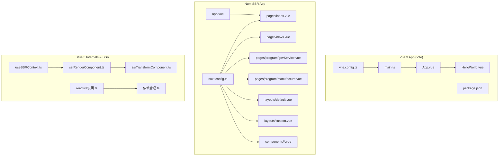
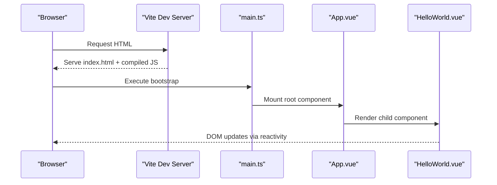
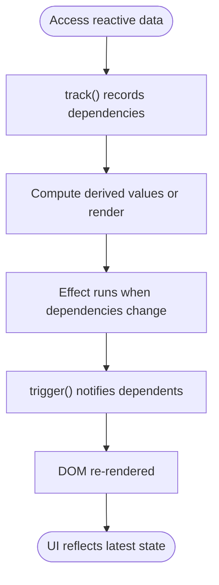
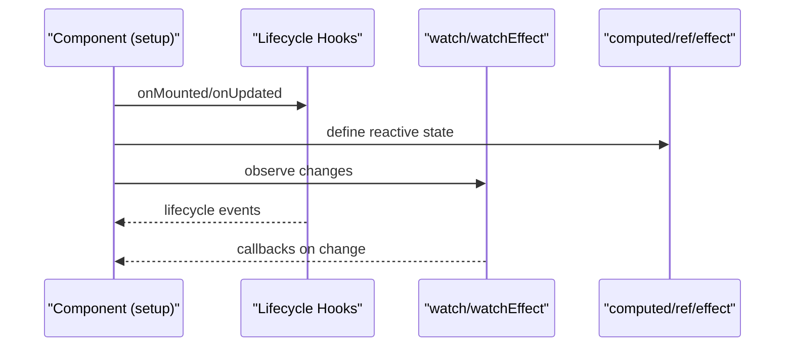
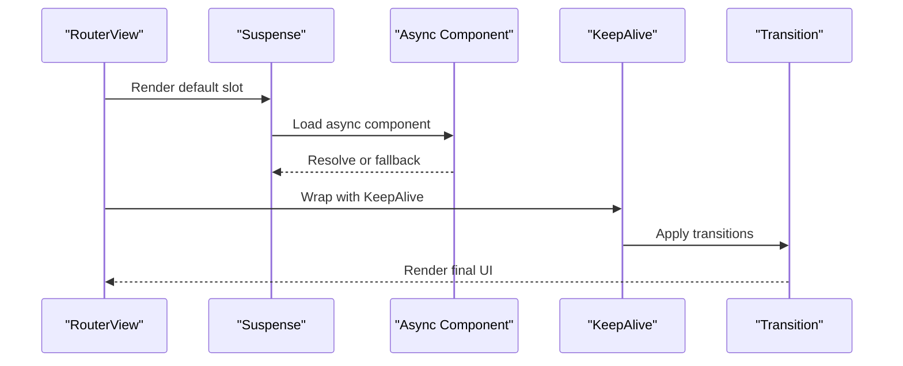
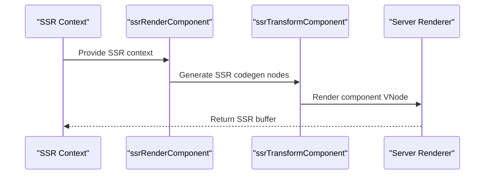
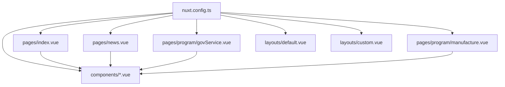
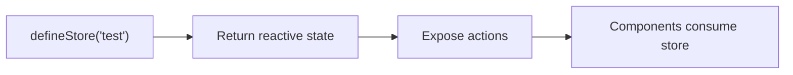
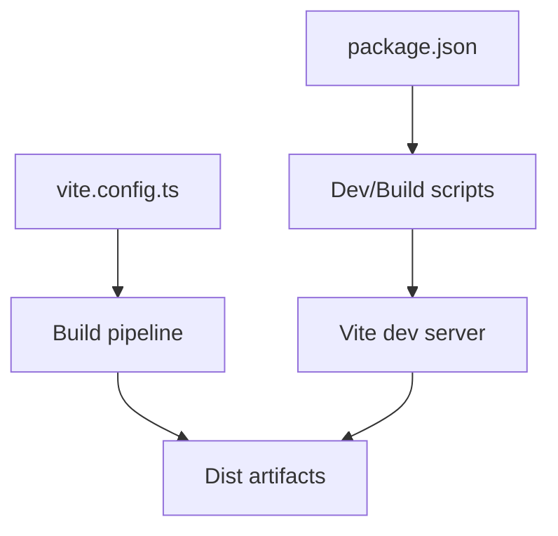
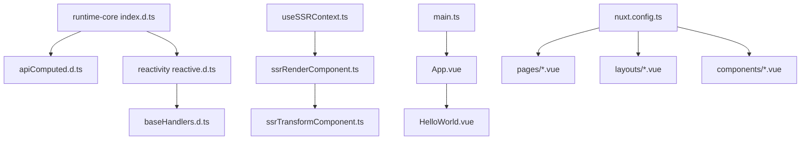

# Vue.js Framework

<cite>
**Referenced Files in This Document**
- [App.vue](file://demo/my-vue-app/src/App.vue)
- [HelloWorld.vue](file://demo/my-vue-app/src/components/HelloWorld.vue)
- [main.ts](file://demo/my-vue-app/src/main.ts)
- [vite.config.ts](file://demo/my-vue-app/vite.config.ts)
- [package.json](file://demo/my-vue-app/package.json)
- [nuxt.config.ts](file://demo/nuxt/demo_2/nuxt.config.ts)
- [index.vue](file://demo/nuxt/demo_2/app/pages/index.vue)
- [news.vue](file://demo/nuxt/demo_2/app/pages/news.vue)
- [govService.vue](file://demo/nuxt/demo_2/app/pages/program/govService.vue)
- [manufacture.vue](file://demo/nuxt/demo_2/app/pages/program/manufacture.vue)
- [default.vue](file://demo/nuxt/demo_2/app/layouts/default.vue)
- [custom.vue](file://demo/nuxt/demo_2/app/layouts/custom.vue)
- [AppAlert.vue](file://demo/nuxt/demo_2/app/components/AppAlert.vue)
- [LoadingData.vue](file://demo/nuxt/demo_2/app/components/LoadingData.vue)
- [Table.vue](file://demo/nuxt/demo_2/app/components/news/Table.vue)
- [Program.vue](file://demo/nuxt/demo_2/app/components/Program.vue)
- [app.vue](file://demo/nuxt/demo_2/app/app.vue)
- [useSsrContext.ts](file://源码学习/vue@3.5.26/code/packages/runtime-core/src/helpers/useSsrContext.ts)
- [ssrRenderComponent.ts](file://源码学习/vue@3.5.26/code/packages/server-renderer/src/helpers/ssrRenderComponent.ts)
- [ssrTransformComponent.ts](file://源码学习/vue@3.5.26/code/packages/compiler-ssr/src/transforms/ssrTransformComponent.ts)
- [Suspense.spec.ts](file://源码学习/vue@3.5.26/code/packages/route-core/__tests__/components/Suspense.spec.ts)
- [KeepAlive.spec.ts](file://源码学习/vue@3.5.26/code/packages/route-core/__tests__/components/KeepAlive.spec.ts)
- [BaseTransition.spec.ts](file://源码学习/vue@3.5.26/code/packages/route-core/__tests__/components/BaseTransition.spec.ts)
- [Transition.spec.ts](file://源码学习/vue@3.5.26/code/packages/vue/__tests__/e2e/Transition.spec.ts)
- [reactive.d.ts](file://源码学习/vue@3.5.26/code/temp/packages/reactivity/src/reactive.d.ts)
- [baseHandlers.d.ts](file://源码学习/vue@3.5.26/code/temp/packages/reactivity/src/baseHandlers.d.ts)
- [apiComputed.d.ts](file://源码学习/vue@3.5.26/code/temp/packages/route-core/src/apiComputed.d.ts)
- [index.d.ts](file://源码学习/vue@3.5.26/code/temp/packages/route-core/src/index.d.ts)
- [依赖管理.ts](file://源码学习/vue@3.5.26/playground/src/components/响应式/依赖管理/依赖管理.ts)
- [reactive说明.ts](file://源码学习/vue@3.5.26/playground/src/components/响应式/响应式数据/reactive说明.ts)
- [pinia-testStore.ts](file://源码学习/pinia-2@2.3.1/packages/nuxt/playground/domain/one/stores/testStore.ts)
- [legacy-ssr.spec.ts](file://源码学习/vite@5.2.11/playground/legacy/__tests__/ssr/legacy-ssr.spec.ts)
- [entry-compiler.js](file://源码学习/vue@2.6.14/_源码/platforms/web/entry-compiler.js)
</cite>

## Table of Contents
1. [Introduction](#introduction)
2. [Project Structure](#project-structure)
3. [Core Components](#core-components)
4. [Architecture Overview](#architecture-overview)
5. [Detailed Component Analysis](#detailed-component-analysis)
6. [Dependency Analysis](#dependency-analysis)
7. [Performance Considerations](#performance-considerations)
8. [Troubleshooting Guide](#troubleshooting-guide)
9. [Conclusion](#conclusion)
10. [Appendices](#appendices)

## Introduction
This document provides a comprehensive guide to the Vue.js framework with a focus on component architecture, reactive system, routing, and state management. It covers Vue 3 Composition API, Single File Components (SFC), and build tool integration. It also documents Nuxt.js for server-side rendering (SSR), static site generation (SSG), and full-stack Vue development. Practical examples demonstrate component composition, lifecycle management, and backend integration patterns.

## Project Structure
The repository includes:
- A Vue 3 + Vite minimal application demonstrating SFC and Composition API.
- A Nuxt 2 application showcasing SSR, layouts, pages, and components.
- Vue 3 source code playgrounds and SSR helpers for understanding internals.
- Pinia examples for state management and Vite SSR tests.

**Diagram sources**
- [App.vue](file://demo/my-vue-app/src/App.vue)
- [HelloWorld.vue](file://demo/my-vue-app/src/components/HelloWorld.vue)
- [main.ts](file://demo/my-vue-app/src/main.ts)
- [vite.config.ts](file://demo/my-vue-app/vite.config.ts)
- [package.json](file://demo/my-vue-app/package.json)
- [nuxt.config.ts](file://demo/nuxt/demo_2/nuxt.config.ts)
- [index.vue](file://demo/nuxt/demo_2/app/pages/index.vue)
- [news.vue](file://demo/nuxt/demo_2/app/pages/news.vue)
- [govService.vue](file://demo/nuxt/demo_2/app/pages/program/govService.vue)
- [manufacture.vue](file://demo/nuxt/demo_2/app/pages/program/manufacture.vue)
- [default.vue](file://demo/nuxt/demo_2/app/layouts/default.vue)
- [custom.vue](file://demo/nuxt/demo_2/app/layouts/custom.vue)
- [AppAlert.vue](file://demo/nuxt/demo_2/app/components/AppAlert.vue)
- [LoadingData.vue](file://demo/nuxt/demo_2/app/components/LoadingData.vue)
- [Table.vue](file://demo/nuxt/demo_2/app/components/news/Table.vue)
- [Program.vue](file://demo/nuxt/demo_2/app/components/Program.vue)
- [app.vue](file://demo/nuxt/demo_2/app/app.vue)
- [useSsrContext.ts](file://源码学习/vue@3.5.26/code/packages/runtime-core/src/helpers/useSsrContext.ts)
- [ssrRenderComponent.ts](file://源码学习/vue@3.5.26/code/packages/server-renderer/src/helpers/ssrRenderComponent.ts)
- [ssrTransformComponent.ts](file://源码学习/vue@3.5.26/code/packages/compiler-ssr/src/transforms/ssrTransformComponent.ts)
- [reactive说明.ts](file://源码学习/vue@3.5.26/playground/src/components/响应式/响应式数据/reactive说明.ts)
- [依赖管理.ts](file://源码学习/vue@3.5.26/playground/src/components/响应式/依赖管理/依赖管理.ts)

**Section sources**
- [App.vue](file://demo/my-vue-app/src/App.vue)
- [HelloWorld.vue](file://demo/my-vue-app/src/components/HelloWorld.vue)
- [main.ts](file://demo/my-vue-app/src/main.ts)
- [vite.config.ts](file://demo/my-vue-app/vite.config.ts)
- [package.json](file://demo/my-vue-app/package.json)
- [nuxt.config.ts](file://demo/nuxt/demo_2/nuxt.config.ts)
- [index.vue](file://demo/nuxt/demo_2/app/pages/index.vue)
- [news.vue](file://demo/nuxt/demo_2/app/pages/news.vue)
- [govService.vue](file://demo/nuxt/demo_2/app/pages/program/govService.vue)
- [manufacture.vue](file://demo/nuxt/demo_2/app/pages/program/manufacture.vue)
- [default.vue](file://demo/nuxt/demo_2/app/layouts/default.vue)
- [custom.vue](file://demo/nuxt/demo_2/app/layouts/custom.vue)
- [AppAlert.vue](file://demo/nuxt/demo_2/app/components/AppAlert.vue)
- [LoadingData.vue](file://demo/nuxt/demo_2/app/components/LoadingData.vue)
- [Table.vue](file://demo/nuxt/demo_2/app/components/news/Table.vue)
- [Program.vue](file://demo/nuxt/demo_2/app/components/Program.vue)
- [app.vue](file://demo/nuxt/demo_2/app/app.vue)

## Core Components
- Vue 3 Composition API and SFC:
  - The minimal app demonstrates a root component and a reusable child component, configured via Vite.
  - The Composition API exports include reactive primitives, watchers, lifecycle hooks, and setup helpers.
- Reactive system fundamentals:
  - Reactive primitives and handlers are defined in the reactivity package and used throughout the runtime.
- Nuxt SSR application:
  - Pages, layouts, and components are organized under the Nuxt app directory with a central configuration file.

Practical references:
- Root app and component composition: [App.vue](file://demo/my-vue-app/src/App.vue), [HelloWorld.vue](file://demo/my-vue-app/src/components/HelloWorld.vue)
- Application bootstrap: [main.ts](file://demo/my-vue-app/src/main.ts)
- Build tool integration: [vite.config.ts](file://demo/my-vue-app/vite.config.ts), [package.json](file://demo/my-vue-app/package.json)
- Vue 3 API surface: [index.d.ts](file://源码学习/vue@3.5.26/code/temp/packages/route-core/src/index.d.ts), [apiComputed.d.ts](file://源码学习/vue@3.5.26/code/temp/packages/route-core/src/apiComputed.d.ts)
- Reactive internals: [reactive.d.ts](file://源码学习/vue@3.5.26/code/temp/packages/reactivity/src/reactive.d.ts), [baseHandlers.d.ts](file://源码学习/vue@3.5.26/code/temp/packages/reactivity/src/baseHandlers.d.ts)

**Section sources**
- [App.vue](file://demo/my-vue-app/src/App.vue)
- [HelloWorld.vue](file://demo/my-vue-app/src/components/HelloWorld.vue)
- [main.ts](file://demo/my-vue-app/src/main.ts)
- [vite.config.ts](file://demo/my-vue-app/vite.config.ts)
- [package.json](file://demo/my-vue-app/package.json)
- [index.d.ts](file://源码学习/vue@3.5.26/code/temp/packages/route-core/src/index.d.ts)
- [apiComputed.d.ts](file://源码学习/vue@3.5.26/code/temp/packages/route-core/src/apiComputed.d.ts)
- [reactive.d.ts](file://源码学习/vue@3.5.26/code/temp/packages/reactivity/src/reactive.d.ts)
- [baseHandlers.d.ts](file://源码学习/vue@3.5.26/code/temp/packages/reactivity/src/baseHandlers.d.ts)

## Architecture Overview
This section maps how a Vue 3 app initializes, renders components, and integrates with SSR and build tools.

**Diagram sources**
- [main.ts](file://demo/my-vue-app/src/main.ts)
- [App.vue](file://demo/my-vue-app/src/App.vue)
- [HelloWorld.vue](file://demo/my-vue-app/src/components/HelloWorld.vue)

**Section sources**
- [main.ts](file://demo/my-vue-app/src/main.ts)
- [App.vue](file://demo/my-vue-app/src/App.vue)
- [HelloWorld.vue](file://demo/my-vue-app/src/components/HelloWorld.vue)

## Detailed Component Analysis

### Vue 3 Reactive System
The reactive system centers around proxies and dependency tracking. Key concepts:
- Reactive objects and refs are created via Proxy handlers.
- Computed values and watchers are built on top of effects and dependency collections.
- The playground demonstrates dependency collection and triggers.

**Diagram sources**
- [依赖管理.ts](file://源码学习/vue@3.5.26/playground/src/components/响应式/依赖管理/依赖管理.ts)
- [reactive说明.ts](file://源码学习/vue@3.5.26/playground/src/components/响应式/响应式数据/reactive说明.ts)
- [reactive.d.ts](file://源码学习/vue@3.5.26/code/temp/packages/reactivity/src/reactive.d.ts)
- [baseHandlers.d.ts](file://源码学习/vue@3.5.26/code/temp/packages/reactivity/src/baseHandlers.d.ts)

**Section sources**
- [依赖管理.ts](file://源码学习/vue@3.5.26/playground/src/components/响应式/依赖管理/依赖管理.ts)
- [reactive说明.ts](file://源码学习/vue@3.5.26/playground/src/components/响应式/响应式数据/reactive说明.ts)
- [reactive.d.ts](file://源码学习/vue@3.5.26/code/temp/packages/reactivity/src/reactive.d.ts)
- [baseHandlers.d.ts](file://源码学习/vue@3.5.26/code/temp/packages/reactivity/src/baseHandlers.d.ts)

### Component Composition and Lifecycle
- Composition API usage is exposed via the runtime index and computed helpers.
- Lifecycle hooks are part of the runtime exports and are used within setup blocks.
- Built-in transitions and keep-alive behavior are covered by tests and internal components.

**Diagram sources**
- [index.d.ts](file://源码学习/vue@3.5.26/code/temp/packages/route-core/src/index.d.ts)
- [apiComputed.d.ts](file://源码学习/vue@3.5.26/code/temp/packages/route-core/src/apiComputed.d.ts)

**Section sources**
- [index.d.ts](file://源码学习/vue@3.5.26/code/temp/packages/route-core/src/index.d.ts)
- [apiComputed.d.ts](file://源码学习/vue@3.5.26/code/temp/packages/route-core/src/apiComputed.d.ts)

### Routing and Navigation Patterns
- Router-driven navigation is demonstrated in tests using router-like views and suspense boundaries.
- KeepAlive and transitions integrate with navigation to manage component lifecycles and animations.

**Diagram sources**
- [Suspense.spec.ts](file://源码学习/vue@3.5.26/code/packages/route-core/__tests__/components/Suspense.spec.ts)
- [KeepAlive.spec.ts](file://源码学习/vue@3.5.26/code/packages/route-core/__tests__/components/KeepAlive.spec.ts)
- [BaseTransition.spec.ts](file://源码学习/vue@3.5.26/code/packages/route-core/__tests__/components/BaseTransition.spec.ts)
- [Transition.spec.ts](file://源码学习/vue@3.5.26/code/packages/vue/__tests__/e2e/Transition.spec.ts)

**Section sources**
- [Suspense.spec.ts](file://源码学习/vue@3.5.26/code/packages/route-core/__tests__/components/Suspense.spec.ts)
- [KeepAlive.spec.ts](file://源码学习/vue@3.5.26/code/packages/route-core/__tests__/components/KeepAlive.spec.ts)
- [BaseTransition.spec.ts](file://源码学习/vue@3.5.26/code/packages/route-core/__tests__/components/BaseTransition.spec.ts)
- [Transition.spec.ts](file://源码学习/vue@3.5.26/code/packages/vue/__tests__/e2e/Transition.spec.ts)

### SSR and Server Rendering
- SSR context injection and component rendering helpers enable server-side rendering.
- Compiler transforms and renderer helpers coordinate component rendering during SSR.

**Diagram sources**
- [useSsrContext.ts](file://源码学习/vue@3.5.26/code/packages/runtime-core/src/helpers/useSsrContext.ts)
- [ssrRenderComponent.ts](file://源码学习/vue@3.5.26/code/packages/server-renderer/src/helpers/ssrRenderComponent.ts)
- [ssrTransformComponent.ts](file://源码学习/vue@3.5.26/code/packages/compiler-ssr/src/transforms/ssrTransformComponent.ts)

**Section sources**
- [useSsrContext.ts](file://源码学习/vue@3.5.26/code/packages/runtime-core/src/helpers/useSsrContext.ts)
- [ssrRenderComponent.ts](file://源码学习/vue@3.5.26/code/packages/server-renderer/src/helpers/ssrRenderComponent.ts)
- [ssrTransformComponent.ts](file://源码学习/vue@3.5.26/code/packages/compiler-ssr/src/transforms/ssrTransformComponent.ts)

### Nuxt.js SSR, SSG, and Full-Stack Patterns
- Pages and layouts organize routes and templates.
- Components encapsulate UI concerns and data presentation.
- Store usage demonstrates state management integration.

**Diagram sources**
- [nuxt.config.ts](file://demo/nuxt/demo_2/nuxt.config.ts)
- [index.vue](file://demo/nuxt/demo_2/app/pages/index.vue)
- [news.vue](file://demo/nuxt/demo_2/app/pages/news.vue)
- [govService.vue](file://demo/nuxt/demo_2/app/pages/program/govService.vue)
- [manufacture.vue](file://demo/nuxt/demo_2/app/pages/program/manufacture.vue)
- [default.vue](file://demo/nuxt/demo_2/app/layouts/default.vue)
- [custom.vue](file://demo/nuxt/demo_2/app/layouts/custom.vue)
- [AppAlert.vue](file://demo/nuxt/demo_2/app/components/AppAlert.vue)
- [LoadingData.vue](file://demo/nuxt/demo_2/app/components/LoadingData.vue)
- [Table.vue](file://demo/nuxt/demo_2/app/components/news/Table.vue)
- [Program.vue](file://demo/nuxt/demo_2/app/components/Program.vue)
- [app.vue](file://demo/nuxt/demo_2/app/app.vue)

**Section sources**
- [nuxt.config.ts](file://demo/nuxt/demo_2/nuxt.config.ts)
- [index.vue](file://demo/nuxt/demo_2/app/pages/index.vue)
- [news.vue](file://demo/nuxt/demo_2/app/pages/news.vue)
- [govService.vue](file://demo/nuxt/demo_2/app/pages/program/govService.vue)
- [manufacture.vue](file://demo/nuxt/demo_2/app/pages/program/manufacture.vue)
- [default.vue](file://demo/nuxt/demo_2/app/layouts/default.vue)
- [custom.vue](file://demo/nuxt/demo_2/app/layouts/custom.vue)
- [AppAlert.vue](file://demo/nuxt/demo_2/app/components/AppAlert.vue)
- [LoadingData.vue](file://demo/nuxt/demo_2/app/components/LoadingData.vue)
- [Table.vue](file://demo/nuxt/demo_2/app/components/news/Table.vue)
- [Program.vue](file://demo/nuxt/demo_2/app/components/Program.vue)
- [app.vue](file://demo/nuxt/demo_2/app/app.vue)

### State Management with Pinia
- Pinia stores can be defined and used within Nuxt applications.
- The example store illustrates store definition and usage patterns.

**Diagram sources**
- [pinia-testStore.ts](file://源码学习/pinia-2@2.3.1/packages/nuxt/playground/domain/one/stores/testStore.ts)

**Section sources**
- [pinia-testStore.ts](file://源码学习/pinia-2@2.3.1/packages/nuxt/playground/domain/one/stores/testStore.ts)

### Build Tool Integration (Vite)
- Vite configuration and package scripts demonstrate bundling and dev server setup for Vue apps.
- Legacy SSR tests confirm SSR builds and environment detection.

**Diagram sources**
- [vite.config.ts](file://demo/my-vue-app/vite.config.ts)
- [package.json](file://demo/my-vue-app/package.json)
- [legacy-ssr.spec.ts](file://源码学习/vite@5.2.11/playground/legacy/__tests__/ssr/legacy-ssr.spec.ts)

**Section sources**
- [vite.config.ts](file://demo/my-vue-app/vite.config.ts)
- [package.json](file://demo/my-vue-app/package.json)
- [legacy-ssr.spec.ts](file://源码学习/vite@5.2.11/playground/legacy/__tests__/ssr/legacy-ssr.spec.ts)

## Dependency Analysis
This section outlines how components, runtime APIs, and SSR helpers relate to each other.

**Diagram sources**
- [index.d.ts](file://源码学习/vue@3.5.26/code/temp/packages/route-core/src/index.d.ts)
- [apiComputed.d.ts](file://源码学习/vue@3.5.26/code/temp/packages/route-core/src/apiComputed.d.ts)
- [reactive.d.ts](file://源码学习/vue@3.5.26/code/temp/packages/reactivity/src/reactive.d.ts)
- [baseHandlers.d.ts](file://源码学习/vue@3.5.26/code/temp/packages/reactivity/src/baseHandlers.d.ts)
- [useSsrContext.ts](file://源码学习/vue@3.5.26/code/packages/runtime-core/src/helpers/useSsrContext.ts)
- [ssrRenderComponent.ts](file://源码学习/vue@3.5.26/code/packages/server-renderer/src/helpers/ssrRenderComponent.ts)
- [ssrTransformComponent.ts](file://源码学习/vue@3.5.26/code/packages/compiler-ssr/src/transforms/ssrTransformComponent.ts)
- [main.ts](file://demo/my-vue-app/src/main.ts)
- [App.vue](file://demo/my-vue-app/src/App.vue)
- [HelloWorld.vue](file://demo/my-vue-app/src/components/HelloWorld.vue)
- [nuxt.config.ts](file://demo/nuxt/demo_2/nuxt.config.ts)

**Section sources**
- [index.d.ts](file://源码学习/vue@3.5.26/code/temp/packages/route-core/src/index.d.ts)
- [apiComputed.d.ts](file://源码学习/vue@3.5.26/code/temp/packages/route-core/src/apiComputed.d.ts)
- [reactive.d.ts](file://源码学习/vue@3.5.26/code/temp/packages/reactivity/src/reactive.d.ts)
- [baseHandlers.d.ts](file://源码学习/vue@3.5.26/code/temp/packages/reactivity/src/baseHandlers.d.ts)
- [useSsrContext.ts](file://源码学习/vue@3.5.26/code/packages/runtime-core/src/helpers/useSsrContext.ts)
- [ssrRenderComponent.ts](file://源码学习/vue@3.5.26/code/packages/server-renderer/src/helpers/ssrRenderComponent.ts)
- [ssrTransformComponent.ts](file://源码学习/vue@3.5.26/code/packages/compiler-ssr/src/transforms/ssrTransformComponent.ts)
- [main.ts](file://demo/my-vue-app/src/main.ts)
- [App.vue](file://demo/my-vue-app/src/App.vue)
- [HelloWorld.vue](file://demo/my-vue-app/src/components/HelloWorld.vue)
- [nuxt.config.ts](file://demo/nuxt/demo_2/nuxt.config.ts)

## Performance Considerations
- Prefer shallow reactivity for large immutable structures to avoid deep traversal costs.
- Use computed for derived state and watchEffect for side effects to minimize unnecessary recomputations.
- KeepAlive can cache rendered components to reduce mount/unmount overhead during navigation.
- SSR rendering helpers and transforms optimize server-side rendering performance.

[No sources needed since this section provides general guidance]

## Troubleshooting Guide
- SSR context warnings: Ensure SSR context is provided conditionally and only in server builds.
- Transition and KeepAlive interactions: Verify modes and include lists to prevent unexpected unmounts.
- Vite SSR builds: Confirm legacy SSR tests pass and environment variables are correctly set.

**Section sources**
- [useSsrContext.ts](file://源码学习/vue@3.5.26/code/packages/runtime-core/src/helpers/useSsrContext.ts)
- [legacy-ssr.spec.ts](file://源码学习/vite@5.2.11/playground/legacy/__tests__/ssr/legacy-ssr.spec.ts)

## Conclusion
This guide mapped Vue 3’s reactive system, component composition, routing, and SSR capabilities, and connected them to a real-world Nuxt application. By leveraging the Composition API, SFC, and SSR helpers, developers can build scalable, maintainable, and performant applications.

[No sources needed since this section summarizes without analyzing specific files]

## Appendices
- SFC parsing and compilation entry for Vue 2 platforms is available for historical context.

**Section sources**
- [entry-compiler.js](file://源码学习/vue@2.6.14/_源码/platforms/web/entry-compiler.js)