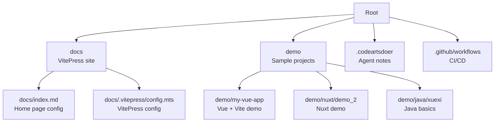
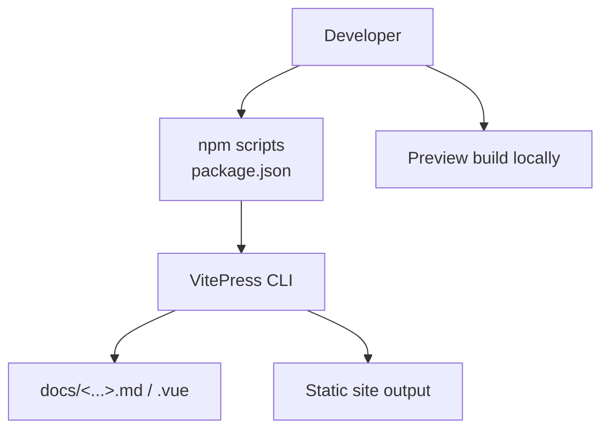
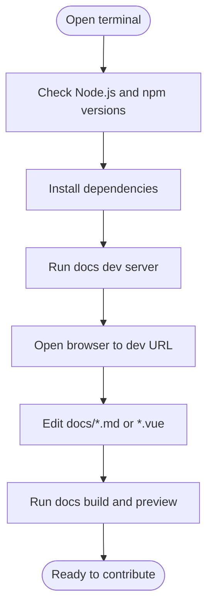
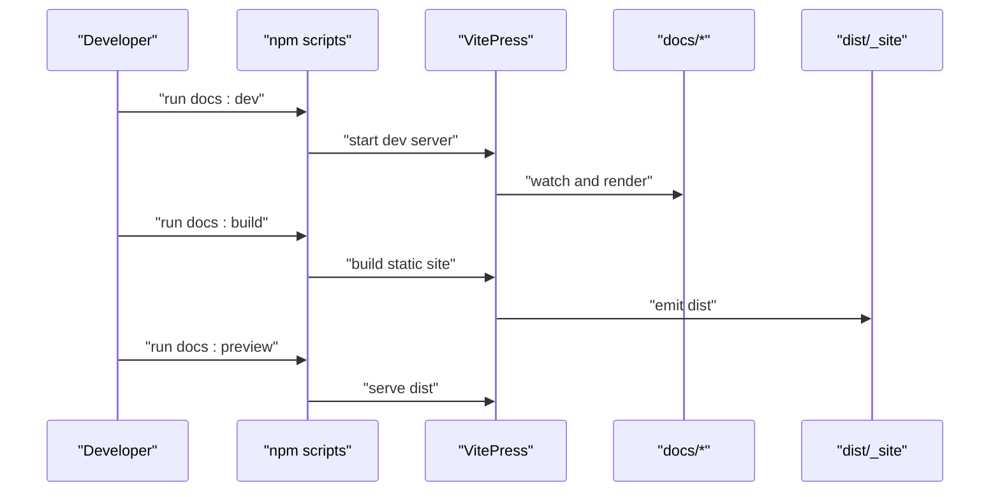
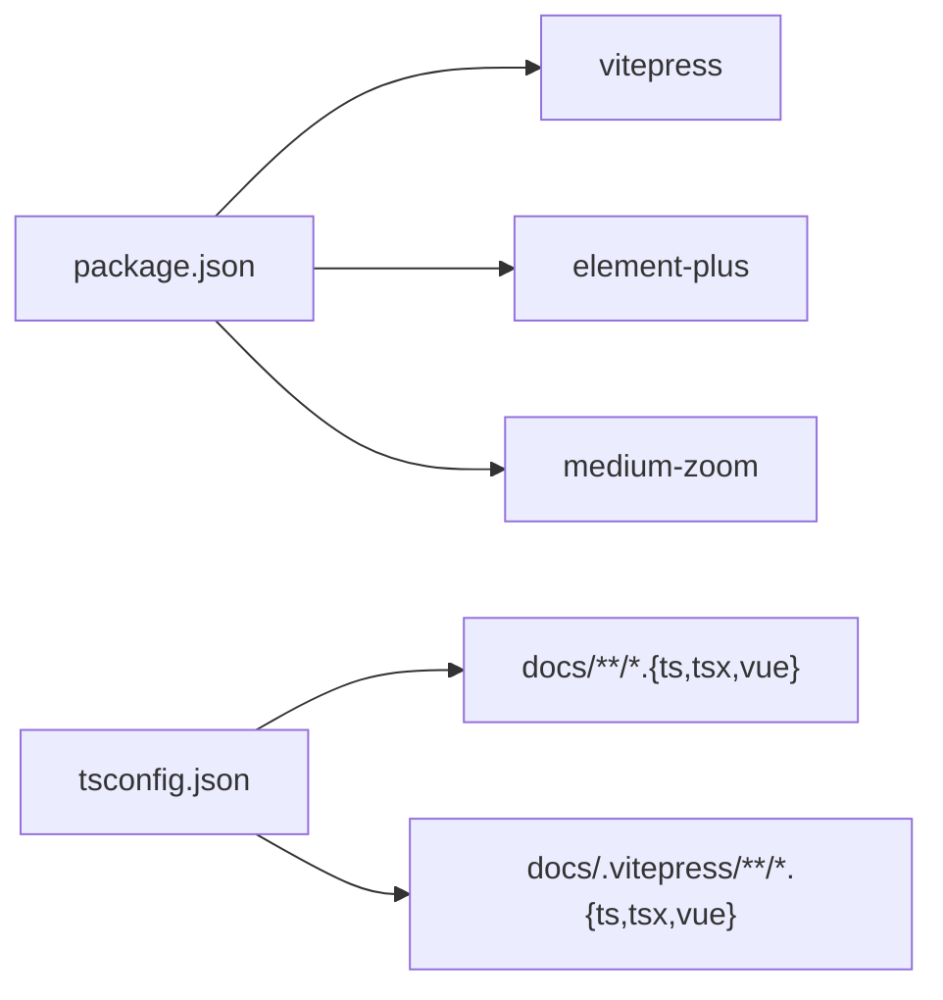

# Getting Started

<cite>
**Referenced Files in This Document**
- [README.md](file://README.md)
- [package.json](file://package.json)
- [tsconfig.json](file://tsconfig.json)
- [docs/index.md](file://docs/index.md)
- [docs/.vitepress/config.mts](file://docs/.vitepress/config.mts)
- [.codeartsdoer/AGENTS.md](file://.codeartsdoer/AGENTS.md)
- [.github/workflows/deploy.yml](file://.github/workflows/deploy.yml)
- [demo/my-vue-app/package.json](file://demo/my-vue-app/package.json)
- [demo/nuxt/demo_2/package.json](file://demo/nuxt/demo_2/package.json)
- [demo/java/xuexi/01.基础/01.变量定义/Main.java](file://demo/java/xuexi/01.基础/01.变量定义/Main.java)
</cite>

## Table of Contents
1. [Introduction](#introduction)
2. [Project Structure](#project-structure)
3. [Core Components](#core-components)
4. [Architecture Overview](#architecture-overview)
5. [Detailed Component Analysis](#detailed-component-analysis)
6. [Dependency Analysis](#dependency-analysis)
7. [Performance Considerations](#performance-considerations)
8. [Troubleshooting Guide](#troubleshooting-guide)
9. [Conclusion](#conclusion)
10. [Appendices](#appendices)

## Introduction
This guide helps you install, run, and contribute to the wzb knowledge base project. It is a documentation site built with VitePress, containing curated notes, demos, and learning materials across frontend, engineering, protocols, and more. You will learn how to set up a local development environment, run the docs site, add new content, and optionally deploy it.

## Project Structure
At a high level, the repository is organized as:
- Root metadata and scripts
- docs: VitePress-powered documentation site with categorized topics
- demo: Sample projects and exercises (Java, Vue, Nuxt, Node, TypeScript, network protocol examples)
- .codeartsdoer: AI agent-related notes
- .github/workflows: CI/CD pipeline configuration (deployment)

**Diagram sources**
- [docs/index.md](file://docs/index.md)
- [docs/.vitepress/config.mts](file://docs/.vitepress/config.mts)
- [demo/my-vue-app/package.json](file://demo/my-vue-app/package.json)
- [demo/nuxt/demo_2/package.json](file://demo/nuxt/demo_2/package.json)
- [demo/java/xuexi/01.基础/01.变量定义/Main.java](file://demo/java/xuexi/01.基础/01.变量定义/Main.java)

**Section sources**
- [README.md](file://README.md)
- [package.json](file://package.json)

## Core Components
- VitePress site under docs: Home page layout, navigation, and content sections
- Build and preview scripts defined in the root package manifest
- TypeScript configuration scoped to docs and VitePress files
- Demo projects showcasing frontend frameworks and protocols

Key capabilities:
- Local development server for docs
- Static site generation for production builds
- Preview mode for build verification

**Section sources**
- [package.json](file://package.json)
- [tsconfig.json](file://tsconfig.json)
- [docs/index.md](file://docs/index.md)

## Architecture Overview
The documentation site is powered by VitePress. Contributors write Markdown/Vue content under docs, then use npm scripts to develop, build, and preview the site.

**Diagram sources**
- [package.json](file://package.json)
- [docs/index.md](file://docs/index.md)

## Detailed Component Analysis

### Local Development Environment Setup
Follow these steps to run the docs site locally:

1. Prerequisites
- Operating system: Windows/macOS/Linux
- Node.js: Ensure a recent LTS version is installed
- Package manager: npm (as configured in the project)

2. Clone and install
- Install dependencies using the project’s package manager
- The project sets a package manager version in its manifest

3. Run the development server
- Use the documented script to start VitePress in dev mode
- Open the displayed URL in your browser

4. Verify TypeScript configuration
- The TypeScript compiler options target docs content and VitePress config files

5. Optional: Explore demo projects
- The demo directory contains small apps (e.g., Vue, Nuxt, Java) you can run independently

**Section sources**
- [package.json](file://package.json)
- [tsconfig.json](file://tsconfig.json)
- [demo/my-vue-app/package.json](file://demo/my-vue-app/package.json)
- [demo/nuxt/demo_2/package.json](file://demo/nuxt/demo_2/package.json)
- [demo/java/xuexi/01.基础/01.变量定义/Main.java](file://demo/java/xuexi/01.基础/01.变量定义/Main.java)

### Build and Preview Workflow
- Development: start the VitePress dev server
- Production build: generate static HTML/CSS/JS
- Preview build locally: serve the generated static site to validate before deploying

**Diagram sources**
- [package.json](file://package.json)

**Section sources**
- [package.json](file://package.json)

### Adding New Content
- Place new Markdown or Vue SFC files under docs
- Reference new pages in navigation via frontmatter or VitePress config
- Use the home page frontmatter to surface new sections

Example reference points:
- Home page frontmatter defines hero, features, and links
- VitePress config file governs site metadata and theme behavior

**Section sources**
- [docs/index.md](file://docs/index.md)
- [docs/.vitepress/config.mts](file://docs/.vitepress/config.mts)

### Deployment Procedures
- The repository includes a CI/CD workflow file for automated deployment
- Configure your hosting provider to deploy the static output produced by the build script
- Trigger the workflow to publish updates automatically

Note: The workflow file exists in the repository; ensure your hosting platform supports static site deployment.

**Section sources**
- [.github/workflows/deploy.yml](file://.github/workflows/deploy.yml)

### Contributing Guidelines
- Keep content focused on knowledge sharing and practical examples
- Use clear headings and concise descriptions
- Link related demos and external resources thoughtfully
- Follow the existing folder structure and naming conventions

Optional contributor context:
- The codeartsdoer directory contains notes about AI agents; treat it as a separate area for related experiments

**Section sources**
- [.codeartsdoer/AGENTS.md](file://.codeartsdoer/AGENTS.md)

## Dependency Analysis
The project relies on:
- VitePress for documentation site generation
- Element Plus and medium-zoom for UI enhancements
- TypeScript configuration scoped to docs and VitePress files

**Diagram sources**
- [package.json](file://package.json)
- [tsconfig.json](file://tsconfig.json)

**Section sources**
- [package.json](file://package.json)
- [tsconfig.json](file://tsconfig.json)

## Performance Considerations
- Keep images and assets optimized; place them under docs/public when appropriate
- Prefer lightweight Markdown and minimal Vue components in docs
- Use preview builds to catch large bundle regressions early

## Troubleshooting Guide
Common setup issues and resolutions:
- Node/npm version mismatch
  - Ensure your Node.js version aligns with the project’s expectations
- Missing dependencies after clone
  - Reinstall dependencies using the project’s package manager
- Port conflicts during dev server startup
  - Stop other processes using the port or configure a different port in VitePress settings
- TypeScript errors in docs
  - Review tsconfig.json include/exclude patterns and adjust paths accordingly
- Build failures
  - Run the build script and inspect console logs; fix any frontmatter or import errors surfaced by VitePress

**Section sources**
- [package.json](file://package.json)
- [tsconfig.json](file://tsconfig.json)

## Conclusion
You now have the essentials to install the project, run the docs site locally, add content, and prepare for deployment. Explore the demo projects to deepen your understanding of frontend technologies and protocols, and leverage the VitePress workflow to maintain a fast, searchable knowledge base.

## Appendices

### Quick Commands Reference
- Start development server: run the docs dev script
- Build for production: run the docs build script
- Preview production build: run the docs preview script

**Section sources**
- [package.json](file://package.json)