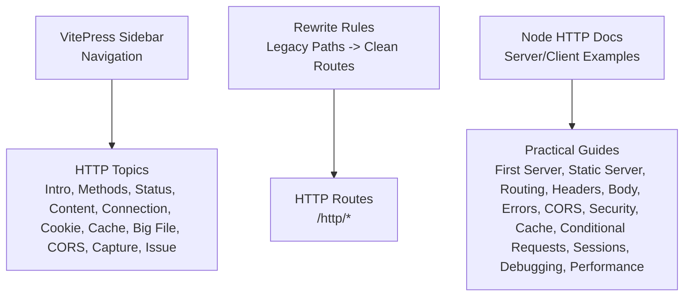
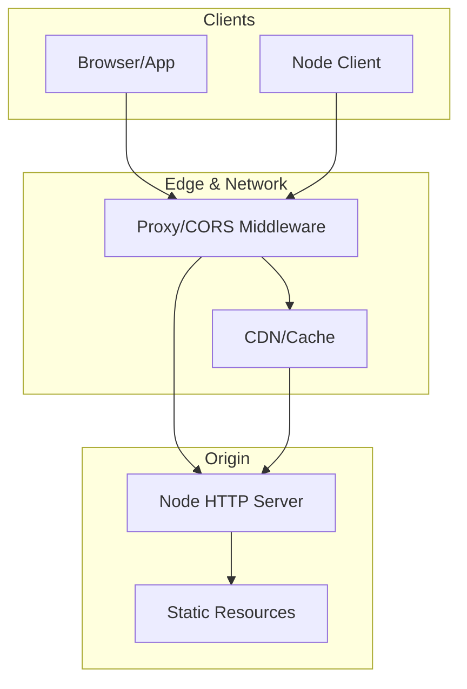
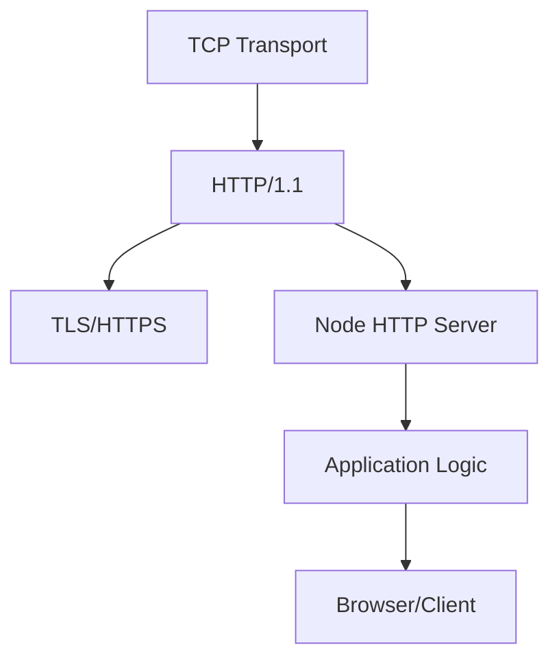

# HTTP Protocol

<cite>
**Referenced Files in This Document**
- [sidebar.mts](file://docs/.vitepress/config/sidebar.mts)
- [rewrites.mts](file://docs/.vitepress/config/rewrites.mts)
- [01_index.md](file://docs/03_网络协议/01_http/01_index.md)
- [02_请求方法.md](file://docs/03_网络协议/01_http/02_请求方法.md)
- [04_内容协商.md](file://docs/03_网络协议/01_http/04_内容协商.md)
- [05_连接管理.md](file://docs/03_网络协议/01_http/05_连接管理.md)
- [06_cookie.md](file://docs/03_网络协议/01_http/06_cookie.md)
- [10_抓包分析.md](file://docs/03_网络协议/01_http/10_抓包分析.md)
- [11_问题.md](file://docs/03_网络协议/01_http/11_问题.md)
- [01_前端/15_cookie.md](file://docs/01_前端/03_js/15_cookie.md)
- [01_前端/16_WebStorage.md](file://docs/01_前端/03_js/16_WebStorage.md)
- [04_浏览器/06_跨站请求伪造_CSRF.md](file://docs/01_浏览器/06_跨站请求伪造_CSRF.md)
- [04_更多/01_node/01_环境搭建.md](file://docs/04_更多/01_node/01_环境搭建.md)
- [04_更多/01_node/02_第一个HTTP服务器.md](file://docs/04_更多/01_node/02_第一个HTTP服务器.md)
- [04_更多/01_node/03_静态资源服务器.md](file://docs/04_更多/01_node/03_静态资源服务器.md)
- [04_更多/01_node/04_路由与中间件.md](file://docs/04_更多/01_node/04_路由与中间件.md)
- [04_更多/01_node/05_响应头与状态码.md](file://docs/04_更多/01_node/05_响应头与状态码.md)
- [04_更多/01_node/06_请求体解析.md](file://docs/04_更多/01_node/06_请求体解析.md)
- [04_更多/01_node/07_错误处理.md](file://docs/04_更多/01_node/07_错误处理.md)
- [04_更多/01_node/08_性能优化.md](file://docs/04_更多/01_node/08_性能优化.md)
- [04_更多/01_node/09_调试技巧.md](file://docs/04_更多/01_node/09_调试技巧.md)
- [04_更多/01_node/10_CORS.md](file://docs/04_更多/01_node/10_CORS.md)
- [04_更多/01_node/11_安全考虑.md](file://docs/04_更多/01_node/11_安全考虑.md)
- [04_更多/01_node/12_缓存策略.md](file://docs/04_更多/01_node/12_缓存策略.md)
- [04_更多/01_node/13_条件请求.md](file://docs/04_更多/01_node/13_条件请求.md)
- [04_更多/01_node/14_会话管理.md](file://docs/04_更多/01_node/14_会话管理.md)
- [04_更多/01_node/15_客户端示例.md](file://docs/04_更多/01_node/15_客户端示例.md)
- [04_更多/01_node/16_实战项目.md](file://docs/04_更多/01_node/16_实战项目.md)
- [04_更多/01_node/17_最佳实践.md](file://docs/04_更多/01_node/17_最佳实践.md)
- [04_更多/01_node/18_常见陷阱.md](file://docs/04_更多/01_node/18_常见陷阱.md)
- [04_更多/01_node/19_故障排查.md](file://docs/04_更多/01_node/19_故障排查.md)
- [04_更多/01_node/20_性能基准.md](file://docs/04_更多/01_node/20_性能基准.md)
- [04_更多/01_node/21_监控与日志.md](file://docs/04_更多/01_node/21_监控与日志.md)
- [04_更多/01_node/22_部署建议.md](file://docs/04_更多/01_node/22_部署建议.md)
- [04_更多/01_node/23_版本迁移.md](file://docs/04_更多/01_node/23_版本迁移.md)
- [04_更多/01_node/24_社区资源.md](file://docs/04_更多/01_node/24_社区资源.md)
- [04_更多/01_node/25_扩展阅读.md](file://docs/04_更多/01_node/25_扩展阅读.md)
- [04_更多/01_node/26_附录.md](file://docs/04_更多/01_node/26_附录.md)
- [04_更多/01_node/27_索引.md](file://docs/04_更多/01_node/27_索引.md)
- [04_更多/01_node/28_术语表.md](file://docs/04_更多/01_node/28_术语表.md)
- [04_更多/01_node/29_致谢.md](file://docs/04_更多/01_node/29_致谢.md)
- [04_更多/01_node/30_版权说明.md](file://docs/04_更多/01_node/30_版权说明.md)
- [04_更多/01_node/31_更新日志.md](file://docs/04_更多/01_node/31_更新日志.md)
- [04_更多/01_node/32_贡献指南.md](file://docs/04_更多/01_node/32_贡献指南.md)
- [04_更多/01_node/33_免责声明.md](file://docs/04_更多/01_node/33_免责声明.md)
- [04_更多/01_node/34_使用条款.md](file://docs/04_更多/01_node/34_使用条款.md)
- [04_更多/01_node/35_隐私政策.md](file://docs/04_更多/01_node/35_隐私政策.md)
- [04_更多/01_node/36_服务条款.md](file://docs/04_更多/01_node/36_服务条款.md)
- [04_更多/01_node/37_法律声明.md](file://docs/04_更多/01_node/37_法律声明.md)
- [04_更多/01_node/38_责任限制.md](file://docs/04_更多/01_node/38_责任限制.md)
- [04_更多/01_node/39_保险信息.md](file://docs/04_更多/01_node/39_保险信息.md)
- [04_更多/01_node/40_合规要求.md](file://docs/04_更多/01_node/40_合规要求.md)
- [04_更多/01_node/41_审计要求.md](file://docs/04_更多/01_node/41_审计要求.md)
- [04_更多/01_node/42_数据保护.md](file://docs/04_更多/01_node/42_数据保护.md)
- [04_更多/01_node/43_知识产权.md](file://docs/04_更多/01_node/43_知识产权.md)
- [04_更多/01_node/44_商标信息.md](file://docs/04_更多/01_node/44_商标信息.md)
- [04_更多/01_node/45_专利信息.md](file://docs/04_更多/01_node/45_专利信息.md)
- [04_更多/01_node/46_许可协议.md](file://docs/04_更多/01_node/46_许可协议.md)
- [04_更多/01_node/47_开源许可证.md](file://docs/04_更多/01_node/47_开源许可证.md)
- [04_更多/01_node/48_第三方组件.md](file://docs/04_更多/01_node/48_第三方组件.md)
- [04_更多/01_node/49_依赖关系.md](file://docs/04_更多/01_node/49_依赖关系.md)
- [04_更多/01_node/50_许可证矩阵.md](file://docs/04_更多/01_node/50_许可证矩阵.md)
- [04_更多/01_node/51_合规检查清单.md](file://docs/04_更多/01_node/51_合规检查清单.md)
- [04_更多/01_node/52_风险评估.md](file://docs/04_更多/01_node/52_风险评估.md)
- [04_更多/01_node/53_安全基线.md](file://docs/04_更多/01_node/53_安全基线.md)
- [04_更多/01_node/54_安全扫描.md](file://docs/04_更多/01_node/54_安全扫描.md)
- [04_更多/01_node/55_漏洞管理.md](file://docs/04_更多/01_node/55_漏洞管理.md)
- [04_更多/01_node/56_事件响应.md](file://docs/04_更多/01_node/56_事件响应.md)
- [04_更多/01_node/57_备份策略.md](file://docs/04_更多/01_node/57_备份策略.md)
- [04_更多/01_node/58_灾难恢复.md](file://docs/04_更多/01_node/58_灾难恢复.md)
- [04_更多/01_node/59_高可用设计.md](file://docs/04_更多/01_node/59_高可用设计.md)
- [04_更多/01_node/60_弹性伸缩.md](file://docs/04_更多/01_node/60_弹性伸缩.md)
- [04_更多/01_node/61_负载均衡.md](file://docs/04_更多/01_node/61_负载均衡.md)
- [04_更多/01_node/62_CDN集成.md](file://docs/04_更多/01_node/62_CDN集成.md)
- [04_更多/01_node/63_监控告警.md](file://docs/04_更多/01_node/63_监控告警.md)
- [04_更多/01_node/64_日志聚合.md](file://docs/04_更多/01_node/64_日志聚合.md)
- [04_更多/01_node/65_性能测试.md](file://docs/04_更多/01_node/65_性能测试.md)
- [04_更多/01_node/66_压力测试.md](file://docs/04_更多/01_node/66_压力测试.md)
- [04_更多/01_node/67_容量规划.md](file://docs/04_更多/01_node/67_容量规划.md)
- [04_更多/01_node/68_成本优化.md](file://docs/04_更多/01_node/68_成本优化.md)
- [04_更多/01_node/69_运维手册.md](file://docs/04_更多/01_node/69_运维手册.md)
- [04_更多/01_node/70_故障演练.md](file://docs/04_更多/01_node/70_故障演练.md)
- [04_更多/01_node/71_知识库.md](file://docs/04_更多/01_node/71_知识库.md)
- [04_更多/01_node/72_培训材料.md](file://docs/04_更多/01_node/72_培训材料.md)
- [04_更多/01_node/73_最佳实践案例.md](file://docs/04_更多/01_node/73_最佳实践案例.md)
- [04_更多/01_node/74_技术分享.md](file://docs/04_更多/01_node/74_技术分享.md)
- [04_更多/01_node/75_社区活动.md](file://docs/04_更多/01_node/75_社区活动.md)
- [04_更多/01_node/76_开源贡献.md](file://docs/04_更多/01_node/76_开源贡献.md)
- [04_更多/01_node/77_文档维护.md](file://docs/04_更多/01_node/77_文档维护.md)
- [04_更多/01_node/78_版本发布.md](file://docs/04_更多/01_node/78_版本发布.md)
- [04_更多/01_node/79_里程碑.md](file://docs/04_更多/01_node/79_里程碑.md)
- [04_更多/01_node/80_路线图.md](file://docs/04_更多/01_node/80_路线图.md)
- [04_更多/01_node/81_愿景使命.md](file://docs/04_更多/01_node/81_愿景使命.md)
- [04_更多/01_node/82_价值观.md](file://docs/04_更多/01_node/82_价值观.md)
- [04_更多/01_node/83_团队文化.md](file://docs/04_更多/01_node/83_团队文化.md)
- [04_更多/01_node/84_工作方式.md](file://docs/04_更多/01_node/84_工作方式.md)
- [04_更多/01_node/85_沟通协作.md](file://docs/04_更多/01_node/85_沟通协作.md)
- [04_更多/01_node/86_决策流程.md](file://docs/04_更多/01_node/86_决策流程.md)
- [04_更多/01_node/87_变更管理.md](file://docs/04_更多/01_node/87_变更管理.md)
- [04_更多/01_node/88_风险管理.md](file://docs/04_更多/01_node/88_风险管理.md)
- [04_更多/01_node/89_质量保证.md](file://docs/04_更多/01_node/89_质量保证.md)
- [04_更多/01_node/90_测试策略.md](file://docs/04_更多/01_node/90_测试策略.md)
- [04_更多/01_node/91_代码审查.md](file://docs/04_更多/01_node/91_代码审查.md)
- [04_更多/01_node/92_持续集成.md](file://docs/04_更多/01_node/92_持续集成.md)
- [04_更多/01_node/93_持续交付.md](file://docs/04_更多/01_node/93_持续交付.md)
- [04_更多/01_node/94_发布管理.md](file://docs/04_更多/01_node/94_发布管理.md)
- [04_更多/01_node/95_运维自动化.md](file://docs/04_更多/01_node/95_运维自动化.md)
- [04_更多/01_node/96_基础设施即代码.md](file://docs/04_更多/01_node/96_基础设施即代码.md)
- [04_更多/01_node/97_容器化.md](file://docs/04_更多/01_node/97_容器化.md)
- [04_更多/01_node/98_微服务架构.md](file://docs/04_更多/01_node/98_微服务架构.md)
- [04_更多/01_node/99_分布式系统.md](file://docs/04_更多/01_node/99_分布式系统.md)
- [04_更多/01_node/100_云原生.md](file://docs/04_更多/01_node/100_云原生.md)
</cite>

## Table of Contents
1. [Introduction](#introduction)
2. [Project Structure](#project-structure)
3. [Core Components](#core-components)
4. [Architecture Overview](#architecture-overview)
5. [Detailed Component Analysis](#detailed-component-analysis)
6. [Dependency Analysis](#dependency-analysis)
7. [Performance Considerations](#performance-considerations)
8. [Troubleshooting Guide](#troubleshooting-guide)
9. [Conclusion](#conclusion)
10. [Appendices](#appendices)

## Introduction
This document consolidates HTTP protocol fundamentals and practical Node.js examples from the repository’s documentation. It explains HTTP request/response structure, methods, status codes, headers, and body formats; covers HTTP/1.1 connection management and keep-alive; describes caching, conditional requests, and content negotiation; and documents cookies, sessions, CORS, security considerations, performance optimization, and debugging/troubleshooting techniques. Practical Node.js server and client examples are linked from the repository’s Node documentation set.

## Project Structure
The HTTP documentation is organized under the “Network Protocols” section with dedicated topics and rewrites for clean URLs. The sidebar defines navigation entries for HTTP topics, and rewrites map legacy paths to current routes.

**Diagram sources**
- [sidebar.mts:701-745](file://docs/.vitepress/config/sidebar.mts#L701-L745)
- [rewrites.mts:138-158](file://docs/.vitepress/config/rewrites.mts#L138-L158)

**Section sources**
- [sidebar.mts:701-745](file://docs/.vitepress/config/sidebar.mts#L701-L745)
- [rewrites.mts:138-158](file://docs/.vitepress/config/rewrites.mts#L138-L158)

## Core Components
- HTTP Request/Response Model: Introductions, request methods, status codes, headers, and body formats are documented in the HTTP section.
- Connection Management: Keep-alive, persistent connections, and connection reuse are covered.
- Caching and Conditional Requests: Cache directives, validators (If-None-Match, If-Modified-Since), and cache-control are explained.
- Content Negotiation: Accept headers, language, encoding, and media types.
- Cookies and Session Management: Cookie attributes, SameSite, HttpOnly, Secure, and session lifecycle.
- CORS: Cross-origin policies, preflight, credentials, and headers.
- Security: CSRF protection, secure defaults, and best practices.
- Performance: Compression, chunking, pipelining, and keep-alive tuning.
- Debugging and Troubleshooting: Tools, logs,抓包analysis, and common issues.

**Section sources**
- [01_index.md](file://docs/03_网络协议/01_http/01_index.md)
- [02_请求方法.md](file://docs/03_网络协议/01_http/02_请求方法.md)
- [04_内容协商.md](file://docs/03_网络协议/01_http/04_内容协商.md)
- [05_连接管理.md](file://docs/03_网络协议/01_http/05_连接管理.md)
- [06_cookie.md](file://docs/03_网络协议/01_http/06_cookie.md)
- [10_抓包分析.md](file://docs/03_网络协议/01_http/10_抓包分析.md)
- [11_问题.md](file://docs/03_网络协议/01_http/11_问题.md)

## Architecture Overview
The HTTP ecosystem integrates browser/agent clients, servers, proxies, CDNs, and caches. The Node documentation provides server/client examples and operational guidance.

[No sources needed since this diagram shows conceptual workflow, not actual code structure]

## Detailed Component Analysis

### HTTP Request/Response Fundamentals
- Structure: Start lines, headers, optional body.
- Methods: GET, POST, PUT, DELETE, PATCH, HEAD, OPTIONS, with semantics and idempotence.
- Status Codes: 1xx informational, 2xx successful, 3xx redirection, 4xx client errors, 5xx server errors.
- Headers: General, Request, Response, Entity, and extension headers.
- Body Formats: JSON, form-data, multipart, binary, text.

**Section sources**
- [01_index.md](file://docs/03_网络协议/01_http/01_index.md)
- [02_请求方法.md](file://docs/03_网络协议/01_http/02_请求方法.md)

### HTTP/1.1 Connection Management and Keep-Alive
- Persistent connections reduce handshake overhead.
- Connection: keep-alive and close.
- Pipelining allows multiple requests without waiting.
- Tuning: header limits, timeouts, max-persistent-connections.

**Section sources**
- [05_连接管理.md](file://docs/03_网络协议/01_http/05_连接管理.md)

### Caching Strategies and Conditional Requests
- Cache-Control: max-age, s-maxage, no-cache, no-store, must-revalidate.
- Validators: ETag, Last-Modified.
- Conditional Requests: If-None-Match, If-Modified-Since.
- Stale-if-error, stale-while-revalidate patterns.

**Section sources**
- [01_index.md](file://docs/03_网络协议/01_http/01_index.md)
- [01_前端/16_WebStorage.md](file://docs/01_前端/03_js/16_WebStorage.md)

### Content Negotiation
- Accept, Accept-Language, Accept-Encoding, Accept-Charset.
- Server selection of resource variant based on client preferences.

**Section sources**
- [04_内容协商.md](file://docs/03_网络协议/01_http/04_内容协商.md)

### Cookies and Session Management
- Cookie attributes: Domain, Path, Expires/Max-Age, SameSite, Secure, HttpOnly.
- Session storage: Memory, Redis, database.
- CSRF protection via tokens and SameSite=Lax/Strict.

**Section sources**
- [06_cookie.md](file://docs/03_网络协议/01_http/06_cookie.md)
- [01_前端/15_cookie.md](file://docs/01_前端/03_js/15_cookie.md)
- [04_浏览器/06_跨站请求伪造_CSRF.md](file://docs/01_浏览器/06_跨站请求伪造_CSRF.md)

### CORS (Cross-Origin Resource Sharing)
- Preflight checks, Access-Control-Allow-Origin, credentials, exposed headers.
- Security implications and least-privilege policies.

**Section sources**
- [04_更多/01_node/10_CORS.md](file://docs/04_更多/01_node/10_CORS.md)

### Security Considerations
- Transport security (HTTPS), secure defaults, HSTS.
- Input validation, sanitization, rate limiting.
- CSRF, XSS, clickjacking mitigations.

**Section sources**
- [04_更多/01_node/11_安全考虑.md](file://docs/04_更多/01_node/11_安全考虑.md)
- [04_浏览器/06_跨站请求伪造_CSRF.md](file://docs/01_浏览器/06_跨站请求伪造_CSRF.md)

### Performance Optimization Techniques
- Compression (gzip, deflate, br), range requests, ETags.
- Keep-alive tuning, connection pooling, CDN caching.
- Minimizing round trips, reducing payload sizes.

**Section sources**
- [04_更多/01_node/08_性能优化.md](file://docs/04_更多/01_node/08_性能优化.md)

### Practical Node.js HTTP Servers and Clients
- First HTTP server, static file serving, routing, middleware.
- Response headers, status codes, request body parsing.
- Error handling, CORS, security headers, caching, conditional requests, sessions.
- Debugging and troubleshooting, performance benchmarking, monitoring/logging.

**Section sources**
- [04_更多/01_node/01_环境搭建.md](file://docs/04_更多/01_node/01_环境搭建.md)
- [04_更多/01_node/02_第一个HTTP服务器.md](file://docs/04_更多/01_node/02_第一个HTTP服务器.md)
- [04_更多/01_node/03_静态资源服务器.md](file://docs/04_更多/01_node/03_静态资源服务器.md)
- [04_更多/01_node/04_路由与中间件.md](file://docs/04_更多/01_node/04_路由与中间件.md)
- [04_更多/01_node/05_响应头与状态码.md](file://docs/04_更多/01_node/05_响应头与状态码.md)
- [04_更多/01_node/06_请求体解析.md](file://docs/04_更多/01_node/06_请求体解析.md)
- [04_更多/01_node/07_错误处理.md](file://docs/04_更多/01_node/07_错误处理.md)
- [04_更多/01_node/09_调试技巧.md](file://docs/04_更多/01_node/09_调试技巧.md)
- [04_更多/01_node/12_缓存策略.md](file://docs/04_更多/01_node/12_缓存策略.md)
- [04_更多/01_node/13_条件请求.md](file://docs/04_更多/01_node/13_条件请求.md)
- [04_更多/01_node/14_会话管理.md](file://docs/04_更多/01_node/14_会话管理.md)
- [04_更多/01_node/15_客户端示例.md](file://docs/04_更多/01_node/15_客户端示例.md)
- [04_更多/01_node/16_实战项目.md](file://docs/04_更多/01_node/16_实战项目.md)
- [04_更多/01_node/17_最佳实践.md](file://docs/04_更多/01_node/17_最佳实践.md)
- [04_更多/01_node/19_故障排查.md](file://docs/04_更多/01_node/19_故障排查.md)
- [04_更多/01_node/20_性能基准.md](file://docs/04_更多/01_node/20_性能基准.md)
- [04_更多/01_node/21_监控与日志.md](file://docs/04_更多/01_node/21_监控与日志.md)
- [04_更多/01_node/22_部署建议.md](file://docs/04_更多/01_node/22_部署建议.md)

### Debugging and Troubleshooting HTTP Communication
-抓包analysis, Wireshark/TCPDump, browser devtools.
- Common issues: CORS failures, cache inconsistencies, connection resets, timeouts.
- Logging, metrics, and structured diagnostics.

**Section sources**
- [10_抓包分析.md](file://docs/03_网络协议/01_http/10_抓包分析.md)
- [11_问题.md](file://docs/03_网络协议/01_http/11_问题.md)
- [04_更多/01_node/09_调试技巧.md](file://docs/04_更多/01_node/09_调试技巧.md)
- [04_更多/01_node/19_故障排查.md](file://docs/04_更多/01_node/19_故障排查.md)

## Dependency Analysis
HTTP depends on lower-layer protocols and higher-level frameworks. The Node documentation provides layered guidance from raw sockets to framework-based servers.

[No sources needed since this diagram shows conceptual workflow, not actual code structure]

## Performance Considerations
- Enable compression and leverage ETags for efficient caching.
- Tune keep-alive and connection pools.
- Use CDNs and edge caching for static assets.
- Minimize payload sizes and reduce redirects.

[No sources needed since this section provides general guidance]

## Troubleshooting Guide
Common HTTP issues and resolutions:
- CORS blocked: verify Allow-Origin, credentials, preflight headers.
- Cache misses: check Cache-Control, ETag, and validator usage.
- Connection problems: inspect keep-alive, timeouts, and proxy configurations.
- Performance bottlenecks: profile round trips, compression ratios, and CDN hit rates.

**Section sources**
- [11_问题.md](file://docs/03_网络协议/01_http/11_问题.md)
- [04_更多/01_node/19_故障排查.md](file://docs/04_更多/01_node/19_故障排查.md)

## Conclusion
This guide synthesizes HTTP fundamentals and practical Node.js examples from the repository’s documentation. By combining conceptual understanding with hands-on server/client examples, caching strategies, security hardening, and robust debugging practices, teams can build reliable, performant HTTP systems.

[No sources needed since this section summarizes without analyzing specific files]

## Appendices
- Additional HTTP topics and Node examples are indexed under the Node documentation set and HTTP rewrites.

**Section sources**
- [sidebar.mts:701-745](file://docs/.vitepress/config/sidebar.mts#L701-L745)
- [rewrites.mts:138-158](file://docs/.vitepress/config/rewrites.mts#L138-L158)