# HTTPS and Security

<cite>
**Referenced Files in This Document**
- [01_https.md](file://docs/03_网络协议/02_https/01_https.md)
- [04_TLS1.2连接过程.md](file://docs/03_网络协议/02_https/04_TLS1.2连接过程.md)
- [06_TLS 相关概念.md](file://docs/03_网络协议/02_https/06_TLS 相关概念.md)
- [07_证书链验证.md](file://docs/03_网络协议/02_https/07_证书链验证.md)
- [08_Certificate Authority 信任模型.md](file://docs/03_网络协议/02_https/08_Certificate Authority 信任模型.md)
- [09_Certificate 类型与用途.md](file://docs/03_网络协议/02_https/09_Certificate 类型与用途.md)
- [10_Certificate Signing Request (CSR) 生成.md](file://docs/03_网络协议/02_https/10_Certificate Signing Request (CSR) 生成.md)
- [11_加密套件 Cipher Suites.md](file://docs/03_网络协议/02_https/11_加密套件 Cipher Suites.md)
- [12_安全最佳实践.md](file://docs/03_网络协议/02_https/12_安全最佳实践.md)
- [13_HSTS 实施指南.md](file://docs/03_网络协议/02_https/13_HSTS 实施指南.md)
- [14_混合内容 Mixed Content 警告.md](file://docs/03_网络协议/02_https/14_混合内容 Mixed Content 警告.md)
- [15_安全响应头配置.md](file://docs/03_网络协议/02_https/15_安全响应头配置.md)
- [16_常见 HTTPS 问题排查.md](file://docs/03_网络协议/02_https/16_常见 HTTPS 问题排查.md)
- [17_性能优化技巧.md](file://docs/03_网络协议/02_https/17_性能优化技巧.md)
- [18_安全通信模式与漏洞防护.md](file://docs/03_网络协议/02_https/18_安全通信模式与漏洞防护.md)
- [app.js](file://demo/网络协议/https/app.js)
- [server.cert](file://demo/网络协议/certificate/server.cert)
- [server.js](file://demo/网络协议/h2/server.js)
- [server.js](file://demo/网络协议/http服务/服务端/server.js)
- [app.js](file://demo/网络协议/http模拟/app.js)
- [server.js](file://demo/网络协议/tcp/server.js)
</cite>

## Table of Contents
1. [Introduction](#introduction)
2. [Project Structure](#project-structure)
3. [Core Components](#core-components)
4. [Architecture Overview](#architecture-overview)
5. [Detailed Component Analysis](#detailed-component-analysis)
6. [Dependency Analysis](#dependency-analysis)
7. [Performance Considerations](#performance-considerations)
8. [Troubleshooting Guide](#troubleshooting-guide)
9. [Conclusion](#conclusion)
10. [Appendices](#appendices)

## Introduction
This document consolidates HTTPS and web security fundamentals from the repository's network protocol documentation. It explains TLS/SSL handshake mechanics, certificate chain validation, encryption mechanisms, certificate types, CSR generation, and CA trust models. It also covers HTTPS configuration, cipher suite selection, security best practices, practical setup examples (self-signed certificates and Let's Encrypt), mixed content warnings, HSTS implementation, security header configuration, common HTTPS issues, certificate troubleshooting, performance optimization, and secure communication patterns.

## Project Structure
The HTTPS and security content is organized under the network protocols section, with dedicated topics covering TLS handshake, certificate concepts, CA trust, certificate types, CSR generation, cipher suites, security practices, HSTS, mixed content, security headers, troubleshooting, and performance. Practical demos include HTTPS server examples and certificate materials.

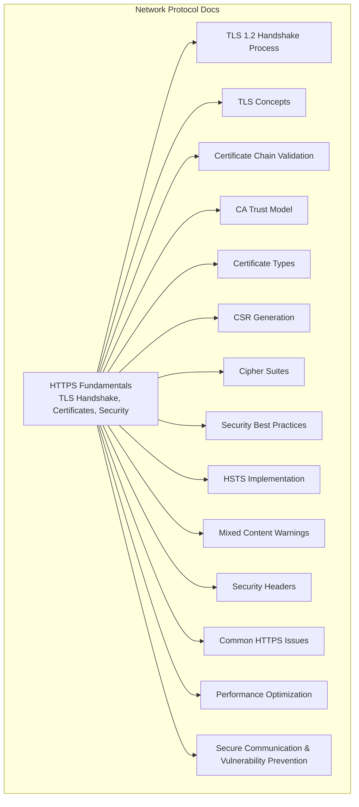

**Section sources**
- [01_https.md:1-200](file://docs/03_网络协议/02_https/01_https.md#L1-L200)
- [04_TLS1.2连接过程.md:1-200](file://docs/03_网络协议/02_https/04_TLS1.2连接过程.md#L1-L200)
- [06_TLS 相关概念.md:1-200](file://docs/03_网络协议/02_https/06_TLS 相关概念.md#L1-L200)
- [07_证书链验证.md:1-200](file://docs/03_网络协议/02_https/07_证书链验证.md#L1-L200)
- [08_Certificate Authority 信任模型.md:1-200](file://docs/03_网络协议/02_https/08_Certificate Authority 信任模型.md#L1-L200)
- [09_Certificate 类型与用途.md:1-200](file://docs/03_网络协议/02_https/09_Certificate 类型与用途.md#L1-L200)
- [10_Certificate Signing Request (CSR) 生成.md](file://docs/03_网络协议/02_https/10_Certificate Signing Request (CSR) 生成.md#L1-L200)
- [11_加密套件 Cipher Suites.md:1-200](file://docs/03_网络协议/02_https/11_加密套件 Cipher Suites.md#L1-L200)
- [12_安全最佳实践.md:1-200](file://docs/03_网络协议/02_https/12_安全最佳实践.md#L1-L200)
- [13_HSTS 实施指南.md:1-200](file://docs/03_网络协议/02_https/13_HSTS 实施指南.md#L1-L200)
- [14_混合内容 Mixed Content 警告.md:1-200](file://docs/03_网络协议/02_https/14_混合内容 Mixed Content 警告.md#L1-L200)
- [15_安全响应头配置.md:1-200](file://docs/03_网络协议/02_https/15_安全响应头配置.md#L1-L200)
- [16_常见 HTTPS 问题排查.md:1-200](file://docs/03_网络协议/02_https/16_常见 HTTPS 问题排查.md#L1-L200)
- [17_性能优化技巧.md:1-200](file://docs/03_网络协议/02_https/17_性能优化技巧.md#L1-L200)
- [18_安全通信模式与漏洞防护.md:1-200](file://docs/03_网络协议/02_https/18_安全通信模式与漏洞防护.md#L1-L200)

## Core Components
- TLS/SSL handshake and cryptographic negotiation
- Certificate chain validation and trust verification
- Encryption mechanisms and cipher suite selection
- Certificate types and CSR generation workflows
- CA trust model and certificate issuance lifecycle
- HTTPS server configuration patterns
- Security headers and HSTS policy deployment
- Mixed content detection and remediation
- Troubleshooting certificate and TLS issues
- Performance tuning for TLS handshakes and session resumption

**Section sources**
- [01_https.md:1-200](file://docs/03_网络协议/02_https/01_https.md#L1-L200)
- [04_TLS1.2连接过程.md:1-200](file://docs/03_网络协议/02_https/04_TLS1.2连接过程.md#L1-L200)
- [06_TLS 相关概念.md:1-200](file://docs/03_网络协议/02_https/06_TLS 相关概念.md#L1-L200)
- [07_证书链验证.md:1-200](file://docs/03_网络协议/02_https/07_证书链验证.md#L1-L200)
- [08_Certificate Authority 信任模型.md:1-200](file://docs/03_网络协议/02_https/08_Certificate Authority 信任模型.md#L1-L200)
- [09_Certificate 类型与用途.md:1-200](file://docs/03_网络协议/02_https/09_Certificate 类型与用途.md#L1-L200)
- [10_Certificate Signing Request (CSR) 生成.md](file://docs/03_网络协议/02_https/10_Certificate Signing Request (CSR) 生成.md#L1-L200)
- [11_加密套件 Cipher Suites.md:1-200](file://docs/03_网络协议/02_https/11_加密套件 Cipher Suites.md#L1-L200)
- [12_安全最佳实践.md:1-200](file://docs/03_网络协议/02_https/12_安全最佳实践.md#L1-L200)
- [13_HSTS 实施指南.md:1-200](file://docs/03_网络协议/02_https/13_HSTS 实施指南.md#L1-L200)
- [14_混合内容 Mixed Content 警告.md:1-200](file://docs/03_网络协议/02_https/14_混合内容 Mixed Content 警告.md#L1-L200)
- [15_安全响应头配置.md:1-200](file://docs/03_网络协议/02_https/15_安全响应头配置.md#L1-L200)
- [16_常见 HTTPS 问题排查.md:1-200](file://docs/03_网络协议/02_https/16_常见 HTTPS 问题排查.md#L1-L200)
- [17_性能优化技巧.md:1-200](file://docs/03_网络协议/02_https/17_性能优化技巧.md#L1-L200)
- [18_安全通信模式与漏洞防护.md:1-200](file://docs/03_网络协议/02_https/18_安全通信模式与漏洞防护.md#L1-L200)

## Architecture Overview
The HTTPS stack integrates transport security (TLS), identity verification (certificates), and application-layer protections (security headers). The handshake establishes encrypted channels, validates identities via certificate chains rooted in trusted CAs, negotiates cipher suites, and enables session resumption for performance.

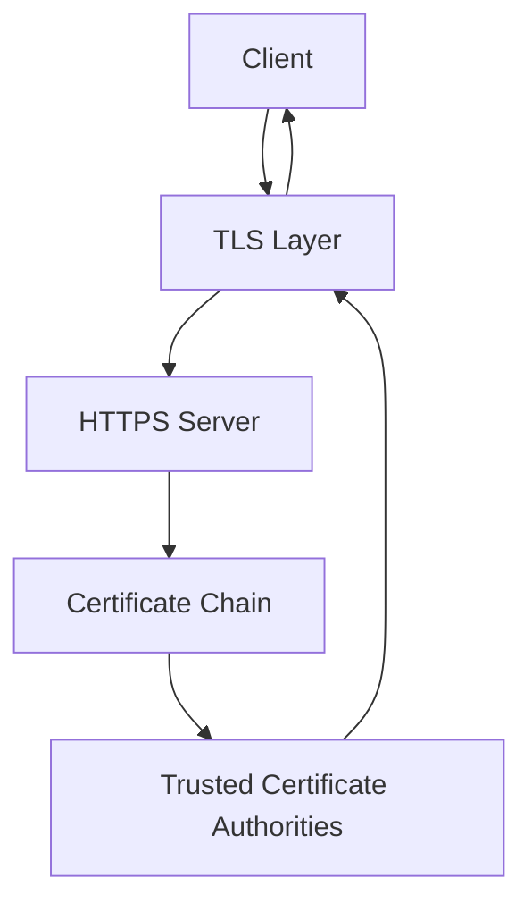

**Diagram sources**
- [01_https.md:1-200](file://docs/03_网络协议/02_https/01_https.md#L1-L200)
- [04_TLS1.2连接过程.md:1-200](file://docs/03_网络协议/02_https/04_TLS1.2连接过程.md#L1-L200)
- [07_证书链验证.md:1-200](file://docs/03_网络协议/02_https/07_证书链验证.md#L1-L200)
- [08_Certificate Authority 信任模型.md:1-200](file://docs/03_网络协议/02_https/08_Certificate Authority 信任模型.md#L1-L200)

## Detailed Component Analysis

### TLS Handshake and Cryptographic Negotiation
- ClientHello: supported versions, cipher suites, random values, extensions
- ServerHello: selected version and cipher suite, random values, certificate
- Key Exchange: ECDHE for forward secrecy, RSA or PSK for key transport
- Certificate Verification: chain validation against trust store
- Finished messages: mutual handshake completion and keyed MAC
- Session Resumption: tickets or session IDs to reduce latency

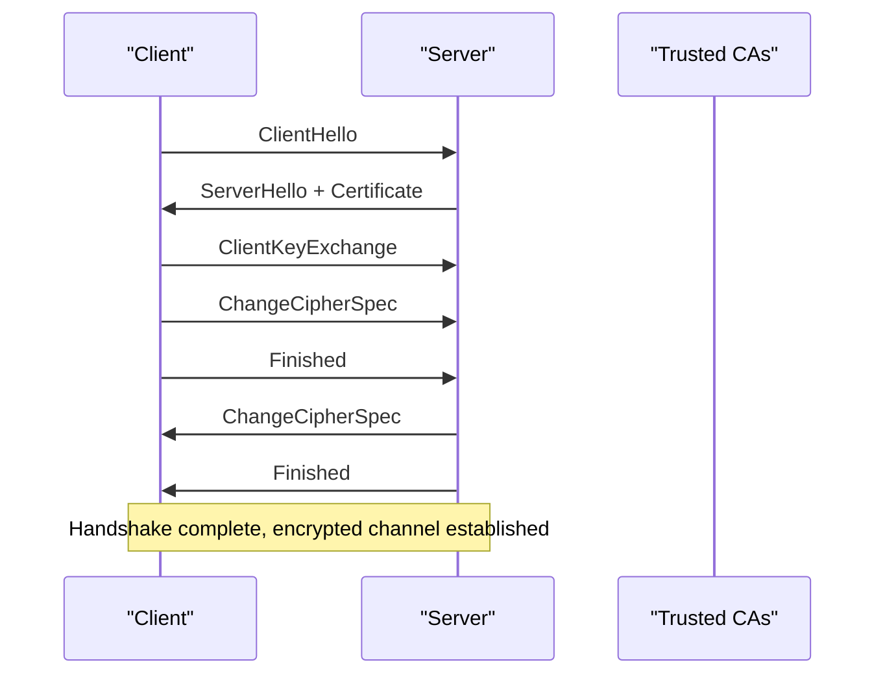

**Diagram sources**
- [04_TLS1.2连接过程.md:1-200](file://docs/03_网络协议/02_https/04_TLS1.2连接过程.md#L1-L200)
- [06_TLS 相关概念.md:1-200](file://docs/03_网络协议/02_https/06_TLS 相关概念.md#L1-L200)

**Section sources**
- [04_TLS1.2连接过程.md:1-200](file://docs/03_网络协议/02_https/04_TLS1.2连接过程.md#L1-L200)
- [06_TLS 相关概念.md:1-200](file://docs/03_网络协议/02_https/06_TLS 相关概念.md#L1-L200)

### Certificate Chain Validation
- Path building: leaf → intermediate → root
- Signature verification: each certificate signed by issuer
- Policy checks: validity periods, key usage, extended key usage
- Revocation: OCSP/CRL checks when configured
- Trust anchors: local trust store of CAs

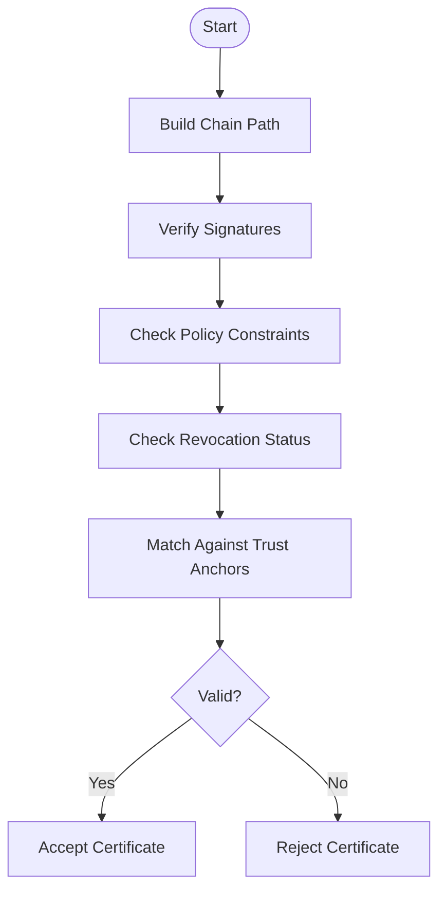

**Diagram sources**
- [07_证书链验证.md:1-200](file://docs/03_网络协议/02_https/07_证书链验证.md#L1-L200)
- [08_Certificate Authority 信任模型.md:1-200](file://docs/03_网络协议/02_https/08_Certificate Authority 信任模型.md#L1-L200)

**Section sources**
- [07_证书链验证.md:1-200](file://docs/03_网络协议/02_https/07_证书链验证.md#L1-L200)
- [08_Certificate Authority 信任模型.md:1-200](file://docs/03_网络协议/02_https/08_Certificate Authority 信任模型.md#L1-L200)

### Certificate Types and CSR Generation
- Types: domain-validated (DV), organization-validated (OV), extended-validation (EV), wildcard, code signing, client authentication
- CSR generation: private key creation, CSR attributes, signature with private key
- Issuance workflow: submit CSR to CA, validation, certificate delivery

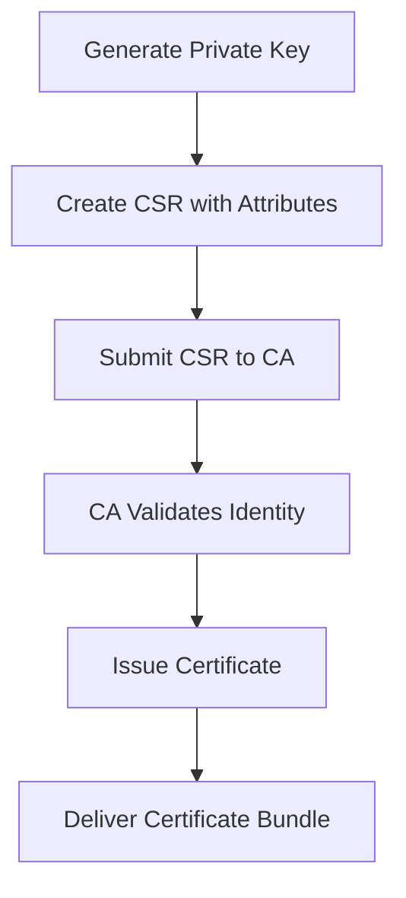

**Diagram sources**
- [09_Certificate 类型与用途.md:1-200](file://docs/03_网络协议/02_https/09_Certificate 类型与用途.md#L1-L200)
- [10_Certificate Signing Request (CSR) 生成.md](file://docs/03_网络协议/02_https/10_Certificate Signing Request (CSR) 生成.md#L1-L200)

**Section sources**
- [09_Certificate 类型与用途.md:1-200](file://docs/03_网络协议/02_https/09_Certificate 类型与用途.md#L1-L200)
- [10_Certificate Signing Request (CSR) 生成.md](file://docs/03_网络协议/02_https/10_Certificate Signing Request (CSR) 生成.md#L1-L200)

### HTTPS Configuration and Cipher Suites
- Server configuration: load certificate and private key, configure TLS versions, enable cipher suites
- Cipher suite selection: prioritize AEAD, forward secrecy, strong KEX, modern hashes
- Security headers: enforce HTTPS, prevent MIME sniffing, clickjacking, XSS, downgrade attacks

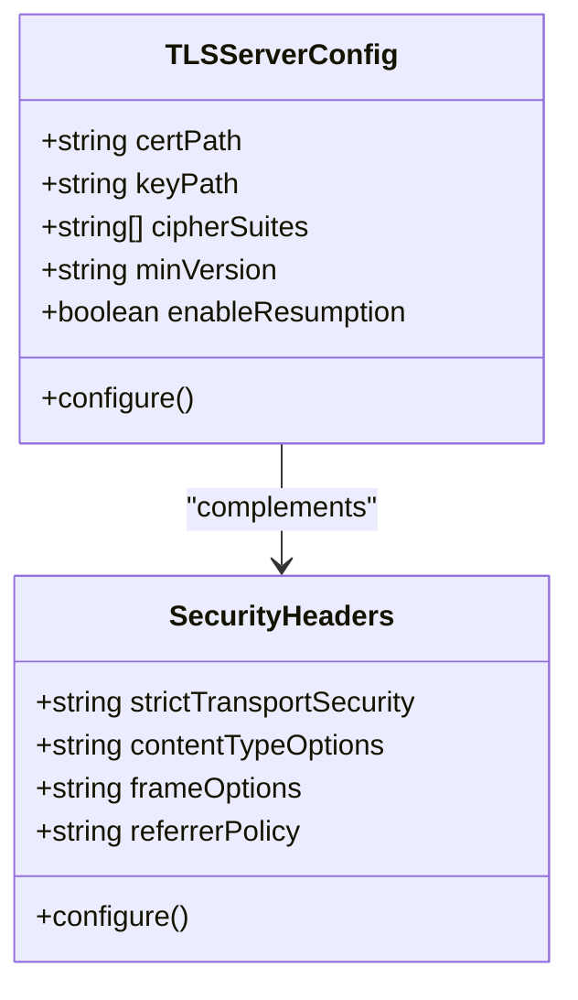

**Diagram sources**
- [11_加密套件 Cipher Suites.md:1-200](file://docs/03_网络协议/02_https/11_加密套件 Cipher Suites.md#L1-L200)
- [12_安全最佳实践.md:1-200](file://docs/03_网络协议/02_https/12_安全最佳实践.md#L1-L200)
- [15_安全响应头配置.md:1-200](file://docs/03_网络协议/02_https/15_安全响应头配置.md#L1-L200)

**Section sources**
- [11_加密套件 Cipher Suites.md:1-200](file://docs/03_网络协议/02_https/11_加密套件 Cipher Suites.md#L1-L200)
- [12_安全最佳实践.md:1-200](file://docs/03_网络协议/02_https/12_安全最佳实践.md#L1-L200)
- [15_安全响应头配置.md:1-200](file://docs/03_网络协议/02_https/15_安全响应头配置.md#L1-L200)

### Practical HTTPS Server Setup Examples
- Self-signed certificates: generate key and certificate, configure server to serve them
- Let's Encrypt: automated certificate acquisition and renewal via ACME clients
- Demo references: HTTPS server example and certificate material

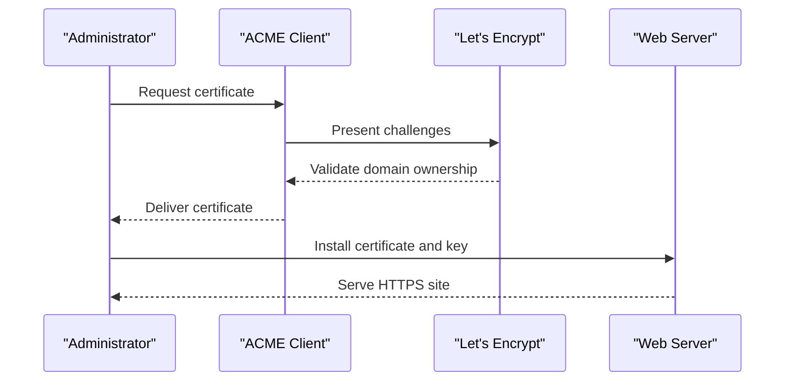

**Diagram sources**
- [app.js:1-200](file://demo/网络协议/https/app.js#L1-L200)
- [server.cert:1-200](file://demo/网络协议/certificate/server.cert#L1-L200)

**Section sources**
- [app.js:1-200](file://demo/网络协议/https/app.js#L1-L200)
- [server.cert:1-200](file://demo/网络协议/certificate/server.cert#L1-L200)

### HSTS Implementation
- Deploy Strict-Transport-Security header with long max-age, includeSubDomains, preload
- Redirect HTTP to HTTPS at edge or origin
- Preload submission for browser-wide enforcement

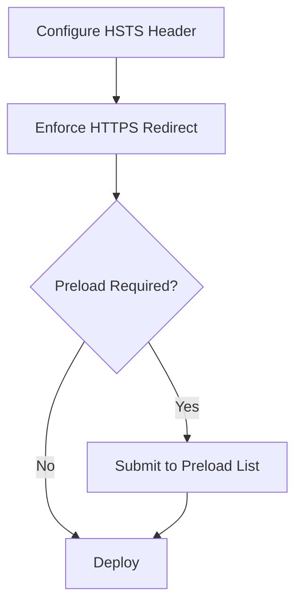

**Diagram sources**
- [13_HSTS 实施指南.md:1-200](file://docs/03_网络协议/02_https/13_HSTS 实施指南.md#L1-L200)

**Section sources**
- [13_HSTS 实施指南.md:1-200](file://docs/03_网络协议/02_https/13_HSTS 实施指南.md#L1-L200)

### Mixed Content Warnings
- Detection: browser flags insecure resources loaded over HTTPS
- Remediation: migrate all assets to HTTPS, use protocol-relative URLs temporarily if needed
- Reporting: Content-Security-Policy reporting directives

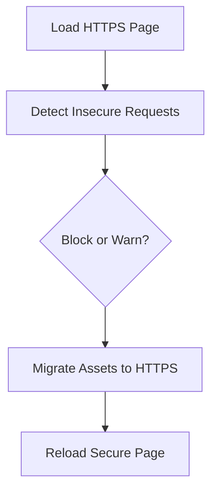

**Diagram sources**
- [14_混合内容 Mixed Content 警告.md:1-200](file://docs/03_网络协议/02_https/14_混合内容 Mixed Content 警告.md#L1-L200)

**Section sources**
- [14_混合内容 Mixed Content 警告.md:1-200](file://docs/03_网络协议/02_https/14_混合内容 Mixed Content 警告.md#L1-L200)

### Security Header Configuration
- Security headers: HSTS, X-Frame-Options, X-Content-Type-Options, Referrer-Policy, Content-Security-Policy
- CSP: define allowed sources for scripts, styles, frames, forms, etc.
- Reporting: report-uri/report-to for policy violation feedback

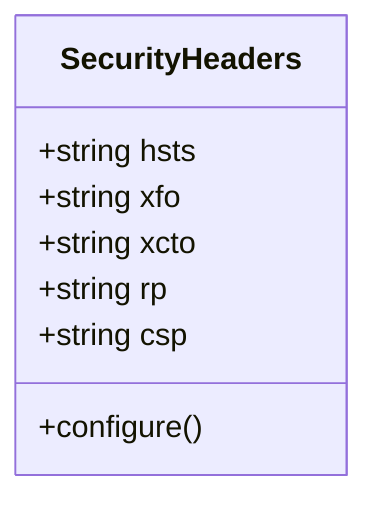

**Diagram sources**
- [15_安全响应头配置.md:1-200](file://docs/03_网络协议/02_https/15_安全响应头配置.md#L1-L200)

**Section sources**
- [15_安全响应头配置.md:1-200](file://docs/03_网络协议/02_https/15_安全响应头配置.md#L1-L200)

### Common HTTPS Issues and Troubleshooting
- Certificate errors: wrong hostname, expired, untrusted, missing intermediates
- Cipher mismatch: outdated clients, incompatible suites
- Mixed content: embedded HTTP resources
- Performance: slow handshakes, no resumption, weak KEX
- Tools: OpenSSL s_client, browser devtools, SSL Labs test

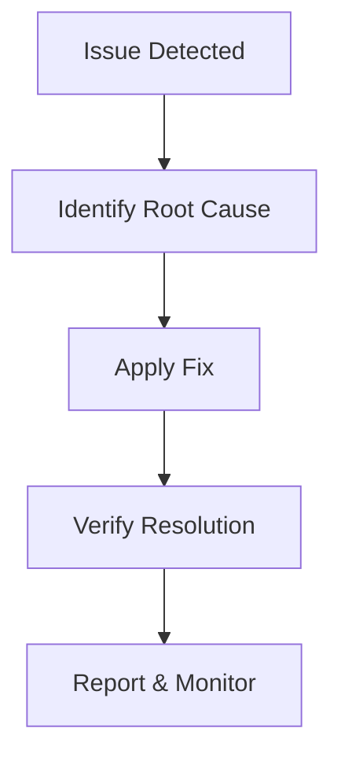

**Diagram sources**
- [16_常见 HTTPS 问题排查.md:1-200](file://docs/03_网络协议/02_https/16_常见 HTTPS 问题排查.md#L1-L200)

**Section sources**
- [16_常见 HTTPS 问题排查.md:1-200](file://docs/03_网络协议/02_https/16_常见 HTTPS 问题排查.md#L1-L200)

### Performance Optimization Techniques
- Enable TLS session resumption (tickets/session IDs)
- Prefer ECDHE key exchange and hardware acceleration
- Use ALPN for HTTP/2
- Optimize certificate chains (minimize intermediates)
- OCSP stapling and caching

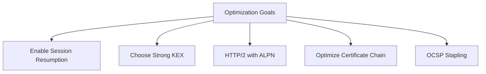

**Diagram sources**
- [17_性能优化技巧.md:1-200](file://docs/03_网络协议/02_https/17_性能优化技巧.md#L1-L200)

**Section sources**
- [17_性能优化技巧.md:1-200](file://docs/03_网络协议/02_https/17_性能优化技巧.md#L1-L200)

### Secure Communication Patterns and Vulnerability Prevention
- Principle of least privilege for certificates and keys
- Regular rotation and monitoring
- Protect against POODLE, BEAST, CRIME, BREACH, renegotiation attacks
- Secure defaults: disable weak protocols, prefer modern cipher suites
- Observability: logging, metrics, alerting on failures

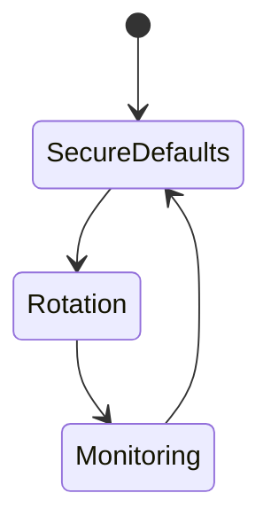

**Diagram sources**
- [12_安全最佳实践.md:1-200](file://docs/03_网络协议/02_https/12_安全最佳实践.md#L1-L200)
- [18_安全通信模式与漏洞防护.md:1-200](file://docs/03_网络协议/02_https/18_安全通信模式与漏洞防护.md#L1-L200)

**Section sources**
- [12_安全最佳实践.md:1-200](file://docs/03_网络协议/02_https/12_安全最佳实践.md#L1-L200)
- [18_安全通信模式与漏洞防护.md:1-200](file://docs/03_网络协议/02_https/18_安全通信模式与漏洞防护.md#L1-L200)

## Dependency Analysis
The HTTPS security stack depends on:
- TLS library for cryptographic operations
- Certificate store for trust anchors
- Certificate authority for issuing and validating certificates
- Application server for serving certificates and enforcing policies
- Network infrastructure for redirects and edge enforcement

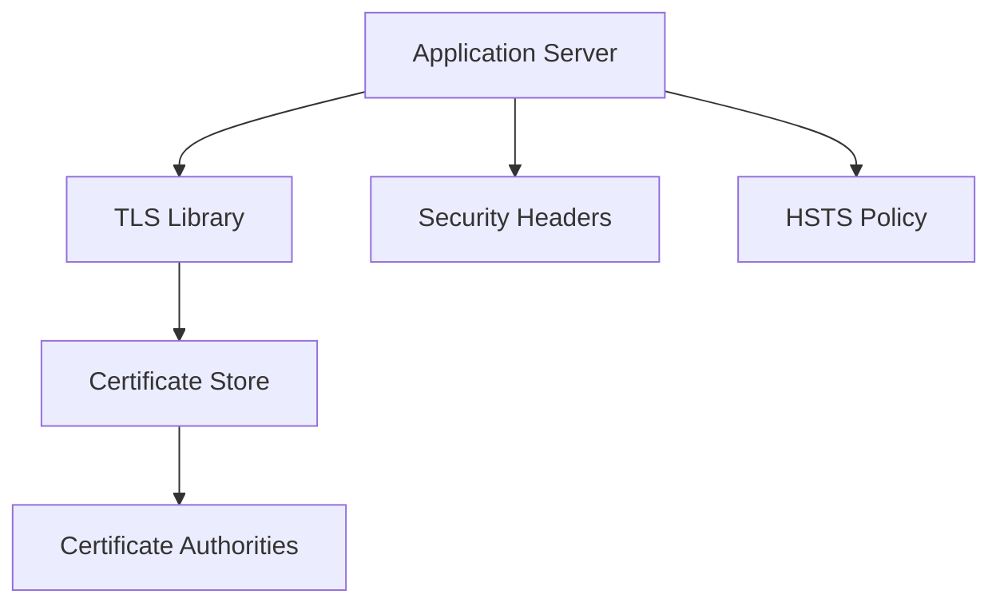

**Diagram sources**
- [01_https.md:1-200](file://docs/03_网络协议/02_https/01_https.md#L1-L200)
- [08_Certificate Authority 信任模型.md:1-200](file://docs/03_网络协议/02_https/08_Certificate Authority 信任模型.md#L1-L200)
- [15_安全响应头配置.md:1-200](file://docs/03_网络协议/02_https/15_安全响应头配置.md#L1-L200)

**Section sources**
- [01_https.md:1-200](file://docs/03_网络协议/02_https/01_https.md#L1-L200)
- [08_Certificate Authority 信任模型.md:1-200](file://docs/03_网络协议/02_https/08_Certificate Authority 信任模型.md#L1-L200)
- [15_安全响应头配置.md:1-200](file://docs/03_网络协议/02_https/15_安全响应头配置.md#L1-L200)

## Performance Considerations
- Minimize handshake cost: reuse sessions, use tickets, optimize chain length
- Prefer forward-secure curves and hardware acceleration
- Enable HTTP/2 with ALPN to reduce latency
- Monitor and alert on handshake failures and timeouts

[No sources needed since this section provides general guidance]

## Troubleshooting Guide
- Certificate issues: validate hostname, expiration, chain completeness, trust
- Cipher mismatches: align server and client capabilities
- Mixed content: audit page assets and update to HTTPS
- Performance: measure handshake duration, enable resumption, review KEX and cipher choices

**Section sources**
- [16_常见 HTTPS 问题排查.md:1-200](file://docs/03_网络协议/02_https/16_常见 HTTPS 问题排查.md#L1-L200)

## Conclusion
HTTPS security hinges on robust TLS configuration, validated certificate chains, and comprehensive security controls. By applying modern cipher suites, deploying HSTS and security headers, mitigating mixed content, and optimizing performance, systems achieve confidentiality, integrity, and availability at scale.

[No sources needed since this section summarizes without analyzing specific files]

## Appendices
- Practical demos: HTTPS server example and certificate materials
- Related network protocol foundations: TCP, HTTP, HTTP/2

**Section sources**
- [app.js:1-200](file://demo/网络协议/https/app.js#L1-L200)
- [server.cert:1-200](file://demo/网络协议/certificate/server.cert#L1-L200)
- [server.js:1-200](file://demo/网络协议/h2/server.js#L1-L200)
- [server.js:1-200](file://demo/网络协议/http服务/服务端/server.js#L1-L200)
- [app.js:1-200](file://demo/网络协议/http模拟/app.js#L1-L200)
- [server.js:1-200](file://demo/网络协议/tcp/server.js#L1-L200)