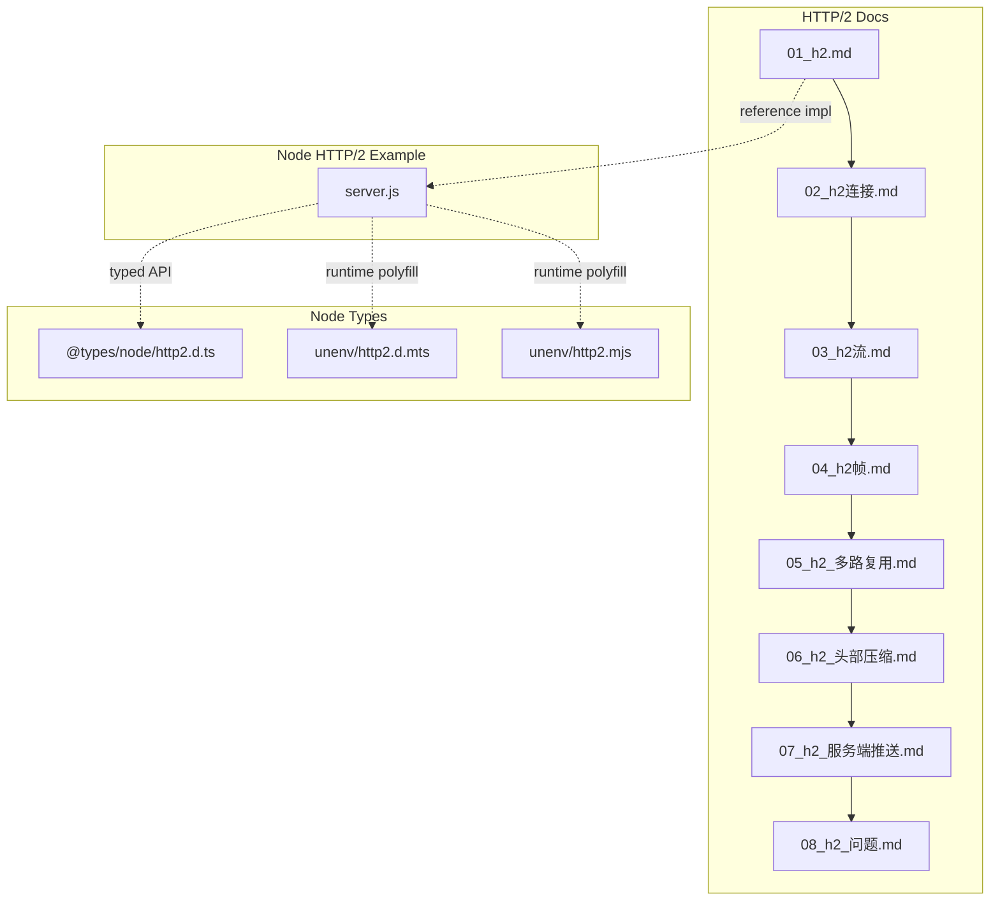
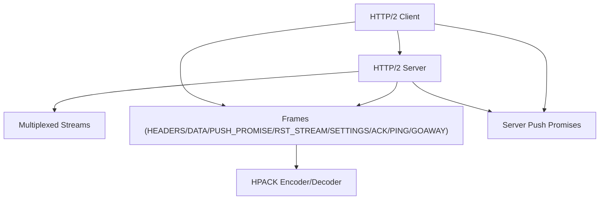
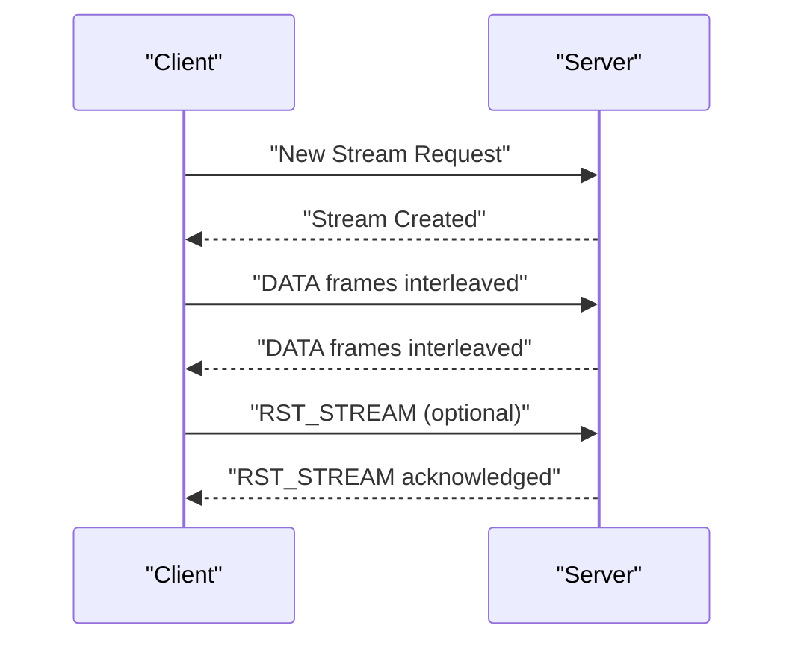
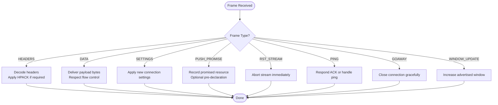
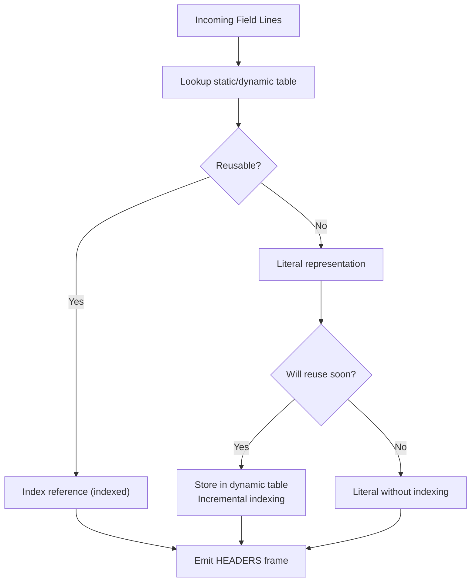
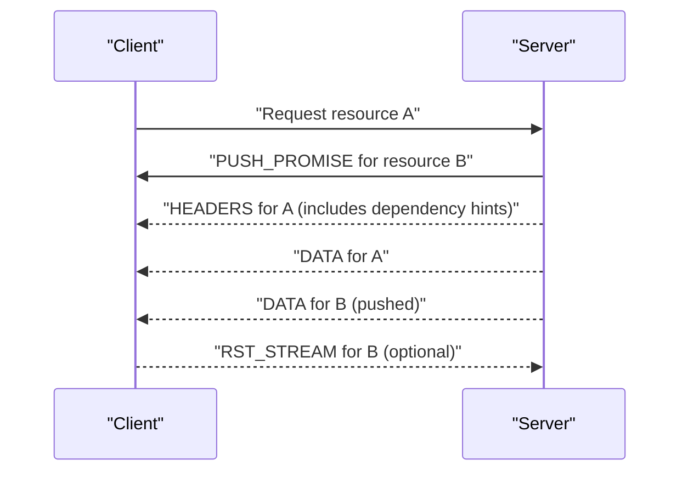
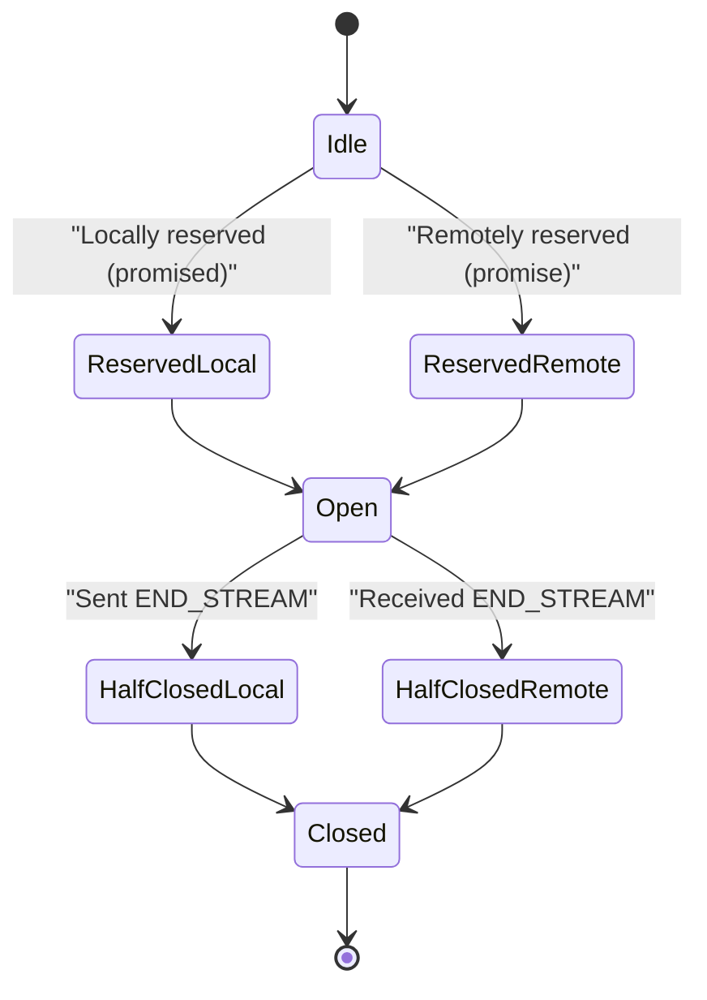
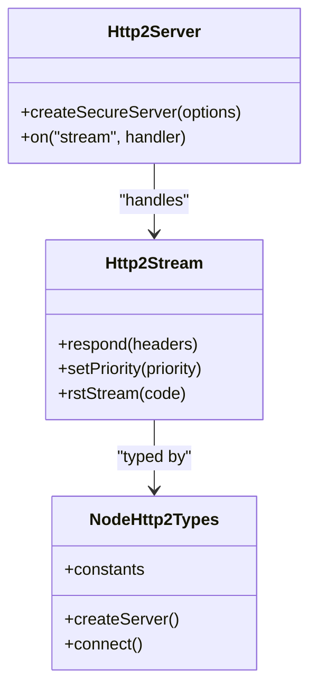
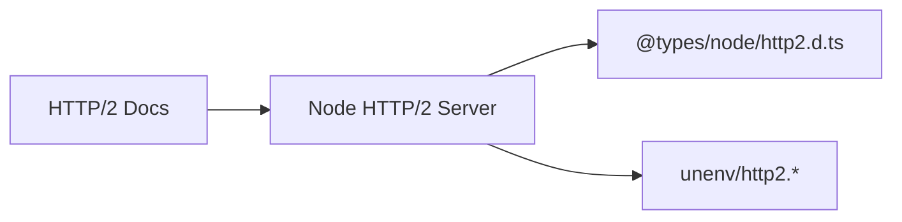

# HTTP/2 and Advanced Topics

<cite>
**Referenced Files in This Document**
- [01_h2.md](file://docs/03_网络协议/03_http2/01_h2.md)
- [02_h2连接.md](file://docs/03_网络协议/03_http2/02_h2连接.md)
- [03_h2流.md](file://docs/03_网络协议/03_http2/03_h2流.md)
- [04_h2帧.md](file://docs/03_网络协议/03_http2/04_h2帧.md)
- [05_h2_多路复用.md](file://docs/03_网络协议/03_http2/05_h2_多路复用.md)
- [06_h2_头部压缩.md](file://docs/03_网络协议/03_http2/06_h2_头部压缩.md)
- [07_h2_服务端推送.md](file://docs/03_网络协议/03_http2/07_h2_服务端推送.md)
- [08_h2_问题.md](file://docs/03_网络协议/03_http2/08_h2_问题.md)
- [server.js](file://demo/网络协议/h2/server.js)
- [http2.d.ts](file://node_modules/@types/node/http2.d.ts)
- [http2.d.mts](file://demo/nuxt/demo_2/node_modules/unenv/dist/runtime/node/http2.d.mts)
- [http2.mjs](file://demo/nuxt/demo_2/node_modules/unenv/dist/runtime/node/http2.mjs)
</cite>

## Table of Contents
1. [Introduction](#introduction)
2. [Project Structure](#project-structure)
3. [Core Components](#core-components)
4. [Architecture Overview](#architecture-overview)
5. [Detailed Component Analysis](#detailed-component-analysis)
6. [Dependency Analysis](#dependency-analysis)
7. [Performance Considerations](#performance-considerations)
8. [Troubleshooting Guide](#troubleshooting-guide)
9. [Conclusion](#conclusion)
10. [Appendices](#appendices)

## Introduction
This document consolidates the repository's HTTP/2 materials into a comprehensive guide covering multiplexing, header compression, server push, frame types, stream prioritization, and flow control. It also compares HTTP/2 performance to HTTP/1.1, provides practical server configuration and client implementation pointers, explains HPACK compression and HEADERS frame optimization, and outlines debugging, monitoring, and migration strategies for modern web applications.

## Project Structure
The HTTP/2 content is organized as a cohesive set of topic-focused documents under the network protocols section, plus a working Node.js HTTP/2 server example and TypeScript definitions for Node's HTTP/2 APIs.

**Diagram sources**
- [01_h2.md](file://docs/03_网络协议/03_http2/01_h2.md)
- [02_h2连接.md](file://docs/03_网络协议/03_http2/02_h2连接.md)
- [03_h2流.md](file://docs/03_网络协议/03_http2/03_h2流.md)
- [04_h2帧.md](file://docs/03_网络协议/03_http2/04_h2帧.md)
- [05_h2_多路复用.md](file://docs/03_网络协议/03_http2/05_h2_多路复用.md)
- [06_h2_头部压缩.md](file://docs/03_网络协议/03_http2/06_h2_头部压缩.md)
- [07_h2_服务端推送.md](file://docs/03_网络协议/03_http2/07_h2_服务端推送.md)
- [08_h2_问题.md](file://docs/03_网络协议/03_http2/08_h2_问题.md)
- [server.js](file://demo/网络协议/h2/server.js)
- [http2.d.ts](file://node_modules/@types/node/http2.d.ts)
- [http2.d.mts](file://demo/nuxt/demo_2/node_modules/unenv/dist/runtime/node/http2.d.mts)
- [http2.mjs](file://demo/nuxt/demo_2/node_modules/unenv/dist/runtime/node/http2.mjs)

**Section sources**
- [01_h2.md](file://docs/03_网络协议/03_http2/01_h2.md)
- [02_h2连接.md](file://docs/03_网络协议/03_http2/02_h2连接.md)
- [03_h2流.md](file://docs/03_网络协议/03_http2/03_h2流.md)
- [04_h2帧.md](file://docs/03_网络协议/03_http2/04_h2帧.md)
- [05_h2_多路复用.md](file://docs/03_网络协议/03_http2/05_h2_多路复用.md)
- [06_h2_头部压缩.md](file://docs/03_网络协议/03_http2/06_h2_头部压缩.md)
- [07_h2_服务端推送.md](file://docs/03_网络协议/03_http2/07_h2_服务端推送.md)
- [08_h2_问题.md](file://docs/03_网络协议/03_http2/08_h2_问题.md)
- [server.js](file://demo/网络协议/h2/server.js)
- [http2.d.ts](file://node_modules/@types/node/http2.d.ts)
- [http2.d.mts](file://demo/nuxt/demo_2/node_modules/unenv/dist/runtime/node/http2.d.mts)
- [http2.mjs](file://demo/nuxt/demo_2/node_modules/unenv/dist/runtime/node/http2.mjs)

## Core Components
- HTTP/2 fundamentals and connection lifecycle
- Streams, frames, and multiplexing
- Header compression (HPACK) and HEADERS frame optimization
- Server push and client consumption
- Stream prioritization and flow control
- Migration from HTTP/1.1 and performance benefits
- Debugging, monitoring, and common issues

These topics are covered across the HTTP/2 documentation set and complemented by a practical Node.js server example and typed Node.js HTTP/2 API definitions.

**Section sources**
- [01_h2.md](file://docs/03_网络协议/03_http2/01_h2.md)
- [02_h2连接.md](file://docs/03_网络协议/03_http2/02_h2连接.md)
- [03_h2流.md](file://docs/03_网络协议/03_http2/03_h2流.md)
- [04_h2帧.md](file://docs/03_网络协议/03_http2/04_h2帧.md)
- [05_h2_多路复用.md](file://docs/03_网络协议/03_http2/05_h2_多路复用.md)
- [06_h2_头部压缩.md](file://docs/03_网络协议/03_http2/06_h2_头部压缩.md)
- [07_h2_服务端推送.md](file://docs/03_网络协议/03_http2/07_h2_服务端推送.md)
- [08_h2_问题.md](file://docs/03_网络协议/03_http2/08_h2_问题.md)

## Architecture Overview
The HTTP/2 stack integrates connection-level multiplexing, per-stream control, and shared compression state. The server example demonstrates a minimal HTTP/2 server, while the typed definitions enable robust client-side development.

**Diagram sources**
- [04_h2帧.md](file://docs/03_网络协议/03_http2/04_h2帧.md)
- [05_h2_多路复用.md](file://docs/03_网络协议/03_http2/05_h2_多路复用.md)
- [06_h2_头部压缩.md](file://docs/03_网络协议/03_http2/06_h2_头部压缩.md)
- [07_h2_服务端推送.md](file://docs/03_网络协议/03_http2/07_h2_服务端推送.md)
- [server.js](file://demo/网络协议/h2/server.js)
- [http2.d.ts](file://node_modules/@types/node/http2.d.ts)

## Detailed Component Analysis

### Multiplexing and Stream Management
- Streams are logical bidirectional channels multiplexed over a single TCP connection.
- Independent flow control per stream enables fairness and prevents head-of-line blocking.
- Stream prioritization allows clients to signal importance; servers can allocate resources accordingly.

**Diagram sources**
- [03_h2流.md](file://docs/03_网络协议/03_http2/03_h2流.md)
- [05_h2_多路复用.md](file://docs/03_网络协议/03_http2/05_h2_多路复用.md)
- [04_h2帧.md](file://docs/03_网络协议/03_http2/04_h2帧.md)

**Section sources**
- [03_h2流.md](file://docs/03_网络协议/03_http2/03_h2流.md)
- [05_h2_多路复用.md](file://docs/03_网络协议/03_http2/05_h2_多路复用.md)
- [04_h2帧.md](file://docs/03_网络协议/03_http2/04_h2帧.md)

### Frame Types and Control Mechanisms
- HEADERS: Carries field lines (name/value pairs) and flags; used for request/response headers and server push.
- DATA: Carries payload bytes; flow-controlled per stream.
- SETTINGS: Negotiates connection parameters (e.g., max concurrent streams, header table sizes).
- PUSH_PROMISE: Announces server push resources before sending response body.
- RST_STREAM: Immediately terminates a stream.
- PING: Checks connection health and measures RTT.
- GOAWAY: Gracefully closes the connection.
- WINDOW_UPDATE: Manages flow control window increments.

**Diagram sources**
- [04_h2帧.md](file://docs/03_网络协议/03_http2/04_h2帧.md)

**Section sources**
- [04_h2帧.md](file://docs/03_网络协议/03_http2/04_h2帧.md)

### Header Compression (HPACK) and HEADERS Optimization
- Dynamic table stores recent field entries; indexed or literal encodings reduce overhead.
- Huffman coding further compresses literal values.
- HEADERS frames can use incremental indexing, never indexed, or literal representations depending on reuse patterns.

**Diagram sources**
- [06_h2_头部压缩.md](file://docs/03_网络协议/03_http2/06_h2_头部压缩.md)
- [04_h2帧.md](file://docs/03_网络协议/03_http2/04_h2帧.md)

**Section sources**
- [06_h2_头部压缩.md](file://docs/03_网络协议/03_http2/06_h2_头部压缩.md)
- [04_h2帧.md](file://docs/03_网络协议/03_http2/04_h2帧.md)

### Server Push and Client Consumption
- Server sends PUSH_PROMISE before responding with the primary resource, enabling early delivery of linked assets.
- Clients decide whether to accept or reject pushes; typical usage includes critical CSS/JS and images.

**Diagram sources**
- [07_h2_服务端推送.md](file://docs/03_网络协议/03_http2/07_h2_服务端推送.md)
- [04_h2帧.md](file://docs/03_网络协议/03_http2/04_h2帧.md)

**Section sources**
- [07_h2_服务端推送.md](file://docs/03_网络协议/03_http2/07_h2_服务端推送.md)
- [04_h2帧.md](file://docs/03_网络协议/03_http2/04_h2帧.md)

### Stream Prioritization and Flow Control
- Prioritization: Each stream has a parent and weight; children share bandwidth according to weights.
- Flow control: Both sides advertise windows; senders must respect advertised limits to avoid stalls.

**Diagram sources**
- [03_h2流.md](file://docs/03_网络协议/03_http2/03_h2流.md)
- [05_h2_多路复用.md](file://docs/03_网络协议/03_http2/05_h2_多路复用.md)

**Section sources**
- [03_h2流.md](file://docs/03_网络协议/03_http2/03_h2流.md)
- [05_h2_多路复用.md](file://docs/03_网络协议/03_http2/05_h2_多路复用.md)

### Practical Server Configuration and Client Implementation
- Server example: Demonstrates basic HTTP/2 server creation and request handling.
- Typed Node.js HTTP/2 APIs: Provide method signatures and enums for robust client development.

**Diagram sources**
- [server.js](file://demo/网络协议/h2/server.js)
- [http2.d.ts](file://node_modules/@types/node/http2.d.ts)

**Section sources**
- [server.js](file://demo/网络协议/h2/server.js)
- [http2.d.ts](file://node_modules/@types/node/http2.d.ts)
- [http2.d.mts](file://demo/nuxt/demo_2/node_modules/unenv/dist/runtime/node/http2.d.mts)
- [http2.mjs](file://demo/nuxt/demo_2/node_modules/unenv/dist/runtime/node/http2.mjs)

## Dependency Analysis
- The HTTP/2 documentation set is modular and self-contained, progressing from fundamentals to advanced topics.
- The Node HTTP/2 server depends on Node's built-in HTTP/2 APIs, which are typed via @types/node and supported in environments like unenv.

**Diagram sources**
- [01_h2.md](file://docs/03_网络协议/03_http2/01_h2.md)
- [server.js](file://demo/网络协议/h2/server.js)
- [http2.d.ts](file://node_modules/@types/node/http2.d.ts)
- [http2.d.mts](file://demo/nuxt/demo_2/node_modules/unenv/dist/runtime/node/http2.d.mts)
- [http2.mjs](file://demo/nuxt/demo_2/node_modules/unenv/dist/runtime/node/http2.mjs)

**Section sources**
- [01_h2.md](file://docs/03_网络协议/03_http2/01_h2.md)
- [server.js](file://demo/网络协议/h2/server.js)
- [http2.d.ts](file://node_modules/@types/node/http2.d.ts)
- [http2.d.mts](file://demo/nuxt/demo_2/node_modules/unenv/dist/runtime/node/http2.d.mts)
- [http2.mjs](file://demo/nuxt/demo_2/node_modules/unenv/dist/runtime/node/http2.mjs)

## Performance Considerations
- Reduced latency: Eliminates head-of-line blocking via multiplexing; reduces connection establishment costs.
- Improved resource loading: Server push delivers critical assets proactively; HPACK minimizes header overhead.
- Better throughput: Per-stream flow control and adaptive windowing prevent stalls and maximize utilization.

[No sources needed since this section provides general guidance]

## Troubleshooting Guide
Common issues and remedies:
- Connection failures: Verify TLS configuration and ALPN negotiation for HTTP/2.
- Push rejection: Confirm client support and handle RST_STREAM gracefully.
- Priority misconfiguration: Adjust stream weights and dependencies to reflect real user experience.
- Flow control deadlocks: Monitor advertised windows and ensure timely WINDOW_UPDATE.

**Section sources**
- [08_h2_问题.md](file://docs/03_网络协议/03_http2/08_h2_问题.md)

## Conclusion
HTTP/2 delivers substantial improvements over HTTP/1.1 through multiplexing, header compression, and server push. Combined with proper prioritization and flow control, it enables faster page loads and better user experiences. The repository's HTTP/2 documentation, Node server example, and typed APIs provide a solid foundation for building and optimizing modern web applications.

[No sources needed since this section summarizes without analyzing specific files]

## Appendices
- Migration checklist: Enable TLS, configure ALPN, adopt HPACK-aware caching, and instrument server push for critical assets.
- Monitoring: Track stream concurrency, push effectiveness, and header compression ratio; use PING and GOAWAY for health signals.

[No sources needed since this section provides general guidance]