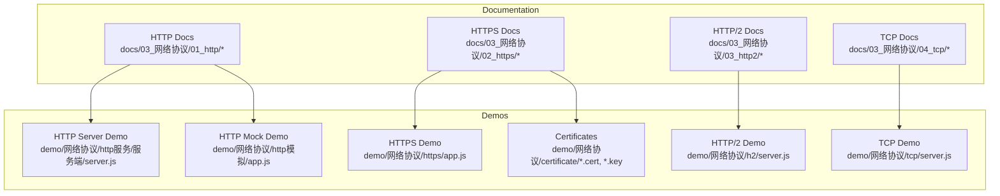
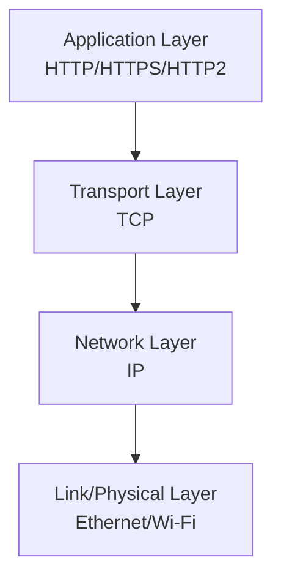
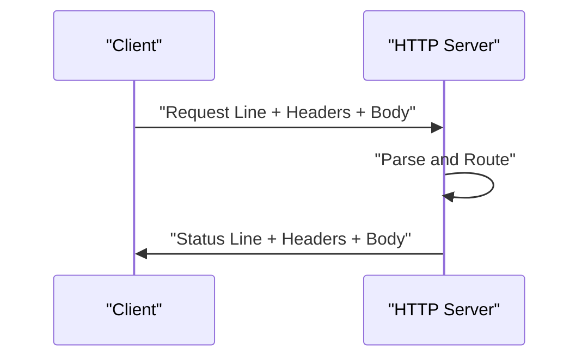
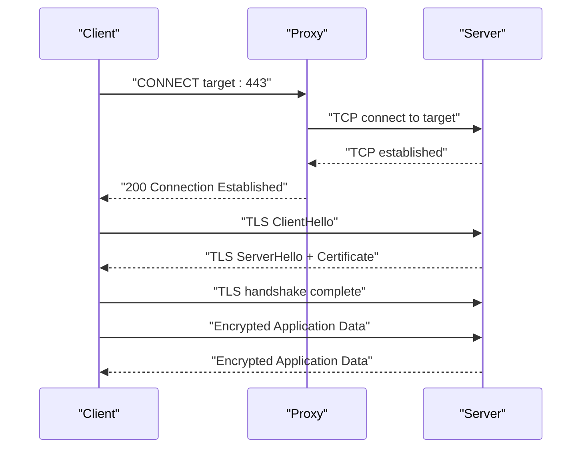
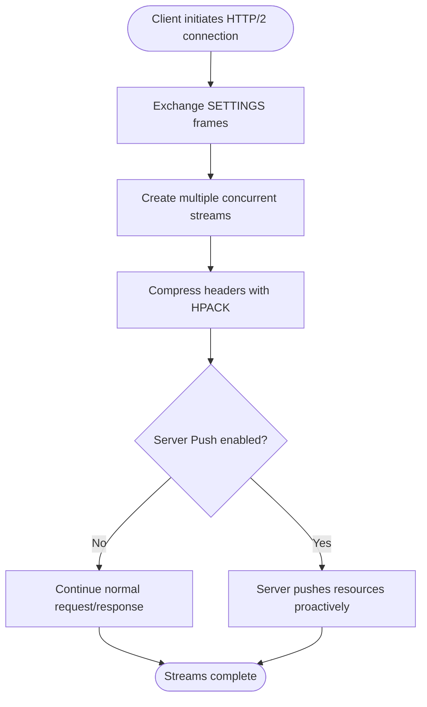
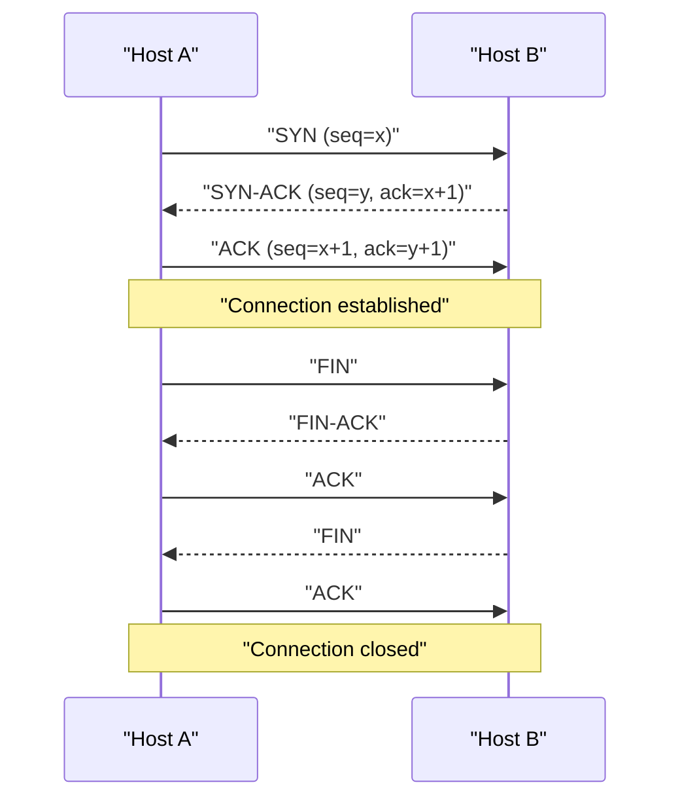
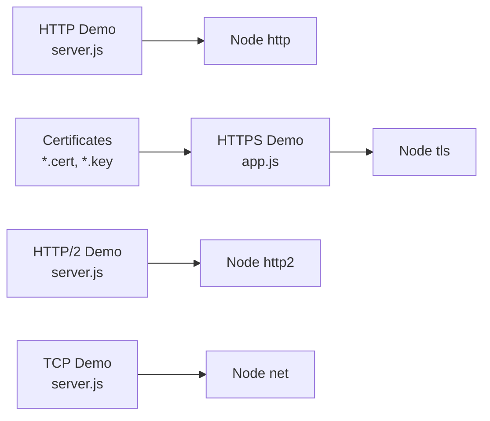

# Network Protocols

<cite>
**Referenced Files in This Document**
- [docs/03_网络协议/01_http/01_index.md](file://docs/03_网络协议/01_http/01_index.md)
- [docs/03_网络协议/01_http/02_请求方法.md](file://docs/03_网络协议/01_http/02_请求方法.md)
- [docs/03_网络协议/01_http/03_状态码.md](file://docs/03_网络协议/01_http/03_状态码.md)
- [docs/03_网络协议/01_http/04_内容协商.md](file://docs/03_网络协议/01_http/04_内容协商.md)
- [docs/03_网络协议/01_http/05_连接管理.md](file://docs/03_网络协议/01_http/05_连接管理.md)
- [docs/03_网络协议/01_http/06_cookie.md](file://docs/03_网络协议/01_http/06_cookie.md)
- [docs/03_网络协议/01_http/07_缓存.md](file://docs/03_网络协议/01_http/07_缓存.md)
- [docs/03_网络协议/01_http/08_传输大文件.md](file://docs/03_网络协议/01_http/08_传输大文件.md)
- [docs/03_网络协议/01_http/09_cors.md](file://docs/03_网络协议/01_http/09_cors.md)
- [docs/03_网络协议/01_http/10_抓包分析.md](file://docs/03_网络协议/01_http/10_抓包分析.md)
- [docs/03_网络协议/01_http/11_问题.md](file://docs/03_网络协议/01_http/11_问题.md)
- [docs/03_网络协议/02_https/01_https.md](file://docs/03_网络协议/02_https/01_https.md)
- [docs/03_网络协议/02_https/04_TLS1.2连接过程.md](file://docs/03_网络协议/02_https/04_TLS1.2连接过程.md)
- [docs/03_网络协议/02_https/06_TLS 相关概念.md](file://docs/03_网络协议/02_https/06_TLS 相关概念.md)
- [docs/03_网络协议/02_https/08_https代理.md](file://docs/03_网络协议/02_https/08_https代理.md)
- [docs/03_网络协议/03_http2/01_http2.md](file://docs/03_网络协议/03_http2/01_http2.md)
- [docs/03_网络协议/03_http2/02_多路复用.md](file://docs/03_网络协议/03_http2/02_多路复用.md)
- [docs/03_网络协议/03_http2/03_头部压缩.md](file://docs/03_网络协议/03_http2/03_头部压缩.md)
- [docs/03_网络协议/03_http2/04_服务端推送.md](file://docs/03_网络协议/03_http2/04_服务端推送.md)
- [docs/03_网络协议/04_tcp/01_tcp基本概念.md](file://docs/03_网络协议/04_tcp/01_tcp基本概念.md)
- [docs/03_网络协议/04_tcp/02_tcp头部格式.md](file://docs/03_网络协议/04_tcp/02_tcp头部格式.md)
- [docs/03_网络协议/04_tcp/03_tcp建立连接.md](file://docs/03_网络协议/04_tcp/03_tcp建立连接.md)
- [docs/03_网络协议/04_tcp/04_三次握手.md](file://docs/03_网络协议/04_tcp/04_三次握手.md)
- [docs/03_网络协议/04_tcp/05_四次挥手.md](file://docs/03_网络协议/04_tcp/05_四次挥手.md)
- [docs/03_网络协议/04_tcp/06_拥塞控制.md](file://docs/03_网络协议/04_tcp/06_拥塞控制.md)
- [docs/03_网络协议/04_tcp/07_流量控制.md](file://docs/03_网络协议/04_tcp/07_流量控制.md)
- [docs/03_网络协议/04_tcp/08_socket编程.md](file://docs/03_网络协议/04_tcp/08_socket编程.md)
- [docs/03_网络协议/04_tcp/09_网络故障排查.md](file://docs/03_网络协议/04_tcp/09_网络故障排查.md)
- [demo/网络协议/http服务/服务端/server.js](file://demo/网络协议/http服务/服务端/server.js)
- [demo/网络协议/http模拟/app.js](file://demo/网络协议/http模拟/app.js)
- [demo/网络协议/https/app.js](file://demo/网络协议/https/app.js)
- [demo/网络协议/h2/server.js](file://demo/网络协议/h2/server.js)
- [demo/网络协议/tcp/server.js](file://demo/网络协议/tcp/server.js)
- [demo/网络协议/certificate/server.cert](file://demo/网络协议/certificate/server.cert)
- [demo/网络协议/certificate/server.key](file://demo/网络协议/certificate/server.key)
</cite>

## Table of Contents
1. [Introduction](#introduction)
2. [Project Structure](#project-structure)
3. [Core Components](#core-components)
4. [Architecture Overview](#architecture-overview)
5. [Detailed Component Analysis](#detailed-component-analysis)
6. [Dependency Analysis](#dependency-analysis)
7. [Performance Considerations](#performance-considerations)
8. [Troubleshooting Guide](#troubleshooting-guide)
9. [Conclusion](#conclusion)

## Introduction
This document consolidates the network protocols section covering HTTP, HTTPS, HTTP/2, and TCP fundamentals. It explains protocol architecture, request/response mechanisms, and security considerations. It documents HTTP methods, status codes, headers, and caching strategies, and covers HTTPS/TLS handshake processes, certificate management, and security best practices. It also includes HTTP/2 multiplexing, server push, and performance optimizations, along with TCP connection establishment, socket programming, and network troubleshooting techniques. Practical examples and debugging techniques are provided to help both beginners and experienced developers.

## Project Structure
The repository organizes network protocol knowledge into a documentation set and practical demos:
- Documentation: structured under docs/03_网络协议 with dedicated sections for HTTP, HTTPS, HTTP/2, and TCP.
- Demos: runnable Node.js examples under demo/网络协议 for HTTP server, HTTPS server, HTTP/2 server, TCP server, and certificates.

**Diagram sources**
- [docs/03_网络协议/01_http/01_index.md](file://docs/03_网络协议/01_http/01_index.md)
- [docs/03_网络协议/02_https/01_https.md](file://docs/03_网络协议/02_https/01_https.md)
- [docs/03_网络协议/03_http2/01_http2.md](file://docs/03_网络协议/03_http2/01_http2.md)
- [docs/03_网络协议/04_tcp/01_tcp基本概念.md](file://docs/03_网络协议/04_tcp/01_tcp基本概念.md)
- [demo/网络协议/http服务/服务端/server.js](file://demo/网络协议/http服务/服务端/server.js)
- [demo/网络协议/http模拟/app.js](file://demo/网络协议/http模拟/app.js)
- [demo/网络协议/https/app.js](file://demo/网络协议/https/app.js)
- [demo/网络协议/h2/server.js](file://demo/网络协议/h2/server.js)
- [demo/网络协议/tcp/server.js](file://demo/网络协议/tcp/server.js)
- [demo/网络协议/certificate/server.cert](file://demo/网络协议/certificate/server.cert)
- [demo/网络协议/certificate/server.key](file://demo/网络协议/certificate/server.key)

**Section sources**
- [docs/03_网络协议/01_http/01_index.md](file://docs/03_网络协议/01_http/01_index.md)
- [docs/03_网络协议/02_https/01_https.md](file://docs/03_网络协议/02_https/01_https.md)
- [docs/03_网络协议/03_http2/01_http2.md](file://docs/03_网络协议/03_http2/01_http2.md)
- [docs/03_网络协议/04_tcp/01_tcp基本概念.md](file://docs/03_网络协议/04_tcp/01_tcp基本概念.md)

## Core Components
- HTTP fundamentals: request/response model, methods, headers, status codes, cookies, caching, content negotiation, CORS, big file transfer, connection management, capture and issue troubleshooting.
- HTTPS/TLS: security rationale, handshake process, certificate management, proxy tunneling.
- HTTP/2: multiplexing, header compression, server push, performance characteristics.
- TCP: basics, header format, connection establishment (three-way handshake), termination (four-way handshake), congestion and flow control, socket programming, and troubleshooting.

Practical demos demonstrate:
- HTTP server implementation and request handling.
- HTTPS server with TLS configuration and certificate usage.
- HTTP/2 server showcasing multiplexing and server push.
- TCP server for low-level socket programming.
- Certificate files for HTTPS setup.

**Section sources**
- [docs/03_网络协议/01_http/02_请求方法.md](file://docs/03_网络协议/01_http/02_请求方法.md)
- [docs/03_网络协议/01_http/03_状态码.md](file://docs/03_网络协议/01_http/03_状态码.md)
- [docs/03_网络协议/01_http/04_内容协商.md](file://docs/03_网络协议/01_http/04_内容协商.md)
- [docs/03_网络协议/01_http/05_连接管理.md](file://docs/03_网络协议/01_http/05_连接管理.md)
- [docs/03_网络协议/01_http/06_cookie.md](file://docs/03_网络协议/01_http/06_cookie.md)
- [docs/03_网络协议/01_http/07_缓存.md](file://docs/03_网络协议/01_http/07_缓存.md)
- [docs/03_网络协议/01_http/08_传输大文件.md](file://docs/03_网络协议/01_http/08_传输大文件.md)
- [docs/03_网络协议/01_http/09_cors.md](file://docs/03_网络协议/01_http/09_cors.md)
- [docs/03_网络协议/01_http/10_抓包分析.md](file://docs/03_网络协议/01_http/10_抓包分析.md)
- [docs/03_网络协议/01_http/11_问题.md](file://docs/03_网络协议/01_http/11_问题.md)
- [docs/03_网络协议/02_https/01_https.md](file://docs/03_网络协议/02_https/01_https.md)
- [docs/03_网络协议/02_https/04_TLS1.2连接过程.md](file://docs/03_网络协议/02_https/04_TLS1.2连接过程.md)
- [docs/03_网络协议/02_https/06_TLS 相关概念.md](file://docs/03_网络协议/02_https/06_TLS 相关概念.md)
- [docs/03_网络协议/02_https/08_https代理.md](file://docs/03_网络协议/02_https/08_https代理.md)
- [docs/03_网络协议/03_http2/01_http2.md](file://docs/03_网络协议/03_http2/01_http2.md)
- [docs/03_网络协议/03_http2/02_多路复用.md](file://docs/03_网络协议/03_http2/02_多路复用.md)
- [docs/03_网络协议/03_http2/03_头部压缩.md](file://docs/03_网络协议/03_http2/03_头部压缩.md)
- [docs/03_网络协议/03_http2/04_服务端推送.md](file://docs/03_网络协议/03_http2/04_服务端推送.md)
- [docs/03_网络协议/04_tcp/01_tcp基本概念.md](file://docs/03_网络协议/04_tcp/01_tcp基本概念.md)
- [docs/03_网络协议/04_tcp/02_tcp头部格式.md](file://docs/03_网络协议/04_tcp/02_tcp头部格式.md)
- [docs/03_网络协议/04_tcp/03_tcp建立连接.md](file://docs/03_网络协议/04_tcp/03_tcp建立连接.md)
- [docs/03_网络协议/04_tcp/04_三次握手.md](file://docs/03_网络协议/04_tcp/04_三次握手.md)
- [docs/03_网络协议/04_tcp/05_四次挥手.md](file://docs/03_网络协议/04_tcp/05_四次挥手.md)
- [docs/03_网络协议/04_tcp/06_拥塞控制.md](file://docs/03_网络协议/04_tcp/06_拥塞控制.md)
- [docs/03_网络协议/04_tcp/07_流量控制.md](file://docs/03_网络协议/04_tcp/07_流量控制.md)
- [docs/03_网络协议/04_tcp/08_socket编程.md](file://docs/03_网络协议/04_tcp/08_socket编程.md)
- [docs/03_网络协议/04_tcp/09_网络故障排查.md](file://docs/03_网络协议/04_tcp/09_网络故障排查.md)

## Architecture Overview
The network stack integrates HTTP/HTTPS/HTTP/2 over TCP/IP. At a high level:
- Application layer: HTTP/HTTPS/HTTP/2 requests and responses.
- Transport layer: TCP provides reliable, ordered delivery.
- Network layer: IP routing.
- Link/Physical: Ethernet/Wi-Fi.

[No sources needed since this diagram shows conceptual workflow, not actual code structure]

## Detailed Component Analysis

### HTTP Fundamentals
- Request/Response Model: Clients send requests; servers return responses with status lines, headers, and optional bodies.
- Methods: GET, POST, PUT, DELETE, PATCH, HEAD, OPTIONS, TRACE, CONNECT, and others.
- Status Codes: 1xx informational, 2xx successful, 3xx redirection, 4xx client error, 5xx server error.
- Headers: Content-Type, Content-Length, Cache-Control, ETag, Last-Modified, Set-Cookie, Cookie, Accept, etc.
- Caching: Strategies using Cache-Control, ETag, Last-Modified, and conditional requests.
- Cookies: Session and persistent storage via Set-Cookie and Cookie headers.
- Content Negotiation: Accept, Accept-Language, Accept-Encoding, Accept-Charset.
- CORS: Cross-origin requests and preflight handling.
- Big File Transfer: Chunked transfer, range requests, resumable uploads.
- Connection Management: Keep-Alive, Connection close, pipelining (HTTP/1.0).
- Capture and Issue Troubleshooting: Tools and steps to diagnose problems.

**Diagram sources**
- [docs/03_网络协议/01_http/01_index.md](file://docs/03_网络协议/01_http/01_index.md)
- [docs/03_网络协议/01_http/02_请求方法.md](file://docs/03_网络协议/01_http/02_请求方法.md)
- [docs/03_网络协议/01_http/03_状态码.md](file://docs/03_网络协议/01_http/03_状态码.md)
- [docs/03_网络协议/01_http/04_内容协商.md](file://docs/03_网络协议/01_http/04_内容协商.md)
- [docs/03_网络协议/01_http/05_连接管理.md](file://docs/03_网络协议/01_http/05_连接管理.md)
- [docs/03_网络协议/01_http/06_cookie.md](file://docs/03_网络协议/01_http/06_cookie.md)
- [docs/03_网络协议/01_http/07_缓存.md](file://docs/03_网络协议/01_http/07_缓存.md)
- [docs/03_网络协议/01_http/08_传输大文件.md](file://docs/03_网络协议/01_http/08_传输大文件.md)
- [docs/03_网络协议/01_http/09_cors.md](file://docs/03_网络协议/01_http/09_cors.md)
- [docs/03_网络协议/01_http/10_抓包分析.md](file://docs/03_网络协议/01_http/10_抓包分析.md)
- [docs/03_网络协议/01_http/11_问题.md](file://docs/03_网络协议/01_http/11_问题.md)

**Section sources**
- [docs/03_网络协议/01_http/01_index.md](file://docs/03_网络协议/01_http/01_index.md)
- [docs/03_网络协议/01_http/02_请求方法.md](file://docs/03_网络协议/01_http/02_请求方法.md)
- [docs/03_网络协议/01_http/03_状态码.md](file://docs/03_网络协议/01_http/03_状态码.md)
- [docs/03_网络协议/01_http/04_内容协商.md](file://docs/03_网络协议/01_http/04_内容协商.md)
- [docs/03_网络协议/01_http/05_连接管理.md](file://docs/03_网络协议/01_http/05_连接管理.md)
- [docs/03_网络协议/01_http/06_cookie.md](file://docs/03_网络协议/01_http/06_cookie.md)
- [docs/03_网络协议/01_http/07_缓存.md](file://docs/03_网络协议/01_http/07_缓存.md)
- [docs/03_网络协议/01_http/08_传输大文件.md](file://docs/03_网络协议/01_http/08_传输大文件.md)
- [docs/03_网络协议/01_http/09_cors.md](file://docs/03_网络协议/01_http/09_cors.md)
- [docs/03_网络协议/01_http/10_抓包分析.md](file://docs/03_网络协议/01_http/10_抓包分析.md)
- [docs/03_网络协议/01_http/11_问题.md](file://docs/03_网络协议/01_http/11_问题.md)

### HTTPS and TLS
- Security Rationale: Protect confidentiality, integrity, and authenticity.
- TLS Handshake (TLS 1.2): ClientHello, ServerHello, Certificate, ServerKeyExchange (optional), CertificateRequest (optional), ServerHelloDone, ClientCertificate (optional), ClientKeyExchange, CertificateVerify (optional), ChangeCipherSpec, Finished, Finished.
- Certificate Management: Private/public keys, certificate chains, trust roots, revocation checks.
- Proxy Tunneling: CONNECT method to establish an encrypted tunnel through proxies.

**Diagram sources**
- [docs/03_网络协议/02_https/08_https代理.md](file://docs/03_网络协议/02_https/08_https代理.md)
- [docs/03_网络协议/02_https/04_TLS1.2连接过程.md](file://docs/03_网络协议/02_https/04_TLS1.2连接过程.md)
- [docs/03_网络协议/02_https/06_TLS 相关概念.md](file://docs/03_网络协议/02_https/06_TLS 相关概念.md)

**Section sources**
- [docs/03_网络协议/02_https/01_https.md](file://docs/03_网络协议/02_https/01_https.md)
- [docs/03_网络协议/02_https/04_TLS1.2连接过程.md](file://docs/03_网络协议/02_https/04_TLS1.2连接过程.md)
- [docs/03_网络协议/02_https/06_TLS 相关概念.md](file://docs/03_网络协议/02_https/06_TLS 相关概念.md)
- [docs/03_网络协议/02_https/08_https代理.md](file://docs/03_网络协议/02_https/08_https代理.md)

### HTTP/2
- Multiplexing: Multiple streams over a single TCP connection without head-of-line blocking.
- Header Compression: HPACK reduces overhead of repeated headers.
- Server Push: Proactive resource delivery to clients.
- Performance: Reduced latency, efficient bandwidth utilization, improved user experience.

**Diagram sources**
- [docs/03_网络协议/03_http2/01_http2.md](file://docs/03_网络协议/03_http2/01_http2.md)
- [docs/03_网络协议/03_http2/02_多路复用.md](file://docs/03_网络协议/03_http2/02_多路复用.md)
- [docs/03_网络协议/03_http2/03_头部压缩.md](file://docs/03_网络协议/03_http2/03_头部压缩.md)
- [docs/03_网络协议/03_http2/04_服务端推送.md](file://docs/03_网络协议/03_http2/04_服务端推送.md)

**Section sources**
- [docs/03_网络协议/03_http2/01_http2.md](file://docs/03_网络协议/03_http2/01_http2.md)
- [docs/03_网络协议/03_http2/02_多路复用.md](file://docs/03_网络协议/03_http2/02_多路复用.md)
- [docs/03_网络协议/03_http2/03_头部压缩.md](file://docs/03_网络协议/03_http2/03_头部压缩.md)
- [docs/03_网络协议/03_http2/04_服务端推送.md](file://docs/03_网络协议/03_http2/04_服务端推送.md)

### TCP Fundamentals
- Basics: Reliable, ordered, byte-stream service over IP.
- Header Format: Source/Destination ports, sequence/ack numbers, flags, window size, checksum, urgent pointer, options.
- Connection Establishment: Three-way handshake (SYN, SYN-ACK, ACK).
- Termination: Four-way handshake (FIN, ACK, FIN, ACK).
- Congestion Control: Slow start, congestion avoidance, fast retransmit, fast recovery.
- Flow Control: Sliding window mechanism.
- Socket Programming: Creating sockets, bind, listen, accept, connect, send/recv.
- Troubleshooting: Tools and techniques to diagnose connectivity, latency, packet loss, and misconfiguration.

**Diagram sources**
- [docs/03_网络协议/04_tcp/04_三次握手.md](file://docs/03_网络协议/04_tcp/04_三次握手.md)
- [docs/03_网络协议/04_tcp/05_四次挥手.md](file://docs/03_网络协议/04_tcp/05_四次挥手.md)

**Section sources**
- [docs/03_网络协议/04_tcp/01_tcp基本概念.md](file://docs/03_网络协议/04_tcp/01_tcp基本概念.md)
- [docs/03_网络协议/04_tcp/02_tcp头部格式.md](file://docs/03_网络协议/04_tcp/02_tcp头部格式.md)
- [docs/03_网络协议/04_tcp/03_tcp建立连接.md](file://docs/03_网络协议/04_tcp/03_tcp建立连接.md)
- [docs/03_网络协议/04_tcp/04_三次握手.md](file://docs/03_网络协议/04_tcp/04_三次握手.md)
- [docs/03_网络协议/04_tcp/05_四次挥手.md](file://docs/03_网络协议/04_tcp/05_四次挥手.md)
- [docs/03_网络协议/04_tcp/06_拥塞控制.md](file://docs/03_网络协议/04_tcp/06_拥塞控制.md)
- [docs/03_网络协议/04_tcp/07_流量控制.md](file://docs/03_网络协议/04_tcp/07_流量控制.md)
- [docs/03_网络协议/04_tcp/08_socket编程.md](file://docs/03_网络协议/04_tcp/08_socket编程.md)
- [docs/03_网络协议/04_tcp/09_网络故障排查.md](file://docs/03_网络协议/04_tcp/09_网络故障排查.md)

## Dependency Analysis
The demos depend on Node.js built-ins and libraries to implement protocol behaviors:
- HTTP server demo demonstrates basic request handling and response generation.
- HTTPS demo shows TLS configuration and certificate usage.
- HTTP/2 demo illustrates multiplexing and server push.
- TCP demo provides a minimal socket server for low-level experimentation.
- Certificate files supply private key and certificate chain for HTTPS.

**Diagram sources**
- [demo/网络协议/http服务/服务端/server.js](file://demo/网络协议/http服务/服务端/server.js)
- [demo/网络协议/https/app.js](file://demo/网络协议/https/app.js)
- [demo/网络协议/h2/server.js](file://demo/网络协议/h2/server.js)
- [demo/网络协议/tcp/server.js](file://demo/网络协议/tcp/server.js)
- [demo/网络协议/certificate/server.cert](file://demo/网络协议/certificate/server.cert)
- [demo/网络协议/certificate/server.key](file://demo/网络协议/certificate/server.key)

**Section sources**
- [demo/网络协议/http服务/服务端/server.js](file://demo/网络协议/http服务/服务端/server.js)
- [demo/网络协议/http模拟/app.js](file://demo/网络协议/http模拟/app.js)
- [demo/网络协议/https/app.js](file://demo/网络协议/https/app.js)
- [demo/网络协议/h2/server.js](file://demo/网络协议/h2/server.js)
- [demo/网络协议/tcp/server.js](file://demo/网络协议/tcp/server.js)
- [demo/网络协议/certificate/server.cert](file://demo/网络协议/certificate/server.cert)
- [demo/网络协议/certificate/server.key](file://demo/网络协议/certificate/server.key)

## Performance Considerations
- HTTP/1.x: Pipelining reduces latency but is limited; keep-alive improves connection reuse.
- HTTP/2: Multiplexing eliminates head-of-line blocking; header compression reduces overhead; server push anticipates needs.
- TLS: Modern cipher suites and session resumption reduce handshake cost; OCSP stapling and certificate transparency improve performance and security.
- TCP: Proper buffer sizing, Nagle’s algorithm tuning, TCP_NODELAY for latency-sensitive apps, and congestion control tuning.
- Caching: Effective Cache-Control and ETag strategies minimize round trips and bandwidth usage.
- Monitoring: Measure RTT, throughput, error rates, and cache hit ratios to guide tuning.

[No sources needed since this section provides general guidance]

## Troubleshooting Guide
Common techniques and tools:
- Use packet analyzers to inspect raw frames and reconstruct conversations.
- Verify DNS resolution, routing, firewall rules, and proxy configurations.
- Test TLS handshakes and certificate chains; confirm trust and expiration.
- Inspect HTTP headers and status codes; validate caching directives and cookies.
- Analyze TCP metrics: retransmissions, timeouts, window sizes, and congestion events.
- Reproduce issues with minimal test cases and isolate layers (application vs transport).

**Section sources**
- [docs/03_网络协议/01_http/10_抓包分析.md](file://docs/03_网络协议/01_http/10_抓包分析.md)
- [docs/03_网络协议/01_http/11_问题.md](file://docs/03_网络协议/01_http/11_问题.md)
- [docs/03_网络协议/04_tcp/09_网络故障排查.md](file://docs/03_网络协议/04_tcp/09_网络故障排查.md)

## Conclusion
This guide synthesizes HTTP, HTTPS, HTTP/2, and TCP fundamentals with practical demos and troubleshooting insights. By understanding request/response mechanics, security posture, multiplexing benefits, and TCP behavior, developers can build robust, secure, and performant networked applications. The included demos offer hands-on practice for implementing and validating protocol features locally.