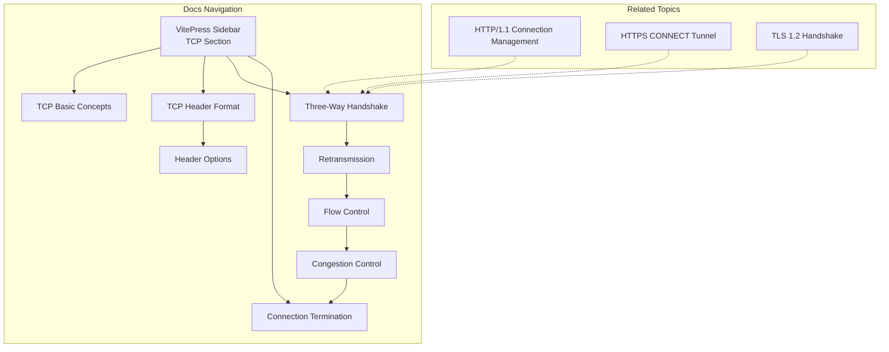
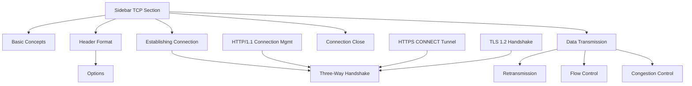
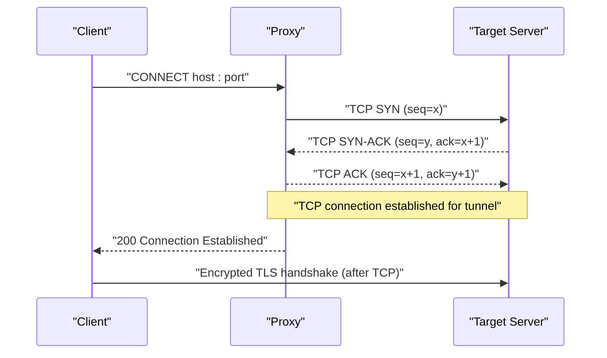
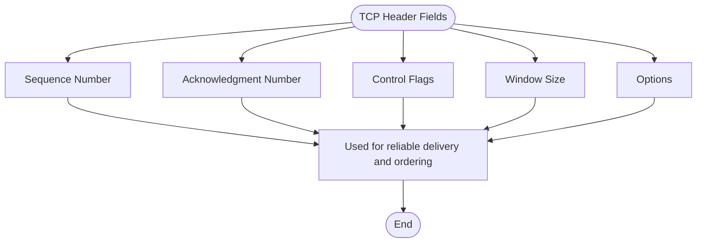
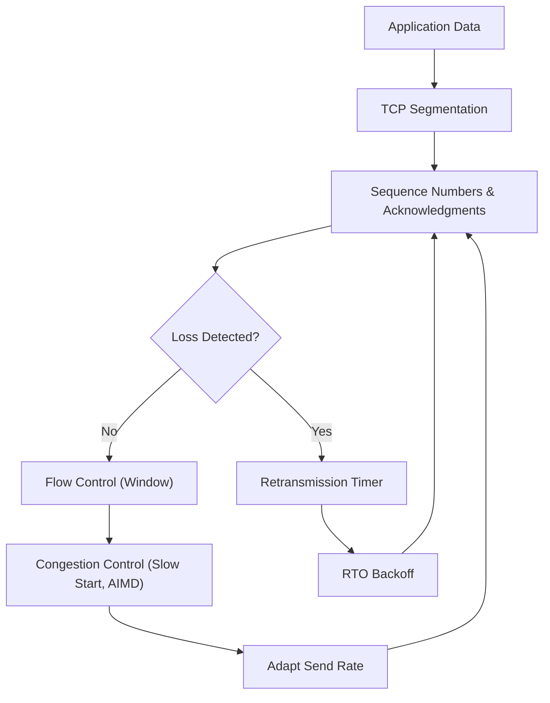
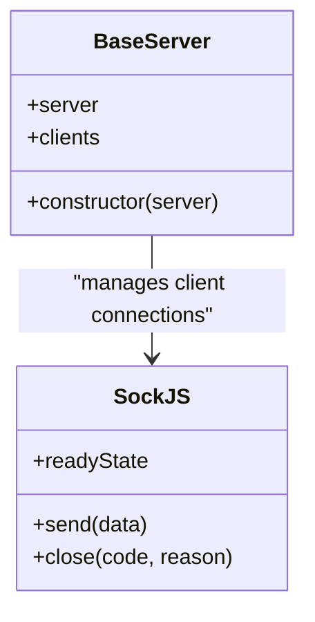
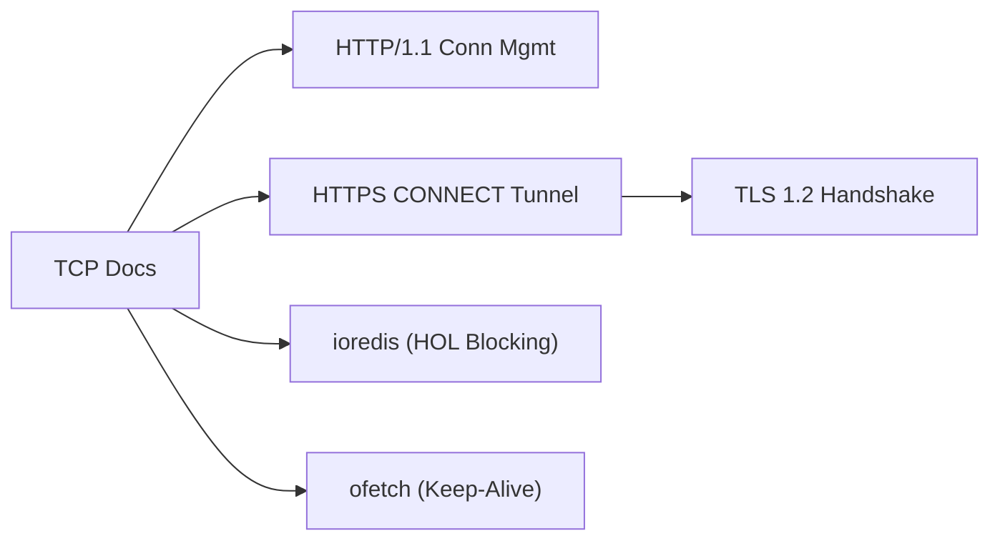

# TCP Fundamentals

<cite>
**Referenced Files in This Document**
- [sidebar.mts](file://docs/.vitepress/config/sidebar.mts)
- [05_连接管理.md](file://docs/03_网络协议/01_http/05_连接管理.md)
- [08_https代理.md](file://docs/03_网络协议/02_https/08_https代理.md)
- [09_抓包分析.md](file://docs/03_网络协议/02_https/09_抓包分析.md)
- [04_TLS1.2连接过程.md](file://docs/03_网络协议/02_https/04_TLS1.2连接过程.md)
- [BaseServer.js](file://源码学习/webpack@5.68.0/webpack 依赖包/webpack-dev-server/lib/servers/BaseServer.js)
- [index.js](file://源码学习/webpack@5.68.0/webpack 依赖包/webpack-dev-server/client/modules/sockjs-client/index.js)
- [ioredis README.md](file://demo/nuxt/demo_2/node_modules/ioredis/README.md)
- [ofetch README.md](file://demo/nuxt/demo_2/node_modules/ofetch/README.md)
</cite>

## Table of Contents
1. [Introduction](#introduction)
2. [Project Structure](#project-structure)
3. [Core Components](#core-components)
4. [Architecture Overview](#architecture-overview)
5. [Detailed Component Analysis](#detailed-component-analysis)
6. [Dependency Analysis](#dependency-analysis)
7. [Performance Considerations](#performance-considerations)
8. [Troubleshooting Guide](#troubleshooting-guide)
9. [Conclusion](#conclusion)
10. [Appendices](#appendices)

## Introduction
This document consolidates TCP/IP fundamentals and socket programming concepts present in the repository’s networking materials and related code. It explains TCP connection establishment (three-way handshake), data transmission, and termination (four-way handshake). It documents TCP header structure, sequence numbers, acknowledgments, and window scaling. It also covers socket programming concepts, client/server architecture, and asynchronous I/O handling, with practical examples drawn from the repository’s documentation and code. Finally, it addresses congestion control, flow control, reliability mechanisms, network troubleshooting, connection debugging, performance optimization, failure handling, timeouts, and connection pooling strategies.

## Project Structure
The repository organizes networking knowledge under a VitePress site configuration and a dedicated “Network Protocols” section. The sidebar defines a structured navigation for TCP topics, including basic concepts, header format, connection establishment, data transmission (retransmission, flow control, congestion control), and connection close. Supporting materials include HTTP/1.1 connection management, HTTPS proxy tunneling, and TLS handshake details. Additional real-world insights appear in third-party library documentation (e.g., keep-alive and HOL blocking).

**Diagram sources**
- [sidebar.mts:837-909](file://docs/.vitepress/config/sidebar.mts#L837-L909)
- [05_连接管理.md:2-77](file://docs/03_网络协议/01_http/05_连接管理.md#L2-L77)
- [08_https代理.md:60-102](file://docs/03_网络协议/02_https/08_https代理.md#L60-L102)
- [09_抓包分析.md:64-81](file://docs/03_网络协议/02_https/09_抓包分析.md#L64-L81)
- [04_TLS1.2连接过程.md:35-87](file://docs/03_网络协议/02_https/04_TLS1.2连接过程.md#L35-L87)

**Section sources**
- [sidebar.mts:837-909](file://docs/.vitepress/config/sidebar.mts#L837-L909)

## Core Components
- TCP three-way handshake and four-way teardown are documented in the sidebar’s TCP section.
- HTTP/1.1 connection management highlights persistent connections, browser connection limits, and HOL effects.
- HTTPS CONNECT tunneling demonstrates TCP connection establishment between proxy and target server.
- TLS 1.2 handshake outlines cryptographic handover after TCP connectivity.
- Asynchronous I/O and client connection management appear in the webpack-dev-server sockjs client and base server.

**Section sources**
- [sidebar.mts:837-909](file://docs/.vitepress/config/sidebar.mts#L837-L909)
- [05_连接管理.md:2-77](file://docs/03_网络协议/01_http/05_连接管理.md#L2-L77)
- [08_https代理.md:60-102](file://docs/03_网络协议/02_https/08_https代理.md#L60-L102)
- [09_抓包分析.md:64-81](file://docs/03_网络协议/02_https/09_抓包分析.md#L64-L81)
- [04_TLS1.2连接过程.md:35-87](file://docs/03_网络协议/02_https/04_TLS1.2连接过程.md#L35-L87)
- [BaseServer.js:1-18](file://源码学习/webpack@5.68.0/webpack 依赖包/webpack-dev-server/lib/servers/BaseServer.js#L1-L18)
- [index.js:1205-1284](file://源码学习/webpack@5.68.0/webpack 依赖包/webpack-dev-server/client/modules/sockjs-client/index.js#L1205-L1284)

## Architecture Overview
The repository’s TCP documentation is structured as a navigable guide. The sidebar defines a logical flow from basic concepts to advanced topics. HTTP/1.1 and HTTPS materials complement TCP by showing how higher-layer protocols rely on TCP and how proxies establish TCP tunnels. TLS material illustrates cryptographic handover after TCP connectivity is established.

**Diagram sources**
- [sidebar.mts:837-909](file://docs/.vitepress/config/sidebar.mts#L837-L909)
- [05_连接管理.md:2-77](file://docs/03_网络协议/01_http/05_连接管理.md#L2-L77)
- [08_https代理.md:60-102](file://docs/03_网络协议/02_https/08_https代理.md#L60-L102)
- [09_抓包分析.md:64-81](file://docs/03_网络协议/02_https/09_抓包分析.md#L64-L81)
- [04_TLS1.2连接过程.md:35-87](file://docs/03_网络协议/02_https/04_TLS1.2连接过程.md#L35-L87)

## Detailed Component Analysis

### TCP Three-Way Handshake
The repository’s sidebar enumerates the stages of the TCP three-way handshake and reasons for requiring three steps. HTTPS CONNECT tunneling demonstrates the underlying TCP handshake between proxy and target server, showing SYN/SYN-ACK/ACK exchanges without application payload.

**Diagram sources**
- [sidebar.mts:858-883](file://docs/.vitepress/config/sidebar.mts#L858-L883)
- [08_https代理.md:60-102](file://docs/03_网络协议/02_https/08_https代理.md#L60-L102)
- [09_抓包分析.md:64-81](file://docs/03_网络协议/02_https/09_抓包分析.md#L64-L81)

**Section sources**
- [sidebar.mts:858-883](file://docs/.vitepress/config/sidebar.mts#L858-L883)
- [08_https代理.md:60-102](file://docs/03_网络协议/02_https/08_https代理.md#L60-L102)

### TCP Four-Way Handshake (Connection Termination)
The repository’s sidebar lists connection termination under the TCP section. While the specific steps are not detailed in the provided files, the presence of this topic indicates coverage of FIN/FIN-ACK exchanges and TIME_WAIT handling.

**Section sources**
- [sidebar.mts:905-907](file://docs/.vitepress/config/sidebar.mts#L905-L907)

### TCP Header Structure, Sequence Numbers, Acknowledgments, Window Scaling
- The sidebar organizes TCP header format and options, indicating structured coverage of fields such as sequence number, acknowledgment number, and window size.
- TLS 1.2 handshake material demonstrates cryptographic handover after TCP connectivity, reinforcing the role of TCP transport prior to application encryption.

**Diagram sources**
- [sidebar.mts:846-854](file://docs/.vitepress/config/sidebar.mts#L846-L854)
- [04_TLS1.2连接过程.md:35-87](file://docs/03_网络协议/02_https/04_TLS1.2连接过程.md#L35-L87)

**Section sources**
- [sidebar.mts:846-854](file://docs/.vitepress/config/sidebar.mts#L846-L854)
- [04_TLS1.2连接过程.md:35-87](file://docs/03_网络协议/02_https/04_TLS1.2连接过程.md#L35-L87)

### Data Transmission, Retransmission, Flow Control, and Congestion Control
- The sidebar explicitly includes retransmission, flow control, and congestion control under data transmission.
- HTTP/1.1 connection management discusses HOL blocking and connection reuse, which are closely related to TCP’s reliability and throughput characteristics.
- ioredis documentation highlights HOL blocking (head-of-line blocking) caused by TCP and the benefits of connection reuse and reduced TCP overhead.

**Diagram sources**
- [sidebar.mts:887-903](file://docs/.vitepress/config/sidebar.mts#L887-L903)
- [05_连接管理.md:2-77](file://docs/03_网络协议/01_http/05_连接管理.md#L2-L77)
- [ioredis README.md:1306-1409](file://demo/nuxt/demo_2/node_modules/ioredis/README.md#L1306-L1409)

**Section sources**
- [sidebar.mts:887-903](file://docs/.vitepress/config/sidebar.mts#L887-L903)
- [05_连接管理.md:2-77](file://docs/03_网络协议/01_http/05_connection_management.md#L2-L77)
- [ioredis README.md:1306-1409](file://demo/nuxt/demo_2/node_modules/ioredis/README.md#L1306-L1409)

### Socket Programming Concepts, Client/Server Architecture, and Asynchronous I/O
- The webpack-dev-server BaseServer demonstrates a server collecting client connections, reflecting a typical server architecture pattern.
- The sockjs-client index shows asynchronous event-driven WebSocket-like behavior, including readiness states and send/close semantics, which map to asynchronous I/O patterns.

**Diagram sources**
- [BaseServer.js:1-18](file://源码学习/webpack@5.68.0/webpack 依赖包/webpack-dev-server/lib/servers/BaseServer.js#L1-L18)
- [index.js:1205-1284](file://源码学习/webpack@5.68.0/webpack 依赖包/webpack-dev-server/client/modules/sockjs-client/index.js#L1205-L1284)

**Section sources**
- [BaseServer.js:1-18](file://源码学习/webpack@5.68.0/webpack 依赖包/webpack-dev-server/lib/servers/BaseServer.js#L1-L18)
- [index.js:1205-1284](file://源码学习/webpack@5.68.0/webpack 依赖包/webpack-dev-server/client/modules/sockjs-client/index.js#L1205-L1284)

### Practical Examples: TCP Server and Client Implementations
- The repository’s documentation does not include explicit TCP server/client code examples. However, the presence of HTTPS CONNECT tunneling and TLS handshake materials demonstrates how TCP is used as the transport for secure communications.
- For practical implementation guidance, refer to the server architecture and asynchronous I/O patterns shown in the webpack-dev-server components.

**Section sources**
- [08_https代理.md:60-102](file://docs/03_网络协议/02_https/08_https代理.md#L60-L102)
- [09_抓包分析.md:64-81](file://docs/03_网络协议/02_https/09_抓包分析.md#L64-L81)
- [BaseServer.js:1-18](file://源码学习/webpack@5.68.0/webpack 依赖包/webpack-dev-server/lib/servers/BaseServer.js#L1-L18)
- [index.js:1205-1284](file://源码学习/webpack@5.68.0/webpack 依赖包/webpack-dev-server/client/modules/sockjs-client/index.js#L1205-L1284)

## Dependency Analysis
The repository’s TCP documentation depends on HTTP/1.1 and HTTPS materials to ground TCP concepts in real-world scenarios. TLS materials illustrate cryptographic handover after TCP connectivity. Third-party library documentation reinforces TCP-related performance and reliability concerns such as HOL blocking and keep-alive behavior.

**Diagram sources**
- [sidebar.mts:837-909](file://docs/.vitepress/config/sidebar.mts#L837-L909)
- [05_连接管理.md:2-77](file://docs/03_网络协议/01_http/05_连接管理.md#L2-L77)
- [08_https代理.md:60-102](file://docs/03_网络协议/02_https/08_https代理.md#L60-L102)
- [09_抓包分析.md:64-81](file://docs/03_网络协议/02_https/09_抓包分析.md#L64-L81)
- [04_TLS1.2连接过程.md:35-87](file://docs/03_网络协议/02_https/04_TLS1.2连接过程.md#L35-L87)
- [ioredis README.md:1306-1409](file://demo/nuxt/demo_2/node_modules/ioredis/README.md#L1306-L1409)
- [ofetch README.md:390-390](file://demo/nuxt/demo_2/node_modules/ofetch/README.md#L390-L390)

**Section sources**
- [sidebar.mts:837-909](file://docs/.vitepress/config/sidebar.mts#L837-L909)
- [05_连接管理.md:2-77](file://docs/03_网络协议/01_http/05_连接管理.md#L2-L77)
- [08_https代理.md:60-102](file://docs/03_网络协议/02_https/08_https代理.md#L60-L102)
- [09_抓包分析.md:64-81](file://docs/03_网络协议/02_https/09_抓包分析.md#L64-L81)
- [04_TLS1.2连接过程.md:35-87](file://docs/03_网络协议/02_https/04_TLS1.2连接过程.md#L35-L87)
- [ioredis README.md:1306-1409](file://demo/nuxt/demo_2/node_modules/ioredis/README.md#L1306-L1409)
- [ofetch README.md:390-390](file://demo/nuxt/demo_2/node_modules/ofetch/README.md#L390-L390)

## Performance Considerations
- HTTP/1.1 connection management discusses HOL blocking and the benefits of persistent connections and connection reuse.
- ioredis documentation explicitly mentions HOL blocking caused by TCP and the advantages of reducing TCP overhead via connection reuse.
- ofetch documentation describes enabling keep-alive to reuse sockets and avoid repeated TCP handshakes.

**Section sources**
- [05_连接管理.md:2-77](file://docs/03_网络协议/01_http/05_连接管理.md#L2-L77)
- [ioredis README.md:1306-1409](file://demo/nuxt/demo_2/node_modules/ioredis/README.md#L1306-L1409)
- [ofetch README.md:390-390](file://demo/nuxt/demo_2/node_modules/ofetch/README.md#L390-L390)

## Troubleshooting Guide
- Use HTTPS CONNECT tunneling as a model for diagnosing TCP connectivity issues between proxy and target servers.
- Apply TLS capture techniques to verify cryptographic handover after TCP establishment.
- Monitor for HOL blocking symptoms and adjust connection pooling and keep-alive settings accordingly.

**Section sources**
- [08_https代理.md:60-102](file://docs/03_网络协议/02_https/08_https代理.md#L60-L102)
- [09_抓包分析.md:64-81](file://docs/03_网络协议/02_https/09_抓包分析.md#L64-L81)
- [ioredis README.md:1306-1409](file://demo/nuxt/demo_2/node_modules/ioredis/README.md#L1306-L1409)
- [ofetch README.md:390-390](file://demo/nuxt/demo_2/node_modules/ofetch/README.md#L390-L390)

## Conclusion
The repository’s TCP documentation provides a structured foundation covering handshake, header fields, reliability, flow control, congestion control, and termination. HTTP/1.1 and HTTPS materials contextualize TCP in production environments, while third-party library documentation reinforces performance and reliability considerations such as HOL blocking and keep-alive behavior. Together, these materials offer a practical guide to understanding and applying TCP fundamentals in real systems.

## Appendices
- TCP topics are organized in the VitePress sidebar under the TCP section.
- HTTP/1.1 connection management and HTTPS tunneling materials support TCP troubleshooting and performance tuning.
- TLS handshake material complements TCP by showing cryptographic handover after transport connectivity.

**Section sources**
- [sidebar.mts:837-909](file://docs/.vitepress/config/sidebar.mts#L837-L909)
- [05_连接管理.md:2-77](file://docs/03_网络协议/01_http/05_连接管理.md#L2-L77)
- [08_https代理.md:60-102](file://docs/03_网络协议/02_https/08_https代理.md#L60-L102)
- [09_抓包分析.md:64-81](file://docs/03_网络协议/02_https/09_抓包分析.md#L64-L81)
- [04_TLS1.2连接过程.md:35-87](file://docs/03_网络协议/02_https/04_TLS1.2连接过程.md#L35-L87)