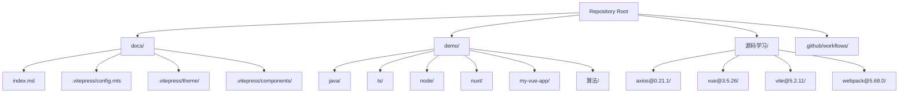
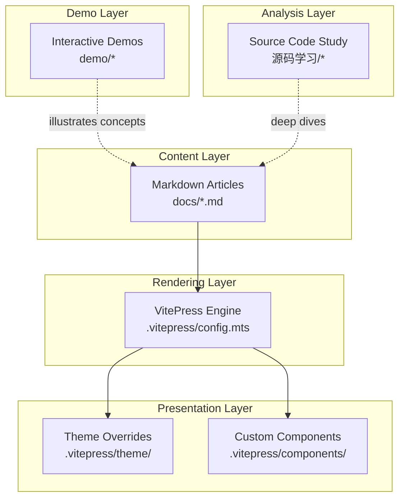
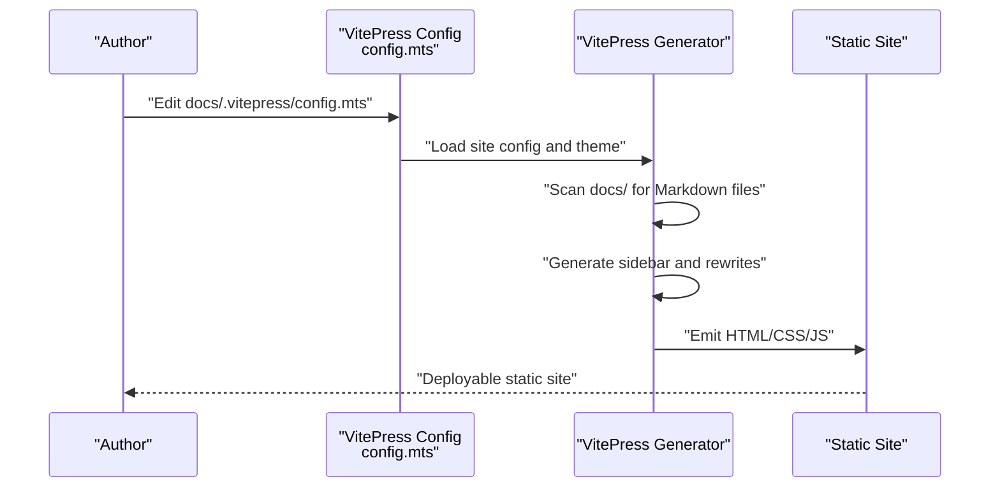
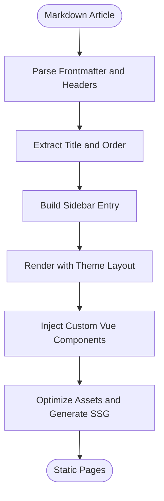
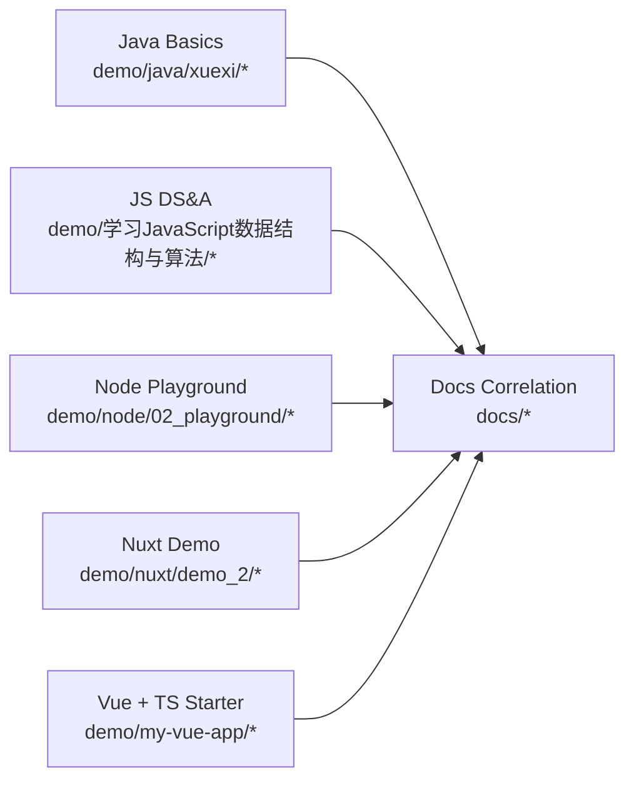
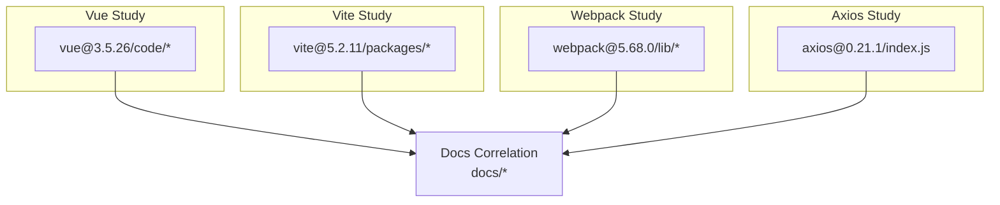
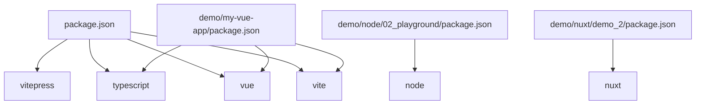
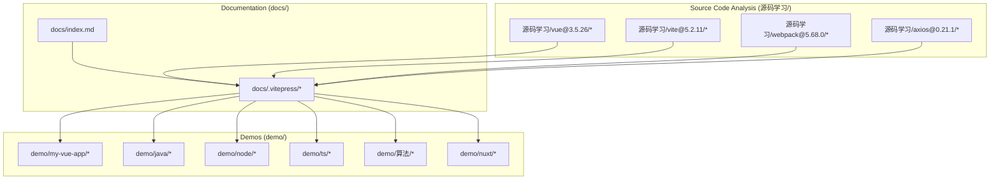

# Architecture

<cite>
**Referenced Files in This Document**
- [README.md](file://README.md)
- [package.json](file://package.json)
- [tsconfig.json](file://tsconfig.json)
- [.gitignore](file://.gitignore)
- [docs/index.md](file://docs/index.md)
- [docs/.vitepress/config.mts](file://docs/.vitepress/config.mts)
- [docs/.vitepress/components/](file://docs/.vitepress/components/)
- [docs/.vitepress/theme/](file://docs/.vitepress/theme/)
- [demo/my-vue-app/vite.config.ts](file://demo/my-vue-app/vite.config.ts)
- [demo/my-vue-app/src/main.ts](file://demo/my-vue-app/src/main.ts)
- [demo/my-vue-app/src/App.vue](file://demo/my-vue-app/src/App.vue)
- [demo/node/02_playground/package.json](file://demo/node/02_playground/package.json)
- [demo/nuxt/demo_2/nuxt.config.ts](file://demo/nuxt/demo_2/nuxt.config.ts)
- [demo/java/xuexi/04.运算符/Main.java](file://demo/java/xuexi/04.运算符/Main.java)
- [demo/ts/base/](file://demo/ts/base/)
- [demo/npm/init/01.js](file://demo/npm/init/01.js)
- [demo/pnpm/01_查看node_modules结构/package.json](file://demo/pnpm/01_查看node_modules结构/package.json)
- [demo/学习JavaScript数据结构与算法/01.数组.js](file://demo/学习JavaScript数据结构与算法/01.数组.js)
- [demo/网络协议/tcp/](file://demo/网络协议/tcp/)
- [源码学习/axios@0.21.1/index.js](file://源码学习/axios@0.21.1/index.js)
- [源码学习/vue@3.5.26/code/](file://源码学习/vue@3.5.26/code/)
- [源码学习/vite@5.2.11/packages/](file://源码学习/vite@5.2.11/packages/)
- [源码学习/webpack@5.68.0/lib/](file://源码学习/webpack@5.68.0/lib/)
- [.github/workflows/deploy.yml](file://.github/workflows/deploy.yml)
</cite>

## Table of Contents
1. [Introduction](#introduction)
2. [Project Structure](#project-structure)
3. [Core Components](#core-components)
4. [Architecture Overview](#architecture-overview)
5. [Detailed Component Analysis](#detailed-component-analysis)
6. [Dependency Analysis](#dependency-analysis)
7. [Performance Considerations](#performance-considerations)
8. [Troubleshooting Guide](#troubleshooting-guide)
9. [Conclusion](#conclusion)
10. [Appendices](#appendices)

## Introduction
This document describes the architecture of the wzb knowledge base project. It focuses on how VitePress serves as the static site generator for documentation, how demos and source code analysis are organized, and how cross-cutting concerns like navigation, search, and content rendering are implemented. The system is designed to separate concerns across three primary areas:
- Documentation (docs/): Markdown-driven knowledge articles rendered via VitePress
- Demos (demo/): Interactive learning artifacts (Java, JavaScript, TypeScript, Node.js, Nuxt, Vue, etc.)
- Source code analysis (源码学习/): In-depth study of open-source libraries and frameworks

The architecture emphasizes:
- Using Markdown for authoring and Vue components for interactive UI
- Leveraging TypeScript for type safety and developer productivity
- Employing a modular VitePress configuration for navigation and theming
- Supporting local development and CI-based deployment

## Project Structure
The repository is organized into three major top-level areas:
- docs/: VitePress-powered documentation with Markdown content and VitePress-specific configuration
- demo/: Hands-on learning projects across languages and frameworks
- 源码学习/: Source code walkthroughs of popular libraries and tools

**Diagram sources**
- [docs/index.md](file://docs/index.md)
- [docs/.vitepress/config.mts](file://docs/.vitepress/config.mts)
- [demo/my-vue-app/vite.config.ts](file://demo/my-vue-app/vite.config.ts)
- [源码学习/vue@3.5.26/code/](file://源码学习/vue@3.5.26/code/)
- [.github/workflows/deploy.yml](file://.github/workflows/deploy.yml)

**Section sources**
- [README.md](file://README.md)
- [package.json](file://package.json)
- [docs/index.md](file://docs/index.md)
- [docs/.vitepress/config.mts](file://docs/.vitepress/config.mts)

## Core Components
- VitePress configuration and theme
  - docs/.vitepress/config.mts defines site metadata, navigation, and build behavior
  - docs/.vitepress/theme/ provides layout and styling overrides
  - docs/.vitepress/components/ hosts reusable Vue components for interactive demos
- Documentation content
  - docs/index.md is the landing page; Markdown files under docs/ form the knowledge base
- Demo applications
  - demo/my-vue-app demonstrates Vue + TypeScript + Vite
  - demo/node/02_playground showcases Node.js development
  - demo/nuxt/demo_2 illustrates Nuxt framework usage
  - demo/java/xuexi and demo/ts illustrate language basics
- Source code analysis
  - 源码学习/ contains structured exploration of libraries like Vue, Vite, Webpack, and Axios

Key technical choices:
- Markdown for documentation ensures lightweight authoring and easy maintenance
- Vue components enable interactive widgets within documentation
- TypeScript improves reliability and developer experience across demos and analysis
- VitePress handles static site generation, routing, and search indexing

**Section sources**
- [docs/.vitepress/config.mts](file://docs/.vitepress/config.mts)
- [docs/.vitepress/theme/](file://docs/.vitepress/theme/)
- [docs/.vitepress/components/](file://docs/.vitepress/components/)
- [demo/my-vue-app/vite.config.ts](file://demo/my-vue-app/vite.config.ts)
- [demo/my-vue-app/src/App.vue](file://demo/my-vue-app/src/App.vue)
- [demo/my-vue-app/src/main.ts](file://demo/my-vue-app/src/main.ts)

## Architecture Overview
The system follows a layered architecture:
- Content layer: Markdown articles authored in docs/
- Rendering layer: VitePress transforms Markdown into a static site
- Presentation layer: Theme and custom Vue components shape navigation and UI
- Demo layer: Interactive examples under demo/ demonstrate concepts
- Analysis layer: Source code walkthroughs under 源码学习/ provide deeper understanding

**Diagram sources**
- [docs/.vitepress/config.mts](file://docs/.vitepress/config.mts)
- [docs/.vitepress/theme/](file://docs/.vitepress/theme/)
- [docs/.vitepress/components/](file://docs/.vitepress/components/)
- [demo/my-vue-app/vite.config.ts](file://demo/my-vue-app/vite.config.ts)
- [源码学习/vue@3.5.26/code/](file://源码学习/vue@3.5.26/code/)

## Detailed Component Analysis

### VitePress Configuration and Navigation
The VitePress configuration orchestrates site metadata, navigation generation, and build behavior. It integrates with:
- Sidebar generation for hierarchical navigation
- Rewrites for URL normalization
- Theme customization and component registration

**Diagram sources**
- [docs/.vitepress/config.mts](file://docs/.vitepress/config.mts)

**Section sources**
- [docs/.vitepress/config.mts](file://docs/.vitepress/config.mts)

### Content Rendering Pipeline
Markdown articles are transformed into interactive web pages with optional Vue components.

**Diagram sources**
- [docs/.vitepress/components/](file://docs/.vitepress/components/)
- [docs/.vitepress/theme/](file://docs/.vitepress/theme/)

**Section sources**
- [docs/.vitepress/components/](file://docs/.vitepress/components/)
- [docs/.vitepress/theme/](file://docs/.vitepress/theme/)

### Demo Applications and Learning Artifacts
Demos are organized by technology and concept, enabling hands-on learning:
- Java basics under demo/java/xuexi
- JavaScript data structures under demo/学习JavaScript数据结构与算法
- Node.js playground under demo/node/02_playground
- Nuxt showcase under demo/nuxt/demo_2
- Vue + TypeScript starter under demo/my-vue-app

**Diagram sources**
- [demo/java/xuexi/04.运算符/Main.java](file://demo/java/xuexi/04.运算符/Main.java)
- [demo/学习JavaScript数据结构与算法/01.数组.js](file://demo/学习JavaScript数据结构与算法/01.数组.js)
- [demo/node/02_playground/package.json](file://demo/node/02_playground/package.json)
- [demo/nuxt/demo_2/nuxt.config.ts](file://demo/nuxt/demo_2/nuxt.config.ts)
- [demo/my-vue-app/vite.config.ts](file://demo/my-vue-app/vite.config.ts)

**Section sources**
- [demo/java/xuexi/04.运算符/Main.java](file://demo/java/xuexi/04.运算符/Main.java)
- [demo/学习JavaScript数据结构与算法/01.数组.js](file://demo/学习JavaScript数据结构与算法/01.数组.js)
- [demo/node/02_playground/package.json](file://demo/node/02_playground/package.json)
- [demo/nuxt/demo_2/nuxt.config.ts](file://demo/nuxt/demo_2/nuxt.config.ts)
- [demo/my-vue-app/vite.config.ts](file://demo/my-vue-app/vite.config.ts)

### Source Code Analysis Workspaces
The 源码学习/ area provides structured exploration of library internals:
- Vue 3.5.26 codebase under 源码学习/vue@3.5.26/code
- Vite 5.2.11 packages under 源码学习/vite@5.2.11/packages
- Webpack 5.68.0 lib under 源码学习/webpack@5.68.0/lib
- Axios 0.21.1 under 源码学习/axios@0.21.1

**Diagram sources**
- [源码学习/vue@3.5.26/code/](file://源码学习/vue@3.5.26/code/)
- [源码学习/vite@5.2.11/packages/](file://源码学习/vite@5.2.11/packages/)
- [源码学习/webpack@5.68.0/lib/](file://源码学习/webpack@5.68.0/lib/)
- [源码学习/axios@0.21.1/index.js](file://源码学习/axios@0.21.1/index.js)

**Section sources**
- [源码学习/vue@3.5.26/code/](file://源码学习/vue@3.5.26/code/)
- [源码学习/vite@5.2.11/packages/](file://源码学习/vite@5.2.11/packages/)
- [源码学习/webpack@5.68.0/lib/](file://源码学习/webpack@5.68.0/lib/)
- [源码学习/axios@0.21.1/index.js](file://源码学习/axios@0.21.1/index.js)

## Dependency Analysis
The project’s dependencies span documentation tooling, demos, and analysis workspaces.

**Diagram sources**
- [package.json](file://package.json)
- [demo/my-vue-app/vite.config.ts](file://demo/my-vue-app/vite.config.ts)
- [demo/my-vue-app/src/main.ts](file://demo/my-vue-app/src/main.ts)
- [demo/node/02_playground/package.json](file://demo/node/02_playground/package.json)
- [demo/nuxt/demo_2/nuxt.config.ts](file://demo/nuxt/demo_2/nuxt.config.ts)

**Section sources**
- [package.json](file://package.json)
- [demo/my-vue-app/vite.config.ts](file://demo/my-vue-app/vite.config.ts)
- [demo/my-vue-app/src/main.ts](file://demo/my-vue-app/src/main.ts)
- [demo/node/02_playground/package.json](file://demo/node/02_playground/package.json)
- [demo/nuxt/demo_2/nuxt.config.ts](file://demo/nuxt/demo_2/nuxt.config.ts)

## Performance Considerations
- Static site generation reduces runtime overhead and improves load times
- Minimizing heavy client-side logic in Vue components helps maintain responsiveness
- Keeping Markdown content lean and avoiding excessive images improves build times
- Using VitePress’s built-in optimizations and asset handling reduces bundle sizes

[No sources needed since this section provides general guidance]

## Troubleshooting Guide
Common issues and resolutions:
- VitePress config errors
  - Verify docs/.vitepress/config.mts syntax and imports
  - Ensure sidebar and rewrite entries match actual file paths
- Build failures
  - Confirm TypeScript and Vue versions align with VitePress requirements
  - Check tsconfig.json includes docs/.vitepress/**/* for type checking
- Demo misconfiguration
  - Validate vite.config.ts and package.json versions for demo projects
  - Reinstall dependencies if component imports fail
- Deployment problems
  - Review .github/workflows/deploy.yml for correct build and publish steps

**Section sources**
- [docs/.vitepress/config.mts](file://docs/.vitepress/config.mts)
- [tsconfig.json](file://tsconfig.json)
- [demo/my-vue-app/vite.config.ts](file://demo/my-vue-app/vite.config.ts)
- [.github/workflows/deploy.yml](file://.github/workflows/deploy.yml)

## Conclusion
The wzb knowledge base leverages VitePress to deliver a scalable, maintainable documentation platform. By structuring content in docs/, interactive examples in demo/, and deep dives in 源码学习/, the project balances learning, demonstration, and analysis. The architecture supports efficient authoring, robust rendering, and straightforward deployment, while TypeScript and Vue components enhance developer experience and interactivity.

[No sources needed since this section summarizes without analyzing specific files]

## Appendices

### System Context Diagram: docs/, demo/, and 源码学习/ Boundaries
This diagram shows how the three primary areas relate to each other and to the broader ecosystem.

**Diagram sources**
- [docs/index.md](file://docs/index.md)
- [docs/.vitepress/config.mts](file://docs/.vitepress/config.mts)
- [demo/my-vue-app/vite.config.ts](file://demo/my-vue-app/vite.config.ts)
- [demo/java/xuexi/04.运算符/Main.java](file://demo/java/xuexi/04.运算符/Main.java)
- [demo/node/02_playground/package.json](file://demo/node/02_playground/package.json)
- [demo/nuxt/demo_2/nuxt.config.ts](file://demo/nuxt/demo_2/nuxt.config.ts)
- [源码学习/vue@3.5.26/code/](file://源码学习/vue@3.5.26/code/)
- [源码学习/vite@5.2.11/packages/](file://源码学习/vite@5.2.11/packages/)
- [源码学习/webpack@5.68.0/lib/](file://源码学习/webpack@5.68.0/lib/)
- [源码学习/axios@0.21.1/index.js](file://源码学习/axios@0.21.1/index.js)

### Cross-Cutting Concerns
- Search functionality
  - VitePress provides built-in client-side search; ensure content is properly indexed via Markdown frontmatter and headings
- Navigation generation
  - Maintain accurate sidebar and rewrite configurations in docs/.vitepress/config.mts to reflect folder structure
- Content organization
  - Keep consistent naming and folder hierarchy across docs/, demo/, and 源码学习/ for discoverability

[No sources needed since this section provides general guidance]