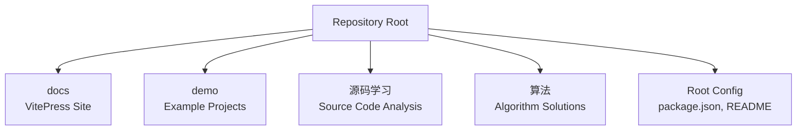
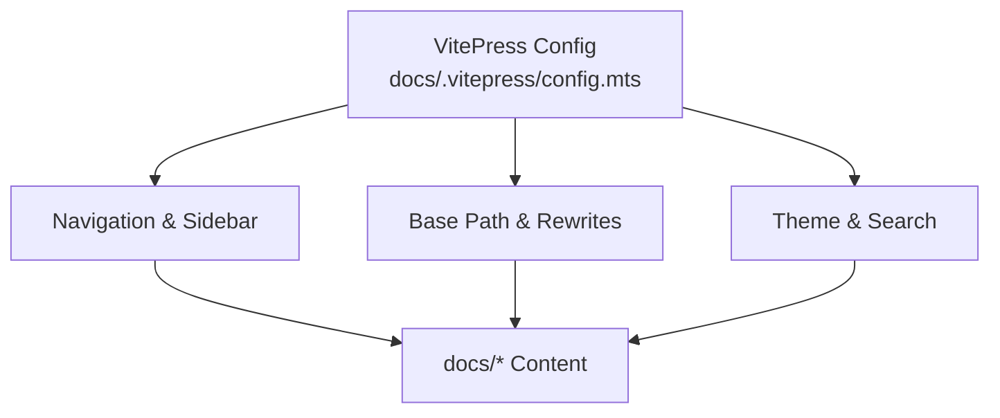
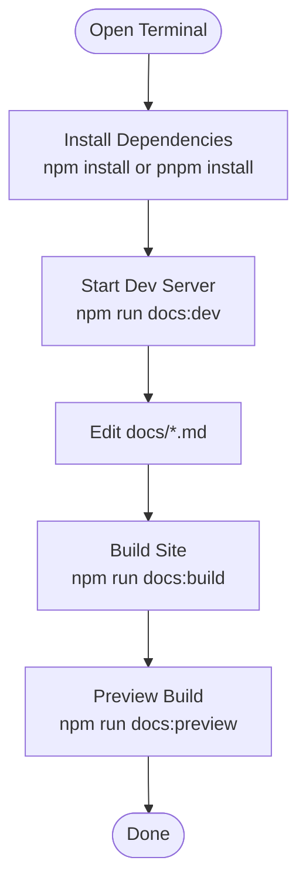
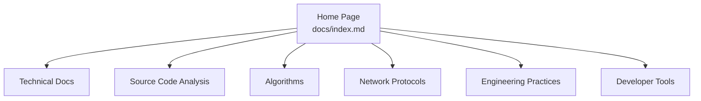
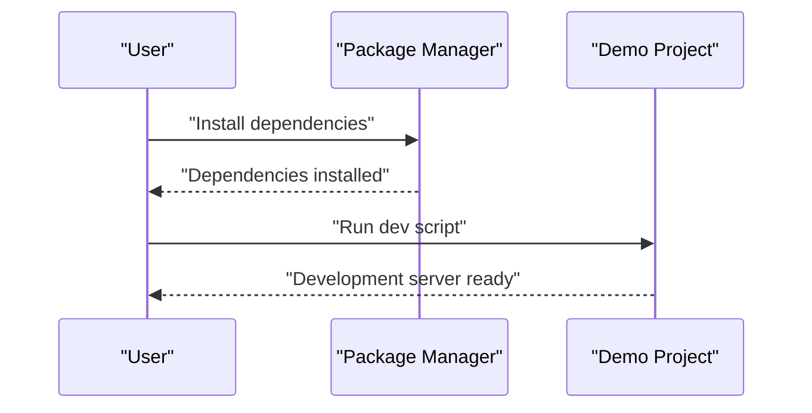
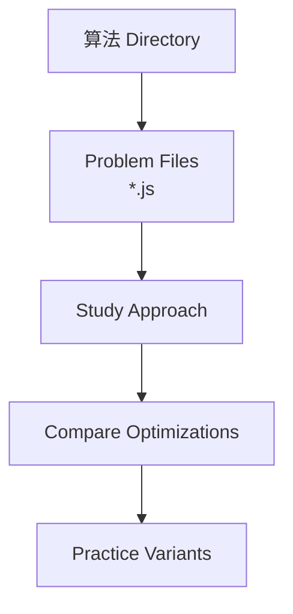
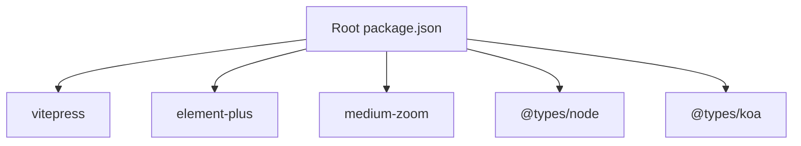

# Getting Started

<cite>
**Referenced Files in This Document**
- [README.md](file://README.md)
- [package.json](file://package.json)
- [docs/index.md](file://docs/index.md)
- [docs/.vitepress/config.mts](file://docs/.vitepress/config.mts)
- [demo/my-vue-app/package.json](file://demo/my-vue-app/package.json)
- [demo/node/02_playground/package.json](file://demo/node/02_playground/package.json)
- [demo/nuxt/demo_2/package.json](file://demo/nuxt/demo_2/package.json)
- [demo/ts/base/package.json](file://demo/ts/base/package.json)
- [算法/1.two-sum.js](file://算法/1.two-sum.js)
- [.gitignore](file://.gitignore)
</cite>

## Table of Contents
1. [Introduction](#introduction)
2. [Project Structure](#project-structure)
3. [Core Components](#core-components)
4. [Architecture Overview](#architecture-overview)
5. [Detailed Component Analysis](#detailed-component-analysis)
6. [Dependency Analysis](#dependency-analysis)
7. [Performance Considerations](#performance-considerations)
8. [Troubleshooting Guide](#troubleshooting-guide)
9. [Conclusion](#conclusion)

## Introduction
This guide helps you set up the development environment, explore the knowledge base content, and run demo projects included in the repository. The knowledge base is built with VitePress and organized into categorized documentation sections. You will also learn how to build and preview the documentation site locally, contribute content, and extend the knowledge base with your own notes and examples.

## Project Structure
The repository is organized into several key areas:
- docs: VitePress-powered documentation site with categorized topics (frontend, engineering, protocols, etc.)
- demo: Example projects showcasing frontend frameworks, Node.js servers, Nuxt demos, TypeScript basics, and protocol samples
- 源码学习: Source code analysis of popular libraries and frameworks
- 算法: JavaScript solutions to LeetCode-style problems
- Root configuration: Package management and scripts for documentation

**Section sources**
- [README.md:1-4](file://README.md#L1-L4)
- [package.json:1-24](file://package.json#L1-L24)

## Core Components
- Documentation site powered by VitePress with local search, line numbers, and responsive theme configuration
- Scripts to develop, build, and preview the documentation site
- Demo projects for Vue, Node/Koa, Nuxt, and TypeScript to help you practice and experiment
- Algorithm solutions organized by problem ID for self-paced learning

Key capabilities:
- Local development server for docs
- Static build generation for deployment
- Preview mode for testing builds
- Navigation and sidebar driven by VitePress configuration

**Section sources**
- [package.json:13-17](file://package.json#L13-L17)
- [docs/.vitepress/config.mts:9-92](file://docs/.vitepress/config.mts#L9-L92)

## Architecture Overview
The documentation site is configured via VitePress and served from the docs directory. The site’s base path and rewrite rules are defined centrally, enabling predictable routing across sections.

**Diagram sources**
- [docs/.vitepress/config.mts:1-92](file://docs/.vitepress/config.mts#L1-L92)

**Section sources**
- [docs/.vitepress/config.mts:1-92](file://docs/.vitepress/config.mts#L1-L92)

## Detailed Component Analysis

### Setting Up the Documentation Environment
Follow these steps to run the documentation site locally:
1. Install dependencies using your preferred package manager (npm or pnpm)
2. Start the development server
3. Build and preview the static site

Practical commands:
- Install dependencies: npm install or pnpm install
- Start development server: npm run docs:dev
- Build static site: npm run docs:build
- Preview build: npm run docs:preview

Notes:
- The repository sets a base path for the site; ensure your local environment matches the configured base path
- The site enables line numbers and image lazy loading for improved readability

**Section sources**
- [package.json:13-17](file://package.json#L13-L17)
- [docs/.vitepress/config.mts:7-29](file://docs/.vitepress/config.mts#L7-L29)

### Exploring the Knowledge Base Sections
The homepage provides quick links to major categories. Use these links to navigate:
- Technical documentation (HTML/CSS/JS, browser, engineering)
- Source code analysis
- Algorithms
- Network protocols
- Engineering practices
- Developer tools

**Diagram sources**
- [docs/index.md:1-49](file://docs/index.md#L1-L49)

**Section sources**
- [docs/index.md:1-49](file://docs/index.md#L1-L49)

### Running Demo Projects
The demo directory contains runnable examples. Choose a demo and follow its package scripts to start the development server.

Examples:
- Vue demo: see demo/my-vue-app/package.json scripts
- Node/Koa playground: see demo/node/02_playground/package.json scripts
- Nuxt demo: see demo/nuxt/demo_2/package.json scripts
- TypeScript basics: see demo/ts/base/package.json scripts

**Section sources**
- [demo/my-vue-app/package.json:1-21](file://demo/my-vue-app/package.json#L1-L21)
- [demo/node/02_playground/package.json:1-32](file://demo/node/02_playground/package.json#L1-L32)
- [demo/nuxt/demo_2/package.json:1-27](file://demo/nuxt/demo_2/package.json#L1-L27)
- [demo/ts/base/package.json:1-18](file://demo/ts/base/package.json#L1-L18)

### Studying Algorithm Solutions
Explore algorithm solutions under the 算法 directory. Each solution is a standalone JavaScript file named after the problem ID. Open any file to review the approach and implementation.

Tip: Use the file names to locate specific problems and compare different solutions.

**Section sources**
- [算法/1.two-sum.js](file://算法/1.two-sum.js)

### Building and Contributing to the Knowledge Base
- Build the documentation site locally using the provided scripts
- Add new content by creating Markdown files under docs and updating navigation/sidebars as needed
- Keep content organized by existing categories to maintain discoverability

Recommended workflow:
- Create/edit docs/*.md
- Run npm run docs:dev to preview changes
- Commit and push updates to share your additions

**Section sources**
- [package.json:13-17](file://package.json#L13-L17)
- [docs/.vitepress/config.mts:29-90](file://docs/.vitepress/config.mts#L29-L90)

## Dependency Analysis
The repository uses npm as the package manager and defines scripts for VitePress. The documentation site relies on VitePress and optional UI libraries for enhanced presentation.

**Diagram sources**
- [package.json:8-22](file://package.json#L8-L22)

**Section sources**
- [package.json:1-24](file://package.json#L1-L24)

## Performance Considerations
- Enable image lazy loading and line numbers for readability without impacting performance significantly
- Use preview mode to validate build artifacts before deployment
- Keep dependencies updated to benefit from performance improvements and bug fixes

## Troubleshooting Guide
Common setup issues and resolutions:
- Base path mismatch: Ensure your local environment aligns with the configured base path in the VitePress config
- Missing dependencies: Install dependencies using npm or pnpm before running scripts
- Port conflicts: If the development server fails to start, check for port usage and adjust as needed
- Git ignore: Some demo builds may generate temporary files; refer to .gitignore to avoid committing unnecessary artifacts

**Section sources**
- [docs/.vitepress/config.mts:7-11](file://docs/.vitepress/config.mts#L7-L11)
- [.gitignore](file://.gitignore)

## Conclusion
You now have the essentials to set up the environment, explore the knowledge base, run demo projects, and contribute new content. Use the documented scripts and structure to streamline development and keep your contributions aligned with the repository’s organization.