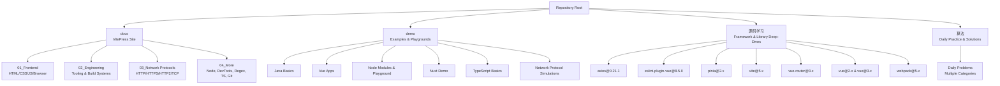
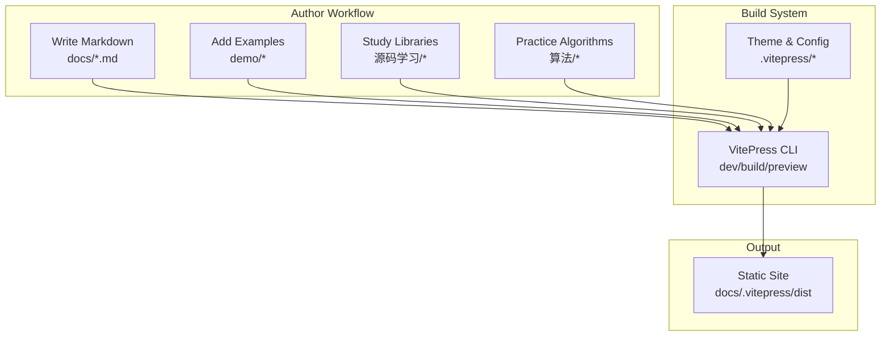
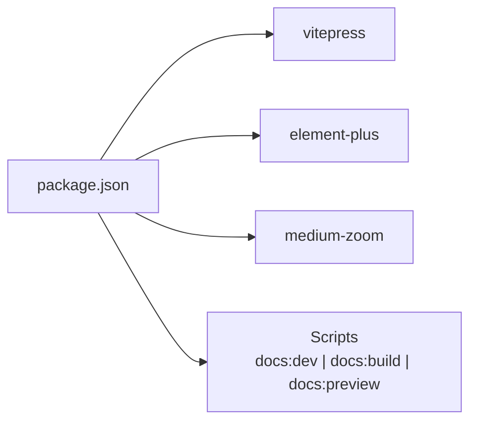

# Introduction

<cite>
**Referenced Files in This Document**
- [README.md](file://README.md)
- [package.json](file://package.json)
- [docs/index.md](file://docs/index.md)
</cite>

## Table of Contents
1. [Introduction](#introduction)
2. [Project Structure](#project-structure)
3. [Core Components](#core-components)
4. [Architecture Overview](#architecture-overview)
5. [Detailed Component Analysis](#detailed-component-analysis)
6. [Dependency Analysis](#dependency-analysis)
7. [Performance Considerations](#performance-considerations)
8. [Troubleshooting Guide](#troubleshooting-guide)
9. [Conclusion](#conclusion)
10. [Appendices](#appendices)

## Introduction
This section introduces the wzb knowledge base project, a personal learning repository built with VitePress. Its purpose is to serve as a centralized documentation platform where the author shares structured notes, practical examples, and deep dives across frontend technologies, backend concepts, engineering practices, networking protocols, algorithms, and source code analysis. The project’s philosophy emphasizes combining theoretical understanding with hands-on exploration, enabling learners at all levels to progress systematically from foundational concepts to advanced topics.

The knowledge base targets:
- Frontend developers seeking to strengthen HTML/CSS/JavaScript/browser internals and modern frameworks
- Backend engineers exploring Node.js ecosystems and server-side concepts
- DevOps and engineering practitioners interested in tooling, bundlers, and build systems
- Students and professionals preparing for technical interviews with algorithm practice
- Anyone who prefers self-paced, example-driven learning over passive consumption

Learning objectives include:
- Building a coherent mental model of web technologies and their interconnections
- Developing practical problem-solving skills through guided exercises and real-world scenarios
- Understanding how popular libraries and frameworks are architected under the hood
- Gaining confidence in debugging, optimizing, and extending applications across stacks

As a VitePress-powered site, the knowledge base offers fast navigation, responsive design, and a clean reading experience optimized for both desktop and mobile devices.

**Section sources**
- [README.md:1-4](file://README.md#L1-L4)
- [package.json:1-24](file://package.json#L1-L24)
- [docs/index.md:1-49](file://docs/index.md#L1-L49)

## Project Structure
At a high level, the repository is organized into three primary areas:
- docs: The VitePress documentation site containing categorized learning materials (frontend, engineering tooling, networking, more content)
- demo: Small, focused examples and playgrounds for languages and tools (e.g., Java basics, Vue apps, Node modules, Nuxt demos, TypeScript basics, network protocol simulations)
- 源码学习 (Source Code Learning): In-depth analyses and annotated explorations of major libraries and frameworks (axios, ESLint plugin for Vue, Pinia, Vite, Vue Router, Vue 2/3, Webpack)
- 算法 (Algorithms): A growing collection of algorithm problems and solutions, used for daily practice and interview preparation

**Section sources**
- [docs/index.md:1-49](file://docs/index.md#L1-L49)

## Core Components
- VitePress Site (docs): The central hub for structured learning content, organized by domain and topic. It leverages VitePress’s built-in theme and configuration to deliver a fast, searchable, and navigable knowledge base.
- Example Demos (demo): Practical, minimal code samples that illustrate concepts in action, helping readers connect theory to runnable code.
- Source Code Learning (源码学习): Curated deep-dives into open-source projects, focusing on architecture, design decisions, and implementation patterns.
- Algorithm Practice (算法): A dedicated area for algorithmic thinking, problem-solving, and iterative improvement of approaches.

These components collectively form a cohesive learning ecosystem that encourages active engagement and continuous reinforcement.

**Section sources**
- [README.md:1-4](file://README.md#L1-L4)
- [package.json:1-24](file://package.json#L1-L24)
- [docs/index.md:1-49](file://docs/index.md#L1-L49)

## Architecture Overview
The knowledge base follows a static-site generation approach powered by VitePress. The author writes content in Markdown, organizes it into thematic categories, and relies on VitePress to transform it into a polished website. The demo and source code learning directories complement the documentation by offering interactive and analytical resources respectively.

**Section sources**
- [package.json:13-17](file://package.json#L13-L17)
- [docs/index.md:1-49](file://docs/index.md#L1-L49)

## Detailed Component Analysis
### Purpose and Scope
- Personal Learning Repository: The project documents the author’s journey and insights, making it easy for others to follow along and benefit from curated knowledge.
- Broad Coverage: Content spans frontend fundamentals, engineering tooling, networking, backend concepts, and algorithmic practice, ensuring a well-rounded foundation for developers.
- Centralized Platform: VitePress provides a single, navigable location for all materials, with clear categorization and cross-links.

### Target Audience
- Developers at all levels: From beginners taking their first steps in HTML/CSS/JS to experienced engineers seeking deeper understanding of framework internals or networking.
- Learners who prefer example-driven education: The combination of written explanations and runnable demos accelerates comprehension.
- Interview candidates: The algorithm section supports consistent daily practice and solution refinement.

### Learning Philosophy
- Blend Theory and Practice: Concepts are introduced with concise explanations, reinforced by small, executable examples, and deepened through source code analysis.
- Iterative Improvement: Notes evolve over time, incorporating feedback and new discoveries, encouraging a growth mindset.

### Author Background and Motivation
- The author’s GitHub profile link is embedded in the homepage, indicating a public commitment to sharing knowledge and engaging with the community.
- Motivation appears to stem from a desire to consolidate learning experiences, provide a reference for future self-study, and help others avoid common pitfalls by learning from documented mistakes and best practices.

**Section sources**
- [docs/index.md:1-49](file://docs/index.md#L1-L49)

## Dependency Analysis
The project’s runtime stack centers on VitePress, with optional enhancements for media and UI components. Scripts enable local development, production builds, and previews.

**Section sources**
- [package.json:8-21](file://package.json#L8-L21)

## Performance Considerations
- Static Generation: VitePress generates a static site, resulting in fast load times and reliable hosting across various platforms.
- Minimal Dependencies: Keeping the core stack lean helps reduce bundle sizes and potential maintenance overhead.
- Progressive Enhancement: Optional UI libraries and zoom features can be toggled based on needs without impacting core content delivery.

## Troubleshooting Guide
- Local Preview Issues: Ensure Node.js and the package manager are installed and up to date. Run the appropriate script to start the dev server or build the site.
- Navigation Problems: Verify that internal links and frontmatter configurations are intact and that category folders align with navigation entries.
- Media Assets: Confirm that image/video paths referenced in content are correct and that assets are placed under the public directory when needed.

**Section sources**
- [package.json:13-17](file://package.json#L13-L17)

## Conclusion
The wzb knowledge base is a thoughtful, practical learning companion that blends theory with hands-on exploration. By leveraging VitePress, it delivers a fast, organized, and scalable platform for mastering frontend technologies, backend concepts, engineering practices, networking, and algorithms. Whether you are starting your journey or refining your expertise, this repository offers a structured path forward, grounded in real examples and deep insights.

## Appendices
- Getting Started: Install dependencies and run the development server using the documented scripts.
- Contributing: While primarily a personal knowledge base, contributions and feedback are welcome via the linked repository.

**Section sources**
- [README.md:1-4](file://README.md#L1-L4)
- [package.json:13-17](file://package.json#L13-L17)