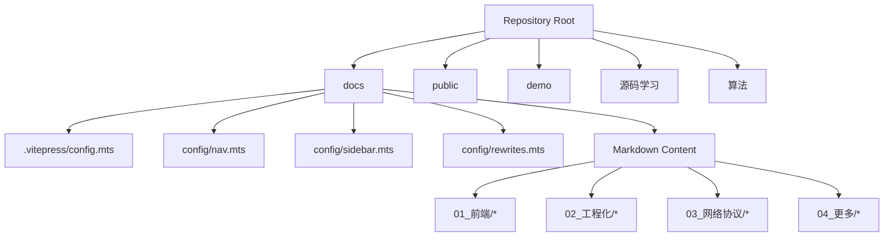
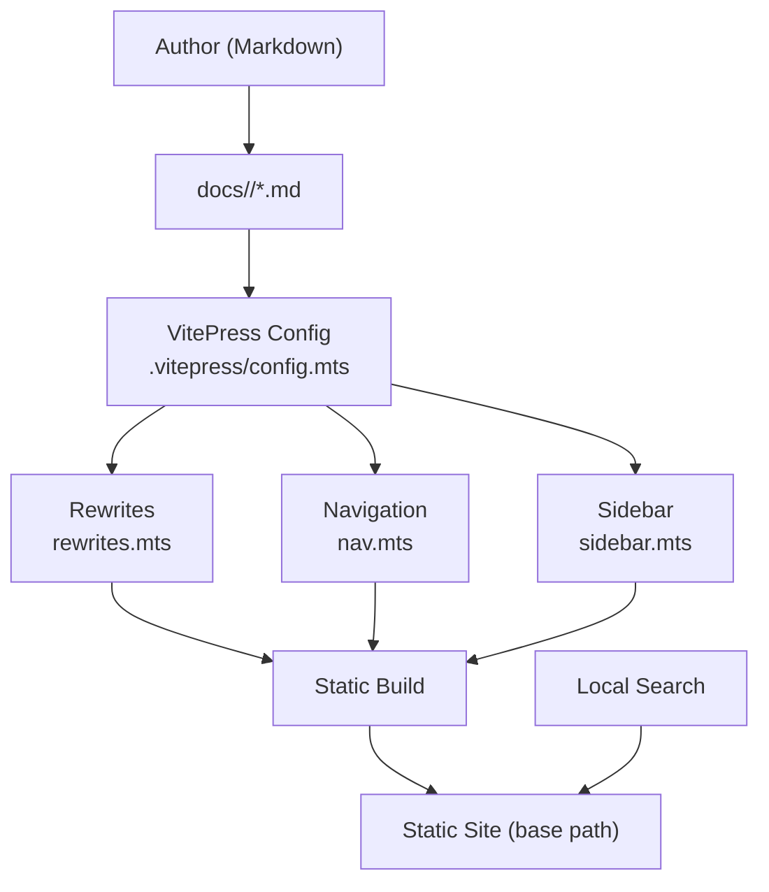
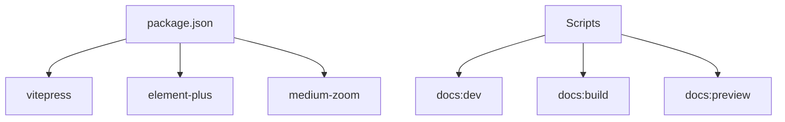

# Project Overview

<cite>
**Referenced Files in This Document**
- [README.md](file://README.md)
- [package.json](file://package.json)
- [docs/index.md](file://docs/index.md)
- [docs/.vitepress/config.mts](file://docs/.vitepress/config.mts)
- [docs/.vitepress/config/nav.mts](file://docs/.vitepress/config/nav.mts)
- [docs/.vitepress/config/sidebar.mts](file://docs/.vitepress/config/sidebar.mts)
- [docs/.vitepress/config/rewrites.mts](file://docs/.vitepress/config/rewrites.mts)
- [docs/01_前端/01_html/01_index.md](file://docs/01_前端/01_html/01_index.md)
- [docs/03_网络协议/01_http/01_index.md](file://docs/03_网络协议/01_http/01_index.md)
- [docs/04_更多/04_算法/01_index.md](file://docs/04_更多/04_算法/01_index.md)
</cite>

## Table of Contents
1. [Introduction](#introduction)
2. [Project Structure](#project-structure)
3. [Core Components](#core-components)
4. [Architecture Overview](#architecture-overview)
5. [Detailed Component Analysis](#detailed-component-analysis)
6. [Dependency Analysis](#dependency-analysis)
7. [Performance Considerations](#performance-considerations)
8. [Troubleshooting Guide](#troubleshooting-guide)
9. [Conclusion](#conclusion)

## Introduction
This project is a personal learning knowledge base built with VitePress. Its purpose is to serve as a centralized, navigable repository for technical learning materials spanning frontend fundamentals, engineering tooling, network protocols, algorithms, and source code analysis. It leverages VitePress to render Markdown content into a fast, SEO-friendly static site with a modern theme, local search, and a structured navigation system.

The knowledge base organizes content into thematic categories (e.g., HTML/CSS/JS/browser basics, engineering tooling like Babel/Vite/npm, network protocols such as HTTP/HTTPS/HTTP2/TCP, and broader topics like Node.js, developer tools, TypeScript, Git, and algorithms). It also maintains a dedicated section for source code analysis of popular libraries and frameworks.

## Project Structure
At a high level, the repository is organized as follows:
- docs: Contains the VitePress site source, including Markdown content, theme configuration, and navigation/sidebar definitions.
- docs/.vitepress: Houses VitePress configuration modules (site config, navigation, sidebar, and rewrite rules).
- docs/<category>: Markdown content grouped by domain (e.g., 01_前端, 02_工程化, 03_网络协议, 04_更多).
- public: Static assets referenced by Markdown pages (images, videos, etc.).
- demo: Example projects demonstrating frontend and backend concepts.
- 源码学习: Source code analysis of libraries and frameworks (axios, vite, vue, webpack, etc.).
- 算法: Algorithm practice files and solutions.

**Diagram sources**
- [docs/.vitepress/config.mts:1-92](file://docs/.vitepress/config.mts#L1-L92)
- [docs/.vitepress/config/nav.mts:1-96](file://docs/.vitepress/config/nav.mts#L1-L96)
- [docs/.vitepress/config/sidebar.mts:1-800](file://docs/.vitepress/config/sidebar.mts#L1-L800)
- [docs/.vitepress/config/rewrites.mts:1-271](file://docs/.vitepress/config/rewrites.mts#L1-L271)

**Section sources**
- [README.md:1-4](file://README.md#L1-L4)
- [package.json:1-24](file://package.json#L1-L24)

## Core Components
- Site configuration: Defines site metadata, base path, markdown behavior, theme configuration, and search options.
- Navigation: Hierarchical top-level navigation grouping related topics (e.g., Frontend, Engineering, Network Protocols, More).
- Sidebar: Per-category sidebar structure that maps content sections to readable URLs.
- Rewrites: Maps legacy or folder-based Markdown paths to canonical VitePress routes.
- Home page: A themed landing page with feature cards linking to major knowledge areas.

Key configuration highlights:
- Base path configured for deployment under a subpath.
- Local search enabled with localized UI labels.
- Theme features include last updated timestamps, outline navigation, and a custom 404 page.
- Rewrites ensure backward compatibility and clean routing.

**Section sources**
- [docs/.vitepress/config.mts:1-92](file://docs/.vitepress/config.mts#L1-L92)
- [docs/.vitepress/config/nav.mts:1-96](file://docs/.vitepress/config/nav.mts#L1-L96)
- [docs/.vitepress/config/sidebar.mts:1-800](file://docs/.vitepress/config/sidebar.mts#L1-L800)
- [docs/.vitepress/config/rewrites.mts:1-271](file://docs/.vitepress/config/rewrites.mts#L1-L271)
- [docs/index.md:1-49](file://docs/index.md#L1-L49)

## Architecture Overview
The knowledge base architecture centers on VitePress as the static site generator. The runtime flow is:
- Authoring: Write Markdown content in category folders.
- Build: VitePress reads site config, applies rewrites, and generates static assets.
- Serving: The generated site is served from the configured base path with theme and search features.

**Diagram sources**
- [docs/.vitepress/config.mts:1-92](file://docs/.vitepress/config.mts#L1-L92)
- [docs/.vitepress/config/nav.mts:1-96](file://docs/.vitepress/config/nav.mts#L1-L96)
- [docs/.vitepress/config/sidebar.mts:1-800](file://docs/.vitepress/config/sidebar.mts#L1-L800)
- [docs/.vitepress/config/rewrites.mts:1-271](file://docs/.vitepress/config/rewrites.mts#L1-L271)

## Detailed Component Analysis

### Site Configuration and Theme
The site configuration defines:
- Title and base path for deployment.
- Markdown options (line numbers, image lazy loading, container labels).
- Head metadata (favicon).
- Theme configuration (logo, last updated, doc footer, outline, 404 page).
- Localized search UI.
- Navigation and sidebar injection.

Practical implications:
- The base path ensures proper asset resolution when hosted under a subpath.
- Local search improves discoverability within the knowledge base.
- Theme customization enhances readability and accessibility.

**Section sources**
- [docs/.vitepress/config.mts:1-92](file://docs/.vitepress/config.mts#L1-L92)

### Navigation and Sidebar Organization
Navigation groups content by domain:
- Frontend: HTML, CSS, JavaScript, Browser.
- Engineering: Babel, Sass, ESLint, npm, Prettier, Browserslist, pnpm, Vite.
- Network Protocols: HTTP, HTTPS, HTTP2, TCP.
- More: Node.js, Developer Tools, Regular Expressions, Algorithms, TypeScript, Git.

Sidebar entries per category:
- Each category maps to a structured list of topics with links derived from rewrites.
- Groups are collapsible and organized for progressive learning.

Usage pattern:
- Users navigate via top-level categories, then drill down using sidebar menus.
- Links are designed to be intuitive and consistent across domains.

**Section sources**
- [docs/.vitepress/config/nav.mts:1-96](file://docs/.vitepress/config/nav.mts#L1-L96)
- [docs/.vitepress/config/sidebar.mts:1-800](file://docs/.vitepress/config/sidebar.mts#L1-L800)

### Rewrites and Routing
Rewrites translate legacy or folder-based Markdown paths into canonical VitePress routes. Examples:
- Legacy path mapping for HTML, CSS, JS, browser, engineering, network protocol, Node.js, developer tools, regular expressions, algorithms, TypeScript, and Git topics.
- Ensures URLs remain stable even if internal file organization changes.

Benefits:
- Backward compatibility for existing links.
- Clean, semantic URLs aligned with navigation structure.

**Section sources**
- [docs/.vitepress/config/rewrites.mts:1-271](file://docs/.vitepress/config/rewrites.mts#L1-L271)

### Home Page and Feature Cards
The home page presents:
- Hero section with tagline and actions.
- Feature cards linking to major knowledge areas (Technical Notes, Source Code Analysis, Algorithm Practice, Network Protocols, Engineering Practices, More Content).

This provides a quick entry point for users to explore different domains.

**Section sources**
- [docs/index.md:1-49](file://docs/index.md#L1-L49)

### Knowledge Domains and Content Scope
- Frontend development: HTML/CSS/JS fundamentals, DOM APIs, browser rendering, and security.
- Backend concepts: Node.js modules, streams, events, and web APIs.
- Network protocols: HTTP/HTTPS/TCP and HTTP/2 internals.
- Algorithms: Data structures, dynamic programming, graph theory, and problem-solving patterns.
- Source code analysis: In-depth exploration of libraries and frameworks (axios, vite, vue, webpack, etc.).

Examples of representative content:
- HTML overview and structure.
- HTTP history, features, and message format.
- Algorithms including prefix sums, reservoir sampling, and difference arrays.

**Section sources**
- [docs/01_前端/01_html/01_index.md:1-8](file://docs/01_前端/01_html/01_index.md#L1-L8)
- [docs/03_网络协议/01_http/01_index.md:1-125](file://docs/03_网络协议/01_http/01_index.md#L1-L125)
- [docs/04_更多/04_算法/01_index.md:1-178](file://docs/04_更多/04_算法/01_index.md#L1-L178)

## Dependency Analysis
The project’s runtime stack is primarily VitePress-driven, with optional UI enhancements:
- VitePress: Static site generation and theme.
- element-plus: Optional UI components (if used in custom theme).
- medium-zoom: Optional zoom behavior for images.

Build and development scripts:
- docs:dev, docs:build, docs:preview for local development, building, and previewing the site.

**Diagram sources**
- [package.json:1-24](file://package.json#L1-L24)

**Section sources**
- [package.json:1-24](file://package.json#L1-L24)

## Performance Considerations
- Image lazy loading reduces initial payload and improves perceived performance.
- Local search avoids external dependencies and keeps search queries client-side.
- Base path configuration supports efficient CDN and subpath hosting.
- Collapsible sidebar groups reduce navigation overhead for deep topic hierarchies.

[No sources needed since this section provides general guidance]

## Troubleshooting Guide
Common scenarios and resolutions:
- Broken links after refactoring: Verify rewrites in the VitePress configuration to ensure legacy paths still resolve.
- Assets not loading under subpath: Confirm base path configuration matches deployment path.
- Search not working: Ensure local search provider is enabled and UI labels are set in theme config.
- Navigation/sidebar mismatch: Align nav and sidebar entries with the intended content structure.

**Section sources**
- [docs/.vitepress/config.mts:1-92](file://docs/.vitepress/config.mts#L1-L92)
- [docs/.vitepress/config/rewrites.mts:1-271](file://docs/.vitepress/config/rewrites.mts#L1-L271)

## Conclusion
This knowledge base project demonstrates a pragmatic approach to organizing and publishing technical learning materials. By leveraging VitePress, it achieves a balance of simplicity, performance, and usability. The structured navigation, localized search, and content rewrites collectively support both beginner-friendly exploration and advanced reference needs. The scope spans frontend fundamentals, engineering tooling, network protocols, algorithms, and source code analysis—covering a broad range of topics essential for continuous learning and knowledge sharing.