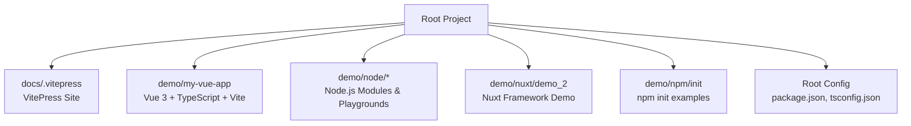
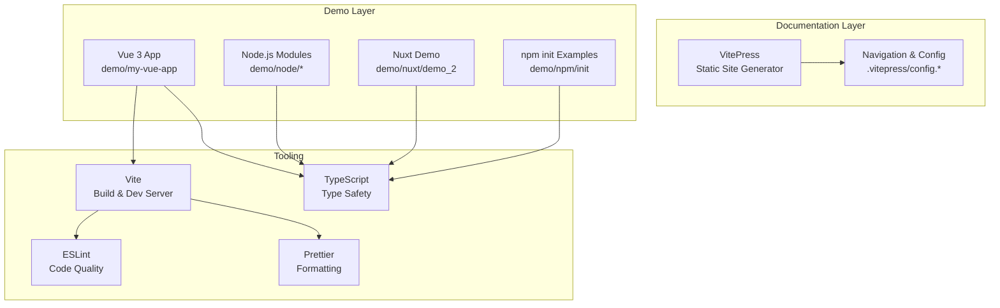
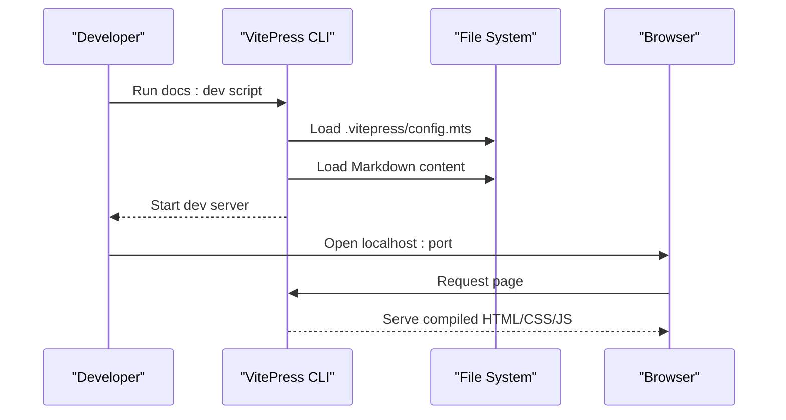
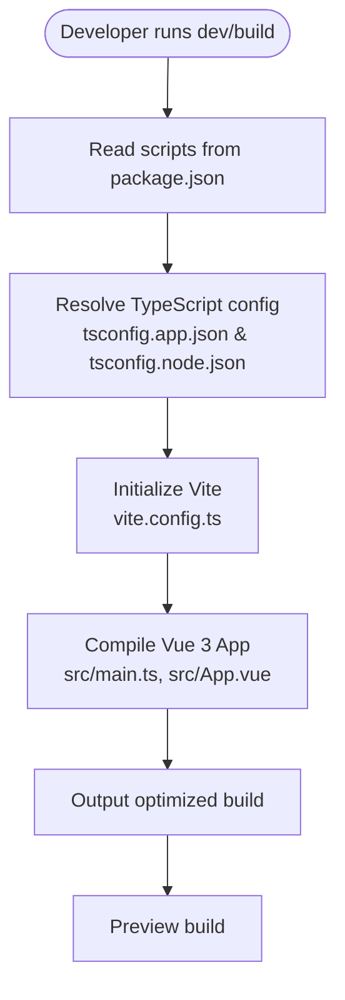
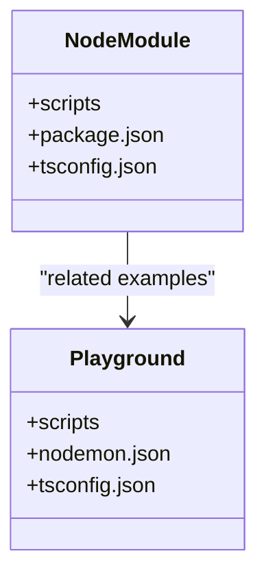
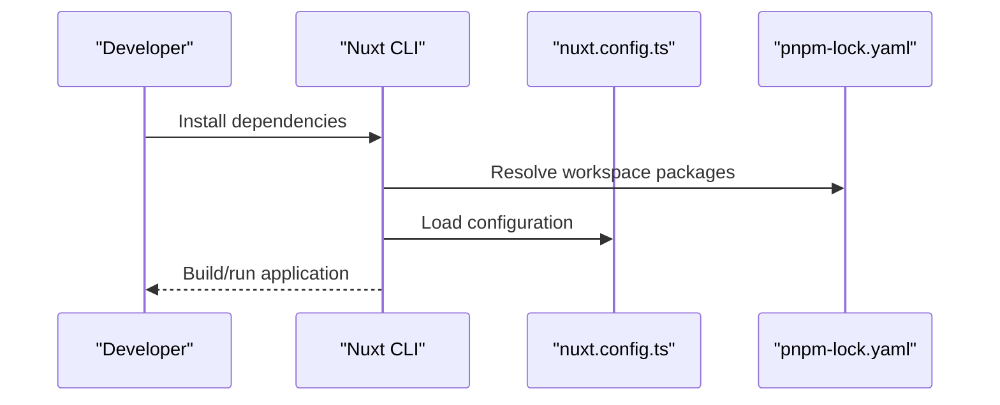

# Technology Stack

<cite>
**Referenced Files in This Document**
- [README.md](file://README.md)
- [package.json](file://package.json)
- [package-lock.json](file://package-lock.json)
- [docs/.vitepress/config.mts](file://docs/.vitepress/config.mts)
- [docs/.vitepress/config/nav.mts](file://docs/.vitepress/config/nav.mts)
- [demo/my-vue-app/package.json](file://demo/my-vue-app/package.json)
- [demo/my-vue-app/tsconfig.app.json](file://demo/my-vue-app/tsconfig.app.json)
- [demo/my-vue-app/tsconfig.node.json](file://demo/my-vue-app/tsconfig.node.json)
- [demo/my-vue-app/vite.config.ts](file://demo/my-vue-app/vite.config.ts)
- [demo/my-vue-app/src/main.ts](file://demo/my-vue-app/src/main.ts)
- [demo/my-vue-app/src/App.vue](file://demo/my-vue-app/src/App.vue)
- [demo/node/01模块/public/test.json](file://demo/node/01模块/public/test.json)
- [demo/nuxt/demo_2/package.json](file://demo/nuxt/demo_2/package.json)
- [demo/npm/init/package.json](file://demo/npm/init/package.json)
- [demo/npm/init/package-lock.json](file://demo/npm/init/package-lock.json)
</cite>

## Table of Contents
1. [Introduction](#introduction)
2. [Project Structure](#project-structure)
3. [Core Technologies](#core-technologies)
4. [Architecture Overview](#architecture-overview)
5. [Detailed Component Analysis](#detailed-component-analysis)
6. [Dependency Management](#dependency-management)
7. [Development Environment Setup](#development-environment-setup)
8. [Version Compatibility and Updates](#version-compatibility-and-updates)
9. [Performance Considerations](#performance-considerations)
10. [Troubleshooting Guide](#troubleshooting-guide)
11. [Conclusion](#conclusion)

## Introduction
This document describes the technology stack used in the wzb knowledge base project. The project leverages VitePress for building a documentation website, Vue 3 for reactive components, TypeScript for type safety, and Node.js modules for demonstration projects. It also integrates Vite for development and optimization, ESLint for code quality, and Prettier for formatting. The document explains the rationale behind technology choices, version compatibility, integration patterns, and provides guidance on dependency updates and maintenance.

## Project Structure
The repository is organized into several key areas:
- docs: Contains the VitePress-powered documentation site under docs/.vitepress
- demo: Houses multiple demonstration projects including Vue apps, Node.js modules, Nuxt demos, and TypeScript samples
- Root-level configuration files manage dependencies and scripts for the entire project

**Section sources**
- [README.md:1-4](file://README.md#L1-L4)
- [package.json](file://package.json)

## Core Technologies
This section outlines the primary technologies powering the knowledge base and related demonstrations.

- VitePress: Static site generator used to build the documentation website. It provides fast development server, optimized builds, and Markdown-centric authoring.
- Vue 3: Reactive framework for building interactive user interfaces and components, used in demonstration applications.
- TypeScript: Adds type safety and improved developer experience across Vue and Node.js projects.
- Node.js: Runtime environment for backend modules and playgrounds, integrated with package managers like npm and pnpm.
- Vite: Build tool and dev server enabling fast development and optimization for frontend projects.
- ESLint: Linter for maintaining code quality and consistency.
- Prettier: Code formatter ensuring consistent style across the codebase.

**Section sources**
- [README.md:1-4](file://README.md#L1-L4)
- [docs/.vitepress/config.mts](file://docs/.vitepress/config.mts)
- [docs/.vitepress/config/nav.mts:18-44](file://docs/.vitepress/config/nav.mts#L18-L44)
- [demo/my-vue-app/package.json:11-17](file://demo/my-vue-app/package.json#L11-L17)
- [demo/node/01模块/public/test.json:9,12-14](file://demo/node/01模块/public/test.json#L9,L12-L14)

## Architecture Overview
The knowledge base architecture centers around VitePress for content delivery and Vue 3 for interactive demonstrations. Node.js modules provide practical examples and playgrounds. The build pipeline integrates Vite for development and production builds, with TypeScript ensuring type safety.

**Diagram sources**
- [docs/.vitepress/config.mts](file://docs/.vitepress/config.mts)
- [docs/.vitepress/config/nav.mts:18-44](file://docs/.vitepress/config/nav.mts#L18-L44)
- [demo/my-vue-app/package.json:6-8](file://demo/my-vue-app/package.json#L6-L8)
- [demo/my-vue-app/package.json:11-17](file://demo/my-vue-app/package.json#L11-L17)
- [demo/node/01模块/public/test.json:9,12-14](file://demo/node/01模块/public/test.json#L9,L12-L14)

## Detailed Component Analysis

### VitePress Documentation Site
VitePress serves as the documentation platform, configured via .vitepress/config.mts and navigation entries in .vitepress/config/nav.mts. It supports Markdown-based content, theme customization, and built-in search capabilities.

**Diagram sources**
- [docs/.vitepress/config.mts](file://docs/.vitepress/config.mts)
- [docs/.vitepress/config/nav.mts:18-44](file://docs/.vitepress/config/nav.mts#L18-L44)

**Section sources**
- [README.md:1-4](file://README.md#L1-L4)
- [docs/.vitepress/config.mts](file://docs/.vitepress/config.mts)
- [docs/.vitepress/config/nav.mts:18-44](file://docs/.vitepress/config/nav.mts#L18-L44)

### Vue 3 + TypeScript + Vite Demo Application
The demo/my-vue-app showcases Vue 3 with TypeScript and Vite. Scripts for development, build, and preview are defined in package.json, while tsconfig files configure TypeScript compilation for app and node contexts.

**Diagram sources**
- [demo/my-vue-app/package.json:6-8](file://demo/my-vue-app/package.json#L6-L8)
- [demo/my-vue-app/tsconfig.app.json:22](file://demo/my-vue-app/tsconfig.app.json#L22)
- [demo/my-vue-app/tsconfig.node.json:20](file://demo/my-vue-app/tsconfig.node.json#L20)
- [demo/my-vue-app/vite.config.ts](file://demo/my-vue-app/vite.config.ts)
- [demo/my-vue-app/src/main.ts](file://demo/my-vue-app/src/main.ts)
- [demo/my-vue-app/src/App.vue](file://demo/my-vue-app/src/App.vue)

**Section sources**
- [demo/my-vue-app/package.json:6-8](file://demo/my-vue-app/package.json#L6-L8)
- [demo/my-vue-app/package.json:11-17](file://demo/my-vue-app/package.json#L11-L17)
- [demo/my-vue-app/tsconfig.app.json:22](file://demo/my-vue-app/tsconfig.app.json#L22)
- [demo/my-vue-app/tsconfig.node.json:20](file://demo/my-vue-app/tsconfig.node.json#L20)
- [demo/my-vue-app/vite.config.ts](file://demo/my-vue-app/vite.config.ts)
- [demo/my-vue-app/src/main.ts](file://demo/my-vue-app/src/main.ts)
- [demo/my-vue-app/src/App.vue](file://demo/my-vue-app/src/App.vue)

### Node.js Modules and Playgrounds
Node.js demonstrations include module examples and interactive playgrounds. These projects demonstrate Node.js features and integrate with TypeScript for type safety. Scripts for development and documentation builds are present in package.json files.

**Diagram sources**
- [demo/node/01模块/public/test.json:9,12-14](file://demo/node/01模块/public/test.json#L9,L12-L14)
- [demo/node/02_playground/package.json](file://demo/node/02_playground/package.json)

**Section sources**
- [demo/node/01模块/public/test.json:9,12-14](file://demo/node/01模块/public/test.json#L9,L12-L14)
- [demo/node/02_playground/package.json](file://demo/node/02_playground/package.json)

### Nuxt Framework Demo
The demo/nuxt/demo_2 project demonstrates Nuxt usage with TypeScript and modern tooling. It includes configuration files and workspace settings for managing dependencies.

**Diagram sources**
- [demo/nuxt/demo_2/package.json](file://demo/nuxt/demo_2/package.json)
- [demo/nuxt/demo_2/nuxt.config.ts](file://demo/nuxt/demo_2/nuxt.config.ts)

**Section sources**
- [demo/nuxt/demo_2/package.json](file://demo/nuxt/demo_2/package.json)
- [demo/nuxt/demo_2/nuxt.config.ts](file://demo/nuxt/demo_2/nuxt.config.ts)

### npm init Examples
The demo/npm/init directory contains examples of initializing npm packages, demonstrating package.json structure and lock file behavior.

**Section sources**
- [demo/npm/init/package.json](file://demo/npm/init/package.json)
- [demo/npm/init/package-lock.json:11](file://demo/npm/init/package-lock.json#L11)

## Dependency Management
The project uses npm/pnpm for dependency management across multiple demo projects. Root-level configuration coordinates shared dependencies, while individual demo projects maintain their own package.json files.

Key aspects:
- Root package.json defines top-level scripts and dependencies
- demo/my-vue-app uses Vite, Vue 3, TypeScript, and vue-tsc
- demo/node/01模块 integrates VitePress for documentation builds
- demo/nuxt/demo_2 uses pnpm workspaces and TypeScript
- demo/npm/init demonstrates npm init behavior and lock files

**Section sources**
- [package.json](file://package.json)
- [demo/my-vue-app/package.json:6-8](file://demo/my-vue-app/package.json#L6-L8)
- [demo/my-vue-app/package.json:11-17](file://demo/my-vue-app/package.json#L11-L17)
- [demo/node/01模块/public/test.json:9,12-14](file://demo/node/01模块/public/test.json#L9,L12-L14)
- [demo/nuxt/demo_2/package.json](file://demo/nuxt/demo_2/package.json)
- [demo/npm/init/package.json](file://demo/npm/init/package.json)

## Development Environment Setup
To set up the development environment:
1. Install Node.js and a package manager (npm or pnpm)
2. Clone the repository and install root dependencies
3. Navigate to specific demo directories to run their respective development servers
4. Use VitePress commands for documentation site development and builds

Recommended commands:
- Root: Install dependencies and run documentation site
- demo/my-vue-app: Use dev, build, and preview scripts
- demo/node/01模块: Use docs:dev, docs:build, docs:preview scripts
- demo/nuxt/demo_2: Use pnpm workspace commands

**Section sources**
- [README.md:1-4](file://README.md#L1-L4)
- [demo/my-vue-app/package.json:6-8](file://demo/my-vue-app/package.json#L6-L8)
- [demo/node/01模块/public/test.json:12-14](file://demo/node/01模块/public/test.json#L12-L14)

## Version Compatibility and Updates
Version compatibility is managed through:
- Peer dependencies for TypeScript with Vue
- Lock files ensuring reproducible installs
- Workspace configurations for monorepo-style setups

Guidelines:
- Keep Vue 3 and related @vue packages aligned
- Align TypeScript versions across projects
- Update VitePress and Vite together for compatibility
- Use lock files to prevent unexpected version drift

Evidence of current versions:
- Vue 3.5.25 in root dependencies
- VitePress 1.1.0 in demo/node/01模块
- TypeScript versions across demo projects ranging from 5.5.x to 5.9.x

**Section sources**
- [package-lock.json:2901-2921](file://package-lock.json#L2901-L2921)
- [demo/node/01模块/public/test.json:9](file://demo/node/01模块/public/test.json#L9)
- [demo/my-vue-app/package.json:11-17](file://demo/my-vue-app/package.json#L11-L17)
- [demo/node/01模块/public/test.json:12-14](file://demo/node/01模块/public/test.json#L12-L14)

## Performance Considerations
- Use Vite for fast development builds and optimized production bundles
- Enable tree-shaking and modern bundling features
- Configure TypeScript compilation targets appropriately for browser support
- Leverage VitePress optimizations for static site generation

## Troubleshooting Guide
Common issues and resolutions:
- Version conflicts: Align peer dependencies and update lock files
- Build errors: Verify TypeScript configurations and plugin compatibility
- Dev server issues: Clear node_modules and reinstall dependencies
- Navigation problems: Check VitePress config and navigation entries

**Section sources**
- [docs/.vitepress/config.mts](file://docs/.vitepress/config.mts)
- [docs/.vitepress/config/nav.mts:18-44](file://docs/.vitepress/config/nav.mts#L18-L44)
- [demo/my-vue-app/tsconfig.app.json:22](file://demo/my-vue-app/tsconfig.app.json#L22)
- [demo/my-vue-app/tsconfig.node.json:20](file://demo/my-vue-app/tsconfig.node.json#L20)

## Conclusion
The wzb knowledge base project combines VitePress for documentation, Vue 3 for interactive demos, TypeScript for type safety, and Node.js modules for practical examples. The toolchain integrates Vite, ESLint, and Prettier to ensure a robust development experience. By following the outlined setup and compatibility guidelines, contributors can maintain a consistent and efficient development environment across all demo projects.