# Axios HTTP Client

<cite>
**Referenced Files in This Document**
- [index.js](file://源码学习/axios@0.21.1/index.js)
- [axios.js](file://源码学习/axios@0.21.1/lib/axios.js)
- [defaults.js](file://源码学习/axios@0.21.1/lib/defaults.js)
- [utils.js](file://源码学习/axios@0.21.1/lib/utils.js)
- [adapters/http.js](file://源码学习/axios@0.21.1/lib/adapters/http.js)
- [adapters/xhr.js](file://源码学习/axios@0.21.1/lib/adapters/xhr.js)
- [core/dispatchRequest.js](file://源码学习/axios@0.21.1/lib/core/dispatchRequest.js)
- [core/buildFullPath.js](file://源码学习/axios@0.21.1/lib/core/buildFullPath.js)
- [core/mergeConfig.js](file://源码学习/axios@0.21.1/lib/core/mergeConfig.js)
- [core/Axios.js](file://源码学习/axios@0.21.1/lib/core/Axios.js)
- [core/InterceptorManager.js](file://源码学习/axios@0.21.1/lib/core/InterceptorManager.js)
- [core/transformData.js](file://源码学习/axios@0.21.1/lib/core/transformData.js)
- [helpers/cookies.js](file://源码学习/axios@0.21.1/lib/helpers/cookies.js)
- [helpers/isAbsoluteURL.js](file://源码学习/axios@0.21.1/lib/helpers/isAbsoluteURL.js)
- [helpers/normalizeHeaderName.js](file://源码学习/axios@0.21.1/lib/helpers/normalizeHeaderName.js)
- [helpers/parseProtocol.js](file://源码学习/axios@0.21.1/lib/helpers/parseProtocol.js)
- [helpers/combineURLs.js](file://源码学习/axios@0.21.1/lib/helpers/combineURLs.js)
- [helpers/validator.js](file://源码学习/axios@0.21.1/lib/helpers/validator.js)
- [cancel/Cancel.js](file://源码学习/axios@0.21.1/lib/cancel/Cancel.js)
- [cancel/CancelToken.js](file://源码学习/axios@0.21.1/lib/cancel/CancelToken.js)
- [cancel/isCancel.js](file://源码学习/axios@0.21.1/lib/cancel/isCancel.js)
</cite>

## Table of Contents
1. [Introduction](#introduction)
2. [Project Structure](#project-structure)
3. [Core Components](#core-components)
4. [Architecture Overview](#architecture-overview)
5. [Detailed Component Analysis](#detailed-component-analysis)
6. [Dependency Analysis](#dependency-analysis)
7. [Performance Considerations](#performance-considerations)
8. [Troubleshooting Guide](#troubleshooting-guide)
9. [Conclusion](#conclusion)
10. [Appendices](#appendices)

## Introduction
This document presents a comprehensive analysis of the Axios HTTP client source code, focusing on the adapter pattern, interceptor chain, promise-based API design, and core request lifecycle. It explains configuration merging, request/response transformations, error handling, timeout and cancellation mechanisms, and how the XHR and Node.js adapters operate. Architectural patterns such as factory functions, prototype-based composition, and module encapsulation are highlighted, along with practical extension examples and performance/memory considerations.

## Project Structure
Axios is organized around a small set of cohesive modules:
- Entry and factory: index.js and lib/axios.js expose the public API and create instances.
- Defaults and utilities: defaults.js and utils.js centralize default configurations and shared helpers.
- Adapters: adapters/xhr.js and adapters/http.js implement transport-specific logic for browsers and Node.js.
- Core: Axios class, dispatch pipeline, configuration merging, interceptors, and data transformers.
- Helpers: URL parsing, header normalization, cookie handling, validators, and path building.
- Cancel: cancellation primitives and token-based cancellation.

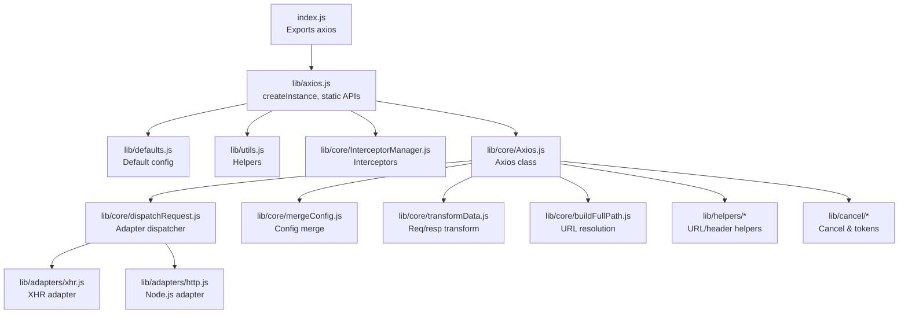

**Diagram sources**
- [index.js:1-3](file://源码学习/axios@0.21.1/index.js#L1-L3)
- [axios.js:1-60](file://源码学习/axios@0.21.1/lib/axios.js#L1-L60)
- [defaults.js:1-200](file://源码学习/axios@0.21.1/lib/defaults.js#L1-L200)
- [utils.js:1-200](file://源码学习/axios@0.21.1/lib/utils.js#L1-L200)
- [adapters/xhr.js:1-200](file://源码学习/axios@0.21.1/lib/adapters/xhr.js#L1-L200)
- [adapters/http.js:1-120](file://源码学习/axios@0.21.1/lib/adapters/http.js#L1-L120)
- [core/dispatchRequest.js:1-120](file://源码学习/axios@0.21.1/lib/core/dispatchRequest.js#L1-L120)
- [core/Axios.js:1-120](file://源码学习/axios@0.21.1/lib/core/Axios.js#L1-L120)
- [core/mergeConfig.js:1-120](file://源码学习/axios@0.21.1/lib/core/mergeConfig.js#L1-L120)
- [core/transformData.js:1-120](file://源码学习/axios@0.21.1/lib/core/transformData.js#L1-L120)
- [core/buildFullPath.js:1-120](file://源码学习/axios@0.21.1/lib/core/buildFullPath.js#L1-L120)
- [helpers/combineURLs.js:1-120](file://源码学习/axios@0.21.1/lib/helpers/combineURLs.js#L1-L120)
- [helpers/normalizeHeaderName.js:1-120](file://源码学习/axios@0.21.1/lib/helpers/normalizeHeaderName.js#L1-L120)
- [helpers/isAbsoluteURL.js:1-120](file://源码学习/axios@0.21.1/lib/helpers/isAbsoluteURL.js#L1-L120)
- [helpers/parseProtocol.js:1-120](file://源码学习/axios@0.21.1/lib/helpers/parseProtocol.js#L1-L120)
- [helpers/cookies.js:1-120](file://源码学习/axios@0.21.1/lib/helpers/cookies.js#L1-L120)
- [helpers/validator.js:1-120](file://源码学习/axios@0.21.1/lib/helpers/validator.js#L1-L120)
- [cancel/Cancel.js:1-120](file://源码学习/axios@0.21.1/lib/cancel/Cancel.js#L1-L120)
- [cancel/CancelToken.js:1-120](file://源码学习/axios@0.21.1/lib/cancel/CancelToken.js#L1-L120)
- [cancel/isCancel.js:1-120](file://源码学习/axios@0.21.1/lib/cancel/isCancel.js#L1-L120)

**Section sources**
- [index.js:1-3](file://源码学习/axios@0.21.1/index.js#L1-L3)
- [axios.js:1-60](file://源码学习/axios@0.21.1/lib/axios.js#L1-L60)

## Core Components
- Factory and instance creation: The public API is a factory that creates Axios instances with merged defaults.
- Axios class: Encapsulates the request lifecycle, interceptor chains, and adapter dispatch.
- Interceptor manager: Provides registration and invocation of request/response/error handlers.
- Configuration merging: Deep merges user config with defaults and per-instance overrides.
- Data transformers: Applies request and response transformations consistently.
- Adapters: Transport abstraction for browser XHR and Node.js HTTP.
- Cancel and tokens: Cancellation primitives and token-based abort signaling.

**Section sources**
- [axios.js:1-60](file://源码学习/axios@0.21.1/lib/axios.js#L1-L60)
- [core/Axios.js:1-120](file://源码学习/axios@0.21.1/lib/core/Axios.js#L1-L120)
- [core/InterceptorManager.js:1-120](file://源码学习/axios@0.21.1/lib/core/InterceptorManager.js#L1-L120)
- [core/mergeConfig.js:1-120](file://源码学习/axios@0.21.1/lib/core/mergeConfig.js#L1-L120)
- [core/transformData.js:1-120](file://源码学习/axios@0.21.1/lib/core/transformData.js#L1-L120)

## Architecture Overview
Axios follows a layered architecture:
- Public API layer: Factory and static methods.
- Core layer: Axios class orchestrating interceptors and dispatch.
- Adapter layer: Pluggable transports for XHR and Node.js.
- Utilities and helpers: Shared logic for URLs, headers, cookies, and validation.

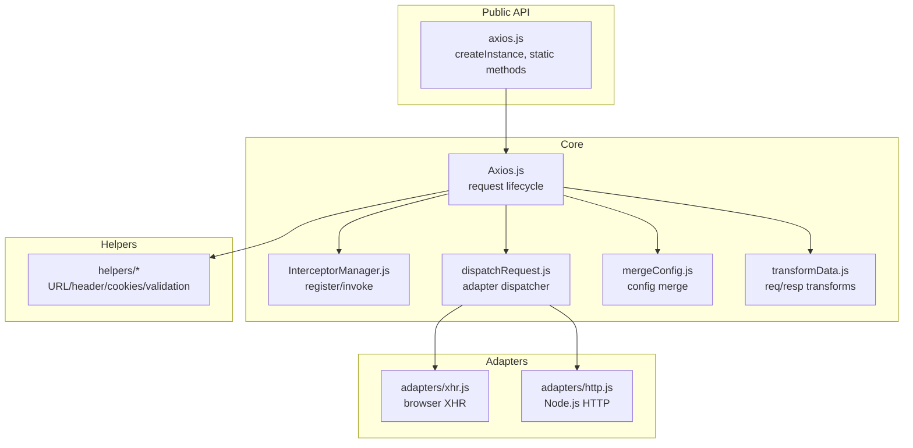

**Diagram sources**
- [axios.js:1-60](file://源码学习/axios@0.21.1/lib/axios.js#L1-L60)
- [core/Axios.js:1-120](file://源码学习/axios@0.21.1/lib/core/Axios.js#L1-L120)
- [core/InterceptorManager.js:1-120](file://源码学习/axios@0.21.1/lib/core/InterceptorManager.js#L1-L120)
- [core/dispatchRequest.js:1-120](file://源码学习/axios@0.21.1/lib/core/dispatchRequest.js#L1-L120)
- [core/mergeConfig.js:1-120](file://源码学习/axios@0.21.1/lib/core/mergeConfig.js#L1-L120)
- [core/transformData.js:1-120](file://源码学习/axios@0.21.1/lib/core/transformData.js#L1-L120)
- [adapters/xhr.js:1-200](file://源码学习/axios@0.21.1/lib/adapters/xhr.js#L1-L200)
- [adapters/http.js:1-120](file://源码学习/axios@0.21.1/lib/adapters/http.js#L1-L120)
- [helpers/combineURLs.js:1-120](file://源码学习/axios@0.21.1/lib/helpers/combineURLs.js#L1-L120)
- [helpers/normalizeHeaderName.js:1-120](file://源码学习/axios@0.21.1/lib/helpers/normalizeHeaderName.js#L1-L120)
- [helpers/cookies.js:1-120](file://源码学习/axios@0.21.1/lib/helpers/cookies.js#L1-L120)
- [helpers/validator.js:1-120](file://源码学习/axios@0.21.1/lib/helpers/validator.js#L1-L120)

## Detailed Component Analysis

### Adapter Pattern Implementation
Axios uses an adapter pattern to abstract transport concerns:
- Browser XHR adapter: Implements request via XMLHttpRequest, handling readyState changes, timeouts, and cancellation.
- Node.js HTTP adapter: Uses the http module, setting headers, managing streams, and handling timeouts and cancellation.

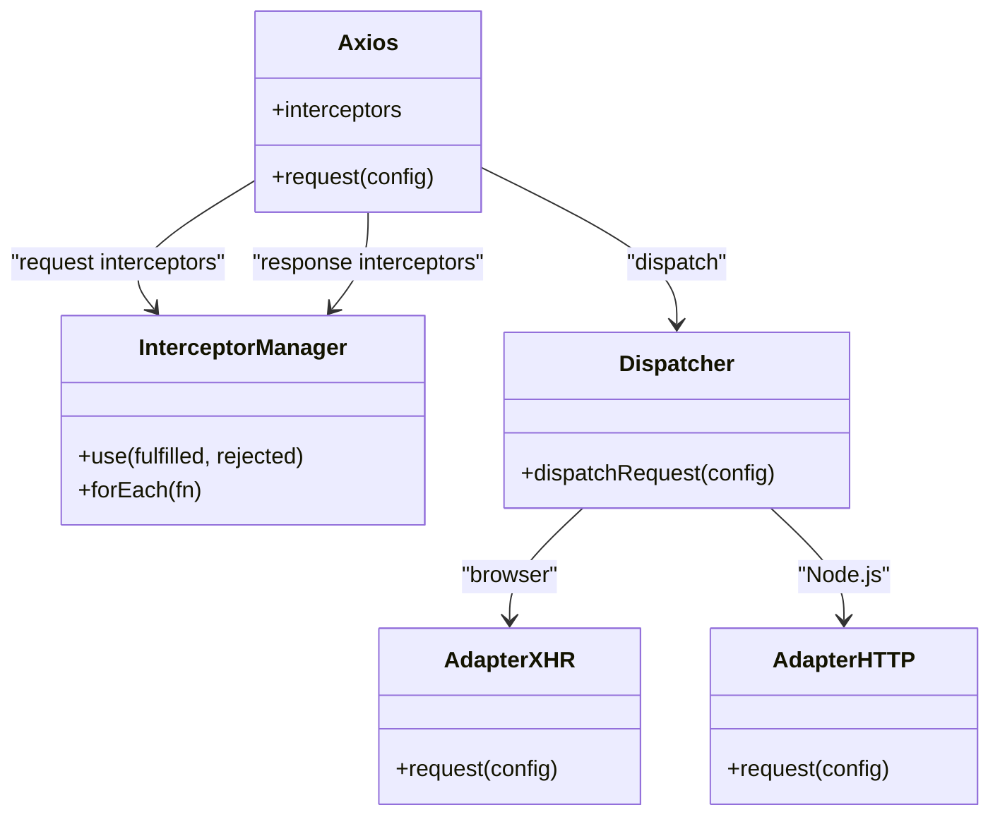

**Diagram sources**
- [core/Axios.js:1-120](file://源码学习/axios@0.21.1/lib/core/Axios.js#L1-L120)
- [core/InterceptorManager.js:1-120](file://源码学习/axios@0.21.1/lib/core/InterceptorManager.js#L1-L120)
- [core/dispatchRequest.js:1-120](file://源码学习/axios@0.21.1/lib/core/dispatchRequest.js#L1-L120)
- [adapters/xhr.js:1-200](file://源码学习/axios@0.21.1/lib/adapters/xhr.js#L1-L200)
- [adapters/http.js:1-120](file://源码学习/axios@0.21.1/lib/adapters/http.js#L1-L120)

**Section sources**
- [adapters/xhr.js:1-200](file://源码学习/axios@0.21.1/lib/adapters/xhr.js#L1-L200)
- [adapters/http.js:1-120](file://源码学习/axios@0.21.1/lib/adapters/http.js#L1-L120)
- [core/dispatchRequest.js:1-120](file://源码学习/axios@0.21.1/lib/core/dispatchRequest.js#L1-L120)

### Request/Response Interceptor Chain
Axios maintains two interceptor chains:
- Request chain: Applied in order before dispatch; can transform config or reject with an error.
- Response chain: Applied after adapter completes; can transform response or propagate errors.

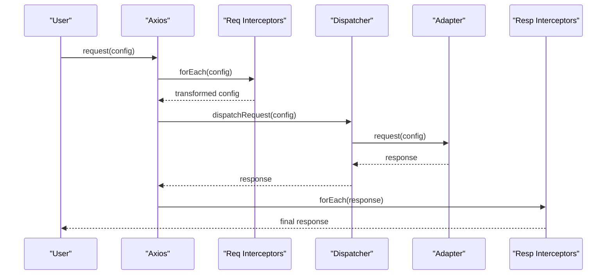

**Diagram sources**
- [core/Axios.js:1-120](file://源码学习/axios@0.21.1/lib/core/Axios.js#L1-L120)
- [core/InterceptorManager.js:1-120](file://源码学习/axios@0.21.1/lib/core/InterceptorManager.js#L1-L120)
- [core/dispatchRequest.js:1-120](file://源码学习/axios@0.21.1/lib/core/dispatchRequest.js#L1-L120)

**Section sources**
- [core/InterceptorManager.js:1-120](file://源码学习/axios@0.21.1/lib/core/InterceptorManager.js#L1-L120)
- [core/Axios.js:1-120](file://源码学习/axios@0.21.1/lib/core/Axios.js#L1-L120)

### Promise-Based API Design
Axios returns promises for all requests. The request method delegates to the adapter and resolves/rejects based on adapter outcomes. Interceptors can transform the promise chain by returning new values or throwing errors.

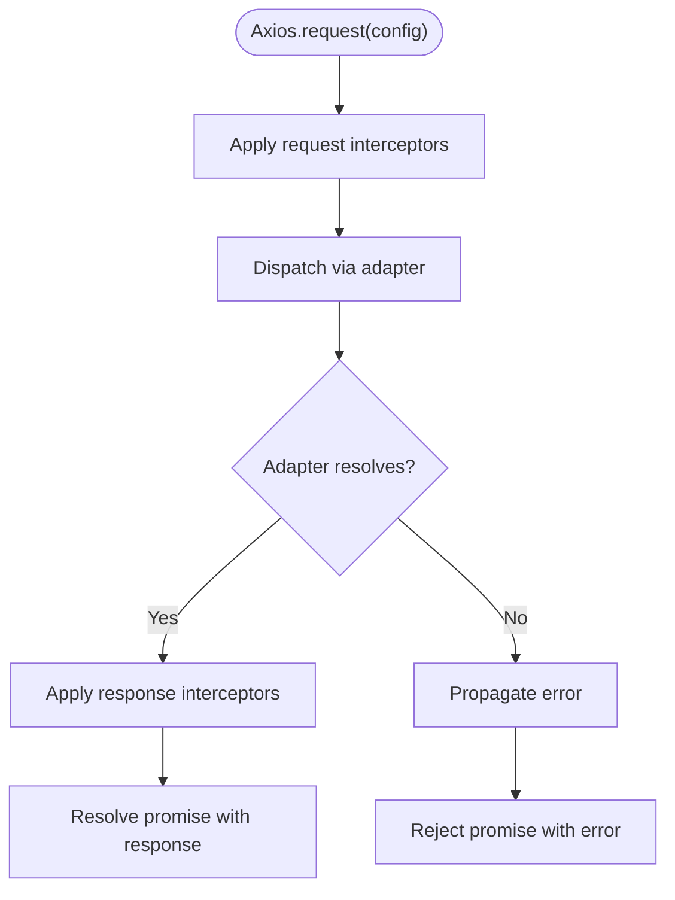

**Diagram sources**
- [core/Axios.js:1-120](file://源码学习/axios@0.21.1/lib/core/Axios.js#L1-L120)
- [core/dispatchRequest.js:1-120](file://源码学习/axios@0.21.1/lib/core/dispatchRequest.js#L1-L120)

**Section sources**
- [core/Axios.js:1-120](file://源码学习/axios@0.21.1/lib/core/Axios.js#L1-L120)

### Core Request Flow
The request flow integrates configuration merging, interceptors, adapter dispatch, and response normalization.

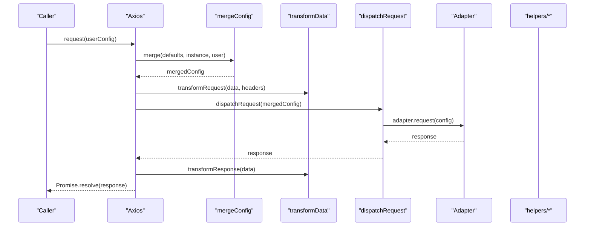

**Diagram sources**
- [core/Axios.js:1-120](file://源码学习/axios@0.21.1/lib/core/Axios.js#L1-L120)
- [core/mergeConfig.js:1-120](file://源码学习/axios@0.21.1/lib/core/mergeConfig.js#L1-L120)
- [core/transformData.js:1-120](file://源码学习/axios@0.21.1/lib/core/transformData.js#L1-L120)
- [core/dispatchRequest.js:1-120](file://源码学习/axios@0.21.1/lib/core/dispatchRequest.js#L1-L120)
- [helpers/combineURLs.js:1-120](file://源码学习/axios@0.21.1/lib/helpers/combineURLs.js#L1-L120)
- [helpers/normalizeHeaderName.js:1-120](file://源码学习/axios@0.21.1/lib/helpers/normalizeHeaderName.js#L1-L120)

**Section sources**
- [core/Axios.js:1-120](file://源码学习/axios@0.21.1/lib/core/Axios.js#L1-L120)
- [core/mergeConfig.js:1-120](file://源码学习/axios@0.21.1/lib/core/mergeConfig.js#L1-L120)
- [core/transformData.js:1-120](file://源码学习/axios@0.21.1/lib/core/transformData.js#L1-L120)
- [core/dispatchRequest.js:1-120](file://源码学习/axios@0.21.1/lib/core/dispatchRequest.js#L1-L120)

### Configuration Merging Strategy
Merging combines defaults, instance-level, and request-level configurations. Axios ensures deep merges for nested objects and preserves arrays appropriately.

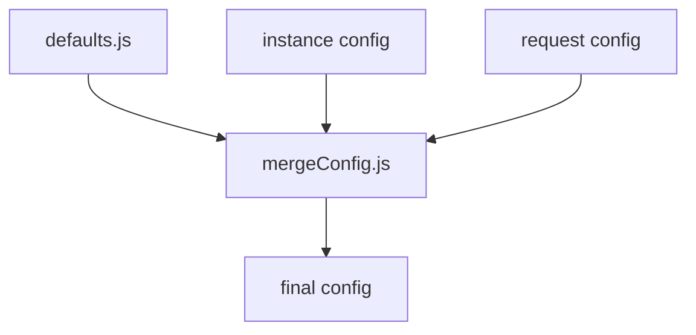

**Diagram sources**
- [defaults.js:1-200](file://源码学习/axios@0.21.1/lib/defaults.js#L1-L200)
- [core/mergeConfig.js:1-120](file://源码学习/axios@0.21.1/lib/core/mergeConfig.js#L1-L120)

**Section sources**
- [defaults.js:1-200](file://源码学习/axios@0.21.1/lib/defaults.js#L1-L200)
- [core/mergeConfig.js:1-120](file://源码学习/axios@0.21.1/lib/core/mergeConfig.js#L1-L120)

### Error Handling Mechanisms
Errors propagate through interceptors and are normalized. The adapter sets appropriate status codes and messages, while interceptors can transform or handle them.

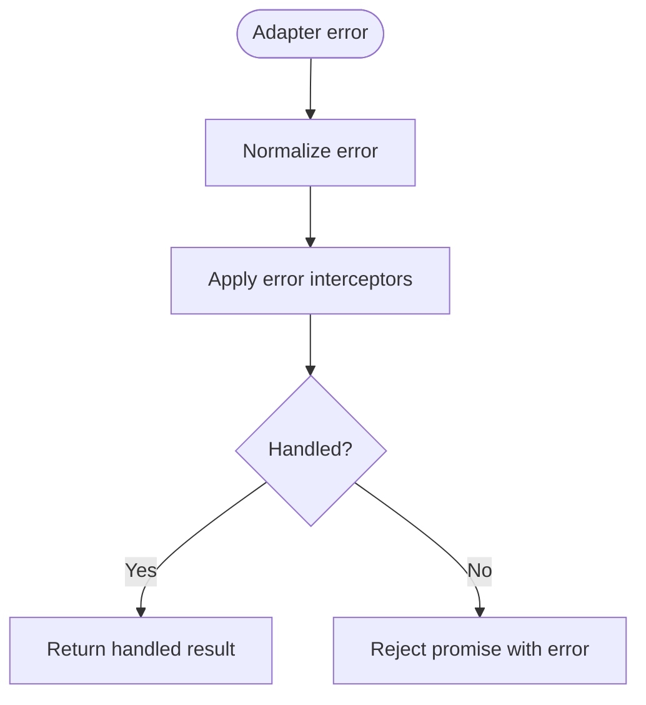

**Diagram sources**
- [core/dispatchRequest.js:1-120](file://源码学习/axios@0.21.1/lib/core/dispatchRequest.js#L1-L120)
- [core/InterceptorManager.js:1-120](file://源码学习/axios@0.21.1/lib/core/InterceptorManager.js#L1-L120)

**Section sources**
- [core/dispatchRequest.js:1-120](file://源码学习/axios@0.21.1/lib/core/dispatchRequest.js#L1-L120)
- [core/InterceptorManager.js:1-120](file://源码学习/axios@0.21.1/lib/core/InterceptorManager.js#L1-L120)

### Timeout Handling
Timeouts are enforced by the adapter:
- XHR adapter: Uses ontimeout and setTimeout to signal timeout.
- Node.js adapter: Uses setTimeout and request.setTimeout to enforce timeouts.

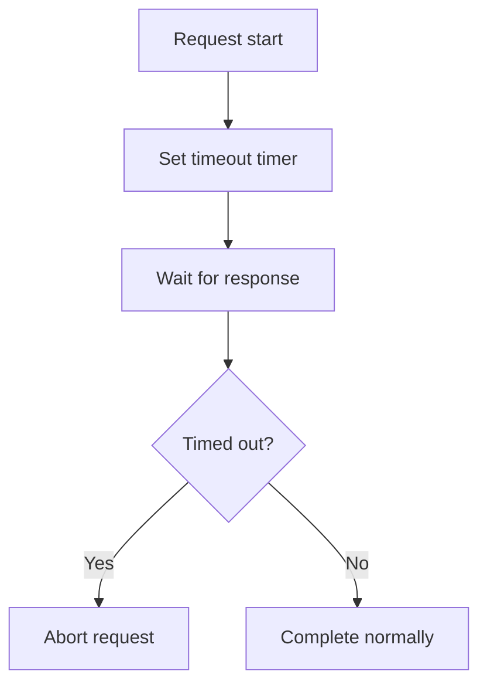

**Diagram sources**
- [adapters/xhr.js:1-200](file://源码学习/axios@0.21.1/lib/adapters/xhr.js#L1-L200)
- [adapters/http.js:1-120](file://源码学习/axios@0.21.1/lib/adapters/http.js#L1-L120)

**Section sources**
- [adapters/xhr.js:1-200](file://源码学习/axios@0.21.1/lib/adapters/xhr.js#L1-L200)
- [adapters/http.js:1-120](file://源码学习/axios@0.21.1/lib/adapters/http.js#L1-L120)

### Cancellation Token Implementation
Cancellation supports both immediate cancellation and token-based abort:
- Cancel class: Holds cancellation reason.
- CancelToken: Provides executor and token for aborting requests.
- isCancel: Detects cancellation signals.

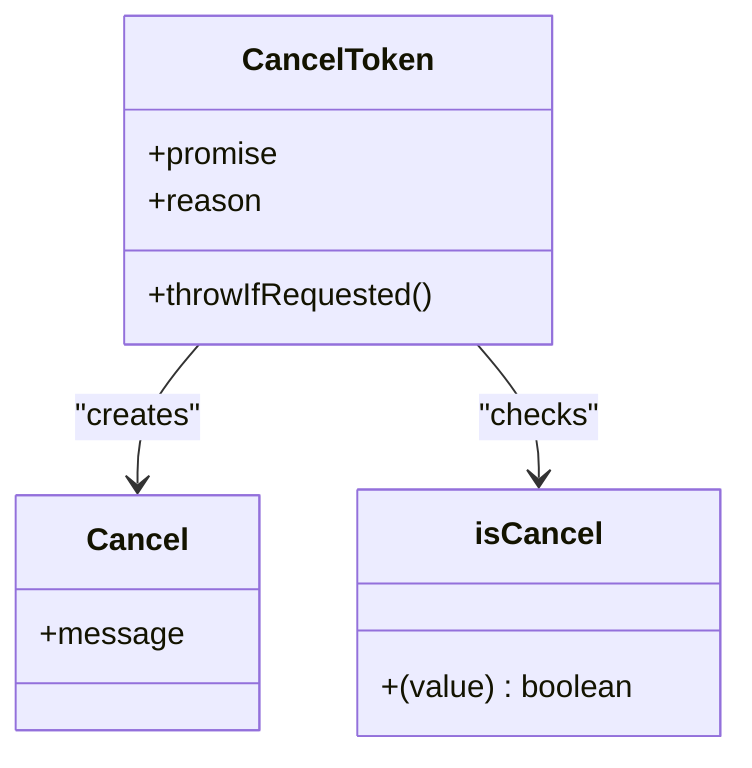

**Diagram sources**
- [cancel/Cancel.js:1-120](file://源码学习/axios@0.21.1/lib/cancel/Cancel.js#L1-L120)
- [cancel/CancelToken.js:1-120](file://源码学习/axios@0.21.1/lib/cancel/CancelToken.js#L1-L120)
- [cancel/isCancel.js:1-120](file://源码学习/axios@0.21.1/lib/cancel/isCancel.js#L1-L120)

**Section sources**
- [cancel/Cancel.js:1-120](file://源码学习/axios@0.21.1/lib/cancel/Cancel.js#L1-L120)
- [cancel/CancelToken.js:1-120](file://源码学习/axios@0.21.1/lib/cancel/CancelToken.js#L1-L120)
- [cancel/isCancel.js:1-120](file://源码学习/axios@0.21.1/lib/cancel/isCancel.js#L1-L120)

### Interceptor Registration System
Interceptors are registered via InterceptorManager and applied in FIFO order. They receive either fulfilled value or rejection reason and can transform or halt the chain.

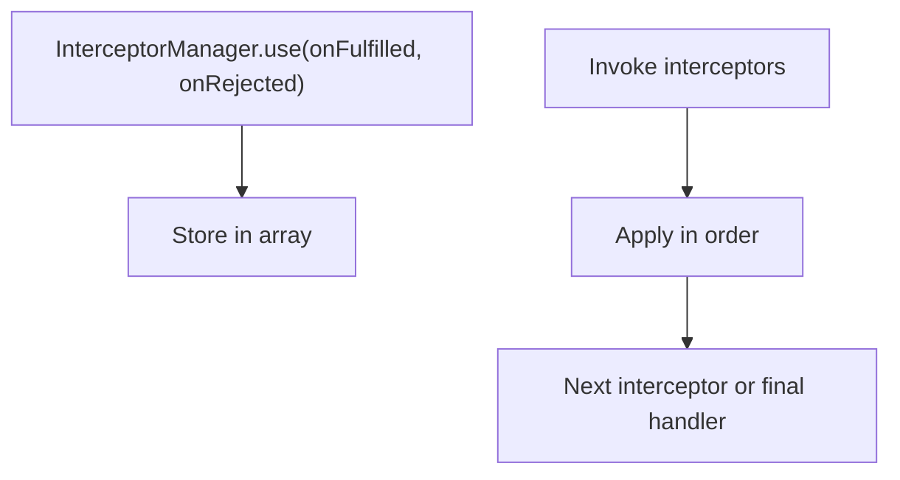

**Diagram sources**
- [core/InterceptorManager.js:1-120](file://源码学习/axios@0.21.1/lib/core/InterceptorManager.js#L1-L120)

**Section sources**
- [core/InterceptorManager.js:1-120](file://源码学习/axios@0.21.1/lib/core/InterceptorManager.js#L1-L120)

### Request Transformation and Response Data Normalization
Axios applies request and response transformations to normalize data and headers before sending and after receiving.

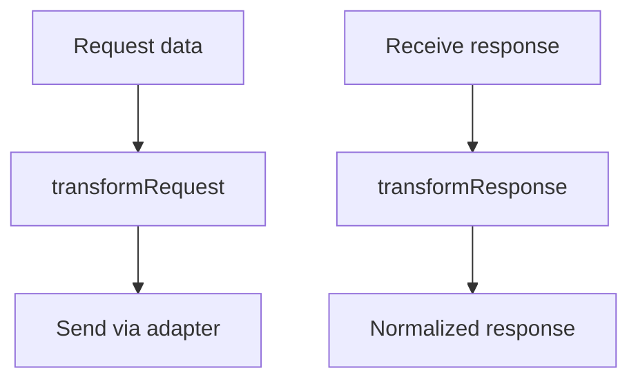

**Diagram sources**
- [core/transformData.js:1-120](file://源码学习/axios@0.21.1/lib/core/transformData.js#L1-L120)

**Section sources**
- [core/transformData.js:1-120](file://源码学习/axios@0.21.1/lib/core/transformData.js#L1-L120)

### Practical Examples: Extending Axios
- Custom interceptors: Register request/response handlers to inject auth headers, log requests, or retry on failure.
- Custom adapter: Implement a new adapter by conforming to the adapter interface and registering it during initialization.
- Custom transformer: Add custom serialization/deserialization logic via transformRequest/transformResponse.

[No sources needed since this section provides general guidance]

### Architectural Patterns
- Factory functions: axios.create produces configured instances.
- Prototype-based composition: Axios class composes interceptors, transformers, and adapters.
- Module encapsulation: Each concern resides in dedicated modules with clear boundaries.

**Section sources**
- [axios.js:1-60](file://源码学习/axios@0.21.1/lib/axios.js#L1-L60)
- [core/Axios.js:1-120](file://源码学习/axios@0.21.1/lib/core/Axios.js#L1-L120)

## Dependency Analysis
Axios exhibits low coupling and high cohesion:
- Core depends on helpers for URL/header logic.
- Adapter selection is centralized in the dispatcher.
- Interceptors are decoupled from transport logic.

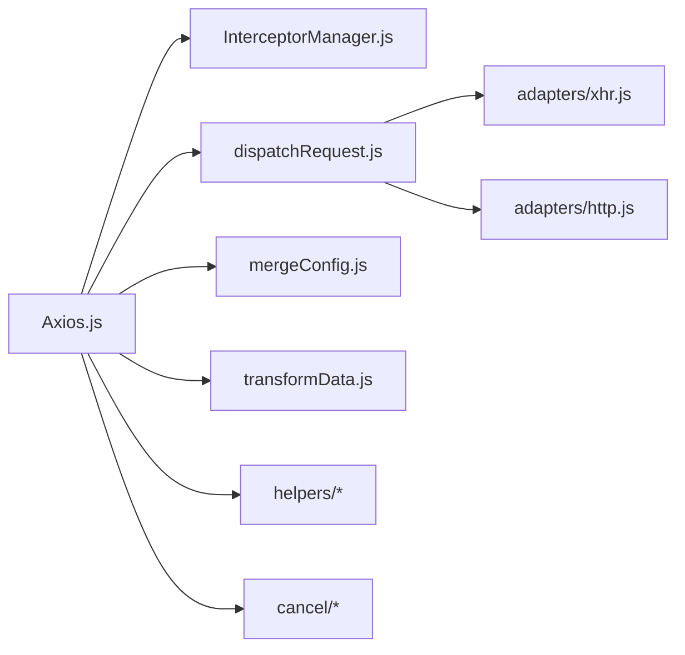

**Diagram sources**
- [core/Axios.js:1-120](file://源码学习/axios@0.21.1/lib/core/Axios.js#L1-L120)
- [core/InterceptorManager.js:1-120](file://源码学习/axios@0.21.1/lib/core/InterceptorManager.js#L1-L120)
- [core/dispatchRequest.js:1-120](file://源码学习/axios@0.21.1/lib/core/dispatchRequest.js#L1-L120)
- [core/mergeConfig.js:1-120](file://源码学习/axios@0.21.1/lib/core/mergeConfig.js#L1-L120)
- [core/transformData.js:1-120](file://源码学习/axios@0.21.1/lib/core/transformData.js#L1-L120)
- [adapters/xhr.js:1-200](file://源码学习/axios@0.21.1/lib/adapters/xhr.js#L1-L200)
- [adapters/http.js:1-120](file://源码学习/axios@0.21.1/lib/adapters/http.js#L1-L120)
- [helpers/combineURLs.js:1-120](file://源码学习/axios@0.21.1/lib/helpers/combineURLs.js#L1-L120)
- [helpers/normalizeHeaderName.js:1-120](file://源码学习/axios@0.21.1/lib/helpers/normalizeHeaderName.js#L1-L120)
- [cancel/CancelToken.js:1-120](file://源码学习/axios@0.21.1/lib/cancel/CancelToken.js#L1-L120)

**Section sources**
- [core/Axios.js:1-120](file://源码学习/axios@0.21.1/lib/core/Axios.js#L1-L120)
- [core/dispatchRequest.js:1-120](file://源码学习/axios@0.21.1/lib/core/dispatchRequest.js#L1-L120)

## Performance Considerations
- Minimize interceptor overhead: Keep interceptors lightweight; avoid heavy synchronous work.
- Efficient merging: Prefer shallow merges where possible; avoid deep cloning large objects.
- Adapter choice: Choose the appropriate adapter for the environment to reduce polyfills and overhead.
- Memory management: Avoid retaining references to large payloads; clear listeners and timers promptly.
- Browser compatibility: Use XHR adapter for broad compatibility; ensure proper event cleanup.

[No sources needed since this section provides general guidance]

## Troubleshooting Guide
- Invalid URL: Validators detect malformed URLs and surface explicit errors.
- Timeout errors: Verify timeout values and network conditions; ensure adapters handle timeouts correctly.
- Cancellation errors: Confirm CancelToken usage and isCancel checks.
- Header normalization: Use helper utilities to ensure consistent header casing.

**Section sources**
- [helpers/validator.js:1-120](file://源码学习/axios@0.21.1/lib/helpers/validator.js#L1-L120)
- [adapters/xhr.js:1-200](file://源码学习/axios@0.21.1/lib/adapters/xhr.js#L1-L200)
- [adapters/http.js:1-120](file://源码学习/axios@0.21.1/lib/adapters/http.js#L1-L120)
- [cancel/isCancel.js:1-120](file://源码学习/axios@0.21.1/lib/cancel/isCancel.js#L1-L120)

## Conclusion
Axios achieves a clean separation of concerns through its adapter pattern, robust interceptor chain, and promise-based API. Its configuration merging, transformation pipeline, and cancellation model provide extensibility and reliability across environments. Understanding these internals enables effective customization and optimization for diverse use cases.

## Appendices
- URL helpers: combineURLs, isAbsoluteURL, parseProtocol.
- Header helpers: normalizeHeaderName.
- Cookie helpers: cookies.
- Validators: validator.

**Section sources**
- [helpers/combineURLs.js:1-120](file://源码学习/axios@0.21.1/lib/helpers/combineURLs.js#L1-L120)
- [helpers/isAbsoluteURL.js:1-120](file://源码学习/axios@0.21.1/lib/helpers/isAbsoluteURL.js#L1-L120)
- [helpers/parseProtocol.js:1-120](file://源码学习/axios@0.21.1/lib/helpers/parseProtocol.js#L1-L120)
- [helpers/normalizeHeaderName.js:1-120](file://源码学习/axios@0.21.1/lib/helpers/normalizeHeaderName.js#L1-L120)
- [helpers/cookies.js:1-120](file://源码学习/axios@0.21.1/lib/helpers/cookies.js#L1-L120)
- [helpers/validator.js:1-120](file://源码学习/axios@0.21.1/lib/helpers/validator.js#L1-L120)