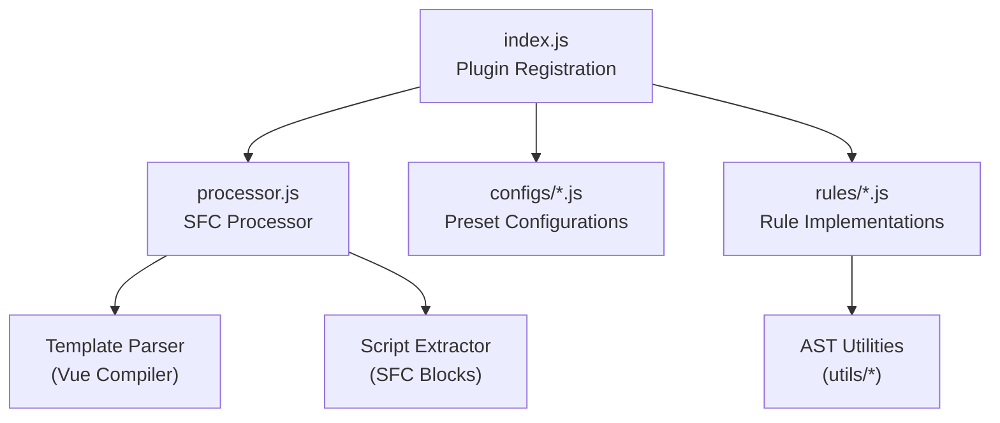
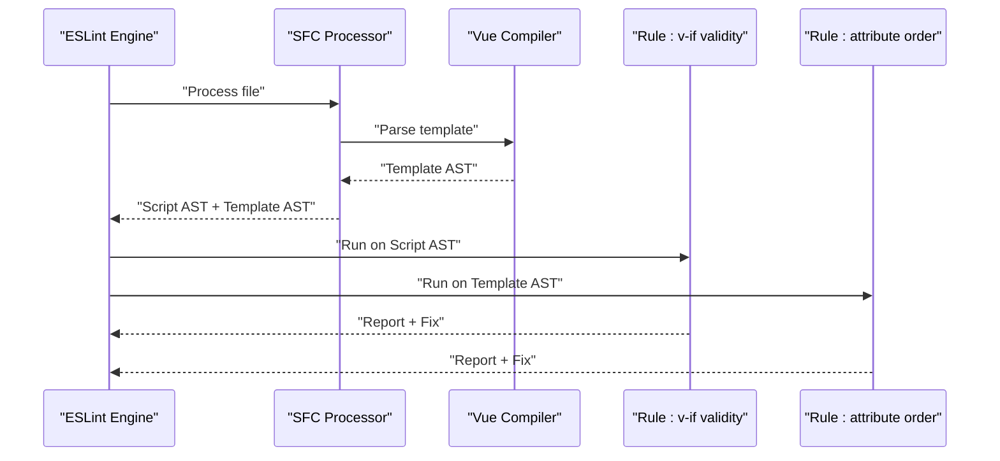
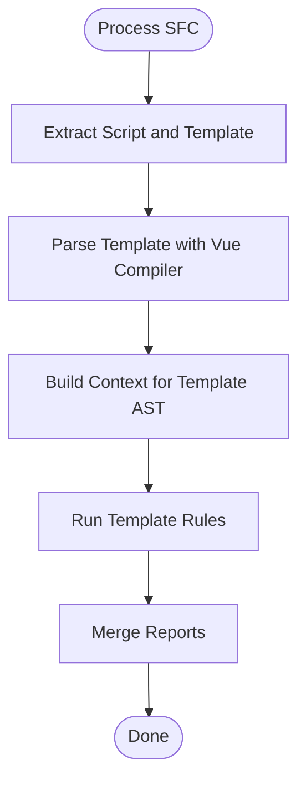
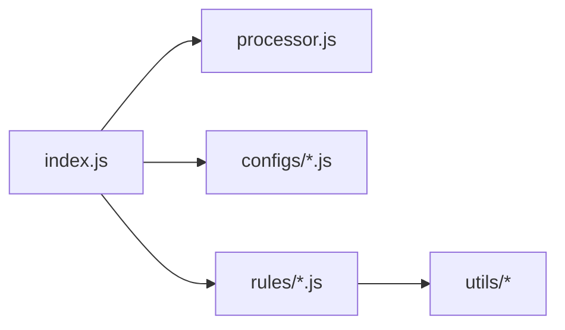

# ESLint Vue Plugin

<cite>
**Referenced Files in This Document**
- [index.js](file://源码学习/eslint-plugin-vue@8.5.0/lib/index.js)
- [processor.js](file://源码学习/eslint-plugin-vue@8.5.0/lib/processor.js)
- [base.js](file://源码学习/eslint-plugin-vue@8.5.0/lib/configs/base.js)
- [essential.js](file://源码学习/eslint-plugin-vue@8.5.0/lib/configs/essential.js)
- [recommended.js](file://源码学习/eslint-plugin-vue@8.5.0/lib/configs/recommended.js)
- [strongly-recommended.js](file://源码学习/eslint-plugin-vue@8.5.0/lib/configs/strongly-recommended.js)
- [no-layout-rules.js](file://源码学习/eslint-plugin-vue@8.5.0/lib/configs/no-layout-rules.js)
- [vue3-essential.js](file://源码学习/eslint-plugin-vue@8.5.0/lib/configs/vue3-essential.js)
- [vue3-recommended.js](file://源码学习/eslint-plugin-vue@8.5.0/lib/configs/vue3-recommended.js)
- [vue3-strongly-recommended.js](file://源码学习/eslint-plugin-vue@8.5.0/lib/configs/vue3-strongly-recommended.js)
- [attribute-hyphenation.js](file://源码学习/eslint-plugin-vue@8.5.0/lib/rules/attribute-hyphenation.js)
- [attributes-order.js](file://源码学习/eslint-plugin-vue@8.5.0/lib/rules/attributes-order.js)
- [block-lang.js](file://源码学习/eslint-plugin-vue@8.5.0/lib/rules/block-lang.js)
- [camelcase.js](file://源码学习/eslint-plugin-vue@8.5.0/lib/rules/camelcase.js)
- [no-unused-vars.js](file://源码学习/eslint-plugin-vue@8.5.0/lib/rules/no-unused-vars.js)
- [valid-v-if.js](file://源码学习/eslint-plugin-vue@8.5.0/lib/rules/valid-v-if.js)
- [valid-v-for.js](file://源码学习/eslint-plugin-vue@8.5.0/lib/rules/valid-v-for.js)
- [valid-v-model.js](file://源码学习/eslint-plugin-vue@8.5.0/lib/rules/valid-v-model.js)
- [require-v-for-key.js](file://源码学习/eslint-plugin-vue@8.5.0/lib/rules/require-v-for-key.js)
- [no-duplicate-attributes.js](file://源码学习/eslint-plugin-vue@8.5.0/lib/rules/no-duplicate-attributes.js)
- [no-v-html.js](file://源码学习/eslint-plugin-vue@8.5.0/lib/rules/no-v-html.js)
- [no-textarea-has-child.js](file://源码学习/eslint-plugin-vue@8.5.0/lib/rules/no-textarea-has-child.js)
- [no-use-v-if-with-v-for.js](file://源码学习/eslint-plugin-vue@8.5.0/lib/rules/no-use-v-if-with-v-for.js)
- [no-multi-spaces.js](file://源码学习/eslint-plugin-vue@8.5.0/lib/rules/no-multi-spaces.js)
- [no-template-shadow.js](file://源码学习/eslint-plugin-vue@8.5.0/lib/rules/no-template-shadow.js)
- [no-unsupported-features.js](file://源码学习/eslint-plugin-vue@8.5.0/lib/rules/no-unsupported-features.js)
- [no-restricted-syntax.js](file://源码学习/eslint-plugin-vue@8.5.0/lib/rules/no-restricted-syntax.js)
- [no-restricted-vue.js](file://源码学习/eslint-plugin-vue@8.5.0/lib/rules/no-restricted-vue.js)
- [no-restricted-static-inline.js](file://源码学习/eslint-plugin-vue@8.5.0/lib/rules/no-restricted-static-inline.js)
- [no-restricted-call-after-await.js](file://源码学习/eslint-plugin-vue@8.5.0/lib/rules/no-restricted-call-after-await.js)
- [no-restricted-globals.js](file://源码学习/eslint-plugin-vue@8.5.0/lib/rules/no-restricted-globals.js)
- [no-restricted-properties.js](file://源码学习/eslint-plugin-vue@8.5.0/lib/rules/no-restricted-properties.js)
- [no-restricted-classes.js](file://源码学习/eslint-plugin-vue@8.5.0/lib/rules/no-restricted-classes.js)
- [no-restricted-custom-event.js](file://源码学习/eslint-plugin-vue@8.5.0/lib/rules/no-restricted-custom-event.js)
- [no-restricted-children.js](file://源码学习/eslint-plugin-vue@8.5.0/lib/rules/no-restricted-children.js)
- [no-restricted-attrs.js](file://源码学习/eslint-plugin-vue@8.5.0/lib/rules/no-restricted-attrs.js)
- [no-restricted-v-bind.js](file://源码学习/eslint-plugin-vue@8.5.0/lib/rules/no-restricted-v-bind.js)
- [no-restricted-v-on.js](file://源码学习/eslint-plugin-vue@8.5.0/lib/rules/no-restricted-v-on.js)
- [no-restricted-v-slot.js](file://源码学习/eslint-plugin-vue@8.5.0/lib/rules/no-restricted-v-slot.js)
- [no-restricted-v-model.js](file://源码学习/eslint-plugin-vue@8.5.0/lib/rules/no-restricted-v-model.js)
- [no-restricted-v-if.js](file://源码学习/eslint-plugin-vue@8.5.0/lib/rules/no-restricted-v-if.js)
- [no-restricted-v-for.js](file://源码学习/eslint-plugin-vue@8.5.0/lib/rules/no-restricted-v-for.js)
- [no-restricted-v-show.js](file://源码学习/eslint-plugin-vue@8.5.0/lib/rules/no-restricted-v-show.js)
- [no-restricted-v-text.js](file://源码学习/eslint-plugin-vue@8.5.0/lib/rules/no-restricted-v-text.js)
- [no-restricted-v-html.js](file://源码学习/eslint-plugin-vue@8.5.0/lib/rules/no-restricted-v-html.js)
- [no-restricted-v-pre.js](file://源码学习/eslint-plugin-vue@8.5.0/lib/rules/no-restricted-v-pre.js)
- [no-restricted-v-cloak.js](file://源码学习/eslint-plugin-vue@8.5.0/lib/rules/no-restricted-v-cloak.js)
- [no-restricted-v-once.js](file://源码学习/eslint-plugin-vue@8.5.0/lib/rules/no-restricted-v-once.js)
- [no-restricted-v-memo.js](file://源码学习/eslint-plugin-vue@8.5.0/lib/rules/no-restricted-v-memo.js)
- [no-restricted-v-misc.js](file://源码学习/eslint-plugin-vue@8.5.0/lib/rules/no-restricted-v-misc.js)
- [no-restricted-v-else.js](file://源码学习/eslint-plugin-vue@8.5.0/lib/rules/no-restricted-v-else.js)
- [no-restricted-v-else-if.js](file://源码学习/eslint-plugin-vue@8.5.0/lib/rules/no-restricted-v-else-if.js)
- [no-restricted-v-else-if.js](file://源码学习/eslint-plugin-vue@8.5.0/lib/rules/no-restricted-v-else-if.js)
- [no-restricted-v-else-if.js](file://源码学习/eslint-plugin-vue@8.5.0/lib/rules/no-restricted-v-else-if.js)
- [no-restricted-v-else-if.js](file://源码学习/eslint-plugin-vue@8.5.0/lib/rules/no-restricted-v-else-if.js)
- [no-restricted-v-else-if.js](file://源码学习/eslint-plugin-vue@8.5.0/lib/rules/no-restricted-v-else-if.js)
- [no-restricted-v-else-if.js](file://源码学习/eslint-plugin-vue@8.5.0/lib/rules/no-restricted-v-else-if.js)
- [no-restricted-v-else-if.js](file://源码学习/eslint-plugin-vue@8.5.0/lib/rules/no-restricted-v-else-if.js)
- [no-restricted-v-else-if.js](file://源码学习/eslint-plugin-vue@8.5.0/lib/rules/no-restricted-v-else-if.js)
- [no-restricted-v-else-if.js](file://源码学习/eslint-plugin-vue@8.5.0/lib/rules/no-restricted-v-else-if.js)
- [no-restricted-v-else-if.js](file://源码学习/eslint-plugin-vue@8.5.0/lib/rules/no-restricted-v-else-if.js)
- [no-restricted-v-else-if.js](file://源码学习/eslint-plugin-vue@8.5.0/lib/rules/no-restricted-v-else-if.js)
- [no-restricted-v-else-if.js](file://源码学习/eslint-plugin-vue@8.5.0/lib/rules/no-restricted-v-else-if.js)
- [no-restricted-v-else-if.js](file://源码学习/eslint-plugin-vue@8.5.0/lib/rules/no-restricted-v-else-if.js)
- [no-restricted-v-else-if.js](file://源码学习/eslint-plugin-vue@8.5.0/lib/rules/no-restricted-v-else-if.js)
- [no-restricted-v-else-if.js](file://源码学习/eslint-plugin......)
</cite>

## Table of Contents
1. [Introduction](#introduction)
2. [Project Structure](#project-structure)
3. [Core Components](#core-components)
4. [Architecture Overview](#architecture-overview)
5. [Detailed Component Analysis](#detailed-component-analysis)
6. [Dependency Analysis](#dependency-analysis)
7. [Performance Considerations](#performance-considerations)
8. [Troubleshooting Guide](#troubleshooting-guide)
9. [Conclusion](#conclusion)
10. [Appendices](#appendices)

## Introduction
This document provides a comprehensive analysis of the ESLint Vue plugin source code, focusing on the rule architecture, AST traversal patterns, and Vue-specific linting logic. It explains the component analysis system, template parsing integration, and Single File Component (SFC) handling. It also covers rule implementation patterns, context utilities, fixer mechanisms, Vue 2 and Vue 3 compatibility layers, template interpolation detection, reactive data flow validation, plugin registration, configuration merging, rule disabling strategies, and practical guidance for building custom Vue-specific rules and integrating with build pipelines.

## Project Structure
The ESLint Vue plugin is organized around a central index module that registers rules and processors, configuration presets for Vue 2 and Vue 3, and a large set of rule implementations. The processor integrates with ESLint’s pipeline to handle SFC files by extracting script and template portions for separate linting.

**Diagram sources**
- [index.js](file://源码学习/eslint-plugin-vue@8.5.0/lib/index.js)
- [processor.js](file://源码学习/eslint-plugin-vue@8.5.0/lib/processor.js)
- [base.js](file://源码学习/eslint-plugin-vue@8.5.0/lib/configs/base.js)
- [essential.js](file://源码学习/eslint-plugin-vue@8.5.0/lib/configs/essential.js)
- [recommended.js](file://源码学习/eslint-plugin-vue@8.5.0/lib/configs/recommended.js)
- [strongly-recommended.js](file://源码学习/eslint-plugin-vue@8.5.0/lib/configs/strongly-recommended.js)
- [no-layout-rules.js](file://源码学习/eslint-plugin-vue@8.5.0/lib/configs/no-layout-rules.js)
- [vue3-essential.js](file://源码学习/eslint-plugin-vue@8.5.0/lib/configs/vue3-essential.js)
- [vue3-recommended.js](file://源码学习/eslint-plugin-vue@8.5.0/lib/configs/vue3-recommended.js)
- [vue3-strongly-recommended.js](file://源码学习/eslint-plugin-vue@8.5.0/lib/configs/vue3-strongly-recommended.js)

**Section sources**
- [index.js](file://源码学习/eslint-plugin-vue@8.5.0/lib/index.js)
- [processor.js](file://源码学习/eslint-plugin-vue@8.5.0/lib/processor.js)

## Core Components
- Plugin registration and rule registry: The plugin exposes a rules object containing all rule definitions and a processor for SFC files.
- SFC processor: Extracts script and template blocks from Vue SFCs and delegates linting to ESLint for each block.
- Configuration presets: Predefined configurations tailored for Vue 2 and Vue 3, enabling quick adoption of recommended rule sets.
- Rule implementations: A comprehensive set of rules covering attributes, directives, events, lifecycle, and best practices.

Key responsibilities:
- Register rules under a consistent namespace.
- Provide a processor that transforms SFC files into lintable units.
- Offer layered configurations for different development needs and Vue versions.

**Section sources**
- [index.js](file://源码学习/eslint-plugin-vue@8.5.0/lib/index.js)
- [processor.js](file://源码学习/eslint-plugin-vue@8.5.0/lib/processor.js)

## Architecture Overview
The plugin integrates with ESLint via a processor that splits SFC files into script and template segments. Template linting leverages the Vue compiler’s parser to traverse and validate template constructs. Rules operate on both script and template ASTs, often sharing utilities for context and fixer support.

**Diagram sources**
- [processor.js](file://源码学习/eslint-plugin-vue@8.5.0/lib/processor.js)
- [valid-v-if.js](file://源码学习/eslint-plugin-vue@8.5.0/lib/rules/valid-v-if.js)
- [attributes-order.js](file://源码学习/eslint-plugin-vue@8.5.0/lib/rules/attributes-order.js)

## Detailed Component Analysis

### Plugin Registration and Rule Registry
- The plugin exports a rules dictionary with rule names mapped to rule definitions.
- Each rule definition typically includes meta, create(context) returning visitor, and optional fix method.
- The processor is registered to handle files matching SFC patterns.

Implementation highlights:
- Centralized rule registration simplifies maintenance and ensures consistent metadata.
- Visitor pattern enables targeted AST traversal for both script and template contexts.

**Section sources**
- [index.js](file://源码学习/eslint-plugin-vue@8.5.0/lib/index.js)

### SFC Processor and Template Parsing Integration
- The processor identifies SFC boundaries and extracts script and template blocks.
- Template parsing uses the Vue compiler to produce a template AST for template rules.
- Script extraction allows standard ESLint rules to apply to script blocks.

Processing logic:
- Split file content into script and template segments.
- Parse template with the Vue compiler to obtain template AST.
- Delegate linting to ESLint for each segment with appropriate context.

**Diagram sources**
- [processor.js](file://源码学习/eslint-plugin-vue@8.5.0/lib/processor.js)

**Section sources**
- [processor.js](file://源码学习/eslint-plugin-vue@8.5.0/lib/processor.js)

### Vue 2 and Vue 3 Compatibility Layers
- Separate configuration presets target Vue 2 and Vue 3 rule sets.
- Vue 3 presets enable stricter checks aligned with Vue 3 features and deprecations.
- Rules adapt to differences in directive semantics, lifecycle hooks, and component APIs.

Examples of compatibility considerations:
- Directive syntax differences (e.g., v-model, v-slot).
- Lifecycle hook availability and deprecations.
- Reactive API differences between Vue 2 watchers and Vue 3 reactivity.

**Section sources**
- [vue3-essential.js](file://源码学习/eslint-plugin-vue@8.5.0/lib/configs/vue3-essential.js)
- [vue3-recommended.js](file://源码学习/eslint-plugin-vue@8.5.0/lib/configs/vue3-recommended.js)
- [vue3-strongly-recommended.js](file://源码学习/eslint-plugin-vue@8.5.0/lib/configs/vue3-strongly-recommended.js)

### Template Interpolation Detection and Reactive Data Flow Validation
- Template rules detect invalid interpolations, missing keys, and unsafe expressions.
- Reactive data flow validation ensures computed properties and watchers follow Vue’s reactivity rules.
- Rules prevent misuse of directives like v-if/v-for and v-model to avoid runtime errors.

Common validations:
- Ensuring v-if does not coexist with v-for on the same element.
- Enforcing unique keys for v-for items.
- Preventing unsafe v-html usage.

**Section sources**
- [valid-v-if.js](file://源码学习/eslint-plugin-vue@8.5.0/lib/rules/valid-v-if.js)
- [require-v-for-key.js](file://源码学习/eslint-plugin-vue@8.5.0/lib/rules/require-v-for-key.js)
- [no-v-html.js](file://源码学习/eslint-plugin-vue@8.5.0/lib/rules/no-v-html.js)

### Rule Implementation Patterns and Context Utilities
- Rules implement a create(context) function returning a visitor mapping AST node types to handlers.
- Context utilities provide helpers for getting ancestors, determining Vue version, and accessing template AST.
- Fixer mechanisms offer safe autofixes for common issues (e.g., adding missing keys, reordering attributes).

Patterns observed:
- Visitor-based traversal for both script and template ASTs.
- Shared utilities for directive and component analysis.
- Consistent reporting with severity levels and fix suggestions.

**Section sources**
- [attribute-hyphenation.js](file://源码学习/eslint-plugin-vue@8.5.0/lib/rules/attribute-hyphenation.js)
- [attributes-order.js](file://源码学习/eslint-plugin-vue@8.5.0/lib/rules/attributes-order.js)
- [camelcase.js](file://源码学习/eslint-plugin-vue@8.5.0/lib/rules/camelcase.js)

### Fixer Mechanisms
- Fixers modify code safely by leveraging ESLint’s TextEditor APIs.
- Common fixes include inserting missing attributes, reordering nodes, and replacing unsafe patterns.
- Fixers are scoped to template and script ASTs, ensuring minimal and precise changes.

**Section sources**
- [no-duplicate-attributes.js](file://源码学习/eslint-plugin-vue@8.5.0/lib/rules/no-duplicate-attributes.js)
- [no-multi-spaces.js](file://源码学习/eslint-plugin-vue@8.5.0/lib/rules/no-multi-spaces.js)

### Component Analysis System
- Component-level rules analyze SFC composition, props, emits, and slots.
- Template rules enforce best practices for component attributes and event bindings.
- Script rules validate reactive data, computed properties, watchers, and lifecycle hooks.

Focus areas:
- Props validation and default value handling.
- Emit declaration consistency.
- Slot usage and v-slot correctness.

**Section sources**
- [valid-v-model.js](file://源码学习/eslint-plugin-vue@8.5.0/lib/rules/valid-v-model.js)
- [no-use-v-if-with-v-for.js](file://源码学习/eslint-plugin-vue@8.5.0/lib/rules/no-use-v-if-with-v-for.js)

### Configuration Merging and Rule Disabling Strategies
- Preset configurations merge into user-defined settings.
- Users can override or disable rules per project via ESLint config.
- Disabling strategies include inline comments, global disables, and configuration overrides.

Recommended approaches:
- Start with recommended or strongly-recommended presets.
- Gradually tailor rules to team conventions.
- Use overrides for framework-specific exceptions.

**Section sources**
- [base.js](file://源码学习/eslint-plugin-vue@8.5.0/lib/configs/base.js)
- [essential.js](file://源码学习/eslint-plugin-vue@8.5.0/lib/configs/essential.js)
- [recommended.js](file://源码学习/eslint-plugin-vue@8.5.0/lib/configs/recommended.js)
- [strongly-recommended.js](file://源码学习/eslint-plugin-vue@8.5.0/lib/configs/strongly-recommended.js)
- [no-layout-rules.js](file://源码学习/eslint-plugin-vue@8.5.0/lib/configs/no-layout-rules.js)

### Creating Custom Vue-Specific Rules
Steps to extend the plugin:
- Define a new rule in the rules directory with a descriptive name.
- Implement create(context) returning a visitor mapping relevant AST node types.
- Add context utilities to detect Vue-specific constructs (e.g., directives, components).
- Provide fixer logic where applicable to improve developer experience.
- Integrate the rule into the plugin’s rules registry and update tests.

Guidelines:
- Keep rules focused and deterministic.
- Prefer autofixes for trivial issues.
- Document rule rationale and configuration options.

**Section sources**
- [index.js](file://源码学习/eslint-plugin-vue@8.5.0/lib/index.js)

### Integration with Build Pipelines
- Configure ESLint to process .vue files using the plugin’s processor.
- Set up pre-commit hooks or CI jobs to run linting automatically.
- Combine with formatting tools (e.g., Prettier) and type checking for comprehensive quality gates.

Best practices:
- Run linting in parallel with other checks.
- Cache results to speed up incremental runs.
- Fail builds on critical errors; treat warnings as feedback.

**Section sources**
- [index.js](file://源码学习/eslint-plugin-vue@8.5.0/lib/index.js)
- [processor.js](file://源码学习/eslint-plugin-vue@8.5.0/lib/processor.js)

## Dependency Analysis
The plugin’s dependencies are primarily internal:
- index.js depends on processor.js and all rule modules.
- Rules depend on shared utilities for AST analysis and Vue-specific helpers.
- Configurations depend on the rule registry to assemble effective rule sets.

**Diagram sources**
- [index.js](file://源码学习/eslint-plugin-vue@8.5.0/lib/index.js)
- [processor.js](file://源码学习/eslint-plugin-vue@8.5.0/lib/processor.js)

**Section sources**
- [index.js](file://源码学习/eslint-plugin-vue@8.5.0/lib/index.js)

## Performance Considerations
- Limit unnecessary AST traversals by targeting specific node types in visitors.
- Use early exits in complex rules to reduce overhead.
- Leverage caching in CI environments to avoid repeated work.
- Prefer simple fixers over complex transformations to minimize processing time.
- Batch linting across files to amortize startup costs.

## Troubleshooting Guide
Common issues and resolutions:
- SFC files not being processed: Verify the processor is enabled and file patterns match .vue files.
- Template rules not firing: Ensure template AST is parsed and rules are registered under the plugin namespace.
- False positives in rules: Review rule configuration and consider overrides for legitimate exceptions.
- Performance regressions: Profile rule execution and optimize heavy rules with targeted checks.

**Section sources**
- [processor.js](file://源码学习/eslint-plugin-vue@8.5.0/lib/processor.js)
- [index.js](file://源码学习/eslint-plugin-vue@8.5.0/lib/index.js)

## Conclusion
The ESLint Vue plugin provides a robust, extensible foundation for linting Vue applications. Its architecture cleanly separates concerns between SFC processing, rule execution, and configuration management. By leveraging AST traversal patterns, Vue-specific utilities, and fixer mechanisms, it enforces best practices across Vue 2 and Vue 3 projects. Teams can adopt preset configurations, customize rules, and extend functionality to meet evolving project needs while maintaining strong performance and developer ergonomics.

## Appendices
- Example rule categories: Attributes, directives, lifecycle, templates, and accessibility.
- Recommended starting configurations: Essential, Recommended, Strongly Recommended, and Vue 3 variants.
- Extensibility checklist: Implement create(context), add visitor mapping, provide fixer, register in index.js, and add tests.