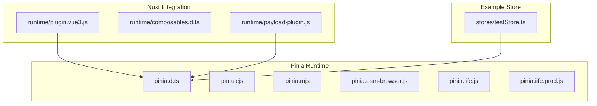
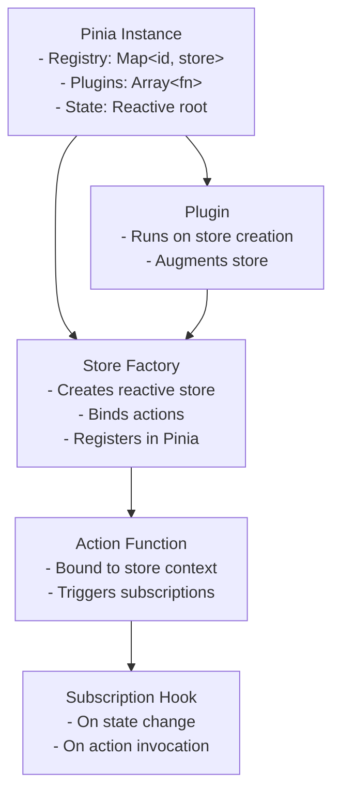
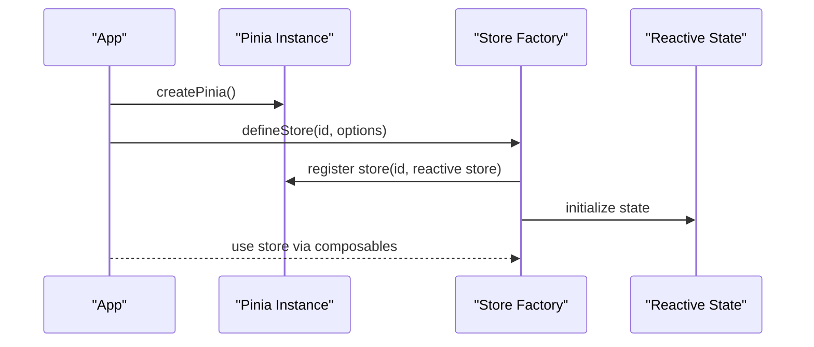
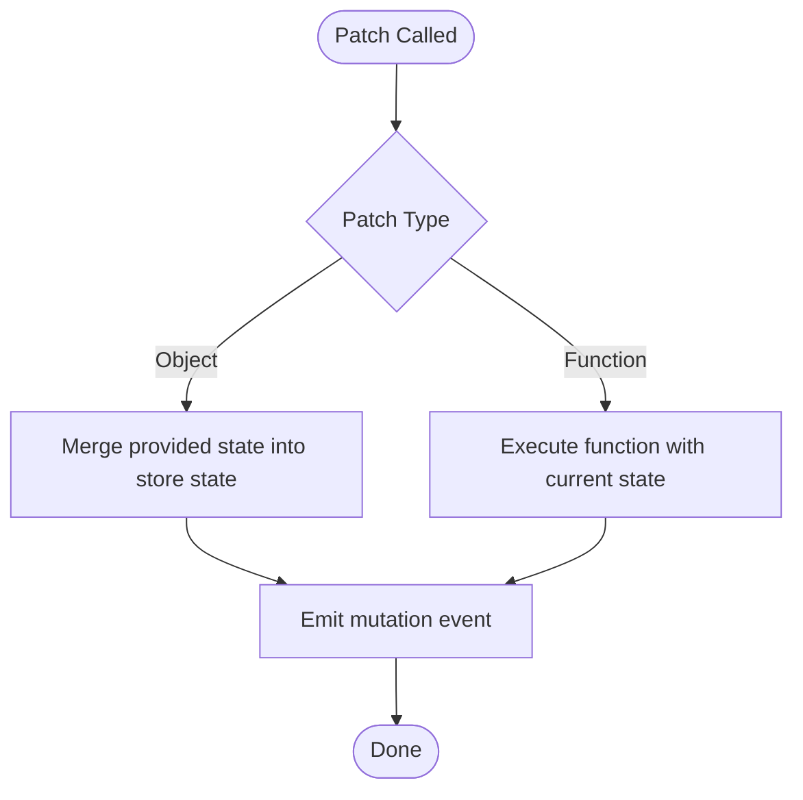
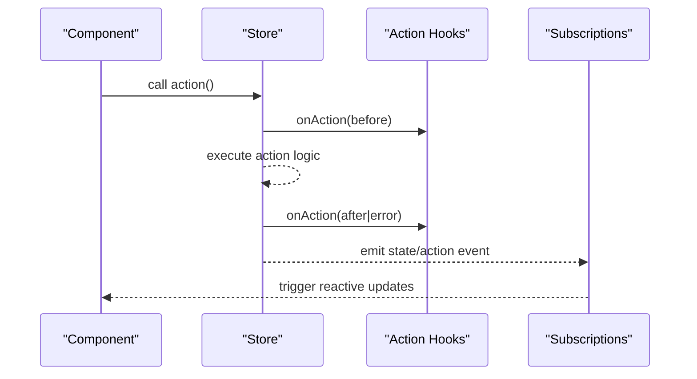
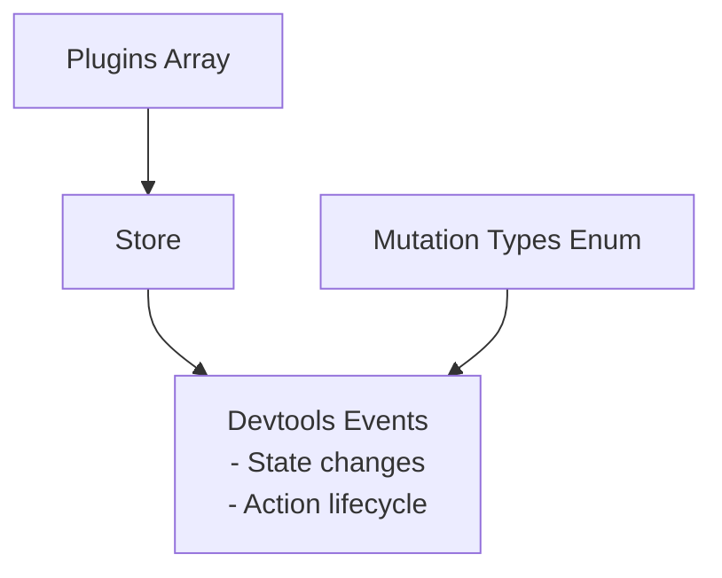
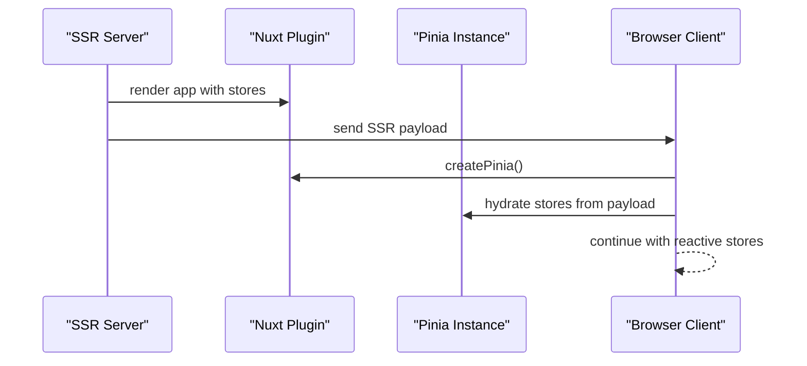
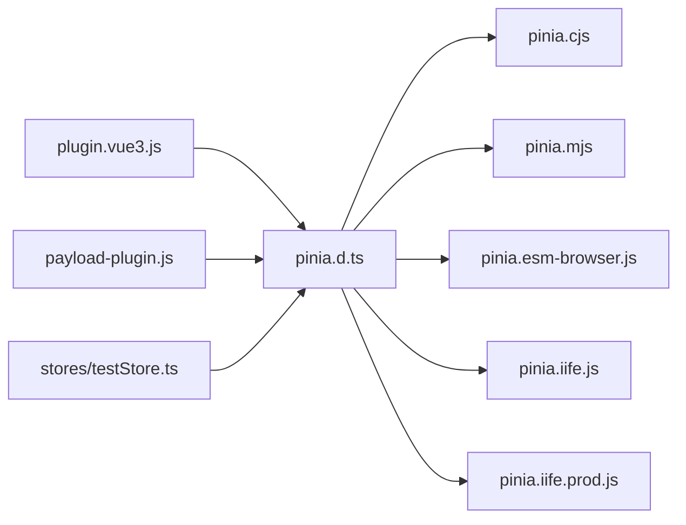

# Pinia State Management

<cite>
**Referenced Files in This Document**
- [pinia.d.ts](file://demo/nuxt/demo_2/node_modules/pinia/dist/pinia.d.ts)
- [pinia.cjs](file://demo/nuxt/demo_2/node_modules/pinia/dist/pinia.cjs)
- [pinia.mjs](file://demo/nuxt/demo_2/node_modules/pinia/dist/pinia.mjs)
- [pinia.esm-browser.js](file://demo/nuxt/demo_2/node_modules/pinia/dist/pinia.esm-browser.js)
- [pinia.iife.js](file://demo/nuxt/demo_2/node_modules/pinia/dist/pinia.iife.js)
- [pinia.iife.prod.js](file://demo/nuxt/demo_2/node_modules/pinia/dist/pinia.iife.prod.js)
- [plugin.vue3.js](file://demo/nuxt/demo_2/node_modules/@pinia/nuxt/dist/runtime/plugin.vue3.js)
- [composables.d.ts](file://demo/nuxt/demo_2/node_modules/@pinia/nuxt/dist/runtime/composables.d.ts)
- [payload-plugin.js](file://demo/nuxt/demo_2/node_modules/@pinia/nuxt/dist/runtime/payload-plugin.js)
- [testStore.ts](file://源码学习/pinia-2@2.3.1/packages/nuxt/playground/domain/one/stores/testStore.ts)
</cite>

## Table of Contents
1. [Introduction](#introduction)
2. [Project Structure](#project-structure)
3. [Core Components](#core-components)
4. [Architecture Overview](#architecture-overview)
5. [Detailed Component Analysis](#detailed-component-analysis)
6. [Dependency Analysis](#dependency-analysis)
7. [Performance Considerations](#performance-considerations)
8. [Troubleshooting Guide](#troubleshooting-guide)
9. [Conclusion](#conclusion)
10. [Appendices](#appendices)

## Introduction
This document analyzes the Pinia state management library as distributed in the repository, focusing on store creation, reactive state, Vue 3 composition API integration, store modules, getters/actions/mutations patterns, plugin system, devtools integration, persistence, TypeScript support, SSR/hydration, dependency injection, cross-store communication, and advanced usage patterns. It synthesizes the observable behavior from the compiled distribution artifacts and related Nuxt integration modules.

## Project Structure
The repository includes a distribution build of Pinia and Nuxt-specific integrations:
- Pinia runtime distributions (CommonJS, ESM, IIFE, minified IIFE) and TypeScript declarations
- Nuxt module runtime that integrates Pinia with Vue 3 and provides SSR payload helpers
- Example store definition using defineStore in a Nuxt playground

**Diagram sources**
- [pinia.d.ts](file://demo/nuxt/demo_2/node_modules/pinia/dist/pinia.d.ts)
- [pinia.cjs](file://demo/nuxt/demo_2/node_modules/pinia/dist/pinia.cjs)
- [pinia.mjs](file://demo/nuxt/demo_2/node_modules/pinia/dist/pinia.mjs)
- [pinia.esm-browser.js](file://demo/nuxt/demo_2/node_modules/pinia/dist/pinia.esm-browser.js)
- [pinia.iife.js](file://demo/nuxt/demo_2/node_modules/pinia/dist/pinia.iife.js)
- [pinia.iife.prod.js](file://demo/nuxt/demo_2/node_modules/pinia/dist/pinia.iife.prod.js)
- [plugin.vue3.js](file://demo/nuxt/demo_2/node_modules/@pinia/nuxt/dist/runtime/plugin.vue3.js)
- [composables.d.ts](file://demo/nuxt/demo_2/node_modules/@pinia/nuxt/dist/runtime/composables.d.ts)
- [payload-plugin.js](file://demo/nuxt/demo_2/node_modules/@pinia/nuxt/dist/runtime/payload-plugin.js)
- [testStore.ts](file://源码学习/pinia-2@2.3.1/packages/nuxt/playground/domain/one/stores/testStore.ts)

**Section sources**
- [pinia.d.ts](file://demo/nuxt/demo_2/node_modules/pinia/dist/pinia.d.ts)
- [plugin.vue3.js](file://demo/nuxt/demo_2/node_modules/@pinia/nuxt/dist/runtime/plugin.vue3.js)
- [testStore.ts](file://源码学习/pinia-2@2.3.1/packages/nuxt/playground/domain/one/stores/testStore.ts)

## Core Components
- Store creation and registration: Stores are created via a factory and registered in a central Pinia instance. The runtime exposes a function to create stores and maintains a registry keyed by store ID.
- Reactive state: Stores expose a reactive state object and a patch mechanism to update it. Patch supports both object updates and function-based updates.
- Composition API integration: Stores expose action functions bound to the store context, enabling natural composition with Vue 3 reactivity primitives.
- Actions and subscriptions: Stores support subscribing to state changes and action invocations, with hooks for after-action and error handling.
- Plugin system: The Pinia instance runs registered plugins during store creation, allowing augmentation of stores with additional behaviors.
- Devtools and persistence: The runtime exposes mutation types and subscription APIs that align with devtools expectations. Persistence is supported via hydration helpers and SSR payload handling.

**Section sources**
- [pinia.cjs](file://demo/nuxt/demo_2/node_modules/pinia/dist/pinia.cjs)
- [pinia.mjs](file://demo/nuxt/demo_2/node_modules/pinia/dist/pinia.mjs)
- [pinia.esm-browser.js](file://demo/nuxt/demo_2/node_modules/pinia/dist/pinia.esm-browser.js)
- [pinia.iife.js](file://demo/nuxt/demo_2/node_modules/pinia/dist/pinia.iife.js)
- [pinia.iife.prod.js](file://demo/nuxt/demo_2/node_modules/pinia/dist/pinia.iife.prod.js)

## Architecture Overview
The runtime architecture centers on a single Pinia instance that manages store registries, reactive state, and plugin lifecycle. Stores are created per module and exposed as reactive objects with actions and subscriptions.

**Diagram sources**
- [pinia.cjs](file://demo/nuxt/demo_2/node_modules/pinia/dist/pinia.cjs)
- [pinia.mjs](file://demo/nuxt/demo_2/node_modules/pinia/dist/pinia.mjs)
- [pinia.esm-browser.js](file://demo/nuxt/demo_2/node_modules/pinia/dist/pinia.esm-browser.js)
- [pinia.iife.js](file://demo/nuxt/demo_2/node_modules/pinia/dist/pinia.iife.js)
- [pinia.iife.prod.js](file://demo/nuxt/demo_2/node_modules/pinia/dist/pinia.iife.prod.js)

## Detailed Component Analysis

### Store Creation and Registration
- Store creation function accepts store options and returns a reactive store object with actions, subscriptions, and reset capability.
- The Pinia instance registers each store in an internal map keyed by store ID.
- Stores expose a patch method supporting object and function-based updates, emitting mutation events.

**Diagram sources**
- [pinia.cjs](file://demo/nuxt/demo_2/node_modules/pinia/dist/pinia.cjs)
- [pinia.mjs](file://demo/nuxt/demo_2/node_modules/pinia/dist/pinia.mjs)
- [pinia.esm-browser.js](file://demo/nuxt/demo_2/node_modules/pinia/dist/pinia.esm-browser.js)
- [pinia.iife.js](file://demo/nuxt/demo_2/node_modules/pinia/dist/pinia.iife.js)
- [pinia.iife.prod.js](file://demo/nuxt/demo_2/node_modules/pinia/dist/pinia.iife.prod.js)

**Section sources**
- [pinia.cjs](file://demo/nuxt/demo_2/node_modules/pinia/dist/pinia.cjs)
- [pinia.mjs](file://demo/nuxt/demo_2/node_modules/pinia/dist/pinia.mjs)
- [pinia.esm-browser.js](file://demo/nuxt/demo_2/node_modules/pinia/dist/pinia.esm-browser.js)
- [pinia.iife.js](file://demo/nuxt/demo_2/node_modules/pinia/dist/pinia.iife.js)
- [pinia.iife.prod.js](file://demo/nuxt/demo_2/node_modules/pinia/dist/pinia.iife.prod.js)

### Reactive State and Patch Mechanism
- Stores maintain a reactive state object under the store’s namespace.
- Patch supports two forms:
  - Object patch: merges provided state into the store’s state.
  - Function patch: executes a function with the current state, enabling controlled updates.
- Patch emits mutation events with a type indicating the update mode.

**Diagram sources**
- [pinia.cjs](file://demo/nuxt/demo_2/node_modules/pinia/dist/pinia.cjs)
- [pinia.mjs](file://demo/nuxt/demo_2/node_modules/pinia/dist/pinia.mjs)
- [pinia.esm-browser.js](file://demo/nuxt/demo_2/node_modules/pinia/dist/pinia.esm-browser.js)
- [pinia.iife.js](file://demo/nuxt/demo_2/node_modules/pinia/dist/pinia.iife.js)
- [pinia.iife.prod.js](file://demo/nuxt/demo_2/node_modules/pinia/dist/pinia.iife.prod.js)

**Section sources**
- [pinia.cjs](file://demo/nuxt/demo_2/node_modules/pinia/dist/pinia.cjs)
- [pinia.mjs](file://demo/nuxt/demo_2/node_modules/pinia/dist/pinia.mjs)
- [pinia.esm-browser.js](file://demo/nuxt/demo_2/node_modules/pinia/dist/pinia.esm-browser.js)
- [pinia.iife.js](file://demo/nuxt/demo_2/node_modules/pinia/dist/pinia.iife.js)
- [pinia.iife.prod.js](file://demo/nuxt/demo_2/node_modules/pinia/dist/pinia.iife.prod.js)

### Actions, Getters, and Subscriptions
- Actions are bound functions attached to the store, executed within a scoped effect context.
- Action hooks allow observing after-action completion and capturing errors.
- Subscriptions enable listening to state changes and action invocations, with flush strategies and detachment options.

**Diagram sources**
- [pinia.cjs](file://demo/nuxt/demo_2/node_modules/pinia/dist/pinia.cjs)
- [pinia.mjs](file://demo/nuxt/demo_2/node_modules/pinia/dist/pinia.mjs)
- [pinia.esm-browser.js](file://demo/nuxt/demo_2/node_modules/pinia/dist/pinia.esm-browser.js)
- [pinia.iife.js](file://demo/nuxt/demo_2/node_modules/pinia/dist/pinia.iife.js)
- [pinia.iife.prod.js](file://demo/nuxt/demo_2/node_modules/pinia/dist/pinia.iife.prod.js)

**Section sources**
- [pinia.cjs](file://demo/nuxt/demo_2/node_modules/pinia/dist/pinia.cjs)
- [pinia.mjs](file://demo/nuxt/demo_2/node_modules/pinia/dist/pinia.mjs)
- [pinia.esm-browser.js](file://demo/nuxt/demo_2/node_modules/pinia/dist/pinia.esm-browser.js)
- [pinia.iife.js](file://demo/nuxt/demo_2/node_modules/pinia/dist/pinia.iife.js)
- [pinia.iife.prod.js](file://demo/nuxt/demo_2/node_modules/pinia/dist/pinia.iife.prod.js)

### Plugin System and Devtools Integration
- Plugins run during store creation, receiving the store, app, and options context.
- Mutation types are exposed for devtools to categorize state changes.
- Subscriptions integrate with devtools by emitting structured events for state and action lifecycles.

**Diagram sources**
- [pinia.cjs](file://demo/nuxt/demo_2/node_modules/pinia/dist/pinia.cjs)
- [pinia.mjs](file://demo/nuxt/demo_2/node_modules/pinia/dist/pinia.mjs)
- [pinia.esm-browser.js](file://demo/nuxt/demo_2/node_modules/pinia/dist/pinia.esm-browser.js)
- [pinia.iife.js](file://demo/nuxt/demo_2/node_modules/pinia/dist/pinia.iife.js)
- [pinia.iife.prod.js](file://demo/nuxt/demo_2/node_modules/pinia/dist/pinia.iife.prod.js)

**Section sources**
- [pinia.cjs](file://demo/nuxt/demo_2/node_modules/pinia/dist/pinia.cjs)
- [pinia.mjs](file://demo/nuxt/demo_2/node_modules/pinia/dist/pinia.mjs)
- [pinia.esm-browser.js](file://demo/nuxt/demo_2/node_modules/pinia/dist/pinia.esm-browser.js)
- [pinia.iife.js](file://demo/nuxt/demo_2/node_modules/pinia/dist/pinia.iife.js)
- [pinia.iife.prod.js](file://demo/nuxt/demo_2/node_modules/pinia/dist/pinia.iife.prod.js)

### SSR, Hydration, and Payload Handling
- Nuxt runtime composes Pinia with Vue 3 and provides a plugin that initializes Pinia in the app context.
- Payload plugin exports a hydration helper used to hydrate store state from SSR payloads.
- Example store demonstrates defineStore usage within a Nuxt project.

**Diagram sources**
- [plugin.vue3.js](file://demo/nuxt/demo_2/node_modules/@pinia/nuxt/dist/runtime/plugin.vue3.js)
- [composables.d.ts](file://demo/nuxt/demo_2/node_modules/@pinia/nuxt/dist/runtime/composables.d.ts)
- [payload-plugin.js](file://demo/nuxt/demo_2/node_modules/@pinia/nuxt/dist/runtime/payload-plugin.js)
- [testStore.ts](file://源码学习/pinia-2@2.3.1/packages/nuxt/playground/domain/one/stores/testStore.ts)

**Section sources**
- [plugin.vue3.js](file://demo/nuxt/demo_2/node_modules/@pinia/nuxt/dist/runtime/plugin.vue3.js)
- [composables.d.ts](file://demo/nuxt/demo_2/node_modules/@pinia/nuxt/dist/runtime/composables.d.ts)
- [payload-plugin.js](file://demo/nuxt/demo_2/node_modules/@pinia/nuxt/dist/runtime/payload-plugin.js)
- [testStore.ts](file://源码学习/pinia-2@2.3.1/packages/nuxt/playground/domain/one/stores/testStore.ts)

### TypeScript Support and API Surface
- The TypeScript declarations define the Pinia interface, store factories, mutation types, and plugin options.
- The declarations indicate store state hydration and subscription signatures, enabling strong typing in applications.

**Section sources**
- [pinia.d.ts](file://demo/nuxt/demo_2/node_modules/pinia/dist/pinia.d.ts)

## Dependency Analysis
- Pinia runtime is distributed in multiple formats (CJS, ESM, IIFE) to target different environments.
- Nuxt integration depends on Pinia runtime and augments it with Vue 3 app initialization and SSR payload hydration.
- Example store usage demonstrates defineStore integration within a Nuxt project.

**Diagram sources**
- [pinia.d.ts](file://demo/nuxt/demo_2/node_modules/pinia/dist/pinia.d.ts)
- [pinia.cjs](file://demo/nuxt/demo_2/node_modules/pinia/dist/pinia.cjs)
- [pinia.mjs](file://demo/nuxt/demo_2/node_modules/pinia/dist/pinia.mjs)
- [pinia.esm-browser.js](file://demo/nuxt/demo_2/node_modules/pinia/dist/pinia.esm-browser.js)
- [pinia.iife.js](file://demo/nuxt/demo_2/node_modules/pinia/dist/pinia.iife.js)
- [pinia.iife.prod.js](file://demo/nuxt/demo_2/node_modules/pinia/dist/pinia.iife.prod.js)
- [plugin.vue3.js](file://demo/nuxt/demo_2/node_modules/@pinia/nuxt/dist/runtime/plugin.vue3.js)
- [payload-plugin.js](file://demo/nuxt/demo_2/node_modules/@pinia/nuxt/dist/runtime/payload-plugin.js)
- [testStore.ts](file://源码学习/pinia-2@2.3.1/packages/nuxt/playground/domain/one/stores/testStore.ts)

**Section sources**
- [pinia.d.ts](file://demo/nuxt/demo_2/node_modules/pinia/dist/pinia.d.ts)
- [plugin.vue3.js](file://demo/nuxt/demo_2/node_modules/@pinia/nuxt/dist/runtime/plugin.vue3.js)
- [payload-plugin.js](file://demo/nuxt/demo_2/node_modules/@pinia/nuxt/dist/runtime/payload-plugin.js)
- [testStore.ts](file://源码学习/pinia-2@2.3.1/packages/nuxt/playground/domain/one/stores/testStore.ts)

## Performance Considerations
- Patch batching and nextTick scheduling minimize redundant reactions and stabilize state transitions.
- Subscription hooks allow selective observation of state/action lifecycles to avoid unnecessary work.
- SSR hydration reduces client-server divergence by initializing store state from server-rendered payloads.

[No sources needed since this section provides general guidance]

## Troubleshooting Guide
- Verify store registration: Ensure stores are created via the factory and registered in the Pinia instance.
- Inspect subscriptions: Confirm subscription callbacks receive expected mutation/action events.
- Debug actions: Use onAction hooks to capture errors and post-execution results.
- SSR hydration: Confirm payload plugin hydration is invoked to populate client-side state.

**Section sources**
- [pinia.cjs](file://demo/nuxt/demo_2/node_modules/pinia/dist/pinia.cjs)
- [pinia.mjs](file://demo/nuxt/demo_2/node_modules/pinia/dist/pinia.mjs)
- [pinia.esm-browser.js](file://demo/nuxt/demo_2/node_modules/pinia/dist/pinia.esm-browser.js)
- [pinia.iife.js](file://demo/nuxt/demo_2/node_modules/pinia/dist/pinia.iife.js)
- [pinia.iife.prod.js](file://demo/nuxt/demo_2/node_modules/pinia/dist/pinia.iife.prod.js)

## Conclusion
Pinia’s runtime provides a compact, extensible foundation for state management in Vue 3 applications. Its store factory, reactive state, action hooks, and plugin system integrate cleanly with SSR and devtools. The distributed builds and Nuxt integration demonstrate practical deployment patterns, while TypeScript declarations offer strong typing for store APIs.

[No sources needed since this section summarizes without analyzing specific files]

## Appendices
- Advanced usage examples:
  - Custom plugins: Register plugins to augment store behavior during creation.
  - Store modules: Define multiple stores and compose them via actions and subscriptions.
  - Vue Router integration: Combine Pinia with router navigation guards and route-based store initialization.

[No sources needed since this section provides general guidance]