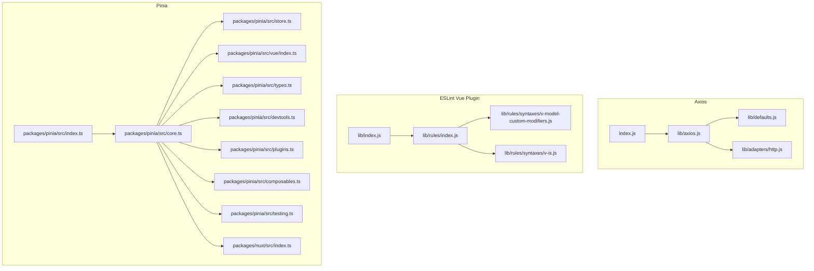
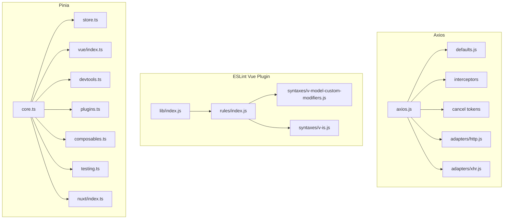
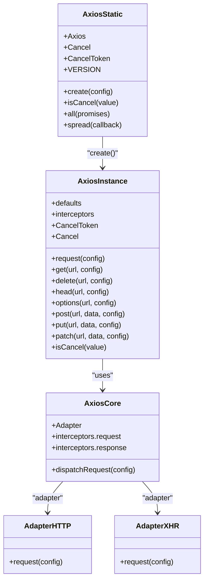
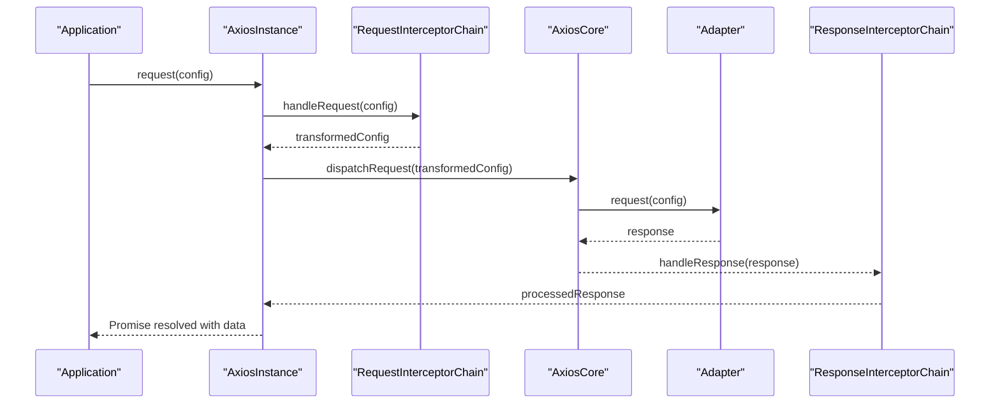
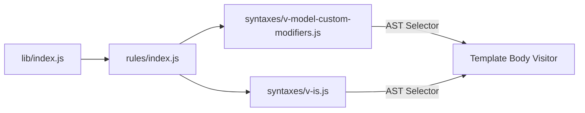
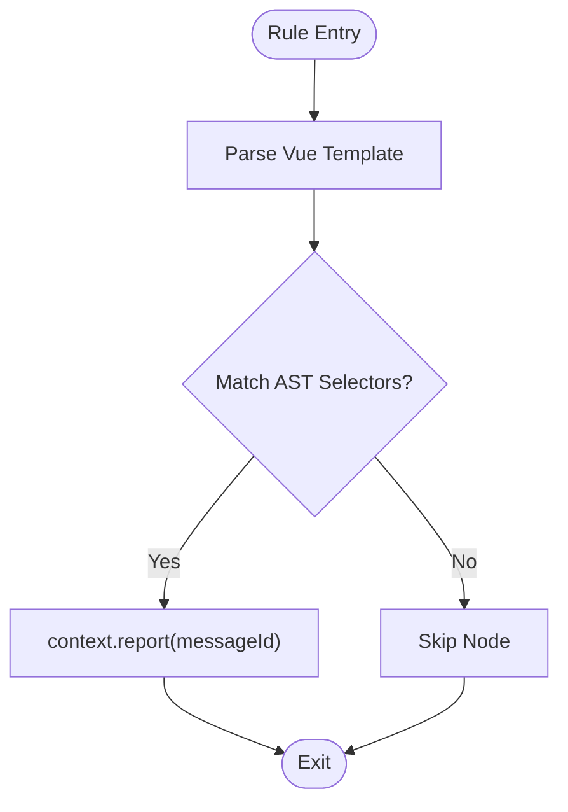
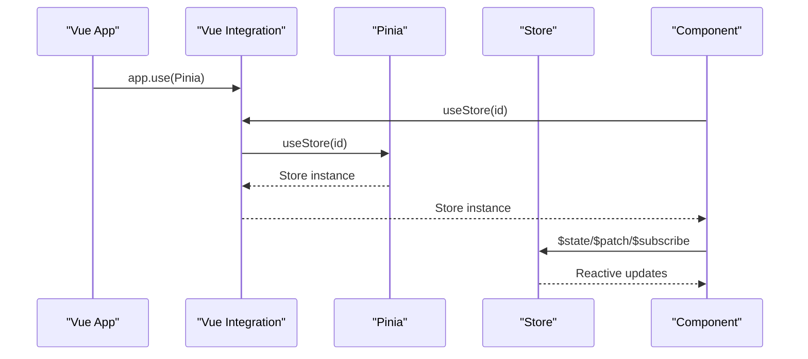
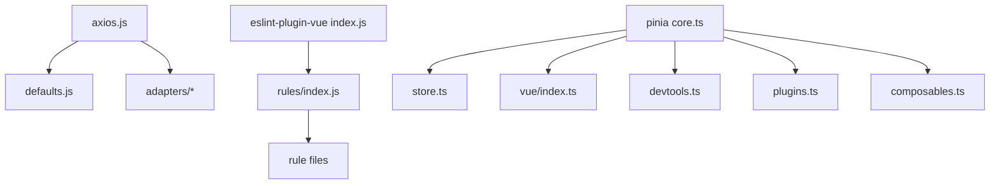

# Popular Library Analysis

<cite>
**Referenced Files in This Document**
- [axios.js](file://源码学习/axios@0.21.1/lib/axios.js)
- [http.js](file://源码学习/axios@0.21.1/lib/adapters/http.js)
- [defaults.js](file://源码学习/axios@0.21.1/lib/defaults.js)
- [index.js](file://源码学习/axios@0.21.1/index.js)
- [index.js](file://源码学习/eslint-plugin-vue@8.5.0/lib/index.js)
- [rules_index.js](file://源码学习/eslint-plugin-vue@8.5.0/lib/rules/index.js)
- [v-model-custom-modifiers.js](file://源码学习/eslint-plugin-vue@8.5.0/lib/rules/syntaxes/v-model-custom-modifiers.js)
- [v-is.js](file://源码学习/eslint-plugin-vue@8.5.0/lib/rules/syntaxes/v-is.js)
- [pinia_index.ts](file://源码学习/pinia-2@2.3.1/packages/pinia/src/index.ts)
- [pinia_core.ts](file://源码学习/pinia-2@2.3.1/packages/pinia/src/core.ts)
- [pinia_store.ts](file://源码学习/pinia-2@2.3.1/packages/pinia/src/store.ts)
- [pinia_vue_integration.ts](file://源码学习/pinia-2@2.3.1/packages/pinia/src/vue/index.ts)
- [pinia_types.ts](file://源码学习/pinia-2@2.3.1/packages/pinia/src/types.ts)
- [pinia_devtools.ts](file://源码学习/pinia-2@2.3.1/packages/pinia/src/devtools.ts)
- [pinia_plugin.ts](file://源码学习/pinia-2@2.3.1/packages/pinia/src/plugins.ts)
- [pinia_composables.ts](file://源码学习/pinia-2@2.3.1/packages/pinia/src/composables.ts)
- [pinia_testing.ts](file://源码学习/pinia-2@2.3.1/packages/pinia/src/testing.ts)
- [pinia_nuxt.ts](file://源码学习/pinia-2@2.3.1/packages/nuxt/src/index.ts)
- [pinia_package_json](file://源码学习/pinia-2@2.3.1/packages/pinia/package.json)
- [pinia_nuxt_package_json](file://源码学习/pinia-2@2.3.1/packages/nuxt/package.json)
- [pinia_readme.md](file://源码学习/pinia-2@2.3.1/README.md)
</cite>

## Table of Contents
1. [Introduction](#introduction)
2. [Project Structure](#project-structure)
3. [Core Components](#core-components)
4. [Architecture Overview](#architecture-overview)
5. [Detailed Component Analysis](#detailed-component-analysis)
6. [Dependency Analysis](#dependency-analysis)
7. [Performance Considerations](#performance-considerations)
8. [Troubleshooting Guide](#troubleshooting-guide)
9. [Conclusion](#conclusion)
10. [Appendices](#appendices)

## Introduction
This document analyzes three widely used frontend libraries—Axios HTTP client, ESLint Vue plugin, and Pinia state management—through a production-ready lens. It focuses on design patterns, extensibility, error handling, and performance characteristics. The goal is to provide both conceptual overviews for newcomers and deep implementation insights for experienced developers.

## Project Structure
The repository organizes each library’s source under dedicated folders:
- Axios: entry point, defaults, adapter implementations, and core utilities
- ESLint Vue plugin: rule registry, rule implementations, and configuration helpers
- Pinia: core store logic, Vue integration, devtools, plugins, composables, and Nuxt integration



**Diagram sources**
- [axios.js:1-60](file://源码学习/axios@0.21.1/lib/axios.js#L1-L60)
- [defaults.js:1-120](file://源码学习/axios@0.21.1/lib/defaults.js#L1-L120)
- [http.js:1-120](file://源码学习/axios@0.21.1/lib/adapters/http.js#L1-L120)
- [index.js:1-10](file://源码学习/axios@0.21.1/index.js#L1-L10)
- [index.js:1-100](file://源码学习/eslint-plugin-vue@8.5.0/lib/index.js#L1-L100)
- [rules_index.js:1-200](file://源码学习/eslint-plugin-vue@8.5.0/lib/rules/index.js#L1-L200)
- [v-model-custom-modifiers.js:1-33](file://源码学习/eslint-plugin-vue@8.5.0/lib/rules/syntaxes/v-model-custom-modifiers.js#L1-L33)
- [v-is.js:1-27](file://源码学习/eslint-plugin-vue@8.5.0/lib/rules/syntaxes/v-is.js#L1-L27)
- [pinia_index.ts:1-200](file://源码学习/pinia-2@2.3.1/packages/pinia/src/index.ts#L1-L200)
- [pinia_core.ts:1-300](file://源码学习/pinia-2@2.3.1/packages/pinia/src/core.ts#L1-L300)
- [pinia_store.ts:1-200](file://源码学习/pinia-2@2.3.1/packages/pinia/src/store.ts#L1-L200)
- [pinia_vue_integration.ts:1-200](file://源码学习/pinia-2@2.3.1/packages/pinia/src/vue/index.ts#L1-L200)
- [pinia_types.ts:1-200](file://源码学习/pinia-2@2.3.1/packages/pinia/src/types.ts#L1-L200)
- [pinia_devtools.ts:1-120](file://源码学习/pinia-2@2.3.1/packages/pinia/src/devtools.ts#L1-L120)
- [pinia_plugin.ts:1-120](file://源码学习/pinia-2@2.3.1/packages/pinia/src/plugins.ts#L1-L120)
- [pinia_composables.ts:1-200](file://源码学习/pinia-2@2.3.1/packages/pinia/src/composables.ts#L1-L200)
- [pinia_testing.ts:1-120](file://源码学习/pinia-2@2.3.1/packages/pinia/src/testing.ts#L1-L120)
- [pinia_nuxt.ts:1-120](file://源码学习/pinia-2@2.3.1/packages/nuxt/src/index.ts#L1-L120)

**Section sources**
- [axios.js:1-60](file://源码学习/axios@0.21.1/lib/axios.js#L1-L60)
- [index.js:1-10](file://源码学习/axios@0.21.1/index.js#L1-L10)
- [index.js:1-100](file://源码学习/eslint-plugin-vue@8.5.0/lib/index.js#L1-L100)
- [rules_index.js:1-200](file://源码学习/eslint-plugin-vue@8.5.0/lib/rules/index.js#L1-L200)
- [pinia_index.ts:1-200](file://源码学习/pinia-2@2.3.1/packages/pinia/src/index.ts#L1-L200)

## Core Components
- Axios: factory-based creation, defaults merging, adapter abstraction, interceptors, and cancellation tokens
- ESLint Vue plugin: rule registry and visitor-based AST rule implementations for Vue-specific syntax checks
- Pinia: store composition, reactive state, Vue integration via composables, devtools, and Nuxt module

**Section sources**
- [axios.js:36-48](file://源码学习/axios@0.21.1/lib/axios.js#L36-L48)
- [defaults.js:1-120](file://源码学习/axios@0.21.1/lib/defaults.js#L1-L120)
- [http.js:1-120](file://源码学习/axios@0.21.1/lib/adapters/http.js#L1-L120)
- [index.js:1-100](file://源码学习/eslint-plugin-vue@8.5.0/lib/index.js#L1-L100)
- [rules_index.js:1-200](file://源码学习/eslint-plugin-vue@8.5.0/lib/rules/index.js#L1-L200)
- [pinia_core.ts:1-300](file://源码学习/pinia-2@2.3.1/packages/pinia/src/core.ts#L1-L300)
- [pinia_store.ts:1-200](file://源码学习/pinia-2@2.3.1/packages/pinia/src/store.ts#L1-L200)
- [pinia_vue_integration.ts:1-200](file://源码学习/pinia-2@2.3.1/packages/pinia/src/vue/index.ts#L1-L200)

## Architecture Overview
This section maps the high-level architecture of each library and how they interact with their ecosystems.



**Diagram sources**
- [axios.js:1-60](file://源码学习/axios@0.21.1/lib/axios.js#L1-L60)
- [defaults.js:1-120](file://源码学习/axios@0.21.1/lib/defaults.js#L1-L120)
- [http.js:1-120](file://源码学习/axios@0.21.1/lib/adapters/http.js#L1-L120)
- [index.js:1-100](file://源码学习/eslint-plugin-vue@8.5.0/lib/index.js#L1-L100)
- [rules_index.js:1-200](file://源码学习/eslint-plugin-vue@8.5.0/lib/rules/index.js#L1-L200)
- [pinia_core.ts:1-300](file://源码学习/pinia-2@2.3.1/packages/pinia/src/core.ts#L1-L300)
- [pinia_store.ts:1-200](file://源码学习/pinia-2@2.3.1/packages/pinia/src/store.ts#L1-L200)
- [pinia_vue_integration.ts:1-200](file://源码学习/pinia-2@2.3.1/packages/pinia/src/vue/index.ts#L1-L200)

## Detailed Component Analysis

### Axios: Adapter Pattern, Interceptors, and Promise-Based API
Axios uses a layered architecture:
- Factory and instance creation with merged defaults
- Request/response interceptor chains
- Adapter abstraction enabling pluggable transport layers
- Promise-based API design for chaining and error propagation



**Diagram sources**
- [axios.js:36-48](file://源码学习/axios@0.21.1/lib/axios.js#L36-L48)
- [defaults.js:1-120](file://源码学习/axios@0.21.1/lib/defaults.js#L1-L120)
- [http.js:1-120](file://源码学习/axios@0.21.1/lib/adapters/http.js#L1-L120)

Key implementation highlights:
- Instance creation merges user config with defaults and exposes HTTP verbs and interceptors
- Interceptor chains transform requests before dispatch and responses after completion
- Adapter pattern allows swapping transports (e.g., Node http vs browser XHR) without changing client code
- Promise-based API enables fluent chaining and centralized error handling



**Diagram sources**
- [axios.js:36-48](file://源码学习/axios@0.21.1/lib/axios.js#L36-L48)
- [defaults.js:1-120](file://源码学习/axios@0.21.1/lib/defaults.js#L1-L120)
- [http.js:1-120](file://源码学习/axios@0.21.1/lib/adapters/http.js#L1-L120)

**Section sources**
- [axios.js:36-48](file://源码学习/axios@0.21.1/lib/axios.js#L36-L48)
- [defaults.js:1-120](file://源码学习/axios@0.21.1/lib/defaults.js#L1-L120)
- [http.js:1-120](file://源码学习/axios@0.21.1/lib/adapters/http.js#L1-L120)
- [index.js:1-10](file://源码学习/axios@0.21.1/index.js#L1-L10)

### ESLint Vue Plugin: Rule Registry and Vue-Specific Linting
The ESLint Vue plugin organizes rules via a central registry and applies template-body visitors to enforce Vue-specific syntax correctness.



**Diagram sources**
- [index.js:1-100](file://源码学习/eslint-plugin-vue@8.5.0/lib/index.js#L1-L100)
- [rules_index.js:1-200](file://源码学习/eslint-plugin-vue@8.5.0/lib/rules/index.js#L1-L200)
- [v-model-custom-modifiers.js:1-33](file://源码学习/eslint-plugin-vue@8.5.0/lib/rules/syntaxes/v-model-custom-modifiers.js#L1-L33)
- [v-is.js:1-27](file://源码学习/eslint-plugin-vue@8.5.0/lib/rules/syntaxes/v-is.js#L1-L27)

Rule implementation patterns:
- Visitor-based AST traversal using selectors targeting Vue AST nodes
- Centralized rule registration mapping rule names to their implementations
- Message IDs and context reporting for actionable diagnostics



**Diagram sources**
- [v-model-custom-modifiers.js:16-32](file://源码学习/eslint-plugin-vue@8.5.0/lib/rules/syntaxes/v-model-custom-modifiers.js#L16-L32)
- [v-is.js:9-26](file://源码学习/eslint-plugin-vue@8.5.0/lib/rules/syntaxes/v-is.js#L9-L26)

**Section sources**
- [index.js:1-100](file://源码学习/eslint-plugin-vue@8.5.0/lib/index.js#L1-L100)
- [rules_index.js:1-200](file://源码学习/eslint-plugin-vue@8.5.0/lib/rules/index.js#L1-L200)
- [v-model-custom-modifiers.js:1-33](file://源码学习/eslint-plugin-vue@8.5.0/lib/rules/syntaxes/v-model-custom-modifiers.js#L1-L33)
- [v-is.js:1-27](file://源码学习/eslint-plugin-vue@8.5.0/lib/rules/syntaxes/v-is.js#L1-L27)

### Pinia: Store Implementation, Reactive State, and Vue Integration
Pinia composes a robust store system with reactive state, actions, getters, and Vue integration via composables.

```mermaid
classDiagram
class Pinia {
+install(app)
+getState()
+setState(state)
+useStore(id)
}
class Store {
+id
+$state
+$getters
+$actions
+$subscribe(fn)
+$patch(partial)
+$reset()
}
class Composables {
+defineStore(...)
+useStore(id)
}
class VueIntegration {
+app.use(pinia)
+setup() { const store = useStore(...) }
}
class Devtools {
+initDevtools()
}
class Plugins {
+applyPlugins()
}
Pinia --> Store : "manages"
Composables --> Store : "returns"
VueIntegration --> Pinia : "uses"
Devtools --> Pinia : "hooks"
Plugins --> Pinia : "applies"
```

**Diagram sources**
- [pinia_core.ts:1-300](file://源码学习/pinia-2@2.3.1/packages/pinia/src/core.ts#L1-L300)
- [pinia_store.ts:1-200](file://源码学习/pinia-2@2.3.1/packages/pinia/src/store.ts#L1-L200)
- [pinia_composables.ts:1-200](file://源码学习/pinia-2@2.3.1/packages/pinia/src/composables.ts#L1-L200)
- [pinia_vue_integration.ts:1-200](file://源码学习/pinia-2@2.3.1/packages/pinia/src/vue/index.ts#L1-L200)
- [pinia_devtools.ts:1-120](file://源码学习/pinia-2@2.3.1/packages/pinia/src/devtools.ts#L1-L120)
- [pinia_plugin.ts:1-120](file://源码学习/pinia-2@2.3.1/packages/pinia/src/plugins.ts#L1-L120)

Key implementation highlights:
- Centralized store creation and retrieval via composables
- Reactive state updates through subscriptions and patching
- Vue integration via app installation and composables for seamless usage
- Devtools support and plugin architecture for extensibility



**Diagram sources**
- [pinia_vue_integration.ts:1-200](file://源码学习/pinia-2@2.3.1/packages/pinia/src/vue/index.ts#L1-L200)
- [pinia_core.ts:1-300](file://源码学习/pinia-2@2.3.1/packages/pinia/src/core.ts#L1-L300)
- [pinia_store.ts:1-200](file://源码学习/pinia-2@2.3.1/packages/pinia/src/store.ts#L1-L200)

**Section sources**
- [pinia_core.ts:1-300](file://源码学习/pinia-2@2.3.1/packages/pinia/src/core.ts#L1-L300)
- [pinia_store.ts:1-200](file://源码学习/pinia-2@2.3.1/packages/pinia/src/store.ts#L1-L200)
- [pinia_composables.ts:1-200](file://源码学习/pinia-2@2.3.1/packages/pinia/src/composables.ts#L1-L200)
- [pinia_vue_integration.ts:1-200](file://源码学习/pinia-2@2.3.1/packages/pinia/src/vue/index.ts#L1-L200)
- [pinia_devtools.ts:1-120](file://源码学习/pinia-2@2.3.1/packages/pinia/src/devtools.ts#L1-L120)
- [pinia_plugin.ts:1-120](file://源码学习/pinia-2@2.3.1/packages/pinia/src/plugins.ts#L1-L120)

## Dependency Analysis
- Axios depends on defaults and adapters; adapters depend on platform-specific transports
- ESLint Vue plugin depends on a rule registry and Vue AST visitors
- Pinia depends on Vue integration, devtools, plugins, and composables



**Diagram sources**
- [axios.js:36-48](file://源码学习/axios@0.21.1/lib/axios.js#L36-L48)
- [defaults.js:1-120](file://源码学习/axios@0.21.1/lib/defaults.js#L1-L120)
- [index.js:1-100](file://源码学习/eslint-plugin-vue@8.5.0/lib/index.js#L1-L100)
- [rules_index.js:1-200](file://源码学习/eslint-plugin-vue@8.5.0/lib/rules/index.js#L1-L200)
- [pinia_core.ts:1-300](file://源码学习/pinia-2@2.3.1/packages/pinia/src/core.ts#L1-L300)
- [pinia_store.ts:1-200](file://源码学习/pinia-2@2.3.1/packages/pinia/src/store.ts#L1-L200)
- [pinia_vue_integration.ts:1-200](file://源码学习/pinia-2@2.3.1/packages/pinia/src/vue/index.ts#L1-L200)
- [pinia_devtools.ts:1-120](file://源码学习/pinia-2@2.3.1/packages/pinia/src/devtools.ts#L1-L120)
- [pinia_plugin.ts:1-120](file://源码学习/pinia-2@2.3.1/packages/pinia/src/plugins.ts#L1-L120)
- [pinia_composables.ts:1-200](file://源码学习/pinia-2@2.3.1/packages/pinia/src/composables.ts#L1-L200)

**Section sources**
- [axios.js:36-48](file://源码学习/axios@0.21.1/lib/axios.js#L36-L48)
- [index.js:1-100](file://源码学习/eslint-plugin-vue@8.5.0/lib/index.js#L1-L100)
- [rules_index.js:1-200](file://源码学习/eslint-plugin-vue@8.5.0/lib/rules/index.js#L1-L200)
- [pinia_core.ts:1-300](file://源码学习/pinia-2@2.3.1/packages/pinia/src/core.ts#L1-L300)

## Performance Considerations
- Axios
  - Interceptor chains add overhead; keep chains minimal and avoid heavy synchronous work
  - Adapter selection impacts network performance; choose appropriate adapter per environment
  - Promises enable efficient async handling but can increase memory pressure if not managed carefully
- ESLint Vue plugin
  - AST traversal cost scales with template size; avoid overly broad selectors
  - Centralized rule registry improves maintainability; ensure rule implementations short-circuit early when possible
- Pinia
  - Reactive state updates trigger subscriptions; batch updates and avoid unnecessary reactivity
  - Devtools and plugins add runtime overhead; disable in production builds
  - Composables provide fine-grained reactivity; prefer granular stores to reduce update scope

[No sources needed since this section provides general guidance]

## Troubleshooting Guide
- Axios
  - Verify adapter availability for target environment (Node vs browser)
  - Inspect interceptor order and ensure transformations are idempotent
  - Use cancellation tokens to abort long-running requests and prevent memory leaks
- ESLint Vue plugin
  - Confirm rule registration and selector specificity
  - Validate AST node types and message IDs for accurate diagnostics
- Pinia
  - Ensure app.install(Pinia) is called before component usage
  - Subscribe to store changes to debug state transitions
  - Disable devtools and plugins in production to avoid performance regressions

**Section sources**
- [axios.js:36-48](file://源码学习/axios@0.21.1/lib/axios.js#L36-L48)
- [defaults.js:1-120](file://源码学习/axios@0.21.1/lib/defaults.js#L1-L120)
- [http.js:1-120](file://源码学习/axios@0.21.1/lib/adapters/http.js#L1-L120)
- [index.js:1-100](file://源码学习/eslint-plugin-vue@8.5.0/lib/index.js#L1-L100)
- [rules_index.js:1-200](file://源码学习/eslint-plugin-vue@8.5.0/lib/rules/index.js#L1-L200)
- [pinia_core.ts:1-300](file://源码学习/pinia-2@2.3.1/packages/pinia/src/core.ts#L1-L300)
- [pinia_store.ts:1-200](file://源码学习/pinia-2@2.3.1/packages/pinia/src/store.ts#L1-L200)
- [pinia_vue_integration.ts:1-200](file://源码学习/pinia-2@2.3.1/packages/pinia/src/vue/index.ts#L1-L200)

## Conclusion
These libraries demonstrate strong engineering practices:
- Axios: clean separation of concerns via adapter and interceptor patterns, robust defaults, and a promise-based API
- ESLint Vue plugin: modular rule registry with precise AST selectors and actionable diagnostics
- Pinia: composable store architecture with Vue integration, devtools, and plugin extensibility

Adopting similar patterns yields maintainable, testable, and performant systems.

[No sources needed since this section summarizes without analyzing specific files]

## Appendices
- Additional references for deeper exploration:
  - Axios entry point and exports
  - ESLint Vue plugin rule index and rule files
  - Pinia core, store, Vue integration, devtools, plugins, composables, testing, and Nuxt module

**Section sources**
- [index.js:1-10](file://源码学习/axios@0.21.1/index.js#L1-L10)
- [rules_index.js:1-200](file://源码学习/eslint-plugin-vue@8.5.0/lib/rules/index.js#L1-L200)
- [pinia_index.ts:1-200](file://源码学习/pinia-2@2.3.1/packages/pinia/src/index.ts#L1-L200)
- [pinia_readme.md:1-200](file://源码学习/pinia-2@2.3.1/README.md#L1-L200)
- [pinia_package_json:1-200](file://源码学习/pinia-2@2.3.1/packages/pinia/package.json#L1-L200)
- [pinia_nuxt_package_json:1-200](file://源码学习/pinia-2@2.3.1/packages/nuxt/package.json#L1-L200)