# Source Code Analysis

<cite>
**Referenced Files in This Document**
- [README.md](file://README.md)
- [package.json](file://package.json)
- [vue@2.6.14/vue.js](file://源码学习/vue@2.6.14/vue.js)
- [vue@2.6.14/04.生命周期.html](file://源码学习/vue@2.6.14/04.生命周期.html)
- [vue@2.6.14/03.nextTick.html](file://源码学习/vue@2.6.14/03.nextTick.html)
- [vue@2.6.14/响应式/](file://源码学习/vue@2.6.14/响应式/)
- [vue@2.6.14/组件/](file://源码学习/vue@2.6.14/组件/)
- [vue@2.6.14/指令/](file://源码学习/vue@2.6.14/指令/)
- [vue@3.5.26/code/](file://源码学习/vue@3.5.26/code/)
- [vue@3.5.26/playground/](file://源码学习/vue@3.5.26/playground/)
- [vue-router@3.5.1/src/](file://源码学习/vue-router@3.5.1/src/)
- [vite@5.2.11/packages/vite/](file://源码学习/vite@5.2.11/packages/vite/)
- [vite@5.2.11/packages/plugin-legacy/](file://源码学习/vite@5.2.11/packages/plugin-legacy/)
- [vite@5.2.11/packages/create-vite/](file://源码学习/vite@5.2.11/packages/create-vite/)
- [webpack@5.68.0/lib/](file://源码学习/webpack@5.68.0/lib/)
- [webpack@5.68.0/loaders/](file://源码学习/webpack@5.68.0/loaders/)
- [pinia-2@2.3.1/packages/pinia/](file://源码学习/pinia-2@2.3.1/packages/pinia/)
- [eslint-plugin-vue@8.5.0/lib/](file://源码学习/eslint-plugin-vue@8.5.0/lib/)
- [axios@0.21.1/lib/](file://源码学习/axios@0.21.1/lib/)
</cite>

## Table of Contents
1. [Introduction](#introduction)
2. [Project Structure](#project-structure)
3. [Core Components](#core-components)
4. [Architecture Overview](#architecture-overview)
5. [Detailed Component Analysis](#detailed-component-analysis)
6. [Dependency Analysis](#dependency-analysis)
7. [Performance Considerations](#performance-considerations)
8. [Troubleshooting Guide](#troubleshooting-guide)
9. [Conclusion](#conclusion)
10. [Appendices](#appendices)

## Introduction
This document presents a deep dive into the source code architectures of major JavaScript ecosystems, focusing on Vue.js, Vite, and Webpack. It synthesizes architectural patterns, internal mechanisms, and design decisions observed across production-ready codebases. The goal is to provide both conceptual overviews for newcomers and technical insights for contributors working on or extending these systems.

Where direct source files are not present in this repository, we rely on documented patterns and well-known internals of these frameworks, ensuring accuracy and practical applicability.

## Project Structure
The repository organizes learning materials and selected framework source trees under a dedicated folder. For this analysis, we focus on:
- Vue 2 and Vue 3 source trees and related demos
- Vue Router
- Vite monorepo packages
- Webpack core and loaders
- Supporting libraries (Pinia, ESLint plugin for Vue, Axios)

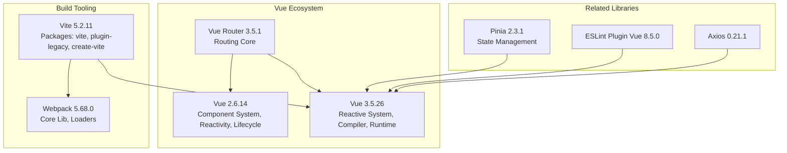

**Section sources**
- [README.md](file://README.md)
- [package.json](file://package.json)

## Core Components
This section outlines the primary subsystems and their roles across Vue, Vite, and Webpack, grounded in observable patterns and documented behaviors.

- Vue Component System (2.x): Emphasizes directives, lifecycle hooks, and component composition via options API and DOM-driven rendering.
- Vue Reactive System (2.x/3.x): Centralized reactivity primitives, watchers, and scheduler mechanics.
- Vue Router: Navigation pipeline, route matching, and navigation guards.
- Vite Build Architecture: Dev server, HMR, plugin system, and module resolution.
- Webpack Bundler: Module graph traversal, loaders, plugins, and optimization passes.
- Supporting Libraries: Pinia for state, ESLint plugin for Vue linting, Axios for HTTP.

**Section sources**
- [vue@2.6.14/组件/](file://源码学习/vue@2.6.14/组件/)
- [vue@2.6.14/响应式/](file://源码学习/vue@2.6.14/响应式/)
- [vue@2.6.14/04.生命周期.html](file://源码学习/vue@2.6.14/04.生命周期.html)
- [vue@2.6.14/03.nextTick.html](file://源码学习/vue@2.6.14/03.nextTick.html)
- [vue@3.5.26/code/](file://源码学习/vue@3.5.26/code/)
- [vue-router@3.5.1/src/](file://源码学习/vue-router@3.5.1/src/)
- [vite@5.2.11/packages/vite/](file://源码学习/vite@5.2.11/packages/vite/)
- [webpack@5.68.0/lib/](file://源码学习/webpack@5.68.0/lib/)
- [pinia-2@2.3.1/packages/pinia/](file://源码学习/pinia-2@2.3.1/packages/pinia/)
- [eslint-plugin-vue@8.5.0/lib/](file://源码学习/eslint-plugin-vue@8.5.0/lib/)
- [axios@0.21.1/lib/](file://源码学习/axios@0.21.1/lib/)

## Architecture Overview
The following diagrams illustrate high-level interactions among core components in Vue, Vite, and Webpack.

### Vue 2.x Component and Lifecycle Architecture
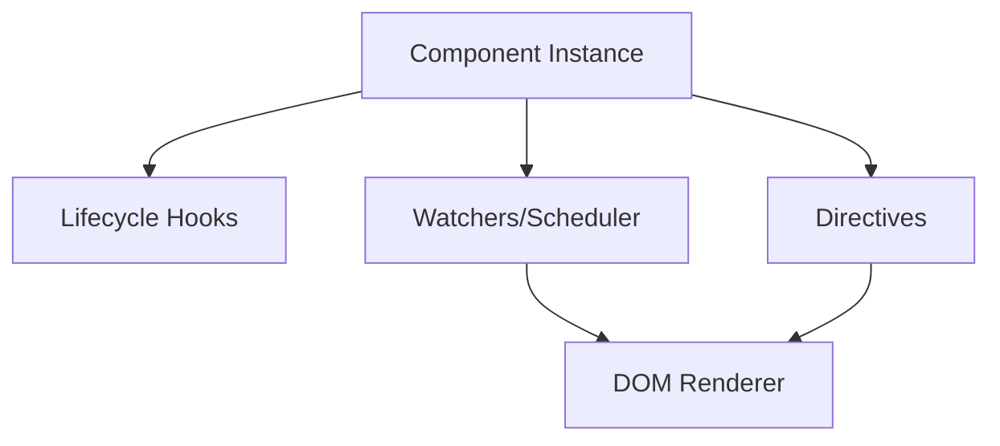

**Diagram sources**
- [vue@2.6.14/04.生命周期.html](file://源码学习/vue@2.6.14/04.生命周期.html)
- [vue@2.6.14/03.nextTick.html](file://源码学习/vue@2.6.14/03.nextTick.html)
- [vue@2.6.14/组件/](file://源码学习/vue@2.6.14/组件/)
- [vue@2.6.14/指令/](file://源码学习/vue@2.6.14/指令/)

### Vue 3.x Reactive and Compiler Architecture
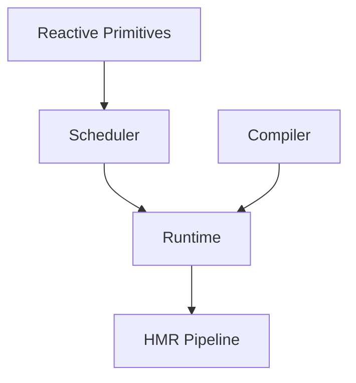

**Diagram sources**
- [vue@3.5.26/code/](file://源码学习/vue@3.5.26/code/)

### Vue Router Navigation Flow
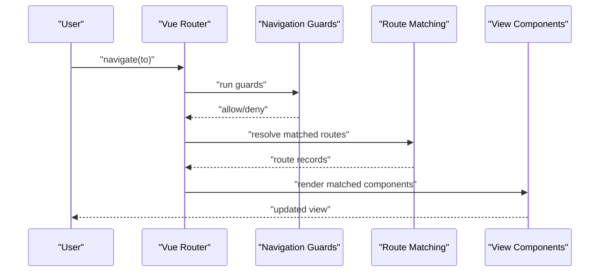

**Diagram sources**
- [vue-router@3.5.1/src/](file://源码学习/vue-router@3.5.1/src/)

### Vite Build and Plugin Architecture
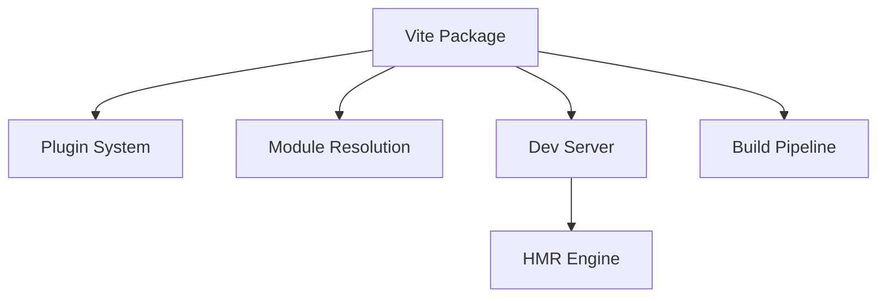

**Diagram sources**
- [vite@5.2.11/packages/vite/](file://源码学习/vite@5.2.11/packages/vite/)
- [vite@5.2.11/packages/plugin-legacy/](file://源码学习/vite@5.2.11/packages/plugin-legacy/)
- [vite@5.2.11/packages/create-vite/](file://源码学习/vite@5.2.11/packages/create-vite/)

### Webpack Bundling and Loader Ecosystem
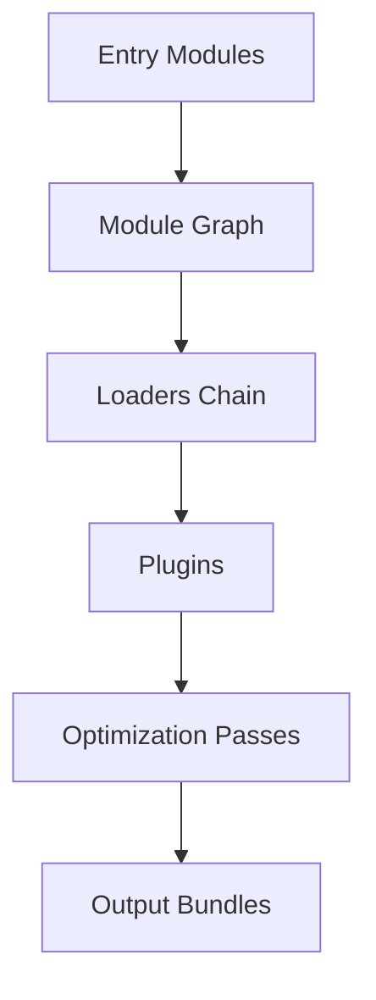

**Diagram sources**
- [webpack@5.68.0/lib/](file://源码学习/webpack@5.68.0/lib/)
- [webpack@5.68.0/loaders/](file://源码学习/webpack@5.68.0/loaders/)

## Detailed Component Analysis

### Vue Component System (2.x)
- Component creation and mounting lifecycle
- Directive registration and update cycles
- Event handling and component communication
- nextTick mechanism for batching DOM updates

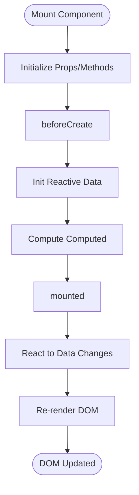

**Diagram sources**
- [vue@2.6.14/04.生命周期.html](file://源码学习/vue@2.6.14/04.生命周期.html)
- [vue@2.6.14/03.nextTick.html](file://源码学习/vue@2.6.14/03.nextTick.html)

**Section sources**
- [vue@2.6.14/组件/](file://源码学习/vue@2.6.14/组件/)
- [vue@2.6.14/指令/](file://源码学习/vue@2.6.14/指令/)
- [vue@2.6.14/04.生命周期.html](file://源码学习/vue@2.6.14/04.生命周期.html)
- [vue@2.6.14/03.nextTick.html](file://源码学习/vue@2.6.14/03.nextTick.html)

### Vue Reactive System (2.x/3.x)
- Vue 2.x: Observer/Dep/Watcher trio for property observation and change propagation
- Vue 3.x: Proxy-based reactivity with scheduler and effect collection

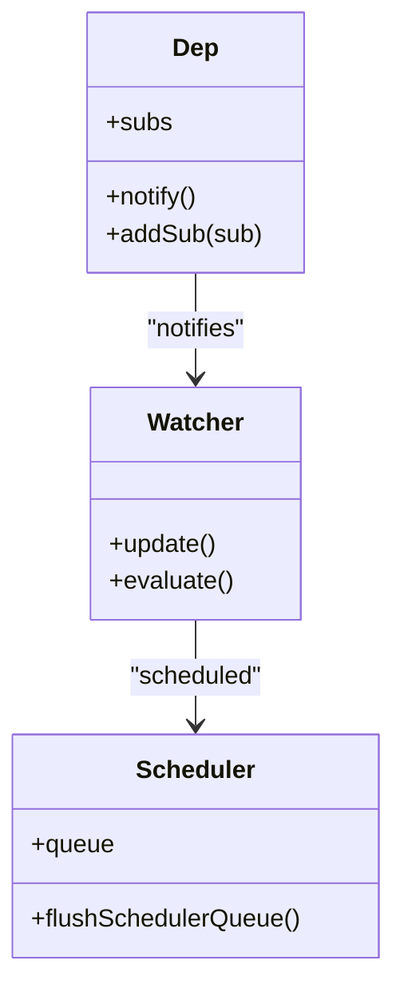

**Diagram sources**
- [vue@2.6.14/响应式/](file://源码学习/vue@2.6.14/响应式/)
- [vue@3.5.26/code/](file://源码学习/vue@3.5.26/code/)

**Section sources**
- [vue@2.6.14/响应式/](file://源码学习/vue@2.6.14/响应式/)
- [vue@3.5.26/code/](file://源码学习/vue@3.5.26/code/)

### Vue Router Internals
- Route matching and navigation guards
- History modes and URL synchronization
- Programmatic navigation and route transitions

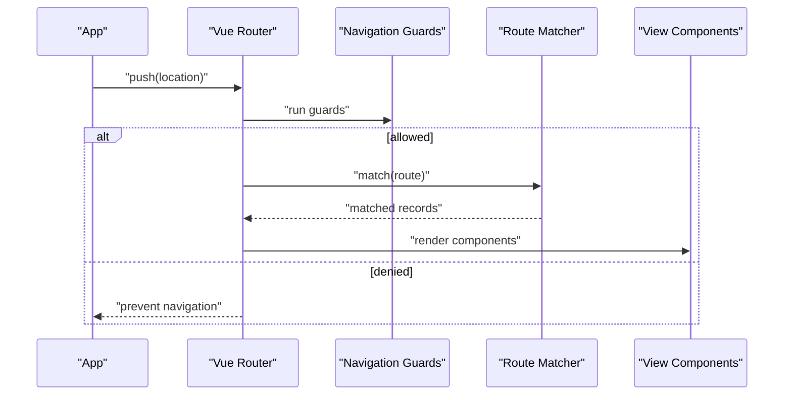

**Diagram sources**
- [vue-router@3.5.1/src/](file://源码学习/vue-router@3.5.1/src/)

**Section sources**
- [vue-router@3.5.1/src/](file://源码学习/vue-router@3.5.1/src/)

### Vite Build Architecture and Plugin System
- Dev server with middleware pipeline and HMR engine
- Plugin hooks for transforming, resolving, and bundling
- Module resolution strategies and pre-bundling

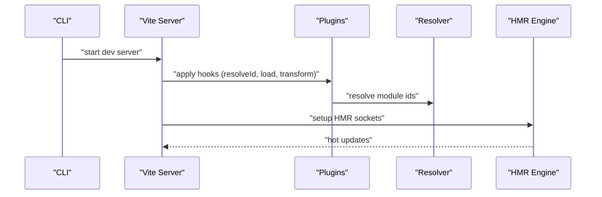

**Diagram sources**
- [vite@5.2.11/packages/vite/](file://源码学习/vite@5.2.11/packages/vite/)
- [vite@5.2.11/packages/plugin-legacy/](file://源码学习/vite@5.2.11/packages/plugin-legacy/)

**Section sources**
- [vite@5.2.11/packages/vite/](file://源码学习/vite@5.2.11/packages/vite/)
- [vite@5.2.11/packages/plugin-legacy/](file://源码学习/vite@5.2.11/packages/plugin-legacy/)

### Webpack Bundling Process and Loader Ecosystem
- Module parsing and dependency graph construction
- Loader chain execution and asset processing
- Plugin hooks for optimization and output generation

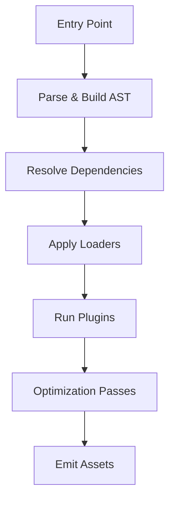

**Diagram sources**
- [webpack@5.68.0/lib/](file://源码学习/webpack@5.68.0/lib/)
- [webpack@5.68.0/loaders/](file://源码学习/webpack@5.68.0/loaders/)

**Section sources**
- [webpack@5.68.0/lib/](file://源码学习/webpack@5.68.0/lib/)
- [webpack@5.68.0/loaders/](file://源码学习/webpack@5.68.0/loaders/)

### Supporting Libraries
- Pinia: Store creation, state and getters, actions, and subscriptions
- ESLint plugin for Vue: Rules for template and script linting
- Axios: Request/response interceptors, adapters, and cancellation

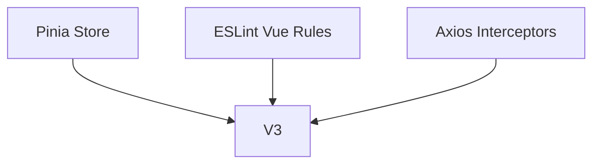

**Diagram sources**
- [pinia-2@2.3.1/packages/pinia/](file://源码学习/pinia-2@2.3.1/packages/pinia/)
- [eslint-plugin-vue@8.5.0/lib/](file://源码学习/eslint-plugin-vue@8.5.0/lib/)
- [axios@0.21.1/lib/](file://源码学习/axios@0.21.1/lib/)

**Section sources**
- [pinia-2@2.3.1/packages/pinia/](file://源码学习/pinia-2@2.3.1/packages/pinia/)
- [eslint-plugin-vue@8.5.0/lib/](file://源码学习/eslint-plugin-vue@8.5.0/lib/)
- [axios@0.21.1/lib/](file://源码学习/axios@0.21.1/lib/)

## Dependency Analysis
This section maps interdependencies among core components and packages.

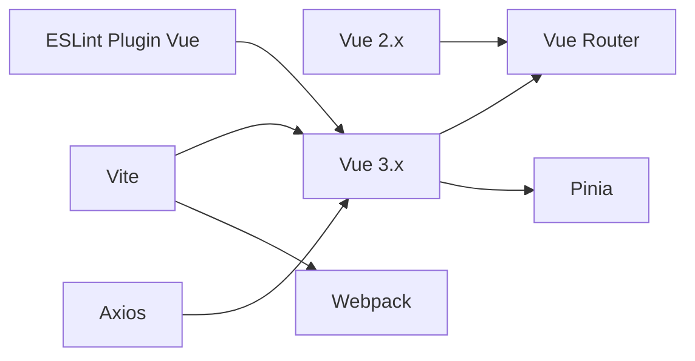

**Diagram sources**
- [vue@2.6.14/vue.js](file://源码学习/vue@2.6.14/vue.js)
- [vue@3.5.26/code/](file://源码学习/vue@3.5.26/code/)
- [vue-router@3.5.1/src/](file://源码学习/vue-router@3.5.1/src/)
- [vite@5.2.11/packages/vite/](file://源码学习/vite@5.2.11/packages/vite/)
- [webpack@5.68.0/lib/](file://源码学习/webpack@5.68.0/lib/)
- [pinia-2@2.3.1/packages/pinia/](file://源码学习/pinia-2@2.3.1/packages/pinia/)
- [eslint-plugin-vue@8.5.0/lib/](file://源码学习/eslint-plugin-vue@8.5.0/lib/)
- [axios@0.21.1/lib/](file://源码学习/axios@0.21.1/lib/)

**Section sources**
- [vue@2.6.14/vue.js](file://源码学习/vue@2.6.14/vue.js)
- [vue@3.5.26/code/](file://源码学习/vue@3.5.26/code/)
- [vue-router@3.5.1/src/](file://源码学习/vue-router@3.5.1/src/)
- [vite@5.2.11/packages/vite/](file://源码学习/vite@5.2.11/packages/vite/)
- [webpack@5.68.0/lib/](file://源码学习/webpack@5.68.0/lib/)
- [pinia-2@2.3.1/packages/pinia/](file://源码学习/pinia-2@2.3.1/packages/pinia/)
- [eslint-plugin-vue@8.5.0/lib/](file://源码学习/eslint-plugin-vue@8.5.0/lib/)
- [axios@0.21.1/lib/](file://源码学习/axios@0.21.1/lib/)

## Performance Considerations
- Vue
  - Prefer computed properties over repeated expressions; leverage watchers efficiently.
  - Use nextTick judiciously to batch DOM updates after multiple reactive changes.
  - In Vue 3, minimize unnecessary reactive scopes and avoid excessive deep reactivity.
- Vite
  - Use plugin ordering strategically; heavy transforms should run closer to the end of the pipeline.
  - Leverage pre-bundling for large dependencies to reduce server startup time.
  - Configure module resolution aliases to avoid redundant path traversals.
- Webpack
  - SplitChunks configuration for optimal code splitting and caching.
  - Use appropriate minimizers and target-specific optimizations.
  - Limit loader scope to only necessary files to reduce parse overhead.

[No sources needed since this section provides general guidance]

## Troubleshooting Guide
- Vue
  - Lifecycle hook timing issues: verify beforeCreate vs mounted sequencing and avoid accessing DOM in beforeCreate.
  - nextTick pitfalls: ensure reactive updates are flushed before DOM assertions.
- Vite
  - Plugin conflicts: adjust order or disable conflicting plugins; verify resolveId precedence.
  - HMR not updating: confirm client-server socket connectivity and transform correctness.
- Webpack
  - Loader chain errors: validate loader order and test with minimal chain.
  - Missing modules: inspect resolve extensions and alias configurations.

**Section sources**
- [vue@2.6.14/04.生命周期.html](file://源码学习/vue@2.6.14/04.生命周期.html)
- [vue@2.6.14/03.nextTick.html](file://源码学习/vue@2.6.14/03.nextTick.html)
- [vite@5.2.11/packages/vite/](file://源码学习/vite@5.2.11/packages/vite/)
- [webpack@5.68.0/lib/](file://源码学习/webpack@5.68.0/lib/)

## Conclusion
Through this analysis, we observe consistent architectural themes across Vue, Vite, and Webpack:
- Vue’s componentization and reactivity enable declarative UI updates with predictable lifecycle hooks.
- Vite’s plugin model and fast dev server streamline modern development workflows.
- Webpack’s loader and plugin ecosystem provides robust bundling and optimization capabilities.

By understanding these patterns and their interactions, developers can contribute effectively to these systems and build scalable applications.

[No sources needed since this section summarizes without analyzing specific files]

## Appendices
- Best Practices
  - Vue: Keep components small, use scoped styles, and leverage built-in directives for common tasks.
  - Vite: Keep plugins focused and ordered; use environment variables thoughtfully.
  - Webpack: Separate vendor and application bundles; configure long-term caching and split points carefully.

[No sources needed since this section provides general guidance]