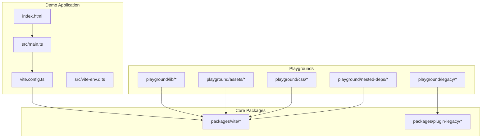
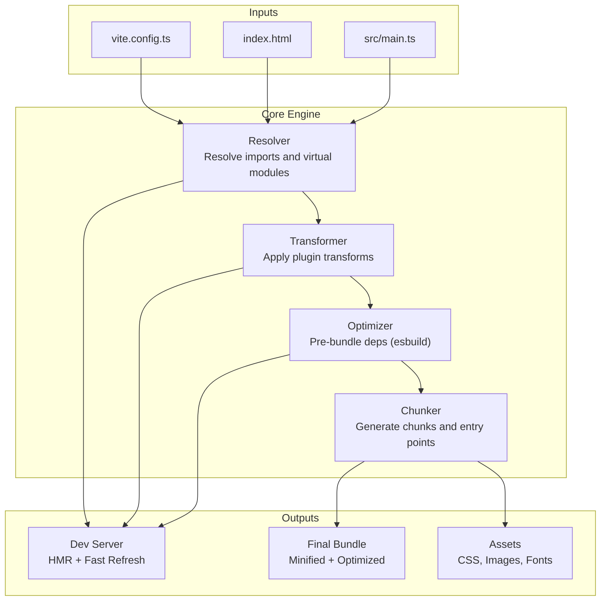
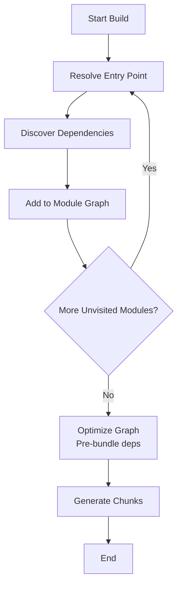
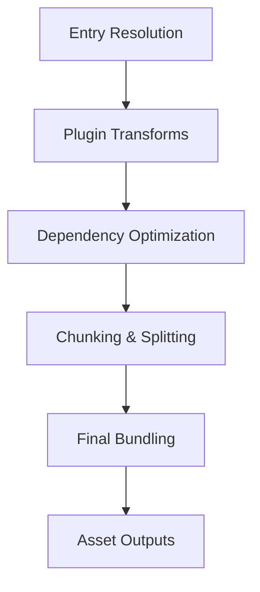
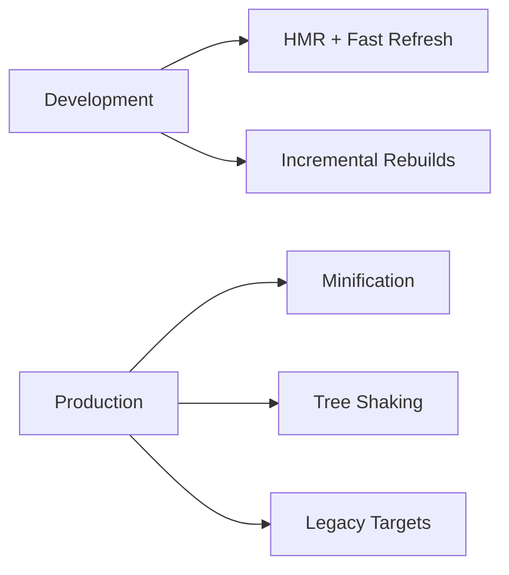
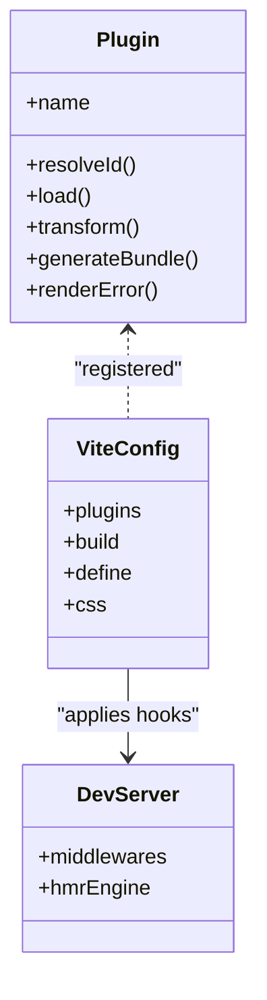
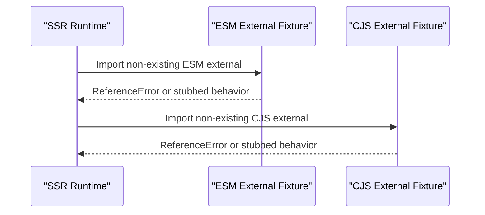
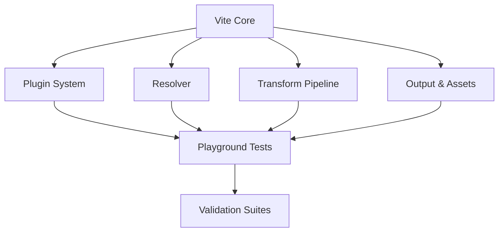

# Build Architecture and Core Concepts

<cite>
**Referenced Files in This Document**
- [README.md](file://README.md)
- [package.json](file://package.json)
- [vite.config.ts](file://demo/my-vue-app/vite.config.ts)
- [main.ts](file://demo/my-vue-app/src/main.ts)
- [vite-env.d.ts](file://demo/my-vue-app/src/vite-env.d.ts)
- [index.html](file://demo/my-vue-app/index.html)
- [playground/lib/__tests__/serve.ts](file://source/playground/lib/__tests__/serve.ts)
- [playground/legacy/__tests__/legacy.spec.ts](file://source/playground/legacy/__tests__/legacy.spec.ts)
- [packages/vite/src/node/ssr/runtime/__tests__/fixtures/cjs-external-non-existing.js](file://source/packages/vite/src/node/ssr/runtime/__tests__/fixtures/cjs-external-non-existing.js)
- [packages/vite/src/node/ssr/runtime/__tests__/fixtures/esm-external-non-existing.js](file://source/packages/vite/src/node/ssr/runtime/__tests__/fixtures/esm-external-non-existing.js)
- [playground/nested-deps/test-package-f/package.json](file://source/playground/nested-deps/test-package-f/package.json)
</cite>

## Table of Contents
1. [Introduction](#introduction)
2. [Project Structure](#project-structure)
3. [Core Components](#core-components)
4. [Architecture Overview](#architecture-overview)
5. [Detailed Component Analysis](#detailed-component-analysis)
6. [Dependency Analysis](#dependency-analysis)
7. [Performance Considerations](#performance-considerations)
8. [Troubleshooting Guide](#troubleshooting-guide)
9. [Conclusion](#conclusion)
10. [Appendices](#appendices)

## Introduction
This document explains Vite’s build architecture and core concepts with a focus on the bundler abstraction layer, module graph construction, and dependency optimization strategies. It documents the build pipeline from module resolution through transformation to final bundling, contrasts development versus production builds, and details the plugin system and its integration with the core build process. Architectural diagrams illustrate data flow and component interactions, and practical guidance is provided for performance, memory management, and scalability.

## Project Structure
At a high level, Vite is organized as a monorepo with multiple packages and extensive playgrounds used for testing and demonstrations. The repository includes:
- A primary package implementing the Vite core
- Supporting packages such as a legacy compatibility plugin
- Extensive playgrounds showcasing various build scenarios (dynamic imports, CSS, legacy targets, library builds, etc.)
- Test suites validating build outputs and runtime behavior

The demo application under demo/my-vue-app illustrates a typical Vite project setup with a configuration file, an entry module, and a basic HTML shell.



**Diagram sources**
- [index.html](file://demo/my-vue-app/index.html)
- [main.ts](file://demo/my-vue-app/src/main.ts)
- [vite.config.ts](file://demo/my-vue-app/vite.config.ts)
- [vite-env.d.ts](file://demo/my-vue-app/src/vite-env.d.ts)
- [playground/lib/__tests__/serve.ts](file://source/playground/lib/__tests__/serve.ts)
- [playground/legacy/__tests__/legacy.spec.ts](file://source/playground/legacy/__tests__/legacy.spec.ts)
- [playground/nested-deps/test-package-f/package.json](file://source/playground/nested-deps/test-package-f/package.json)

**Section sources**
- [README.md](file://README.md)
- [package.json](file://package.json)

## Core Components
- Bundler Abstraction Layer: Vite composes a high-performance dev server and optimized production builds. The core relies on a plugin system to hook into module resolution, transformation, and output generation.
- Module Graph Construction: Vite builds a module graph during build and dev, enabling dependency optimization and code splitting.
- Dependency Optimization Strategies: Vite pre-bundles dependencies (e.g., with esbuild) to accelerate dev startup and HMR.
- Build Pipeline Stages: Resolution → Transformation → Chunking → Bundling → Asset Handling.
- Plugin System: Hooks integrate transformations, virtual modules, and output customization.
- Dev vs Production: Dev emphasizes fast refresh and incremental updates; Production emphasizes minification, tree-shaking, and asset optimization.

These components collectively enable Vite’s “faster and leaner web build tool” philosophy.

**Section sources**
- [README.md](file://README.md)
- [package.json](file://package.json)

## Architecture Overview
The Vite build architecture centers on a plugin-driven pipeline that transforms modules into optimized bundles. The diagram below maps the major components and their interactions.



**Diagram sources**
- [vite.config.ts](file://demo/my-vue-app/vite.config.ts)
- [index.html](file://demo/my-vue-app/index.html)
- [main.ts](file://demo/my-vue-app/src/main.ts)

## Detailed Component Analysis

### Module Graph Construction
Vite constructs a module graph to understand dependencies and optimize loading. The graph enables:
- Dependency pre-bundling
- Dynamic import code splitting
- Tree-shaking in production
- Asset discovery and hashing



**Diagram sources**
- [playground/lib/__tests__/serve.ts](file://source/playground/lib/__tests__/serve.ts)
- [playground/nested-deps/test-package-f/package.json](file://source/playground/nested-deps/test-package-f/package.json)

**Section sources**
- [playground/lib/__tests__/serve.ts](file://source/playground/lib/__tests__/serve.ts)
- [playground/nested-deps/test-package-f/package.json](file://source/playground/nested-deps/test-package-f/package.json)

### Dependency Optimization Strategies
Vite optimizes dependencies to reduce cold-start latency and improve HMR performance:
- Pre-bundle dependencies using a fast bundler to produce optimized ES modules
- Cache pre-bundled modules and invalidate on lockfile or package changes
- Parallelize optimization tasks across packages

```mermaid
sequenceDiagram
participant Dev as "Dev Server"
participant Opt as "Optimizer"
participant Bundler as "Fast Bundler"
participant FS as "File System"
Dev->>Opt : Request pre-bundle for package
Opt->>FS : Check cache and lockfile
FS-->>Opt : Cache hit/miss
Opt->>Bundler : Transform and bundle deps
Bundler-->>Opt : ESM output
Opt-->>Dev : Cached module graph
```

**Diagram sources**
- [playground/legacy/__tests__/legacy.spec.ts](file://source/playground/legacy/__tests__/legacy.spec.ts)

**Section sources**
- [playground/legacy/__tests__/legacy.spec.ts](file://source/playground/legacy/__tests__/legacy.spec.ts)

### Build Pipeline Stages
The pipeline progresses through distinct stages:

1. Initial Module Resolution
   - Resolve entry points and HTML entry modules
   - Map virtual modules and aliases

2. Transformation
   - Apply plugin transforms in order
   - Support for language-specific transforms (e.g., TS, JSX, CSS)

3. Dependency Optimization
   - Pre-bundle dependencies
   - Generate optimized module graph

4. Chunking and Code Splitting
   - Split code by routes, dynamic imports, and shared chunks

5. Final Bundling and Asset Handling
   - Minify and optimize in production
   - Emit assets with hashed filenames and manifests



**Diagram sources**
- [vite.config.ts](file://demo/my-vue-app/vite.config.ts)
- [main.ts](file://demo/my-vue-app/src/main.ts)
- [index.html](file://demo/my-vue-app/index.html)

**Section sources**
- [vite.config.ts](file://demo/my-vue-app/vite.config.ts)
- [main.ts](file://demo/my-vue-app/src/main.ts)
- [index.html](file://demo/my-vue-app/index.html)

### Development vs Production Builds
- Development
  - Fast refresh and HMR
  - Incremental rebuilds
  - Minimal transforms to speed up feedback loops
- Production
  - Aggressive minification and tree-shaking
  - Asset inlining or extraction based on configuration
  - Legacy target support via dedicated plugins



**Diagram sources**
- [playground/legacy/__tests__/legacy.spec.ts](file://source/playground/legacy/__tests__/legacy.spec.ts)

**Section sources**
- [playground/legacy/__tests__/legacy.spec.ts](file://source/playground/legacy/__tests__/legacy.spec.ts)

### Plugin System Architecture
Vite’s plugin system integrates via hooks that intercept:
- Module resolution
- Load and transform
- Build output and asset emission
- SSR and dev server behavior



**Diagram sources**
- [vite.config.ts](file://demo/my-vue-app/vite.config.ts)

**Section sources**
- [vite.config.ts](file://demo/my-vue-app/vite.config.ts)

### SSR Runtime Behavior and External Modules
Vite supports SSR with runtime fixtures that demonstrate external module handling for both ESM and CJS contexts.



**Diagram sources**
- [packages/vite/src/node/ssr/runtime/__tests__/fixtures/esm-external-non-existing.js](file://source/packages/vite/src/node/ssr/runtime/__tests__/fixtures/esm-external-non-existing.js)
- [packages/vite/src/node/ssr/runtime/__tests__/fixtures/cjs-external-non-existing.js](file://source/packages/vite/src/node/ssr/runtime/__tests__/fixtures/cjs-external-non-existing.js)

**Section sources**
- [packages/vite/src/node/ssr/runtime/__tests__/fixtures/esm-external-non-existing.js](file://source/packages/vite/src/node/ssr/runtime/__tests__/fixtures/esm-external-non-existing.js)
- [packages/vite/src/node/ssr/runtime/__tests__/fixtures/cjs-external-non-existing.js](file://source/packages/vite/src/node/ssr/runtime/__tests__/fixtures/cjs-external-non-existing.js)

## Dependency Analysis
Vite’s dependency relationships emphasize modularity and separation of concerns:
- Core engine depends on plugin APIs and resolver logic
- Playgrounds exercise real-world scenarios (dynamic imports, CSS, legacy)
- Tests validate build outputs and runtime behavior



**Diagram sources**
- [playground/lib/__tests__/serve.ts](file://source/playground/lib/__tests__/serve.ts)
- [playground/legacy/__tests__/legacy.spec.ts](file://source/playground/legacy/__tests__/legacy.spec.ts)

**Section sources**
- [playground/lib/__tests__/serve.ts](file://source/playground/lib/__tests__/serve.ts)
- [playground/legacy/__tests__/legacy.spec.ts](file://source/playground/legacy/__tests__/legacy.spec.ts)

## Performance Considerations
- Dependency Pre-bundling: Reduce cold-start latency by caching optimized dependencies.
- Parallelization: Optimize multiple packages concurrently.
- Incremental Builds: Invalidate only changed modules in development.
- Asset Optimization: Inline small assets, extract larger ones, and leverage hashing for cache busting.
- Memory Management: Avoid retaining large intermediate graphs; stream outputs where possible.
- Scalability: Use worker threads or separate processes for heavy tasks; shard large projects into smaller entry points.

[No sources needed since this section provides general guidance]

## Troubleshooting Guide
Common issues and remedies:
- Unexpected external module errors in SSR: Verify fixture expectations and ensure proper stubbing for non-existing modules.
- Legacy build artifacts: Confirm legacy plugin configuration and minification settings.
- Library builds: Validate multiple outputs and helpers injection behavior.

**Section sources**
- [packages/vite/src/node/ssr/runtime/__tests__/fixtures/esm-external-non-existing.js](file://source/packages/vite/src/node/ssr/runtime/__tests__/fixtures/esm-external-non-existing.js)
- [packages/vite/src/node/ssr/runtime/__tests__/fixtures/cjs-external-non-existing.js](file://source/packages/vite/src/node/ssr/runtime/__tests__/fixtures/cjs-external-non-existing.js)
- [playground/legacy/__tests__/legacy.spec.ts](file://source/playground/legacy/__tests__/legacy.spec.ts)
- [playground/lib/__tests__/serve.ts](file://source/playground/lib/__tests__/serve.ts)

## Conclusion
Vite’s architecture balances developer ergonomics with production performance through a modular plugin system, efficient module graph construction, and targeted dependency optimization. By understanding the build pipeline and leveraging the plugin hooks, teams can tailor Vite to diverse project needs while maintaining fast feedback and optimized outputs.

[No sources needed since this section summarizes without analyzing specific files]

## Appendices
- Example configuration and entry points are present in the demo application for quick reference.

**Section sources**
- [vite.config.ts](file://demo/my-vue-app/vite.config.ts)
- [main.ts](file://demo/my-vue-app/src/main.ts)
- [vite-env.d.ts](file://demo/my-vue-app/src/vite-env.d.ts)
- [index.html](file://demo/my-vue-app/index.html)