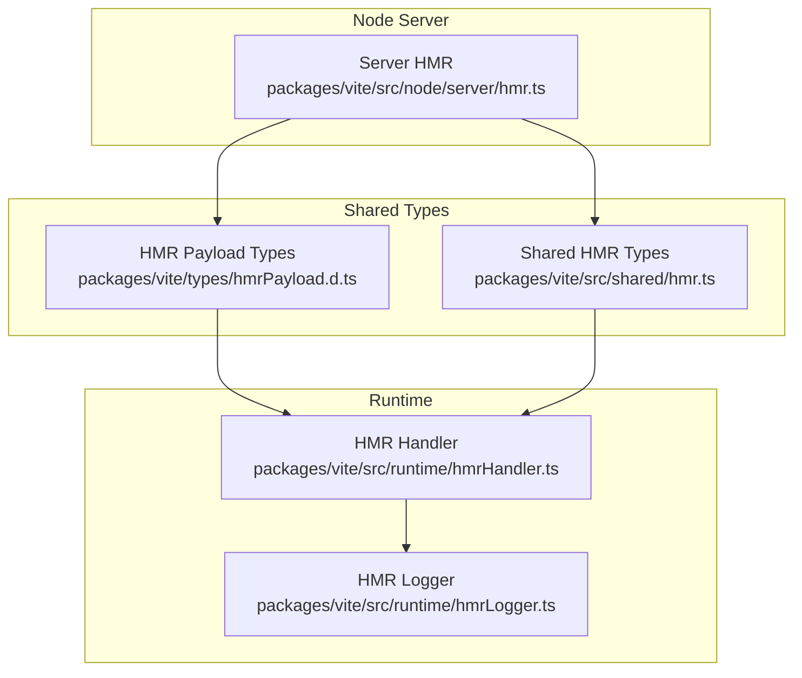
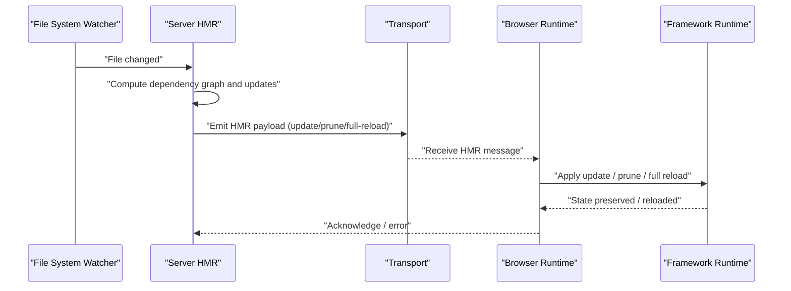
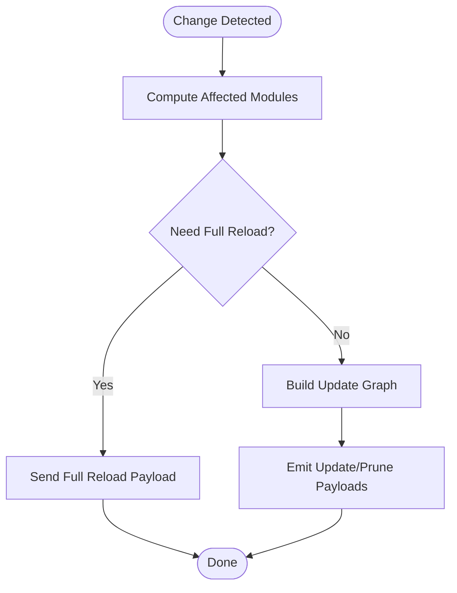
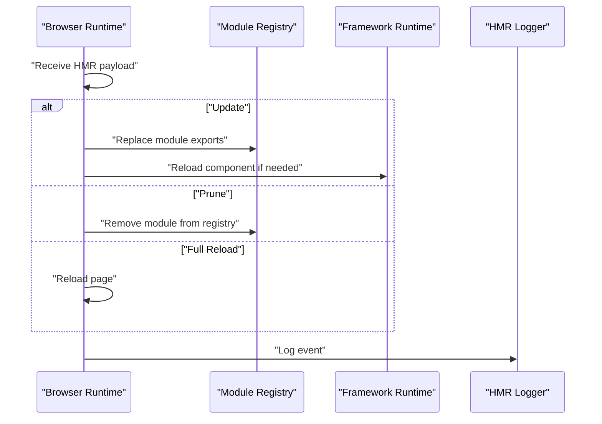
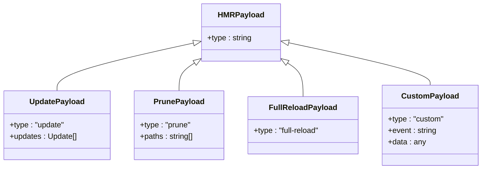
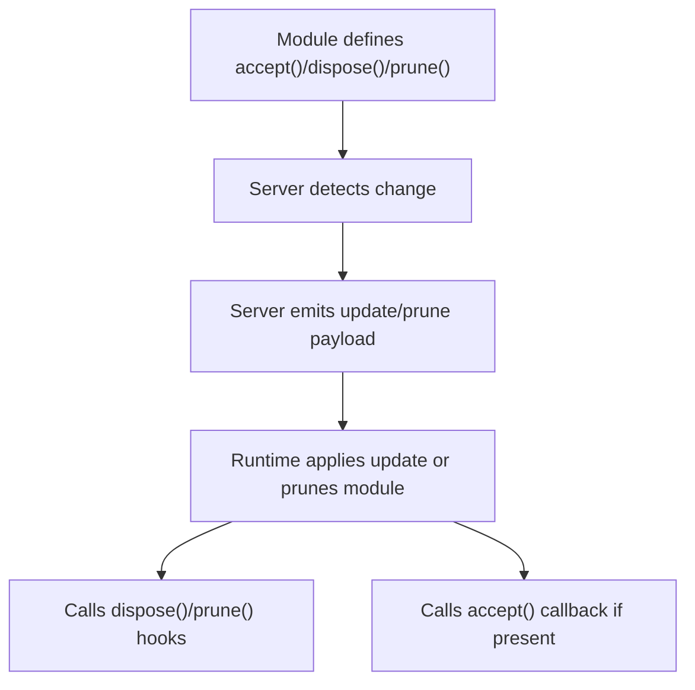
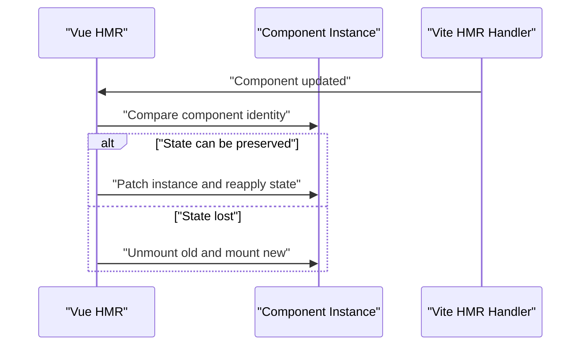
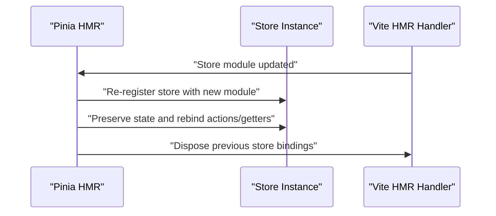
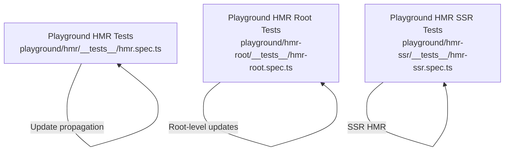
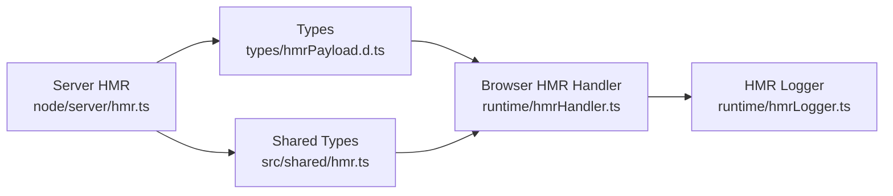

# Hot Module Replacement Implementation

<cite>
**Referenced Files in This Document**
- [hmr.ts](file://源码学习/vite@5.2.11/packages/vite/src/node/server/hmr.ts)
- [hmrHandler.ts](file://源码学习/vite@5.2.11/packages/vite/src/runtime/hmrHandler.ts)
- [hmrLogger.ts](file://源码学习/vite@5.2.11/packages/vite/src/runtime/hmrLogger.ts)
- [hmr.ts](file://源码学习/vite@5.2.11/packages/vite/src/shared/hmr.ts)
- [hmrPayload.d.ts](file://源码学习/vite@5.2.11/packages/vite/types/hmrPayload.d.ts)
- [hmr.spec.ts](file://源码学习/vite@5.2.11/playground/hmr/__tests__/hmr.spec.ts)
- [hmr.ts](file://源码学习/vite@5.2.11/playground/hmr/hmr.ts)
- [hmrRoot.spec.ts](file://源码学习/vite@5.2.11/playground/hmr-root/__tests__/hmr-root.spec.ts)
- [hmr-ssr.spec.ts](file://源码学习/vite@5.2.11/playground/hmr-ssr/__tests__/hmr-ssr.spec.ts)
- [hmr.ts](file://源码学习/vite@5.2.11/playground/hmr-ssr/hmr.ts)
- [hmr.ts](file://源码学习/vue@3.5.26/code/packages/runtime-core/src/hmr.ts)
- [hmr.spec.ts](file://源码学习/vue@3.5.26/code/packages/runtime-core/__tests__/hmr.spec.ts)
- [hmr.ts](file://源码学习/pinia-2@2.3.1/packages/pinia/src/hmr.ts)
- [pinia.d.ts](file://源码学习/pinia-2@2.3.1/packages/pinia/dist/pinia.d.ts)
- [hmr.spec.ts](file://源码学习/pinia-2@2.3.1/packages/pinia/__tests__/hmr.spec.ts)
</cite>

## Table of Contents
1. [Introduction](#introduction)
2. [Project Structure](#project-structure)
3. [Core Components](#core-components)
4. [Architecture Overview](#architecture-overview)
5. [Detailed Component Analysis](#detailed-component-analysis)
6. [Dependency Analysis](#dependency-analysis)
7. [Performance Considerations](#performance-considerations)
8. [Troubleshooting Guide](#troubleshooting-guide)
9. [Conclusion](#conclusion)
10. [Appendices](#appendices)

## Introduction
This document explains Vite’s Hot Module Replacement (HMR) implementation with a focus on the HMR protocol, client–server communication, and module update propagation. It documents the HMR runtime, including module acceptance, dependency tracking, and state preservation strategies. It also covers HMR integration with frameworks such as Vue and Pinia, details the HMR API surface (accept, prune, dispose), error handling and fallbacks, performance optimizations, practical configuration and debugging techniques, and best practices for maintaining application state during hot updates.

## Project Structure
Vite’s HMR implementation spans three primary areas:
- Node server: responsible for detecting file changes, preparing update payloads, and pushing updates to clients.
- Runtime: injected into the browser to receive updates, apply changes, and coordinate framework-specific logic.
- Shared types and payloads: define the wire protocol exchanged between server and client.

**Diagram sources**
- [hmr.ts](file://源码学习/vite@5.2.11/packages/vite/src/node/server/hmr.ts)
- [hmrHandler.ts](file://源码学习/vite@5.2.11/packages/vite/src/runtime/hmrHandler.ts)
- [hmrLogger.ts](file://源码学习/vite@5.2.11/packages/vite/src/runtime/hmrLogger.ts)
- [hmrPayload.d.ts](file://源码学习/vite@5.2.11/packages/vite/types/hmrPayload.d.ts)
- [hmr.ts](file://源码学习/vite@5.2.11/packages/vite/src/shared/hmr.ts)

**Section sources**
- [hmr.ts](file://源码学习/vite@5.2.11/packages/vite/src/node/server/hmr.ts)
- [hmrHandler.ts](file://源码学习/vite@5.2.11/packages/vite/src/runtime/hmrHandler.ts)
- [hmrLogger.ts](file://源码学习/vite@5.2.11/packages/vite/src/runtime/hmrLogger.ts)
- [hmrPayload.d.ts](file://源码学习/vite@5.2.11/packages/vite/types/hmrPayload.d.ts)
- [hmr.ts](file://源码学习/vite@5.2.11/packages/vite/src/shared/hmr.ts)

## Core Components
- Server HMR: Detects module updates, computes dependency graphs, and emits update payloads to clients.
- HMR Handler: Receives and applies updates in the browser, coordinates with framework runtimes.
- HMR Logger: Provides structured logging for HMR events and errors.
- Shared HMR Types: Define the HMR payload contract and shared constants.
- Playground Tests: Demonstrate real-world HMR scenarios and edge cases.

Key responsibilities:
- Protocol: Defines payload shapes for full reload, prune, update, and custom events.
- Client–server transport: Uses WebSocket-like transport semantics via Vite’s internal transport.
- Module acceptance: Tracks accepted modules and their dependencies to propagate updates efficiently.
- State preservation: Coordinates with framework-specific logic to retain application state during updates.

**Section sources**
- [hmr.ts](file://源码学习/vite@5.2.11/packages/vite/src/node/server/hmr.ts)
- [hmrHandler.ts](file://源码学习/vite@5.2.11/packages/vite/src/runtime/hmrHandler.ts)
- [hmrLogger.ts](file://源码学习/vite@5.2.11/packages/vite/src/runtime/hmrLogger.ts)
- [hmrPayload.d.ts](file://源码学习/vite@5.2.11/packages/vite/types/hmrPayload.d.ts)
- [hmr.ts](file://源码学习/vite@5.2.11/packages/vite/src/shared/hmr.ts)

## Architecture Overview
The HMR architecture consists of:
- Server-side change detection and update computation.
- Transport of HMR payloads to the browser.
- Runtime application of updates and coordination with framework-specific logic.

**Diagram sources**
- [hmr.ts](file://源码学习/vite@5.2.11/packages/vite/src/node/server/hmr.ts)
- [hmrHandler.ts](file://源码学习/vite@5.2.11/packages/vite/src/runtime/hmrHandler.ts)
- [hmrPayload.d.ts](file://源码学习/vite@5.2.11/packages/vite/types/hmrPayload.d.ts)

## Detailed Component Analysis

### Server HMR
Responsibilities:
- Track module graph and compute affected modules after a change.
- Emit update payloads (full reload, prune, update) to clients.
- Manage connection lifecycle and error reporting.

Key behaviors:
- Acceptance tracking: Maintains a registry of modules that have declared acceptance of updates.
- Dependency propagation: Traverses the dependency graph to determine which modules must be pruned or reloaded.
- Payload generation: Constructs typed payloads conforming to the HMR payload contract.

**Diagram sources**
- [hmr.ts](file://源码学习/vite@5.2.11/packages/vite/src/node/server/hmr.ts)
- [hmrPayload.d.ts](file://源码学习/vite@5.2.11/packages/vite/types/hmrPayload.d.ts)

**Section sources**
- [hmr.ts](file://源码学习/vite@5.2.11/packages/vite/src/node/server/hmr.ts)

### HMR Handler (Browser Runtime)
Responsibilities:
- Receive HMR messages and route them to appropriate handlers.
- Apply updates, prune stale modules, and trigger framework-specific reload logic.
- Integrate with framework runtimes (e.g., Vue) to preserve component state.

Key behaviors:
- Update application: Replace module exports and re-instantiate components where necessary.
- Prune modules: Remove stale module references from the module registry.
- Custom events: Dispatch and listen to custom HMR events for advanced integrations.

**Diagram sources**
- [hmrHandler.ts](file://源码学习/vite@5.2.11/packages/vite/src/runtime/hmrHandler.ts)
- [hmrLogger.ts](file://源码学习/vite@5.2.11/packages/vite/src/runtime/hmrLogger.ts)

**Section sources**
- [hmrHandler.ts](file://源码学习/vite@5.2.11/packages/vite/src/runtime/hmrHandler.ts)
- [hmrLogger.ts](file://源码学习/vite@5.2.11/packages/vite/src/runtime/hmrLogger.ts)

### HMR Payload Contract
Defines the shape of messages exchanged between server and client:
- Update: Indicates a module or its dependencies were updated.
- Prune: Indicates a module should be removed from the module registry.
- Full reload: Indicates the entire page should be reloaded.
- Custom: Allows plugins and frameworks to emit custom events.

**Diagram sources**
- [hmrPayload.d.ts](file://源码学习/vite@5.2.11/packages/vite/types/hmrPayload.d.ts)

**Section sources**
- [hmrPayload.d.ts](file://源码学习/vite@5.2.11/packages/vite/types/hmrPayload.d.ts)

### HMR API Surface
The HMR runtime exposes functions that modules can use to participate in hot updates:
- accept(): Declares that a module accepts updates and optionally specifies a callback to handle updates.
- prune(): Registers a cleanup function invoked when a module is pruned.
- dispose(): Registers a disposal function invoked when a module is being disposed.

Integration patterns:
- Frameworks (e.g., Vue) wrap these APIs to preserve component state and re-mount components safely.
- Libraries (e.g., Pinia) integrate HMR to preserve stores and subscriptions.

**Diagram sources**
- [hmrHandler.ts](file://源码学习/vite@5.2.11/packages/vite/src/runtime/hmrHandler.ts)
- [hmr.ts](file://源码学习/vite@5.2.11/packages/vite/src/shared/hmr.ts)

**Section sources**
- [hmr.ts](file://源码学习/vite@5.2.11/packages/vite/src/shared/hmr.ts)

### Framework Integrations

#### Vue HMR
Vue’s runtime implements HMR to preserve component state across updates:
- Component records are created and reloaded when templates or scripts change.
- HMR checks component identity and attempts to preserve state where possible.

**Diagram sources**
- [hmr.ts](file://源码学习/vue@3.5.26/code/packages/runtime-core/src/hmr.ts)
- [hmr.spec.ts](file://源码学习/vue@3.5.26/code/packages/runtime-core/__tests__/hmr.spec.ts)

**Section sources**
- [hmr.ts](file://源码学习/vue@3.5.26/code/packages/runtime-core/src/hmr.ts)
- [hmr.spec.ts](file://源码学习/vue@3.5.26/code/packages/runtime-core/__tests__/hmr.spec.ts)

#### Pinia HMR
Pinia integrates with HMR to preserve store state:
- Provides an acceptHMRUpdate helper to register store updates.
- Hooks into dispose/prune to clean up subscriptions and listeners.

**Diagram sources**
- [hmr.ts](file://源码学习/pinia-2@2.3.1/packages/pinia/src/hmr.ts)
- [pinia.d.ts](file://源码学习/pinia-2@2.3.1/packages/pinia/dist/pinia.d.ts)
- [hmr.spec.ts](file://源码学习/pinia-2@2.3.1/packages/pinia/__tests__/hmr.spec.ts)

**Section sources**
- [hmr.ts](file://源码学习/pinia-2@2.3.1/packages/pinia/src/hmr.ts)
- [pinia.d.ts](file://源码学习/pinia-2@2.3.1/packages/pinia/dist/pinia.d.ts)
- [hmr.spec.ts](file://源码学习/pinia-2@2.3.1/packages/pinia/__tests__/hmr.spec.ts)

### Practical Examples and Playgrounds
Real-world HMR scenarios are demonstrated in Vite’s playgrounds:
- Basic HMR tests show update propagation and dependency handling.
- Root HMR tests demonstrate HMR behavior at the application root.
- SSR HMR tests show how HMR behaves in SSR environments.

**Diagram sources**
- [hmr.spec.ts](file://源码学习/vite@5.2.11/playground/hmr/__tests__/hmr.spec.ts)
- [hmrRoot.spec.ts](file://源码学习/vite@5.2.11/playground/hmr-root/__tests__/hmr-root.spec.ts)
- [hmr-ssr.spec.ts](file://源码学习/vite@5.2.11/playground/hmr-ssr/__tests__/hmr-ssr.spec.ts)

**Section sources**
- [hmr.spec.ts](file://源码学习/vite@5.2.11/playground/hmr/__tests__/hmr.spec.ts)
- [hmrRoot.spec.ts](file://源码学习/vite@5.2.11/playground/hmr-root/__tests__/hmr-root.spec.ts)
- [hmr-ssr.spec.ts](file://源码学习/vite@5.2.11/playground/hmr-ssr/__tests__/hmr-ssr.spec.ts)

## Dependency Analysis
HMR components depend on each other as follows:
- Server HMR depends on shared HMR types and emits payloads conforming to the HMR payload contract.
- Browser HMR Handler consumes payloads and interacts with framework runtimes.
- HMR Logger provides diagnostics for HMR events.

**Diagram sources**
- [hmr.ts](file://源码学习/vite@5.2.11/packages/vite/src/node/server/hmr.ts)
- [hmrPayload.d.ts](file://源码学习/vite@5.2.11/packages/vite/types/hmrPayload.d.ts)
- [hmr.ts](file://源码学习/vite@5.2.11/packages/vite/src/shared/hmr.ts)
- [hmrHandler.ts](file://源码学习/vite@5.2.11/packages/vite/src/runtime/hmrHandler.ts)
- [hmrLogger.ts](file://源码学习/vite@5.2.11/packages/vite/src/runtime/hmrLogger.ts)

**Section sources**
- [hmr.ts](file://源码学习/vite@5.2.11/packages/vite/src/node/server/hmr.ts)
- [hmrPayload.d.ts](file://源码学习/vite@5.2.11/packages/vite/types/hmrPayload.d.ts)
- [hmr.ts](file://源码学习/vite@5.2.11/packages/vite/src/shared/hmr.ts)
- [hmrHandler.ts](file://源码学习/vite@5.2.11/packages/vite/src/runtime/hmrHandler.ts)
- [hmrLogger.ts](file://源码学习/vite@5.2.11/packages/vite/src/runtime/hmrLogger.ts)

## Performance Considerations
- Minimize unnecessary full reloads by narrowing module boundaries and leveraging fine-grained updates.
- Prefer targeted updates over full reloads to reduce network overhead and preserve UI state.
- Use custom HMR events sparingly to avoid excessive logging and processing.
- Keep dependency graphs shallow to reduce traversal costs during update propagation.
- Avoid heavy initialization in modules that frequently update; defer to lazy initialization or accept callbacks.

[No sources needed since this section provides general guidance]

## Troubleshooting Guide
Common issues and resolutions:
- Full reload loops: Occur when a module continuously triggers updates. Narrow acceptance scopes and ensure accept callbacks do not re-invoke updates.
- Stale module references: Use prune hooks to clean up resources and prevent memory leaks.
- Framework-specific state loss: Ensure framework HMR integrations are enabled and configured correctly.
- Logging and diagnostics: Use the HMR logger to inspect payloads and event sequences.

**Section sources**
- [hmrLogger.ts](file://源码学习/vite@5.2.11/packages/vite/src/runtime/hmrLogger.ts)
- [hmrHandler.ts](file://源码学习/vite@5.2.11/packages/vite/src/runtime/hmrHandler.ts)

## Conclusion
Vite’s HMR implementation provides a robust, extensible protocol for hot updates. By combining precise update propagation, framework-aware state preservation, and clear runtime hooks, it enables rapid iteration without sacrificing user experience. Proper configuration, careful use of accept/prune/dispose, and attention to dependency boundaries are essential for reliable HMR behavior.

[No sources needed since this section summarizes without analyzing specific files]

## Appendices

### Appendix A: HMR Payload Shapes
- Update: carries an array of update items indicating which modules changed and how.
- Prune: carries a list of module paths to remove from the registry.
- Full reload: indicates a complete page reload is required.
- Custom: allows plugins and frameworks to emit domain-specific events.

**Section sources**
- [hmrPayload.d.ts](file://源码学习/vite@5.2.11/packages/vite/types/hmrPayload.d.ts)

### Appendix B: Example Workflows
- Basic module update: A single module changes; server computes minimal updates; client replaces exports and re-initializes where necessary.
- Dependency chain update: A deeply nested dependency changes; server traverses the graph and emits prune/update payloads; client applies changes in order.
- Full reload fallback: When updates cannot be applied safely, server sends a full reload payload; client refreshes the page.

**Section sources**
- [hmr.spec.ts](file://源码学习/vite@5.2.11/playground/hmr/__tests__/hmr.spec.ts)
- [hmrRoot.spec.ts](file://源码学习/vite@5.2.11/playground/hmr-root/__tests__/hmr-root.spec.ts)
- [hmr-ssr.spec.ts](file://源码学习/vite@5.2.11/playground/hmr-ssr/__tests__/hmr-ssr.spec.ts)