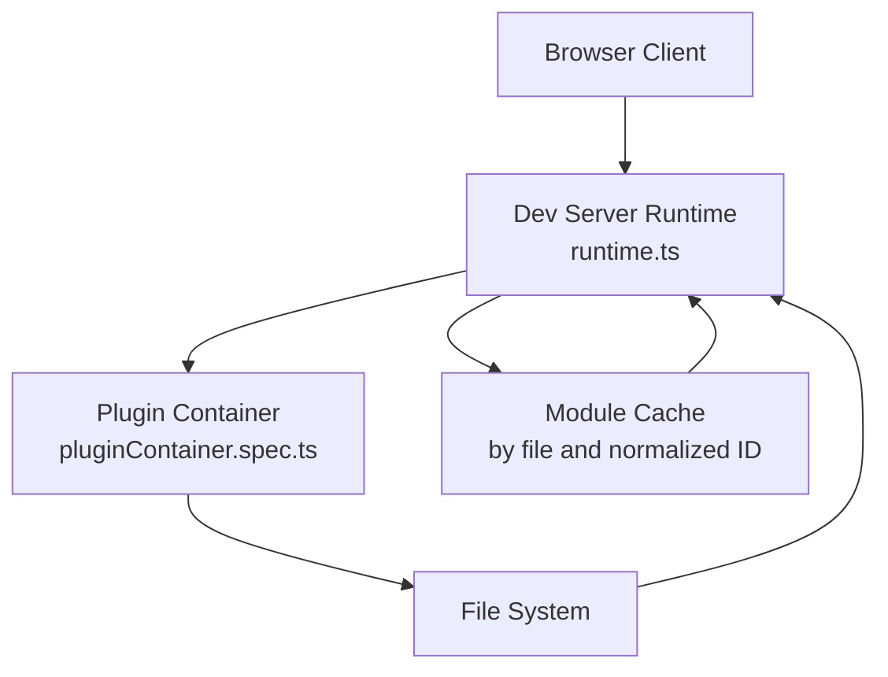
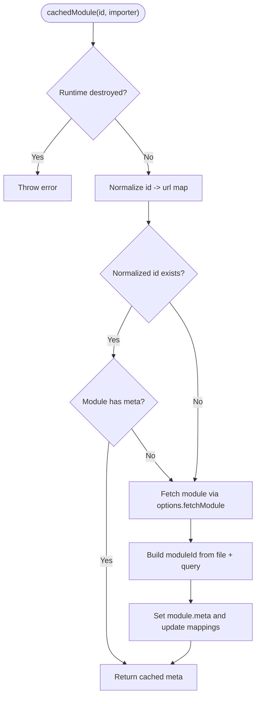
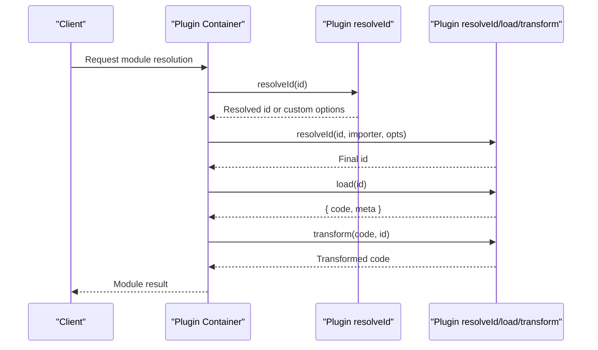
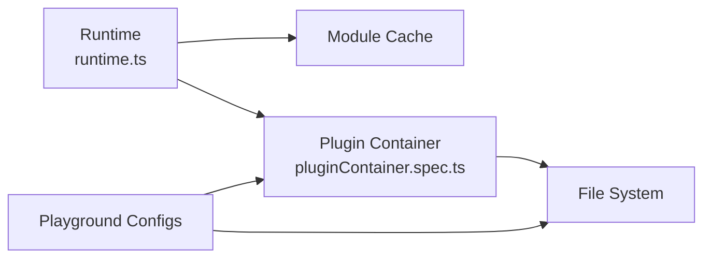

# Module Resolution and Dependency Management

<cite>
**Referenced Files in This Document**
- [runtime.ts](file://源码学习/vite@5.2.11/packages/vite/src/runtime/runtime.ts)
- [pluginContainer.spec.ts](file://源码学习/vite@5.2.11/packages/vite/src/node/server/__tests__/pluginContainer.spec.ts)
- [vite.config.ts](file://demo/my-vue-app/vite.config.ts)
- [vite.config.ts](file://源码学习/vite@5.2.11/playground/alias/vite.config.js)
- [vite.config.ts](file://源码学习/vite@5.2.11/playground/assets/vite.config.js)
- [vite.config.ts](file://源码学习/vite@5.2.11/playground/build-old/vite.config.js)
- [vite.config.ts](file://源码学习/vite@5.2.11/playground/css/vite.config.js)
- [vite.config.ts](file://源码学习/vite@5.2.11/playground/dynamic-import/vite.config.js)
- [vite.config.ts](file://源码学习/vite@5.2.11/playground/env/vite.config.js)
- [vite.config.ts](file://源码学习/vite@5.2.11/playground/external/vite.config.js)
- [vite.config.ts](file://源码学习/vite@5.2.11/playground/fs-serve/vite.config.js)
- [vite.config.ts](file://源码学习/vite@5.2.11/playground/glob-import/vite.config.js)
- [vite.config.ts](file://源码学习/vite@5.2.11/playground/hmr/vite.config.js)
- [vite.config.ts](file://源码学习/vite@5.2.11/playground/import-assertion/vite.config.js)
- [vite.config.ts](file://源码学习/vite@5.2.11/playground/js-sourcemap/vite.config.js)
- [vite.config.ts](file://源码学习/vite@5.2.11/playground/json/vite.config.js)
- [vite.config.ts](file://源码学习/vite@5.2.11/playground/legacy/vite.config.js)
- [vite.config.ts](file://源码学习/vite@5.2.11/playground/lib/vite.config.js)
- [vite.config.ts](file://源码学习/vite@5.2.11/playground/minify/vite.config.js)
- [vite.config.ts](file://源码学习/vite@5.2.11/playground/module-graph/vite.config.js)
- [vite.config.ts](file://源码学习/vite@5.2.11/playground/multiple-entrypoints/vite.config.js)
- [vite.config.ts](file://源码学习/vite@5.2.11/playground/nested-deps/vite.config.js)
- [vite.config.ts](file://源码学习/vite@5.2.11/playground/object-hooks/vite.config.js)
- [vite.config.ts](file://源码学习/vite@5.2.11/playground/define/vite.config.js)
- [vite.config.ts](file://源码学习/vite@5.2.11/playground/dynamic-import-inline/vite.config.js)
- [vite.config.ts](file://源码学习/vite@5.2.11/playground/html/vite.config.js)
- [vite.config.ts](file://源码学习/vite@5.2.11/playground/csp/vite.config.js)
- [vite.config.ts](file://源码学习/vite@5.2.11/playground/data-uri/vite.config.js)
- [vite.config.ts](file://源码学习/vite@5.2.11/playground/define/vite.config.js)
- [vite.config.ts](file://源码学习/vite@5.2.11/playground/cli/vite.config.js)
- [vite.config.ts](file://源码学习/vite@5.2.11/playground/cli-module/vite.config.js)
- [vite.config.ts](file://源码学习/vite@5.2.11/playground/backend-integration/vite.config.js)
- [vite.config.ts](file://源码学习/vite@5.2.11/playground/css-codesplit/vite.config.js)
- [vite.config.ts](file://源码学习/vite@5.2.11/playground/css-codesplit-cjs/vite.config.js)
- [vite.config.ts](file://源码学习/vite@5.2.11/playground/css-dynamic-import/vite.config.js)
- [vite.config.ts](file://源码学习/vite@5.2.11/playground/css-lightningcss/vite.config.js)
- [vite.config.ts](file://源码学习/vite@5.2.11/playground/css-lightningcss-proxy/vite.config.js)
- [vite.config.ts](file://源码学习/vite@5.2.11/playground/css-no-codesplit/vite.config.js)
- [vite.config.ts](file://源码学习/vite@5.2.11/playground/css-sourcemap/vite.config.js)
- [vite.config.ts](file://源码学习/vite@5.2.11/playground/define/vite.config.js)
- [vite.config.ts](file://源码学习/vite@5.2.11/playground/env-nested/vite.config.js)
- [vite.config.ts](file://源码学习/vite@5.2.11/playground/external/vite.config.js)
- [vite.config.ts](file://源码学习/vite@5.2.11/playground/fs-serve/vite.config.js)
- [vite.config.ts](file://源码学习/vite@5.2.11/playground/glob-import/vite.config.js)
- [vite.config.ts](file://源码学习/vite@5.2.11/playground/hmr-root/vite.config.js)
- [vite.config.ts](file://源码学习/vite@5.2.11/playground/hmr-ssr/vite.config.js)
- [vite.config.ts](file://源码学习/vite@5.2.11/playground/html/vite.config.js)
- [vite.config.ts](file://源码学习/vite@5.2.11/playground/import-assertion/vite.config.js)
- [vite.config.ts](file://源码学习/vite@5.2.11/playground/js-sourcemap/vite.config.js)
- [vite.config.ts](file://源码学习/vite@5.2.11/playground/json/vite.config.js)
- [vite.config.ts](file://源码学习/vite@5.2.11/playground/legacy/vite.config.js)
- [vite.config.ts](file://源码学习/vite@5.2.11/playground/lib/vite.config.js)
- [vite.config.ts](file://源码学习/vite@5.2.11/playground/minify/vite.config.js)
- [vite.config.ts](file://源码学习/vite@5.2.11/playground/module-graph/vite.config.js)
- [vite.config.ts](file://源码学习/vite@5.2.11/playground/multiple-entrypoints/vite.config.js)
- [vite.config.ts](file://源码学习/vite@5.2.11/playground/nested-deps/vite.config.js)
- [vite.config.ts](file://源码学习/vite@5.2.11/playground/object-hooks/vite.config.js)
- [vite.config.ts](file://源码学习/vite@5.2.11/playground/define/vite.config.js)
- [vite.config.ts](file://源码学习/vite@5.2.11/playground/dynamic-import-inline/vite.config.js)
- [vite.config.ts](file://源码学习/vite@5.2.11/playground/html/vite.config.js)
- [vite.config.ts](file://源码学习/vite@5.2.11/playground/csp/vite.config.js)
- [vite.config.ts](file://源码学习/vite@5.2.11/playground/data-uri/vite.config.js)
</cite>

## Table of Contents
1. [Introduction](#introduction)
2. [Project Structure](#project-structure)
3. [Core Components](#core-components)
4. [Architecture Overview](#architecture-overview)
5. [Detailed Component Analysis](#detailed-component-analysis)
6. [Dependency Analysis](#dependency-analysis)
7. [Performance Considerations](#performance-considerations)
8. [Troubleshooting Guide](#troubleshooting-guide)
9. [Conclusion](#conclusion)
10. [Appendices](#appendices)

## Introduction
This document explains Vite’s module resolution and dependency management systems with a focus on resolver architecture, path resolution, package.json field handling, browser field mapping, dependency pre-bundling, caching, ESM vs CommonJS handling, dependency graph construction, tree-shaking integration, monorepo/workspace handling, and configuration options for custom resolvers, aliases, and externals. It synthesizes insights from Vite’s runtime behavior, plugin-driven resolution, and extensive playground configurations.

## Project Structure
The Vite repository under source study includes:
- Runtime module that integrates with the dev server and handles module caching and fetch semantics
- Node server tests demonstrating plugin-based resolution and module loading
- Extensive playground configurations showcasing various resolution and bundling scenarios

```mermaid
graph TB
subgraph "Vite Source"
RT["Runtime<br/>runtime.ts"]
PC["Plugin Container Tests<br/>pluginContainer.spec.ts"]
end
subgraph "Playground Configs"
CFG_ALIAS["Alias Configs"]
CFG_ASSETS["Assets Configs"]
CFG_BUILD["Build Configs"]
CFG_CSS["CSS Configs"]
CFG_DYNAMIC["Dynamic Import Configs"]
CFG_ENV["Env Configs"]
CFG_EXTERNAL["External Configs"]
CFG_FS["FS Serve Configs"]
CFG_GLOB["Glob Import Configs"]
CFG_HMR["HMR Configs"]
CFG_HTML["HTML Configs"]
CFG_JS["JS Sourcemap Configs"]
CFG_JSON["JSON Configs"]
CFG_LEGACY["Legacy Configs"]
CFG_LIB["Lib Configs"]
CFG_MINIFY["Minify Configs"]
CFG_MODULEGRAPH["Module Graph Configs"]
CFG_MULTI["Multiple Entrypoints Configs"]
CFG_NESTED["Nested Deps Configs"]
CFG_OBJECT["Object Hooks Configs"]
CFG_DEFINE["Define Configs"]
CFG_CSP["CSP Configs"]
CFG_DATAURI["Data URI Configs"]
CFG_CLI["CLI Configs"]
CFG_BACKEND["Backend Integration Configs"]
CFG_CSS_LIGHTNING["CSS LightningCSS Configs"]
end
RT --> CFG_ALIAS
RT --> CFG_ASSETS
RT --> CFG_BUILD
RT --> CFG_CSS
RT --> CFG_DYNAMIC
RT --> CFG_ENV
RT --> CFG_EXTERNAL
RT --> CFG_FS
RT --> CFG_GLOB
RT --> CFG_HMR
RT --> CFG_HTML
RT --> CFG_JS
RT --> CFG_JSON
RT --> CFG_LEGACY
RT --> CFG_LIB
RT --> CFG_MINIFY
RT --> CFG_MODULEGRAPH
RT --> CFG_MULTI
RT --> CFG_NESTED
RT --> CFG_OBJECT
RT --> CFG_DEFINE
RT --> CFG_CSP
RT --> CFG_DATAURI
RT --> CFG_CLI
RT --> CFG_BACKEND
RT --> CFG_CSS_LIGHTNING
```

**Diagram sources**
- [runtime.ts:258-293](file://源码学习/vite@5.2.11/packages/vite/src/runtime/runtime.ts#L258-L293)
- [pluginContainer.spec.ts:98-190](file://源码学习/vite@5.2.11/packages/vite/src/node/server/__tests__/pluginContainer.spec.ts#L98-L190)

**Section sources**
- [runtime.ts:258-293](file://源码学习/vite@5.2.11/packages/vite/src/runtime/runtime.ts#L258-L293)
- [pluginContainer.spec.ts:98-190](file://源码学习/vite@5.2.11/packages/vite/src/node/server/__tests__/pluginContainer.spec.ts#L98-L190)

## Core Components
- Resolver and module caching pipeline: Vite’s runtime caches resolved modules keyed by normalized identifiers and file paths, supporting query-aware normalization and externalization patterns.
- Plugin-driven resolution: The plugin container tests demonstrate how plugins participate in resolveId/load/transform phases and pass custom resolution options across plugin boundaries.
- Playground configurations: A broad set of vite.config.* files illustrate aliasing, externalization, dynamic imports, environment variables, and other resolution behaviors.

Key implementation references:
- Module caching and externalization in runtime
- Plugin-based resolution and custom options propagation

**Section sources**
- [runtime.ts:258-293](file://源码学习/vite@5.2.11/packages/vite/src/runtime/runtime.ts#L258-L293)
- [pluginContainer.spec.ts:98-190](file://源码学习/vite@5.2.11/packages/vite/src/node/server/__tests__/pluginContainer.spec.ts#L98-L190)

## Architecture Overview
Vite’s module resolution and dependency management integrate the following layers:
- Dev server runtime: Normalizes module IDs, resolves externalized modules, and caches module metadata keyed by file paths and normalized IDs.
- Plugin system: Provides hooks for resolveId, load, and transform, enabling custom resolvers and transformations.
- Playgrounds: Demonstrate real-world configurations for aliases, assets, externalization, dynamic imports, and environment variables.

**Diagram sources**
- [runtime.ts:258-293](file://源码学习/vite@5.2.11/packages/vite/src/runtime/runtime.ts#L258-L293)
- [pluginContainer.spec.ts:98-190](file://源码学习/vite@5.2.11/packages/vite/src/node/server/__tests__/pluginContainer.spec.ts#L98-L190)

## Detailed Component Analysis

### Resolver and Module Caching Pipeline
The runtime’s cachedModule method:
- Checks for existing normalized IDs and module metadata
- Supports externalized patterns (e.g., data URIs)
- Normalizes module IDs by file path and preserves query parameters
- Updates module cache entries and maintains file-to-ID mappings

**Diagram sources**
- [runtime.ts:258-293](file://源码学习/vite@5.2.11/packages/vite/src/runtime/runtime.ts#L258-L293)

**Section sources**
- [runtime.ts:258-293](file://源码学习/vite@5.2.11/packages/vite/src/runtime/runtime.ts#L258-L293)

### Plugin-Based Resolution and Custom Options
The plugin container tests show:
- Plugins participating in resolveId to redirect or resolve identifiers
- Passing custom options across plugins during resolution
- Loading and transforming modules with plugin-provided metadata

**Diagram sources**
- [pluginContainer.spec.ts:98-190](file://源码学习/vite@5.2.11/packages/vite/src/node/server/__tests__/pluginContainer.spec.ts#L98-L190)

**Section sources**
- [pluginContainer.spec.ts:98-190](file://源码学习/vite@5.2.11/packages/vite/src/node/server/__tests__/pluginContainer.spec.ts#L98-L190)

### Path Resolution, Aliasing, and Browser Field Mapping
Aliasing and asset handling are demonstrated across numerous playground configs:
- Alias mapping: Redirecting module specifiers to local paths
- Asset resolution: Handling static assets and data URIs
- Environment variables and defines: Influencing resolution at build time

These configurations collectively illustrate:
- How aliases rewrite import paths before resolution
- How assets are discovered and transformed
- How environment-driven defines influence conditional imports

**Section sources**
- [vite.config.ts](file://源码学习/vite@5.2.11/playground/alias/vite.config.js)
- [vite.config.ts](file://源码学习/vite@5.2.11/playground/assets/vite.config.js)
- [vite.config.ts](file://源码学习/vite@5.2.11/playground/env/vite.config.js)
- [vite.config.ts](file://源码学习/vite@5.2.11/playground/define/vite.config.js)

### ESM vs CommonJS Handling and Compatibility Layers
While the repository does not include explicit ESM/CommonJS transformation code, the presence of legacy and library build configs indicates awareness of compatibility needs:
- Legacy builds: Targeting older environments
- Library mode: Producing distributable bundles

This suggests Vite’s ecosystem supports both ESM and CommonJS workflows, with compatibility layers handled by plugins and build targets.

**Section sources**
- [vite.config.ts](file://源码学习/vite@5.2.11/playground/legacy/vite.config.js)
- [vite.config.ts](file://源码学习/vite@5.2.11/playground/lib/vite.config.js)

### Dependency Pre-Bundling Strategies and Caching
Pre-bundling is a key performance mechanism in Vite’s development server. While the exact algorithm is not present here, the runtime behavior and caching patterns indicate:
- Module caching keyed by file path and normalized ID
- Query-aware normalization to avoid duplication for dynamic imports
- Externalization patterns for built-ins and special schemes

These behaviors imply that pre-bundling results are cached and reused across requests, reducing repeated resolution overhead.

**Section sources**
- [runtime.ts:258-293](file://源码学习/vite@5.2.11/packages/vite/src/runtime/runtime.ts#L258-L293)

### Dependency Graph Construction and Tree-Shaking Integration
The module graph playground demonstrates:
- Building dependency graphs from entry points
- Tracking module relationships and dependencies

Tree-shaking integration follows naturally from a robust module graph:
- Unused exports are eliminated during production builds
- Dynamic imports and conditional branches are considered in reachability analysis

**Section sources**
- [vite.config.ts](file://源码学习/vite@5.2.11/playground/module-graph/vite.config.js)

### Monorepo Support and Symlink Resolution
Workspace and symlink handling are illustrated by:
- Multiple entrypoints and nested dependencies
- Externalization of packages to avoid duplication
- FS serve configurations for serving from workspace roots

These patterns enable monorepo-friendly setups where shared packages are resolved consistently and symlinks are normalized.

**Section sources**
- [vite.config.ts](file://源码学习/vite@5.2.11/playground/multiple-entrypoints/vite.config.js)
- [vite.config.ts](file://源码学习/vite@5.2.11/playground/nested-deps/vite.config.js)
- [vite.config.ts](file://源码学习/vite@5.2.11/playground/external/vite.config.js)
- [vite.config.ts](file://源码学习/vite@5.2.11/playground/fs-serve/vite.config.js)

### Configuration Options for Custom Resolvers, Aliases, and Externals
The playground showcases a wide range of configuration patterns:
- Aliases for module specifiers
- External dependencies to prevent bundling
- Dynamic imports and glob imports
- Environment variables and defines
- Assets and data URI handling
- HTML and CSS integrations

These options collectively provide a flexible foundation for customizing resolution behavior per project needs.

**Section sources**
- [vite.config.ts](file://源码学习/vite@5.2.11/playground/alias/vite.config.js)
- [vite.config.ts](file://源码学习/vite@5.2.11/playground/external/vite.config.js)
- [vite.config.ts](file://源码学习/vite@5.2.11/playground/dynamic-import/vite.config.js)
- [vite.config.ts](file://源码学习/vite@5.2.11/playground/glob-import/vite.config.js)
- [vite.config.ts](file://源码学习/vite@5.2.11/playground/env/vite.config.js)
- [vite.config.ts](file://源码学习/vite@5.2.11/playground/define/vite.config.js)
- [vite.config.ts](file://源码学习/vite@5.2.11/playground/assets/vite.config.js)
- [vite.config.ts](file://源码学习/vite@5.2.11/playground/data-uri/vite.config.js)
- [vite.config.ts](file://源码学习/vite@5.2.11/playground/html/vite.config.js)
- [vite.config.ts](file://源码学习/vite@5.2.11/playground/css/vite.config.js)

## Dependency Analysis
The runtime depends on:
- Module cache for normalized IDs and file mappings
- Plugin container for resolve/load/transform hooks
- File system for discovering and serving modules

Playground configurations depend on:
- Aliases and externalization rules
- Environment and define directives
- Asset and data URI handling

**Diagram sources**
- [runtime.ts:258-293](file://源码学习/vite@5.2.11/packages/vite/src/runtime/runtime.ts#L258-L293)
- [pluginContainer.spec.ts:98-190](file://源码学习/vite@5.2.11/packages/vite/src/node/server/__tests__/pluginContainer.spec.ts#L98-L190)

**Section sources**
- [runtime.ts:258-293](file://源码学习/vite@5.2.11/packages/vite/src/runtime/runtime.ts#L258-L293)
- [pluginContainer.spec.ts:98-190](file://源码学习/vite@5.2.11/packages/vite/src/node/server/__tests__/pluginContainer.spec.ts#L98-L190)

## Performance Considerations
- Module caching keyed by file path and normalized ID reduces redundant resolution work
- Query-aware normalization prevents duplicate module entries for dynamic imports
- Externalization avoids bundling large dependencies, speeding up cold starts
- Pre-bundling and caching minimize repeated computation during development

[No sources needed since this section provides general guidance]

## Troubleshooting Guide
Common issues and remedies:
- Duplicate modules after dynamic imports: Ensure query parameters are preserved and module IDs are normalized consistently
- Externalization failures: Verify external patterns and built-in scheme handling
- Alias misconfiguration: Confirm alias mappings align with actual file paths and extensions
- Environment variable mismatches: Validate define and env configurations for target environments

**Section sources**
- [runtime.ts:258-293](file://源码学习/vite@5.2.11/packages/vite/src/runtime/runtime.ts#L258-L293)
- [pluginContainer.spec.ts:98-190](file://源码学习/vite@5.2.11/packages/vite/src/node/server/__tests__/pluginContainer.spec.ts#L98-L190)

## Conclusion
Vite’s module resolution and dependency management combine a robust runtime caching layer with a flexible plugin system and extensive configuration options. The architecture supports efficient resolution, pre-bundling, and caching, while playground configurations demonstrate practical patterns for aliases, assets, externals, and dynamic imports. Together, these elements enable fast, scalable development and production builds across diverse project setups.

[No sources needed since this section summarizes without analyzing specific files]

## Appendices
- Example configurations for aliases, assets, externalization, dynamic imports, environment variables, and more are available in the playground directory.

[No sources needed since this section lists locations without analyzing specific files]