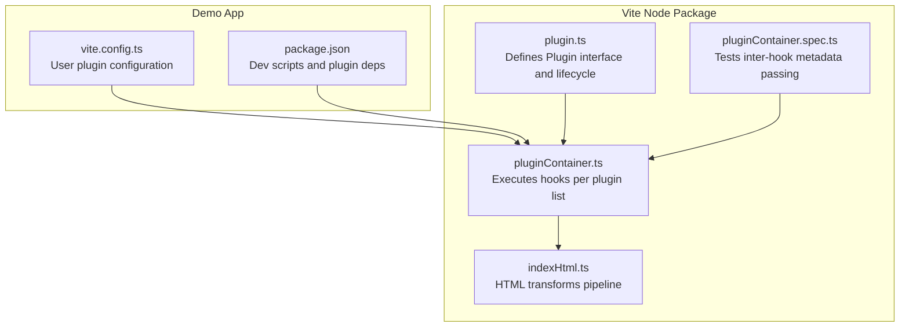
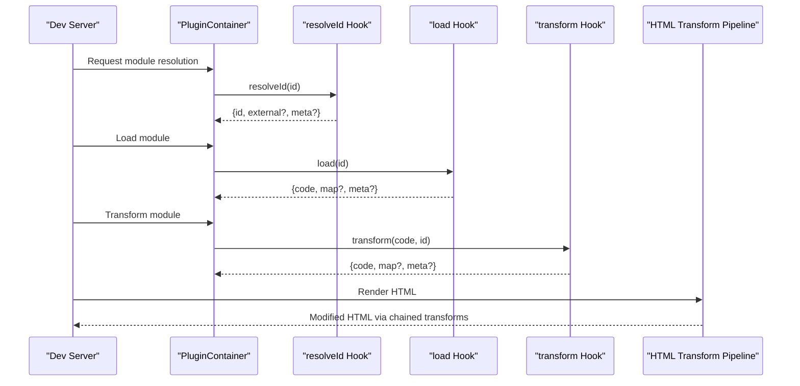
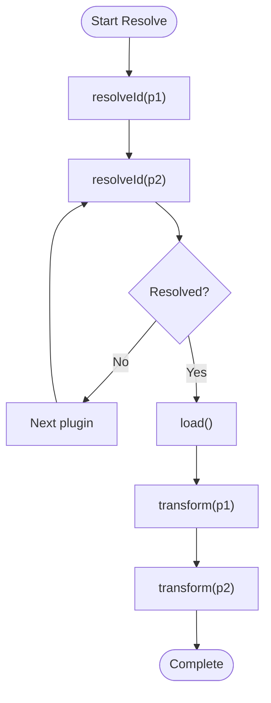
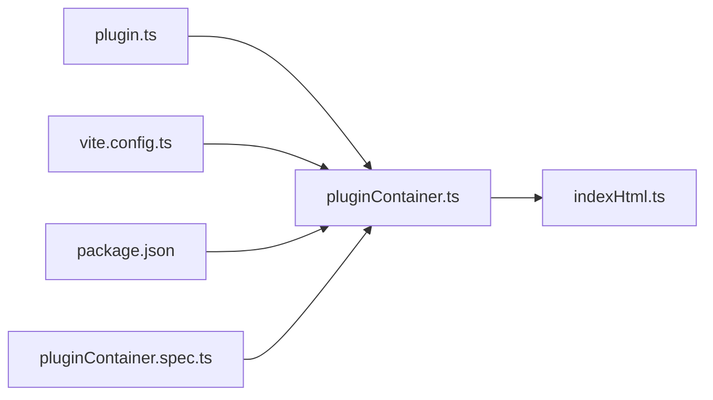

# Plugin System and Extensibility

<cite>
**Referenced Files in This Document**
- [plugin.ts](file://源码学习/vite@5.2.11/packages/vite/src/node/plugin.ts)
- [pluginContainer.ts](file://源码学习/vite@5.2.11/packages/vite/src/node/pluginContainer.ts)
- [indexHtml.ts](file://源码学习/vite@5.2.11/packages/vite/src/node/server/middlewares/indexHtml.ts)
- [pluginContainer.spec.ts](file://源码学习/vite@5.2.11/packages/vite/src/node/server/__tests__/pluginContainer.spec.ts)
- [vite.config.ts](file://demo/my-vue-app/vite.config.ts)
- [package.json](file://demo/my-vue-app/package.json)
</cite>

## Table of Contents
1. [Introduction](#introduction)
2. [Project Structure](#project-structure)
3. [Core Components](#core-components)
4. [Architecture Overview](#architecture-overview)
5. [Detailed Component Analysis](#detailed-component-analysis)
6. [Dependency Analysis](#dependency-analysis)
7. [Performance Considerations](#performance-considerations)
8. [Troubleshooting Guide](#troubleshooting-guide)
9. [Conclusion](#conclusion)
10. [Appendices](#appendices)

## Introduction
This document explains Vite’s plugin system architecture and extensibility mechanisms. It covers the plugin lifecycle hooks, execution order, inter-plugin communication patterns, and how to build custom plugins. It also documents built-in plugin categories (resolver, transformer, bundler), configuration and conditional loading strategies, performance optimization techniques, and practical patterns for common tasks. Debugging and testing strategies are included to help you develop robust plugins.

## Project Structure
Vite’s plugin system is implemented primarily in the node package. Key areas include:
- Plugin definition and registration
- Plugin container orchestration
- HTML transformation pipeline
- Tests validating plugin behavior and inter-hook metadata passing

**Diagram sources**
- [plugin.ts](file://源码学习/vite@5.2.11/packages/vite/src/node/plugin.ts)
- [pluginContainer.ts](file://源码学习/vite@5.2.11/packages/vite/src/node/pluginContainer.ts)
- [indexHtml.ts](file://源码学习/vite@5.2.11/packages/vite/src/node/server/middlewares/indexHtml.ts)
- [pluginContainer.spec.ts](file://源码学习/vite@5.2.11/packages/vite/src/node/server/__tests__/pluginContainer.spec.ts)
- [vite.config.ts](file://demo/my-vue-app/vite.config.ts)
- [package.json](file://demo/my-vue-app/package.json)

**Section sources**
- [plugin.ts](file://源码学习/vite@5.2.11/packages/vite/src/node/plugin.ts)
- [pluginContainer.ts](file://源码学习/vite@5.2.11/packages/vite/src/node/pluginContainer.ts)
- [indexHtml.ts](file://源码学习/vite@5.2.11/packages/vite/src/node/server/middlewares/indexHtml.ts)
- [pluginContainer.spec.ts](file://源码学习/vite@5.2.11/packages/vite/src/node/server/__tests__/pluginContainer.spec.ts)
- [vite.config.ts](file://demo/my-vue-app/vite.config.ts)
- [package.json](file://demo/my-vue-app/package.json)

## Core Components
- Plugin interface and lifecycle: Defines the contract for plugins, including hooks for resolution, loading, transformation, and build/bundling phases.
- Plugin container: Executes the ordered set of plugin hooks for each operation, managing hook chaining and inter-plugin communication via module metadata.
- HTML transformation pipeline: Applies HTML transforms in a deterministic order, enabling plugins to modify HTML during dev and build.
- Tests: Demonstrate inter-hook metadata propagation and plugin container behavior.

Key responsibilities:
- Plugin authoring: Implement hooks to intercept and modify module resolution, loading, and transformation.
- Container orchestration: Apply hooks in the correct order and propagate metadata across hooks.
- HTML pipeline: Allow plugins to inject attributes and tags into HTML during dev server rendering.

**Section sources**
- [plugin.ts](file://源码学习/vite@5.2.11/packages/vite/src/node/plugin.ts)
- [pluginContainer.ts](file://源码学习/vite@5.2.11/packages/vite/src/node/pluginContainer.ts)
- [indexHtml.ts](file://源码学习/vite@5.2.11/packages/vite/src/node/server/middlewares/indexHtml.ts)
- [pluginContainer.spec.ts](file://源码学习/vite@5.2.11/packages/vite/src/node/server/__tests__/pluginContainer.spec.ts)

## Architecture Overview
The plugin system centers on a container that iterates through configured plugins and invokes their lifecycle hooks. Hooks are grouped into phases (resolveId, load, transform, build-time hooks) and executed in a defined order. Plugins can communicate indirectly via module metadata stored on the module graph.

**Diagram sources**
- [pluginContainer.ts](file://源码学习/vite@5.2.11/packages/vite/src/node/pluginContainer.ts)
- [indexHtml.ts](file://源码学习/vite@5.2.11/packages/vite/src/node/server/middlewares/indexHtml.ts)

## Detailed Component Analysis

### Plugin Interface and Lifecycle
- Purpose: Define the Plugin contract and the set of lifecycle hooks available to authors.
- Responsibilities:
  - Declare plugin identity and capabilities.
  - Implement hooks for resolution, loading, transformation, and build/bundling.
  - Use context methods to query module info and pass metadata between hooks.

Implementation highlights:
- Hook ordering is enforced by the container to ensure deterministic behavior.
- Inter-hook metadata sharing is supported via module graph entries.

**Section sources**
- [plugin.ts](file://源码学习/vite@5.2.11/packages/vite/src/node/plugin.ts)

### Plugin Container Orchestration
- Purpose: Execute the ordered set of plugin hooks for each operation.
- Responsibilities:
  - Iterate through plugins in configured order.
  - Invoke hooks and chain results.
  - Propagate module metadata across hooks.
  - Support early exits and overrides when a later plugin resolves or transforms.

Execution flow:
- For resolution: resolveId hooks are applied until a definitive result is produced.
- For loading: load hooks produce module source code and optional sourcemaps.
- For transformation: transform hooks process code and can attach metadata.

Inter-plugin communication:
- Metadata attached in earlier hooks (e.g., resolveId) is retrievable in subsequent hooks (e.g., load, transform) via module info queries.

**Section sources**
- [pluginContainer.ts](file://源码学习/vite@5.2.11/packages/vite/src/node/pluginContainer.ts)
- [pluginContainer.spec.ts](file://源码学习/vite@5.2.11/packages/vite/src/node/server/__tests__/pluginContainer.spec.ts)

### HTML Transformation Pipeline
- Purpose: Allow plugins to modify HTML during dev server rendering.
- Responsibilities:
  - Compose a list of HTML transform hooks.
  - Apply transforms in a defined order (pre, normal, post).
  - Inject attributes (e.g., nonce) and tags for security enhancements.

Pipeline composition:
- Pre-hooks, normal hooks, and post-hooks are combined and applied to incoming HTML.
- The pipeline receives contextual information (path, filename, server instance).

**Section sources**
- [indexHtml.ts](file://源码学习/vite@5.2.11/packages/vite/src/node/server/middlewares/indexHtml.ts)

### Built-in Plugin Categories
- Resolver plugins:
  - Implement resolveId to alter module identifiers, mark external dependencies, or redirect aliases.
- Transformer plugins:
  - Implement load and transform to modify source code, inject runtime, or add metadata.
- Bundler plugins:
  - Integrate with build-time hooks to influence asset emission, chunking, and output generation.

Note: The exact hook sets for bundler plugins depend on the specific build mode and target. The container orchestrates the appropriate hooks for each phase.

**Section sources**
- [plugin.ts](file://源码学习/vite@5.2.11/packages/vite/src/node/plugin.ts)
- [pluginContainer.ts](file://源码学习/vite@5.2.11/packages/vite/src/node/pluginContainer.ts)

### Creating Custom Plugins
Steps:
- Define a plugin object implementing desired hooks.
- Register the plugin in the configuration file.
- Use context methods to query module info and share metadata across hooks.
- Leverage HTML transforms for dev-time DOM modifications.

Practical patterns:
- Simple transformation: Modify code in transform and attach lightweight metadata.
- Build integration: Use build-time hooks to emit assets or adjust output structure.
- Conditional behavior: Gate hooks based on environment or file patterns.

Configuration and registration:
- Add plugins to the configuration array.
- Use environment-aware conditions to enable/disable plugins.

**Section sources**
- [plugin.ts](file://源码学习/vite@5.2.11/packages/vite/src/node/plugin.ts)
- [vite.config.ts](file://demo/my-vue-app/vite.config.ts)
- [package.json](file://demo/my-vue-app/package.json)

### Hook Execution Order and Inter-Plugin Communication
Ordering:
- Resolution: resolveId hooks are applied in plugin order until a definitive result.
- Loading: load hooks receive the resolved id and return source code.
- Transformation: transform hooks receive code and id, allowing cumulative modifications.

Communication:
- Modules carry metadata that can be read/written by successive hooks.
- Tests demonstrate passing metadata from resolveId through load to transform.

**Diagram sources**
- [pluginContainer.spec.ts](file://源码学习/vite@5.2.11/packages/vite/src/node/server/__tests__/pluginContainer.spec.ts)

**Section sources**
- [pluginContainer.spec.ts](file://源码学习/vite@5.2.11/packages/vite/src/node/server/__tests__/pluginContainer.spec.ts)

### Conditional Loading and Configuration
- Environment checks: Gate plugin activation based on mode or environment variables.
- Pattern matching: Enable or disable hooks depending on file extensions or paths.
- User configuration: Accept options from the plugin declaration in the configuration file.

Best practices:
- Keep conditions explicit and documented.
- Prefer minimal work in hooks that run frequently (e.g., transform).

**Section sources**
- [vite.config.ts](file://demo/my-vue-app/vite.config.ts)
- [package.json](file://demo/my-vue-app/package.json)

## Dependency Analysis
The plugin system relies on a small set of core modules:
- Plugin interface defines the contract.
- Plugin container executes hooks and manages metadata.
- HTML middleware composes and applies HTML transforms.

**Diagram sources**
- [plugin.ts](file://源码学习/vite@5.2.11/packages/vite/src/node/plugin.ts)
- [pluginContainer.ts](file://源码学习/vite@5.2.11/packages/vite/src/node/pluginContainer.ts)
- [indexHtml.ts](file://源码学习/vite@5.2.11/packages/vite/src/node/server/middlewares/indexHtml.ts)
- [pluginContainer.spec.ts](file://源码学习/vite@5.2.11/packages/vite/src/node/server/__tests__/pluginContainer.spec.ts)
- [vite.config.ts](file://demo/my-vue-app/vite.config.ts)
- [package.json](file://demo/my-vue-app/package.json)

**Section sources**
- [plugin.ts](file://源码学习/vite@5.2.11/packages/vite/src/node/plugin.ts)
- [pluginContainer.ts](file://源码学习/vite@5.2.11/packages/vite/src/node/pluginContainer.ts)
- [indexHtml.ts](file://源码学习/vite@5.2.11/packages/vite/src/node/server/middlewares/indexHtml.ts)
- [pluginContainer.spec.ts](file://源码学习/vite@5.2.11/packages/vite/src/node/server/__tests__/pluginContainer.spec.ts)
- [vite.config.ts](file://demo/my-vue-app/vite.config.ts)
- [package.json](file://demo/my-vue-app/package.json)

## Performance Considerations
- Minimize heavy work in frequently invoked hooks (e.g., transform).
- Use memoization for expensive computations keyed by module id.
- Short-circuit early when a plugin does not apply to a given module.
- Prefer targeted pattern matching to avoid unnecessary processing.
- Defer non-critical operations to build-time hooks when possible.

## Troubleshooting Guide
Common issues and remedies:
- Unexpected module resolution:
  - Verify resolveId precedence and ensure only one plugin resolves a given id.
  - Confirm external flags are set correctly to avoid bundling.
- Missing or incorrect metadata:
  - Ensure metadata is attached in an earlier hook and retrieved in a later one.
  - Use tests to validate metadata propagation across hooks.
- HTML transform conflicts:
  - Check the order of HTML transforms and avoid conflicting injections.
  - Isolate CSP-related transforms to dedicated pre/post phases.

Testing strategies:
- Write unit tests that assert hook invocation order and metadata passing.
- Mock module graph and server contexts to isolate plugin behavior.
- Validate HTML pipeline outputs against expected DOM attributes and tags.

**Section sources**
- [pluginContainer.spec.ts](file://源码学习/vite@5.2.11/packages/vite/src/node/server/__tests__/pluginContainer.spec.ts)
- [indexHtml.ts](file://源码学习/vite@5.2.11/packages/vite/src/node/server/middlewares/indexHtml.ts)

## Conclusion
Vite’s plugin system provides a powerful, extensible mechanism for modifying module resolution, loading, transformation, and HTML rendering. By understanding hook execution order, leveraging inter-plugin communication via module metadata, and following performance and testing best practices, you can build efficient and maintainable plugins tailored to your project’s needs.

## Appendices
- Practical examples:
  - Simple transform plugin: Modify code in transform and attach metadata.
  - Resolver plugin: Redirect aliased paths in resolveId.
  - HTML enhancement plugin: Inject nonce attributes in HTML transforms.
- References:
  - Plugin interface and lifecycle definitions
  - Plugin container orchestration
  - HTML transformation pipeline
  - Demo configuration and package scripts

[No sources needed since this section aggregates previously cited material]