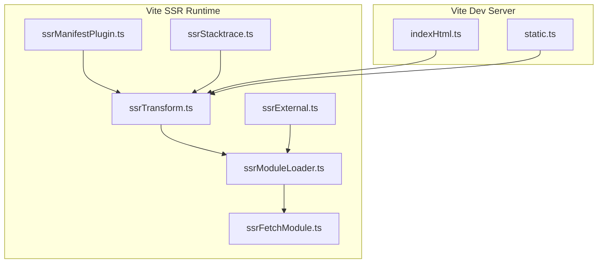
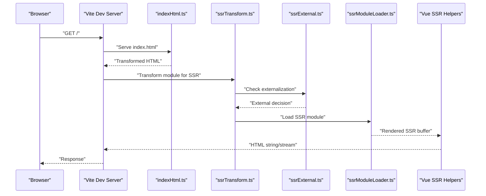
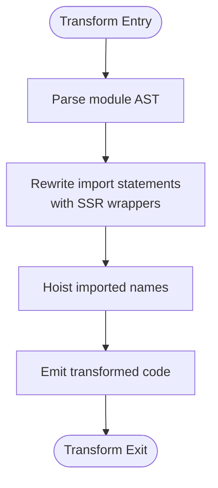
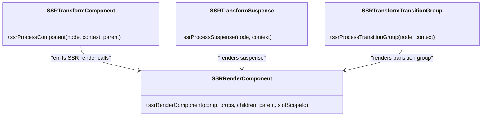
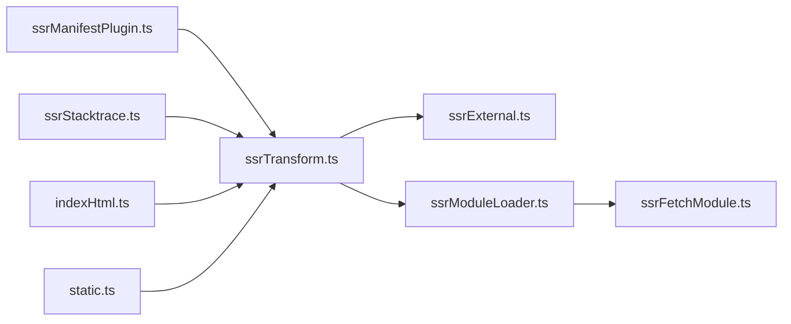

# Server-Side Rendering Support

<cite>
**Referenced Files in This Document**
- [vite.config.ts](file://demo/my-vue-app/vite.config.ts)
- [indexHtml.ts](file://源码学习/vite@5.2.11/packages/vite/src/node/server/middlewares/indexHtml.ts)
- [static.ts](file://源码学习/vite@5.2.11/packages/vite/src/node/server/middlewares/static.ts)
- [ssrTransform.ts](file://源码学习/vite@5.2.11/packages/vite/src/node/ssr/ssrTransform.ts)
- [ssrExternal.ts](file://源码学习/vite@5.2.11/packages/vite/src/node/ssr/ssrExternal.ts)
- [ssrModuleLoader.ts](file://源码学习/vite@5.2.11/packages/vite/src/node/ssr/ssrModuleLoader.ts)
- [ssrFetchModule.ts](file://源码学习/vite@5.2.11/packages/vite/src/node/ssr/ssrFetchModule.ts)
- [ssrManifestPlugin.ts](file://源码学习/vite@5.2.11/packages/vite/src/node/ssr/ssrManifestPlugin.ts)
- [ssrStacktrace.ts](file://源码学习/vite@5.2.11/packages/vite/src/node/ssr/ssrStacktrace.ts)
- [ssrTransform.spec.ts](file://源码学习/vite@5.2.11/packages/vite/src/node/ssr/__tests__/ssrTransform.spec.ts)
- [ssrExternal.spec.ts](file://源码学习/vite@5.2.11/packages/vite/src/node/ssr/__tests__/ssrExternal.spec.ts)
- [ssrLoadModule.spec.ts](file://源码学习/vite@5.2.11/packages/vite/src/node/ssr/__tests__/ssrLoadModule.spec.ts)
- [ssrRenderComponent.ts](file://源码学习/vue@3.5.26/code/packages/server-renderer/src/helpers/ssrRenderComponent.ts)
- [ssrTransformComponent.ts](file://源码学习/vue@3.5.26/code/packages/compiler-ssr/src/transforms/ssrTransformComponent.ts)
- [ssrTransformSuspense.ts](file://源码学习/vue@3.5.26/code/packages/compiler-ssr/src/transforms/ssrTransformSuspense.ts)
- [ssrTransformTransitionGroup.ts](file://源码学习/vue@3.5.26/code/packages/compiler-ssr/src/transforms/ssrTransformTransitionGroup.ts)
- [nuxt.config.ts](file://demo/nuxt/demo_2/nuxt.config.ts)
- [nitro.no-ssr.js](file://demo/nuxt/demo_2/node_modules/@nuxt/nitro-server/dist/runtime/middleware/no-ssr.js)
- [nitro.no-ssr.d.ts](file://demo/nuxt/demo_2/node_modules/@nuxt/nitro-server/dist/runtime/middleware/no-ssr.d.ts)
- [next.config.mjs](file://源码学习/nextjs/next.config.mjs)
- [next.config.d.mts](file://源码学习/nextjs/next.config.d.mts)
- [ssr.js](file://node_modules/vitepress/dist/client/app/ssr.js)
</cite>

## Table of Contents
1. [Introduction](#introduction)
2. [Project Structure](#project-structure)
3. [Core Components](#core-components)
4. [Architecture Overview](#architecture-overview)
5. [Detailed Component Analysis](#detailed-component-analysis)
6. [Dependency Analysis](#dependency-analysis)
7. [Performance Considerations](#performance-considerations)
8. [Troubleshooting Guide](#troubleshooting-guide)
9. [Conclusion](#conclusion)
10. [Appendices](#appendices)

## Introduction
This document explains Vite’s Server-Side Rendering (SSR) support and implementation. It covers how Vite transforms modules for SSR, how the server serves HTML and static assets, and how client and server hydrate and stream content. It also documents SSR-specific plugins and middleware, build configuration differences, the SSR runtime helpers, and integration patterns with Nuxt.js and Next.js. Practical setup, optimization techniques, and debugging guidance are included for production readiness.

## Project Structure
Vite’s SSR support spans several subsystems:
- SSR module transformation and externalization
- SSR module loading and fetching
- SSR manifest generation
- HTML middleware for index.html handling
- Static asset serving
- Stacktrace normalization for SSR errors

**Diagram sources**
- [ssrTransform.ts:1-200](file://源码学习/vite@5.2.11/packages/vite/src/node/ssr/ssrTransform.ts#L1-L200)
- [ssrExternal.ts:1-200](file://源码学习/vite@5.2.11/packages/vite/src/node/ssr/ssrExternal.ts#L1-L200)
- [ssrModuleLoader.ts:1-200](file://源码学习/vite@5.2.11/packages/vite/src/node/ssr/ssrModuleLoader.ts#L1-L200)
- [ssrFetchModule.ts:1-200](file://源码学习/vite@5.2.11/packages/vite/src/node/ssr/ssrFetchModule.ts#L1-L200)
- [ssrManifestPlugin.ts:1-200](file://源码学习/vite@5.2.11/packages/vite/src/node/ssr/ssrManifestPlugin.ts#L1-L200)
- [ssrStacktrace.ts:1-200](file://源码学习/vite@5.2.11/packages/vite/src/node/ssr/ssrStacktrace.ts#L1-L200)
- [indexHtml.ts:460-511](file://源码学习/vite@5.2.11/packages/vite/src/node/server/middlewares/indexHtml.ts#L460-L511)
- [static.ts:57-112](file://源码学习/vite@5.2.11/packages/vite/src/node/server/middlewares/static.ts#L57-L112)

**Section sources**
- [ssrTransform.ts:1-200](file://源码学习/vite@5.2.11/packages/vite/src/node/ssr/ssrTransform.ts#L1-L200)
- [ssrExternal.ts:1-200](file://源码学习/vite@5.2.11/packages/vite/src/node/ssr/ssrExternal.ts#L1-L200)
- [ssrModuleLoader.ts:1-200](file://源码学习/vite@5.2.11/packages/vite/src/node/ssr/ssrModuleLoader.ts#L1-L200)
- [ssrFetchModule.ts:1-200](file://源码学习/vite@5.2.11/packages/vite/src/node/ssr/ssrFetchModule.ts#L1-L200)
- [ssrManifestPlugin.ts:1-200](file://源码学习/vite@5.2.11/packages/vite/src/node/ssr/ssrManifestPlugin.ts#L1-L200)
- [ssrStacktrace.ts:1-200](file://源码学习/vite@5.2.11/packages/vite/src/node/ssr/ssrStacktrace.ts#L1-L200)
- [indexHtml.ts:460-511](file://源码学习/vite@5.2.11/packages/vite/src/node/server/middlewares/indexHtml.ts#L460-L511)
- [static.ts:57-112](file://源码学习/vite@5.2.11/packages/vite/src/node/server/middlewares/static.ts#L57-L112)

## Core Components
- SSR Transform: Rewrites ES module imports/exports for SSR environments and generates SSR-friendly code.
- SSR External: Determines whether dependencies should be marked external for SSR builds.
- SSR Module Loader: Loads SSR modules with proper resolution and caching.
- SSR Fetch Module: Resolves and fetches modules during SSR.
- SSR Manifest Plugin: Generates SSR manifests for asset and module mapping.
- SSR Stacktrace: Normalizes stack traces for SSR errors.
- Index HTML Middleware: Handles index.html injection and dev-time transformations.
- Static Middleware: Serves public and root static assets.

**Section sources**
- [ssrTransform.ts:1-200](file://源码学习/vite@5.2.11/packages/vite/src/node/ssr/ssrTransform.ts#L1-L200)
- [ssrExternal.ts:1-200](file://源码学习/vite@5.2.11/packages/vite/src/node/ssr/ssrExternal.ts#L1-L200)
- [ssrModuleLoader.ts:1-200](file://源码学习/vite@5.2.11/packages/vite/src/node/ssr/ssrModuleLoader.ts#L1-L200)
- [ssrFetchModule.ts:1-200](file://源码学习/vite@5.2.11/packages/vite/src/node/ssr/ssrFetchModule.ts#L1-L200)
- [ssrManifestPlugin.ts:1-200](file://源码学习/vite@5.2.11/packages/vite/src/node/ssr/ssrManifestPlugin.ts#L1-L200)
- [ssrStacktrace.ts:1-200](file://源码学习/vite@5.2.11/packages/vite/src/node/ssr/ssrStacktrace.ts#L1-L200)
- [indexHtml.ts:460-511](file://源码学习/vite@5.2.11/packages/vite/src/node/server/middlewares/indexHtml.ts#L460-L511)
- [static.ts:57-112](file://源码学习/vite@5.2.11/packages/vite/src/node/server/middlewares/static.ts#L57-L112)

## Architecture Overview
The SSR pipeline integrates Vite’s dev server middlewares with Vue’s SSR compiler and renderer helpers. The flow is:
- The dev server intercepts HTML requests and optionally transforms index.html.
- Vite’s SSR transform rewrites module boundaries for SSR.
- SSR externalization decides which modules remain external.
- The SSR module loader resolves and loads modules.
- Vue’s SSR helpers render components and suspense boundaries to strings or streams.
- Static middleware serves assets and public files.

**Diagram sources**
- [indexHtml.ts:460-511](file://源码学习/vite@5.2.11/packages/vite/src/node/server/middlewares/indexHtml.ts#L460-L511)
- [ssrTransform.ts:1-200](file://源码学习/vite@5.2.11/packages/vite/src/node/ssr/ssrTransform.ts#L1-L200)
- [ssrExternal.ts:1-200](file://源码学习/vite@5.2.11/packages/vite/src/node/ssr/ssrExternal.ts#L1-L200)
- [ssrModuleLoader.ts:1-200](file://源码学习/vite@5.2.11/packages/vite/src/node/ssr/ssrModuleLoader.ts#L1-L200)
- [ssrRenderComponent.ts:1-22](file://源码学习/vue@3.5.26/code/packages/server-renderer/src/helpers/ssrRenderComponent.ts#L1-L22)

## Detailed Component Analysis

### SSR Transform
Responsibilities:
- Rewrite import statements for SSR.
- Inject SSR import wrappers.
- Track imported names and hoist bindings.

Key behaviors:
- Rewrites top-level imports and rewrites references to imported names.
- Generates deterministic SSR import identifiers.
- Preserves original source for testing and snapshotting.

**Diagram sources**
- [ssrTransform.ts:1-200](file://源码学习/vite@5.2.11/packages/vite/src/node/ssr/ssrTransform.ts#L1-L200)
- [ssrTransform.spec.ts:1-39](file://源码学习/vite@5.2.11/packages/vite/src/node/ssr/__tests__/ssrTransform.spec.ts#L1-L39)

**Section sources**
- [ssrTransform.ts:1-200](file://源码学习/vite@5.2.11/packages/vite/src/node/ssr/ssrTransform.ts#L1-L200)
- [ssrTransform.spec.ts:1-39](file://源码学习/vite@5.2.11/packages/vite/src/node/ssr/__tests__/ssrTransform.spec.ts#L1-L39)

### SSR Externalization
Responsibilities:
- Decide whether a module should be treated as external for SSR builds.
- Allow forcing externalization via configuration.

Key behaviors:
- Defaults to not treating internal packages as external.
- Supports explicit force-external configuration.

**Section sources**
- [ssrExternal.ts:1-200](file://源码学习/vite@5.2.11/packages/vite/src/node/ssr/ssrExternal.ts#L1-L200)
- [ssrExternal.spec.ts:1-29](file://源码学习/vite@5.2.11/packages/vite/src/node/ssr/__tests__/ssrExternal.spec.ts#L1-L29)

### SSR Module Loader and Fetch
Responsibilities:
- Resolve and load SSR modules with proper caching and error handling.
- Fetch modules during SSR execution.

Key behaviors:
- Uses Vite’s resolver and module graph.
- Integrates with SSR transform and externalization decisions.

**Section sources**
- [ssrModuleLoader.ts:1-200](file://源码学习/vite@5.2.11/packages/vite/src/node/ssr/ssrModuleLoader.ts#L1-L200)
- [ssrFetchModule.ts:1-200](file://源码学习/vite@5.2.11/packages/vite/src/node/ssr/ssrFetchModule.ts#L1-L200)
- [ssrLoadModule.spec.ts:1-17](file://源码学习/vite@5.2.11/packages/vite/src/node/ssr/__tests__/ssrLoadModule.spec.ts#L1-L17)

### SSR Manifest Plugin
Responsibilities:
- Generate SSR manifests mapping assets and modules for SSR builds.
- Enable asset and module mapping during SSR.

**Section sources**
- [ssrManifestPlugin.ts:1-200](file://源码学习/vite@5.2.11/packages/vite/src/node/ssr/ssrManifestPlugin.ts#L1-L200)

### SSR Stacktrace Normalization
Responsibilities:
- Normalize stack traces for SSR errors to improve debugging.

**Section sources**
- [ssrStacktrace.ts:1-200](file://源码学习/vite@5.2.11/packages/vite/src/node/ssr/ssrStacktrace.ts#L1-L200)

### HTML Middleware for SSR
Responsibilities:
- Serve and optionally transform index.html in development.
- Inject client entry for HMR and client-server communication.

Key behaviors:
- Reads index.html, applies dev-time transforms, and sends response.
- Skips internal and import requests.

**Section sources**
- [indexHtml.ts:460-511](file://源码学习/vite@5.2.11/packages/vite/src/node/server/middlewares/indexHtml.ts#L460-L511)

### Static Middleware for Assets
Responsibilities:
- Serve public and root static assets efficiently.
- Skip internal and import requests.

**Section sources**
- [static.ts:57-112](file://源码学习/vite@5.2.11/packages/vite/src/node/server/middlewares/static.ts#L57-L112)

### Vue SSR Compiler and Renderer Integration
Responsibilities:
- Transform Vue components and special components (Suspense, TransitionGroup) for SSR.
- Render components and slots to SSR buffers.

Key behaviors:
- Component transform emits SSR render calls.
- Suspense and TransitionGroup transforms handle slot and DOM emission.
- Renderer helpers accept push callbacks and parent context.

**Diagram sources**
- [ssrTransformComponent.ts:175-202](file://源码学习/vue@3.5.26/code/packages/compiler-ssr/src/transforms/ssrTransformComponent.ts#L175-L202)
- [ssrTransformSuspense.ts:61-83](file://源码学习/vue@3.5.26/code/packages/compiler-ssr/src/transforms/ssrTransformSuspense.ts#L61-L83)
- [ssrTransformTransitionGroup.ts:59-77](file://源码学习/vue@3.5.26/code/packages/compiler-ssr/src/transforms/ssrTransformTransitionGroup.ts#L59-L77)
- [ssrRenderComponent.ts:1-22](file://源码学习/vue@3.5.26/code/packages/server-renderer/src/helpers/ssrRenderComponent.ts#L1-L22)

**Section sources**
- [ssrTransformComponent.ts:175-202](file://源码学习/vue@3.5.26/code/packages/compiler-ssr/src/transforms/ssrTransformComponent.ts#L175-L202)
- [ssrTransformSuspense.ts:61-83](file://源码学习/vue@3.5.26/code/packages/compiler-ssr/src/transforms/ssrTransformSuspense.ts#L61-L83)
- [ssrTransformTransitionGroup.ts:59-77](file://源码学习/vue@3.5.26/code/packages/compiler-ssr/src/transforms/ssrTransformTransitionGroup.ts#L59-L77)
- [ssrRenderComponent.ts:1-22](file://源码学习/vue@3.5.26/code/packages/server-renderer/src/helpers/ssrRenderComponent.ts#L1-L22)

### Nuxt.js Integration
Nuxt’s Nitro runtime provides a no-SSR middleware that can disable SSR for specific routes or contexts. This is useful for selective SSR control in Nuxt applications.

**Section sources**
- [nitro.no-ssr.js](file://demo/nuxt/demo_2/node_modules/@nuxt/nitro-server/dist/runtime/middleware/no-ssr.js)
- [nitro.no-ssr.d.ts](file://demo/nuxt/demo_2/node_modules/@nuxt/nitro-server/dist/runtime/middleware/no-ssr.d.ts)
- [nuxt.config.ts](file://demo/nuxt/demo_2/nuxt.config.ts)

### Next.js Integration
Next.js configuration supports SSR and incremental static regeneration. While Vite is not Next.js, understanding Next.js SSR configuration helps compare SSR build and runtime strategies.

**Section sources**
- [next.config.mjs](file://源码学习/nextjs/next.config.mjs)
- [next.config.d.mts](file://源码学习/nextjs/next.config.d.mts)

## Dependency Analysis
Vite’s SSR runtime components depend on each other to form a cohesive pipeline. The SSR transform depends on externalization decisions, which influence module loading. The dev server middlewares depend on SSR transforms for HTML and module rewriting.

**Diagram sources**
- [ssrTransform.ts:1-200](file://源码学习/vite@5.2.11/packages/vite/src/node/ssr/ssrTransform.ts#L1-L200)
- [ssrExternal.ts:1-200](file://源码学习/vite@5.2.11/packages/vite/src/node/ssr/ssrExternal.ts#L1-L200)
- [ssrModuleLoader.ts:1-200](file://源码学习/vite@5.2.11/packages/vite/src/node/ssr/ssrModuleLoader.ts#L1-L200)
- [ssrFetchModule.ts:1-200](file://源码学习/vite@5.2.11/packages/vite/src/node/ssr/ssrFetchModule.ts#L1-L200)
- [ssrManifestPlugin.ts:1-200](file://源码学习/vite@5.2.11/packages/vite/src/node/ssr/ssrManifestPlugin.ts#L1-L200)
- [ssrStacktrace.ts:1-200](file://源码学习/vite@5.2.11/packages/vite/src/node/ssr/ssrStacktrace.ts#L1-L200)
- [indexHtml.ts:460-511](file://源码学习/vite@5.2.11/packages/vite/src/node/server/middlewares/indexHtml.ts#L460-L511)
- [static.ts:57-112](file://源码学习/vite@5.2.11/packages/vite/src/node/server/middlewares/static.ts#L57-L112)

**Section sources**
- [ssrTransform.ts:1-200](file://源码学习/vite@5.2.11/packages/vite/src/node/ssr/ssrTransform.ts#L1-L200)
- [ssrExternal.ts:1-200](file://源码学习/vite@5.2.11/packages/vite/src/node/ssr/ssrExternal.ts#L1-L200)
- [ssrModuleLoader.ts:1-200](file://源码学习/vite@5.2.11/packages/vite/src/node/ssr/ssrModuleLoader.ts#L1-L200)
- [ssrFetchModule.ts:1-200](file://源码学习/vite@5.2.11/packages/vite/src/node/ssr/ssrFetchModule.ts#L1-L200)
- [ssrManifestPlugin.ts:1-200](file://源码学习/vite@5.2.11/packages/vite/src/node/ssr/ssrManifestPlugin.ts#L1-L200)
- [ssrStacktrace.ts:1-200](file://源码学习/vite@5.2.11/packages/vite/src/node/ssr/ssrStacktrace.ts#L1-L200)
- [indexHtml.ts:460-511](file://源码学习/vite@5.2.11/packages/vite/src/node/server/middlewares/indexHtml.ts#L460-L511)
- [static.ts:57-112](file://源码学习/vite@5.2.11/packages/vite/src/node/server/middlewares/static.ts#L57-L112)

## Performance Considerations
- Prefer externalizing large dependencies that do not need SSR evaluation.
- Use SSR manifests to optimize asset and module loading.
- Minimize synchronous work in SSR render paths; leverage streaming where possible.
- Avoid heavy computations in hot paths; defer to background tasks when feasible.
- Keep SSR bundles small and split lazily loaded routes/components.

[No sources needed since this section provides general guidance]

## Troubleshooting Guide
Common issues and remedies:
- Import mismatches in SSR: Verify SSR transform behavior and ensure named/default imports are rewritten consistently.
- Externalization mistakes: Confirm externalization rules align with intended runtime behavior.
- Module loading failures: Inspect module loader and fetch logic for resolution errors.
- Stacktrace confusion: Use SSR stacktrace normalization to improve error readability.

**Section sources**
- [ssrTransform.spec.ts:1-39](file://源码学习/vite@5.2.11/packages/vite/src/node/ssr/__tests__/ssrTransform.spec.ts#L1-L39)
- [ssrExternal.spec.ts:1-29](file://源码学习/vite@5.2.11/packages/vite/src/node/ssr/__tests__/ssrExternal.spec.ts#L1-L29)
- [ssrStacktrace.ts:1-200](file://源码学习/vite@5.2.11/packages/vite/src/node/ssr/ssrStacktrace.ts#L1-L200)

## Conclusion
Vite’s SSR support centers on robust module transformation, externalization, and loading, integrated with dev server middlewares and Vue’s SSR compiler/renderer. By leveraging SSR manifests, careful externalization, and normalized stacktraces, applications can achieve reliable SSR with strong debugging capabilities. Integration with ecosystems like Nuxt and Next highlights complementary approaches to SSR orchestration.

[No sources needed since this section summarizes without analyzing specific files]

## Appendices

### Practical Setup Examples
- Configure SSR entry and build targets in your framework’s SSR configuration.
- Ensure index.html is served and transformed in development.
- Use SSR manifests to map assets and modules for production builds.
- Integrate with Nuxt’s Nitro runtime for selective SSR control.

**Section sources**
- [indexHtml.ts:460-511](file://源码学习/vite@5.2.11/packages/vite/src/node/server/middlewares/indexHtml.ts#L460-L511)
- [ssrManifestPlugin.ts:1-200](file://源码学习/vite@5.2.11/packages/vite/src/node/ssr/ssrManifestPlugin.ts#L1-L200)
- [nitro.no-ssr.js](file://demo/nuxt/demo_2/node_modules/@nuxt/nitro-server/dist/runtime/middleware/no-ssr.js)
- [nuxt.config.ts](file://demo/nuxt/demo_2/nuxt.config.ts)

### Debugging Tips
- Snapshot transformed code to validate SSR import rewrites.
- Temporarily force externalization to isolate module resolution issues.
- Normalize stack traces to focus on application code paths.

**Section sources**
- [ssrTransform.spec.ts:1-39](file://源码学习/vite@5.2.11/packages/vite/src/node/ssr/__tests__/ssrTransform.spec.ts#L1-L39)
- [ssrExternal.spec.ts:1-29](file://源码学习/vite@5.2.11/packages/vite/src/node/ssr/__tests__/ssrExternal.spec.ts#L1-L29)
- [ssrStacktrace.ts:1-200](file://源码学习/vite@5.2.11/packages/vite/src/node/ssr/ssrStacktrace.ts#L1-L200)

### SSR Runtime Helpers Reference
- Component rendering helpers accept push callbacks and parent context.
- Special components (Suspense, TransitionGroup) are handled with dedicated SSR transforms.

**Section sources**
- [ssrRenderComponent.ts:1-22](file://源码学习/vue@3.5.26/code/packages/server-renderer/src/helpers/ssrRenderComponent.ts#L1-L22)
- [ssrTransformSuspense.ts:61-83](file://源码学习/vue@3.5.26/code/packages/compiler-ssr/src/transforms/ssrTransformSuspense.ts#L61-L83)
- [ssrTransformTransitionGroup.ts:59-77](file://源码学习/vue@3.5.26/code/packages/compiler-ssr/src/transforms/ssrTransformTransitionGroup.ts#L59-L77)