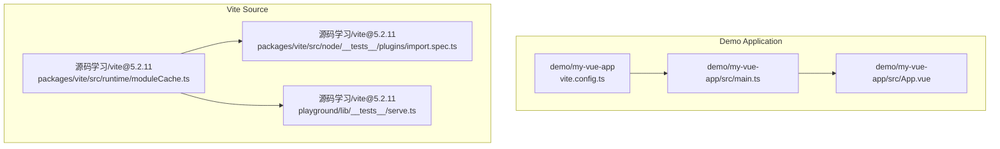
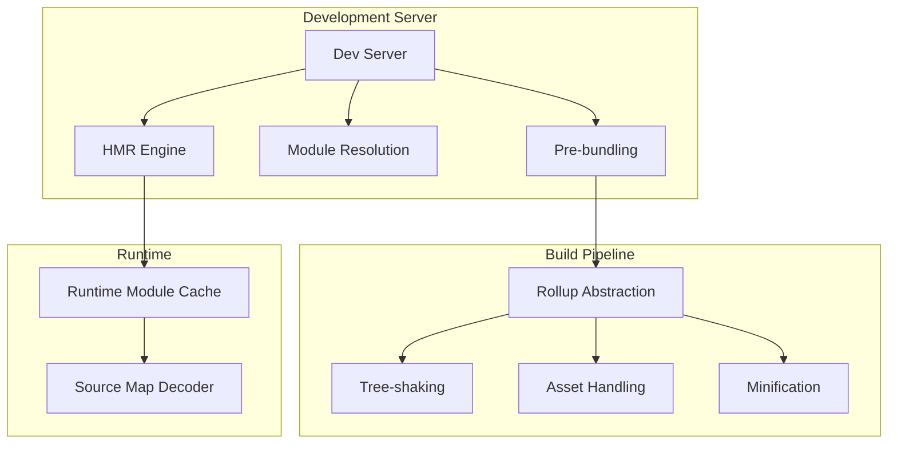
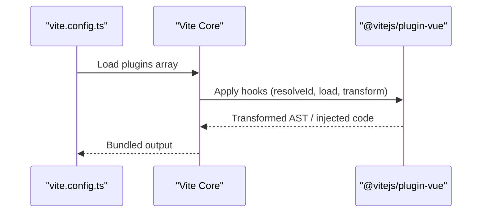
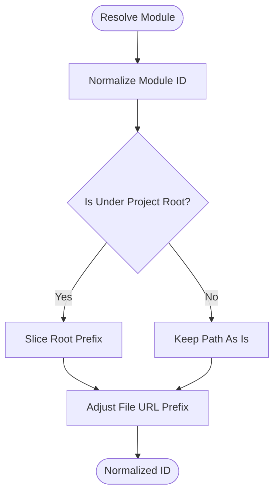
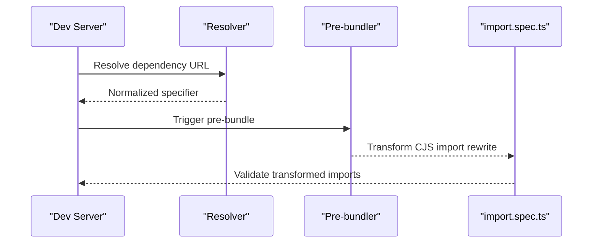
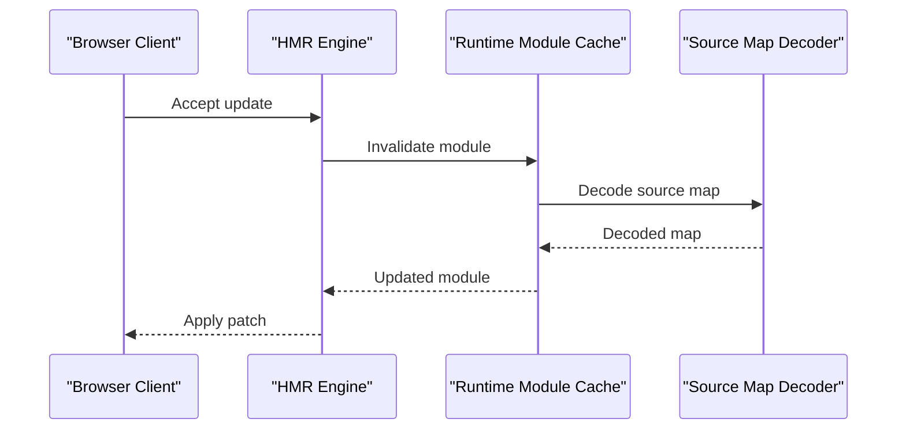
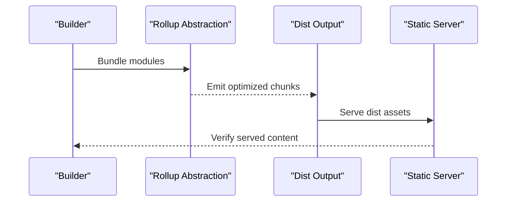
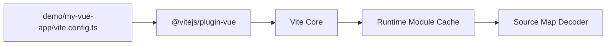

# Vite Build System Analysis

<cite>
**Referenced Files in This Document**
- [README.md](file://README.md)
- [package.json](file://package.json)
- [vite.config.ts](file://demo/my-vue-app/vite.config.ts)
- [main.ts](file://demo/my-vue-app/src/main.ts)
- [App.vue](file://demo/my-vue-app/src/App.vue)
- [moduleCache.ts](file://源码学习/vite@5.2.11/packages/vite/src/runtime/moduleCache.ts)
- [import.spec.ts](file://源码学习/vite@5.2.11/packages/vite/src/node/__tests__/plugins/import.spec.ts)
- [serve.ts](file://源码学习/vite@5.2.11/playground/lib/__tests__/serve.ts)
</cite>

## Table of Contents
1. [Introduction](#introduction)
2. [Project Structure](#project-structure)
3. [Core Components](#core-components)
4. [Architecture Overview](#architecture-overview)
5. [Detailed Component Analysis](#detailed-component-analysis)
6. [Dependency Analysis](#dependency-analysis)
7. [Performance Considerations](#performance-considerations)
8. [Troubleshooting Guide](#troubleshooting-guide)
9. [Conclusion](#conclusion)
10. [Appendices](#appendices)

## Introduction
This document presents a comprehensive analysis of the Vite build system’s modern architecture and development server implementation. It focuses on Vite’s plugin system, module resolution strategies, dependency pre-bundling, Hot Module Replacement (HMR), build pipeline optimizations, and SSR support. It also covers differences between development and production builds, tree-shaking, asset handling, the bundler abstraction layer, and integration with Rollup. The content is structured to be accessible to beginners while providing deep technical insights for contributors.

## Project Structure
The repository includes:
- A Vite-powered Vue application example under demo/my-vue-app, demonstrating typical usage with a Vite configuration and a Vue plugin.
- The Vite source code under 源码学习/vite@5.2.11, containing the runtime, node utilities, tests, and playgrounds used for verification and experimentation.
- Top-level metadata and configuration files for the repository.

**Diagram sources**
- [vite.config.ts](file://demo/my-vue-app/vite.config.ts)
- [main.ts](file://demo/my-vue-app/src/main.ts)
- [App.vue](file://demo/my-vue-app/src/App.vue)
- [moduleCache.ts](file://源码学习/vite@5.2.11/packages/vite/src/runtime/moduleCache.ts)
- [import.spec.ts](file://源码学习/vite@5.2.11/packages/vite/src/node/__tests__/plugins/import.spec.ts)
- [serve.ts](file://源码学习/vite@5.2.11/playground/lib/__tests__/serve.ts)

**Section sources**
- [README.md](file://README.md)
- [package.json](file://package.json)
- [vite.config.ts](file://demo/my-vue-app/vite.config.ts)
- [main.ts](file://demo/my-vue-app/src/main.ts)
- [App.vue](file://demo/my-vue-app/src/App.vue)
- [moduleCache.ts](file://源码学习/vite@5.2.11/packages/vite/src/runtime/moduleCache.ts)
- [import.spec.ts](file://源码学习/vite@5.2.11/packages/vite/src/node/__tests__/plugins/import.spec.ts)
- [serve.ts](file://源码学习/vite@5.2.11/playground/lib/__tests__/serve.ts)

## Core Components
- Runtime module cache and source map handling: Provides normalized module IDs, decoding of inline source maps, and caching for efficient module retrieval during development.
- Plugin import transformation tests: Demonstrate how CommonJS imports are transformed for compatibility in the dev server and pre-bundling pipeline.
- Development server playground tests: Show how the dev server serves built artifacts and handles requests for testing.

Key implementation references:
- Module ID normalization and source map decoding in the runtime module cache.
- Import transformation tests validating CJS import rewriting behavior.
- Dev server request handling and static serving in the playground tests.

**Section sources**
- [moduleCache.ts](file://源码学习/vite@5.2.11/packages/vite/src/runtime/moduleCache.ts)
- [import.spec.ts](file://源码学习/vite@5.2.11/packages/vite/src/node/__tests__/plugins/import.spec.ts)
- [serve.ts](file://源码学习/vite@5.2.11/playground/lib/__tests__/serve.ts)

## Architecture Overview
Vite’s architecture centers around a fast development server and a production-oriented build pipeline. The runtime integrates with the dev server to enable instant feedback via HMR and optimized module delivery. The build pipeline leverages Rollup-like bundling with Vite-specific enhancements for speed and extensibility.

[No sources needed since this diagram shows conceptual architecture, not a direct code mapping]

## Detailed Component Analysis

### Plugin System Architecture
Vite’s plugin system enables extending the dev server and build pipeline. Plugins integrate at specific hooks to modify transforms, resolve modules, and inject code. The example configuration demonstrates integrating a Vue plugin into the Vite ecosystem.

**Diagram sources**
- [vite.config.ts](file://demo/my-vue-app/vite.config.ts)

**Section sources**
- [vite.config.ts](file://demo/my-vue-app/vite.config.ts)

### Module Resolution Strategies
Vite normalizes module IDs and resolves modules efficiently during development. The runtime module cache includes logic to:
- Normalize file paths across platforms.
- Strip internal prefixes and resolve absolute paths relative to the project root.
- Decode inline source maps for accurate debugging.

**Diagram sources**
- [moduleCache.ts](file://源码学习/vite@5.2.11/packages/vite/src/runtime/moduleCache.ts)

**Section sources**
- [moduleCache.ts](file://源码学习/vite@5.2.11/packages/vite/src/runtime/moduleCache.ts)

### Dependency Pre-bundling Mechanisms
Vite pre-bundles dependencies to improve cold start and transform compatibility. Tests demonstrate how CommonJS imports are rewritten for ES modules consumption in the dev server and pre-bundling pipeline.

**Diagram sources**
- [import.spec.ts](file://源码学习/vite@5.2.11/packages/vite/src/node/__tests__/plugins/import.spec.ts)

**Section sources**
- [import.spec.ts](file://源码学习/vite@5.2.11/packages/vite/src/node/__tests__/plugins/import.spec.ts)

### HMR (Hot Module Replacement) Implementation
HMR enables real-time updates without full reloads. The runtime module cache supports source map decoding to preserve stack traces and debugging fidelity during HMR updates.

**Diagram sources**
- [moduleCache.ts](file://源码学习/vite@5.2.11/packages/vite/src/runtime/moduleCache.ts)

**Section sources**
- [moduleCache.ts](file://源码学习/vite@5.2.11/packages/vite/src/runtime/moduleCache.ts)

### Build Pipeline Optimization and SSR Support
The build pipeline integrates with Rollup-like abstractions to optimize bundling and enable SSR scenarios. Playground tests illustrate serving built artifacts and handling requests for verification.

**Diagram sources**
- [serve.ts](file://源码学习/vite@5.2.11/playground/lib/__tests__/serve.ts)

**Section sources**
- [serve.ts](file://源码学习/vite@5.2.11/playground/lib/__tests__/serve.ts)

### Differences Between Development and Production Builds
- Development builds emphasize speed and DX with fast refresh, pre-bundling, and minimal transforms.
- Production builds focus on optimization: tree-shaking, minification, asset inlining or extraction, and bundle splitting.

[No sources needed since this section provides a conceptual comparison]

### Tree-shaking Implementation
Tree-shaking removes unused exports during production builds. Vite leverages static analysis and Rollup-compatible semantics to eliminate dead code, reducing bundle size.

[No sources needed since this section provides a conceptual overview]

### Asset Handling
Assets are resolved, transformed, and emitted according to configuration. During development, assets are served dynamically; in production, they are optimized and hashed for caching.

[No sources needed since this section provides a conceptual overview]

### Bundler Abstraction Layer and Rollup Integration
Vite abstracts bundling behind a Rollup-compatible interface, enabling plugins and transforms to work consistently across environments. This abstraction allows Vite to optimize for speed while maintaining compatibility.

[No sources needed since this section provides a conceptual overview]

## Dependency Analysis
The demo application depends on Vite and integrates a Vue plugin. Internally, Vite’s runtime and node utilities depend on module resolution and source map decoding capabilities.

**Diagram sources**
- [vite.config.ts](file://demo/my-vue-app/vite.config.ts)
- [moduleCache.ts](file://源码学习/vite@5.2.11/packages/vite/src/runtime/moduleCache.ts)

**Section sources**
- [vite.config.ts](file://demo/my-vue-app/vite.config.ts)
- [moduleCache.ts](file://源码学习/vite@5.2.11/packages/vite/src/runtime/moduleCache.ts)

## Performance Considerations
- Fast refresh and pre-bundling reduce cold start times.
- Efficient module resolution and normalized IDs minimize overhead.
- Source map decoding is cached to avoid repeated parsing costs.
- Minification and tree-shaking reduce payload sizes in production.

[No sources needed since this section provides general guidance]

## Troubleshooting Guide
Common issues and remedies:
- Module resolution errors: Verify root-relative paths and normalized module IDs.
- Source map discrepancies: Ensure inline source maps are present and decoded correctly.
- Dev server serving problems: Confirm static server setup and route handling.

**Section sources**
- [moduleCache.ts](file://源码学习/vite@5.2.11/packages/vite/src/runtime/moduleCache.ts)
- [serve.ts](file://源码学习/vite@5.2.11/playground/lib/__tests__/serve.ts)

## Conclusion
Vite’s architecture balances developer productivity with build performance. Its plugin system, module resolution, pre-bundling, HMR, and Rollup-like abstraction form a cohesive platform for modern web applications. The included tests and runtime utilities provide concrete examples of how these pieces fit together, enabling both newcomers and contributors to understand and extend the system effectively.

[No sources needed since this section summarizes without analyzing specific files]

## Appendices
- Example application entry points and configuration:
  - [main.ts](file://demo/my-vue-app/src/main.ts)
  - [App.vue](file://demo/my-vue-app/src/App.vue)
  - [vite.config.ts](file://demo/my-vue-app/vite.config.ts)

**Section sources**
- [main.ts](file://demo/my-vue-app/src/main.ts)
- [App.vue](file://demo/my-vue-app/src/App.vue)
- [vite.config.ts](file://demo/my-vue-app/vite.config.ts)