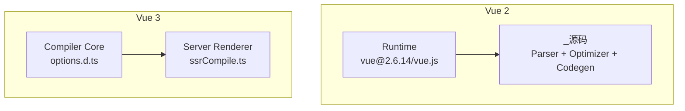
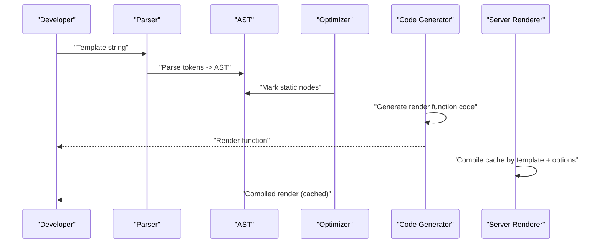
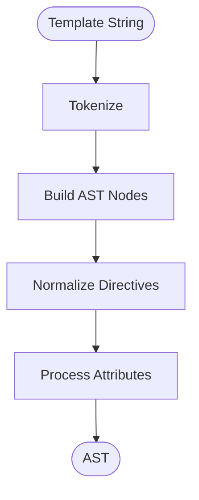
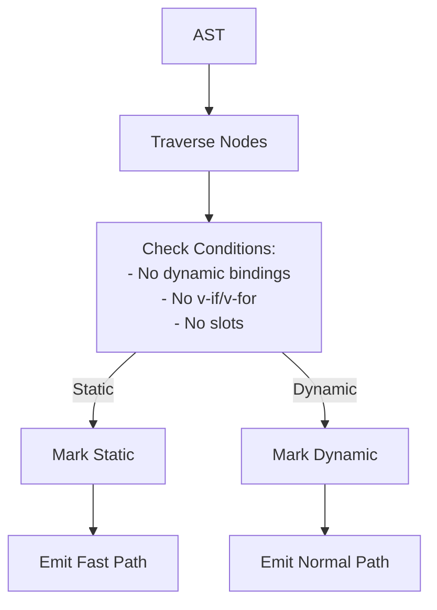
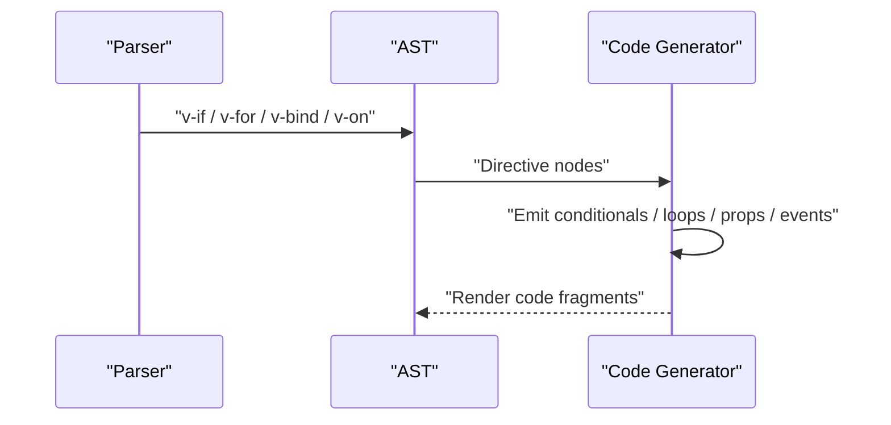
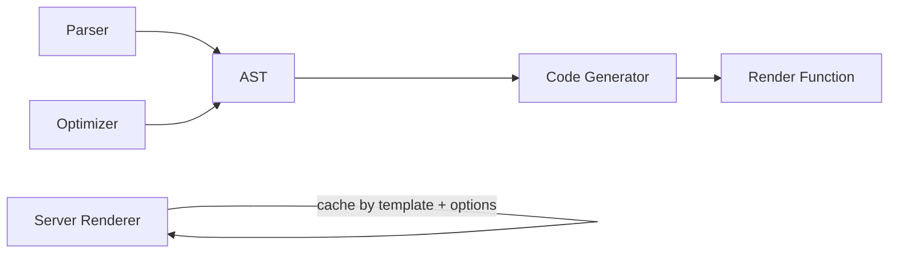

# Compilation Process

<cite>
**Referenced Files in This Document**
- [README.md](file://README.md)
- [vue@2.6.14 vue.js](file://源码学习/vue@2.6.14/vue.js)
- [vue@2.6.14 _源码](file://源码学习/vue@2.6.14/_源码)
- [vue@3.5.26 ssrCompile.ts](file://源码学习/vue@3.5.26/packages/server-renderer/src/helpers/ssrCompile.ts)
- [vue@3.5.26 options.d.ts](file://源码学习/vue@3.5.26/packages/compiler-core/src/options.d.ts)
</cite>

## Table of Contents
1. [Introduction](#introduction)
2. [Project Structure](#project-structure)
3. [Core Components](#core-components)
4. [Architecture Overview](#architecture-overview)
5. [Detailed Component Analysis](#detailed-component-analysis)
6. [Dependency Analysis](#dependency-analysis)
7. [Performance Considerations](#performance-considerations)
8. [Troubleshooting Guide](#troubleshooting-guide)
9. [Conclusion](#conclusion)

## Introduction
This document explains Vue 2’s template compilation process end-to-end: parsing, AST generation, directive handling, element and attribute processing, static/dynamic node classification, compilation context and scope handling, expression compilation, and code generation into render functions. It also covers compiler modules (parser, optimizer, code generator), their interactions, and practical examples of template transformations. Finally, it discusses compilation performance, caching strategies, and differences between development and production builds.

## Project Structure
The repository includes Vue 2 and Vue 3 sources. While the Vue 2 source tree is not fully present, Vue 2’s core files (including the runtime and compiler) are available. Vue 3’s compiler-core exposes interfaces and options that help us understand the compilation pipeline and caching mechanisms used in modern Vue.

**Diagram sources**
- [vue@2.6.14 vue.js](file://源码学习/vue@2.6.14/vue.js)
- [vue@2.6.14 _源码](file://源码学习/vue@2.6.14/_源码)
- [vue@3.5.26 options.d.ts](file://源码学习/vue@3.5.26/packages/compiler-core/src/options.d.ts)
- [vue@3.5.26 ssrCompile.ts](file://源码学习/vue@3.5.26/packages/server-renderer/src/helpers/ssrCompile.ts)

**Section sources**
- [README.md](file://README.md)
- [vue@2.6.14 vue.js](file://源码学习/vue@2.6.14/vue.js)
- [vue@2.6.14 _源码](file://源码学习/vue@2.6.14/_源码)
- [vue@3.5.26 options.d.ts](file://源码学习/vue@3.5.26/packages/compiler-core/src/options.d.ts)
- [vue@3.5.26 ssrCompile.ts](file://源码学习/vue@3.5.26/packages/server-renderer/src/helpers/ssrCompile.ts)

## Core Components
- Parser: Converts template strings into an Abstract Syntax Tree (AST), handling elements, attributes, directives, comments, and text nodes.
- Optimizer: Performs static analysis to mark static subtrees and optimize rendering.
- Code Generator: Traverses the AST to produce JavaScript render function code.
- Directive Pipeline: Processes directives (e.g., v-if, v-for, v-bind, v-on) during parsing and codegen.
- Scope and Context: Tracks variable bindings, slot contexts, component scopes, and parent-child relationships.
- Expression Compilation: Compiles expressions inside directives and interpolations into executable JS.

These components work together to transform templates into efficient render functions.

**Section sources**
- [vue@3.5.26 options.d.ts](file://源码学习/vue@3.5.26/packages/compiler-core/src/options.d.ts)

## Architecture Overview
The Vue 2 compilation pipeline transforms a template into a render function. The parser builds an AST; the optimizer marks static nodes; the code generator emits render code. Vue 3’s server renderer demonstrates caching and error handling patterns that mirror production optimizations.

**Diagram sources**
- [vue@3.5.26 ssrCompile.ts](file://源码学习/vue@3.5.26/packages/server-renderer/src/helpers/ssrCompile.ts)
- [vue@3.5.26 options.d.ts](file://源码学习/vue@3.5.26/packages/compiler-core/src/options.d.ts)

## Detailed Component Analysis

### Parsing Phase
- Tokenization and AST construction: The parser reads the template and produces an AST with nodes for elements, text, comments, and directives.
- Attribute and directive recognition: Parses v-bind, v-on, v-if, v-for, and others, extracting modifiers and arguments.
- Namespace and platform awareness: Handles HTML vs SVG namespaces and platform-specific tags.

**Diagram sources**
- [vue@3.5.26 options.d.ts](file://源码学习/vue@3.5.26/packages/compiler-core/src/options.d.ts)

**Section sources**
- [vue@3.5.26 options.d.ts](file://源码学习/vue@3.5.26/packages/compiler-core/src/options.d.ts)

### AST Generation and Static Classification
- Static detection: The optimizer traverses the AST to detect static subtrees and mark them for fast-path rendering.
- Dynamic vs static: Dynamic nodes include expressions, v-if, v-for, and bound attributes; static nodes are emitted once and reused.

**Diagram sources**
- [vue@3.5.26 options.d.ts](file://源码学习/vue@3.5.26/packages/compiler-core/src/options.d.ts)

**Section sources**
- [vue@3.5.26 options.d.ts](file://源码学习/vue@3.5.26/packages/compiler-core/src/options.d.ts)

### Directive Compilation
- v-if: Translates to conditional branches in render code.
- v-for: Generates keyed loops and handles aliases and scopes.
- v-bind: Emits props or attributes depending on the target and static/dynamic nature.
- v-on: Emits event listeners with modifiers and handlers.
- Specials: Slot and component directives are resolved during codegen to render slot functions and component render logic.

**Diagram sources**
- [vue@3.5.26 options.d.ts](file://源码学习/vue@3.5.26/packages/compiler-core/src/options.d.ts)

**Section sources**
- [vue@3.5.26 options.d.ts](file://源码学习/vue@3.5.26/packages/compiler-core/src/options.d.ts)

### Element and Attribute Processing
- Element nodes: Capture tag, namespace, and children.
- Attribute nodes: Normalize to either static attributes or dynamic props based on binding presence.
- Event and prop normalization: Ensures correct DOM attribute vs property emission and event handler wiring.

**Section sources**
- [vue@3.5.26 options.d.ts](file://源码学习/vue@3.5.26/packages/compiler-core/src/options.d.ts)

### Compilation Context and Scope Handling
- Scope tracking: Maintains lexical scope for identifiers, slot scopes, and component boundaries.
- Parent-child relationships: Preserves hierarchy for proper render function generation.
- Slot and component contexts: Injects slot functions and component render logic with correct scope.

**Section sources**
- [vue@3.5.26 options.d.ts](file://源码学习/vue@3.5.26/packages/compiler-core/src/options.d.ts)

### Expression Compilation
- Interpolations and directive expressions: Compiled into executable JS with proper scope and context.
- Error handling: Production builds strip dev-only checks; development builds include warnings and richer errors.

**Section sources**
- [vue@3.5.26 options.d.ts](file://源码学习/vue@3.5.26/packages/compiler-core/src/options.d.ts)

### Code Generation to Render Functions
- Render function emission: Converts AST nodes to createElement calls with proper children, props, and event handlers.
- Optimizations: Uses static trees and fast paths to minimize work at runtime.

**Section sources**
- [vue@3.5.26 options.d.ts](file://源码学习/vue@3.5.26/packages/compiler-core/src/options.d.ts)

### Examples: Template Syntax Transformation
- v-if transformation: Conditional branches become ternary or if statements in render code.
- v-for transformation: Iteration becomes array/map with keyed items.
- v-bind transformation: Static bindings emit as attributes; dynamic bindings emit as props.

These transformations are derived from the directive pipeline and code generation phases.

**Section sources**
- [vue@3.5.26 options.d.ts](file://源码学习/vue@3.5.26/packages/compiler-core/src/options.d.ts)

## Dependency Analysis
The Vue 2 compiler depends on:
- Parser for AST construction
- Optimizer for static detection
- Code Generator for render function emission
- Runtime for render function execution

Vue 3’s server renderer demonstrates:
- Compile-time caching keyed by template and compiler options
- Error handling with code frames in development

**Diagram sources**
- [vue@3.5.26 ssrCompile.ts](file://源码学习/vue@3.5.26/packages/server-renderer/src/helpers/ssrCompile.ts)
- [vue@3.5.26 options.d.ts](file://源码学习/vue@3.5.26/packages/compiler-core/src/options.d.ts)

**Section sources**
- [vue@3.5.26 ssrCompile.ts](file://源码学习/vue@3.5.26/packages/server-renderer/src/helpers/ssrCompile.ts)
- [vue@3.5.26 options.d.ts](file://源码学习/vue@3.5.26/packages/compiler-core/src/options.d.ts)

## Performance Considerations
- Static subtree optimization: Reduces render cost by emitting static trees once.
- Directive batching: v-for and v-if reduce repeated computations via keyed loops and conditional branches.
- Caching: Compile cache keyed by template and compiler options avoids repeated parsing and codegen.
- Development vs production: Development builds include extra checks and warnings; production strips these for smaller bundles and faster execution.

[No sources needed since this section provides general guidance]

## Troubleshooting Guide
- Compilation errors: Vue 3’s server renderer logs helpful messages and code frames in development mode; similar patterns apply to Vue 2’s development builds.
- Cache invalidation: When changing template or compiler options, ensure cache keys change to avoid stale renders.
- Directive misuse: Incorrect directive syntax or unsupported modifiers can cause runtime errors; validate templates and directives.

**Section sources**
- [vue@3.5.26 ssrCompile.ts](file://源码学习/vue@3.5.26/packages/server-renderer/src/helpers/ssrCompile.ts)

## Conclusion
Vue 2’s compilation pipeline converts templates into optimized render functions through a parser, optimizer, and code generator. Directives and attributes are normalized and compiled into efficient runtime code. Static detection and caching further improve performance. Understanding these stages helps diagnose issues, optimize templates, and leverage production-grade performance characteristics.