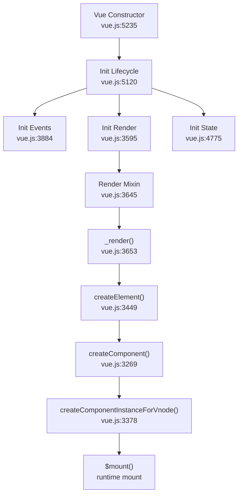
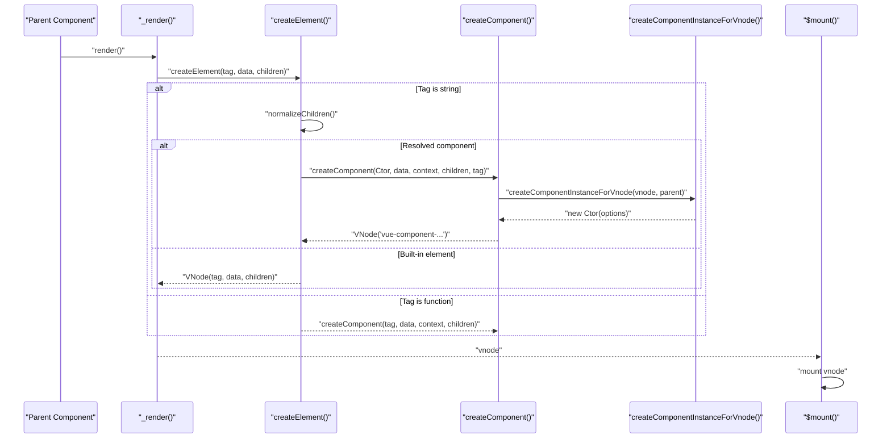
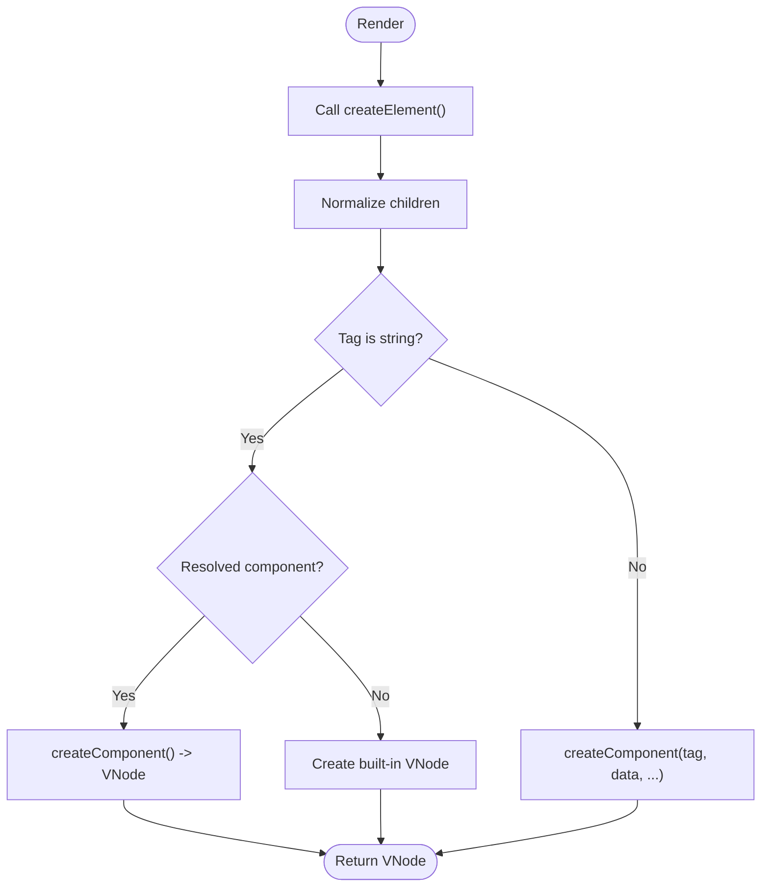
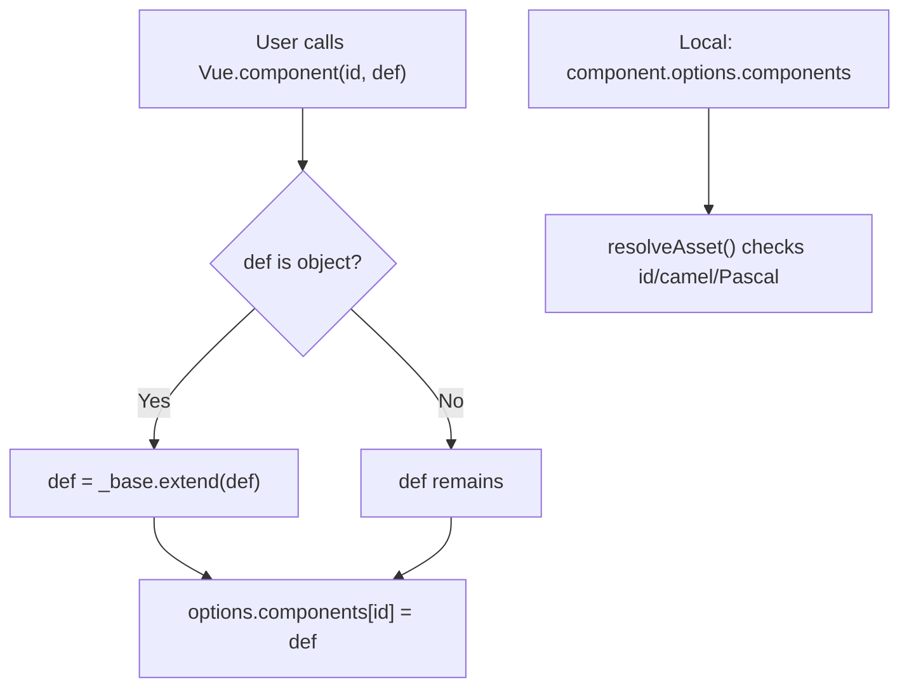
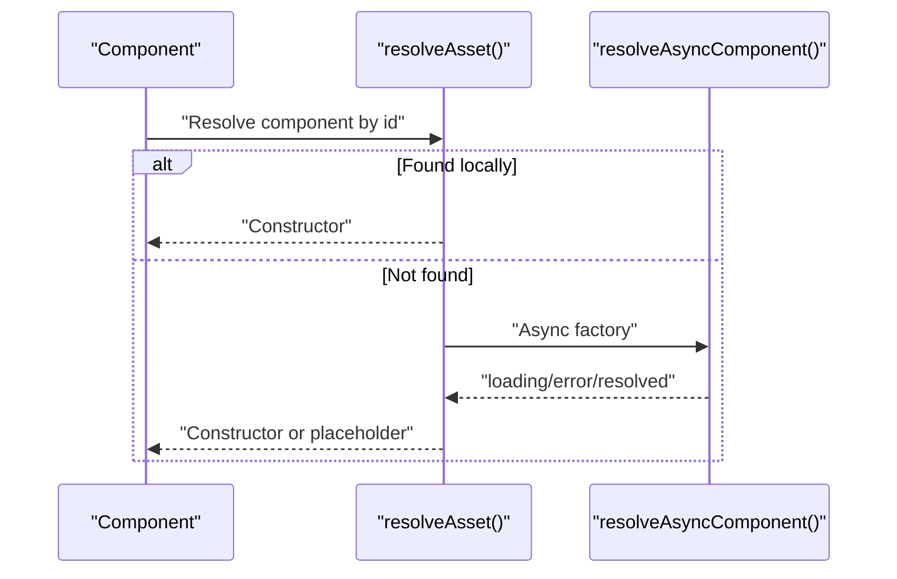
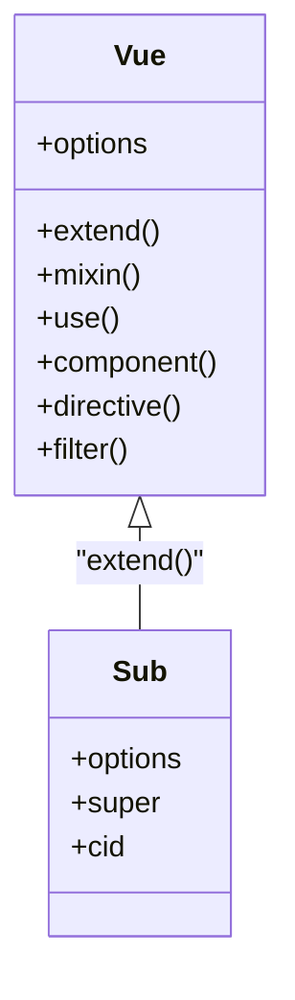
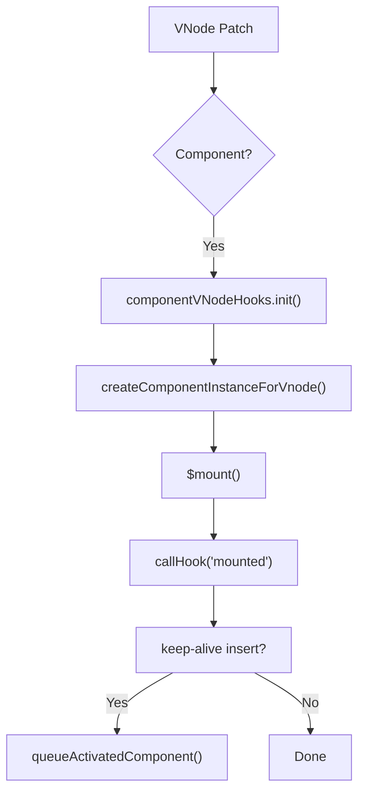
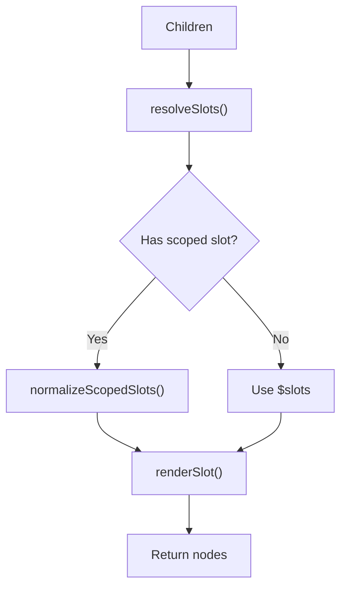
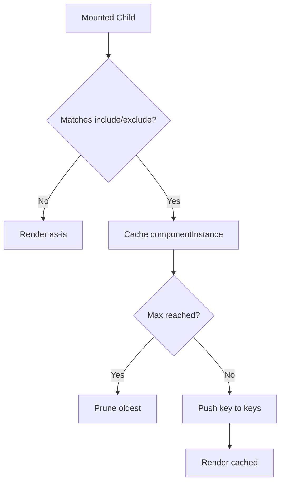
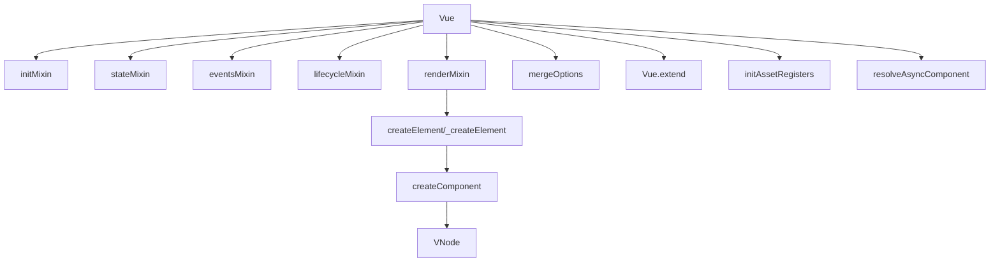

# Component System

<cite>
**Referenced Files in This Document**
- [vue.js](file://源码学习/vue@2.6.14/vue.js)
</cite>

## Table of Contents
1. [Introduction](#introduction)
2. [Project Structure](#project-structure)
3. [Core Components](#core-components)
4. [Architecture Overview](#architecture-overview)
5. [Detailed Component Analysis](#detailed-component-analysis)
6. [Dependency Analysis](#dependency-analysis)
7. [Performance Considerations](#performance-considerations)
8. [Troubleshooting Guide](#troubleshooting-guide)
9. [Conclusion](#conclusion)

## Introduction
This document explains Vue 2’s component system internals with a focus on component creation, registration, lifecycle, options merging, inheritance, composition, and dynamic component loading. It synthesizes the implementation details from the Vue 2.6.14 source to help developers understand how components are constructed, how options are merged and inherited, and how the runtime manages component instances and rendering.

## Project Structure
The Vue 2 component system is implemented in a single bundled file that exposes the Vue constructor, mixins, and runtime helpers. The relevant parts for component internals include:
- Global configuration and asset registries
- Component creation and mounting pipeline
- Options merging and inheritance
- Lifecycle hooks and mixins
- Slots and scoped slots
- Async component resolution
- Keep-alive caching

**Diagram sources**
- [vue.js:5235](file://源码学习/vue@2.6.14/vue.js#L5235-L5247)
- [vue.js:5120](file://源码学习/vue@2.6.14/vue.js#L5120-L5175)
- [vue.js:3595](file://源码学习/vue@2.6.14/vue.js#L3595-L3641)
- [vue.js:3645](file://源码学习/vue@2.6.14/vue.js#L3645-L3719)
- [vue.js:3449](file://源码学习/vue@2.6.14/vue.js#L3449-L3560)
- [vue.js:3269](file://源码学习/vue@2.6.14/vue.js#L3269-L3376)
- [vue.js:3378](file://源码学习/vue@2.6.14/vue.js#L3378-L3396)

**Section sources**
- [vue.js:5235](file://源码学习/vue@2.6.14/vue.js#L5235-L5247)
- [vue.js:5120](file://源码学习/vue@2.6.14/vue.js#L5120-L5175)
- [vue.js:3595](file://源码学习/vue@2.6.14/vue.js#L3595-L3641)
- [vue.js:3645](file://源码学习/vue@2.6.14/vue.js#L3645-L3719)
- [vue.js:3449](file://源码学习/vue@2.6.14/vue.js#L3449-L3560)
- [vue.js:3269](file://源码学习/vue@2.6.14/vue.js#L3269-L3376)
- [vue.js:3378](file://源码学习/vue@2.6.14/vue.js#L3378-L3396)

## Core Components
- Vue constructor and initialization
  - Vue constructor validates usage and delegates to _init.
  - _init orchestrates lifecycle, events, render, state, and mounting.
- Component creation and mounting
  - createElement creates VNodes for built-ins, components, or async placeholders.
  - createComponent builds component VNodes and installs component hooks.
  - createComponentInstanceForVnode instantiates component classes with internal options.
- Options merging and inheritance
  - mergeOptions merges parent and child options with type-specific strategies.
  - resolveConstructorOptions ensures extended component options are resolved.
  - Vue.extend creates subclass constructors with merged options and cached prototypes.
- Registration and resolution
  - Global asset registration via Vue.component/directive/filter.
  - Local registration via component options.
  - resolveAsset resolves assets along the prototype chain.
- Lifecycle and mixins
  - LIFECYCLE_HOOKS define lifecycle phases.
  - lifecycleMixin adds lifecycle methods to Vue prototype.
  - mixins are merged via mergeOptions.
- Slots and scoped slots
  - resolveSlots organizes children into named/default slots.
  - normalizeScopedSlots handles stable and dynamic scoped slots.
- Async components
  - resolveAsyncComponent and createAsyncPlaceholder manage async factories and loading/error states.
- Keep-alive
  - Built-in KeepAlive caches component instances and prunes based on include/exclude/max.

**Section sources**
- [vue.js:5235](file://源码学习/vue@2.6.14/vue.js#L5235-L5247)
- [vue.js:5120](file://源码学习/vue@2.6.14/vue.js#L5120-L5175)
- [vue.js:3449](file://源码学习/vue@2.6.14/vue.js#L3449-L3560)
- [vue.js:3269](file://源码学习/vue@2.6.14/vue.js#L3269-L3376)
- [vue.js:3378](file://源码学习/vue@2.6.14/vue.js#L3378-L3396)
- [vue.js:1573](file://源码学习/vue@2.6.14/vue.js#L1573-L1616)
- [vue.js:5196](file://源码学习/vue@2.6.14/vue.js#L5196-L5233)
- [vue.js:5294](file://源码学习/vue@2.6.14/vue.js#L5294-L5352)
- [vue.js:5371](file://源码学习/vue@2.6.14/vue.js#L5371-L5396)
- [vue.js:1623](file://源码学习/vue@2.6.14/vue.js#L1623-L1647)
- [vue.js:3595](file://源码学习/vue@2.6.14/vue.js#L3595-L3641)
- [vue.js:2594](file://源码学习/vue@2.6.14/vue.js#L2594-L2631)
- [vue.js:2645](file://源码学习/vue@2.6.14/vue.js#L2645-L2689)
- [vue.js:3745](file://源码学习/vue@2.6.14/vue.js#L3745-L3865)
- [vue.js:5442](file://源码学习/vue@2.6.14/vue.js#L5442-L5553)

## Architecture Overview
The component system centers on the render cycle and VNode creation. The flow below maps the key steps from render to DOM updates.

**Diagram sources**
- [vue.js:3653](file://源码学习/vue@2.6.14/vue.js#L3653-L3718)
- [vue.js:3449](file://源码学习/vue@2.6.14/vue.js#L3449-L3560)
- [vue.js:3269](file://源码学习/vue@2.6.14/vue.js#L3269-L3376)
- [vue.js:3378](file://源码学习/vue@2.6.14/vue.js#L3378-L3396)

## Detailed Component Analysis

### Component Creation and Instance Construction
- The render function calls createElement, which:
  - Normalizes children according to normalizationType.
  - Creates VNodes for built-in tags or delegates to createComponent for registered components.
- createComponent:
  - Extends plain options to a constructor via baseCtor.extend.
  - Resolves async factories and returns async placeholders when unresolved.
  - Extracts props and listeners, transforms model, and installs component hooks.
  - Returns a component VNode with componentOptions carrying Ctor, propsData, listeners, tag, and children.
- createComponentInstanceForVnode:
  - Builds component options with _isComponent, _parentVnode, and parent.
  - Supports inline template render/staticRenderFns.
  - Instantiates the component constructor with these options.

**Diagram sources**
- [vue.js:3449](file://源码学习/vue@2.6.14/vue.js#L3449-L3560)
- [vue.js:3269](file://源码学习/vue@2.6.14/vue.js#L3269-L3376)

**Section sources**
- [vue.js:3449](file://源码学习/vue@2.6.14/vue.js#L3449-L3560)
- [vue.js:3269](file://源码学习/vue@2.6.14/vue.js#L3269-L3376)
- [vue.js:3378](file://源码学习/vue@2.6.14/vue.js#L3378-L3396)

### Component Registration APIs (Global vs Local)
- Global registration
  - Vue.component(id, definition) registers components globally.
  - Vue.directive(id, definition) and Vue.filter(id, definition) follow similar patterns.
  - Definitions for components are extended via Vue.options._base.extend.
- Local registration
  - Components can be registered locally in a component’s options.components.
  - resolveAsset checks local registrations first, then camel/Pascal variants, then falls back to prototype chain.

**Diagram sources**
- [vue.js:5371](file://源码学习/vue@2.6.14/vue.js#L5371-L5396)
- [vue.js:1623](file://源码学习/vue@2.6.14/vue.js#L1623-L1647)

**Section sources**
- [vue.js:5371](file://源码学习/vue@2.6.14/vue.js#L5371-L5396)
- [vue.js:1623](file://源码学习/vue@2.6.14/vue.js#L1623-L1647)

### Component Resolution and Dynamic Loading
- resolveAsset:
  - Checks local assets first, then camelCase and PascalCase variants.
  - Warns if not found and returns undefined.
- resolveAsyncComponent:
  - Manages async factories with loading/error states and timers.
  - Returns resolved component constructor or loading/error placeholders.
  - Ensures single owner tracking and forces updates on resolution.

**Diagram sources**
- [vue.js:1623](file://源码学习/vue@2.6.14/vue.js#L1623-L1647)
- [vue.js:3745](file://源码学习/vue@2.6.14/vue.js#L3745-L3865)

**Section sources**
- [vue.js:1623](file://源码学习/vue@2.6.14/vue.js#L1623-L1647)
- [vue.js:3745](file://源码学习/vue@2.6.14/vue.js#L3745-L3865)

### Options Merging, Inheritance, and Composition
- mergeOptions:
  - Validates component names.
  - Normalizes props/inject/directives.
  - Applies extends and mixins before merging.
  - Uses strategy functions per option type (data, props, methods, computed, inject, watch, assets, lifecycle).
- resolveConstructorOptions and resolveModifiedOptions:
  - Ensures super options are resolved and detects late changes.
- Vue.extend:
  - Creates subclass constructors with merged options.
  - Proxies props/computed on prototype to avoid per-instance defineProperty overhead.
  - Caches constructors by super cid.

**Diagram sources**
- [vue.js:5294](file://源码学习/vue@2.6.14/vue.js#L5294-L5352)
- [vue.js:5196](file://源码学习/vue@2.6.14/vue.js#L5196-L5233)

**Section sources**
- [vue.js:1573](file://源码学习/vue@2.6.14/vue.js#L1573-L1616)
- [vue.js:5294](file://源码学习/vue@2.6.14/vue.js#L5294-L5352)
- [vue.js:5196](file://源码学习/vue@2.6.14/vue.js#L5196-L5233)

### Lifecycle Management
- Lifecycle hooks are defined in LIFECYCLE_HOOKS and merged as arrays.
- componentVNodeHooks integrate component lifecycle into VNode patching:
  - init: create component instance and mount
  - prepatch: update component with new props/listeners/children
  - insert: mark mounted and trigger activated hooks for keep-alive
  - destroy: destroy or deactivate child component
- callHook invokes lifecycle methods safely.

**Diagram sources**
- [vue.js:3203](file://源码学习/vue@2.6.14/vue.js#L3203-L3265)
- [vue.js:3378](file://源码学习/vue@2.6.14/vue.js#L3378-L3396)

**Section sources**
- [vue.js:3203](file://源码学习/vue@2.6.14/vue.js#L3203-L3265)
- [vue.js:3378](file://源码学习/vue@2.6.14/vue.js#L3378-L3396)

### Component Composition and Slots
- resolveSlots:
  - Organizes children into named/default slots respecting context.
- renderSlot:
  - Renders scoped slots with provided props and binds, falling back to default render if needed.
- normalizeScopedSlots:
  - Handles stable vs dynamic scoped slots and proxies normal slots.

**Diagram sources**
- [vue.js:2594](file://源码学习/vue@2.6.14/vue.js#L2594-L2631)
- [vue.js:2645](file://源码学习/vue@2.6.14/vue.js#L2645-L2689)
- [vue.js:2771](file://源码学习/vue@2.6.14/vue.js#L2771-L2802)

**Section sources**
- [vue.js:2594](file://源码学习/vue@2.6.14/vue.js#L2594-L2631)
- [vue.js:2645](file://源码学习/vue@2.6.14/vue.js#L2645-L2689)
- [vue.js:2771](file://源码学习/vue@2.6.14/vue.js#L2771-L2802)

### Keep-alive Caching
- KeepAlive caches component instances keyed by a composite key (ctor cid + optional tag).
- Prunes based on include/exclude patterns and max limit.
- Uses hooks to move cached instances into/out of keep-alive.

**Diagram sources**
- [vue.js:5442](file://源码学习/vue@2.6.14/vue.js#L5442-L5553)
- [vue.js:5416](file://源码学习/vue@2.6.14/vue.js#L5416-L5438)

**Section sources**
- [vue.js:5442](file://源码学习/vue@2.6.14/vue.js#L5442-L5553)
- [vue.js:5416](file://源码学习/vue@2.6.14/vue.js#L5416-L5438)

## Dependency Analysis
- Internal dependencies
  - Vue constructor depends on init mixins (initMixin, stateMixin, eventsMixin, lifecycleMixin, renderMixin).
  - Component creation depends on createElement, createComponent, and VNode.
  - Options merging depends on mergeOptions and strategy functions.
  - Async components depend on resolveAsyncComponent and createAsyncPlaceholder.
- External dependencies
  - DOM operations are abstracted via nodeOps for SSR/Weex compatibility.
  - Environment detection influences behavior (browser, SSR, Weex).

**Diagram sources**
- [vue.js:5235](file://源码学习/vue@2.6.14/vue.js#L5235-L5247)
- [vue.js:3449](file://源码学习/vue@2.6.14/vue.js#L3449-L3560)
- [vue.js:3269](file://源码学习/vue@2.6.14/vue.js#L3269-L3376)
- [vue.js:1573](file://源码学习/vue@2.6.14/vue.js#L1573-L1616)
- [vue.js:5294](file://源码学习/vue@2.6.14/vue.js#L5294-L5352)
- [vue.js:5371](file://源码学习/vue@2.6.14/vue.js#L5371-L5396)
- [vue.js:3745](file://源码学习/vue@2.6.14/vue.js#L3745-L3865)

**Section sources**
- [vue.js:5235](file://源码学习/vue@2.6.14/vue.js#L5235-L5247)
- [vue.js:3449](file://源码学习/vue@2.6.14/vue.js#L3449-L3560)
- [vue.js:3269](file://源码学习/vue@2.6.14/vue.js#L3269-L3376)
- [vue.js:1573](file://源码学习/vue@2.6.14/vue.js#L1573-L1616)
- [vue.js:5294](file://源码学习/vue@2.6.14/vue.js#L5294-L5352)
- [vue.js:5371](file://源码学习/vue@2.6.14/vue.js#L5371-L5396)
- [vue.js:3745](file://源码学习/vue@2.6.14/vue.js#L3745-L3865)

## Performance Considerations
- Asynchronous updates and microtasks
  - nextTick uses Promise/MutationObserver/setImmediate with fallback to setTimeout.
  - Microtasks are preferred to avoid interleaving with sequential events.
- Reactive system
  - Observer and defineReactive minimize overhead and avoid observing during render.
  - toggleObserving toggles observation during prop default evaluation.
- Rendering and normalization
  - normalizeChildren and simpleNormalizeChildren reduce virtual DOM complexity.
  - Static trees and v-once are cached to avoid re-rendering.
- Keep-alive
  - Caching reduces mount/unmount costs; pruning prevents unbounded growth.
- Props and computed
  - Props and computed are proxied on prototype to avoid per-instance defineProperty calls.

[No sources needed since this section provides general guidance]

## Troubleshooting Guide
- Error handling
  - invokeWithErrorHandling wraps handlers and routes errors to global/globalHandleError.
  - handleError walks parent chain to invoke errorCaptured hooks.
- Validation
  - validateComponentName enforces component naming rules.
  - assertObjectType validates option shapes.
- Debugging helpers
  - formatComponentName and generateComponentTrace provide readable component traces.
  - warn/tip functions report warnings and tips conditionally.

**Section sources**
- [vue.js:1883](file://源码学习/vue@2.6.14/vue.js#L1883-L1955)
- [vue.js:1447](file://源码学习/vue@2.6.14/vue.js#L1447-L1467)
- [vue.js:1555](file://源码学习/vue@2.6.14/vue.js#L1555-L1567)
- [vue.js:639](file://源码学习/vue@2.6.14/vue.js#L639-L746)

## Conclusion
Vue 2’s component system integrates tightly with the render and patch cycles. Components are created through a deterministic pipeline: render produces VNodes, createElement delegates to createComponent for registered components, and component instances are instantiated with merged options. Options merging, inheritance via Vue.extend, and asset registration enable flexible composition. Lifecycle hooks, slots, and keep-alive round out the system for robust component development. Understanding these internals helps diagnose performance, debug rendering issues, and build efficient component architectures.