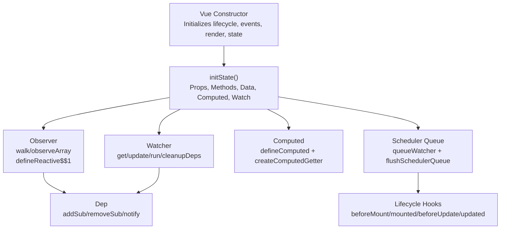
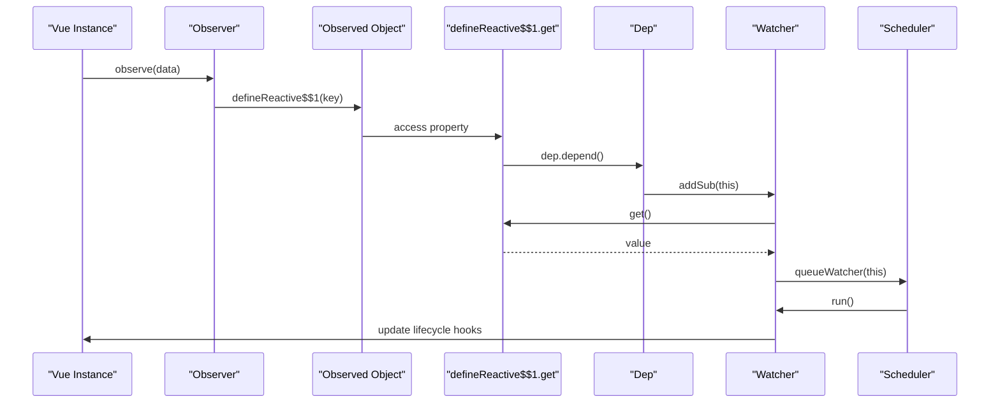
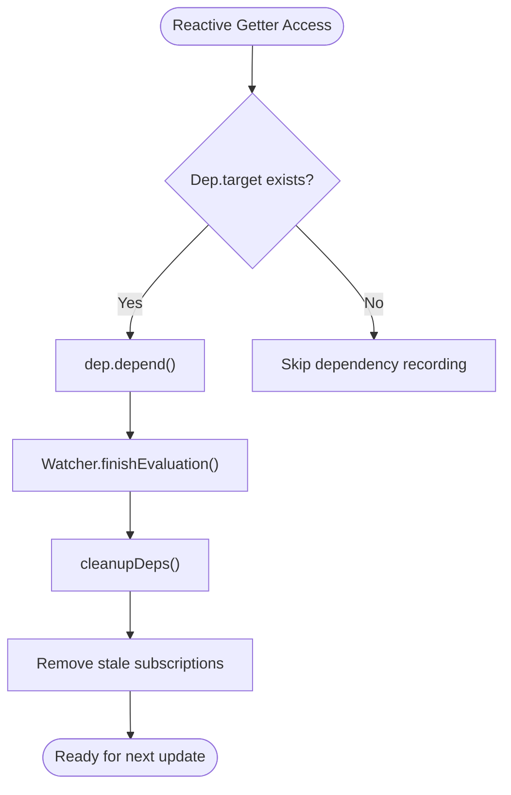
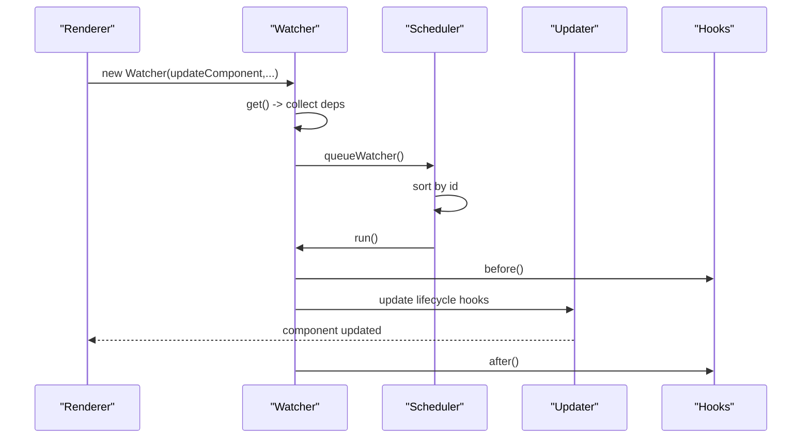
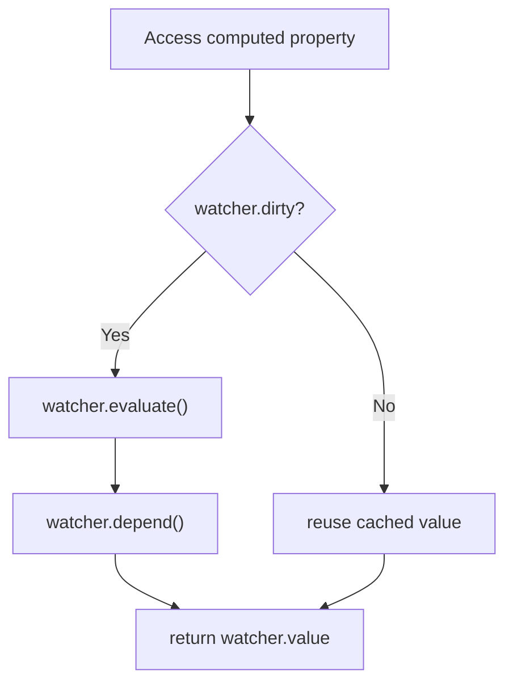
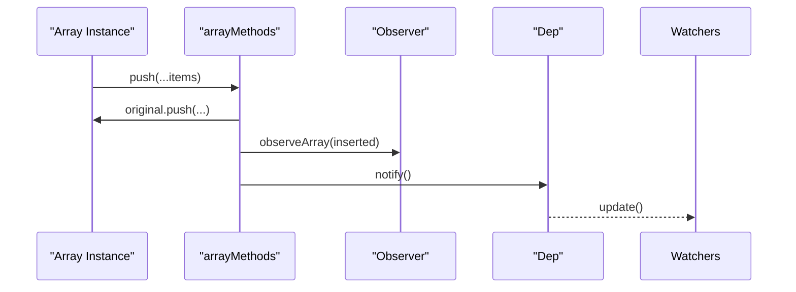
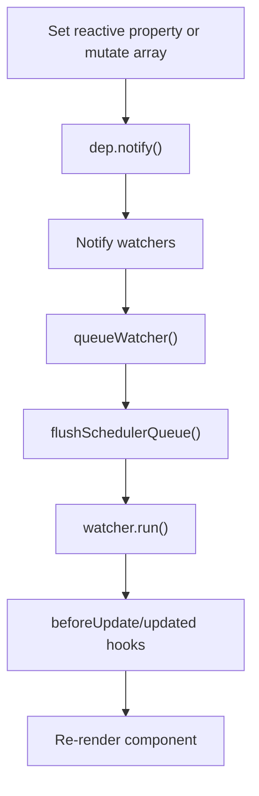
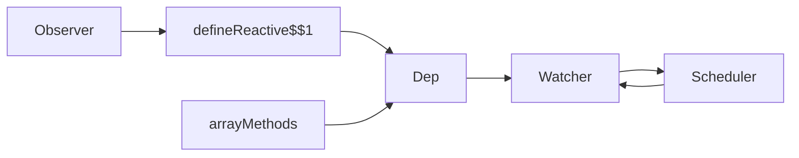

# Reactive System

<cite>
**Referenced Files in This Document**
- [vue.js](file://源码学习/vue@2.6.14/vue.js)
</cite>

## Table of Contents
1. [Introduction](#introduction)
2. [Project Structure](#project-structure)
3. [Core Components](#core-components)
4. [Architecture Overview](#architecture-overview)
5. [Detailed Component Analysis](#detailed-component-analysis)
6. [Dependency Analysis](#dependency-analysis)
7. [Performance Considerations](#performance-considerations)
8. [Troubleshooting Guide](#troubleshooting-guide)
9. [Conclusion](#conclusion)

## Introduction
This document explains Vue 2’s reactive system implementation with a focus on the observer pattern, dependency collection, and watcher mechanisms. It covers how Object.defineProperty is used to make properties reactive, how arrays are instrumented for mutation tracking, and how computed properties and watchers are integrated into the update pipeline. It also documents the dependency graph construction, change detection algorithms, and update propagation, along with practical guidance on lifecycle management, performance, circular dependency handling, and memory leak prevention.

## Project Structure
Vue 2’s reactive system is implemented in a single bundled file that exposes the Vue constructor and its mixins. The reactive primitives live alongside the component lifecycle, watchers, and scheduling infrastructure.



**Diagram sources**
- [vue.js:4775-4795](file://源码学习/vue@2.6.14/vue.js#L4775-L4795)
- [vue.js:967-1054](file://源码学习/vue@2.6.14/vue.js#L967-L1054)
- [vue.js:1059-1114](file://源码学习/vue@2.6.14/vue.js#L1059-L1114)
- [vue.js:4562-4605](file://源码学习/vue@2.6.14/vue.js#L4562-L4605)
- [vue.js:4909-5001](file://源码学习/vue@2.6.14/vue.js#L4909-L5001)
- [vue.js:4525-4551](file://源码学习/vue@2.6.14/vue.js#L4525-L4551)
- [vue.js:756-795](file://源码学习/vue@2.6.14/vue.js#L756-L795)
- [vue.js:4151-4228](file://源码学习/vue@2.6.14/vue.js#L4151-L4228)

**Section sources**
- [vue.js:4775-4795](file://源码学习/vue@2.6.14/vue.js#L4775-L4795)
- [vue.js:967-1054](file://源码学习/vue@2.6.14/vue.js#L967-L1054)
- [vue.js:1059-1114](file://源码学习/vue@2.6.14/vue.js#L1059-L1114)
- [vue.js:4562-4605](file://源码学习/vue@2.6.14/vue.js#L4562-L4605)
- [vue.js:4909-5001](file://源码学习/vue@2.6.14/vue.js#L4909-L5001)
- [vue.js:4525-4551](file://源码学习/vue@2.6.14/vue.js#L4525-L4551)
- [vue.js:756-795](file://源码学习/vue@2.6.14/vue.js#L756-L795)
- [vue.js:4151-4228](file://源码学习/vue@2.6.14/vue.js#L4151-L4228)

## Core Components
- Observer: Converts object properties into reactive getters/setters and attaches an Observer instance to each observed object.
- defineReactive$$1: Uses Object.defineProperty to wrap getters/setters, creates a Dep for each property, and wires child object/array reactivity.
- Dep: Central dependency collector that tracks subscribers (Watchers) and notifies them on changes.
- Watcher: Evaluates expressions, collects dependencies, and schedules updates via the scheduler.
- Scheduler: Batches watcher updates, sorts by ID, prevents infinite loops, and triggers lifecycle hooks.
- Computed: Lazily evaluates derived values with cached results and automatic dependency tracking.
- Array instrumentation: Extends Array.prototype methods to trigger change notifications when mutating.

**Section sources**
- [vue.js:967-1054](file://源码学习/vue@2.6.14/vue.js#L967-L1054)
- [vue.js:1059-1114](file://源码学习/vue@2.6.14/vue.js#L1059-L1114)
- [vue.js:756-795](file://源码学习/vue@2.6.14/vue.js#L756-L795)
- [vue.js:4562-4605](file://源码学习/vue@2.6.14/vue.js#L4562-L4605)
- [vue.js:4525-4551](file://源码学习/vue@2.6.14/vue.js#L4525-L4551)
- [vue.js:4909-5001](file://源码学习/vue@2.6.14/vue.js#L4909-L5001)
- [vue.js:902-945](file://源码学习/vue@2.6.14/vue.js#L902-L945)

## Architecture Overview
Vue 2’s reactive system follows the observer pattern:
- Data observation: Each observed object has an associated Observer that walks its properties and replaces them with reactive getters/setters.
- Dependency collection: When a reactive getter is accessed during render or watcher evaluation, the current Watcher subscribes to the property’s Dep.
- Change detection: On setter invocation or array mutation, the property’s Dep notifies all subscribers.
- Update propagation: Watchers are queued and executed in batches, updating components and firing lifecycle hooks.



**Diagram sources**
- [vue.js:967-1054](file://源码学习/vue@2.6.14/vue.js#L967-L1054)
- [vue.js:1059-1114](file://源码学习/vue@2.6.14/vue.js#L1059-L1114)
- [vue.js:756-795](file://源码学习/vue@2.6.14/vue.js#L756-L795)
- [vue.js:4562-4605](file://源码学习/vue@2.6.14/vue.js#L4562-L4605)
- [vue.js:4525-4551](file://源码学习/vue@2.6.14/vue.js#L4525-L4551)

## Detailed Component Analysis

### Observer and Property Observation
- Observer walks plain objects and converts each property into a reactive getter/setter via defineReactive$$1.
- For arrays, a specialized arrayMethods object augments prototype methods to trigger change notifications.
- Child objects and arrays are recursively observed; nested arrays are traversed to ensure reactivity.

```mermaid
classDiagram
class Observer {
+value
+dep
+vmCount
+walk(obj)
+observeArray(items)
}
class defineReactive$$1 {
+get reactiveGetter()
+set reactiveSetter(newVal)
}
class arrayMethods {
+push()
+pop()
+shift()
+unshift()
+splice()
+sort()
+reverse()
}
Observer --> defineReactive$$1 : "wraps properties"
Observer --> arrayMethods : "augments arrays"
```

**Diagram sources**
- [vue.js:967-1054](file://源码学习/vue@2.6.14/vue.js#L967-L1054)
- [vue.js:1059-1114](file://源码学习/vue@2.6.14/vue.js#L1059-L1114)
- [vue.js:902-945](file://源码学习/vue@2.6.14/vue.js#L902-L945)

**Section sources**
- [vue.js:967-1054](file://源码学习/vue@2.6.14/vue.js#L967-L1054)
- [vue.js:1059-1114](file://源码学习/vue@2.6.14/vue.js#L1059-L1114)
- [vue.js:902-945](file://源码学习/vue@2.6.14/vue.js#L902-L945)

### Dependency Collection and Tracking
- Dep maintains a list of subscribers (Watchers) and exposes methods to add/remove subscriptions and notify them.
- During reactive getter execution, if a watcher is evaluating, the getter records the dependency by calling dep.depend().
- When a watcher finishes evaluation, cleanupDeps removes stale subscriptions.



**Diagram sources**
- [vue.js:756-795](file://源码学习/vue@2.6.14/vue.js#L756-L795)
- [vue.js:4651-4667](file://源码学习/vue@2.6.14/vue.js#L4651-L4667)

**Section sources**
- [vue.js:756-795](file://源码学习/vue@2.6.14/vue.js#L756-L795)
- [vue.js:4651-4667](file://源码学习/vue@2.6.14/vue.js#L4651-L4667)

### Watcher Mechanism and Lifecycle
- Watcher parses expressions, collects dependencies, and runs callbacks when values change.
- Lazy watchers defer evaluation until explicitly requested; sync watchers run immediately; others are queued.
- The scheduler batches updates, sorts by ID, and invokes lifecycle hooks before/after updates.



**Diagram sources**
- [vue.js:4562-4605](file://源码学习/vue@2.6.14/vue.js#L4562-L4605)
- [vue.js:4525-4551](file://源码学习/vue@2.6.14/vue.js#L4525-L4551)
- [vue.js:4151-4228](file://源码学习/vue@2.6.14/vue.js#L4151-L4228)

**Section sources**
- [vue.js:4562-4605](file://源码学习/vue@2.6.14/vue.js#L4562-L4605)
- [vue.js:4525-4551](file://源码学习/vue@2.6.14/vue.js#L4525-L4551)
- [vue.js:4151-4228](file://源码学习/vue@2.6.14/vue.js#L4151-L4228)

### Computed Properties
- Computed properties are lazily evaluated via dedicated watchers with lazy: true.
- A computed getter checks watcher.dirty, evaluates if needed, and depends on the watcher’s dependencies.
- Computed setters are disallowed by default; attempting to set a computed property triggers a warning.



**Diagram sources**
- [vue.js:4909-5001](file://源码学习/vue@2.6.14/vue.js#L4909-L5001)

**Section sources**
- [vue.js:4909-5001](file://源码学习/vue@2.6.14/vue.js#L4909-L5001)

### Array Mutation Tracking
- Array methods (push, pop, shift, unshift, splice, sort, reverse) are overridden to observe inserted items and notify dependencies after mutation.
- The override captures inserted elements for observation and triggers ob.dep.notify().



**Diagram sources**
- [vue.js:902-945](file://源码学习/vue@2.6.14/vue.js#L902-L945)

**Section sources**
- [vue.js:902-945](file://源码学习/vue@2.6.14/vue.js#L902-L945)

### Reactive Data Flow and Update Propagation
- Reactive getters call dep.depend() to subscribe watchers.
- Reactive setters call dep.notify() to trigger updates.
- The scheduler ensures deterministic ordering and prevents infinite loops by tracking cycles.



**Diagram sources**
- [vue.js:1091-1112](file://源码学习/vue@2.6.14/vue.js#L1091-L1112)
- [vue.js:775-789](file://源码学习/vue@2.6.14/vue.js#L775-L789)
- [vue.js:4525-4551](file://源码学习/vue@2.6.14/vue.js#L4525-L4551)
- [vue.js:4431-4499](file://源码学习/vue@2.6.14/vue.js#L4431-L4499)

**Section sources**
- [vue.js:1091-1112](file://源码学习/vue@2.6.14/vue.js#L1091-L1112)
- [vue.js:775-789](file://源码学习/vue@2.6.14/vue.js#L775-L789)
- [vue.js:4525-4551](file://源码学习/vue@2.6.14/vue.js#L4525-L4551)
- [vue.js:4431-4499](file://源码学习/vue@2.6.14/vue.js#L4431-L4499)

### Examples and Practical Guidance
- Reactive data binding: Accessing a reactive property during render subscribes the component’s watcher to that property.
- Computed property caching: Computed getters are only re-evaluated when dependencies change; repeated access returns cached values.
- Watcher cleanup: Call the returned unwatch function from $watch to remove the watcher; teardown removes it from the component’s watcher list and unsubscribes from dependencies.

**Section sources**
- [vue.js:4909-5001](file://源码学习/vue@2.6.14/vue.js#L4909-L5001)
- [vue.js:5095-5114](file://源码学习/vue@2.6.14/vue.js#L5095-L5114)
- [vue.js:4740-4754](file://源码学习/vue@2.6.14/vue.js#L4740-L4754)

## Dependency Analysis
Vue 2’s reactive system exhibits tight coupling between Observer, Dep, and Watcher, with the scheduler mediating update propagation. The dependency graph is implicit: each reactive property holds a Dep, and each Watcher holds references to the Deps it depends on. Array mutations are decoupled from property setters via the augmented array methods.



**Diagram sources**
- [vue.js:1059-1114](file://源码学习/vue@2.6.14/vue.js#L1059-L1114)
- [vue.js:756-795](file://源码学习/vue@2.6.14/vue.js#L756-L795)
- [vue.js:4562-4605](file://源码学习/vue@2.6.14/vue.js#L4562-L4605)
- [vue.js:4525-4551](file://源码学习/vue@2.6.14/vue.js#L4525-L4551)
- [vue.js:902-945](file://源码学习/vue@2.6.14/vue.js#L902-L945)

**Section sources**
- [vue.js:1059-1114](file://源码学习/vue@2.6.14/vue.js#L1059-L1114)
- [vue.js:756-795](file://源码学习/vue@2.6.14/vue.js#L756-L795)
- [vue.js:4562-4605](file://源码学习/vue@2.6.14/vue.js#L4562-L4605)
- [vue.js:4525-4551](file://源码学习/vue@2.6.14/vue.js#L4525-L4551)
- [vue.js:902-945](file://源码学习/vue@2.6.14/vue.js#L902-L945)

## Performance Considerations
- Batched updates: The scheduler queues watchers and flushes them in a single tick to minimize reflows and redundant computations.
- Lazy evaluation: Computed watchers are lazy; they only compute when accessed and cache results until dependencies change.
- Deep traversal: Deep watching traverses nested structures; use shallow watchers or limit deep observation for large datasets.
- Array mutation: Mutating arrays triggers notifications; prefer batched mutations and avoid frequent small pushes/pops.
- Avoid excessive watchers: Prefer computed properties and component-level watchers to reduce watcher count.

[No sources needed since this section provides general guidance]

## Troubleshooting Guide
- Infinite update loops: The scheduler detects cycles by counting repeated watcher IDs and warns when exceeding a threshold.
- Memory leaks: Ensure watchers are torn down (e.g., unwatch returned functions, component destruction) to remove subscriptions and prevent lingering references.
- Silent failures: Use Vue.config.errorHandler to capture watcher errors; the system wraps callbacks to handle exceptions gracefully.

**Section sources**
- [vue.js:4461-4471](file://源码学习/vue@2.6.14/vue.js#L4461-L4471)
- [vue.js:4740-4754](file://源码学习/vue@2.6.14/vue.js#L4740-L4754)
- [vue.js:1883-1955](file://源码学习/vue@2.6.14/vue.js#L1883-L1955)

## Conclusion
Vue 2’s reactive system hinges on Object.defineProperty-based property observation, a robust dependency collection mechanism via Dep, and a scheduler-driven update pipeline. Computed properties and watchers integrate seamlessly, enabling efficient, declarative reactive updates. By understanding the observer pattern, dependency graph, and update propagation, developers can build performant applications while avoiding common pitfalls like infinite loops and memory leaks.