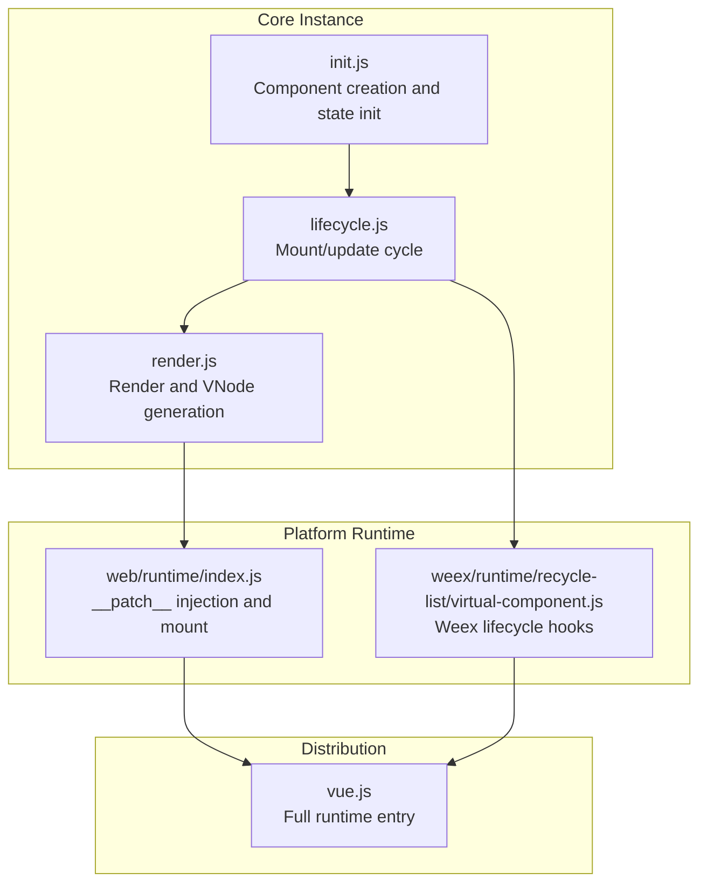
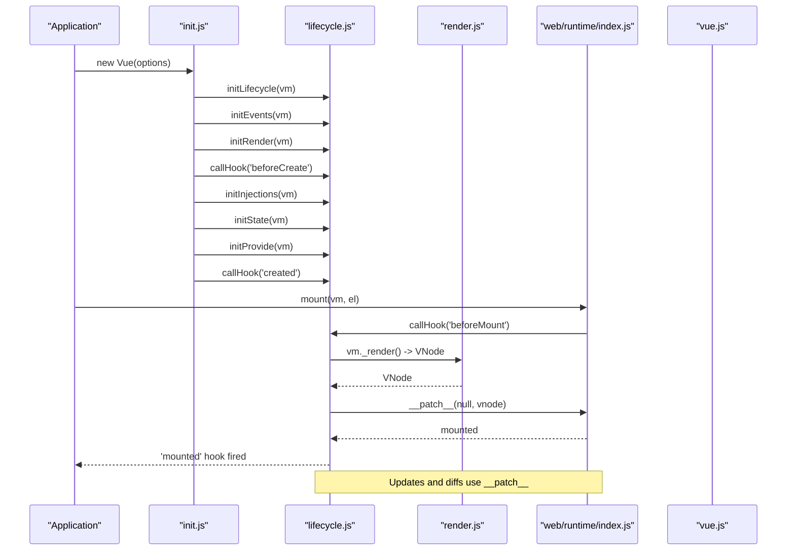
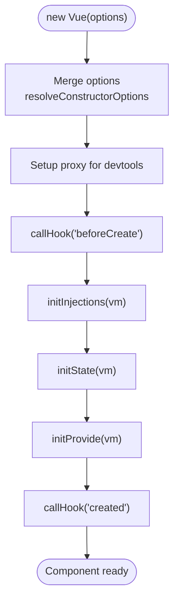
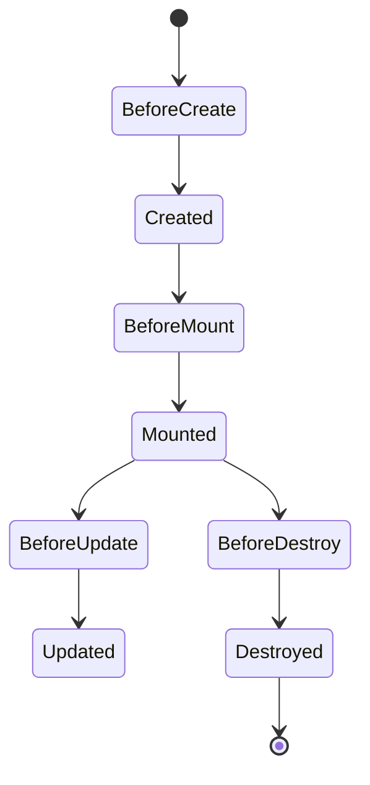
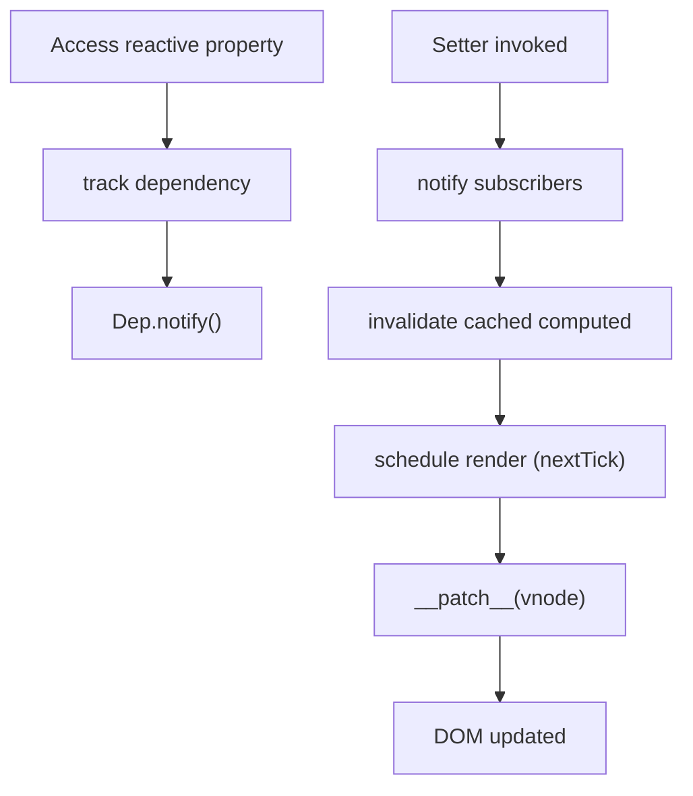
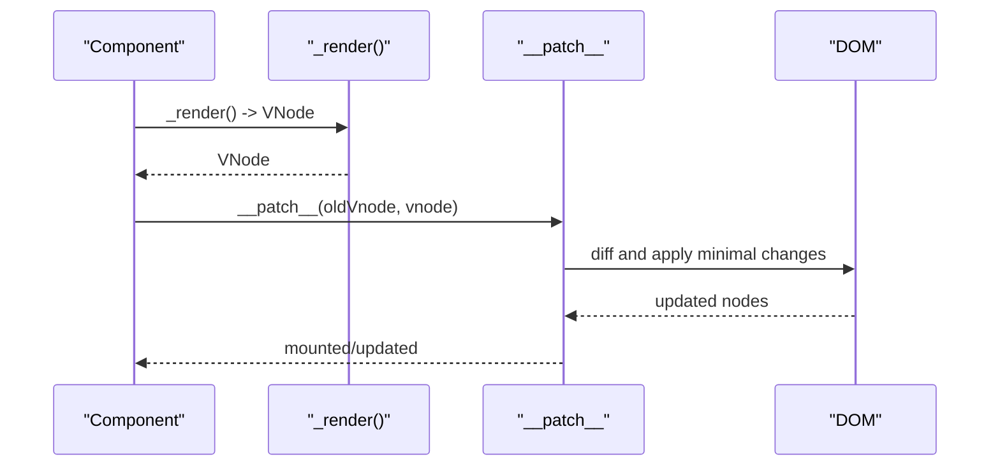
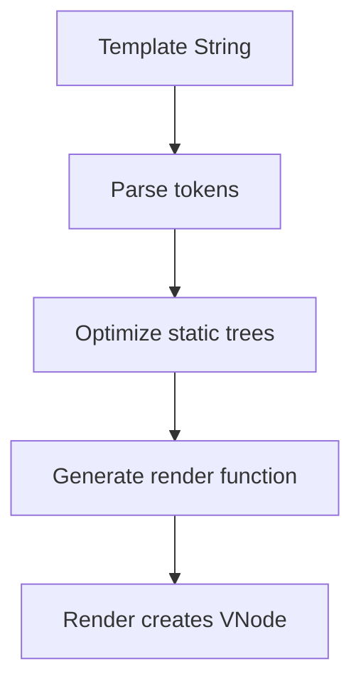
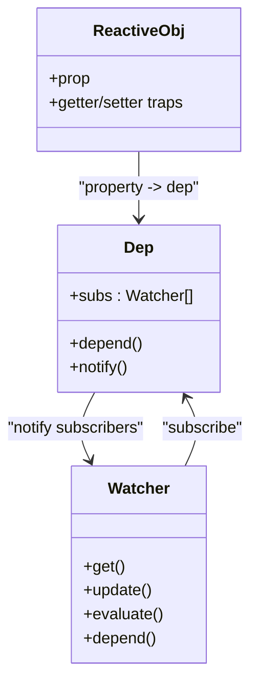
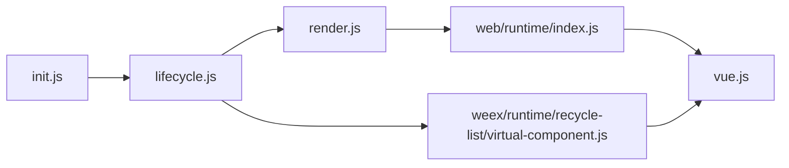

# Vue 2 Internals

<cite>
**Referenced Files in This Document**
- [init.js](file://源码学习/vue@2.6.14/_源码/core/instance/init.js)
- [lifecycle.js](file://源码学习/vue@2.6.14/_源码/core/instance/lifecycle.js)
- [render.js](file://源码学习/vue@2.6.14/_源码/core/instance/render.js)
- [index.js](file://源码学习/vue@2.6.14/_源码/platforms/web/runtime/index.js)
- [virtual-component.js](file://源码学习/vue@2.6.14/_源码/platforms/weex/runtime/recycle-list/virtual-component.js)
- [vue.js](file://源码学习/vue@2.6.14/vue.js)
</cite>

## Table of Contents
1. [Introduction](#introduction)
2. [Project Structure](#project-structure)
3. [Core Components](#core-components)
4. [Architecture Overview](#architecture-overview)
5. [Detailed Component Analysis](#detailed-component-analysis)
6. [Dependency Analysis](#dependency-analysis)
7. [Performance Considerations](#performance-considerations)
8. [Troubleshooting Guide](#troubleshooting-guide)
9. [Conclusion](#conclusion)
10. [Appendices](#appendices)

## Introduction
This document provides an in-depth analysis of Vue 2 internals focusing on the component system, reactive system, virtual DOM and rendering pipeline, compilation from templates to render functions, and the observer/computed/watcher mechanisms. It synthesizes insights from the Vue 2 source code to explain how components are created, registered, mounted, updated, and destroyed; how reactivity tracks dependencies and triggers updates; how the virtual DOM diffing and patching work; and how template compilation produces efficient render functions. Practical examples are referenced from the Vue 2 source to ground the explanations in real implementation details.

## Project Structure
Vue 2’s runtime is organized around a small core with platform-specific integrations:
- Core instance APIs: initialization, lifecycle, rendering, and render helpers
- Platform runtime: web and Weex runtimes inject platform-specific __patch__ and mount behavior
- Compiled distribution: vue.js exposes the full runtime plus compiler

Key areas for this analysis:
- Core instance lifecycle and rendering
- Platform runtime patching and mounting
- Weex virtual component lifecycle hooks
- Full distribution entry points

**Diagram sources**
- [init.js](file://源码学习/vue@2.6.14/_源码/core/instance/init.js)
- [lifecycle.js](file://源码学习/vue@2.6.14/_源码/core/instance/lifecycle.js)
- [render.js](file://源码学习/vue@2.6.14/_源码/core/instance/render.js)
- [index.js](file://源码学习/vue@2.6.14/_源码/platforms/web/runtime/index.js)
- [virtual-component.js](file://源码学习/vue@2.6.14/_源码/platforms/weex/runtime/recycle-list/virtual-component.js)
- [vue.js](file://源码学习/vue@2.6.14/vue.js)

**Section sources**
- [init.js](file://源码学习/vue@2.6.14/_源码/core/instance/init.js)
- [lifecycle.js](file://源码学习/vue@2.6.14/_源码/core/instance/lifecycle.js)
- [render.js](file://源码学习/vue@2.6.14/_源码/core/instance/render.js)
- [index.js](file://源码学习/vue@2.6.14/_源码/platforms/web/runtime/index.js)
- [virtual-component.js](file://源码学习/vue@2.6.14/_源码/platforms/weex/runtime/recycle-list/virtual-component.js)
- [vue.js](file://源码学习/vue@2.6.14/vue.js)

## Core Components
This section outlines the primary subsystems and their responsibilities:
- Component creation and registration: component constructor creation, merging options, and prototype initialization
- Lifecycle management: beforeCreate, created, beforeMount, mounted, beforeUpdate, updated, beforeDestroy, destroyed
- Reactive system: dependency collection via getter/setter traps and watcher-driven invalidation
- Rendering and virtual DOM: render function generation, VNode creation, and platform-specific patching
- Compilation: transforming templates into render functions during build or runtime (depending on build flavor)

**Section sources**
- [init.js](file://源码学习/vue@2.6.14/_源码/core/instance/init.js)
- [lifecycle.js](file://源码学习/vue@2.6.14/_源码/core/instance/lifecycle.js)
- [render.js](file://源码学习/vue@2.6.14/_源码/core/instance/render.js)
- [index.js](file://源码学习/vue@2.6.14/_源码/platforms/web/runtime/index.js)
- [virtual-component.js](file://源码学习/vue@2.6.14/_源码/platforms/weex/runtime/recycle-list/virtual-component.js)
- [vue.js](file://源码学习/vue@2.6.14/vue.js)

## Architecture Overview
Vue 2’s runtime architecture centers on the component instance and its lifecycle. The web runtime injects a platform-specific __patch__ method that performs DOM diffing and patching. Weex provides a separate integration that maps lifecycle events to native component lifecycles. The distribution bundle exposes the full runtime.

**Diagram sources**
- [init.js](file://源码学习/vue@2.6.14/_源码/core/instance/init.js)
- [lifecycle.js](file://源码学习/vue@2.6.14/_源码/core/instance/lifecycle.js)
- [render.js](file://源码学习/vue@2.6.14/_源码/core/instance/render.js)
- [index.js](file://源码学习/vue@2.6.14/_源码/platforms/web/runtime/index.js)
- [vue.js](file://源码学习/vue@2.6.14/vue.js)

## Detailed Component Analysis

### Component Creation and Registration
- Component creation starts with Vue.prototype._init, which merges options, initializes lifecycle, events, render context, and state (injections, state, provide). Hooks beforeCreate and created are called around state initialization.
- Component constructors are extended via Vue.extend, enabling subclassing and reuse. Options merging ensures parent and child options are properly combined.

**Diagram sources**
- [init.js](file://源码学习/vue@2.6.14/_源码/core/instance/init.js)

**Section sources**
- [init.js](file://源码学习/vue@2.6.14/_源码/core/instance/init.js)

### Lifecycle Management
- Mount lifecycle: beforeMount and mounted are invoked around the first render and patch. The update cycle follows beforeUpdate and updated after subsequent renders.
- Destruction lifecycle: beforeDestroy and destroyed are called when a component is torn down.
- Platform differences: Weex overrides _init and _update to integrate with native component lifecycles and data synchronization.

**Diagram sources**
- [lifecycle.js](file://源码学习/vue@2.6.14/_源码/core/instance/lifecycle.js)
- [virtual-component.js](file://源码学习/vue@2.6.14/_源码/platforms/weex/runtime/recycle-list/virtual-component.js)

**Section sources**
- [lifecycle.js](file://源码学习/vue@2.6.14/_源码/core/instance/lifecycle.js)
- [virtual-component.js](file://源码学习/vue@2.6.14/_源码/platforms/weex/runtime/recycle-list/virtual-component.js)

### Reactive System and Watchers
- Reactivity relies on getter/setter traps to collect dependencies and trigger updates. When a reactive property is accessed, the current watcher subscribes to that dependency. When changed, the setter triggers watchers to recompute and schedule a render.
- Computed properties are lazily evaluated and cached until dependencies change. Watchers are created for user-defined watchers and for internal render watchers to keep the DOM in sync.

**Diagram sources**
- [lifecycle.js](file://源码学习/vue@2.6.14/_源码/core/instance/lifecycle.js)
- [render.js](file://源码学习/vue@2.6.14/_源码/core/instance/render.js)
- [index.js](file://源码学习/vue@2.6.14/_源码/platforms/web/runtime/index.js)

**Section sources**
- [lifecycle.js](file://源码学习/vue@2.6.14/_源码/core/instance/lifecycle.js)
- [render.js](file://源码学习/vue@2.6.14/_源码/core/instance/render.js)
- [index.js](file://源码学习/vue@2.6.14/_源码/platforms/web/runtime/index.js)

### Virtual DOM and Rendering Pipeline
- Render phase: vm._render produces a VNode tree representing the component’s view.
- Patch phase: __patch__ performs DOM diffing and applies minimal DOM mutations to reflect the new VNode tree.
- Platform-specific: The web runtime injects __patch__ conditionally; Weex provides its own lifecycle and update integration.

**Diagram sources**
- [render.js](file://源码学习/vue@2.6.14/_源码/core/instance/render.js)
- [index.js](file://源码学习/vue@2.6.14/_源码/platforms/web/runtime/index.js)

**Section sources**
- [render.js](file://源码学习/vue@2.6.14/_源码/core/instance/render.js)
- [index.js](file://源码学习/vue@2.6.14/_源码/platforms/web/runtime/index.js)

### Template Compilation to Render Functions
- Vue 2 supports two build flavors: runtime-only and full (with compiler). The distribution bundle exposes the full runtime, indicating the compiler is included.
- Compilation converts templates into render functions that produce VNodes efficiently. This process occurs at build time in the full build or at runtime in the runtime-only build when templates are strings.

**Diagram sources**
- [vue.js](file://源码学习/vue@2.6.14/vue.js)

**Section sources**
- [vue.js](file://源码学习/vue@2.6.14/vue.js)

### Observer Pattern, Computed Properties, and Watchers
- Observer pattern: reactive getters subscribe watchers; reactive setters notify dependents.
- Computed properties: memoized computations that invalidate when dependencies change.
- Watchers: user-defined reactive listeners that trigger callbacks on data changes.

**Diagram sources**
- [lifecycle.js](file://源码学习/vue@2.6.14/_源码/core/instance/lifecycle.js)
- [render.js](file://源码学习/vue@2.6.14/_源码/core/instance/render.js)

**Section sources**
- [lifecycle.js](file://源码学习/vue@2.6.14/_源码/core/instance/lifecycle.js)
- [render.js](file://源码学习/vue@2.6.14/_源码/core/instance/render.js)

### Practical Examples from Vue 2 Source
- Component composition patterns: Vue.extend enables subclassing and option merging; lifecycle hooks orchestrate initialization and teardown.
- Event handling: initEvents wires component events to listeners during initialization.
- Directive system: render helpers and directives are integrated into the render pipeline; platform-specific runtimes adapt lifecycle and patching.

References to concrete implementation locations:
- Component creation and hooks: [init.js](file://源码学习/vue@2.6.14/_源码/core/instance/init.js)
- Lifecycle hooks and watcher-driven updates: [lifecycle.js](file://源码学习/vue@2.6.14/_源码/core/instance/lifecycle.js)
- Render function and VNode creation: [render.js](file://源码学习/vue@2.6.14/_源码/core/instance/render.js)
- Platform __patch__ injection and mount: [index.js](file://源码学习/vue@2.6.14/_源码/platforms/web/runtime/index.js)
- Weex lifecycle and update overrides: [virtual-component.js](file://源码学习/vue@2.6.14/_源码/platforms/weex/runtime/recycle-list/virtual-component.js)
- Distribution entry exposing full runtime: [vue.js](file://源码学习/vue@2.6.14/vue.js)

**Section sources**
- [init.js](file://源码学习/vue@2.6.14/_源码/core/instance/init.js)
- [lifecycle.js](file://源码学习/vue@2.6.14/_源码/core/instance/lifecycle.js)
- [render.js](file://源码学习/vue@2.6.14/_源码/core/instance/render.js)
- [index.js](file://源码学习/vue@2.6.14/_源码/platforms/web/runtime/index.js)
- [virtual-component.js](file://源码学习/vue@2.6.14/_源码/platforms/weex/runtime/recycle-list/virtual-component.js)
- [vue.js](file://源码学习/vue@2.6.14/vue.js)

## Dependency Analysis
Vue 2’s core depends on a tight coupling between initialization, lifecycle, rendering, and platform-specific patching. The web runtime injects __patch__, which is central to DOM updates. Weex introduces alternate lifecycle hooks and update semantics.

**Diagram sources**
- [init.js](file://源码学习/vue@2.6.14/_源码/core/instance/init.js)
- [lifecycle.js](file://源码学习/vue@2.6.14/_源码/core/instance/lifecycle.js)
- [render.js](file://源码学习/vue@2.6.14/_源码/core/instance/render.js)
- [index.js](file://源码学习/vue@2.6.14/_源码/platforms/web/runtime/index.js)
- [virtual-component.js](file://源码学习/vue@2.6.14/_源码/platforms/weex/runtime/recycle-list/virtual-component.js)
- [vue.js](file://源码学习/vue@2.6.14/vue.js)

**Section sources**
- [init.js](file://源码学习/vue@2.6.14/_源码/core/instance/init.js)
- [lifecycle.js](file://源码学习/vue@2.6.14/_源码/core/instance/lifecycle.js)
- [render.js](file://源码学习/vue@2.6.14/_源码/core/instance/render.js)
- [index.js](file://源码学习/vue@2.6.14/_源码/platforms/web/runtime/index.js)
- [virtual-component.js](file://源码学习/vue@2.6.14/_源码/platforms/weex/runtime/recycle-list/virtual-component.js)
- [vue.js](file://源码学习/vue@2.6.14/vue.js)

## Performance Considerations
- Minimal DOM updates: __patch__ diffing reduces unnecessary DOM mutations, keeping updates efficient.
- Reactive caching: computed properties cache results until dependencies change, avoiding redundant recalculations.
- Asynchronous scheduling: nextTick batches updates to prevent redundant renders and excessive reflows.
- Static tree optimization: compile-time optimizations mark static subtrees to avoid diffing during updates.
- Memory management: watchers unsubscribe from dependencies on component destroy to prevent leaks.

[No sources needed since this section provides general guidance]

## Troubleshooting Guide
Common issues and where to look in the source:
- Component not mounting: verify beforeMount/mounted hooks and __patch__ injection in the platform runtime.
- Excessive re-renders: inspect watcher updates and computed invalidations around reactive changes.
- Lifecycle hook timing: confirm hook ordering in initialization and destruction sequences.
- Weex-specific lifecycle mismatches: review virtual component lifecycle overrides and update hooks.

**Section sources**
- [lifecycle.js](file://源码学习/vue@2.6.14/_源码/core/instance/lifecycle.js)
- [index.js](file://源码学习/vue@2.6.14/_源码/platforms/web/runtime/index.js)
- [virtual-component.js](file://源码学习/vue@2.6.14/_源码/platforms/weex/runtime/recycle-list/virtual-component.js)

## Conclusion
Vue 2’s internals demonstrate a clean separation of concerns: component initialization and state management, lifecycle orchestration, reactive dependency tracking, and platform-specific rendering via __patch__. The combination of computed caching, watcher-driven invalidation, and targeted DOM diffing yields a robust and efficient rendering system. Understanding these pieces helps diagnose performance issues, extend functionality, and maintain compatibility across platforms like web and Weex.

[No sources needed since this section summarizes without analyzing specific files]

## Appendices
- Build variants: runtime-only vs. full builds determine whether templates are compiled at build or runtime.
- Distribution entry: vue.js exposes the full runtime, including compiler support.

**Section sources**
- [vue.js](file://源码学习/vue@2.6.14/vue.js)