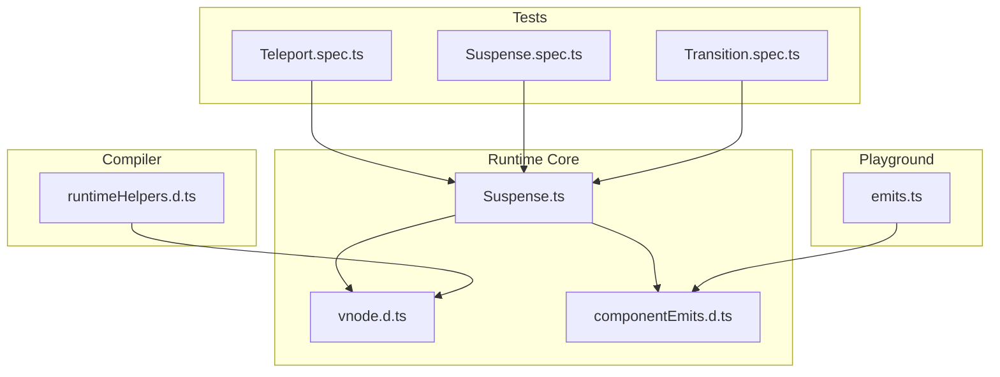
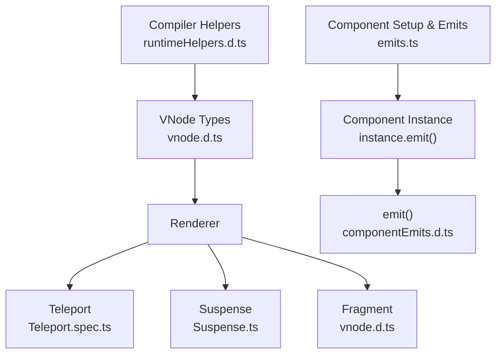
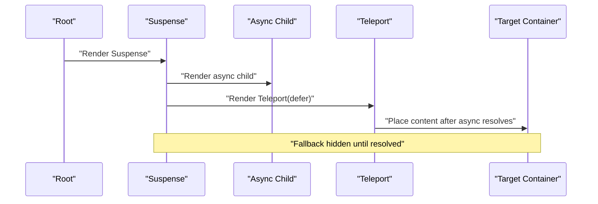
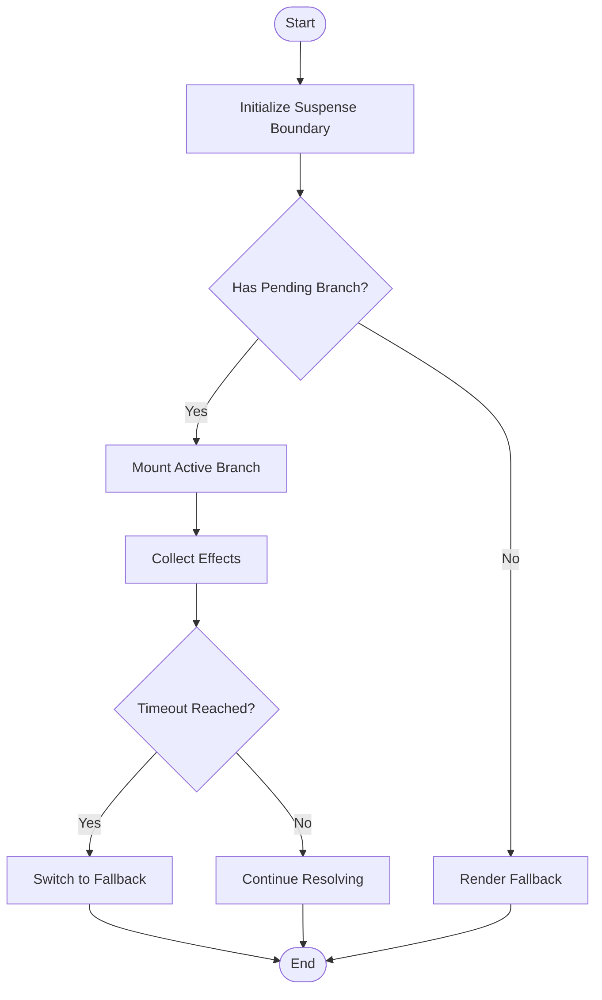
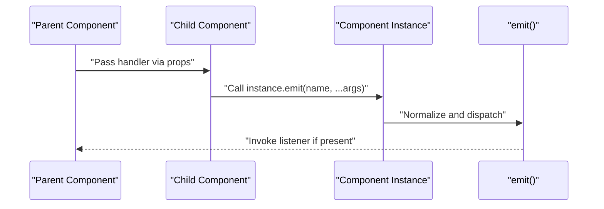
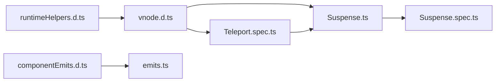

# Component System

<cite>
**Referenced Files in This Document**
- [Teleport.spec.ts](file://源码学习/vue@3.5.26/code/packages/runtime-core/__tests__/components/Teleport.spec.ts)
- [Suspense.spec.ts](file://源码学习/vue@3.5.26/code/packages/runtime-core/__tests__/components/Suspense.spec.ts)
- [Suspense.ts](file://源码学习/vue@3.5.26/code/packages/runtime-core/src/components/Suspense.ts)
- [vnode.d.ts](file://源码学习/vue@3.5.26/code/temp/packages/runtime-core/src/vnode.d.ts)
- [runtimeHelpers.d.ts](file://源码学习/vue@3.5.26/code/packages/compiler-core/src/runtimeHelpers.d.ts)
- [emits.ts](file://源码学习/vue@3.5.26/playground/src/components/组件相关概念/emits/emits.ts)
- [componentEmits.d.ts](file://源码学习/vue@3.5.26/code/packages/runtime-core/src/componentEmits.d.ts)
- [Transition.spec.ts](file://源码学习/vue@3.5.26/code/packages/vue/__tests__/e2e/Transition.spec.ts)
</cite>

## Table of Contents
1. [Introduction](#introduction)
2. [Project Structure](#project-structure)
3. [Core Components](#core-components)
4. [Architecture Overview](#architecture-overview)
5. [Detailed Component Analysis](#detailed-component-analysis)
6. [Dependency Analysis](#dependency-analysis)
7. [Performance Considerations](#performance-considerations)
8. [Troubleshooting Guide](#troubleshooting-guide)
9. [Conclusion](#conclusion)
10. [Appendices](#appendices)

## Introduction
This document explains Vue 3’s component system evolution with a focus on the new component registration model, functional components, removal of implicit this binding, updated lifecycle hooks, and the introduction of Teleport, Suspense, and Fragment. It also covers improved component instance structure, component options normalization, better tree-shaking support, composition patterns, slot handling improvements, the new emits option, migration guidance, and performance optimizations.

## Project Structure
The repository includes a Vue 3 playground and tests that demonstrate the modern component system. Key areas of interest:
- Runtime core components: Teleport, Suspense, Fragment, and VNode types
- Compiler helpers for built-in component identifiers
- Playground examples for emits and component internals
- End-to-end tests integrating transitions with Suspense

**Diagram sources**
- [Suspense.ts:490-535](file://源码学习/vue@3.5.26/code/packages/runtime-core/src/components/Suspense.ts#L490-L535)
- [vnode.d.ts:1-28](file://源码学习/vue@3.5.26/code/temp/packages/runtime-core/src/vnode.d.ts#L1-L28)
- [componentEmits.d.ts:20-29](file://源码学习/vue@3.5.26/code/packages/runtime-core/src/componentEmits.d.ts#L20-L29)
- [runtimeHelpers.d.ts:1-28](file://源码学习/vue@3.5.26/code/packages/compiler-core/src/runtimeHelpers.d.ts#L1-L28)
- [Teleport.spec.ts:65-108](file://源码学习/vue@3.5.26/code/packages/runtime-core/__tests__/components/Teleport.spec.ts#L65-L108)
- [Suspense.spec.ts:1649-1837](file://源码学习/vue@3.5.26/code/packages/runtime-core/__tests__/components/Suspense.spec.ts#L1649-L1837)
- [Transition.spec.ts:2068-2114](file://源码学习/vue@3.5.26/code/packages/vue/__tests__/e2e/Transition.spec.ts#L2068-L2114)
- [emits.ts:1-29](file://源码学习/vue@3.5.26/playground/src/components/组件相关概念/emits/emits.ts#L1-L29)

**Section sources**
- [Suspense.ts:490-535](file://源码学习/vue@3.5.26/code/packages/runtime-core/src/components/Suspense.ts#L490-L535)
- [vnode.d.ts:1-28](file://源码学习/vue@3.5.26/code/temp/packages/runtime-core/src/vnode.d.ts#L1-L28)
- [runtimeHelpers.d.ts:1-28](file://源码学习/vue@3.5.26/code/packages/compiler-core/src/runtimeHelpers.d.ts#L1-L28)
- [Teleport.spec.ts:65-108](file://源码学习/vue@3.5.26/code/packages/runtime-core/__tests__/components/Teleport.spec.ts#L65-L108)
- [Suspense.spec.ts:1649-1837](file://源码学习/vue@3.5.26/code/packages/runtime-core/__tests__/components/Suspense.spec.ts#L1649-L1837)
- [Transition.spec.ts:2068-2114](file://源码学习/vue@3.5.26/code/packages/vue/__tests__/e2e/Transition.spec.ts#L2068-L2114)
- [emits.ts:1-29](file://源码学习/vue@3.5.26/playground/src/components/组件相关概念/emits/emits.ts#L1-L29)
- [componentEmits.d.ts:20-29](file://源码学习/vue@3.5.26/code/packages/runtime-core/src/componentEmits.d.ts#L20-L29)

## Core Components
- Teleport: Moves content to a DOM target outside the component’s natural position, optionally deferring until mounted.
- Suspense: Handles asynchronous dependencies in the component tree, rendering a fallback while children resolve.
- Fragment: Allows grouping nodes without introducing extra wrappers.

These are represented as VNode types and resolved via compiler helpers.

**Section sources**
- [vnode.d.ts:12-21](file://源码学习/vue@3.5.26/code/temp/packages/runtime-core/src/vnode.d.ts#L12-L21)
- [runtimeHelpers.d.ts:1-5](file://源码学习/vue@3.5.26/code/packages/compiler-core/src/runtimeHelpers.d.ts#L1-L5)
- [Teleport.spec.ts:65-108](file://源码学习/vue@3.5.26/code/packages/runtime-core/__tests__/components/Teleport.spec.ts#L65-L108)
- [Suspense.spec.ts:1649-1690](file://源码学习/vue@3.5.26/code/packages/runtime-core/__tests__/components/Suspense.spec.ts#L1649-L1690)

## Architecture Overview
The component system centers around VNode creation and rendering. Built-in components are identified by compiler helpers and resolved during compilation. Suspense coordinates asynchronous branches and renders fallbacks. Teleport moves subtrees to targets. Emits are normalized and invoked through a unified instance method.

**Diagram sources**
- [runtimeHelpers.d.ts:1-28](file://源码学习/vue@3.5.26/code/packages/compiler-core/src/runtimeHelpers.d.ts#L1-L28)
- [vnode.d.ts:1-28](file://源码学习/vue@3.5.26/code/temp/packages/runtime-core/src/vnode.d.ts#L1-L28)
- [Teleport.spec.ts:65-108](file://源码学习/vue@3.5.26/code/packages/runtime-core/__tests__/components/Teleport.spec.ts#L65-L108)
- [Suspense.ts:490-535](file://源码学习/vue@3.5.26/code/packages/runtime-core/src/components/Suspense.ts#L490-L535)
- [emits.ts:1-29](file://源码学习/vue@3.5.26/playground/src/components/组件相关概念/emits/emits.ts#L1-L29)
- [componentEmits.d.ts:20-29](file://源码学习/vue@3.5.26/code/packages/runtime-core/src/componentEmits.d.ts#L20-L29)

## Detailed Component Analysis

### Teleport
Teleport allows moving a subtree to a DOM target outside the component’s natural position. Tests demonstrate deferred teleport behavior inside Suspense, ensuring content appears only after the async child resolves.

Key behaviors:
- Defer mode: content placement occurs after mount
- Works with Suspense boundaries
- Maintains correct DOM anchors

**Diagram sources**
- [Teleport.spec.ts:65-108](file://源码学习/vue@3.5.26/code/packages/runtime-core/__tests__/components/Teleport.spec.ts#L65-L108)

**Section sources**
- [Teleport.spec.ts:65-108](file://源码学习/vue@3.5.26/code/packages/runtime-core/__tests__/components/Teleport.spec.ts#L65-L108)

### Suspense
Suspense coordinates asynchronous dependencies and manages fallback rendering. It tracks pending branches, timeout behavior, and effects. Tests show nested Suspense, toggling outer components, and lifecycle ordering.

Key behaviors:
- Pending branch resolution
- Fallback rendering while resolving
- Nested Suspense with suspensible flag
- Lifecycle ordering across async boundaries

**Diagram sources**
- [Suspense.ts:490-535](file://源码学习/vue@3.5.26/code/packages/runtime-core/src/components/Suspense.ts#L490-L535)
- [Suspense.spec.ts:1649-1837](file://源码学习/vue@3.5.26/code/packages/runtime-core/__tests__/components/Suspense.spec.ts#L1649-L1837)

**Section sources**
- [Suspense.ts:490-535](file://源码学习/vue@3.5.26/code/packages/runtime-core/src/components/Suspense.ts#L490-L535)
- [Suspense.spec.ts:1649-1837](file://源码学习/vue@3.5.26/code/packages/runtime-core/__tests__/components/Suspense.spec.ts#L1649-L1837)

### Fragment
Fragment enables grouping multiple root nodes without adding wrapper elements. It is recognized as a VNode type alongside Teleport and Suspense.

**Section sources**
- [vnode.d.ts:12-17](file://源码学习/vue@3.5.26/code/temp/packages/runtime-core/src/vnode.d.ts#L12-L17)

### Emits Option and Functional Components
Vue 3 introduces a formal emits option with strong typing and a normalized internal representation. The playground demonstrates:
- Normalization of emits options to ObjectEmitsOptions
- Emit listeners verification
- Unified emit invocation via instance.emit()

**Diagram sources**
- [emits.ts:1-29](file://源码学习/vue@3.5.26/playground/src/components/组件相关概念/emits/emits.ts#L1-L29)
- [componentEmits.d.ts:20-29](file://源码学习/vue@3.5.26/code/packages/runtime-core/src/componentEmits.d.ts#L20-L29)

**Section sources**
- [emits.ts:1-29](file://源码学习/vue@3.5.26/playground/src/components/组件相关概念/emits/emits.ts#L1-L29)
- [componentEmits.d.ts:20-29](file://源码学习/vue@3.5.26/code/packages/runtime-core/src/componentEmits.d.ts#L20-L29)

### Component Registration and Composition Patterns
- Built-in component identifiers are exposed as compiler helpers for efficient resolution.
- Functional components can be authored with setup functions and used directly in templates.
- Emits option improves event contract clarity and enables better tree-shaking by avoiding implicit behavior.

**Section sources**
- [runtimeHelpers.d.ts:1-28](file://源码学习/vue@3.5.26/code/packages/compiler-core/src/runtimeHelpers.d.ts#L1-L28)
- [emits.ts:1-29](file://源码学习/vue@3.5.26/playground/src/components/组件相关概念/emits/emits.ts#L1-L29)

### Lifecycle Hooks
Updated lifecycle hooks remain consistent with Vue 3 semantics, coordinating with Suspense and Teleport. Tests demonstrate lifecycle ordering across async boundaries and transitions.

**Section sources**
- [Suspense.spec.ts:1816-1831](file://源码学习/vue@3.5.26/code/packages/runtime-core/__tests__/components/Suspense.spec.ts#L1816-L1831)
- [Transition.spec.ts:2068-2114](file://源码学习/vue@3.5.26/code/packages/vue/__tests__/e2e/Transition.spec.ts#L2068-L2114)

## Dependency Analysis
Built-in components are integrated through VNode types and compiler helpers. Teleport and Suspense depend on renderer internals and VNode anchoring. Emits rely on normalized options and instance emission.

**Diagram sources**
- [runtimeHelpers.d.ts:1-28](file://源码学习/vue@3.5.26/code/packages/compiler-core/src/runtimeHelpers.d.ts#L1-L28)
- [vnode.d.ts:1-28](file://源码学习/vue@3.5.26/code/temp/packages/runtime-core/src/vnode.d.ts#L1-L28)
- [Teleport.spec.ts:65-108](file://源码学习/vue@3.5.26/code/packages/runtime-core/__tests__/components/Teleport.spec.ts#L65-L108)
- [Suspense.ts:490-535](file://源码学习/vue@3.5.26/code/packages/runtime-core/src/components/Suspense.ts#L490-L535)
- [componentEmits.d.ts:20-29](file://源码学习/vue@3.5.26/code/packages/runtime-core/src/componentEmits.d.ts#L20-L29)
- [emits.ts:1-29](file://源码学习/vue@3.5.26/playground/src/components/组件相关概念/emits/emits.ts#L1-L29)
- [Suspense.spec.ts:1649-1690](file://源码学习/vue@3.5.26/code/packages/runtime-core/__tests__/components/Suspense.spec.ts#L1649-L1690)

**Section sources**
- [runtimeHelpers.d.ts:1-28](file://源码学习/vue@3.5.26/code/packages/compiler-core/src/runtimeHelpers.d.ts#L1-L28)
- [vnode.d.ts:1-28](file://源码学习/vue@3.5.26/code/temp/packages/runtime-core/src/vnode.d.ts#L1-L28)
- [Suspense.ts:490-535](file://源码学习/vue@3.5.26/code/packages/runtime-core/src/components/Suspense.ts#L490-L535)
- [Teleport.spec.ts:65-108](file://源码学习/vue@3.5.26/code/packages/runtime-core/__tests__/components/Teleport.spec.ts#L65-L108)
- [componentEmits.d.ts:20-29](file://源码学习/vue@3.5.26/code/packages/runtime-core/src/componentEmits.d.ts#L20-L29)
- [emits.ts:1-29](file://源码学习/vue@3.5.26/playground/src/components/组件相关概念/emits/emits.ts#L1-L29)
- [Suspense.spec.ts:1649-1690](file://源码学习/vue@3.5.26/code/packages/runtime-core/__tests__/components/Suspense.spec.ts#L1649-L1690)

## Performance Considerations
- Tree-shaking: Emits option and explicit component APIs reduce implicit behavior, enabling dead-code elimination.
- Suspense: Efficient fallback rendering and dependency tracking minimize unnecessary re-renders.
- Teleport defer: Avoids premature DOM mutations, improving hydration performance.

[No sources needed since this section provides general guidance]

## Troubleshooting Guide
Common issues and remedies:
- Teleport not appearing: Verify target exists and defer mode is appropriate for async content.
- Suspense fallback stuck: Ensure async promises resolve and lifecycle hooks fire in order.
- Emits not firing: Confirm emits option normalization and listener presence on the instance.

**Section sources**
- [Teleport.spec.ts:65-108](file://源码学习/vue@3.5.26/code/packages/runtime-core/__tests__/components/Teleport.spec.ts#L65-L108)
- [Suspense.spec.ts:1649-1837](file://源码学习/vue@3.5.26/code/packages/runtime-core/__tests__/components/Suspense.spec.ts#L1649-L1837)
- [componentEmits.d.ts:20-29](file://源码学习/vue@3.5.26/code/packages/runtime-core/src/componentEmits.d.ts#L20-L29)

## Conclusion
Vue 3’s component system evolution emphasizes explicit APIs, better composition, and improved developer ergonomics. Teleport, Suspense, and Fragment integrate seamlessly with the VNode model and compiler helpers. The emits option and normalized instance structure enable stronger typing, clearer contracts, and better tree-shaking. Migration focuses on adopting functional components, explicit emits, and updated lifecycle coordination with Suspense and Teleport.

[No sources needed since this section summarizes without analyzing specific files]

## Appendices
- Practical usage examples are demonstrated in tests and playground code referenced above.

[No sources needed since this section provides general guidance]