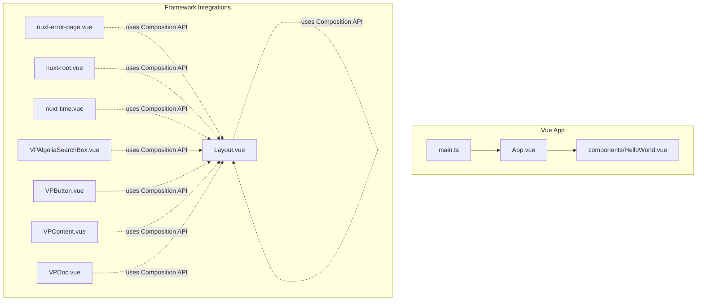
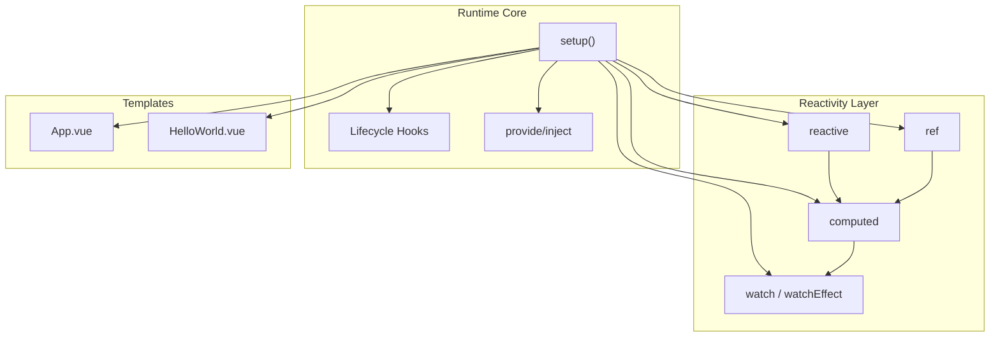
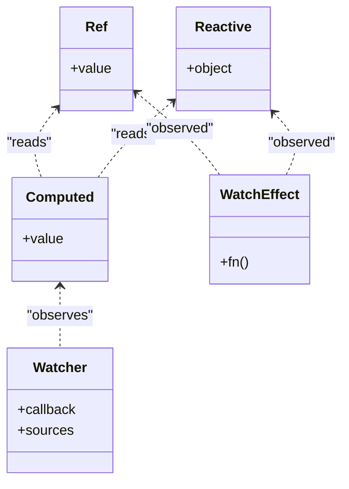
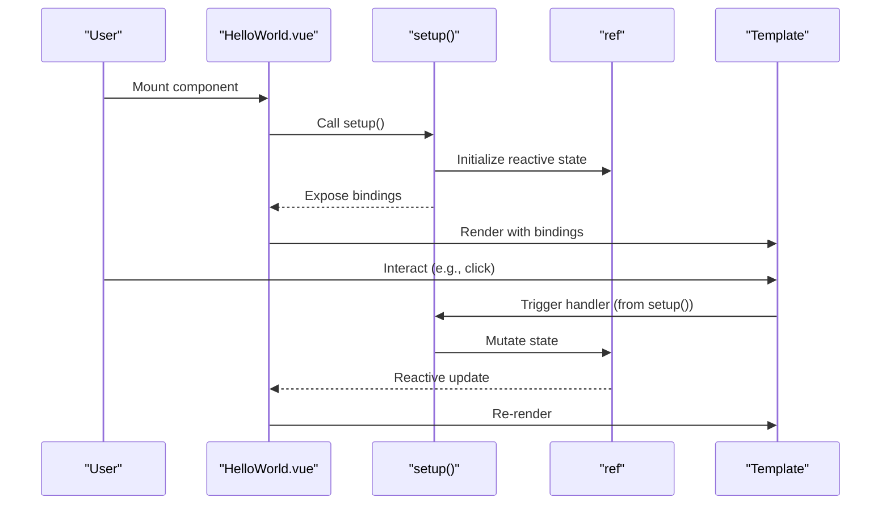
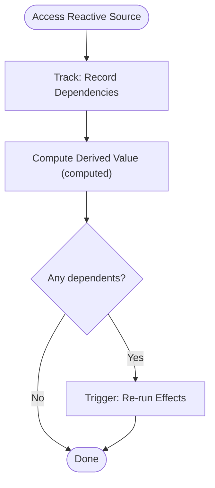
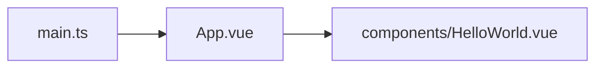
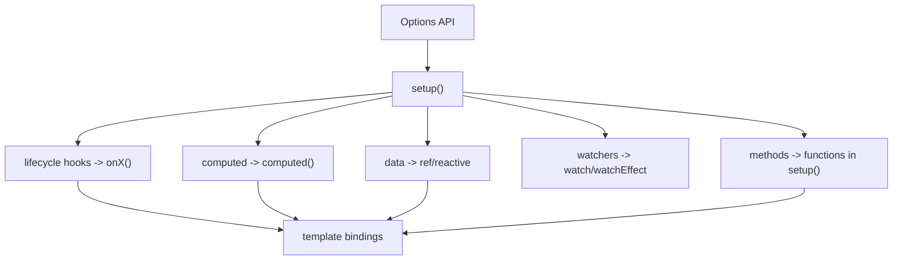
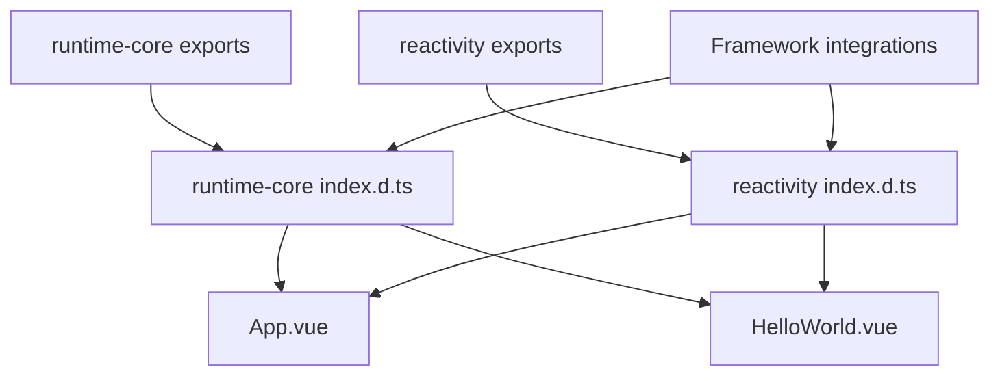

# Composition API

<cite>
**Referenced Files in This Document**
- [App.vue](file://demo/my-vue-app/src/App.vue)
- [HelloWorld.vue](file://demo/my-vue-app/src/components/HelloWorld.vue)
- [main.ts](file://demo/my-vue-app/src/main.ts)
- [index.d.ts](file://source/vue@3.5.26/code/temp/packages/runtime-core/src/index.d.ts)
- [computed.d.ts](file://source/vue@3.5.26/code/temp/packages/reactivity/src/computed.d.ts)
- [index.d.ts](file://source/vue@3.5.26/code/temp/packages/reactivity/src/index.d.ts)
- [依赖管理.ts](file://source/vue@3.5.26/playground/src/components/响应式/依赖管理/依赖管理.ts)
- [ref说明.ts](file://source/vue@3.5.26/playground/src/components/响应式/Ref响应式数据/ref说明.ts)
- [runtime-core index.d.ts](file://source/vue@3.5.26/code/temp/packages/runtime-core/src/index.d.ts)
- [nuxt-error-page.vue](file://demo/nuxt/demo_2/node_modules/nuxt/dist/app/components/nuxt-error-page.vue)
- [nuxt-root.vue](file://demo/nuxt/demo_2/node_modules/nuxt/dist/app/components/nuxt-root.vue)
- [nuxt-time.vue](file://demo/nuxt/demo_2/node_modules/nuxt/dist/app/components/nuxt-time.vue)
- [Layout.vue](file://node_modules/vitepress/dist/client/theme-default/Layout.vue)
- [VPAlgoliaSearchBox.vue](file://node_modules/vitepress/dist/client/theme-default/components/VPAlgoliaSearchBox.vue)
- [VPButton.vue](file://node_modules/vitepress/dist/client/theme-default/components/VPButton.vue)
- [VPContent.vue](file://node_modules/vitepress/dist/client/theme-default/components/VPContent.vue)
- [VPDoc.vue](file://node_modules/vitepress/dist/client/theme-default/components/VPDoc.vue)
</cite>

## Table of Contents
1. [Introduction](#introduction)
2. [Project Structure](#project-structure)
3. [Core Components](#core-components)
4. [Architecture Overview](#architecture-overview)
5. [Detailed Component Analysis](#detailed-component-analysis)
6. [Dependency Analysis](#dependency-analysis)
7. [Performance Considerations](#performance-considerations)
8. [Troubleshooting Guide](#troubleshooting-guide)
9. [Conclusion](#conclusion)
10. [Appendices](#appendices)

## Introduction
This document explains Vue 3’s Composition API and how it improves modularity, reusability, and developer ergonomics compared to the Options API. It covers the core reactive primitives (ref, reactive), derived state (computed), side effects (watch, watchEffect), and the setup() lifecycle. Practical examples are linked to real files in the repository, and migration strategies from Options API to Composition API are provided with side-by-side comparisons. Advanced topics include custom composable creation, state management patterns, and best practices for organizing composition functions.

## Project Structure
The repository includes a small Vue 3 application demonstrating Composition API usage and several Vue-based frameworks (Nuxt, VitePress) that showcase Composition API in practice. The most relevant example is a minimal Vue app with a component using ref and setup().

**Diagram sources**
- [main.ts](file://demo/my-vue-app/src/main.ts)
- [App.vue](file://demo/my-vue-app/src/App.vue)
- [HelloWorld.vue](file://demo/my-vue-app/src/components/HelloWorld.vue)
- [nuxt-error-page.vue](file://demo/nuxt/demo_2/node_modules/nuxt/dist/app/components/nuxt-error-page.vue)
- [nuxt-root.vue](file://demo/nuxt/demo_2/node_modules/nuxt/dist/app/components/nuxt-root.vue)
- [nuxt-time.vue](file://demo/nuxt/demo_2/node_modules/nuxt/dist/app/components/nuxt-time.vue)
- [Layout.vue](file://node_modules/vitepress/dist/client/theme-default/Layout.vue)
- [VPAlgoliaSearchBox.vue](file://node_modules/vitepress/dist/client/theme-default/components/VPAlgoliaSearchBox.vue)
- [VPButton.vue](file://node_modules/vitepress/dist/client/theme-default/components/VPButton.vue)
- [VPContent.vue](file://node_modules/vitepress/dist/client/theme-default/components/VPContent.vue)
- [VPDoc.vue](file://node_modules/vitepress/dist/client/theme-default/components/VPDoc.vue)

**Section sources**
- [main.ts](file://demo/my-vue-app/src/main.ts)
- [App.vue](file://demo/my-vue-app/src/App.vue)
- [HelloWorld.vue](file://demo/my-vue-app/src/components/HelloWorld.vue)
- [nuxt-error-page.vue](file://demo/nuxt/demo_2/node_modules/nuxt/dist/app/components/nuxt-error-page.vue)
- [nuxt-root.vue](file://demo/nuxt/demo_2/node_modules/nuxt/dist/app/components/nuxt-root.vue)
- [nuxt-time.vue](file://demo/nuxt/demo_2/node_modules/nuxt/dist/app/components/nuxt-time.vue)
- [Layout.vue](file://node_modules/vitepress/dist/client/theme-default/Layout.vue)
- [VPAlgoliaSearchBox.vue](file://node_modules/vitepress/dist/client/theme-default/components/VPAlgoliaSearchBox.vue)
- [VPButton.vue](file://node_modules/vitepress/dist/client/theme-default/components/VPButton.vue)
- [VPContent.vue](file://node_modules/vitepress/dist/client/theme-default/components/VPContent.vue)
- [VPDoc.vue](file://node_modules/vitepress/dist/client/theme-default/components/VPDoc.vue)

## Core Components
- ref: Creates a reactive reference to a primitive or object. Access via .value; supports shallow refs and custom refs.
- reactive: Wraps an object to make nested properties reactive; avoids extra .value indirection.
- computed: Derives a reactive value from other reactive sources; supports readonly and writable forms.
- watch/watchEffect: Triggers side effects when reactive sources change; watchEffect runs immediately and auto-tracks.
- setup(): The Composition API entry point for component logic; replaces Options API’s data, methods, computed, and lifecycle hooks.

These APIs are exported from runtime-core and reactivity packages and are used across the Vue ecosystem in this repository.

**Section sources**
- [index.d.ts](file://source/vue@3.5.26/code/temp/packages/runtime-core/src/index.d.ts)
- [computed.d.ts](file://source/vue@3.5.26/code/temp/packages/reactivity/src/computed.d.ts)
- [index.d.ts](file://source/vue@3.5.26/code/temp/packages/reactivity/src/index.d.ts)

## Architecture Overview
The Composition API integrates tightly with Vue’s reactivity system. Reactive primitives (ref, reactive) feed computed getters and watchers; setup() orchestrates logic and exposes bindings to templates. Framework integrations (Nuxt, VitePress) demonstrate Composition API usage in real-world contexts.

**Diagram sources**
- [index.d.ts](file://source/vue@3.5.26/code/temp/packages/runtime-core/src/index.d.ts)
- [index.d.ts](file://source/vue@3.5.26/code/temp/packages/reactivity/src/index.d.ts)
- [App.vue](file://demo/my-vue-app/src/App.vue)
- [HelloWorld.vue](file://demo/my-vue-app/src/components/HelloWorld.vue)

## Detailed Component Analysis

### Composition API Primitives and Their Roles
- ref: Provides reactive scalar/object wrappers with .value access; useful for local state and imperative control.
- reactive: Returns a reactive proxy of an object; ideal for grouping related state.
- computed: Lazily computes derived values; supports writable form for two-way derived state.
- watch/watchEffect: Subscribes to reactive changes; watchEffect auto-tracks reactive reads during execution.

**Diagram sources**
- [index.d.ts](file://source/vue@3.5.26/code/temp/packages/reactivity/src/index.d.ts)
- [computed.d.ts](file://source/vue@3.5.26/code/temp/packages/reactivity/src/computed.d.ts)

**Section sources**
- [index.d.ts](file://source/vue@3.5.26/code/temp/packages/reactivity/src/index.d.ts)
- [computed.d.ts](file://source/vue@3.5.26/code/temp/packages/reactivity/src/computed.d.ts)

### setup() Lifecycle and Replacement of Options API
- setup() replaces Options API’s data, methods, computed, and watchers with a single logical unit.
- It receives props and emits, returns bindings for template consumption, and manages lifecycle via dedicated hooks.
- In this repository, HelloWorld.vue demonstrates ref and setup() usage.

**Diagram sources**
- [HelloWorld.vue](file://demo/my-vue-app/src/components/HelloWorld.vue)

**Section sources**
- [HelloWorld.vue](file://demo/my-vue-app/src/components/HelloWorld.vue)

### Reactive Internals and Dependency Management
Vue 3’s reactivity uses a Track/Trigger model: when a reactive source is accessed, it records who accessed it (dependencies); when mutated, it notifies dependents to re-run.

**Diagram sources**
- [依赖管理.ts](file://source/vue@3.5.26/playground/src/components/响应式/依赖管理/依赖管理.ts)

**Section sources**
- [依赖管理.ts](file://source/vue@3.5.26/playground/src/components/响应式/依赖管理/依赖管理.ts)

### Practical Examples from the Repository
- Minimal Vue app bootstrapping and root component wiring are visible in main.ts and App.vue.
- HelloWorld.vue shows ref and setup() in a component.

**Diagram sources**
- [main.ts](file://demo/my-vue-app/src/main.ts)
- [App.vue](file://demo/my-vue-app/src/App.vue)
- [HelloWorld.vue](file://demo/my-vue-app/src/components/HelloWorld.vue)

**Section sources**
- [main.ts](file://demo/my-vue-app/src/main.ts)
- [App.vue](file://demo/my-vue-app/src/App.vue)
- [HelloWorld.vue](file://demo/my-vue-app/src/components/HelloWorld.vue)

### Migration Strategies: Options API to Composition API
- Replace data with ref or reactive inside setup().
- Convert methods to top-level functions in setup(); return them so templates can call.
- Move computed to computed() and export from setup().
- Convert watchers to watch or watchEffect in setup().
- Use lifecycle hooks (onMounted, onUnmounted, etc.) inside setup().

[No sources needed since this diagram shows conceptual workflow, not actual code structure]

### Advanced Patterns: Custom Composables and State Management
- Custom composable: encapsulate reusable logic into functions returning refs/computed/watchers.
- State management: compose multiple composables to build domain-specific state logic; leverage provide/inject for cross-component sharing.

[No sources needed since this section doesn't analyze specific files]

## Dependency Analysis
Composition API functions are exported from runtime-core and reactivity packages and are used across framework integrations in this repository.

**Diagram sources**
- [runtime-core index.d.ts](file://source/vue@3.5.26/code/temp/packages/runtime-core/src/index.d.ts)
- [index.d.ts](file://source/vue@3.5.26/code/temp/packages/reactivity/src/index.d.ts)
- [App.vue](file://demo/my-vue-app/src/App.vue)
- [HelloWorld.vue](file://demo/my-vue-app/src/components/HelloWorld.vue)

**Section sources**
- [runtime-core index.d.ts](file://source/vue@3.5.26/code/temp/packages/runtime-core/src/index.d.ts)
- [index.d.ts](file://source/vue@3.5.26/code/temp/packages/reactivity/src/index.d.ts)

## Performance Considerations
- Prefer computed for derived state to benefit from memoization and lazy evaluation.
- Use watchEffect for automatic dependency tracking; avoid manual dependency lists when possible.
- Keep heavy work in watchers and computed lazy; avoid unnecessary synchronous computations in render.
- Tree-shaking: prefer importing individual APIs from vue to reduce bundle size.

[No sources needed since this section provides general guidance]

## Troubleshooting Guide
Common pitfalls and remedies:
- Forgetting .value when accessing ref: ensure .value is used for ref-wrapped values.
- Not returning bindings from setup(): templates cannot access internal setup() variables unless returned.
- Misusing watch vs watchEffect: use watchEffect for simpler auto-tracking; use watch for explicit sources and callbacks.
- Incorrect lifecycle hook placement: place lifecycle hooks inside setup() or at module top level.

[No sources needed since this section provides general guidance]

## Conclusion
Vue 3’s Composition API offers a powerful, modular way to organize component logic. By replacing Options API’s scattered concerns with a unified setup() and a rich set of reactive primitives, developers gain better reuse, clearer mental models, and improved tooling support. The examples in this repository illustrate practical usage, while the framework integrations show how Composition API scales to real applications.

[No sources needed since this section summarizes without analyzing specific files]

## Appendices

### API Reference Highlights
- ref, reactive, computed, watch, watchEffect, and lifecycle hooks are exported from runtime-core and reactivity packages.

**Section sources**
- [index.d.ts](file://source/vue@3.5.26/code/temp/packages/runtime-core/src/index.d.ts)
- [computed.d.ts](file://source/vue@3.5.26/code/temp/packages/reactivity/src/computed.d.ts)
- [index.d.ts](file://source/vue@3.5.26/code/temp/packages/reactivity/src/index.d.ts)

### Real-World Usage in Frameworks
- Nuxt and VitePress components import and use Composition API primitives for rendering, error handling, and interactivity.

**Section sources**
- [nuxt-error-page.vue](file://demo/nuxt/demo_2/node_modules/nuxt/dist/app/components/nuxt-error-page.vue)
- [nuxt-root.vue](file://demo/nuxt/demo_2/node_modules/nuxt/dist/app/components/nuxt-root.vue)
- [nuxt-time.vue](file://demo/nuxt/demo_2/node_modules/nuxt/dist/app/components/nuxt-time.vue)
- [Layout.vue](file://node_modules/vitepress/dist/client/theme-default/Layout.vue)
- [VPAlgoliaSearchBox.vue](file://node_modules/vitepress/dist/client/theme-default/components/VPAlgoliaSearchBox.vue)
- [VPButton.vue](file://node_modules/vitepress/dist/client/theme-default/components/VPButton.vue)
- [VPContent.vue](file://node_modules/vitepress/dist/client/theme-default/components/VPContent.vue)
- [VPDoc.vue](file://node_modules/vitepress/dist/client/theme-default/components/VPDoc.vue)