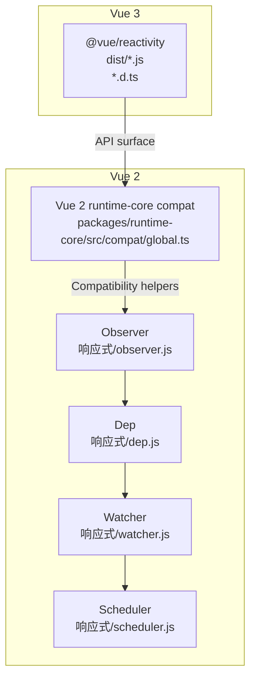
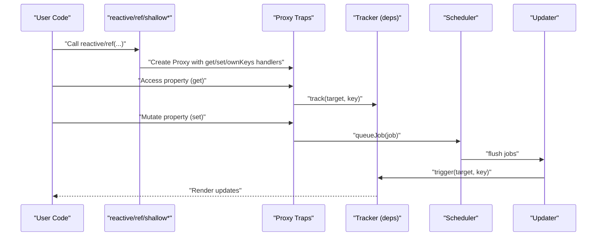
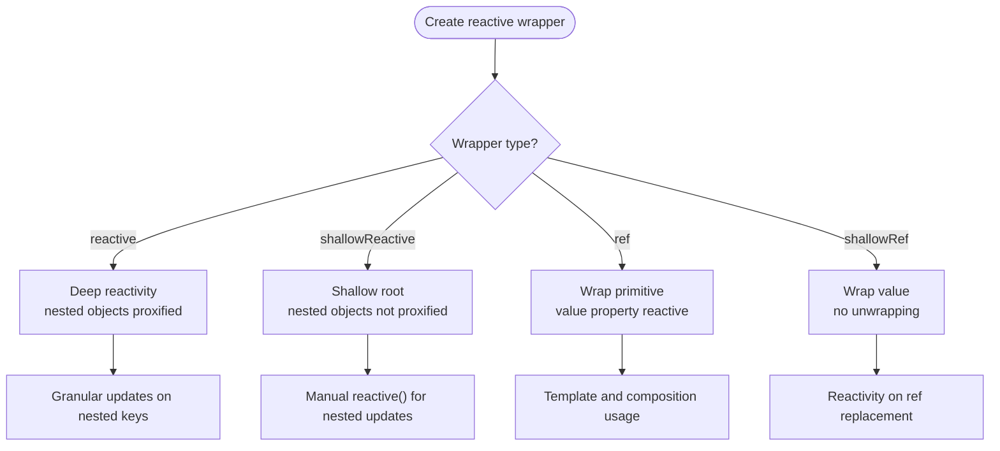
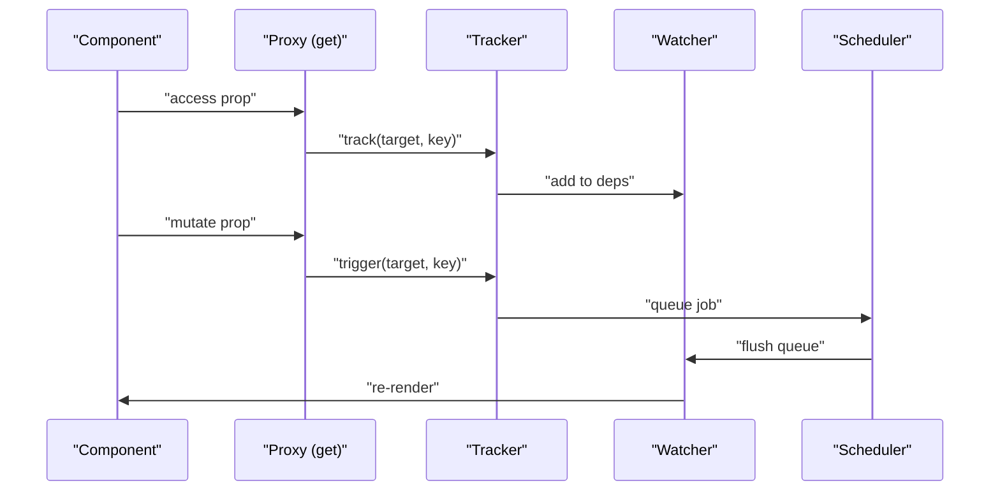
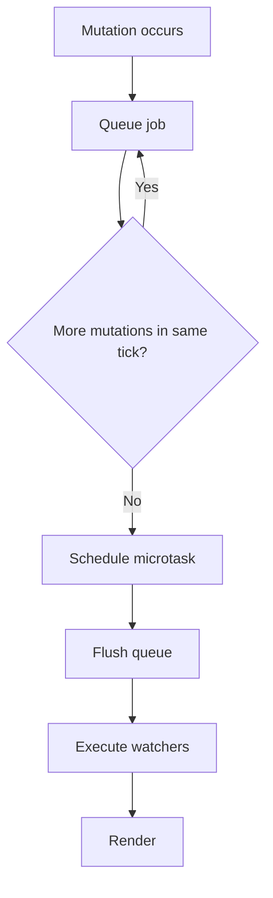
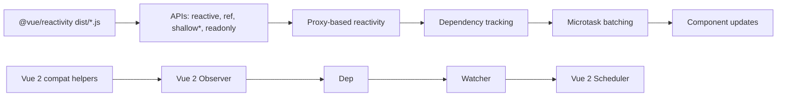

# Reactivity System

<cite>
**Referenced Files in This Document**
- [reactivity.d.ts](file://demo/nuxt/demo_2/node_modules/@vue/reactivity/dist/reactivity.d.ts)
- [reactivity.cjs.js](file://demo/nuxt/demo_2/node_modules/@vue/reactivity/dist/reactivity.cjs.js)
- [reactivity.cjs.prod.js](file://demo/nuxt/demo_2/node_modules/@vue/reactivity/dist/reactivity.cjs.prod.js)
- [README.md](file://demo/nuxt/demo_2/node_modules/@vue/reactivity/README.md)
- [global.ts](file://源码学习/vue@3.5.26/code/packages/runtime-core/src/compat/global.ts)
- [vue@2.6.14 vue.js](file://源码学习/vue@2.6.14/vue.js)
- [vue@2.6.14 06.数据对象模块的处理.html](file://源码学习/vue@2.6.14/06.数据对象模块的处理.html)
- [vue@2.6.14 响应式\observer.js](file://源码学习/vue@2.6.14/响应式/observer.js)
- [vue@2.6.14 响应式\dep.js](file://源码学习/vue@2.6.14/响应式/dep.js)
- [vue@2.6.14 响应式\watcher.js](file://源码学习/vue@2.6.14/响应式/watcher.js)
- [vue@2.6.14 响应式\scheduler.js](file://源码学习/vue@2.6.14/响应式/scheduler.js)
</cite>

## Table of Contents
1. [Introduction](#introduction)
2. [Project Structure](#project-structure)
3. [Core Components](#core-components)
4. [Architecture Overview](#architecture-overview)
5. [Detailed Component Analysis](#detailed-component-analysis)
6. [Dependency Analysis](#dependency-analysis)
7. [Performance Considerations](#performance-considerations)
8. [Troubleshooting Guide](#troubleshooting-guide)
9. [Conclusion](#conclusion)
10. [Appendices](#appendices)

## Introduction
This document explains Vue 3's reactive system architecture and contrasts it with Vue 2. It focuses on the migration from Object.defineProperty to Proxy-based reactivity, the new reactive, ref, shallowReactive, and shallowRef APIs, dependency collection and triggers, granular reactivity, the scheduler system with microtask batching, and readonly wrappers. It also provides performance considerations and practical guidance for choosing between shallow and deep reactivity, and readonly variants.

## Project Structure
The repository includes:
- Vue 3 reactivity package distribution artifacts and typings under the installed @vue/reactivity package
- Vue 2 reactivity internals and compatibility helpers under the Vue 2 source tree
- A Vue 2 compatibility layer that demonstrates how Vue 3’s reactive system evolved from Vue 2’s Object.defineProperty-based approach

**Diagram sources**
- [reactivity.d.ts](file://demo/nuxt/demo_2/node_modules/@vue/reactivity/dist/reactivity.d.ts)
- [reactivity.cjs.js](file://demo/nuxt/demo_2/node_modules/@vue/reactivity/dist/reactivity.cjs.js)
- [global.ts](file://源码学习/vue@3.5.26/code/packages/runtime-core/src/compat/global.ts)
- [vue@2.6.14 响应式/observer.js](file://源码学习/vue@2.6.14/响应式/observer.js)
- [vue@2.6.14 响应式/dep.js](file://源码学习/vue@2.6.14/响应式/dep.js)
- [vue@2.6.14 响应式/watcher.js](file://源码学习/vue@2.6.14/响应式/watcher.js)
- [vue@2.6.14 响应式/scheduler.js](file://源码学习/vue@2.6.14/响应式/scheduler.js)

**Section sources**
- [reactivity.d.ts](file://demo/nuxt/demo_2/node_modules/@vue/reactivity/dist/reactivity.d.ts)
- [reactivity.cjs.js](file://demo/nuxt/demo_2/node_modules/@vue/reactivity/dist/reactivity.cjs.js)
- [README.md](file://demo/nuxt/demo_2/node_modules/@vue/reactivity/README.md)
- [global.ts](file://源码学习/vue@3.5.26/code/packages/runtime-core/src/compat/global.ts)

## Core Components
- reactive: Creates a reactive proxy of an object, enabling automatic dependency tracking and triggering updates when nested properties change.
- ref: Wraps a primitive value to make it reactive via getter/setter access, commonly used in templates and Composition API.
- shallowReactive: Creates a reactive proxy that only tracks reactivity at the root level; nested objects remain non-reactive.
- shallowRef: Wraps a value similar to ref but does not unwrap the inner value; reactivity triggers only on the ref itself, not its nested content.
- readonly: Produces a deeply read-only proxy of an object; attempts to mutate throw errors.
- shallowReadonly: Produces a shallow read-only proxy; nested objects are not made reactive or readonly.
- isReactive/isRef/isReadonly: Utility checks to introspect reactive wrappers.

These APIs are exported by the @vue/reactivity package and documented in its TypeScript declaration file.

**Section sources**
- [reactivity.d.ts](file://demo/nuxt/demo_2/node_modules/@vue/reactivity/dist/reactivity.d.ts)
- [README.md](file://demo/nuxt/demo_2/node_modules/@vue/reactivity/README.md)

## Architecture Overview
Vue 3’s reactivity is built around Proxy traps to intercept property access and mutation. The system maintains a global current active effect (similar to Vue 2’s Watcher) and records dependencies during reads. Mutations trigger a scheduler that batches updates using microtasks to avoid redundant renders.

**Diagram sources**
- [reactivity.d.ts](file://demo/nuxt/demo_2/node_modules/@vue/reactivity/dist/reactivity.d.ts)
- [reactivity.cjs.js](file://demo/nuxt/demo_2/node_modules/@vue/reactivity/dist/reactivity.cjs.js)

## Detailed Component Analysis

### Reactive vs. Ref: Deep vs. Shallow Semantics
- reactive: Deep reactivity. Nested objects become reactive proxies automatically. Granular updates occur when nested keys change.
- shallowReactive: Root-level reactivity only. Nested objects are not wrapped; mutations inside require explicit reactive() to propagate.
- ref: Wraps primitives to expose a reactive object with a value property. Used widely in templates and composition logic.
- shallowRef: Similar to ref but does not unwrap the inner value; reactivity is triggered by replacing the ref.value, not mutating nested properties.

**Diagram sources**
- [reactivity.d.ts](file://demo/nuxt/demo_2/node_modules/@vue/reactivity/dist/reactivity.d.ts)

**Section sources**
- [reactivity.d.ts](file://demo/nuxt/demo_2/node_modules/@vue/reactivity/dist/reactivity.d.ts)

### Dependency Collection and Trigger Mechanism
Vue 3’s Proxy traps call a tracker to collect dependencies when properties are accessed and trigger updates when they are mutated. The Vue 2 compatibility layer demonstrates the same pattern using Object.defineProperty getters/setters and explicit track/trigger calls.

**Diagram sources**
- [global.ts](file://源码学习/vue@3.5.26/code/packages/runtime-core/src/compat/global.ts)

**Section sources**
- [global.ts](file://源码学习/vue@3.5.26/code/packages/runtime-core/src/compat/global.ts)

### Scheduler and Microtask Batching
Vue 3’s scheduler queues update jobs and flushes them in microtasks to batch multiple mutations into a single render cycle. Vue 2’s scheduler.js shows a similar batching concept using nextTick-like mechanisms.

**Diagram sources**
- [reactivity.cjs.js](file://demo/nuxt/demo_2/node_modules/@vue/reactivity/dist/reactivity.cjs.js)
- [vue@2.6.14 响应式/scheduler.js](file://源码学习/vue@2.6.14/响应式/scheduler.js)

**Section sources**
- [reactivity.cjs.js](file://demo/nuxt/demo_2/node_modules/@vue/reactivity/dist/reactivity.cjs.js)
- [vue@2.6.14 响应式/scheduler.js](file://源码学习/vue@2.6.14/响应式/scheduler.js)

### Readonly Wrappers and Use Cases
- readonly: Deeply freezes reactivity; mutations throw.
- shallowReadonly: Shallow freeze; nested objects remain mutable and non-reactive.

Use cases:
- readonly for props passed into components to prevent accidental mutation.
- shallowReadonly for large immutable datasets where deep freezing is unnecessary.

**Section sources**
- [reactivity.d.ts](file://demo/nuxt/demo_2/node_modules/@vue/reactivity/dist/reactivity.d.ts)

### Vue 2 to Vue 3 Migration: Object.defineProperty to Proxy
Vue 2 used Object.defineProperty to wrap object properties and track dependencies via getters/setters. Vue 3 replaces this with Proxy traps for better performance, broader coverage (e.g., adding new keys), and cleaner semantics.

Key differences:
- Coverage: Proxy can trap additions/deletions; Object.defineProperty requires pre-wrapping known keys.
- Performance: Proxy dispatches fewer traps per operation; Vue 3’s scheduler reduces redundant renders.
- Developer ergonomics: Shallow and readonly wrappers simplify common patterns.

**Section sources**
- [vue@2.6.14 响应式/observer.js](file://源码学习/vue@2.6.14/响应式/observer.js)
- [vue@2.6.14 响应式/dep.js](file://源码学习/vue@2.6.14/响应式/dep.js)
- [vue@2.6.14 响应式/watcher.js](file://源码学习/vue@2.6.14/响应式/watcher.js)
- [vue@2.6.14 响应式/scheduler.js](file://源码学习/vue@2.6.14/响应式/scheduler.js)
- [vue@2.6.14 06.数据对象模块的处理.html](file://源码学习/vue@2.6.14/06.数据对象模块的处理.html)
- [vue@2.6.14 vue.js](file://源码学习/vue@2.6.14/vue.js)

## Dependency Analysis
Vue 3’s @vue/reactivity package exposes the reactive system APIs and is intended to be inlined into renderers. The Vue 2 compatibility layer shows how Vue 3’s reactive system evolved from Vue 2’s observer/watcher/scheduler model.

**Diagram sources**
- [reactivity.cjs.js](file://demo/nuxt/demo_2/node_modules/@vue/reactivity/dist/reactivity.cjs.js)
- [global.ts](file://源码学习/vue@3.5.26/code/packages/runtime-core/src/compat/global.ts)
- [vue@2.6.14 响应式/observer.js](file://源码学习/vue@2.6.14/响应式/observer.js)
- [vue@2.6.14 响应式/dep.js](file://源码学习/vue@2.6.14/响应式/dep.js)
- [vue@2.6.14 响应式/watcher.js](file://源码学习/vue@2.6.14/响应式/watcher.js)
- [vue@2.6.14 响应式/scheduler.js](file://源码学习/vue@2.6.14/响应式/scheduler.js)

**Section sources**
- [README.md](file://demo/nuxt/demo_2/node_modules/@vue/reactivity/README.md)
- [reactivity.cjs.js](file://demo/nuxt/demo_2/node_modules/@vue/reactivity/dist/reactivity.cjs.js)
- [global.ts](file://源码学习/vue@3.5.26/code/packages/runtime-core/src/compat/global.ts)

## Performance Considerations
- Granular updates: Vue 3’s Proxy-based system tracks dependencies at the property level, minimizing unnecessary renders compared to Vue 2’s whole-object observation.
- Microtask batching: Vue 3’s scheduler coalesces multiple mutations into a single render pass, reducing layout thrashing.
- Shallow wrappers: Using shallowReactive/shallowRef avoids deep traversal and wrapping for large objects where only top-level mutations are relevant.
- Readonly wrappers: readonly/shallowReadonly prevent accidental mutations and enable immutability assumptions for performance-sensitive code paths.

[No sources needed since this section provides general guidance]

## Troubleshooting Guide
Common issues and remedies:
- Unexpected mutations: Prefer readonly or shallowReadonly for props and external data to catch mutations early.
- Performance regressions: Replace deep reactive structures with shallowReactive/shallowRef when appropriate.
- Template refs: Use ref for primitives and template bindings; use reactive for complex objects with frequent nested updates.
- Compatibility: When migrating from Vue 2, rely on the compatibility helpers to maintain expected behavior during transition.

**Section sources**
- [reactivity.d.ts](file://demo/nuxt/demo_2/node_modules/@vue/reactivity/dist/reactivity.d.ts)
- [global.ts](file://源码学习/vue@3.5.26/code/packages/runtime-core/src/compat/global.ts)

## Conclusion
Vue 3’s reactive system leverages Proxy for superior coverage and performance, combined with a scheduler that batches updates via microtasks. The new APIs—reactive, ref, shallowReactive, shallowRef, readonly, and shallowReadonly—enable precise control over reactivity granularity and immutability, improving both developer ergonomics and runtime performance compared to Vue 2’s Object.defineProperty-based approach.

[No sources needed since this section summarizes without analyzing specific files]

## Appendices

### API Surface and Types
- reactive, ref, shallowReactive, shallowRef, readonly, shallowReadonly, isReactive, isRef, isReadonly, and related utilities are defined in the @vue/reactivity package typings.

**Section sources**
- [reactivity.d.ts](file://demo/nuxt/demo_2/node_modules/@vue/reactivity/dist/reactivity.d.ts)

### Vue 2 Internals Reference
- Vue 2’s observer, dep, watcher, and scheduler demonstrate the foundational concepts that Vue 3 refined with Proxy and improved scheduling.

**Section sources**
- [vue@2.6.14 响应式/observer.js](file://源码学习/vue@2.6.14/响应式/observer.js)
- [vue@2.6.14 响应式/dep.js](file://源码学习/vue@2.6.14/响应式/dep.js)
- [vue@2.6.14 响应式/watcher.js](file://源码学习/vue@2.6.14/响应式/watcher.js)
- [vue@2.6.14 响应式/scheduler.js](file://源码学习/vue@2.6.14/响应式/scheduler.js)