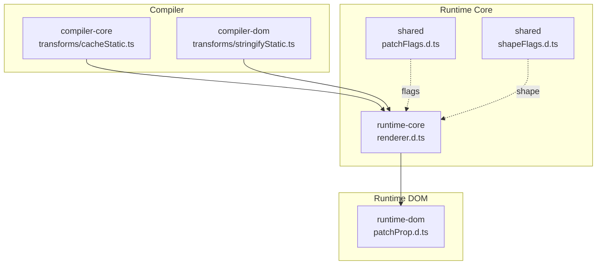
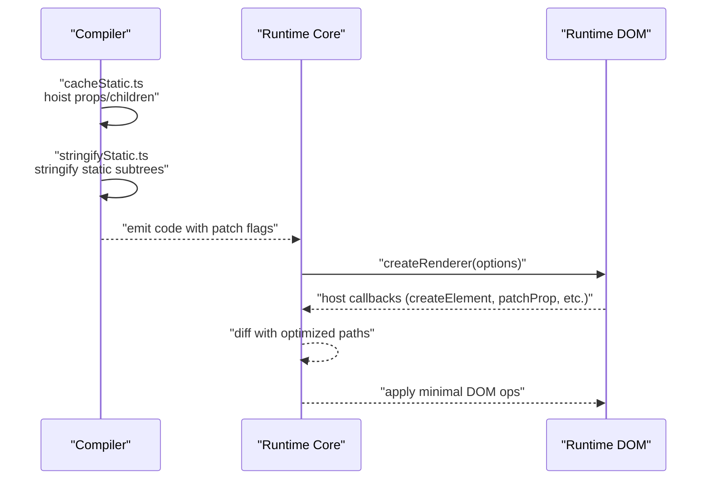
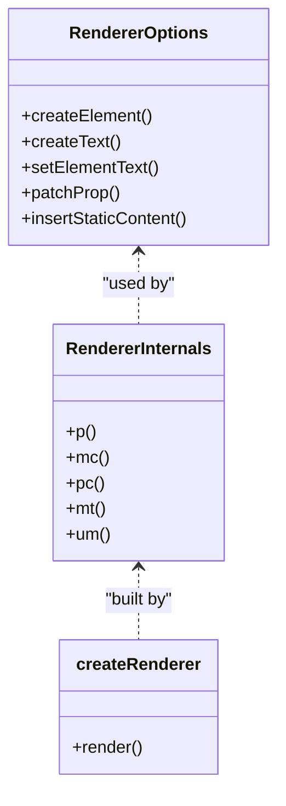
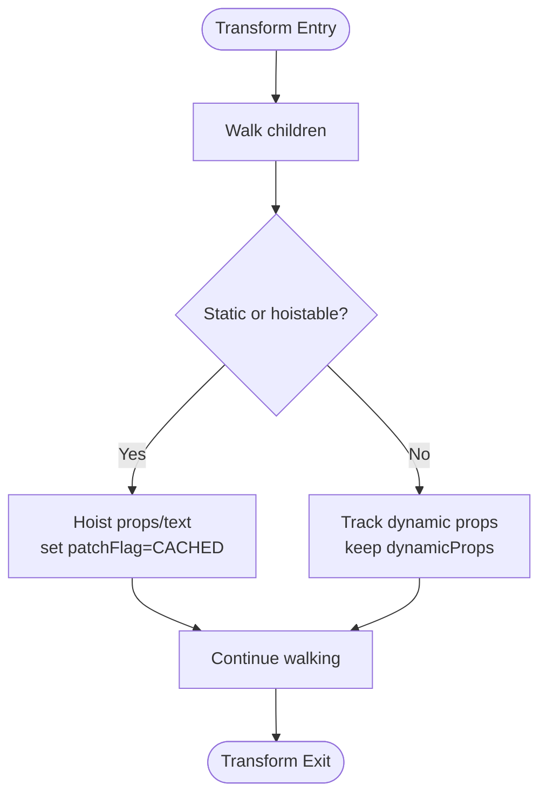
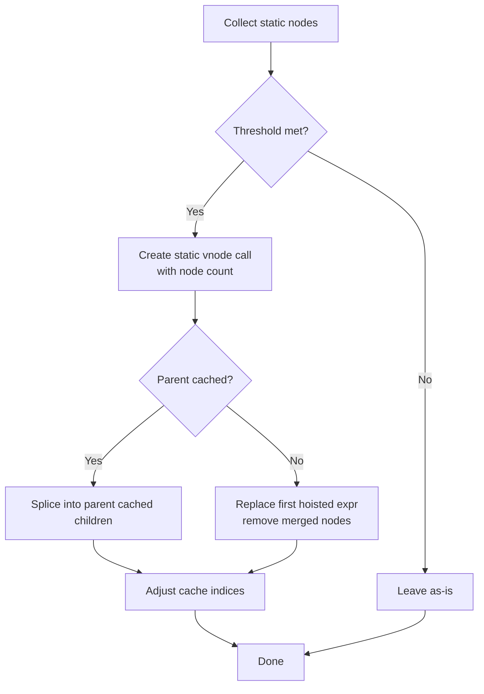
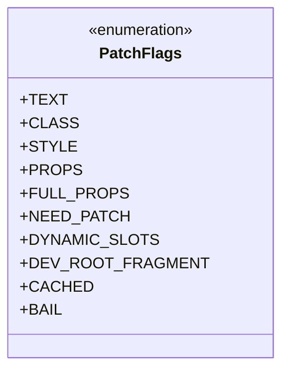
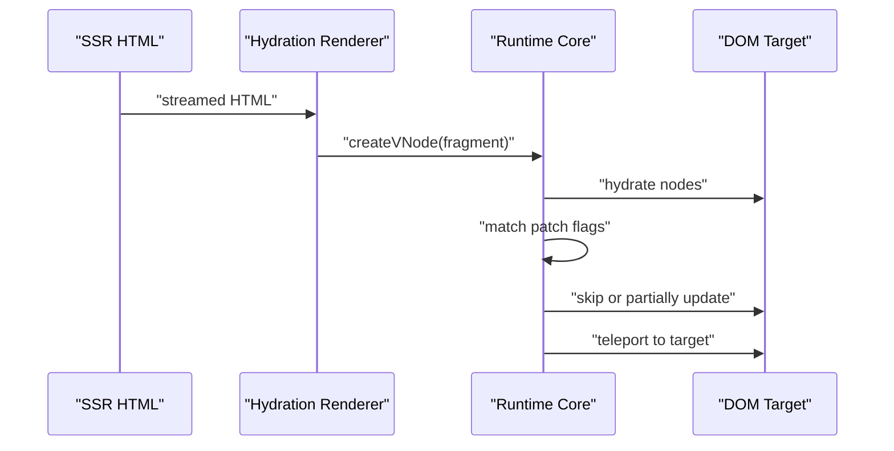
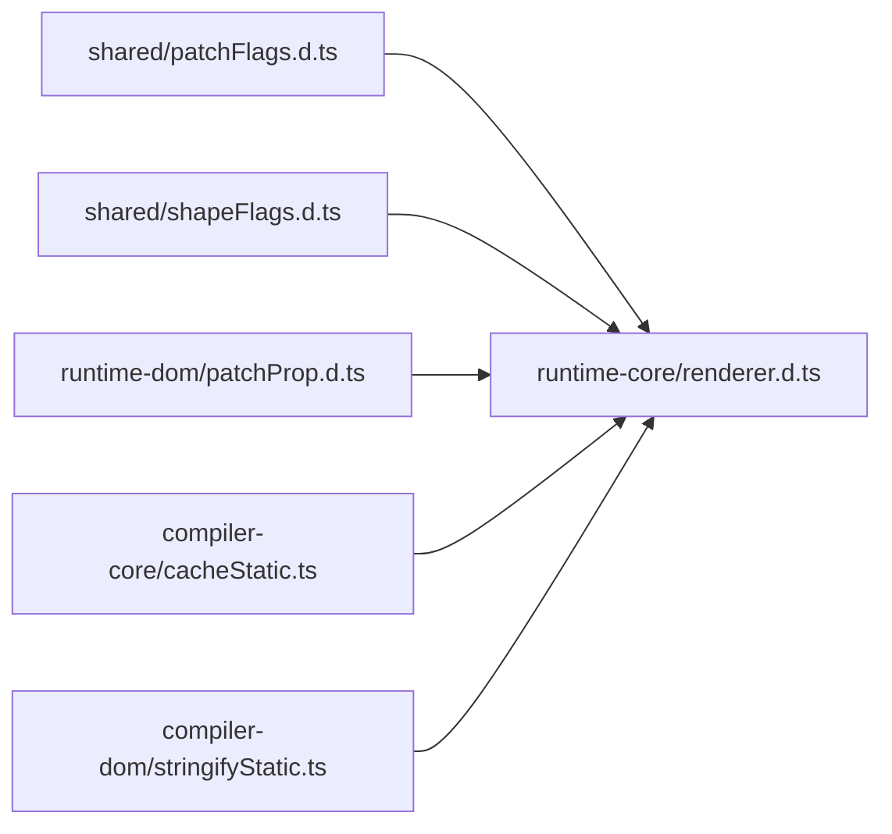

# Virtual DOM & Rendering

<cite>
**Referenced Files in This Document**
- [stringifyStatic.ts](file://源码学习/vue@3.5.26/code/packages/compiler-dom/src/transforms/stringifyStatic.ts)
- [cacheStatic.ts](file://源码学习/vue@3.5.26/code/packages/compiler-core/src/transforms/cacheStatic.ts)
- [patchFlags.d.ts](file://源码学习/vue@3.5.26/code/temp/packages/shared/src/patchFlags.d.ts)
- [shapeFlags.d.ts](file://源码学习/vue@3.5.26/code/temp/packages/shared/src/shapeFlags.d.ts)
- [renderer.d.ts](file://源码学习/vue@3.5.26/code/temp/packages/runtime-core/src/renderer.d.ts)
- [patchProp.d.ts](file://源码学习/vue@3.5.26/code/temp/packages/runtime-dom/src/patchProp.d.ts)
- [renderer.ts](file://源码学习/vue@3.5.26/code/packages/runtime-core/src/renderer.ts)
- [Teleport.ts](file://源码学习/vue@3.5.26/code/packages/runtime-core/src/components/Teleport.ts)
- [transformElement.spec.ts](file://源码学习/vue@3.5.26/code/packages/compiler-core/__tests__/transforms/transformElement.spec.ts)
- [cacheStatic.spec.ts](file://源码学习/vue@3.5.26/code/packages/compiler-core/__tests__/transforms/cacheStatic.spec.ts)
</cite>

## Table of Contents
1. [Introduction](#introduction)
2. [Project Structure](#project-structure)
3. [Core Components](#core-components)
4. [Architecture Overview](#architecture-overview)
5. [Detailed Component Analysis](#detailed-component-analysis)
6. [Dependency Analysis](#dependency-analysis)
7. [Performance Considerations](#performance-considerations)
8. [Troubleshooting Guide](#troubleshooting-guide)
9. [Conclusion](#conclusion)
10. [Appendices](#appendices)

## Introduction
This document explains Vue 3’s virtual DOM and rendering engine improvements with a focus on:
- The new renderer architecture separating core and DOM-specific implementations
- Static prop optimization and hoisted nodes
- Reduced unnecessary DOM operations via the patch flags system
- Dynamic flag optimization and its impact on rendering performance
- Updated hydration for SSR, fragment handling, and teleportation
- Render function improvements and slot optimization supporting better tree-shaking
- Practical examples and performance comparisons with Vue 2

## Project Structure
Vue 3 organizes rendering around a core renderer and DOM-specific renderer options. The compiler emits optimized code with patch flags and hoisted expressions, which the runtime consumes to minimize DOM operations.

**Diagram sources**
- [cacheStatic.ts:62-127](file://源码学习/vue@3.5.26/code/packages/compiler-core/src/transforms/cacheStatic.ts#L62-L127)
- [stringifyStatic.ts:82-144](file://源码学习/vue@3.5.26/code/packages/compiler-dom/src/transforms/stringifyStatic.ts#L82-L144)
- [renderer.d.ts:21-100](file://源码学习/vue@3.5.26/code/temp/packages/runtime-core/src/renderer.d.ts#L21-L100)
- [patchFlags.d.ts:1-115](file://源码学习/vue@3.5.26/code/temp/packages/shared/src/patchFlags.d.ts#L1-L115)
- [shapeFlags.d.ts:1-13](file://源码学习/vue@3.5.26/code/temp/packages/shared/src/shapeFlags.d.ts#L1-L13)
- [patchProp.d.ts:1-4](file://源码学习/vue@3.5.26/code/temp/packages/runtime-dom/src/patchProp.d.ts#L1-L4)

**Section sources**
- [renderer.d.ts:21-100](file://源码学习/vue@3.5.26/code/temp/packages/runtime-core/src/renderer.d.ts#L21-L100)
- [patchFlags.d.ts:1-115](file://源码学习/vue@3.5.26/code/temp/packages/shared/src/patchFlags.d.ts#L1-L115)
- [shapeFlags.d.ts:1-13](file://源码学习/vue@3.5.26/code/temp/packages/shared/src/shapeFlags.d.ts#L1-L13)

## Core Components
- Compiler transforms for hoisting and static stringification
- Runtime renderer with DOM-specific operations and hydration
- Patch flags and shape flags to guide optimized diffing
- Teleport component for DOM projection

Key implementation references:
- Hoist static props and children: [cacheStatic.ts:62-127](file://源码学习/vue@3.5.26/code/packages/compiler-core/src/transforms/cacheStatic.ts#L62-L127)
- Static stringification for DOM: [stringifyStatic.ts:82-144](file://源码学习/vue@3.5.26/code/packages/compiler-dom/src/transforms/stringifyStatic.ts#L82-L144)
- Patch flags enumeration and semantics: [patchFlags.d.ts:1-115](file://源码学习/vue@3.5.26/code/temp/packages/shared/src/patchFlags.d.ts#L1-L115)
- Shape flags for node types: [shapeFlags.d.ts:1-13](file://源码学习/vue@3.5.26/code/temp/packages/shared/src/shapeFlags.d.ts#L1-L13)
- Renderer factory and hydration: [renderer.d.ts:21-100](file://源码学习/vue@3.5.26/code/temp/packages/runtime-core/src/renderer.d.ts#L21-L100)
- Teleport utilities: [Teleport.ts:45-59](file://源码学习/vue@3.5.26/code/packages/runtime-core/src/components/Teleport.ts#L45-L59)

**Section sources**
- [cacheStatic.ts:62-127](file://源码学习/vue@3.5.26/code/packages/compiler-core/src/transforms/cacheStatic.ts#L62-L127)
- [stringifyStatic.ts:82-144](file://源码学习/vue@3.5.26/code/packages/compiler-dom/src/transforms/stringifyStatic.ts#L82-L144)
- [patchFlags.d.ts:1-115](file://源码学习/vue@3.5.26/code/temp/packages/shared/src/patchFlags.d.ts#L1-L115)
- [shapeFlags.d.ts:1-13](file://源码学习/vue@3.5.26/code/temp/packages/shared/src/shapeFlags.d.ts#L1-L13)
- [renderer.d.ts:21-100](file://源码学习/vue@3.5.26/code/temp/packages/runtime-core/src/renderer.d.ts#L21-L100)
- [Teleport.ts:45-59](file://源码学习/vue@3.5.26/code/packages/runtime-core/src/components/Teleport.ts#L45-L59)

## Architecture Overview
Vue 3 separates concerns between compiler and runtime:
- Compiler emits optimized AST with hoisted expressions and patch flags
- Runtime core handles generic patching and component lifecycle
- DOM renderer supplies host-specific operations (createElement, setText, etc.)
- Hydration renderer enables SSR-to-DOM reconciliation

**Diagram sources**
- [cacheStatic.ts:62-127](file://源码学习/vue@3.5.26/code/packages/compiler-core/src/transforms/cacheStatic.ts#L62-L127)
- [stringifyStatic.ts:82-144](file://源码学习/vue@3.5.26/code/packages/compiler-dom/src/transforms/stringifyStatic.ts#L82-L144)
- [renderer.d.ts:21-100](file://源码学习/vue@3.5.26/code/temp/packages/runtime-core/src/renderer.d.ts#L21-L100)
- [patchProp.d.ts:1-4](file://源码学习/vue@3.5.26/code/temp/packages/runtime-dom/src/patchProp.d.ts#L1-L4)

## Detailed Component Analysis

### Renderer Architecture: Core vs DOM
- The core renderer defines the generic patching pipeline and component mounting/unmounting.
- The DOM renderer provides host-specific operations (element/text/comment creation, property patching, etc.).
- This separation allows tree-shaking of non-DOM environments and clearer platform boundaries.

**Diagram sources**
- [renderer.d.ts:21-100](file://源码学习/vue@3.5.26/code/temp/packages/runtime-core/src/renderer.d.ts#L21-L100)
- [patchProp.d.ts:1-4](file://源码学习/vue@3.5.26/code/temp/packages/runtime-dom/src/patchProp.d.ts#L1-L4)

**Section sources**
- [renderer.d.ts:21-100](file://源码学习/vue@3.5.26/code/temp/packages/runtime-core/src/renderer.d.ts#L21-L100)
- [patchProp.d.ts:1-4](file://源码学习/vue@3.5.26/code/temp/packages/runtime-dom/src/patchProp.d.ts#L1-L4)

### Static Prop Optimization and Hoisted Nodes
- The compiler walks the AST and hoists static props and text calls into hoistable expressions.
- Elements with fully static props receive a CACHED patch flag; dynamic props are kept dynamic via dynamicProps.
- Tests demonstrate hoisting for elements with dynamic text children and mixed static/dynamic children.

**Diagram sources**
- [cacheStatic.ts:62-127](file://源码学习/vue@3.5.26/code/packages/compiler-core/src/transforms/cacheStatic.ts#L62-L127)

**Section sources**
- [cacheStatic.ts:62-127](file://源码学习/vue@3.5.26/code/packages/compiler-core/src/transforms/cacheStatic.ts#L62-L127)
- [cacheStatic.spec.ts:438-475](file://源码学习/vue@3.5.26/code/packages/compiler-core/__tests__/transforms/cacheStatic.spec.ts#L438-L475)

### Static Stringification for DOM
- The DOM compiler can stringify adjacent static nodes into a single static vnode call.
- This reduces the number of VNode objects and DOM operations during hydration and mount.
- Parent-cached scenarios merge and splice cache entries efficiently.

**Diagram sources**
- [stringifyStatic.ts:82-144](file://源码学习/vue@3.5.26/code/packages/compiler-dom/src/transforms/stringifyStatic.ts#L82-L144)

**Section sources**
- [stringifyStatic.ts:82-144](file://源码学习/vue@3.5.26/code/packages/compiler-dom/src/transforms/stringifyStatic.ts#L82-L144)

### Patch Flags System and Dynamic Optimization
- Patch flags are compile-time hints indicating which aspects of a node are dynamic.
- Examples include TEXT, CLASS, STYLE, PROPS, FULL_PROPS, NEED_PATCH, CACHED, BAIL.
- Tests show how different bindings produce specific flags and combinations.

**Diagram sources**
- [patchFlags.d.ts:1-115](file://源码学习/vue@3.5.26/code/temp/packages/shared/src/patchFlags.d.ts#L1-L115)

**Section sources**
- [patchFlags.d.ts:1-115](file://源码学习/vue@3.5.26/code/temp/packages/shared/src/patchFlags.d.ts#L1-L115)
- [transformElement.spec.ts:947-1029](file://源码学习/vue@3.5.26/code/packages/compiler-core/__tests__/transforms/transformElement.spec.ts#L947-L1029)

### Hydration, Fragments, and Teleportation
- Hydration renderer reconciles server-rendered HTML with client-side VNodes.
- Fragments are supported; special dev-only flags exist for root comment fragments.
- Teleport moves content to a target outside the component tree, with deferred rendering support and type checks for SVG/MathML targets.

**Diagram sources**
- [renderer.d.ts:21-100](file://源码学习/vue@3.5.26/code/temp/packages/runtime-core/src/renderer.d.ts#L21-L100)
- [Teleport.ts:45-59](file://源码学习/vue@3.5.26/code/packages/runtime-core/src/components/Teleport.ts#L45-L59)

**Section sources**
- [renderer.d.ts:21-100](file://源码学习/vue@3.5.26/code/temp/packages/runtime-core/src/renderer.d.ts#L21-L100)
- [Teleport.ts:45-59](file://源码学习/vue@3.5.26/code/packages/runtime-core/src/components/Teleport.ts#L45-L59)

### Render Functions and Tree-Shaking
- The renderer exposes createRenderer and createHydrationRenderer, enabling bundlers to tree-shake unused host operations.
- Slot optimization and hoisted nodes reduce render cost and enable smaller bundles by avoiding repeated computations.

Practical examples:
- Hoist static props for elements with dynamic text children: [cacheStatic.spec.ts:438-475](file://源码学习/vue@3.5.26/code/packages/compiler-core/__tests__/transforms/cacheStatic.spec.ts#L438-L475)
- Emit combined flags for class/style/props: [transformElement.spec.ts:947-1029](file://源码学习/vue@3.5.26/code/packages/compiler-core/__tests__/transforms/transformElement.spec.ts#L947-L1029)

**Section sources**
- [cacheStatic.spec.ts:438-475](file://源码学习/vue@3.5.26/code/packages/compiler-core/__tests__/transforms/cacheStatic.spec.ts#L438-L475)
- [transformElement.spec.ts:947-1029](file://源码学习/vue@3.5.26/code/packages/compiler-core/__tests__/transforms/transformElement.spec.ts#L947-L1029)

## Dependency Analysis
The runtime depends on shared enums and the DOM renderer options. The compiler feeds optimized code with flags and hoists to the runtime.

**Diagram sources**
- [patchFlags.d.ts:1-115](file://源码学习/vue@3.5.26/code/temp/packages/shared/src/patchFlags.d.ts#L1-L115)
- [shapeFlags.d.ts:1-13](file://源码学习/vue@3.5.26/code/temp/packages/shared/src/shapeFlags.d.ts#L1-L13)
- [renderer.d.ts:21-100](file://源码学习/vue@3.5.26/code/temp/packages/runtime-core/src/renderer.d.ts#L21-L100)
- [patchProp.d.ts:1-4](file://源码学习/vue@3.5.26/code/temp/packages/runtime-dom/src/patchProp.d.ts#L1-L4)
- [cacheStatic.ts:62-127](file://源码学习/vue@3.5.26/code/packages/compiler-core/src/transforms/cacheStatic.ts#L62-L127)
- [stringifyStatic.ts:82-144](file://源码学习/vue@3.5.26/code/packages/compiler-dom/src/transforms/stringifyStatic.ts#L82-L144)

**Section sources**
- [renderer.d.ts:21-100](file://源码学习/vue@3.5.26/code/temp/packages/runtime-core/src/renderer.d.ts#L21-L100)
- [patchFlags.d.ts:1-115](file://源码学习/vue@3.5.26/code/temp/packages/shared/src/patchFlags.d.ts#L1-L115)
- [shapeFlags.d.ts:1-13](file://源码学习/vue@3.5.26/code/temp/packages/shared/src/shapeFlags.d.ts#L1-L13)
- [patchProp.d.ts:1-4](file://源码学习/vue@3.5.26/code/temp/packages/runtime-dom/src/patchProp.d.ts#L1-L4)
- [cacheStatic.ts:62-127](file://源码学习/vue@3.5.26/code/packages/compiler-core/src/transforms/cacheStatic.ts#L62-L127)
- [stringifyStatic.ts:82-144](file://源码学习/vue@3.5.26/code/packages/compiler-dom/src/transforms/stringifyStatic.ts#L82-L144)

## Performance Considerations
- Static hoisting and stringification reduce VNode count and DOM operations.
- Patch flags enable targeted diffs for text/class/style/props, skipping full reconciliation when safe.
- Teleport avoids unnecessary DOM traversal by projecting content directly to targets.
- Tree-shaking via createRenderer allows removing unused host operations in non-DOM environments.

[No sources needed since this section provides general guidance]

## Troubleshooting Guide
Common issues and diagnostics:
- Unexpected full re-render: Verify patch flags and hoisted props; ensure static content remains truly static.
- Hydration mismatches: Confirm SSR HTML matches client-side structure and that static subtrees are properly stringified.
- Teleport placement: Ensure target exists and is of the correct type (SVG/MathML) when applicable.

**Section sources**
- [renderer.d.ts:21-100](file://源码学习/vue@3.5.26/code/temp/packages/runtime-core/src/renderer.d.ts#L21-L100)
- [Teleport.ts:45-59](file://源码学习/vue@3.5.26/code/packages/runtime-core/src/components/Teleport.ts#L45-L59)

## Conclusion
Vue 3’s rendering engine improves performance by:
- Separating core and DOM implementations for better modularity and tree-shaking
- Hoisting static props and stringifying static subtrees to reduce VNode and DOM work
- Using patch flags to guide optimized diffs for text/class/style/props
- Enhancing SSR hydration, fragment handling, and teleportation
These changes collectively minimize unnecessary DOM operations and enable more efficient updates compared to Vue 2.

[No sources needed since this section summarizes without analyzing specific files]

## Appendices
- Example references for tests and transforms:
  - [cacheStatic.spec.ts:438-475](file://源码学习/vue@3.5.26/code/packages/compiler-core/__tests__/transforms/cacheStatic.spec.ts#L438-L475)
  - [transformElement.spec.ts:947-1029](file://源码学习/vue@3.5.26/code/packages/compiler-core/__tests__/transforms/transformElement.spec.ts#L947-L1029)

[No sources needed since this section aggregates references without analyzing specific files]