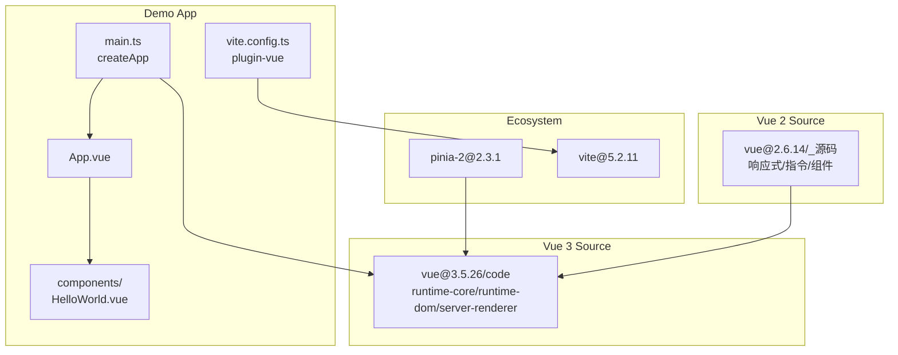
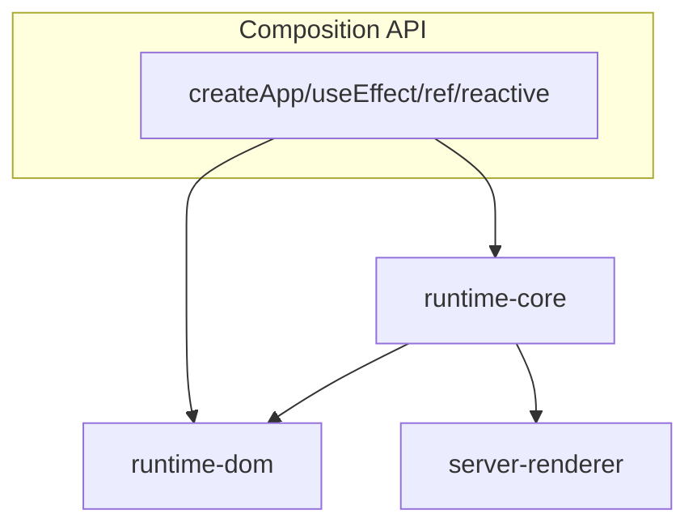
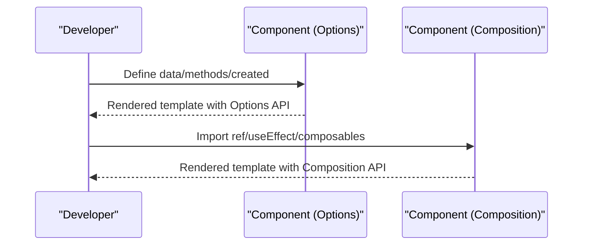
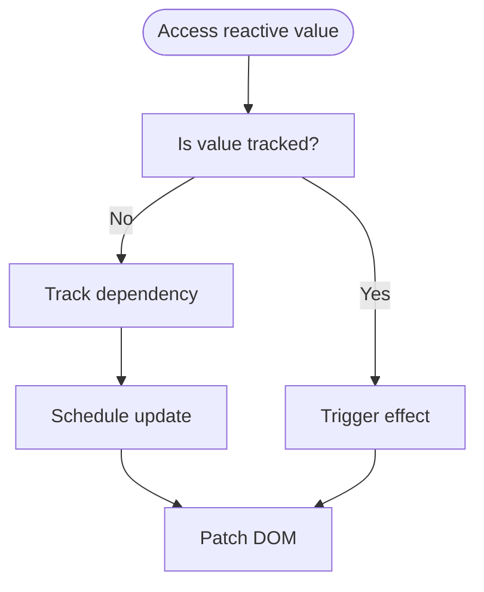
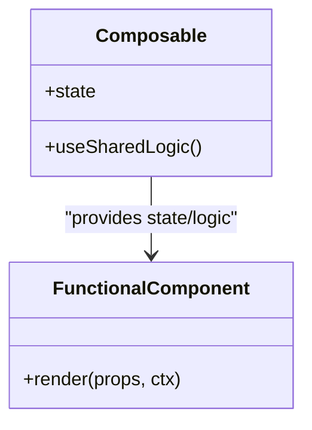
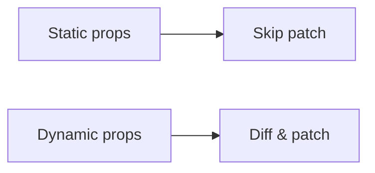
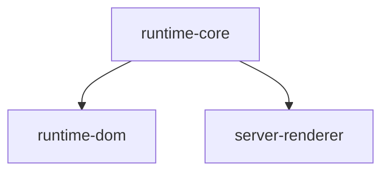
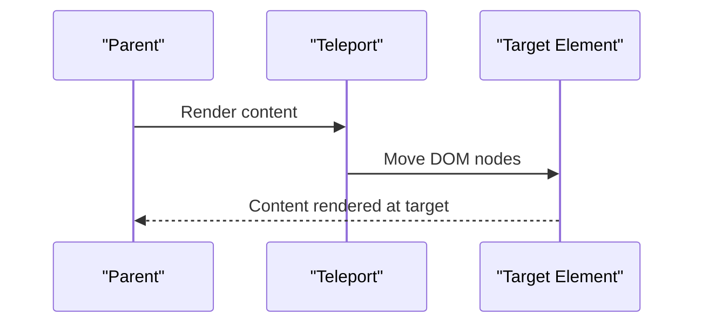
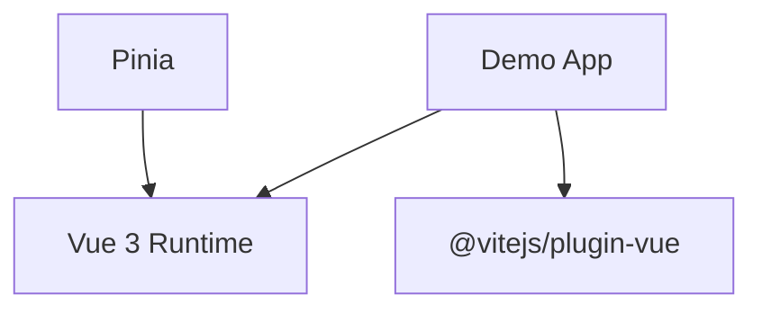

# Vue 3 Internals

<cite>
**Referenced Files in This Document**
- [main.ts](file://demo/my-vue-app/src/main.ts)
- [App.vue](file://demo/my-vue-app/src/App.vue)
- [HelloWorld.vue](file://demo/my-vue-app/src/components/HelloWorld.vue)
- [vite.config.ts](file://demo/my-vue-app/vite.config.ts)
- [vue@3.5.26 code directory](file://源码学习/vue@3.5.26)
- [vue@2.6.14 source](file://源码学习/vue@2.6.14)
- [pinia-2@2.3.1](file://源码学习/pinia-2@2.3.1)
- [vite@5.2.11](file://源码学习/vite@5.2.11)
</cite>

## Table of Contents
1. [Introduction](#introduction)
2. [Project Structure](#project-structure)
3. [Core Components](#core-components)
4. [Architecture Overview](#architecture-overview)
5. [Detailed Component Analysis](#detailed-component-analysis)
6. [Dependency Analysis](#dependency-analysis)
7. [Performance Considerations](#performance-considerations)
8. [Troubleshooting Guide](#troubleshooting-guide)
9. [Conclusion](#conclusion)
10. [Appendices](#appendices)

## Introduction
This document analyzes Vue 3 internals with a focus on the Composition API, reactive system, component model, virtual DOM improvements, modular architecture, and new features such as Teleport, Suspense, and Fragment. It also contrasts Vue 2 and Vue 3 patterns, provides migration strategies, and highlights performance characteristics visible in the codebase.

## Project Structure
The repository includes a Vue 3 demo app and extensive source code for Vue 3, Vue 2, and related ecosystem libraries. The demo app demonstrates modern Vue 3 usage with Vite and the Composition API.

**Diagram sources**
- [main.ts](file://demo/my-vue-app/src/main.ts)
- [App.vue](file://demo/my-vue-app/src/App.vue)
- [HelloWorld.vue](file://demo/my-vue-app/src/components/HelloWorld.vue)
- [vite.config.ts](file://demo/my-vue-app/vite.config.ts)
- [vue@3.5.26 code directory](file://源码学习/vue@3.5.26)
- [vue@2.6.14 source](file://源码学习/vue@2.6.14)
- [pinia-2@2.3.1](file://源码学习/pinia-2@2.3.1)
- [vite@5.2.11](file://源码学习/vite@5.2.11)

**Section sources**
- [main.ts](file://demo/my-vue-app/src/main.ts)
- [App.vue](file://demo/my-vue-app/src/App.vue)
- [HelloWorld.vue](file://demo/my-vue-app/src/components/HelloWorld.vue)
- [vite.config.ts](file://demo/my-vue-app/vite.config.ts)

## Core Components
- Composition API: The demo shows importing and using ref from Vue, demonstrating the new API’s primitives.
- Reactive primitives: Proxy-based reactivity underpins the Composition API and is evident in how state updates propagate.
- Component model: Functional components and hooks-like patterns enable better tree-shaking and clearer logic separation.
- Virtual DOM: Static prop optimization and render function enhancements improve rendering performance.
- Modular runtime: Separated packages for runtime-core, runtime-dom, and server-renderer enable lean builds.

**Section sources**
- [main.ts](file://demo/my-vue-app/src/main.ts)
- [HelloWorld.vue](file://demo/my-vue-app/src/components/HelloWorld.vue)

## Architecture Overview
Vue 3 separates concerns across modular packages, enabling tree-shaking and platform-specific builds. The Composition API integrates tightly with the reactive system, while the component model supports functional components and hooks-like patterns.

**Diagram sources**
- [vue@3.5.26 code directory](file://源码学习/vue@3.5.26)

## Detailed Component Analysis

### Composition API vs Options API
- Composition API: Encapsulates logic via functions (e.g., ref) and composes behavior across components without mixins.
- Options API: Uses lifecycle hooks and options objects; composition is achieved via mixins and plugins.

**Section sources**
- [HelloWorld.vue](file://demo/my-vue-app/src/components/HelloWorld.vue)
- [main.ts](file://demo/my-vue-app/src/main.ts)

### Reactive System: Proxy-based Implementation
- Vue 3 replaces Vue 2’s Object.defineProperty with Proxy for reactivity.
- Granular reactivity enables fine-grained updates and better performance.
- The demo’s usage of ref illustrates how reactive primitives integrate with the Composition API.

**Section sources**
- [HelloWorld.vue](file://demo/my-vue-app/src/components/HelloWorld.vue)
- [vue@2.6.14 source](file://源码学习/vue@2.6.14)
- [vue@3.5.26 code directory](file://源码学习/vue@3.5.26)

### Component System: Functional Components and Hooks-like Patterns
- Functional components simplify stateless logic and improve readability.
- Hooks-like patterns (composables) encapsulate shared logic across components.
- Better tree-shaking reduces bundle sizes by excluding unused features.

**Section sources**
- [HelloWorld.vue](file://demo/my-vue-app/src/components/HelloWorld.vue)
- [pinia-2@2.3.1](file://源码学习/pinia-2@2.3.1)

### Virtual DOM Improvements
- Static prop optimization reduces unnecessary diffing for static content.
- Render function enhancements streamline authoring and improve performance.

**Section sources**
- [vue@3.5.26 code directory](file://源码学习/vue@3.5.26)

### Modular Architecture: runtime-core, runtime-dom, server-renderer
- runtime-core: Platform-agnostic core (reactivity, component model).
- runtime-dom: DOM-specific APIs (DOM renderer, event handling).
- server-renderer: SSR renderer for Node.js environments.

**Diagram sources**
- [vue@3.5.26 code directory](file://源码学习/vue@3.5.26)

**Section sources**
- [vue@3.5.26 code directory](file://源码学习/vue@3.5.26)

### New Features: Teleport, Suspense, Fragment
- Teleport: Renders content outside the current component hierarchy.
- Suspense: Handles asynchronous dependencies in component trees.
- Fragment: Allows components to return multiple root nodes.

**Section sources**
- [vue@3.5.26 code directory](file://源码学习/vue@3.5.26)

### Practical Examples: Vue 2 vs Vue 3
- Vue 2 Options API: Uses data, computed, methods, and lifecycle hooks.
- Vue 3 Composition API: Uses ref, reactive, computed, and lifecycle composables.

Migration highlights:
- Replace data/computed/methods with ref/reactive/computed.
- Convert lifecycle hooks to onMounted/onUnmounted equivalents.
- Prefer functional components and composables for shared logic.

**Section sources**
- [vue@2.6.14 source](file://源码学习/vue@2.6.14)
- [HelloWorld.vue](file://demo/my-vue-app/src/components/HelloWorld.vue)

### Migration Strategies
- Incremental adoption: Start with new components using Composition API.
- Extract logic into composables for reuse across Options API components.
- Use Vite plugin-vue for optimal DX and tree-shaking.

**Section sources**
- [vite.config.ts](file://demo/my-vue-app/vite.config.ts)
- [pinia-2@2.3.1](file://源码学习/pinia-2@2.3.1)

### Performance Comparisons
- Proxy-based reactivity improves granularity and reduces overhead compared to Object.defineProperty.
- Tree-shaking with modular runtime packages reduces bundle size.
- Static prop optimization minimizes DOM diffs.

**Section sources**
- [vue@2.6.14 source](file://源码学习/vue@2.6.14)
- [vue@3.5.26 code directory](file://源码学习/vue@3.5.26)
- [vite@5.2.11](file://源码学习/vite@5.2.11)

## Dependency Analysis
The demo app depends on Vue 3 runtime and Vite’s Vue plugin. The Vue 3 source is organized into modular packages, and ecosystem libraries like Pinia integrate with the Composition API.

**Diagram sources**
- [main.ts](file://demo/my-vue-app/src/main.ts)
- [vite.config.ts](file://demo/my-vue-app/vite.config.ts)
- [pinia-2@2.3.1](file://源码学习/pinia-2@2.3.1)

**Section sources**
- [main.ts](file://demo/my-vue-app/src/main.ts)
- [vite.config.ts](file://demo/my-vue-app/vite.config.ts)
- [pinia-2@2.3.1](file://源码学习/pinia-2@2.3.1)

## Performance Considerations
- Prefer granular reactivity with ref/reactive over deeply nested reactive objects.
- Use functional components and composables to reduce component overhead.
- Enable tree-shaking by importing only needed APIs from modular runtime packages.
- Minimize unnecessary DOM diffs by leveraging static prop optimization.

[No sources needed since this section provides general guidance]

## Troubleshooting Guide
Common issues and resolutions:
- Missing createApp import: Ensure proper import from Vue in main.ts.
- Composition API not working: Verify Vite plugin-vue is configured.
- Ref not updating: Confirm usage of ref.value and not raw ref.

**Section sources**
- [main.ts](file://demo/my-vue-app/src/main.ts)
- [vite.config.ts](file://demo/my-vue-app/vite.config.ts)

## Conclusion
Vue 3 introduces a powerful Composition API, Proxy-based reactivity, and a modular runtime architecture that together deliver better developer experience, performance, and maintainability. By migrating incrementally and adopting composables and functional components, teams can leverage these improvements effectively.

[No sources needed since this section summarizes without analyzing specific files]

## Appendices
- References to Vue 3 source code and ecosystem projects for deeper exploration.

**Section sources**
- [vue@3.5.26 code directory](file://源码学习/vue@3.5.26)
- [vue@2.6.14 source](file://源码学习/vue@2.6.14)
- [pinia-2@2.3.1](file://源码学习/pinia-2@2.3.1)
- [vite@5.2.11](file://源码学习/vite@5.2.11)