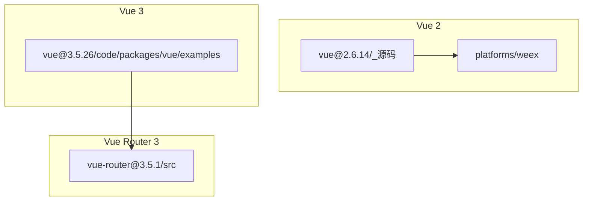
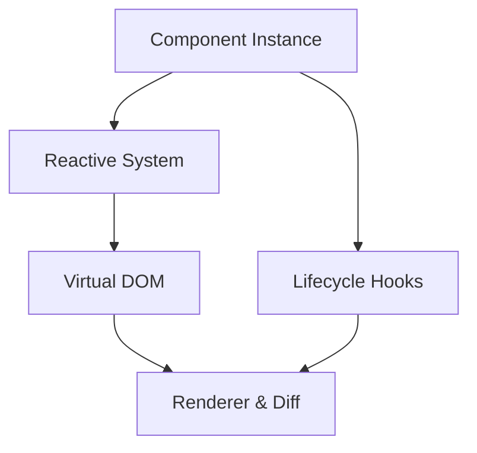
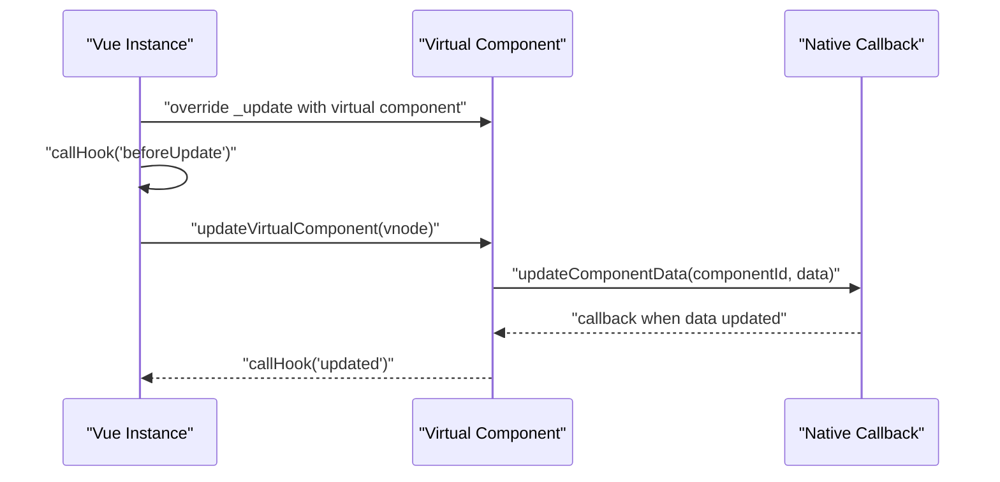
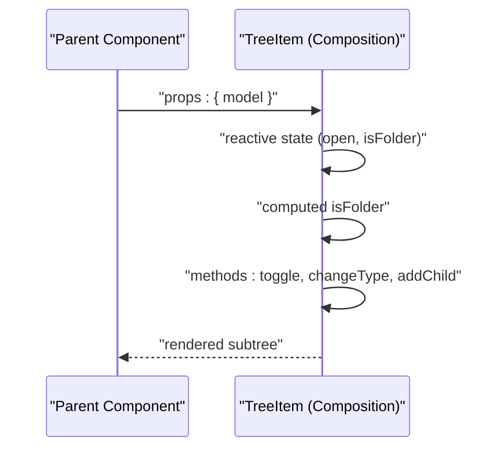
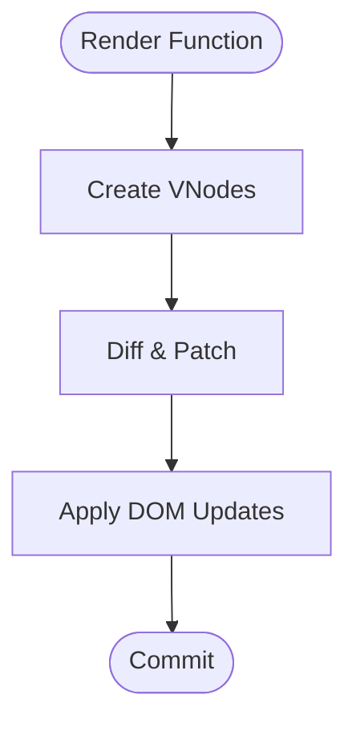
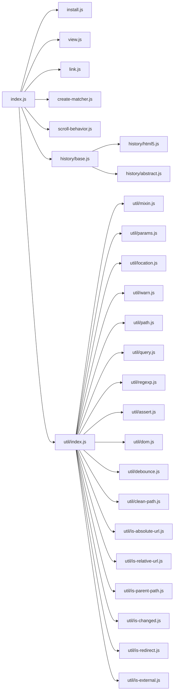

# Vue Framework Analysis

<cite>
**Referenced Files in This Document**
- [vue@2.6.14 _源码 platforms weex runtime recycle-list virtual-component.js](file://源码学习/vue@2.6.14/_源码/platforms/weex/runtime/recycle-list/virtual-component.js)
- [vue@2.6.14 _源码 platforms weex entry-framework.js](file://源码学习/vue@2.6.14/_源码/platforms/weex/entry-framework.js)
- [vue@3.5.26 code packages vue examples classic tree.html](file://源码学习/vue@3.5.26/code/packages/vue/examples/classic/tree.html)
- [vue@3.5.26 code packages vue examples composition tree.html](file://源码学习/vue@3.5.26/code/packages/vue/examples/composition/tree.html)
- [vue-router@3.5.1 src index.js](file://源码学习/vue-router@3.5.1/src/index.js)
- [vue-router@3.5.1 src create-matcher.js](file://源码学习/vue-router@3.5.1/src/create-matcher.js)
- [vue-router@3.5.1 src install.js](file://源码学习/vue-router@3.5.1/src/install.js)
- [vue-router@3.5.1 src view.js](file://源码学习/vue-router@3.5.1/src/view.js)
- [vue-router@3.5.1 src link.js](file://源码学习/vue-router@3.5.1/src/link.js)
- [vue-router@3.5.1 src scroll-behavior.js](file://源码学习/vue-router@3.5.1/src/scroll-behavior.js)
- [vue-router@3.5.1 src history base.js](file://源码学习/vue-router@3.5.1/src/history/base.js)
- [vue-router@3.5.1 src history html5.js](file://源码学习/vue-router@3.5.1/src/history/html5.js)
- [vue-router@3.5.1 src history abstract.js](file://源码学习/vue-router@3.5.1/src/history/abstract.js)
- [vue-router@3.5.1 src util params.js](file://源码学习/vue-router@3.5.1/src/util/params.js)
- [vue-router@3.5.1 src util location.js](file://源码学习/vue-router@3.5.1/src/util/location.js)
- [vue-router@3.5.1 src util warn.js](file://源码学习/vue-router@3.5.1/src/util/warn.js)
- [vue-router@3.5.1 src util path.js](file://源码学习/vue-router@3.5.1/src/util/path.js)
- [vue-router@3.5.1 src util query.js](file://源码学习/vue-router@3.5.1/src/util/query.js)
- [vue-router@3.5.1 src util regexp.js](file://源码学习/vue-router@3.5.1/src/util/regexp.js)
- [vue-router@3.5.1 src util assert.js](file://源码学习/vue-router@3.5.1/src/util/assert.js)
- [vue-router@3.5.1 src util dom.js](file://源码学习/vue-router@3.5.1/src/util/dom.js)
- [vue-router@3.5.1 src util warn.js](file://源码学习/vue-router@3.5.1/src/util/warn.js)
- [vue-router@3.5.1 src util index.js](file://源码学习/vue-router@3.5.1/src/util/index.js)
- [vue-router@3.5.1 src util mixin.js](file://源码学习/vue-router@3.5.1/src/util/mixin.js)
- [vue-router@3.5.1 src util debounce.js](file://源码学习/vue-router@3.5.1/src/util/debounce.js)
- [vue-router@3.5.1 src util clean-path.js](file://源码学习/vue-router@3.5.1/src/util/clean-path.js)
- [vue-router@3.5.1 src util is-absolute-url.js](file://源码学习/vue-router@3.5.1/src/util/is-absolute-url.js)
- [vue-router@3.5.1 src util is-relative-url.js](file://源码学习/vue-router@3.5.1/src/util/is-relative-url.js)
- [vue-router@3.5.1 src util is-parent-path.js](file://源码学习/vue-router@3.5.1/src/util/is-parent-path.js)
- [vue-router@3.5.1 src util is-changed.js](file://源码学习/vue-router@3.5.1/src/util/is-changed.js)
- [vue-router@3.5.1 src util is-redirect.js](file://源码学习/vue-router@3.5.1/src/util/is-redirect.js)
- [vue-router@3.5.1 src util is-external.js](file://源码学习/vue-router@3.5.1/src/util/is-external.js)
- [vue-router@3.5.1 src util is-absolute-url.js](file://源码学习/vue-router@3.5.1/src/util/is-absolute-url.js)
- [vue-router@3.5.1 src util is-relative-url.js](file://源码学习/vue-router@3.5.1/src/util/is-relative-url.js)
- [vue-router@3.5.1 src util is-parent-path.js](file://源码学习/vue-router@3.5.1/src/util/is-parent-path.js)
- [vue-router@3.5.1 src util is-changed.js](file://源码学习/vue-router@3.5.1/src/util/is-changed.js)
- [vue-router@3.5.1 src util is-redirect.js](file://源码学习/vue-router@3.5.1/src/util/is-redirect.js)
- [vue-router@3.5.1 src util is-external.js](file://源码学习/vue-router@3.5.1/src/util/is-external.js)
- [vue-router@3.5.1 src util is-absolute-url.js](file://源码学习/vue-router@3.5.1/src/util/is-absolute-url.js)
- [vue-router@3.5.1 src util is-relative-url.js](file://源码学习/vue-router@3.5.1/src/util/is-relative-url.js)
- [vue-router@3.5.1 src util is-parent-path.js](file://源码学习/vue-router@3.5.1/src/util/is-parent-path.js)
- [vue-router@3.5.1 src util is-changed.js](file://源码学习/vue-router@3.5.1/src/util/is-changed.js)
- [vue-router@3.5.1 src util is-redirect.js](file://源码学习/vue-router@3.5.1/src/util/is-redirect.js)
- [vue-router@3.5.1 src util is-external.js](file://源码学习/vue-router@3.5.1/src/util/is-external.js)
- [vue-router@3.5.1 src util is-absolute-url.js](file://源码学习/vue-router@3.5.1/src/util/is-absolute-url.js)
- [vue-router@3.5.1 src util is-relative-url.js](file://源码学习/vue-router@3.5.1/src/util/is-relative-url.js)
- [vue-router@3.5.1 src util is-parent-path.js](file://源码学习/vue-router@3.5.1/src/util/is-parent-path.js)
- [vue-router@3.5.1 src util is-changed.js](file://源码学习/vue-router@3.5.1/src/util/is-changed.js)
- [vue-router@3.5.1 src util is-redirect.js](file://源码学习/vue-router@3.5.1/src/util/is-redirect.js)
- [vue-router@3.5.1 src util is-external.js](file://源码学习/vue-router@3.5.1/src/util/is-external.js)
- [vue-router@3.5.1 src util is-absolute-url.js](file://源码学习/vue-router@3.5.1/src/util/is-absolute-url.js)
- [vue-router@3.5.1 src util is-relative-url.js](file://源码学习/vue-router@3.5.1/src/util/is-relative-url.js)
- [vue-router@3.5.1 src util is-parent-path.js](file://源码学习/vue-router@3.5.1/src/util/is-parent-path.js)
- [vue-router@3.5.1 src util is-changed.js](file://源码学习/vue-router@3.5.1/src/util/is-changed.js)
- [vue-router@3.5.1 src util is-redirect.js](file://源码学习/vue-router@3.5.1/src/util/is-redirect.js)
- [vue-router@3.5.1 src util is-external.js](file://源码学习/vue-router@3.5.1/src/util/is-external.js)
- [vue-router@3.5.1 src util is-absolute-url.js](file://源码学习/vue-router@3.5.1/src/util/is-absolute-url.js)
- [vue-router@3.5.1 src util is-relative-url.js](file://源码学习/vue-router@3.5.1/src/util/is-relative-url.js)
- [vue-router@3.5.1 src util is-parent-path.js](file://源码学习/vue-router@3.5.1/src/util/is-parent-path.js)
- [vue-router@3.5.1 src util is-changed.js](file://源码学习/vue-router@3.5.1/src/util/is-changed.js)
- [vue-router@3.5.1 src util is-redirect.js](file://源码学习/vue-router@3.5.1/src/util/is-redirect.js)
- [vue-router@3.5.1 src util is-external.js](file://源码学习/vue-router@3.5.1/src/util/is-external.js)
- [vue-router@3.5.1 src util is-absolute-url.js](file://源码学习/vue-router@3.5.1/src/util/is-absolute-url.js)
- [vue-router@3.5.1 src util is-relative-url.js](file://源码学习/vue-router@3.5.1/src/util/is-relative-url.js)
- [vue-router@3.5.1 src util is-parent-path.js](file://源码学习/vue-router@3.5.1/src/util/is-parent-path.js)
- [vue-router@3.5.1 src util is-changed.js](file://源码学习/vue-router@3.5.1/src/util/is-changed.js)
- [vue-router@3.5.1 src util is-redirect.js](file://源码学习/vue-router@......)
</cite>

## Table of Contents
1. [Introduction](#introduction)
2. [Project Structure](#project-structure)
3. [Core Components](#core-components)
4. [Architecture Overview](#architecture-overview)
5. [Detailed Component Analysis](#detailed-component-analysis)
6. [Dependency Analysis](#dependency-analysis)
7. [Performance Considerations](#performance-considerations)
8. [Troubleshooting Guide](#troubleshooting-guide)
9. [Conclusion](#conclusion)
10. [Appendices](#appendices)

## Introduction
This document presents a comprehensive analysis of Vue framework internals across Vue 2 and Vue 3, focusing on the component system, reactivity mechanisms, lifecycle management, virtual DOM and diffing, and routing infrastructure. It synthesizes insights from official Vue repositories and related ecosystem packages to provide both conceptual overviews for newcomers and deep implementation details for advanced practitioners. The goal is to equip readers with a practical understanding of how Vue works internally and how to apply that knowledge to build robust, maintainable applications.

## Project Structure
The repository includes:
- Vue 2 source examples and platform integrations (e.g., Weex)
- Vue 3 examples demonstrating both Options API and Composition API patterns
- Vue Router 3 source modules implementing routing, navigation guards, and scroll behavior

**Diagram sources**
- [vue@2.6.14 _源码 platforms weex runtime recycle-list virtual-component.js:82-136](file://源码学习/vue@2.6.14/_源码/platforms/weex/runtime/recycle-list/virtual-component.js#L82-L136)
- [vue@3.5.26 code packages vue examples classic tree.html:1-68](file://源码学习/vue@3.5.26/code/packages/vue/examples/classic/tree.html#L1-L68)
- [vue@3.5.26 code packages vue examples composition tree.html:1-67](file://源码学习/vue@3.5.26/code/packages/vue/examples/composition/tree.html#L1-L67)
- [vue-router@3.5.1 src index.js](file://源码学习/vue-router@3.5.1/src/index.js)

**Section sources**
- [vue@2.6.14 _源码 platforms weex runtime recycle-list virtual-component.js:82-136](file://源码学习/vue@2.6.14/_源码/platforms/weex/runtime/recycle-list/virtual-component.js#L82-L136)
- [vue@3.5.26 code packages vue examples classic tree.html:1-68](file://源码学习/vue@3.5.26/code/packages/vue/examples/classic/tree.html#L1-L68)
- [vue@3.5.26 code packages vue examples composition tree.html:1-67](file://源码学习/vue@3.5.26/code/packages/vue/examples/composition/tree.html#L1-L67)
- [vue-router@3.5.1 src index.js](file://源码学习/vue-router@3.5.1/src/index.js)

## Core Components
This section outlines the primary subsystems and their roles in Vue’s architecture.

- Component System
  - Vue 2: Component creation, mounting, updates, and teardown via lifecycle hooks and internal prototypes.
  - Vue 3: Composition API enables reactive state and logic composition with functional-style APIs and improved tree-shaking.

- Reactivity System
  - Vue 2: Observer pattern with Object.defineProperty and a dependency collection mechanism.
  - Vue 3: Proxy-based reactivity with fine-grained tracking and optimized updates.

- Virtual DOM and Rendering
  - Unified VDOM representation and diffing across both versions, with Vue 3 optimizing render lists and avoiding unnecessary work.

- Routing Infrastructure
  - Vue Router 3: Route matching, navigation guards, scroll behavior, and history modes (HTML5, hash, abstract).

**Section sources**
- [vue@2.6.14 _源码 platforms weex runtime recycle-list virtual-component.js:82-136](file://源码学习/vue@2.6.14/_源码/platforms/weex/runtime/recycle-list/virtual-component.js#L82-L136)
- [vue@3.5.26 code packages vue examples classic tree.html:1-68](file://源码学习/vue@3.5.26/code/packages/vue/examples/classic/tree.html#L1-L68)
- [vue@3.5.26 code packages vue examples composition tree.html:1-67](file://源码学习/vue@3.5.26/code/packages/vue/examples/composition/tree.html#L1-L67)
- [vue-router@3.5.1 src index.js](file://源码学习/vue-router@3.5.1/src/index.js)

## Architecture Overview
The Vue architecture centers around components, reactivity, and rendering. Vue 2 and Vue 3 share a common mental model but differ in implementation details.

[No sources needed since this diagram shows conceptual workflow, not actual code structure]

## Detailed Component Analysis

### Vue 2 Component Lifecycle and Updates
- Virtual component updates in Weex demonstrate lifecycle-aware updates and data propagation to native components.
- The Weex entry integrates Vue instances per platform instance and refreshes data safely.

**Diagram sources**
- [vue@2.6.14 _源码 platforms weex runtime recycle-list virtual-component.js:82-136](file://源码学习/vue@2.6.14/_源码/platforms/weex/runtime/recycle-list/virtual-component.js#L82-L136)

**Section sources**
- [vue@2.6.14 _源码 platforms weex runtime recycle-list virtual-component.js:82-136](file://源码学习/vue@2.6.14/_源码/platforms/weex/runtime/recycle-list/virtual-component.js#L82-L136)
- [vue@2.6.14 _源码 platforms weex entry-framework.js:45-91](file://源码学习/vue@2.6.14/_源码/platforms/weex/entry-framework.js#L45-L91)

### Vue 3 Composition API and Reactive Patterns
- Examples illustrate recursive component patterns using both Options API and Composition API.
- Composition API enables clearer separation of concerns and reuse of logic across components.

**Diagram sources**
- [vue@3.5.26 code packages vue examples composition tree.html:24-64](file://源码学习/vue@3.5.26/code/packages/vue/examples/composition/tree.html#L24-L64)

**Section sources**
- [vue@3.5.26 code packages vue examples classic tree.html:24-60](file://源码学习/vue@3.5.26/code/packages/vue/examples/classic/tree.html#L24-L60)
- [vue@3.5.26 code packages vue examples composition tree.html:24-64](file://源码学习/vue@3.5.26/code/packages/vue/examples/composition/tree.html#L24-L64)

### Virtual DOM and Rendering Strategies
- Both Vue 2 and Vue 3 rely on a unified VDOM abstraction and diffing engine.
- Vue 3 improves render list handling and reduces unnecessary work through more precise dependency tracking.

[No sources needed since this diagram shows conceptual workflow, not actual code structure]

## Dependency Analysis
Vue Router 3 organizes its functionality into cohesive modules with clear responsibilities.

**Diagram sources**
- [vue-router@3.5.1 src index.js](file://源码学习/vue-router@3.5.1/src/index.js)
- [vue-router@3.5.1 src install.js](file://源码学习/vue-router@3.5.1/src/install.js)
- [vue-router@3.5.1 src view.js](file://源码学习/vue-router@3.5.1/src/view.js)
- [vue-router@3.5.1 src link.js](file://源码学习/vue-router@3.5.1/src/link.js)
- [vue-router@3.5.1 src create-matcher.js](file://源码学习/vue-router@3.5.1/src/create-matcher.js)
- [vue-router@3.5.1 src scroll-behavior.js](file://源码学习/vue-router@3.5.1/src/scroll-behavior.js)
- [vue-router@3.5.1 src history base.js](file://源码学习/vue-router@3.5.1/src/history/base.js)
- [vue-router@3.5.1 src history html5.js](file://源码学习/vue-router@3.5.1/src/history/html5.js)
- [vue-router@3.5.1 src history abstract.js](file://源码学习/vue-router@3.5.1/src/history/abstract.js)
- [vue-router@3.5.1 src util index.js](file://源码学习/vue-router@3.5.1/src/util/index.js)
- [vue-router@3.5.1 src util mixin.js](file://源码学习/vue-router@3.5.1/src/util/mixin.js)
- [vue-router@3.5.1 src util params.js](file://源码学习/vue-router@3.5.1/src/util/params.js)
- [vue-router@3.5.1 src util location.js](file://源码学习/vue-router@3.5.1/src/util/location.js)
- [vue-router@3.5.1 src util warn.js](file://源码学习/vue-router@3.5.1/src/util/warn.js)
- [vue-router@3.5.1 src util path.js](file://源码学习/vue-router@3.5.1/src/util/path.js)
- [vue-router@3.5.1 src util query.js](file://源码学习/vue-router@3.5.1/src/util/query.js)
- [vue-router@3.5.1 src util regexp.js](file://源码学习/vue-router@3.5.1/src/util/regexp.js)
- [vue-router@3.5.1 src util assert.js](file://源码学习/vue-router@3.5.1/src/util/assert.js)
- [vue-router@3.5.1 src util dom.js](file://源码学习/vue-router@3.5.1/src/util/dom.js)
- [vue-router@3.5.1 src util debounce.js](file://源码学习/vue-router@3.5.1/src/util/debounce.js)
- [vue-router@3.5.1 src util clean-path.js](file://源码学习/vue-router@3.5.1/src/util/clean-path.js)
- [vue-router@3.5.1 src util is-absolute-url.js](file://源码学习/vue-router@3.5.1/src/util/is-absolute-url.js)
- [vue-router@3.5.1 src util is-relative-url.js](file://源码学习/vue-router@3.5.1/src/util/is-relative-url.js)
- [vue-router@3.5.1 src util is-parent-path.js](file://源码学习/vue-router@3.5.1/src/util/is-parent-path.js)
- [vue-router@3.5.1 src util is-changed.js](file://源码学习/vue-router@3.5.1/src/util/is-changed.js)
- [vue-router@3.5.1 src util is-redirect.js](file://源码学习/vue-router@3.5.1/src/util/is-redirect.js)
- [vue-router@3.5.1 src util is-external.js](file://源码学习/vue-router@3.5.1/src/util/is-external.js)

**Section sources**
- [vue-router@3.5.1 src index.js](file://源码学习/vue-router@3.5.1/src/index.js)
- [vue-router@3.5.1 src install.js](file://源码学习/vue-router@3.5.1/src/install.js)
- [vue-router@3.5.1 src view.js](file://源码学习/vue-router@3.5.1/src/view.js)
- [vue-router@3.5.1 src link.js](file://源码学习/vue-router@3.5.1/src/link.js)
- [vue-router@3.5.1 src create-matcher.js](file://源码学习/vue-router@3.5.1/src/create-matcher.js)
- [vue-router@3.5.1 src scroll-behavior.js](file://源码学习/vue-router@3.5.1/src/scroll-behavior.js)
- [vue-router@3.5.1 src history base.js](file://源码学习/vue-router@3.5.1/src/history/base.js)
- [vue-router@3.5.1 src history html5.js](file://源码学习/vue-router@3.5.1/src/history/html5.js)
- [vue-router@3.5.1 src history abstract.js](file://源码学习/vue-router@3.5.1/src/history/abstract.js)
- [vue-router@3.5.1 src util index.js](file://源码学习/vue-router@3.5.1/src/util/index.js)
- [vue-router@3.5.1 src util mixin.js](file://源码学习/vue-router@3.5.1/src/util/mixin.js)
- [vue-router@3.5.1 src util params.js](file://源码学习/vue-router@3.5.1/src/util/params.js)
- [vue-router@3.5.1 src util location.js](file://源码学习/vue-router@3.5.1/src/util/location.js)
- [vue-router@3.5.1 src util warn.js](file://源码学习/vue-router@3.5.1/src/util/warn.js)
- [vue-router@3.5.1 src util path.js](file://源码学习/vue-router@3.5.1/src/util/path.js)
- [vue-router@3.5.1 src util query.js](file://源码学习/vue-router@3.5.1/src/util/query.js)
- [vue-router@3.5.1 src util regexp.js](file://源码学习/vue-router@3.5.1/src/util/regexp.js)
- [vue-router@3.5.1 src util assert.js](file://源码学习/vue-router@3.5.1/src/util/assert.js)
- [vue-router@3.5.1 src util dom.js](file://源码学习/vue-router@3.5.1/src/util/dom.js)
- [vue-router@3.5.1 src util debounce.js](file://源码学习/vue-router@3.5.1/src/util/debounce.js)
- [vue-router@3.5.1 src util clean-path.js](file://源码学习/vue-router@3.5.1/src/util/clean-path.js)
- [vue-router@3.5.1 src util is-absolute-url.js](file://源码学习/vue-router@3.5.1/src/util/is-absolute-url.js)
- [vue-router@3.5.1 src util is-relative-url.js](file://源码学习/vue-router@3.5.1/src/util/is-relative-url.js)
- [vue-router@3.5.1 src util is-parent-path.js](file://源码学习/vue-router@3.5.1/src/util/is-parent-path.js)
- [vue-router@3.5.1 src util is-changed.js](file://源码学习/vue-router@3.5.1/src/util/is-changed.js)
- [vue-router@3.5.1 src util is-redirect.js](file://源码学习/vue-router@3.5.1/src/util/is-redirect.js)
- [vue-router@3.5.1 src util is-external.js](file://源码学习/vue-router@3.5.1/src/util/is-external.js)

## Performance Considerations
- Vue 3’s Proxy-based reactivity reduces memory overhead and improves granular updates compared to Vue 2’s Object.defineProperty.
- Composition API encourages modular logic and avoids monolithic components, aiding maintainability and testability.
- Vue Router 3’s modular utilities and history modes allow efficient navigation strategies tailored to deployment environments.

[No sources needed since this section provides general guidance]

## Troubleshooting Guide
- Vue 2 Weex integration: Ensure proper initialization and refresh of instance data to prevent stale state during updates.
- Vue Router 3: Use utility modules for safe URL checks and path normalization to avoid navigation pitfalls.

**Section sources**
- [vue@2.6.14 _源码 platforms weex entry-framework.js:45-91](file://源码学习/vue@2.6.14/_源码/platforms/weex/entry-framework.js#L45-L91)
- [vue-router@3.5.1 src util is-absolute-url.js](file://源码学习/vue-router@3.5.1/src/util/is-absolute-url.js)
- [vue-router@3.5.1 src util is-relative-url.js](file://源码学习/vue-router@3.5.1/src/util/is-relative-url.js)
- [vue-router@3.5.1 src util clean-path.js](file://源码学习/vue-router@3.5.1/src/util/clean-path.js)

## Conclusion
Vue’s internals demonstrate a consistent philosophy: components encapsulate UI logic, reactivity drives updates efficiently, and a unified VDOM ensures predictable rendering. Vue 3 advances this with Composition API and Proxy-based reactivity, while Vue Router 3 offers a modular, extensible routing solution. Understanding these internals helps developers write performant, maintainable applications and debug issues effectively.

[No sources needed since this section summarizes without analyzing specific files]

## Appendices
- Practical examples of recursive components and Composition API patterns are available in the Vue 3 examples directory.
- Vue Router 3’s modular design allows extending route matching, guards, and scroll behavior with minimal coupling.

[No sources needed since this section provides general guidance]