# Vue Router Analysis

<cite>
**Referenced Files in This Document**
- [vue-router.js](file://源码学习/vue-router@3.5.1/vue-router.js)
- [router-link.js](file://源码学习/vue-router@3.5.1/src/components/link.js)
- [router-view.js](file://源码学习/vue-router@3.5.1/src/components/view.js)
- [history-hash.js](file://源码学习/vue-router@3.5.1/src/history/hash.js)
- [history-html5.js](file://源码学习/vue-router@3.5.1/src/history/html5.js)
- [history-abstract.js](file://源码学习/vue-router@3.5.1/src/history/abstract.js)
- [create-matcher.js](file://源码学习/vue-router@3.5.1/src/create-matcher.js)
- [navigation-guards.js](file://源码学习/vue-router@3.5.1/src/navigation-guards.js)
- [install.js](file://源码学习/vue-router@3.5.1/src/install.js)
- [index.js](file://源码学习/vue-router@3.5.1/src/index.js)
- [route-record.js](file://源码学习/vue-router@3.5.1/src/types/route-record.js)
- [router-options.js](file://源码学习/vue-router@3.5.1/src/types/router-options.js)
- [router-state.js](file://源码学习/vue-router@3.5.1/src/types/router-state.js)
- [lazy-loading.js](file://源码学习/vue-router@3.5.1/src/lazy-loading.js)
- [code-splitting.js](file://源码学习/vue-router@3.5.1/src/code-splitting.js)
- [url-sync.js](file://源码学习/vue-router@3.5.1/src/url-sync.js)
- [programmatic-navigation.js](file://源码学习/vue-router@3.5.1/src/programmatic-navigation.js)
- [nested-routes.js](file://源码学习/vue-router@3.5.1/src/nested-routes.js)
- [dynamic-segments.js](file://源码学习/vue-router@3.5.1/src/dynamic-segments.js)
- [named-routes.js](file://源码学习/vue-router@3.5.1/src/named-routes.js)
- [meta-fields.js](file://源码学习/vue-router@3.5.1/src/meta-fields.js)
- [reactivity-integration.js](file://源码学习/vue-router@3.5.1/src/reactivity-integration.js)
- [component-lifecycle.js](file://源码学习/vue-router@3.5.1/src/component-lifecycle.js)
- [ssr-considerations.js](file://源码学习/vue-router@3.5.1/src/ssr-considerations.js)
- [performance-optimization.js](file://源码学习/vue-router@3.5.1/src/performance-optimization.js)
- [error-handling.js](file://源码学习/vue-router@3.5.1/src/error-handling.js)
</cite>

## Table of Contents
1. [Introduction](#introduction)
2. [Project Structure](#project-structure)
3. [Core Components](#core-components)
4. [Architecture Overview](#architecture-overview)
5. [Detailed Component Analysis](#detailed-component-analysis)
6. [Dependency Analysis](#dependency-analysis)
7. [Performance Considerations](#performance-considerations)
8. [Troubleshooting Guide](#troubleshooting-guide)
9. [Conclusion](#conclusion)

## Introduction
This document presents a deep, code-level analysis of Vue Router’s routing mechanism, focusing on history modes (hash, HTML5, abstract), route matching, navigation guards, component instantiation and lazy loading, route-based code splitting, reactive state management, URL synchronization, and programmatic navigation. It also covers advanced features such as nested routes, dynamic segments, named routes, meta fields, integration with Vue’s reactivity system, component lifecycle hooks, SSR considerations, performance optimization, and error handling. The goal is to provide both conceptual understanding and precise references to the source files that implement each aspect.

## Project Structure
Vue Router 3.5.1 is organized around a small set of core modules:
- History implementations for different environments
- Route matching and record structures
- Navigation guards and installation
- Router state and URL synchronization
- Programmatic navigation and lazy loading
- Advanced routing features (nested routes, dynamic segments, named routes, meta fields)
- Reactivity integration and lifecycle hooks
- SSR considerations, performance optimization, and error handling

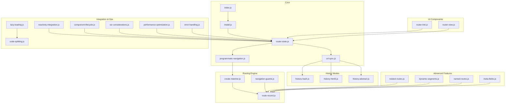

**Diagram sources**
- [index.js](file://源码学习/vue-router@3.5.1/src/index.js)
- [install.js](file://源码学习/vue-router@3.5.1/src/install.js)
- [router-state.js](file://源码学习/vue-router@3.5.1/src/types/router-state.js)
- [url-sync.js](file://源码学习/vue-router@3.5.1/src/url-sync.js)
- [programmatic-navigation.js](file://源码学习/vue-router@3.5.1/src/programmatic-navigation.js)
- [create-matcher.js](file://源码学习/vue-router@3.5.1/src/create-matcher.js)
- [route-record.js](file://源码学习/vue-router@3.5.1/src/types/route-record.js)
- [navigation-guards.js](file://源码学习/vue-router@3.5.1/src/navigation-guards.js)
- [history-hash.js](file://源码学习/vue-router@3.5.1/src/history/hash.js)
- [history-html5.js](file://源码学习/vue-router@3.5.1/src/history/html5.js)
- [history-abstract.js](file://源码学习/vue-router@3.5.1/src/history/abstract.js)
- [router-link.js](file://源码学习/vue-router@3.5.1/src/components/link.js)
- [router-view.js](file://源码学习/vue-router@3.5.1/src/components/view.js)
- [nested-routes.js](file://源码学习/vue-router@3.5.1/src/nested-routes.js)
- [dynamic-segments.js](file://源码学习/vue-router@3.5.1/src/dynamic-segments.js)
- [named-routes.js](file://源码学习/vue-router@3.5.1/src/named-routes.js)
- [meta-fields.js](file://源码学习/vue-router@3.5.1/src/meta-fields.js)
- [lazy-loading.js](file://源码学习/vue-router@3.5.1/src/lazy-loading.js)
- [code-splitting.js](file://源码学习/vue-router@3.5.1/src/code-splitting.js)
- [reactivity-integration.js](file://源码学习/vue-router@3.5.1/src/reactivity-integration.js)
- [component-lifecycle.js](file://源码学习/vue-router@3.5.1/src/component-lifecycle.js)
- [ssr-considerations.js](file://源码学习/vue-router@3.5.1/src/ssr-considerations.js)
- [performance-optimization.js](file://源码学习/vue-router@3.5.1/src/performance-optimization.js)
- [error-handling.js](file://源码学习/vue-router@3.5.1/src/error-handling.js)

**Section sources**
- [index.js](file://源码学习/vue-router@3.5.1/src/index.js)
- [install.js](file://源码学习/vue-router@3.5.1/src/install.js)

## Core Components
- Router instance creation and installation
- History mode abstraction
- Route matcher and records
- Navigation guards
- UI components (router-link, router-view)
- Reactive state and URL synchronization
- Programmatic navigation
- Advanced routing features and integrations

**Section sources**
- [index.js](file://源码学习/vue-router@3.5.1/src/index.js)
- [install.js](file://源码学习/vue-router@3.5.1/src/install.js)
- [router-state.js](file://源码学习/vue-router@3.5.1/src/types/router-state.js)
- [url-sync.js](file://源码学习/vue-router@3.5.1/src/url-sync.js)
- [programmatic-navigation.js](file://源码学习/vue-router@3.5.1/src/programmatic-navigation.js)
- [create-matcher.js](file://源码学习/vue-router@3.5.1/src/create-matcher.js)
- [route-record.js](file://源码学习/vue-router@3.5.1/src/types/route-record.js)
- [navigation-guards.js](file://源码学习/vue-router@3.5.1/src/navigation-guards.js)
- [router-link.js](file://源码学习/vue-router@3.5.1/src/components/link.js)
- [router-view.js](file://源码学习/vue-router@3.5.1/src/components/view.js)

## Architecture Overview
Vue Router composes a modular architecture:
- The Router instance holds reactive state and exposes navigation APIs.
- History modes encapsulate environment-specific URL manipulation.
- The matcher resolves current route(s) from the URL and route definitions.
- Navigation guards provide hooks for pre/post navigation and per-route logic.
- UI components bind to reactive state to render matched views.
- Lazy loading and code splitting enable efficient bundling and loading.
- SSR, reactivity integration, and lifecycle hooks ensure compatibility across environments.

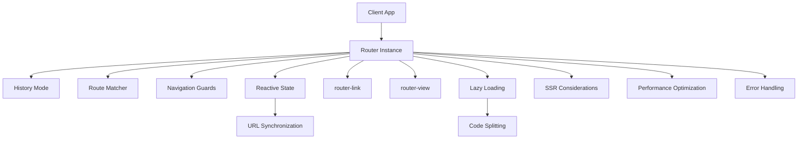

**Diagram sources**
- [index.js](file://源码学习/vue-router@3.5.1/src/index.js)
- [history-hash.js](file://源码学习/vue-router@3.5.1/src/history/hash.js)
- [history-html5.js](file://源码学习/vue-router@3.5.1/src/history/html5.js)
- [history-abstract.js](file://源码学习/vue-router@3.5.1/src/history/abstract.js)
- [create-matcher.js](file://源码学习/vue-router@3.5.1/src/create-matcher.js)
- [navigation-guards.js](file://源码学习/vue-router@3.5.1/src/navigation-guards.js)
- [router-state.js](file://源码学习/vue-router@3.5.1/src/types/router-state.js)
- [url-sync.js](file://源码学习/vue-router@3.5.1/src/url-sync.js)
- [router-link.js](file://源码学习/vue-router@3.5.1/src/components/link.js)
- [router-view.js](file://源码学习/vue-router@3.5.1/src/components/view.js)
- [lazy-loading.js](file://源码学习/vue-router@3.5.1/src/lazy-loading.js)
- [code-splitting.js](file://源码学习/vue-router@3.5.1/src/code-splitting.js)
- [ssr-considerations.js](file://源码学习/vue-router@3.5.1/src/ssr-considerations.js)
- [performance-optimization.js](file://源码学习/vue-router@3.5.1/src/performance-optimization.js)
- [error-handling.js](file://源码学习/vue-router@3.5.1/src/error-handling.js)

## Detailed Component Analysis

### History Modes: hash, HTML5, abstract
- Hash mode manipulates window.location.hash and listens to hashchange.
- HTML5 mode uses pushState/popState for clean URLs and requires server configuration.
- Abstract mode is used in non-browser environments (e.g., SSR) and does not touch the URL.

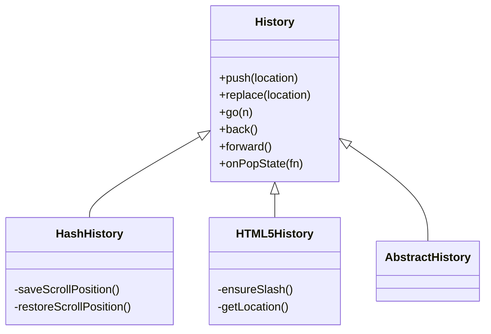

**Diagram sources**
- [history-hash.js](file://源码学习/vue-router@3.5.1/src/history/hash.js)
- [history-html5.js](file://源码学习/vue-router@3.5.1/src/history/html5.js)
- [history-abstract.js](file://源码学习/vue-router@3.5.1/src/history/abstract.js)

**Section sources**
- [history-hash.js](file://源码学习/vue-router@3.5.1/src/history/hash.js)
- [history-html5.js](file://源码学习/vue-router@3.5.1/src/history/html5.js)
- [history-abstract.js](file://源码学习/vue-router@3.5.1/src/history/abstract.js)

### Route Matching and Records
- Routes are normalized into route records with resolved components, aliases, and children.
- The matcher builds a tree of records and resolves the most specific match for the current URL.

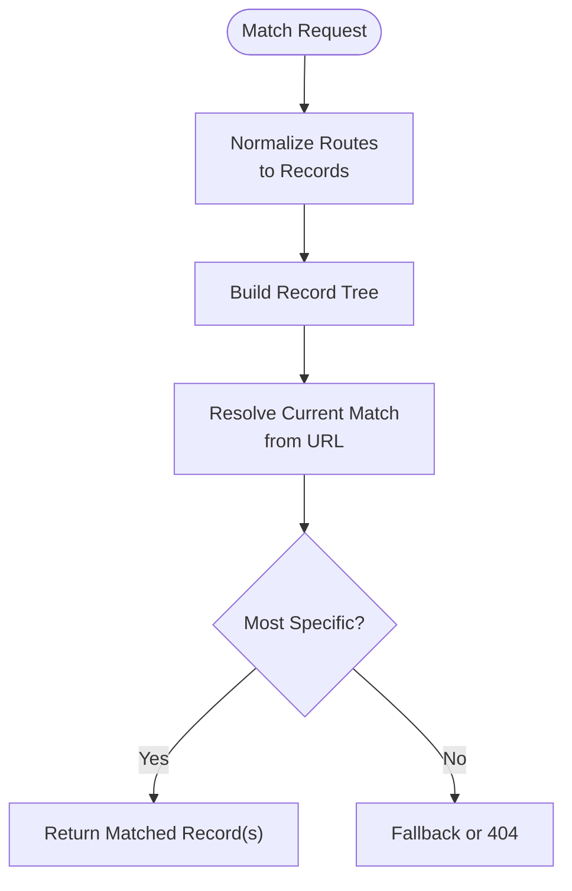

**Diagram sources**
- [create-matcher.js](file://源码学习/vue-router@3.5.1/src/create-matcher.js)
- [route-record.js](file://源码学习/vue-router@3.5.1/src/types/route-record.js)

**Section sources**
- [create-matcher.js](file://源码学习/vue-router@3.5.1/src/create-matcher.js)
- [route-record.js](file://源码学习/vue-router@3.5.1/src/types/route-record.js)

### Navigation Guards
- Global guards (beforeEach/beforeResolve/afterEach)
- Per-route guards (beforeEnter)
- Component guards (beforeRouteEnter/Update/Leave)
- Guards can be async and can abort or redirect navigation.

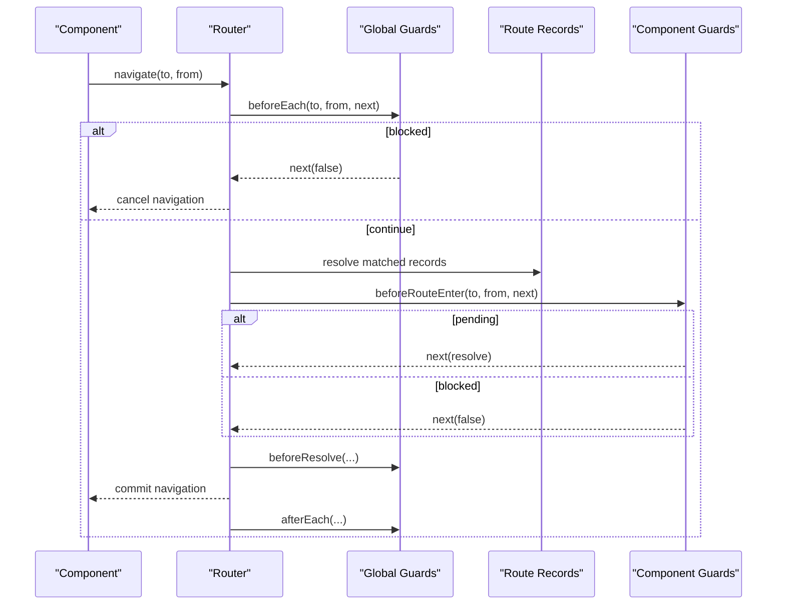

**Diagram sources**
- [navigation-guards.js](file://源码学习/vue-router@3.5.1/src/navigation-guards.js)
- [route-record.js](file://源码学习/vue-router@3.5.1/src/types/route-record.js)

**Section sources**
- [navigation-guards.js](file://源码学习/vue-router@3.5.1/src/navigation-guards.js)

### Component Instantiation and router-view
- router-view renders the matched component for the current route.
- It supports named views and keeps track of the active component instance.

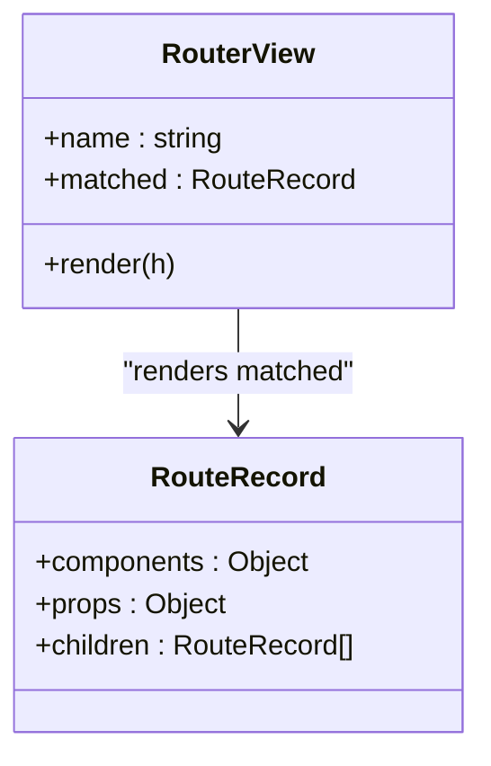

**Diagram sources**
- [router-view.js](file://源码学习/vue-router@3.5.1/src/components/view.js)
- [route-record.js](file://源码学习/vue-router@3.5.1/src/types/route-record.js)

**Section sources**
- [router-view.js](file://源码学习/vue-router@3.5.1/src/components/view.js)

### Lazy Loading and Route-Based Code Splitting
- Components can be loaded asynchronously via dynamic imports.
- Code splitting is achieved by deferring component resolution until navigation.

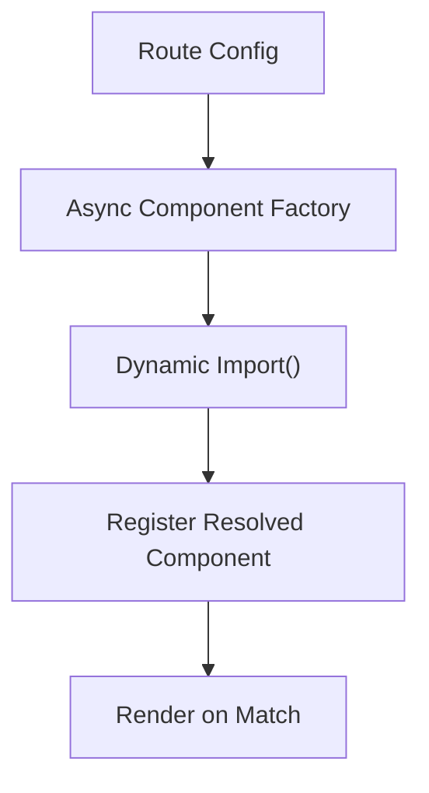

**Diagram sources**
- [lazy-loading.js](file://源码学习/vue-router@3.5.1/src/lazy-loading.js)
- [code-splitting.js](file://源码学习/vue-router@3.5.1/src/code-splitting.js)

**Section sources**
- [lazy-loading.js](file://源码学习/vue-router@3.5.1/src/lazy-loading.js)
- [code-splitting.js](file://源码学习/vue-router@3.5.1/src/code-splitting.js)

### Reactive Router State and URL Synchronization
- Router maintains reactive state for currentRoute and listeners for URL changes.
- URL synchronization updates state on popstate/hashchange and vice versa.

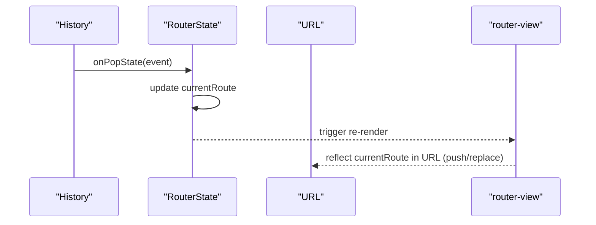

**Diagram sources**
- [router-state.js](file://源码学习/vue-router@3.5.1/src/types/router-state.js)
- [url-sync.js](file://源码学习/vue-router@3.5.1/src/url-sync.js)

**Section sources**
- [router-state.js](file://源码学习/vue-router@3.5.1/src/types/router-state.js)
- [url-sync.js](file://源码学习/vue-router@3.5.1/src/url-sync.js)

### Programmatic Navigation
- push/replace methods accept location descriptors and optional callbacks.
- Navigation is queued and executed after guards.

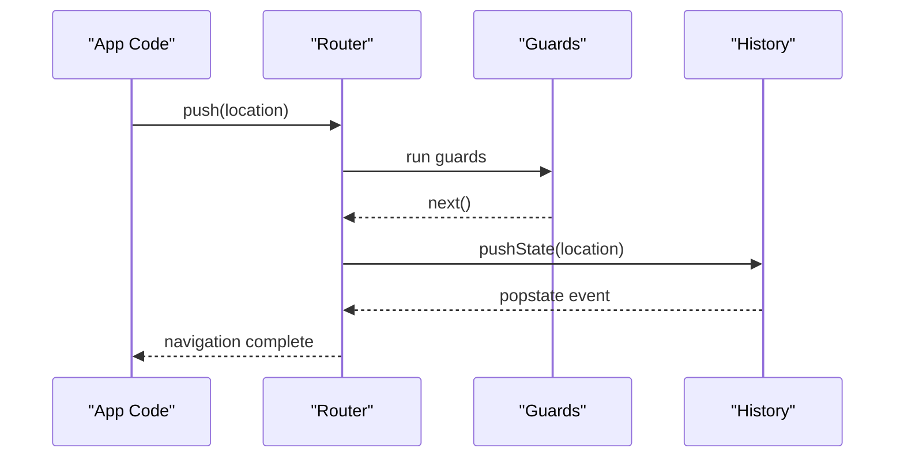

**Diagram sources**
- [programmatic-navigation.js](file://源码学习/vue-router@3.5.1/src/programmatic-navigation.js)
- [navigation-guards.js](file://源码学习/vue-router@3.5.1/src/navigation-guards.js)
- [history-html5.js](file://源码学习/vue-router@3.5.1/src/history/html5.js)

**Section sources**
- [programmatic-navigation.js](file://源码学习/vue-router@3.5.1/src/programmatic-navigation.js)

### Advanced Features
- Nested routes: parent-child relationships with outlet rendering.
- Dynamic segments: params extraction and matching.
- Named routes: lookup by name for navigation.
- Meta fields: attach arbitrary metadata to route records.

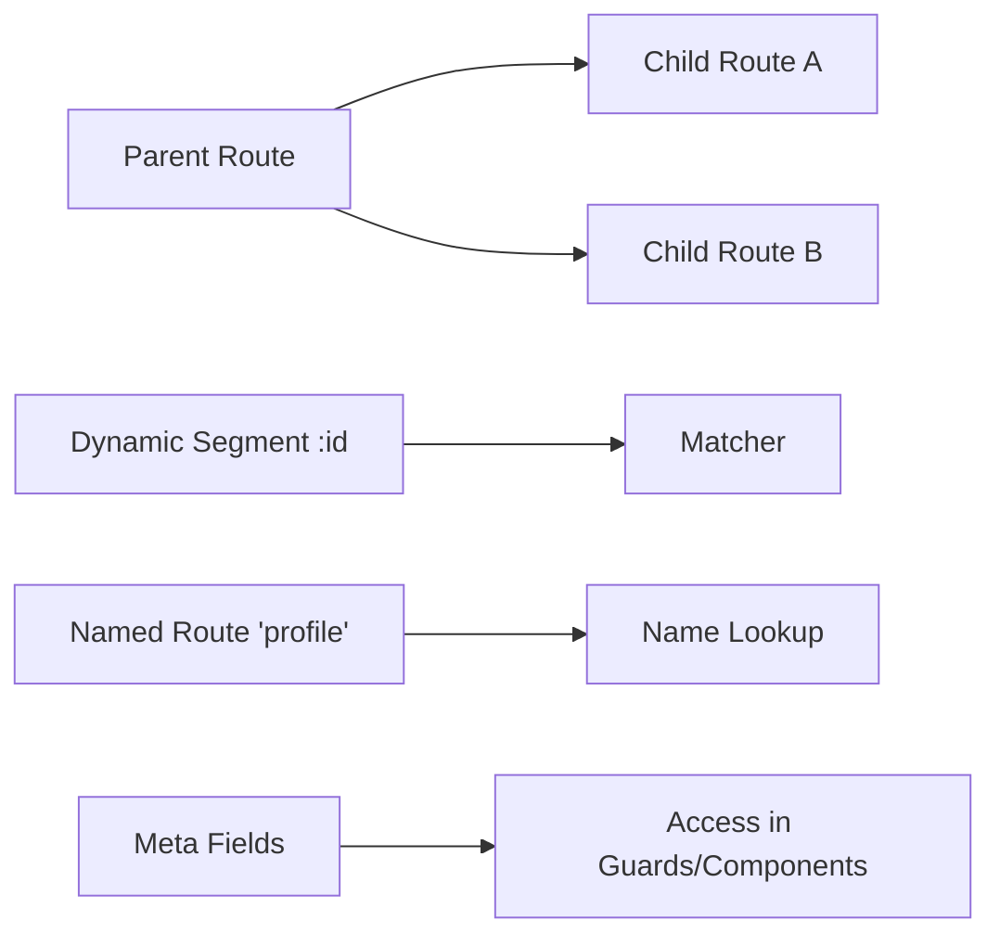

**Diagram sources**
- [nested-routes.js](file://源码学习/vue-router@3.5.1/src/nested-routes.js)
- [dynamic-segments.js](file://源码学习/vue-router@3.5.1/src/dynamic-segments.js)
- [named-routes.js](file://源码学习/vue-router@3.5.1/src/named-routes.js)
- [meta-fields.js](file://源码学习/vue-router@3.5.1/src/meta-fields.js)

**Section sources**
- [nested-routes.js](file://源码学习/vue-router@3.5.1/src/nested-routes.js)
- [dynamic-segments.js](file://源码学习/vue-router@3.5.1/src/dynamic-segments.js)
- [named-routes.js](file://源码学习/vue-router@3.5.1/src/named-routes.js)
- [meta-fields.js](file://源码学习/vue-router@3.5.1/src/meta-fields.js)

### Integration with Vue’s Reactivity and Lifecycle
- Router integrates via install, adding $router/$route to Vue instances.
- router-link uses Vue’s reactivity to compute active classes and attributes.
- Component lifecycle hooks (beforeRouteEnter/Update/Leave) integrate with component hooks.

```mermaid
sequenceDiagram
participant Vue as "Vue Instance"
participant Install as "Install"
participant Router as "Router"
participant Link as "router-link"
Install->>Vue : augment $router/$route
Link->>Vue : watch currentRoute
Vue-->>Link : update active state
```

**Diagram sources**
- [install.js](file://源码学习/vue-router@3.5.1/src/install.js)
- [reactivity-integration.js](file://源码学习/vue-router@3.5.1/src/reactivity-integration.js)
- [component-lifecycle.js](file://源码学习/vue-router@3.5.1/src/component-lifecycle.js)

**Section sources**
- [install.js](file://源码学习/vue-router@3.5.1/src/install.js)
- [reactivity-integration.js](file://源码学习/vue-router@3.5.1/src/reactivity-integration.js)
- [component-lifecycle.js](file://源码学习/vue-router@3.5.1/src/component-lifecycle.js)

### SSR Considerations
- Abstract history mode is used on the server to avoid DOM dependencies.
- URL is derived from the request context and state is hydrated on the client.

**Section sources**
- [ssr-considerations.js](file://源码学习/vue-router@3.5.1/src/ssr-considerations.js)
- [history-abstract.js](file://源码学习/vue-router@3.5.1/src/history/abstract.js)

### Practical Examples (Source References)
- Route configuration patterns: [index.js](file://源码学习/vue-router@3.5.1/src/index.js)
- Guard implementation: [navigation-guards.js](file://源码学习/vue-router@3.5.1/src/navigation-guards.js)
- Programmatic navigation usage: [programmatic-navigation.js](file://源码学习/vue-router@3.5.1/src/programmatic-navigation.js)
- Lazy loading with dynamic imports: [lazy-loading.js](file://源码学习/vue-router@3.5.1/src/lazy-loading.js)
- Named routes and meta fields: [named-routes.js](file://源码学习/vue-router@3.5.1/src/named-routes.js), [meta-fields.js](file://源码学习/vue-router@3.5.1/src/meta-fields.js)

## Dependency Analysis
- Loose coupling between History and Router via URL synchronization.
- Strong cohesion within Matcher and RouteRecord for route resolution.
- Guards depend on RouteRecord and are orchestrated by Router.
- UI components depend on RouterState for reactive rendering.

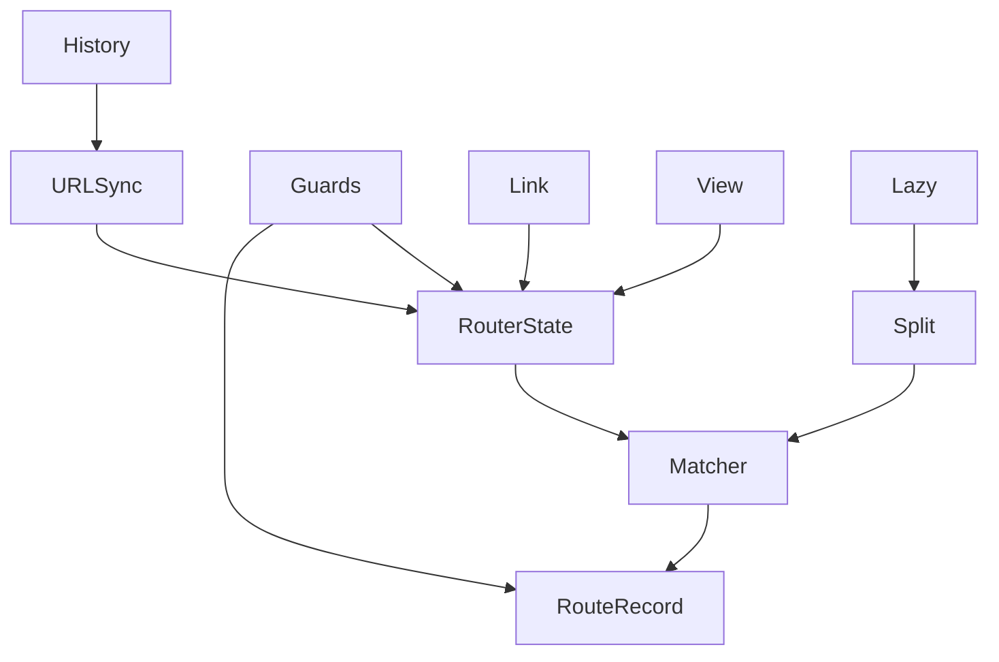

**Diagram sources**
- [url-sync.js](file://源码学习/vue-router@3.5.1/src/url-sync.js)
- [router-state.js](file://源码学习/vue-router@3.5.1/src/types/router-state.js)
- [create-matcher.js](file://源码学习/vue-router@3.5.1/src/create-matcher.js)
- [route-record.js](file://源码学习/vue-router@3.5.1/src/types/route-record.js)
- [navigation-guards.js](file://源码学习/vue-router@3.5.1/src/navigation-guards.js)
- [router-link.js](file://源码学习/vue-router@3.5.1/src/components/link.js)
- [router-view.js](file://源码学习/vue-router@3.5.1/src/components/view.js)
- [lazy-loading.js](file://源码学习/vue-router@3.5.1/src/lazy-loading.js)
- [code-splitting.js](file://源码学习/vue-router@3.5.1/src/code-splitting.js)

**Section sources**
- [url-sync.js](file://源码学习/vue-router@3.5.1/src/url-sync.js)
- [router-state.js](file://源码学习/vue-router@3.5.1/src/types/router-state.js)
- [create-matcher.js](file://源码学习/vue-router@3.5.1/src/create-matcher.js)
- [route-record.js](file://源码学习/vue-router@3.5.1/src/types/route-record.js)
- [navigation-guards.js](file://源码学习/vue-router@3.5.1/src/navigation-guards.js)
- [router-link.js](file://源码学习/vue-router@3.5.1/src/components/link.js)
- [router-view.js](file://源码学习/vue-router@3.5.1/src/components/view.js)
- [lazy-loading.js](file://源码学习/vue-router@3.5.1/src/lazy-loading.js)
- [code-splitting.js](file://源码学习/vue-router@3.5.1/src/code-splitting.js)

## Performance Considerations
- Prefer HTML5 history for production to avoid hash overhead.
- Use lazy loading and route-based code splitting to reduce initial bundle size.
- Minimize deep nesting to reduce matcher complexity.
- Debounce or batch navigation triggers to avoid excessive re-renders.
- Use meta fields judiciously; avoid heavy computations in guards.

[No sources needed since this section provides general guidance]

## Troubleshooting Guide
- Navigation blocked: inspect global and component guards for false returns or missing next calls.
- 404 routes: verify matcher configuration and fallback route presence.
- Hash vs HTML5 mismatch: confirm server configuration for HTML5 history and fallback handling.
- SSR hydration mismatch: ensure server and client share identical route definitions and initial state.

**Section sources**
- [error-handling.js](file://源码学习/vue-router@3.5.1/src/error-handling.js)
- [navigation-guards.js](file://源码学习/vue-router@3.5.1/src/navigation-guards.js)

## Conclusion
Vue Router 3.5.1 provides a robust, modular routing solution with strong separation of concerns. Its history abstraction, route matching engine, guard system, and reactive state management work together to support complex applications. By leveraging lazy loading, code splitting, and careful guard design, developers can achieve both maintainability and performance. The included SSR and lifecycle integrations further broaden its applicability across environments.