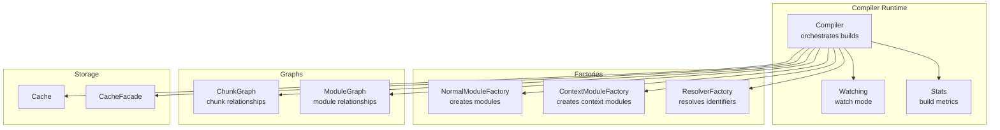
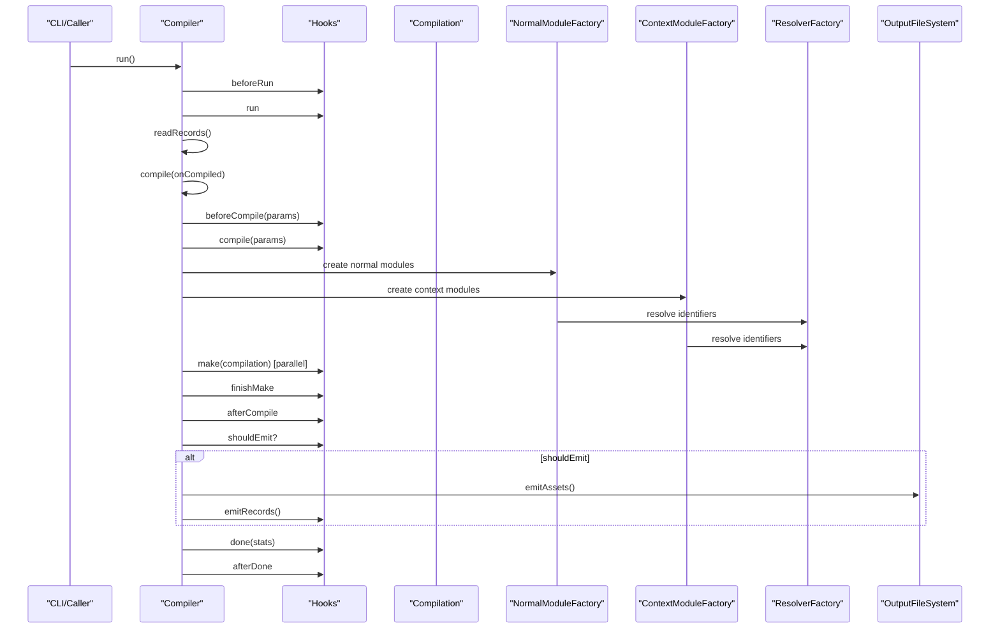
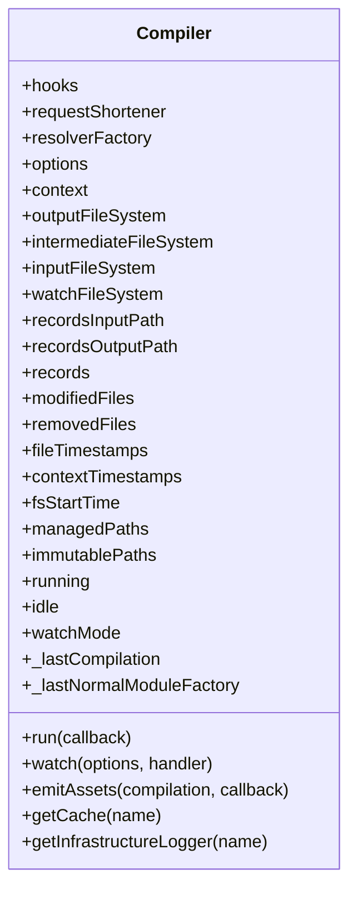
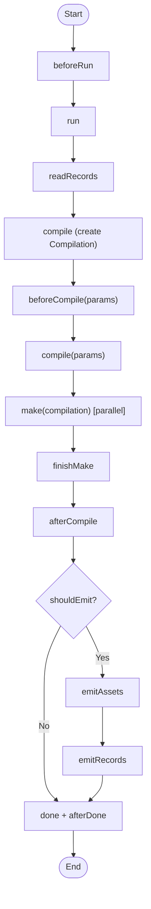
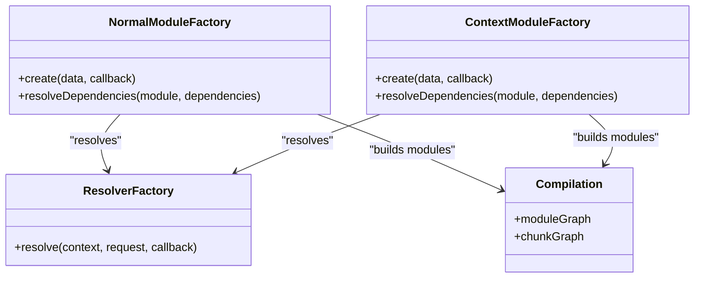
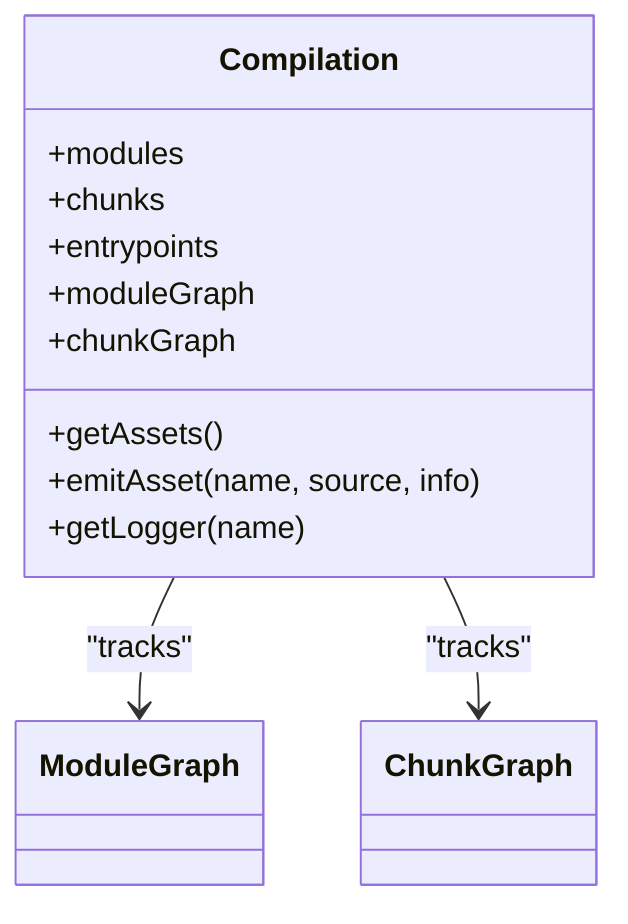
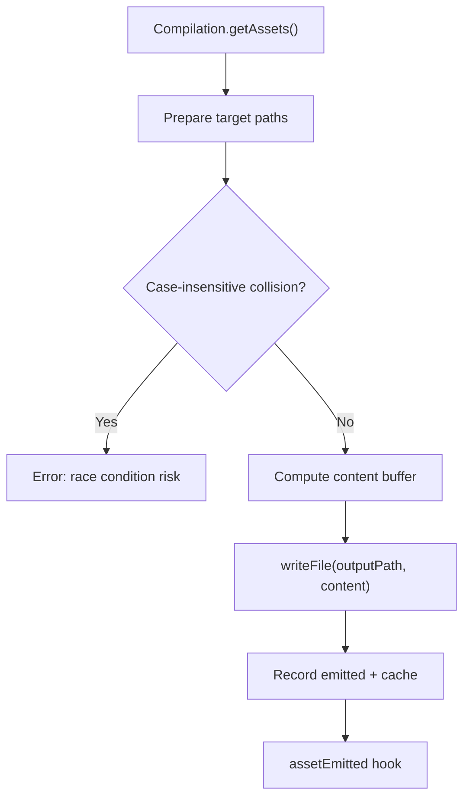
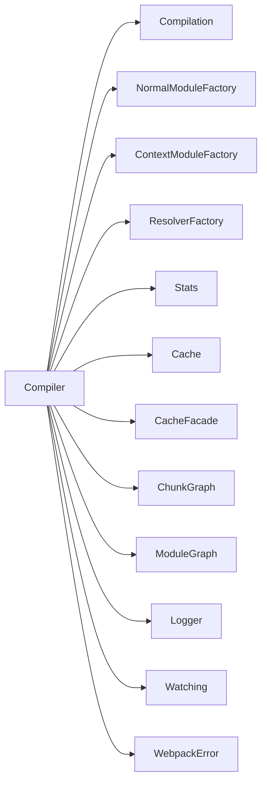

# Compilation Process

<cite>
**Referenced Files in This Document**
- [Compiler.js](file://源码学习/webpack@5.68.0/lib/Compiler.js)
- [Compilation.js](file://源码学习/webpack@5.68.0/lib/Compilation.js)
- [NormalModuleFactory.js](file://源码学习/webpack@5.68.0/lib/NormalModuleFactory.js)
- [ContextModuleFactory.js](file://源码学习/webpack@5.68.0/lib/ContextModuleFactory.js)
- [ResolverFactory.js](file://源码学习/webpack@5.68.0/lib/ResolverFactory.js)
- [Stats.js](file://源码学习/webpack@5.68.0/lib/Stats.js)
- [Cache.js](file://源码学习/webpack@5.68.0/lib/Cache.js)
- [CacheFacade.js](file://源码学习/webpack@5.68.0/lib/CacheFacade.js)
- [ChunkGraph.js](file://源码学习/webpack@5.68.0/lib/ChunkGraph.js)
- [ModuleGraph.js](file://源码学习/webpack@5.68.0/lib/ModuleGraph.js)
- [RequestShortener.js](file://源码学习/webpack@5.68.0/lib/RequestShortener.js)
- [Watching.js](file://源码学习/webpack@5.68.0/lib/Watching.js)
- [WebpackError.js](file://源码学习/webpack@5.68.0/lib/WebpackError.js)
- [Logger.js](file://源码学习/webpack@5.68.0/lib/logging/Logger.js)
- [types.d.ts](file://源码学习/webpack@5.68.0/types.d.ts)
</cite>

## Table of Contents
1. [Introduction](#introduction)
2. [Project Structure](#project-structure)
3. [Core Components](#core-components)
4. [Architecture Overview](#architecture-overview)
5. [Detailed Component Analysis](#detailed-component-analysis)
6. [Dependency Analysis](#dependency-analysis)
7. [Performance Considerations](#performance-considerations)
8. [Troubleshooting Guide](#troubleshooting-guide)
9. [Conclusion](#conclusion)
10. [Appendices](#appendices)

## Introduction
This document explains Webpack’s compilation process with a focus on the core compilation pipeline and module building workflow. It documents the Compiler class architecture, the compilation lifecycle, module factory patterns, and how Webpack transforms source files into executable bundles through parsing, dependency analysis, and code generation. It also covers the compilation hooks system, build optimization strategies, error handling, memory management, incremental builds, and parallel processing capabilities. Practical examples are provided via file references and diagrams mapped to actual source files.

## Project Structure
Webpack’s compilation core resides under the lib directory. The most relevant files for understanding the compilation process include:
- Compiler: orchestrates runs, emits assets, and coordinates hooks
- Compilation: encapsulates per-run module graph, chunks, and code generation
- NormalModuleFactory and ContextModuleFactory: create module instances from requests
- ResolverFactory: resolves module identifiers to file paths
- Stats: aggregates build metrics
- Cache and CacheFacade: manage caching for performance
- Graph utilities: ChunkGraph and ModuleGraph track relationships
- Supporting utilities: RequestShortener, Logger, Watching, WebpackError

**Diagram sources**
- [Compiler.js:119-329](file://源码学习/webpack@5.68.0/lib/Compiler.js#L119-L329)
- [Compilation.js](file://源码学习/webpack@5.68.0/lib/Compilation.js)
- [NormalModuleFactory.js](file://源码学习/webpack@5.68.0/lib/NormalModuleFactory.js)
- [ContextModuleFactory.js](file://源码学习/webpack@5.68.0/lib/ContextModuleFactory.js)
- [ResolverFactory.js](file://源码学习/webpack@5.68.0/lib/ResolverFactory.js)
- [Stats.js](file://源码学习/webpack@5.68.0/lib/Stats.js)
- [Cache.js](file://源码学习/webpack@5.68.0/lib/Cache.js)
- [CacheFacade.js](file://源码学习/webpack@5.68.0/lib/CacheFacade.js)
- [ChunkGraph.js](file://源码学习/webpack@5.68.0/lib/ChunkGraph.js)
- [ModuleGraph.js](file://源码学习/webpack@5.68.0/lib/ModuleGraph.js)

**Section sources**
- [Compiler.js:119-329](file://源码学习/webpack@5.68.0/lib/Compiler.js#L119-L329)

## Core Components
- Compiler: central orchestrator with lifecycle hooks, run/watch modes, asset emission, and caching integration
- Compilation: per-run container for modules, chunks, code generation, and statistics
- Factories: NormalModuleFactory and ContextModuleFactory construct modules from requests
- Resolvers: ResolverFactory resolves module identifiers to filesystem paths
- Graphs: ChunkGraph and ModuleGraph maintain relationships and metadata
- Utilities: Stats, Logger, Cache, CacheFacade, RequestShortener, Watching, WebpackError

Key responsibilities:
- Compiler manages the build lifecycle, invokes factories, coordinates hooks, and writes outputs
- Compilation tracks module and chunk graphs, collects assets, and generates output
- Factories translate requests into module instances with loaders and resolvers
- Graphs enable dependency analysis and chunking decisions
- Utilities support logging, caching, and error reporting

**Section sources**
- [Compiler.js:119-329](file://源码学习/webpack@5.68.0/lib/Compiler.js#L119-L329)
- [Compilation.js](file://源码学习/webpack@5.68.0/lib/Compilation.js)
- [NormalModuleFactory.js](file://源码学习/webpack@5.68.0/lib/NormalModuleFactory.js)
- [ContextModuleFactory.js](file://源码学习/webpack@5.68.0/lib/ContextModuleFactory.js)
- [ResolverFactory.js](file://源码学习/webpack@5.68.0/lib/ResolverFactory.js)
- [Stats.js](file://源码学习/webpack@5.68.0/lib/Stats.js)
- [Cache.js](file://源码学习/webpack@5.68.0/lib/Cache.js)
- [CacheFacade.js](file://源码学习/webpack@5.68.0/lib/CacheFacade.js)
- [ChunkGraph.js](file://源码学习/webpack@5.68.0/lib/ChunkGraph.js)
- [ModuleGraph.js](file://源码学习/webpack@5.68.0/lib/ModuleGraph.js)
- [Logger.js](file://源码学习/webpack@5.68.0/lib/logging/Logger.js)
- [Watching.js](file://源码学习/webpack@5.68.0/lib/Watching.js)
- [WebpackError.js](file://源码学习/webpack@5.68.0/lib/WebpackError.js)

## Architecture Overview
The compilation architecture centers on Compiler driving a single Compilation per run. Compiler hooks coordinate lifecycle events, while factories resolve and instantiate modules. Graphs track relationships, and Stats summarize outcomes. Caching accelerates rebuilds, and asset emission writes outputs to the configured filesystem.

**Diagram sources**
- [Compiler.js:472-604](file://源码学习/webpack@5.68.0/lib/Compiler.js#L472-L604)
- [Compiler.js:643-800](file://源码学习/webpack@5.68.0/lib/Compiler.js#L643-L800)
- [NormalModuleFactory.js](file://源码学习/webpack@5.68.0/lib/NormalModuleFactory.js)
- [ContextModuleFactory.js](file://源码学习/webpack@5.68.0/lib/ContextModuleFactory.js)
- [ResolverFactory.js](file://源码学习/webpack@5.68.0/lib/ResolverFactory.js)

## Detailed Component Analysis

### Compiler Class Architecture
Compiler is the primary orchestrator. It defines a comprehensive set of hooks for lifecycle control, manages run/watch modes, coordinates factories, and handles asset emission and records persistence. It integrates caching and logging facilities and supports child compilation.

Key aspects:
- Hooks: initialize, beforeRun, run, compile, make, finishMake, afterCompile, shouldEmit, emit, afterEmit, done, afterDone, additionalPass, readRecords, emitRecords, watchRun, failed, invalid, watchClose, shutdown, environment, afterEnvironment, afterPlugins, afterResolvers, entryOption, infrastructureLog
- Run/watch: run() executes a single build; watch() enables continuous builds
- Asset emission: emitAssets() writes outputs to the output filesystem with deduplication and casing checks
- Caching: getCache(), cache.beginIdle(), cache.endIdle(), cache.storeBuildDependencies()

**Diagram sources**
- [Compiler.js:119-329](file://源码学习/webpack@5.68.0/lib/Compiler.js#L119-L329)

**Section sources**
- [Compiler.js:119-329](file://源码学习/webpack@5.68.0/lib/Compiler.js#L119-L329)
- [Compiler.js:472-604](file://源码学习/webpack@5.68.0/lib/Compiler.js#L472-L604)
- [Compiler.js:643-800](file://源码学习/webpack@5.68.0/lib/Compiler.js#L643-L800)

### Compilation Lifecycle Stages
The lifecycle spans initialization, reading records, creating and compiling a Compilation, emitting assets, persisting records, and reporting completion. Additional passes can be triggered based on compilation hooks.

Stages:
- beforeRun: pre-run setup
- run: prepare for build
- readRecords: load persisted state
- compile/onCompiled: create Compilation and run make
- beforeCompile: prepare Compilation params
- compile: finalize params
- make: parallel module building
- finishMake: post-build actions
- afterCompile: finalize Compilation
- shouldEmit: decide whether to emit
- emitAssets: write outputs
- emitRecords: persist state
- done/afterDone: report completion

**Diagram sources**
- [Compiler.js:472-604](file://源码学习/webpack@5.68.0/lib/Compiler.js#L472-L604)
- [Compiler.js:643-800](file://源码学习/webpack@5.68.0/lib/Compiler.js#L643-L800)

**Section sources**
- [Compiler.js:472-604](file://源码学习/webpack@5.68.0/lib/Compiler.js#L472-L604)

### Module Factory Patterns
Webpack uses two primary factories:
- NormalModuleFactory: creates modules for explicit imports and requires
- ContextModuleFactory: creates modules for dynamic contexts (e.g., require.context)

Both rely on ResolverFactory to convert identifiers to absolute paths. Factories integrate with Compilation to attach loaders and resolve dependencies.

**Diagram sources**
- [NormalModuleFactory.js](file://源码学习/webpack@5.68.0/lib/NormalModuleFactory.js)
- [ContextModuleFactory.js](file://源码学习/webpack@5.68.0/lib/ContextModuleFactory.js)
- [ResolverFactory.js](file://源码学习/webpack@5.68.0/lib/ResolverFactory.js)
- [Compilation.js](file://源码学习/webpack@5.68.0/lib/Compilation.js)

**Section sources**
- [NormalModuleFactory.js](file://源码学习/webpack@5.68.0/lib/NormalModuleFactory.js)
- [ContextModuleFactory.js](file://源码学习/webpack@5.68.0/lib/ContextModuleFactory.js)
- [ResolverFactory.js](file://源码学习/webpack@5.68.0/lib/ResolverFactory.js)

### Compilation Class Responsibilities
Compilation encapsulates a single build run:
- Maintains moduleGraph and chunkGraph
- Collects assets and determines emitted files
- Coordinates loader execution and module building
- Generates code for chunks and modules
- Produces Stats for reporting

**Diagram sources**
- [Compilation.js](file://源码学习/webpack@5.68.0/lib/Compilation.js)
- [ModuleGraph.js](file://源码学习/webpack@5.68.0/lib/ModuleGraph.js)
- [ChunkGraph.js](file://源码学习/webpack@5.68.0/lib/ChunkGraph.js)

**Section sources**
- [Compilation.js](file://源码学习/webpack@5.68.0/lib/Compilation.js)

### Asset Emission and Output Pipeline
Compiler’s emitAssets writes compiled assets to the output filesystem with:
- Case-insensitive deduplication to prevent collisions on case-insensitive filesystems
- Content hashing checks and immutable path detection
- Parallelized writes with concurrency limits
- assetEmitted hook for post-emission customization

**Diagram sources**
- [Compiler.js:643-800](file://源码学习/webpack@5.68.0/lib/Compiler.js#L643-L800)

**Section sources**
- [Compiler.js:643-800](file://源码学习/webpack@5.68.0/lib/Compiler.js#L643-L800)

### Compilation Hooks System
Compiler exposes a rich hooks system enabling plugins to intercept and modify the build process. Hook categories include:
- Initialization and environment: initialize, environment, afterEnvironment, afterPlugins, afterResolvers, entryOption
- Run lifecycle: beforeRun, run, readRecords, additionalPass, watchRun
- Compilation lifecycle: beforeCompile, compile, make, finishMake, afterCompile, shouldEmit, emit, afterEmit, emitRecords
- Completion: done, afterDone, failed, invalid, watchClose, shutdown
- Infrastructure logging: infrastructureLog

These hooks are implemented using tapable primitives (SyncHook, SyncBailHook, AsyncSeriesHook, AsyncParallelHook), allowing synchronous and asynchronous control flow.

**Section sources**
- [Compiler.js:126-244](file://源码学习/webpack@5.68.0/lib/Compiler.js#L126-L244)

### Build Optimization Strategies
- Caching: Compiler.getCache() and CacheFacade provide persistent and memory caches to speed up rebuilds
- Idle transitions: Compiler switches to idle to flush caches and reduce memory pressure
- Concurrency: emitAssets uses limited concurrency to balance throughput and resource usage
- Records: readRecords/emitRecords preserve cross-run metadata for incremental builds
- Hashing: contenthash/chunkhash/modulehash/fullhash influence immutability and caching effectiveness

Practical tips:
- Enable persistent caching for repeated builds
- Use managedPaths and immutablePaths to mark trusted directories
- Leverage parallel make for CPU-bound module processing
- Minimize unnecessary asset emissions to reduce IO

**Section sources**
- [Compiler.js:335-341](file://源码学习/webpack@5.68.0/lib/Compiler.js#L335-L341)
- [Compiler.js:481-493](file://源码学习/webpack@5.68.0/lib/Compiler.js#L481-L493)
- [Compiler.js:643-800](file://源码学习/webpack@5.68.0/lib/Compiler.js#L643-L800)
- [Cache.js](file://源码学习/webpack@5.68.0/lib/Cache.js)
- [CacheFacade.js](file://源码学习/webpack@5.68.0/lib/CacheFacade.js)

### Error Handling Mechanisms
- Compiler.hooks.failed is invoked on errors during run
- WebpackError is used for build-time errors
- Watch mode uses Compiler.hooks.invalid and Compiler.hooks.watchClose for change notifications
- emitAssets validates case-insensitive collisions and prevents race conditions

Best practices:
- Register error handlers via hooks.failed
- Use infrastructure logging for diagnostics
- Monitor invalid/watchClose for development workflows

**Section sources**
- [Compiler.js:481-493](file://源码学习/webpack@5.68.0/lib/Compiler.js#L481-L493)
- [WebpackError.js](file://源码学习/webpack@5.68.0/lib/WebpackError.js)
- [Compiler.js:643-800](file://源码学习/webpack@5.68.0/lib/Compiler.js#L643-L800)

### Memory Management During Compilation
- Compiler._cleanupLastCompilation clears module and chunk graph caches for previous runs
- Compiler._cleanupLastNormalModuleFactory cleans up module factory caches
- Compiler maintains WeakMaps and WeakSets to avoid retaining module instances unnecessarily
- Idle transitions allow cache flushing and memory reduction

Recommendations:
- Keep long-lived compilers minimal and reuse them judiciously
- Clear caches explicitly when switching projects
- Monitor memory usage in watch mode and trigger idle transitions

**Section sources**
- [Compiler.js:427-448](file://源码学习/webpack@5.68.0/lib/Compiler.js#L427-L448)

### Incremental Builds and Records
- Compiler.readRecords loads prior build metadata
- Compiler.emitRecords persists current build metadata
- Cache.storeBuildDependencies updates dependency sets for future invalidations
- Stats summarizes build metrics for reporting

**Section sources**
- [Compiler.js:583-588](file://源码学习/webpack@5.68.0/lib/Compiler.js#L583-L588)
- [Compiler.js:551-557](file://源码学习/webpack@5.68.0/lib/Compiler.js#L551-L557)
- [Stats.js](file://源码学习/webpack@5.68.0/lib/Stats.js)

### Parallel Processing Capabilities
- make is an AsyncParallelHook, enabling parallel module building
- emitAssets uses asyncLib.forEachLimit to constrain concurrency during asset emission
- ResolverFactory and factories leverage asynchronous resolution and creation

**Section sources**
- [Compiler.js:199-205](file://源码学习/webpack@5.68.0/lib/Compiler.js#L199-L205)
- [Compiler.js:655-657](file://源码学习/webpack@5.68.0/lib/Compiler.js#L655-L657)

### Practical Examples

#### Example: Compilation Configuration
- Configure Compiler options (output path, devtool, optimization) and pass them to the Compiler constructor
- Use Compiler.getInfrastructureLogger for structured logging
- Integrate with Stats to capture build metrics

References:
- [Compiler.js:124-125](file://源码学习/webpack@5.68.0/lib/Compiler.js#L124-L125)
- [Compiler.js:347-423](file://源码学习/webpack@5.68.0/lib/Compiler.js#L347-L423)
- [Stats.js](file://源码学习/webpack@5.68.0/lib/Stats.js)

#### Example: Custom Compilation Plugin
- Register hooks around make to inject custom module processing
- Use Compilation.getLogger for plugin logs
- Emit assets via Compilation.emitAsset and Compilation.getAssets

References:
- [Compiler.js:199-205](file://源码学习/webpack@5.68.0/lib/Compiler.js#L199-L205)
- [Compilation.js](file://源码学习/webpack@5.68.0/lib/Compilation.js)

#### Example: Performance Optimization Techniques
- Enable persistent caching via Compiler.getCache
- Use managedPaths and immutablePaths to optimize cache reliability
- Limit asset emission concurrency in custom emitters

References:
- [Compiler.js:335-341](file://源码学习/webpack@5.68.0/lib/Compiler.js#L335-L341)
- [Compiler.js:274-276](file://源码学习/webpack@5.68.0/lib/Compiler.js#L274-L276)
- [Compiler.js:655-657](file://源码学习/webpack@5.68.0/lib/Compiler.js#L655-L657)

## Dependency Analysis
The following diagram highlights key internal dependencies among core components:

**Diagram sources**
- [Compiler.js:119-329](file://源码学习/webpack@5.68.0/lib/Compiler.js#L119-L329)
- [Compilation.js](file://源码学习/webpack@5.68.0/lib/Compilation.js)
- [NormalModuleFactory.js](file://源码学习/webpack@5.68.0/lib/NormalModuleFactory.js)
- [ContextModuleFactory.js](file://源码学习/webpack@5.68.0/lib/ContextModuleFactory.js)
- [ResolverFactory.js](file://源码学习/webpack@5.68.0/lib/ResolverFactory.js)
- [Stats.js](file://源码学习/webpack@5.68.0/lib/Stats.js)
- [Cache.js](file://源码学习/webpack@5.68.0/lib/Cache.js)
- [CacheFacade.js](file://源码学习/webpack@5.68.0/lib/CacheFacade.js)
- [ChunkGraph.js](file://源码学习/webpack@5.68.0/lib/ChunkGraph.js)
- [ModuleGraph.js](file://源码学习/webpack@5.68.0/lib/ModuleGraph.js)
- [Logger.js](file://源码学习/webpack@5.68.0/lib/logging/Logger.js)
- [Watching.js](file://源码学习/webpack@5.68.0/lib/Watching.js)
- [WebpackError.js](file://源码学习/webpack@5.68.0/lib/WebpackError.js)

**Section sources**
- [Compiler.js:119-329](file://源码学习/webpack@5.68.0/lib/Compiler.js#L119-L329)

## Performance Considerations
- Prefer persistent caching for repeated builds
- Use managedPaths and immutablePaths to improve cache hit rates
- Limit concurrent asset emission to avoid IO contention
- Use parallel make for CPU-bound loaders
- Monitor memory usage and trigger idle transitions between builds

[No sources needed since this section provides general guidance]

## Troubleshooting Guide
Common issues and remedies:
- Duplicate asset names differing only by case: handled by emitAssets case-insensitive checks
- Concurrency errors: adjust emit concurrency and ensure unique asset names
- Long-running builds: enable caching, use incremental records, and parallel make
- Logging: use Compiler.getInfrastructureLogger for structured diagnostics

**Section sources**
- [Compiler.js:717-724](file://源码学习/webpack@5.68.0/lib/Compiler.js#L717-L724)
- [Compiler.js:655-657](file://源码学习/webpack@5.68.0/lib/Compiler.js#L655-L657)
- [Logger.js](file://源码学习/webpack@5.68.0/lib/logging/Logger.js)

## Conclusion
Webpack’s compilation process is a highly orchestrated pipeline centered on Compiler, driven by a rich hooks system, and powered by factories, resolvers, and graph utilities. By leveraging caching, parallelism, and careful asset emission, Webpack achieves efficient and reliable builds. Understanding the Compiler lifecycle, module factories, and optimization strategies enables effective configuration and troubleshooting.

[No sources needed since this section summarizes without analyzing specific files]

## Appendices

### Appendix A: Compilation Hooks Reference
- Environment: environment, afterEnvironment, afterPlugins, afterResolvers, entryOption
- Run: beforeRun, run, readRecords, additionalPass, watchRun
- Compilation: beforeCompile, compile, make, finishMake, afterCompile, shouldEmit, emit, afterEmit, emitRecords
- Completion: done, afterDone, failed, invalid, watchClose, shutdown
- Infrastructure: infrastructureLog

**Section sources**
- [Compiler.js:126-244](file://源码学习/webpack@5.68.0/lib/Compiler.js#L126-L244)

### Appendix B: Types and Interfaces
- Compiler class definition and options typing are declared in types.d.ts
- Compilation, Module, Chunk, and related types are defined alongside runtime classes

**Section sources**
- [types.d.ts:1880-1880](file://源码学习/webpack@5.68.0/types.d.ts#L1880-L1880)