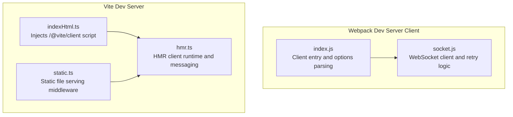
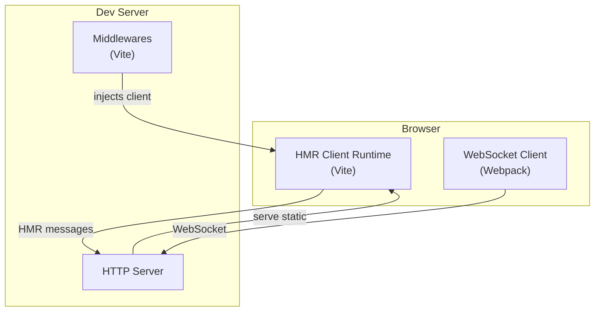
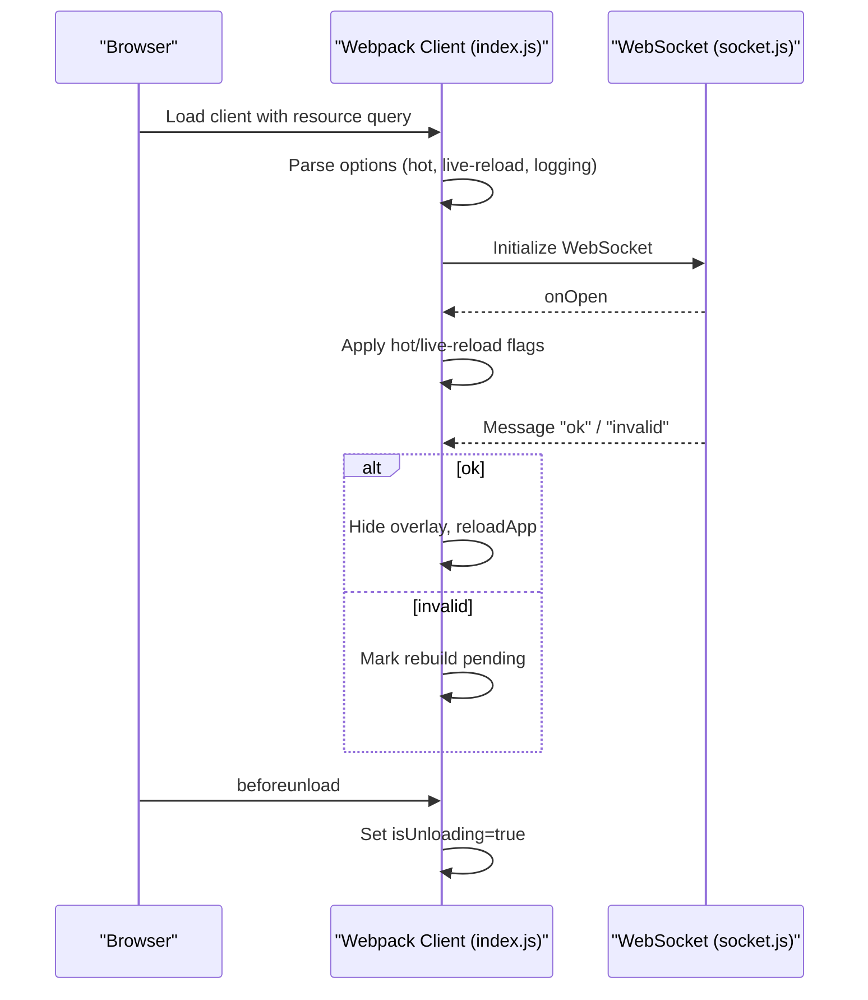
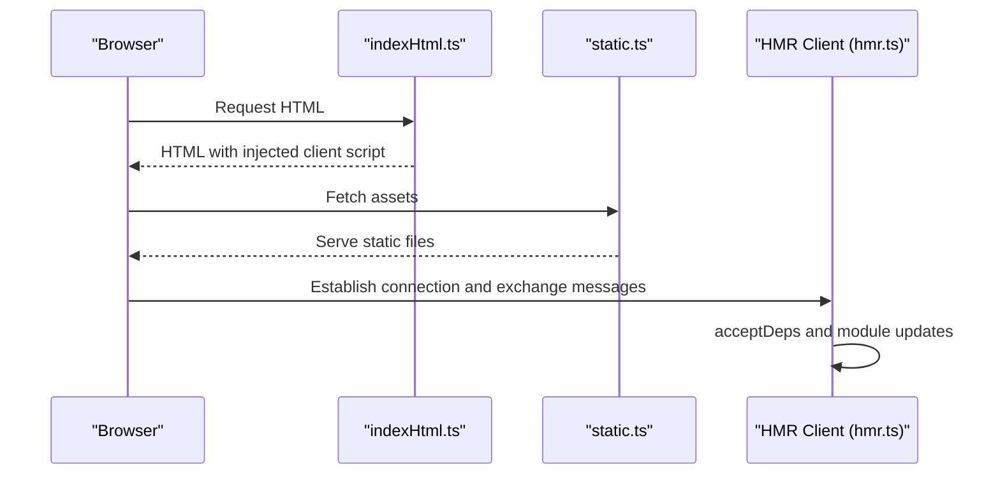
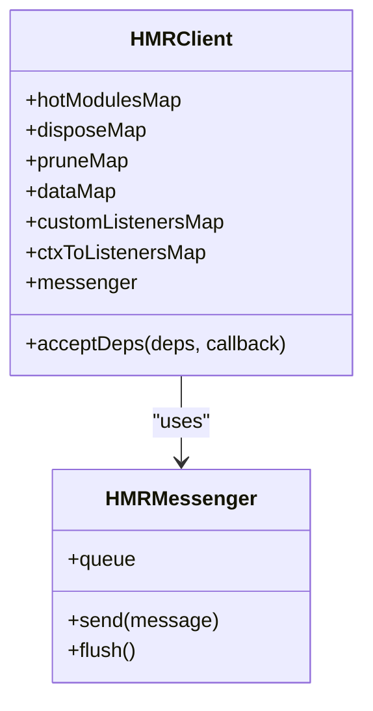
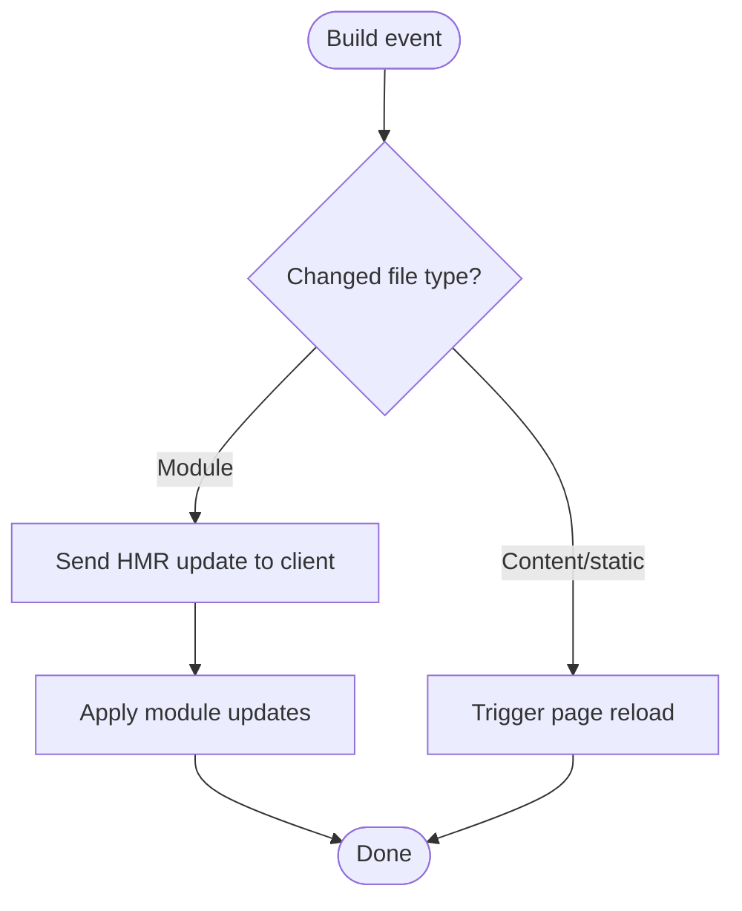
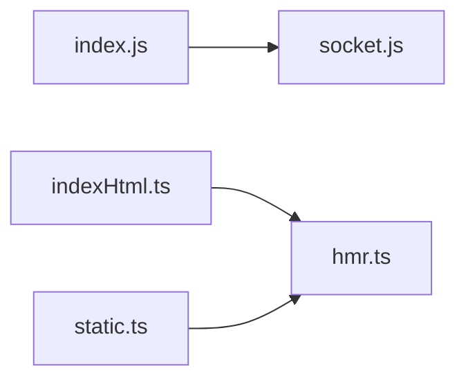

# Development Server and HMR

<cite>
**Referenced Files in This Document**
- [index.js](file://源码学习/webpack@5.68.0/webpack 依赖包/webpack-dev-server/client/index.js)
- [socket.js](file://源码学习/webpack@5.68.0/webpack 依赖包/webpack-dev-server/client/socket.js)
- [indexHtml.ts](file://源码学习/vite@5.2.11/packages/vite/src/node/server/middlewares/indexHtml.ts)
- [static.ts](file://源码学习/vite@5.2.11/packages/vite/src/node/server/middlewares/static.ts)
- [hmr.ts](file://源码学习/vite@5.2.11/packages/vite/src/shared/hmr.ts)
</cite>

## Table of Contents
1. [Introduction](#introduction)
2. [Project Structure](#project-structure)
3. [Core Components](#core-components)
4. [Architecture Overview](#architecture-overview)
5. [Detailed Component Analysis](#detailed-component-analysis)
6. [Dependency Analysis](#dependency-analysis)
7. [Performance Considerations](#performance-considerations)
8. [Troubleshooting Guide](#troubleshooting-guide)
9. [Conclusion](#conclusion)

## Introduction
This document explains the development server and Hot Module Replacement (HMR) systems used by modern frontend toolchains, focusing on two implementations present in the repository:
- Webpack Dev Server client and WebSocket-based live reload/HMR
- Vite’s development server middleware pipeline and HMR runtime

It covers architecture, middleware integration, live reload mechanisms, HMR protocol, module update strategies, client–server communication, configuration (including proxy and SSL), practical HMR usage, and performance considerations for development builds.

## Project Structure
The repository contains:
- Webpack Dev Server client code under the Webpack source tree, including the client entry and WebSocket client integration
- Vite’s development server middlewares and HMR runtime shared utilities

**Diagram sources**
- [index.js:37-229](file://源码学习/webpack@5.68.0/webpack 依赖包/webpack-dev-server/client/index.js#L37-L229)
- [socket.js:1-39](file://源码学习/webpack@5.68.0/webpack 依赖包/webpack-dev-server/client/socket.js#L1-L39)
- [indexHtml.ts:445-477](file://源码学习/vite@5.2.11/packages/vite/src/node/server/middlewares/indexHtml.ts#L445-L477)
- [static.ts:85-112](file://源码学习/vite@5.2.11/packages/vite/src/node/server/middlewares/static.ts#L85-L112)
- [hmr.ts:188-254](file://源码学习/vite@5.2.11/packages/vite/src/shared/hmr.ts#L188-L254)

**Section sources**
- [index.js:37-229](file://源码学习/webpack@5.68.0/webpack 依赖包/webpack-dev-server/client/index.js#L37-L229)
- [socket.js:1-39](file://源码学习/webpack@5.68.0/webpack 依赖包/webpack-dev-server/client/socket.js#L1-L39)
- [indexHtml.ts:445-477](file://源码学习/vite@5.2.11/packages/vite/src/node/server/middlewares/indexHtml.ts#L445-L477)
- [static.ts:85-112](file://源码学习/vite@5.2.11/packages/vite/src/node/server/middlewares/static.ts#L85-L112)
- [hmr.ts:188-254](file://源码学习/vite@5.2.11/packages/vite/src/shared/hmr.ts#L188-L254)

## Core Components
- Webpack Dev Server client
  - Parses resource query options (hot, live-reload, logging, reconnect)
  - Handles socket messages for hot/live reload and triggers page reload or HMR
  - Manages lifecycle events around page unload
- Webpack Dev Server WebSocket client
  - Initializes WebSocket connections with retry logic and reconnect limits
  - Exposes open/close hooks and message handler registration
- Vite Dev Server middlewares
  - Index HTML middleware injects the Vite client script for HMR
  - Static middleware serves static assets efficiently
- Vite HMR runtime
  - Provides HMR client, messenger, and module registry
  - Implements acceptDeps and HMR message queuing

**Section sources**
- [index.js:37-229](file://源码学习/webpack@5.68.0/webpack 依赖包/webpack-dev-server/client/index.js#L37-L229)
- [socket.js:1-39](file://源码学习/webpack@5.68.0/webpack 依赖包/webpack-dev-server/client/socket.js#L1-L39)
- [indexHtml.ts:445-477](file://源码学习/vite@5.2.11/packages/vite/src/node/server/middlewares/indexHtml.ts#L445-L477)
- [static.ts:85-112](file://源码学习/vite@5.2.11/packages/vite/src/node/server/middlewares/static.ts#L85-L112)
- [hmr.ts:188-254](file://源码学习/vite@5.2.11/packages/vite/src/shared/hmr.ts#L188-L254)

## Architecture Overview
High-level architecture for both systems:

**Diagram sources**
- [index.js:37-229](file://源码学习/webpack@5.68.0/webpack 依赖包/webpack-dev-server/client/index.js#L37-L229)
- [socket.js:1-39](file://源码学习/webpack@5.68.0/webpack 依赖包/webpack-dev-server/client/socket.js#L1-L39)
- [indexHtml.ts:445-477](file://源码学习/vite@5.2.11/packages/vite/src/node/server/middlewares/indexHtml.ts#L445-L477)
- [static.ts:85-112](file://源码学习/vite@5.2.11/packages/vite/src/node/server/middlewares/static.ts#L85-L112)
- [hmr.ts:188-254](file://源码学习/vite@5.2.11/packages/vite/src/shared/hmr.ts#L188-L254)

## Detailed Component Analysis

### Webpack Dev Server Client
- Options parsing from resource query:
  - hot, live-reload, logging, reconnect
  - Sets up logging levels and applies options
- Socket message handlers:
  - hot/liveReload enable flags
  - invalid/ok/status updates
  - content/static-changed triggers page reload
  - overlay handling for errors/warnings
- Lifecycle:
  - beforeunload sets unloading flag to suppress reload prompts during shutdown

**Diagram sources**
- [index.js:37-229](file://源码学习/webpack@5.68.0/webpack 依赖包/webpack-dev-server/client/index.js#L37-L229)
- [socket.js:1-39](file://源码学习/webpack@5.68.0/webpack 依赖包/webpack-dev-server/client/socket.js#L1-L39)

**Section sources**
- [index.js:37-229](file://源码学习/webpack@5.68.0/webpack 依赖包/webpack-dev-server/client/index.js#L37-L229)
- [socket.js:1-39](file://源码学习/webpack@5.68.0/webpack 依赖包/webpack-dev-server/client/socket.js#L1-L39)

### Vite Dev Server Middlewares and HMR Runtime
- Index HTML middleware:
  - Injects a script tag pointing to the Vite client endpoint
  - Enables HMR in development mode
- Static middleware:
  - Efficiently serves static assets with headers and public file detection
- HMR runtime:
  - HMRClient maintains hotModulesMap, dispose/prune/data listeners
  - HMRMessenger queues and flushes messages when connection ready
  - acceptDeps registers dependency acceptance and callbacks

**Diagram sources**
- [indexHtml.ts:445-477](file://源码学习/vite@5.2.11/packages/vite/src/node/server/middlewares/indexHtml.ts#L445-L477)
- [static.ts:85-112](file://源码学习/vite@5.2.11/packages/vite/src/node/server/middlewares/static.ts#L85-L112)
- [hmr.ts:188-254](file://源码学习/vite@5.2.11/packages/vite/src/shared/hmr.ts#L188-L254)

**Section sources**
- [indexHtml.ts:445-477](file://源码学习/vite@5.2.11/packages/vite/src/node/server/middlewares/indexHtml.ts#L445-L477)
- [static.ts:85-112](file://源码学习/vite@5.2.11/packages/vite/src/node/server/middlewares/static.ts#L85-L112)
- [hmr.ts:188-254](file://源码学习/vite@5.2.11/packages/vite/src/shared/hmr.ts#L188-L254)

### HMR Protocol and Module Update Strategies
- Vite HMR runtime
  - HMRClient holds per-module maps for callbacks, disposals, pruning, and custom listeners
  - HMRMessenger batches and sends messages only when the connection is ready
  - acceptDeps enables selective dependency acceptance and callback registration
- Practical HMR implementation
  - Use acceptDeps to register callbacks for dependency changes
  - Implement custom listeners for advanced update flows
  - Manage module data via dataMap and lifecycle hooks (dispose/prune)

**Diagram sources**
- [hmr.ts:188-254](file://源码学习/vite@5.2.11/packages/vite/src/shared/hmr.ts#L188-L254)

**Section sources**
- [hmr.ts:188-254](file://源码学习/vite@5.2.11/packages/vite/src/shared/hmr.ts#L188-L254)

### Live Reload Mechanisms
- Webpack Dev Server
  - On "content-changed" or "static-changed" messages, triggers location.reload()
  - Supports overlay for build errors/warnings and hides on "ok"
- Vite Dev Server
  - Static middleware serves static assets; HMR handles module updates without full reload when possible

**Diagram sources**
- [index.js:210-224](file://源码学习/webpack@5.68.0/webpack 依赖包/webpack-dev-server/client/index.js#L210-L224)

**Section sources**
- [index.js:210-224](file://源码学习/webpack@5.68.0/webpack 依赖包/webpack-dev-server/client/index.js#L210-L224)

### Development Server Configuration, Proxy, and SSL
- Webpack Dev Server
  - Client parses resource query options for hot, live-reload, logging, and reconnect behavior
  - Retry logic and reconnect limits are handled in the WebSocket client
- Vite Dev Server
  - Index HTML injection ensures the client script is loaded in development
  - Static middleware serves assets efficiently with headers support
- Proxy and SSL
  - These are configured in the server configuration layer (outside the referenced files)
  - Proxy targets and SSL options are typically provided via server configuration APIs

**Section sources**
- [index.js:37-91](file://源码学习/webpack@5.68.0/webpack 依赖包/webpack-dev-server/client/index.js#L37-L91)
- [socket.js:1-39](file://源码学习/webpack@5.68.0/webpack 依赖包/webpack-dev-server/client/socket.js#L1-L39)
- [indexHtml.ts:445-477](file://源码学习/vite@5.2.11/packages/vite/src/node/server/middlewares/indexHtml.ts#L445-L477)
- [static.ts:85-112](file://源码学习/vite@5.2.11/packages/vite/src/node/server/middlewares/static.ts#L85-L112)

## Dependency Analysis
- Webpack Dev Server
  - index.js depends on socket.js for WebSocket lifecycle
  - Options parsing influences hot/live-reload behavior and overlay handling
- Vite Dev Server
  - indexHtml.ts injects the client script into HTML
  - static.ts serves static assets
  - hmr.ts provides the HMR runtime used by the injected client

**Diagram sources**
- [index.js:37-229](file://源码学习/webpack@5.68.0/webpack 依赖包/webpack-dev-server/client/index.js#L37-L229)
- [socket.js:1-39](file://源码学习/webpack@5.68.0/webpack 依赖包/webpack-dev-server/client/socket.js#L1-L39)
- [indexHtml.ts:445-477](file://源码学习/vite@5.2.11/packages/vite/src/node/server/middlewares/indexHtml.ts#L445-L477)
- [static.ts:85-112](file://源码学习/vite@5.2.11/packages/vite/src/node/server/middlewares/static.ts#L85-L112)
- [hmr.ts:188-254](file://源码学习/vite@5.2.11/packages/vite/src/shared/hmr.ts#L188-L254)

**Section sources**
- [index.js:37-229](file://源码学习/webpack@5.68.0/webpack 依赖包/webpack-dev-server/client/index.js#L37-L229)
- [socket.js:1-39](file://源码学习/webpack@5.68.0/webpack 依赖包/webpack-dev-server/client/socket.js#L1-L39)
- [indexHtml.ts:445-477](file://源码学习/vite@5.2.11/packages/vite/src/node/server/middlewares/indexHtml.ts#L445-L477)
- [static.ts:85-112](file://源码学习/vite@5.2.11/packages/vite/src/node/server/middlewares/static.ts#L85-L112)
- [hmr.ts:188-254](file://源码学习/vite@5.2.11/packages/vite/src/shared/hmr.ts#L188-L254)

## Performance Considerations
- Development builds
  - Prefer minimal transforms and disable heavy optimizations
  - Enable source maps suitable for development (e.g., eval-like or inline for fast iteration)
- HMR performance
  - Keep hot modules granular to reduce update scope
  - Avoid unnecessary module boundaries that break hot updates
- Network and I/O
  - Use efficient static asset serving (already handled by static middleware)
  - Minimize WebSocket message volume by batching updates

## Troubleshooting Guide
- WebSocket connection issues
  - Verify reconnect options and retry limits in the client
  - Check server availability and CORS/proxy configurations
- HMR not applying
  - Confirm acceptDeps registrations and dependency paths
  - Ensure module exports are compatible with HMR expectations
- Page reload instead of HMR
  - Check for module boundary changes or unsupported updates
  - Review overlay messages for hints on why HMR was not applied

**Section sources**
- [socket.js:1-39](file://源码学习/webpack@5.68.0/webpack 依赖包/webpack-dev-server/client/socket.js#L1-L39)
- [hmr.ts:188-254](file://源码学习/vite@5.2.11/packages/vite/src/shared/hmr.ts#L188-L254)

## Conclusion
Both Webpack Dev Server and Vite provide robust development server experiences with live reload and HMR. Webpack’s client integrates with a WebSocket-based protocol and overlays, while Vite’s system leverages injected client scripts and efficient middleware for static assets. Understanding the client options, middleware injection, and HMR runtime enables effective development workflows, targeted performance tuning, and reliable troubleshooting.