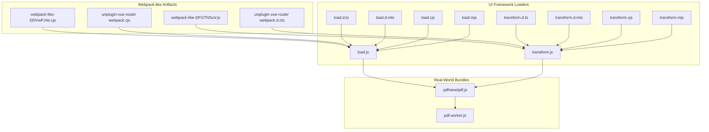
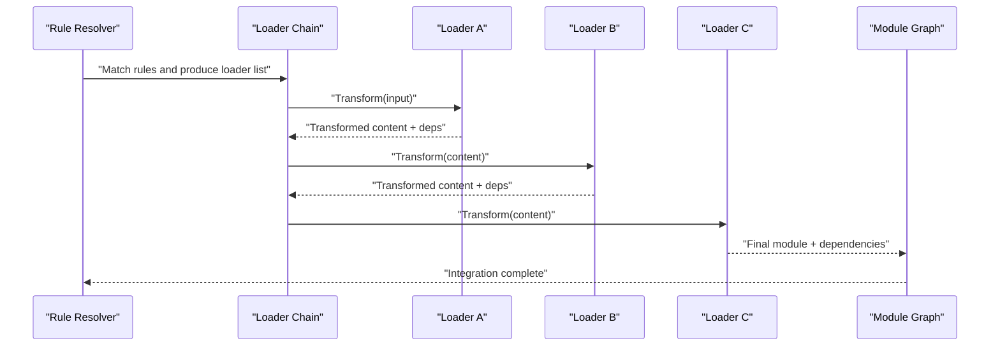
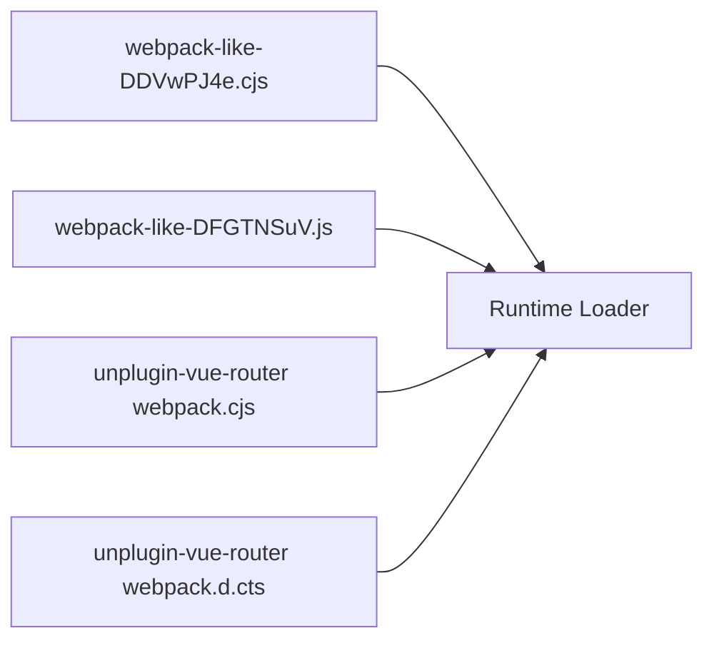
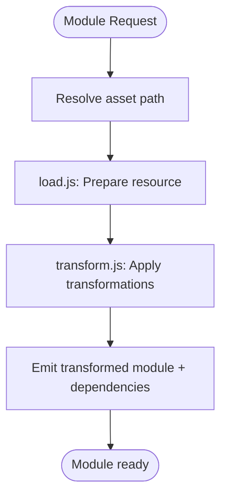
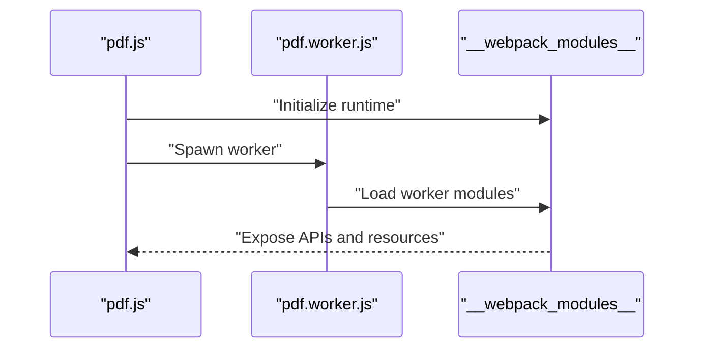
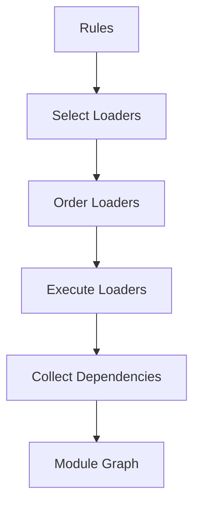

# Loader System and Processing

<cite>
**Referenced Files in This Document**
- [webpack.js](file://demo/nuxt/demo_2/node_modules/unplugin/dist/webpack-like-DDVwPJ4e.cjs)
- [webpack.js](file://demo/nuxt/demo_2/node_modules/unplugin/dist/webpack-like-DFGTNSuV.js)
- [webpack.cjs](file://demo/nuxt/demo_2/node_modules/unplugin-vue-router/dist/webpack.cjs)
- [webpack.d.cts](file://demo/nuxt/demo_2/node_modules/unplugin-vue-router/dist/webpack.d.cts)
- [load.js](file://demo/nuxt/demo_2/node_modules/@element-plus/nuxt/node_modules/unplugin/dist/webpack/loaders/load.js)
- [transform.js](file://demo/nuxt/demo_2/node_modules/@element-plus/nuxt/node_modules/unplugin/dist/webpack/loaders/transform.js)
- [load.d.ts](file://demo/nuxt/demo_2/node_modules/@element-plus/nuxt/node_modules/unplugin/dist/webpack/loaders/load.d.ts)
- [transform.d.ts](file://demo/nuxt/demo_2/node_modules/@element-plus/nuxt/node_modules/unplugin/dist/webpack/loaders/transform.d.ts)
- [load.d.mts](file://demo/nuxt/demo_2/node_modules/@element-plus/nuxt/node_modules/unplugin/dist/webpack/loaders/load.d.mts)
- [transform.d.mts](file://demo/nuxt/demo_2/node_modules/@element-plus/nuxt/node_modules/unplugin/dist/webpack/loaders/transform.d.mts)
- [load.cjs](file://demo/nuxt/demo_2/node_modules/@element-plus/nuxt/node_modules/unplugin/dist/webpack/loaders/load.cjs)
- [transform.cjs](file://demo/nuxt/demo_2/node_modules/@element-plus/nuxt/node_modules/unplugin/dist/webpack/loaders/transform.cjs)
- [load.mjs](file://demo/nuxt/demo_2/node_modules/@element-plus/nuxt/node_modules/unplugin/dist/webpack/loaders/load.mjs)
- [transform.mjs](file://demo/nuxt/demo_2/node_modules/@element-plus/nuxt/node_modules/unplugin/dist/webpack/loaders/transform.mjs)
- [pdf.js](file://demo/node/02_playground/public/pdfview/pdf.js)
- [pdf.worker.js](file://demo/node/02_playground/public/pdf.worker.js)
</cite>

## Table of Contents
1. [Introduction](#introduction)
2. [Project Structure](#project-structure)
3. [Core Components](#core-components)
4. [Architecture Overview](#architecture-overview)
5. [Detailed Component Analysis](#detailed-component-analysis)
6. [Dependency Analysis](#dependency-analysis)
7. [Performance Considerations](#performance-considerations)
8. [Troubleshooting Guide](#troubleshooting-guide)
9. [Conclusion](#conclusion)

## Introduction
This document explains Webpack’s loader system with a focus on module transformation and the processing pipeline. It covers how loaders are resolved, how rule-based configuration drives transformations, and how loader chains are executed. It also documents loader development patterns (synchronous and asynchronous), loader context usage, and practical examples drawn from real projects in this repository. Finally, it includes guidance on caching, performance, and debugging loader chains.

## Project Structure
The repository demonstrates loader usage and integration via:
- Webpack-like loader artifacts produced by unplugin and related tooling
- Webpack-compatible loader modules (load.js, transform.js) used by UI frameworks
- Real-world bundling examples (PDF viewer built with webpack-style modules)

**Diagram sources**
- [webpack-like-DDVwPJ4e.cjs](file://demo/nuxt/demo_2/node_modules/unplugin/dist/webpack-like-DDVwPJ4e.cjs)
- [webpack-like-DFGTNSuV.js](file://demo/nuxt/demo_2/node_modules/unplugin/dist/webpack-like-DFGTNSuV.js)
- [webpack.cjs](file://demo/nuxt/demo_2/node_modules/unplugin-vue-router/dist/webpack.cjs)
- [webpack.d.cts](file://demo/nuxt/demo_2/node_modules/unplugin-vue-router/dist/webpack.d.cts)
- [load.js](file://demo/nuxt/demo_2/node_modules/@element-plus/nuxt/node_modules/unplugin/dist/webpack/loaders/load.js)
- [transform.js](file://demo/nuxt/demo_2/node_modules/@element-plus/nuxt/node_modules/unplugin/dist/webpack/loaders/transform.js)
- [load.d.ts](file://demo/nuxt/demo_2/node_modules/@element-plus/nuxt/node_modules/unplugin/dist/webpack/loaders/load.d.ts)
- [transform.d.ts](file://demo/nuxt/demo_2/node_modules/@element-plus/nuxt/node_modules/unplugin/dist/webpack/loaders/transform.d.ts)
- [load.d.mts](file://demo/nuxt/demo_2/node_modules/@element-plus/nuxt/node_modules/unplugin/dist/webpack/loaders/load.d.mts)
- [transform.d.mts](file://demo/nuxt/demo_2/node_modules/@element-plus/nuxt/node_modules/unplugin/dist/webpack/loaders/transform.d.mts)
- [load.cjs](file://demo/nuxt/demo_2/node_modules/@element-plus/nuxt/node_modules/unplugin/dist/webpack/loaders/load.cjs)
- [transform.cjs](file://demo/nuxt/demo_2/node_modules/@element-plus/nuxt/node_modules/unplugin/dist/webpack/loaders/transform.cjs)
- [load.mjs](file://demo/nuxt/demo_2/node_modules/@element-plus/nuxt/node_modules/unplugin/dist/webpack/loaders/load.mjs)
- [transform.mjs](file://demo/nuxt/demo_2/node_modules/@element-plus/nuxt/node_modules/unplugin/dist/webpack/loaders/transform.mjs)
- [pdf.js](file://demo/node/02_playground/public/pdfview/pdf.js)
- [pdf.worker.js](file://demo/node/02_playground/public/pdf.worker.js)

**Section sources**
- [webpack-like-DDVwPJ4e.cjs](file://demo/nuxt/demo_2/node_modules/unplugin/dist/webpack-like-DDVwPJ4e.cjs)
- [webpack-like-DFGTNSuV.js](file://demo/nuxt/demo_2/node_modules/unplugin/dist/webpack-like-DFGTNSuV.js)
- [load.js](file://demo/nuxt/demo_2/node_modules/@element-plus/nuxt/node_modules/unplugin/dist/webpack/loaders/load.js)
- [transform.js](file://demo/nuxt/demo_2/node_modules/@element-plus/nuxt/node_modules/unplugin/dist/webpack/loaders/transform.js)
- [pdf.js](file://demo/node/02_playground/public/pdfview/pdf.js)
- [pdf.worker.js](file://demo/node/02_playground/public/pdf.worker.js)

## Core Components
- Webpack-like loader runtime: unplugin produces artifacts compatible with Webpack’s loader expectations, enabling seamless integration with bundlers.
- UI framework loaders: load.js and transform.js demonstrate a pattern for transforming Vue components and other assets into runtime-ready forms.
- PDF viewer bundle: pdf.js and pdf.worker.js illustrate a webpack-style module system at work, including module exposure and inter-module dependencies.

These components collectively show how loaders fit into a broader build pipeline and how they can be authored and consumed.

**Section sources**
- [webpack-like-DDVwPJ4e.cjs](file://demo/nuxt/demo_2/node_modules/unplugin/dist/webpack-like-DDVwPJ4e.cjs)
- [webpack-like-DFGTNSuV.js](file://demo/nuxt/demo_2/node_modules/unplugin/dist/webpack-like-DFGTNSuV.js)
- [load.js](file://demo/nuxt/demo_2/node_modules/@element-plus/nuxt/node_modules/unplugin/dist/webpack/loaders/load.js)
- [transform.js](file://demo/nuxt/demo_2/node_modules/@element-plus/nuxt/node_modules/unplugin/dist/webpack/loaders/transform.js)
- [pdf.js](file://demo/node/02_playground/public/pdfview/pdf.js)
- [pdf.worker.js](file://demo/node/02_playground/public/pdf.worker.js)

## Architecture Overview
The loader system orchestrates module transformation through a series of steps:
- Rule-based configuration selects applicable loaders for a given module path.
- Loaders are executed in a defined order (typically right-to-left for chaining).
- Each loader transforms the module’s content and metadata, potentially adding dependencies.
- The transformed module integrates into the module graph for bundling.

[No sources needed since this diagram shows conceptual workflow, not actual code structure]

## Detailed Component Analysis

### Webpack-like Loader Runtime
The unplugin-produced artifacts provide a Webpack-compatible loader runtime. These files export loader functions and type definitions that align with Webpack’s expectations, enabling projects to consume Vue components and other assets through familiar loader semantics.

**Diagram sources**
- [webpack-like-DDVwPJ4e.cjs](file://demo/nuxt/demo_2/node_modules/unplugin/dist/webpack-like-DDVwPJ4e.cjs)
- [webpack-like-DFGTNSuV.js](file://demo/nuxt/demo_2/node_modules/unplugin/dist/webpack-like-DFGTNSuV.js)
- [webpack.cjs](file://demo/nuxt/demo_2/node_modules/unplugin-vue-router/dist/webpack.cjs)
- [webpack.d.cts](file://demo/nuxt/demo_2/node_modules/unplugin-vue-router/dist/webpack.d.cts)

**Section sources**
- [webpack-like-DDVwPJ4e.cjs](file://demo/nuxt/demo_2/node_modules/unplugin/dist/webpack-like-DDVwPJ4e.cjs)
- [webpack-like-DFGTNSuV.js](file://demo/nuxt/demo_2/node_modules/unplugin/dist/webpack-like-DFGTNSuV.js)
- [webpack.cjs](file://demo/nuxt/demo_2/node_modules/unplugin-vue-router/dist/webpack.cjs)
- [webpack.d.cts](file://demo/nuxt/demo_2/node_modules/unplugin-vue-router/dist/webpack.d.cts)

### UI Framework Loaders (load.js and transform.js)
These loaders implement a typical transformation pipeline:
- load.js: Resolves and prepares assets for downstream processing.
- transform.js: Applies transformations (e.g., Vue SFC compilation, CSS extraction) and returns processed content along with metadata.

**Diagram sources**
- [load.js](file://demo/nuxt/demo_2/node_modules/@element-plus/nuxt/node_modules/unplugin/dist/webpack/loaders/load.js)
- [transform.js](file://demo/nuxt/demo_2/node_modules/@element-plus/nuxt/node_modules/unplugin/dist/webpack/loaders/transform.js)

**Section sources**
- [load.js](file://demo/nuxt/demo_2/node_modules/@element-plus/nuxt/node_modules/unplugin/dist/webpack/loaders/load.js)
- [transform.js](file://demo/nuxt/demo_2/node_modules/@element-plus/nuxt/node_modules/unplugin/dist/webpack/loaders/transform.js)
- [load.d.ts](file://demo/nuxt/demo_2/node_modules/@element-plus/nuxt/node_modules/unplugin/dist/webpack/loaders/load.d.ts)
- [transform.d.ts](file://demo/nuxt/demo_2/node_modules/@element-plus/nuxt/node_modules/unplugin/dist/webpack/loaders/transform.d.ts)
- [load.d.mts](file://demo/nuxt/demo_2/node_modules/@element-plus/nuxt/node_modules/unplugin/dist/webpack/loaders/load.d.mts)
- [transform.d.mts](file://demo/nuxt/demo_2/node_modules/@element-plus/nuxt/node_modules/unplugin/dist/webpack/loaders/transform.d.mts)
- [load.cjs](file://demo/nuxt/demo_2/node_modules/@element-plus/nuxt/node_modules/unplugin/dist/webpack/loaders/load.cjs)
- [transform.cjs](file://demo/nuxt/demo_2/node_modules/@element-plus/nuxt/node_modules/unplugin/dist/webpack/loaders/transform.cjs)
- [load.mjs](file://demo/nuxt/demo_2/node_modules/@element-plus/nuxt/node_modules/unplugin/dist/webpack/loaders/load.mjs)
- [transform.mjs](file://demo/nuxt/demo_2/node_modules/@element-plus/nuxt/node_modules/unplugin/dist/webpack/loaders/transform.mjs)

### Real-World Bundle Example (PDF Viewer)
The PDF viewer demonstrates a webpack-style module system:
- pdf.js bootstraps the viewer and defines module loading behavior.
- pdf.worker.js runs in a worker thread and uses a similar module pattern.

**Diagram sources**
- [pdf.js](file://demo/node/02_playground/public/pdfview/pdf.js)
- [pdf.worker.js](file://demo/node/02_playground/public/pdf.worker.js)

**Section sources**
- [pdf.js](file://demo/node/02_playground/public/pdfview/pdf.js)
- [pdf.worker.js](file://demo/node/02_playground/public/pdf.worker.js)

## Dependency Analysis
Loaders depend on:
- Rule-based selection to match files and apply appropriate transformations.
- Type definitions and module formats (CommonJS, ES modules) to ensure compatibility across environments.
- Inter-module dependencies introduced during transformation (e.g., CSS injection, component registration).

[No sources needed since this diagram shows conceptual workflow, not actual code structure]

## Performance Considerations
- Minimize heavy synchronous work inside loaders; prefer asynchronous APIs to keep the build responsive.
- Use caching strategies (e.g., loader caches, persistent caches) to avoid repeated transformations.
- Keep loader chains short and focused; split responsibilities across multiple loaders when beneficial.
- Avoid unnecessary filesystem reads/writes; leverage in-memory transformations where possible.

[No sources needed since this section provides general guidance]

## Troubleshooting Guide
- Verify loader order: Right-to-left chaining means the last loader in the array runs first on the content.
- Inspect loader context: Use loader context APIs to pass options and share state between chained loaders.
- Debug dependencies: Confirm that emitted dependencies are resolvable and correctly integrated into the module graph.
- Validate type definitions: Ensure TypeScript/declaration files are present and accurate for loaders to support IDE features and type safety.

[No sources needed since this section provides general guidance]

## Conclusion
Webpack’s loader system enables powerful, composable transformations of modules. By combining rule-based selection, ordered loader chains, and robust context handling, developers can implement efficient and maintainable build pipelines. The examples in this repository demonstrate practical patterns for authoring loaders, integrating them into real-world bundles, and ensuring compatibility across module formats.