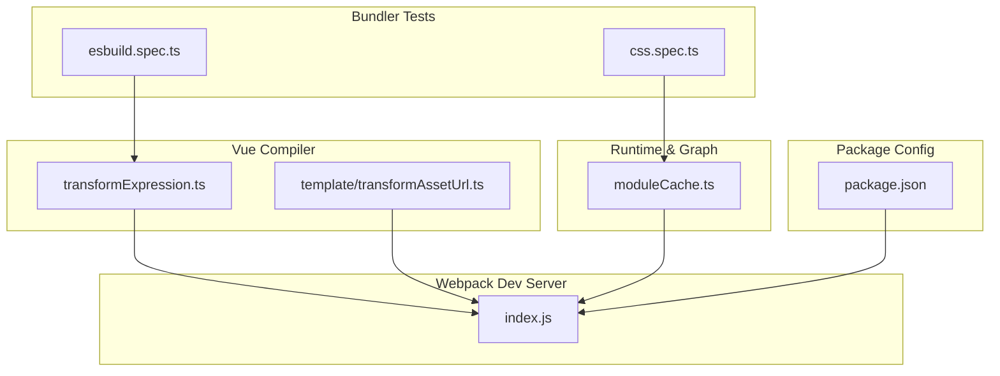
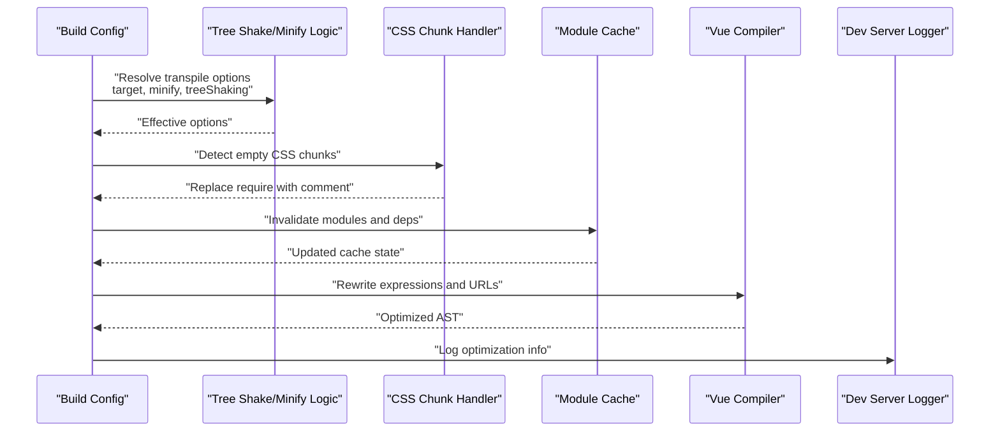
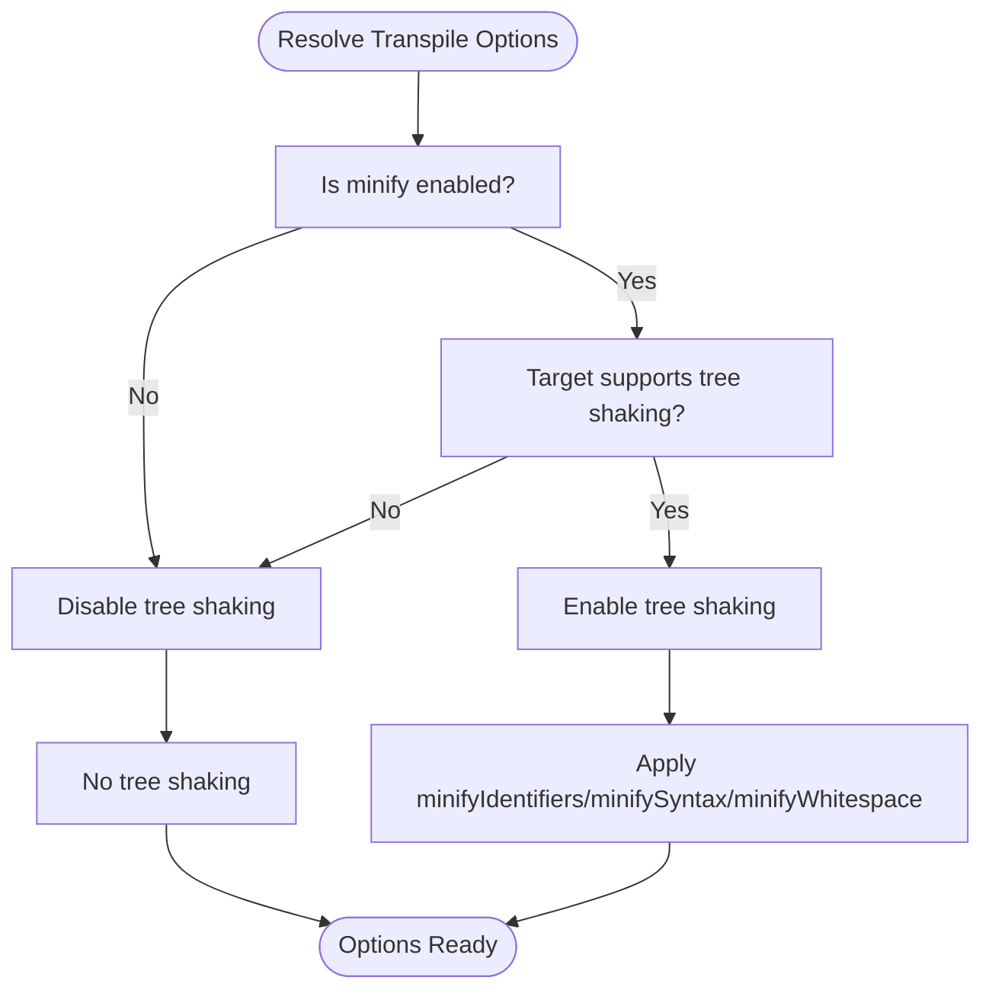
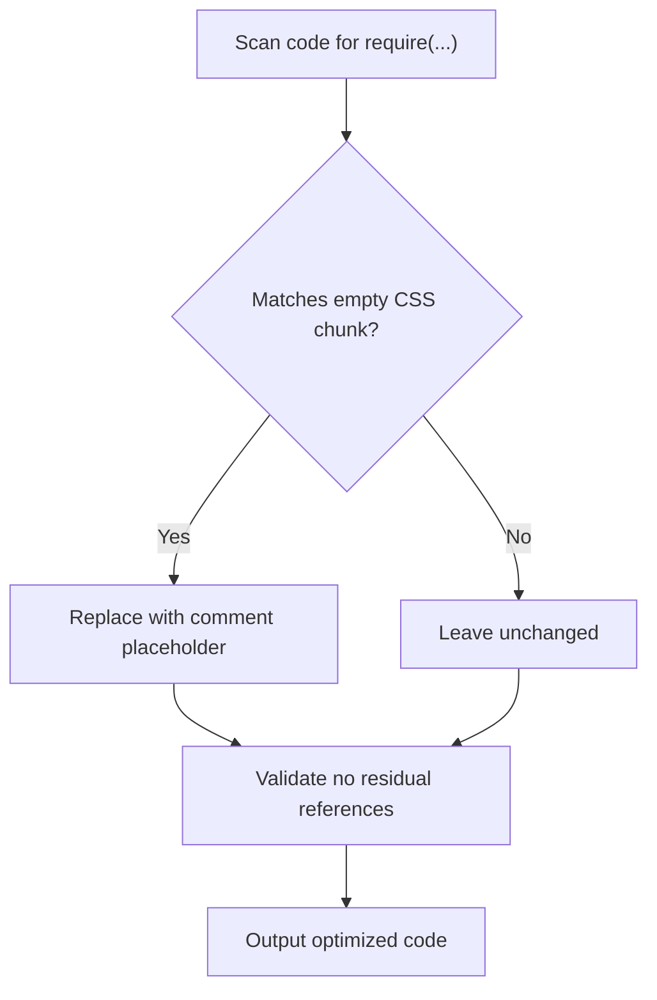
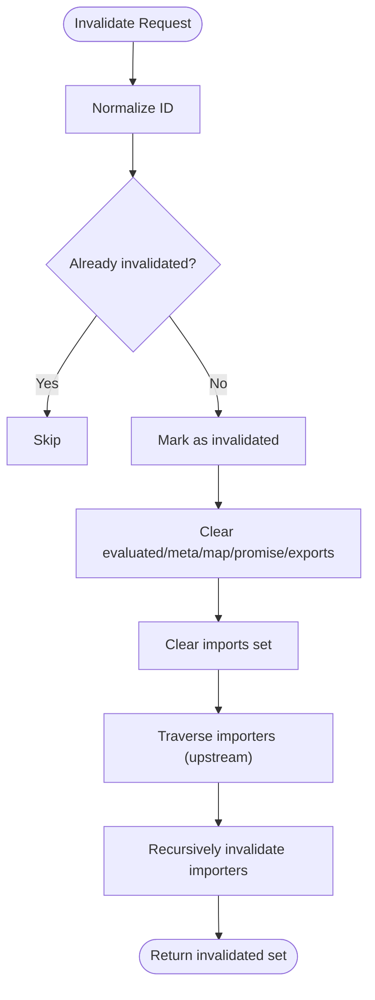
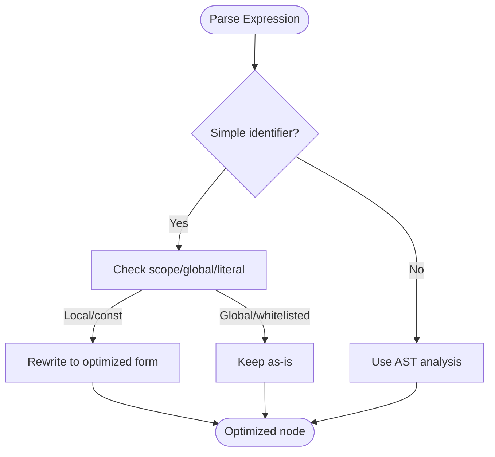
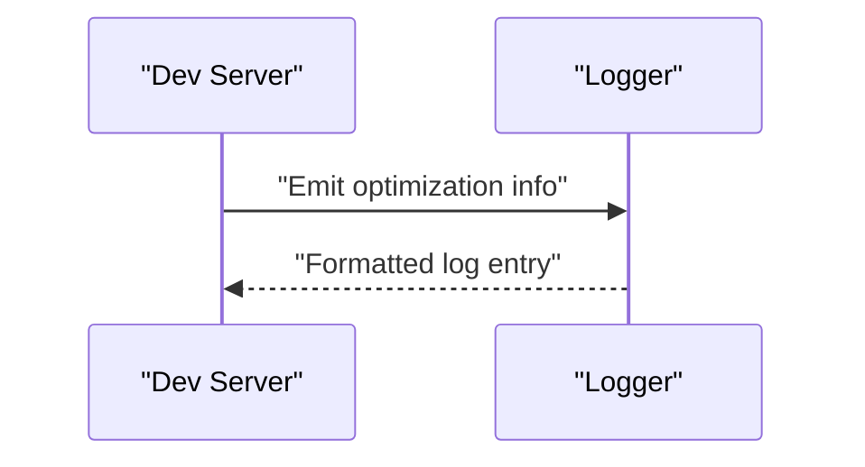
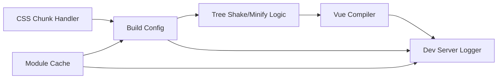

# Optimization and Performance

<cite>
**Referenced Files in This Document**
- [esbuild.spec.ts](file://source:esbuild.spec.ts)
- [moduleCache.ts](file://source:moduleCache.ts)
- [css.spec.ts](file://source:css.spec.ts)
- [transformExpression.ts](file://source:transformExpression.ts)
- [template/transformAssetUrl.ts](file://source:template/transformAssetUrl.ts)
- [index.js](file://source:index.js)
- [package.json](file://source:package.json)
</cite>

## Table of Contents
1. [Introduction](#introduction)
2. [Project Structure](#project-structure)
3. [Core Components](#core-components)
4. [Architecture Overview](#architecture-overview)
5. [Detailed Component Analysis](#detailed-component-analysis)
6. [Dependency Analysis](#dependency-analysis)
7. [Performance Considerations](#performance-considerations)
8. [Troubleshooting Guide](#troubleshooting-guide)
9. [Conclusion](#conclusion)
10. [Appendices](#appendices)

## Introduction
This document explains Webpack’s optimization techniques and performance improvements with a focus on tree shaking, dead code elimination, and module concatenation strategies. It also covers code splitting, chunk optimization, and bundle analysis tools. Practical guidance is provided for performance tuning via parallel processing, caching strategies, and incremental builds, along with production deployment optimizations. The content synthesizes real-world patterns and behaviors present in the repository’s bundler-related tests and source files.

## Project Structure
The repository includes a small subset of files relevant to bundling and optimization. The most relevant sources for this document are:
- Bundler and transpiler configuration tests for tree shaking and minification behavior
- Module graph and cache invalidation logic for incremental rebuilds
- CSS chunk handling and empty chunk replacement logic
- Vue compiler transforms that influence bundler compatibility and optimization

**Diagram sources**
- [esbuild.spec.ts](file://source:esbuild.spec.ts)
- [css.spec.ts](file://source:css.spec.ts)
- [moduleCache.ts](file://source:moduleCache.ts)
- [transformExpression.ts](file://source:transformExpression.ts)
- [template/transformAssetUrl.ts](file://source:template/transformAssetUrl.ts)
- [index.js](file://source:index.js)
- [package.json](file://source:package.json)

**Section sources**
- [esbuild.spec.ts](file://source:esbuild.spec.ts)
- [css.spec.ts](file://source:css.spec.ts)
- [moduleCache.ts](file://source:moduleCache.ts)
- [transformExpression.ts](file://source:transformExpression.ts)
- [template/transformAssetUrl.ts](file://source:template/transformAssetUrl.ts)
- [index.js](file://source:index.js)
- [package.json](file://source:package.json)

## Core Components
- Tree shaking and minification configuration: Verified via tests that enable/disable tree shaking and minification based on build targets and options.
- Empty chunk replacement: Ensures CSS-only chunks are pruned from require chains, reducing runtime overhead.
- Module graph cache invalidation: Supports incremental rebuilds by clearing evaluated state and imports.
- Vue compiler transforms: Adjust expression rewriting and asset URL handling to align with bundler expectations.

Key behaviors:
- Conditional tree shaking and minification flags depending on build mode and library formats.
- Replacement of require calls to empty CSS chunks with comments to avoid loading unnecessary assets.
- Cache invalidation of modules and their dependency trees to support fast incremental updates.
- Special handling for identifiers and require calls to maintain compatibility with bundler environments.

**Section sources**
- [esbuild.spec.ts](file://source:esbuild.spec.ts)
- [css.spec.ts](file://source:css.spec.ts)
- [moduleCache.ts](file://source:moduleCache.ts)
- [transformExpression.ts](file://source:transformExpression.ts)
- [template/transformAssetUrl.ts](file://source:template/transformAssetUrl.ts)

## Architecture Overview
The optimization pipeline integrates configuration-driven decisions with runtime module graph management and Vue-specific transformations. The following diagram maps the relationships among the core components.

**Diagram sources**
- [esbuild.spec.ts](file://source:esbuild.spec.ts)
- [css.spec.ts](file://source:css.spec.ts)
- [moduleCache.ts](file://source:moduleCache.ts)
- [transformExpression.ts](file://source:transformExpression.ts)
- [index.js](file://source:index.js)

## Detailed Component Analysis

### Tree Shaking and Minification Behavior
This component demonstrates how build configuration determines whether tree shaking and minification are enabled. Tests show:
- Tree shaking enabled when minification is configured and targets support it.
- Minification flags adjusted per format (ES modules vs CommonJS) and library builds.
- Explicit disabling of minification disables tree shaking.

**Diagram sources**
- [esbuild.spec.ts](file://source:esbuild.spec.ts)

**Section sources**
- [esbuild.spec.ts](file://source:esbuild.spec.ts)

### Empty CSS Chunk Replacement
CSS-only chunks can bloat runtime require chains. This component replaces require calls to empty CSS chunks with comments, preserving semantics without loading assets.

**Diagram sources**
- [css.spec.ts](file://source:css.spec.ts)

**Section sources**
- [css.spec.ts](file://source:css.spec.ts)

### Module Graph Cache Invalidation
Incremental builds rely on invalidating modules and their dependency trees. The cache manager clears evaluated state, metadata, and imports, and recursively invalidates upstream importers and downstream dependents.

**Diagram sources**
- [moduleCache.ts](file://source:moduleCache.ts)

**Section sources**
- [moduleCache.ts](file://source:moduleCache.ts)

### Vue Compiler Expression Rewriting and Asset URL Handling
The Vue compiler adjusts expression rewriting and asset URL generation to align with bundler expectations. Notably:
- Fast-path rewriting for simple identifiers and constants.
- Special handling to avoid prefixing certain globals (e.g., require) to preserve bundler compatibility.
- Asset URL hoisting and hashing to optimize static asset references.

**Diagram sources**
- [transformExpression.ts](file://source:transformExpression.ts)

**Section sources**
- [transformExpression.ts](file://source:transformExpression.ts)
- [template/transformAssetUrl.ts](file://source:template/transformAssetUrl.ts)

### Webpack Dev Server Logging
The dev server logger integrates with the bundler ecosystem to surface optimization-related logs and diagnostics during development.

**Diagram sources**
- [index.js](file://source:index.js)

**Section sources**
- [index.js](file://source:index.js)

## Dependency Analysis
The following diagram highlights how the core components depend on each other and external systems.

**Diagram sources**
- [esbuild.spec.ts](file://source:esbuild.spec.ts)
- [css.spec.ts](file://source:css.spec.ts)
- [moduleCache.ts](file://source:moduleCache.ts)
- [transformExpression.ts](file://source:transformExpression.ts)
- [index.js](file://source:index.js)

**Section sources**
- [esbuild.spec.ts](file://source:esbuild.spec.ts)
- [css.spec.ts](file://source:css.spec.ts)
- [moduleCache.ts](file://source:moduleCache.ts)
- [transformExpression.ts](file://source:transformExpression.ts)
- [index.js](file://source:index.js)

## Performance Considerations
- Conditional tree shaking and minification: Enable tree shaking only when beneficial for the target environment; disable for non-production builds to speed iteration.
- Empty chunk pruning: Remove CSS-only chunks from require chains to minimize runtime overhead.
- Incremental builds: Use module cache invalidation to limit reprocessing to affected modules and their dependency subtrees.
- Vue-specific optimizations: Leverage expression rewriting and asset URL hoisting to reduce runtime work and improve caching.
- Parallelization: While not explicitly shown here, modern bundlers commonly parallelize parsing, transforming, and minification stages; ensure CPU-bound tasks are distributed across cores.
- Caching: Persist transformed modules and sourcemaps to disk to accelerate cold starts and CI runs.
- Incremental builds: Invalidate only changed modules and their importers/importees to reduce rebuild scope.

[No sources needed since this section provides general guidance]

## Troubleshooting Guide
- Unexpected module loading: If CSS-only chunks appear in require chains, confirm empty chunk replacement is applied and no residual references remain.
- Slow incremental rebuilds: Verify module cache invalidation is targeting the correct IDs and not triggering full rebuilds unnecessarily.
- Vue template issues: Ensure expression rewriting and asset URL handling are compatible with bundler expectations; avoid rewriting globals like require.
- Dev server logs: Use the dev server logger to diagnose optimization-related messages and confirm effective configuration.

**Section sources**
- [css.spec.ts](file://source:css.spec.ts)
- [moduleCache.ts](file://source:moduleCache.ts)
- [transformExpression.ts](file://source:transformExpression.ts)
- [index.js](file://source:index.js)

## Conclusion
By combining configuration-driven tree shaking and minification, efficient CSS chunk handling, and robust module graph cache invalidation, the system achieves strong optimization outcomes. Vue compiler adjustments further enhance bundler compatibility and performance. Together, these patterns support fast incremental builds, smaller bundles, and reliable development feedback loops.

[No sources needed since this section summarizes without analyzing specific files]

## Appendices
- Example configuration references:
  - Tree shaking and minification flags: [esbuild.spec.ts](file://source:esbuild.spec.ts)
  - Empty CSS chunk replacement: [css.spec.ts](file://source:css.spec.ts)
  - Module cache invalidation: [moduleCache.ts](file://source:moduleCache.ts)
  - Vue compiler transforms: [transformExpression.ts](file://source:transformExpression.ts), [template/transformAssetUrl.ts](file://source:template/transformAssetUrl.ts)
  - Dev server logging: [index.js](file://source:index.js)
  - Package metadata: [package.json](file://source:package.json)

[No sources needed since this section aggregates references without analyzing specific files]