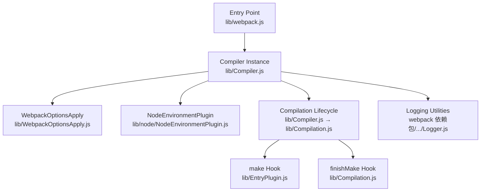
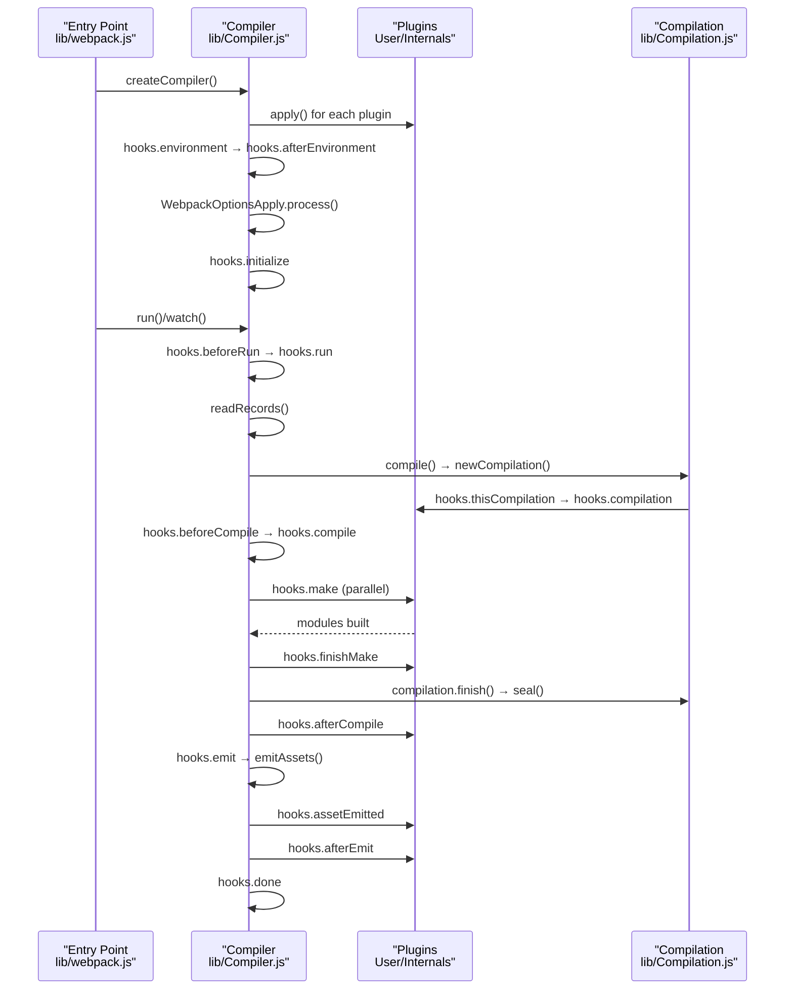
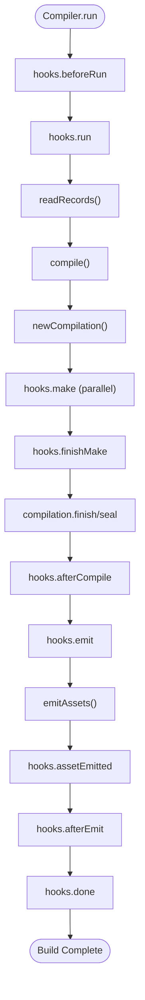
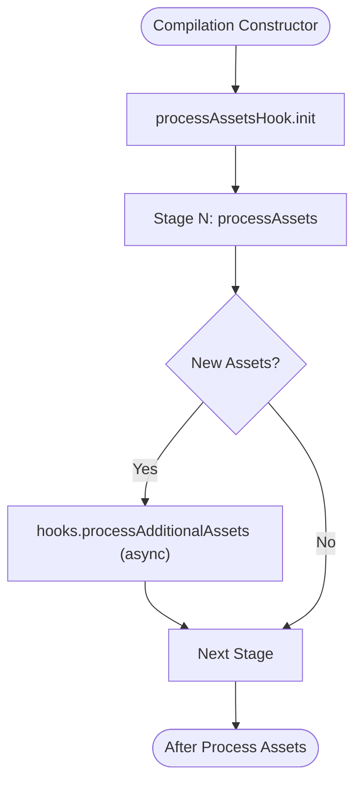
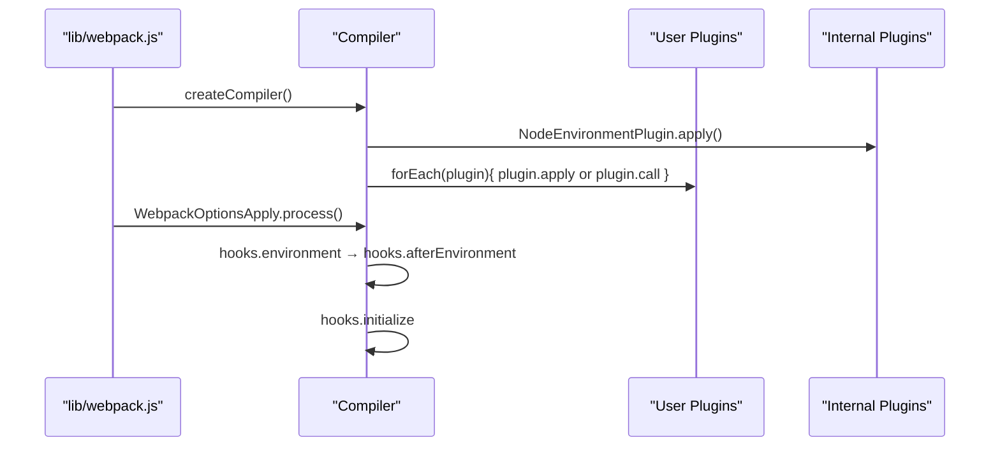
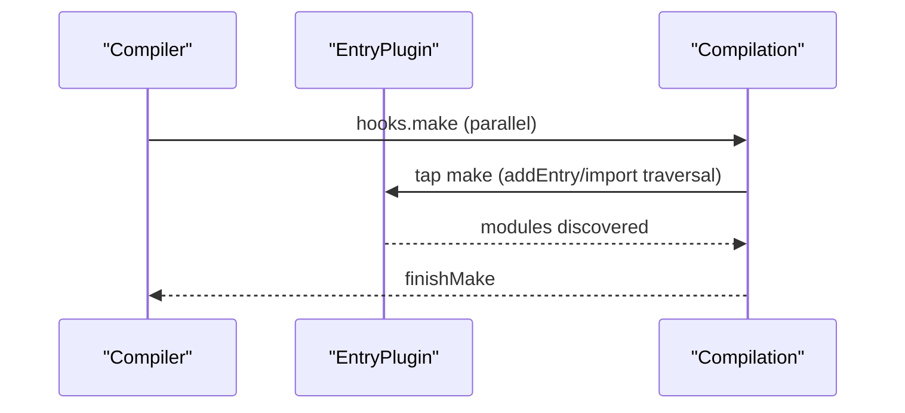
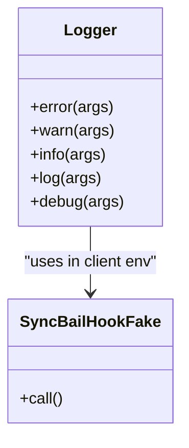
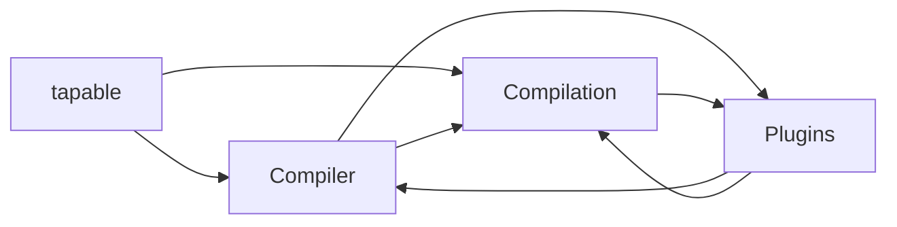

# Plugin System Architecture

<cite>
**Referenced Files in This Document**
- [webpack.js](file://源码学习/webpack@5.68.0/lib/webpack.js)
- [Compiler.js](file://源码学习/webpack@5.68.0/lib/Compiler.js)
- [Compilation.js](file://源码学习/webpack@5.68.0/lib/Compilation.js)
- [NodeEnvironmentPlugin.js](file://源码学习/webpack@5.68.0/lib/node/NodeEnvironmentPlugin.js)
- [WebpackOptionsApply.js](file://源码学习/webpack@5.68.0/lib/WebpackOptionsApply.js)
- [EntryPlugin.js](file://源码学习/webpack@5.68.0/lib/EntryPlugin.js)
- [EntryOptionPlugin.js](file://源码学习/webpack@5.68.0/lib/EntryOptionPlugin.js)
- [SyncBailHookFake.js](file://源码学习/webpack@5.68.0/webpack 依赖包/webpack-dev-server/client/modules/logger/SyncBailHookFake.js)
- [Logger.js](file://源码学习/webpack@5.68.0/webpack 依赖包/webpack-dev-server/client/modules/logger/Logger.js)
</cite>

## Table of Contents
1. [Introduction](#introduction)
2. [Project Structure](#project-structure)
3. [Core Components](#core-components)
4. [Architecture Overview](#architecture-overview)
5. [Detailed Component Analysis](#detailed-component-analysis)
6. [Dependency Analysis](#dependency-analysis)
7. [Performance Considerations](#performance-considerations)
8. [Troubleshooting Guide](#troubleshooting-guide)
9. [Conclusion](#conclusion)
10. [Appendices](#appendices)

## Introduction
This document explains Webpack’s plugin system architecture with a focus on the hook-based extensibility model. It covers how plugins integrate with the compilation lifecycle via tapable hooks, how the Compiler and Compilation orchestrate plugin execution, and how plugin ordering and chaining work. It also provides practical guidance for plugin development, including recommended patterns, best practices, and debugging techniques.

## Project Structure
Webpack’s plugin system spans several core modules:
- Entry point and initialization: orchestrates plugin registration and environment setup
- Compiler: defines top-level hooks and controls the build lifecycle
- Compilation: defines compilation-level hooks and manages module building
- Internal plugins: register hooks for features like entry resolution and environment setup
- Logging utilities: demonstrate tapable usage patterns for hooks

**Diagram sources**
- [webpack.js:67-120](file://源码学习/webpack@5.68.0/lib/webpack.js#L67-L120)
- [Compiler.js:124-244](file://源码学习/webpack@5.68.0/lib/Compiler.js#L124-L244)
- [Compilation.js:465-600](file://源码学习/webpack@5.68.0/lib/Compilation.js#L465-L600)
- [NodeEnvironmentPlugin.js](file://源码学习/webpack@5.68.0/lib/node/NodeEnvironmentPlugin.js)
- [WebpackOptionsApply.js](file://源码学习/webpack@5.68.0/lib/WebpackOptionsApply.js)
- [EntryPlugin.js](file://源码学习/webpack@5.68.0/lib/EntryPlugin.js)
- [Logger.js](file://源码学习/webpack@5.68.0/webpack 依赖包/webpack-dev-server/client/modules/logger/Logger.js)

**Section sources**
- [webpack.js:67-120](file://源码学习/webpack@5.68.0/lib/webpack.js#L67-L120)
- [Compiler.js:124-244](file://源码学习/webpack@5.68.0/lib/Compiler.js#L124-L244)
- [Compilation.js:465-600](file://源码学习/webpack@5.68.0/lib/Compilation.js#L465-L600)

## Core Components
- Compiler: central orchestrator with lifecycle hooks for environment setup, compilation phases, and asset emission. It exposes hooks for initialization, environment, compilation creation, module building, sealing, and completion.
- Compilation: encapsulates per-compilation work, including module building, optimization, chunking, and asset processing. It defines hooks for asset processing stages and additional asset handling.
- Plugins: registered during initialization and during internal plugin processing. They attach to Compiler and/or Compilation hooks to extend behavior.

Key hook categories:
- Compiler-level hooks: environment, initialization, compilation creation, module building, sealing, asset emission, and completion.
- Compilation-level hooks: asset processing pipeline and additional asset handling.

**Section sources**
- [Compiler.js:124-244](file://源码学习/webpack@5.68.0/lib/Compiler.js#L124-L244)
- [Compilation.js:476-594](file://源码学习/webpack@5.68.0/lib/Compilation.js#L476-L594)

## Architecture Overview
The plugin system is built on tapable, which provides typed hooks (Sync, AsyncSeries, AsyncParallel, etc.). Plugins register handlers to hooks exposed by Compiler and Compilation. The lifecycle is orchestrated by Compiler.run and Compilation phases.

**Diagram sources**
- [webpack.js:67-120](file://源码学习/webpack@5.68.0/lib/webpack.js#L67-L120)
- [Compiler.js:472-604](file://源码学习/webpack@5.68.0/lib/Compiler.js#L472-L604)
- [Compiler.js:1244-1327](file://源码学习/webpack@5.68.0/lib/Compiler.js#L1244-L1327)
- [Compilation.js:476-594](file://源码学习/webpack@5.68.0/lib/Compilation.js#L476-L594)

## Detailed Component Analysis

### Compiler Hooks and Lifecycle
- Environment and initialization: plugins can observe environment setup and post-initialization steps.
- Compilation orchestration: Compiler coordinates creation of factories, triggers compilation phases, and manages asset emission.
- Asset emission: Compiler emits assets and notifies plugins via dedicated hooks.

**Diagram sources**
- [Compiler.js:472-604](file://源码学习/webpack@5.68.0/lib/Compiler.js#L472-L604)
- [Compiler.js:1244-1327](file://源码学习/webpack@5.68.0/lib/Compiler.js#L1244-L1327)

**Section sources**
- [Compiler.js:124-244](file://源码学习/webpack@5.68.0/lib/Compiler.js#L124-L244)
- [Compiler.js:472-604](file://源码学习/webpack@5.68.0/lib/Compiler.js#L472-L604)
- [Compiler.js:1244-1327](file://源码学习/webpack@5.68.0/lib/Compiler.js#L1244-L1327)

### Compilation Hooks and Asset Pipeline
- Asset processing: Compilation exposes a structured pipeline for asset processing with interception and additional asset handling.
- Additional assets: Plugins can register taps that process newly created assets after each stage.

**Diagram sources**
- [Compilation.js:476-594](file://源码学习/webpack@5.68.0/lib/Compilation.js#L476-L594)

**Section sources**
- [Compilation.js:476-594](file://源码学习/webpack@5.68.0/lib/Compilation.js#L476-L594)

### Plugin Registration Patterns
- Function-style plugins: invoked with call(compiler, compiler).
- Object-style plugins: apply(compiler) is invoked.
- Internal plugins: registered by WebpackOptionsApply and NodeEnvironmentPlugin during initialization.

**Diagram sources**
- [webpack.js:67-120](file://源码学习/webpack@5.68.0/lib/webpack.js#L67-L120)
- [NodeEnvironmentPlugin.js](file://源码学习/webpack@5.68.0/lib/node/NodeEnvironmentPlugin.js)
- [WebpackOptionsApply.js](file://源码学习/webpack@5.68.0/lib/WebpackOptionsApply.js)

**Section sources**
- [webpack.js:67-120](file://源码学习/webpack@5.68.0/lib/webpack.js#L67-L120)

### Entry Resolution and make Hook
- EntryPlugin registers to the make hook to initiate entry module building.
- EntryOptionPlugin influences entry handling prior to make.

**Diagram sources**
- [Compiler.js:1272-1282](file://源码学习/webpack@5.68.0/lib/Compiler.js#L1272-L1282)
- [EntryPlugin.js](file://源码学习/webpack@5.68.0/lib/EntryPlugin.js)
- [EntryOptionPlugin.js](file://源码学习/webpack@5.68.0/lib/EntryOptionPlugin.js)

**Section sources**
- [Compiler.js:1272-1282](file://源码学习/webpack@5.68.0/lib/Compiler.js#L1272-L1282)
- [EntryPlugin.js](file://源码学习/webpack@5.68.0/lib/EntryPlugin.js)
- [EntryOptionPlugin.js](file://源码学习/webpack@5.68.0/lib/EntryOptionPlugin.js)

### Logging and Tapable Usage Pattern
- Logging demonstrates tapable usage with SyncBailHook and Logger composition.
- A client-side stub shows a SyncBailHook pattern used in environments where the real tapable is not available.

**Diagram sources**
- [Logger.js:174-215](file://源码学习/webpack@5.68.0/webpack 依赖包/webpack-dev-server/client/modules/logger/Logger.js#L174-L215)
- [SyncBailHookFake.js:16-20](file://源码学习/webpack@5.68.0/webpack 依赖包/webpack-dev-server/client/modules/logger/SyncBailHookFake.js#L16-L20)

**Section sources**
- [Logger.js:174-215](file://源码学习/webpack@5.68.0/webpack 依赖包/webpack-dev-server/client/modules/logger/Logger.js#L174-L215)
- [SyncBailHookFake.js:16-20](file://源码学习/webpack@5.68.0/webpack 依赖包/webpack-dev-server/client/modules/logger/SyncBailHookFake.js#L16-L20)

## Dependency Analysis
- Compiler depends on tapable for hook definitions and on Compilation for per-build orchestration.
- Compilation depends on tapable for asset-processing hooks and on Module/Chunk subsystems for build work.
- Plugins depend on Compiler and Compilation hooks to extend behavior.

**Diagram sources**
- [Compiler.js:10-15](file://源码学习/webpack@5.68.0/lib/Compiler.js#L10-L15)
- [Compilation.js:49-57](file://源码学习/webpack@5.68.0/lib/Compilation.js#L49-L57)

**Section sources**
- [Compiler.js:10-15](file://源码学习/webpack@5.68.0/lib/Compiler.js#L10-L15)
- [Compilation.js:49-57](file://源码学习/webpack@5.68.0/lib/Compilation.js#L49-L57)

## Performance Considerations
- Prefer AsyncParallelHook for independent tasks (e.g., make) to maximize concurrency.
- Use SyncBailHook judiciously for early exits (e.g., shouldEmit).
- Minimize heavy synchronous work in hot paths; leverage async hooks for I/O-bound tasks.
- Avoid excessive asset duplication; rely on Compilation’s asset processing pipeline to detect and deduplicate.

## Troubleshooting Guide
- Hook ordering: verify plugin registration order; later taps run after earlier ones for sequential hooks.
- Conflict resolution: use hook-specific guards (e.g., shouldEmit) or conditional logic to prevent duplicate work.
- Debugging: instrument Compiler and Compilation hooks with logs; use Logger to capture timing and state transitions.
- Common pitfalls: mixing sync and async incorrectly, forgetting to await async hooks, and not handling errors in tap callbacks.

## Conclusion
Webpack’s plugin system leverages tapable to provide a robust, event-driven architecture. Compiler and Compilation expose carefully designed hooks that enable plugins to participate in every phase of the build lifecycle. By following established patterns—registering at appropriate times, using the right hook types, and structuring plugin logic around the compilation phases—you can build reliable, maintainable plugins that integrate seamlessly with Webpack.

## Appendices

### Plugin Development Patterns
- Function-style plugin: call(compiler, compiler)
- Object-style plugin: apply(compiler)
- Compilation-phase plugin: tap compilation hooks for asset processing and module transformations
- Environment plugin: tap environment and afterEnvironment for setup

**Section sources**
- [webpack.js:82-91](file://源码学习/webpack@5.68.0/lib/webpack.js#L82-L91)
- [NodeEnvironmentPlugin.js](file://源码学习/webpack@5.68.0/lib/node/NodeEnvironmentPlugin.js)

### Example Hook Usage Scenarios
- Early termination: use shouldEmit to short-circuit emission
- Parallel work: use make for concurrent entry/module discovery
- Asset post-processing: use processAssets and processAdditionalAssets for asset transformations
- Completion reporting: use done for final statistics and cleanup

**Section sources**
- [Compiler.js:134-135](file://源码学习/webpack@5.68.0/lib/Compiler.js#L134-L135)
- [Compiler.js:198-199](file://源码学习/webpack@5.68.0/lib/Compiler.js#L198-L199)
- [Compilation.js:476-594](file://源码学习/webpack@5.68.0/lib/Compilation.js#L476-L594)