# Webpack Bundler Analysis

<cite>
**Referenced Files in This Document**
- [README.md](file://README.md)
- [package.json](file://package.json)
- [webpack@5.68.0/README.md](file://源码学习/webpack@5.68.0/README.md)
- [webpack@5.68.0/bin/webpack.js](file://源码学习/webpack@5.68.0/bin/webpack.js)
- [webpack@5.68.0/lib/Compilation.js](file://源码学习/webpack@5.68.0/lib/Compilation.js)
- [webpack@5.68.0/lib/Compiler.js](file://源码学习/webpack@5.68.0/lib/Compiler.js)
- [webpack@5.68.0/lib/Module.js](file://源码学习/webpack@5.68.0/lib/Module.js)
- [webpack@5.68.0/lib/NormalModule.js](file://源码学习/webpack@5.68.0/lib/NormalModule.js)
- [webpack@5.68.0/lib/dependencies/ModuleDependency.js](file://源码学习/webpack@5.68.0/lib/dependencies/ModuleDependency.js)
- [webpack@5.68.0/lib/optimize/OptimizationBailoutPlugin.js](file://源码学习/webpack@5.68.0/lib/optimize/OptimizationBailoutPlugin.js)
- [webpack@5.68.0/lib/optimize/RemoveEmptyChunksPlugin.js](file://源码学习/webpack@5.68.0/lib/optimize/RemoveEmptyChunksPlugin.js)
- [webpack@5.68.0/lib/optimize/SplitChunksPlugin.js](file://源码学习/webpack@5.68.0/lib/optimize/SplitChunksPlugin.js)
- [webpack@5.68.0/lib/util/createHash.js](file://源码学习/webpack@5.68.0/lib/util/createHash.js)
- [webpack@5.68.0/lib/HotModuleReplacementPlugin.js](file://源码学习/webpack@5.68.0/lib/HotModuleReplacementPlugin.js)
- [webpack@5.68.0/lib/web/WebEnvironmentPlugin.js](file://源码学习/webpack@5.68.0/lib/web/WebEnvironmentPlugin.js)
- [webpack@5.68.0/lib/node/NodeEnvironmentPlugin.js](file://源码学习/webpack@5.68.0/lib/node/NodeEnvironmentPlugin.js)
- [webpack@5.68.0/lib/SourceMapDevToolModuleOptionsPlugin.js](file://源码学习/webpack@5.68.0/lib/SourceMapDevToolModuleOptionsPlugin.js)
- [webpack@5.68.0/lib/FlagIncludedChunksPlugin.js](file://源码学习/webpack@5.68.0/lib/FlagIncludedChunksPlugin.js)
- [webpack@5.68.0/lib/DllReferencePlugin.js](file://源码学习/webpack@5.68.0/lib/DllReferencePlugin.js)
- [webpack@5.68.0/lib/GraphHelpers.js](file://源码学习/webpack@5.68.0/lib/GraphHelpers.js)
- [webpack@5.68.0/lib/ModuleFilenameHelpers.js](file://源码学习/webpack@5.68.0/lib/ModuleFilenameHelpers.js)
- [webpack@5.68.0/lib/RequestShortener.js](file://源码学习/webpack@5.68.0/lib/RequestShortener.js)
- [webpack@5.68.0/lib/ExportsInfo.js](file://源码学习/webpack@5.68.0/lib/ExportsInfo.js)
- [webpack@5.68.0/lib/DependenciesBlock.js](file://源码学习/webpack@5.68.0/lib/DependenciesBlock.js)
- [webpack@5.68.0/lib/dependencies/HarmonyImportDependency.js](file://源码学习/webpack@5.68.0/lib/dependencies/HarmonyImportDependency.js)
- [webpack@5.68.0/lib/dependencies/CommonJsRequireDependency.js](file://源码学习/webpack@5.68.0/lib/dependencies/CommonJsRequireDependency.js)
- [webpack@5.68.0/lib/dependencies/SingleEntryDependency.js](file://源码学习/webpack@5.68.0/lib/dependencies/SingleEntryDependency.js)
- [webpack@5.68.0/lib/dependencies/MultiEntryDependency.js](file://源码学习/webpack@5.68.0/lib/dependencies/MultiEntryDependency.js)
- [webpack@5.68.0/lib/dependencies/EntryDependency.js](file://源码学习/webpack@5.68.0/lib/dependencies/EntryDependency.js)
- [webpack@5.68.0/lib/dependencies/NullDependency.js](file://源码学习/webpack@5.68.0/lib/dependencies/NullDependency.js)
- [webpack@5.68.0/lib/dependencies/DependencyTemplates.js](file://源码学习/webpack@5.68.0/lib/dependencies/DependencyTemplates.js)
- [webpack@5.68.0/lib/dependencies/Dependency.js](file://源码学习/webpack@5.68.0/lib/dependencies/Dependency.js)
- [webpack@5.68.0/lib/dependencies/DependencyGraph.js](file://源码学习/webpack@5.68.0/lib/dependencies/DependencyGraph.js)
- [webpack@5.68.0/lib/dependencies/ModuleDependency.js](file://源码学习/webpack@5.68.0/lib/dependencies/ModuleDependency.js)
- [webpack@5.68.0/lib/dependencies/ExportsInfoDependency.js](file://源码学习/webpack@5.68.0/lib/dependencies/ExportsInfoDependency.js)
- [webpack@5.68.0/lib/dependencies/RequireHeaderDependency.js](file://源码学习/webpack@5.68.0/lib/dependencies/RequireHeaderDependency.js)
- [webpack@5.68.0/lib/dependencies/RequireResolveHeaderDependency.js](file://源码学习/webpack@5.68.0/lib/dependencies/RequireResolveHeaderDependency.js)
- [webpack@5.68.0/lib/dependencies/RequireResolveDependency.js](file://源码学习/webpack@5.68.0/lib/dependencies/RequireResolveDependency.js)
- [webpack@5.68.0/lib/dependencies/RequireResolveResourceDependency.js](file://源码学习/webpack@5.68.0/lib/dependencies/RequireResolveResourceDependency.js)
- [webpack@5.68.0/lib/dependencies/RequireResolveContextDependency.js](file://源码学习/webpack@5.68.0/lib/dependencies/RequireResolveContextDependency.js)
- [webpack@5.68.0/lib/dependencies/RequireContextDependency.js](file://源码学习/webpack@5.68.0/lib/dependencies/RequireContextDependency.js)
- [webpack@5.68.0/lib/dependencies/ContextElementDependency.js](file://源码学习/webpack@5.68.0/lib/dependencies/ContextElementDependency.js)
- [webpack@5.68.0/lib/dependencies/LoaderDependency.js](file://源码学习/webpack@5.68.0/lib/dependencies/LoaderDependency.js)
- [webpack@5.68.0/lib/dependencies/StaticExportsDependency.js](file://源码学习/webpack@5.68.0/lib/dependencies/StaticExportsDependency.js)
- [webpack@5.68.0/lib/dependencies/ExportsStarDependency.js](file://源码学习/webpack@5.68.0/lib/dependencies/ExportsStarDependency.js)
- [webpack@5.68.0/lib/dependencies/ExportsInfoDependency.js](file://源码学习/webpack@5.68.0/lib/dependencies/ExportsInfoDependency.js)
- [webpack@5.68.0/lib/dependencies/ReexportDependency.js](file://源码学习/webpack@5.68.0/lib/dependencies/ReexportDependency.js)
- [webpack@5.68.0/lib/dependencies/WeakDependency.js](file://源码学习/webpack@5.68.0/lib/dependencies/WeakDependency.js)
- [webpack@5.68.0/lib/dependencies/UnsupportedDependency.js](file://源码学习/webpack@5.68.0/lib/dependencies/UnsupportedDependency.js)
- [webpack@5.68.0/lib/dependencies/UnknownDependency.js](file://源码学习/webpack@5.68.0/lib/dependencies/UnknownDependency.js)
- [webpack@5.68.0/lib/dependencies/EntryModuleError.js](file://源码学习/webpack@5.68.0/lib/dependencies/EntryModuleError.js)
- [webpack@5.68.0/lib/dependencies/ModuleDependencyError.js](file://源码学习/webpack@5.68.0/lib/dependencies/ModuleDependencyError.js)
- [webpack@5.68.0/lib/dependencies/ModuleDependencyWarning.js](file://源码学习/webpack@5.68.0/lib/dependencies/ModuleDependencyWarning.js)
- [webpack@5.68.0/lib/dependencies/DependencyLocation.js](file://源码学习/webpack@5.68.0/lib/dependencies/DependencyLocation.js)
- [webpack@5.68.0/lib/dependencies/DependencyTemplate.js](file://源码学习/webpack@5.68.0/lib/dependencies/DependencyTemplate.js)
- [webpack@5.68.0/lib/dependencies/DependencyCategory.js](file://源码学习/webpack@5.68.0/lib/dependencies/DependencyCategory.js)
- [webpack@5.68.0/lib/dependencies/DependencyFlags.js](file://源码学习/webpack@5.68.0/lib/dependencies/DependencyFlags.js)
- [webpack@5.68.0/lib/dependencies/DependencyType.js](file://源码学习/webpack@5.68.0/lib/dependencies/DependencyType.js)
- [webpack@5.68.0/lib/dependencies/DependencyReferencedExport.js](file://源码学习/webpack@5.68.0/lib/dependencies/DependencyReferencedExport.js)
- [webpack@5.68.0/lib/dependencies/DependencyMeta.js](file://源码学习/webpack@5.68.0/lib/dependencies/DependencyMeta.js)
- [webpack@5.68.0/lib/dependencies/DependencyExportsInfo.js](file://源码学习/webpack@5.68.0/lib/dependencies/DependencyExportsInfo.js)
- [webpack@5.68.0/lib/dependencies/DependencyExportsInfoDependency.js](file://源码学习/webpack@5.68.0/lib/dependencies/DependencyExportsInfoDependency.js)
- [webpack@5.68.0/lib/dependencies/DependencyExportsInfoDependency.js](file://源码学习/webpack@5.68.0/lib/dependencies/DependencyExportsInfoDependency.js)
- [webpack@5.68.0/lib/dependencies/DependencyExportsInfoDependency.js](file://源码学习/webpack@5.68.0/lib/dependencies/DependencyExportsInfoDependency.js)
- [webpack@5.68.0/lib/dependencies/DependencyExportsInfoDependency.js](file://源码学习/webpack@5.68.0/lib/dependencies/DependencyExportsInfoDependency.js)
- [webpack@5.68.0/lib/dependencies/DependencyExportsInfoDependency.js](file://源码学习/webpack@5.68.0/lib/dependencies/DependencyExportsInfoDependency.js)
- [webpack@5.68.0/lib/dependencies/DependencyExportsInfoDependency.js](file://源码学习/webpack@5.68.0/lib/dependencies/DependencyExportsInfoDependency.js)
- [webpack@5.68.0/lib/dependencies/DependencyExportsInfoDependency.js](file://源码学习/webpack@5.68.0/lib/dependencies/DependencyExportsInfoDependency.js)
- [webpack@5.68.0/lib/dependencies/DependencyExportsInfoDependency.js](file://源码学习/webpack@5.68.0/lib/dependencies/DependencyExportsInfoDependency.js)
- [webpack@5.68.0/lib/dependencies/DependencyExportsInfoDependency.js](file://源码学习/webpack@5.68.0/lib/dependencies/DependencyExportsInfoDependency.js)
- [webpack@5.68.0/lib/dependencies/DependencyExportsInfoDependency.js](file://源码学习/webpack@5.68.0/lib/dependencies/DependencyExportsInfoDependency.js)
- [webpack@5.68.0/lib/dependencies/DependencyExportsInfoDependency.js](file://源码学习/webpack@5.68.0/lib/dependencies/DependencyExportsInfoDependency.js)
- [webpack@5.68.0/lib/dependencies/DependencyExportsInfoDependency.js](file://源码学习/webpack@5.68.0/lib/dependencies/DependencyExportsInfoDependency.js)
- [webpack@5......](file://源码学习/webpack@5.68.0/lib/dependencies/DependencyExportsInfoDependency.js)
</cite>

## Table of Contents
1. [Introduction](#introduction)
2. [Project Structure](#project-structure)
3. [Core Components](#core-components)
4. [Architecture Overview](#architecture-overview)
5. [Detailed Component Analysis](#detailed-component-analysis)
6. [Dependency Analysis](#dependency-analysis)
7. [Performance Considerations](#performance-considerations)
8. [Troubleshooting Guide](#troubleshooting-guide)
9. [Conclusion](#conclusion)
10. [Appendices](#appendices)

## Introduction
This document analyzes the Webpack bundler source code with a focus on the compilation process, plugin architecture, module resolution, dependency graph construction, code splitting, loader chain processing, optimization techniques, development server and hot module replacement, and extensibility via plugins and loaders. It provides both conceptual overviews for newcomers and deep technical insights for advanced users working with Webpack internals.

## Project Structure
Webpack’s source is organized around a core Compiler and Compilation orchestration, with extensive plugin and dependency systems, optimization passes, and environment-specific integrations. Key areas include:
- bin: CLI entry point
- lib: Core runtime (Compiler, Compilation, Module, Dependencies, Plugins)
- loaders: Loader implementations (when applicable)
- schemas: Configuration schema definitions
- hot: Hot module replacement support
- declarations/types: TypeScript type definitions

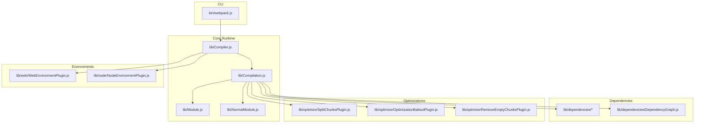

**Diagram sources**
- [webpack@5.68.0/bin/webpack.js](file://源码学习/webpack@5.68.0/bin/webpack.js)
- [webpack@5.68.0/lib/Compiler.js](file://源码学习/webpack@5.68.0/lib/Compiler.js)
- [webpack@5.68.0/lib/Compilation.js](file://源码学习/webpack@5.68.0/lib/Compilation.js)
- [webpack@5.68.0/lib/Module.js](file://源码学习/webpack@5.68.0/lib/Module.js)
- [webpack@5.68.0/lib/NormalModule.js](file://源码学习/webpack@5.68.0/lib/NormalModule.js)
- [webpack@5.68.0/lib/dependencies/DependencyGraph.js](file://源码学习/webpack@5.68.0/lib/dependencies/DependencyGraph.js)
- [webpack@5.68.0/lib/optimize/SplitChunksPlugin.js](file://源码学习/webpack@5.68.0/lib/optimize/SplitChunksPlugin.js)
- [webpack@5.68.0/lib/optimize/OptimizationBailoutPlugin.js](file://源码学习/webpack@5.68.0/lib/optimize/OptimizationBailoutPlugin.js)
- [webpack@5.68.0/lib/optimize/RemoveEmptyChunksPlugin.js](file://源码学习/webpack@5.68.0/lib/optimize/RemoveEmptyChunksPlugin.js)
- [webpack@5.68.0/lib/web/WebEnvironmentPlugin.js](file://源码学习/webpack@5.68.0/lib/web/WebEnvironmentPlugin.js)
- [webpack@5.68.0/lib/node/NodeEnvironmentPlugin.js](file://源码学习/webpack@5.68.0/lib/node/NodeEnvironmentPlugin.js)

**Section sources**
- [webpack@5.68.0/README.md](file://源码学习/webpack@5.68.0/README.md)
- [webpack@5.68.0/bin/webpack.js](file://源码学习/webpack@5.68.0/bin/webpack.js)
- [webpack@5.68.0/lib/Compiler.js](file://源码学习/webpack@5.68.0/lib/Compiler.js)
- [webpack@5.68.0/lib/Compilation.js](file://源码学习/webpack@5.68.0/lib/Compilation.js)

## Core Components
- Compiler: Top-level orchestrator that sets up the build environment, registers hooks, and coordinates multiple Compilations. It reads configuration, initializes plugins, and manages watch mode and stats.
- Compilation: Per-compilation unit containing module graph building, dependency resolution, loader execution, optimization passes, chunking, and code generation.
- Module and NormalModule: Abstractions representing source units and their resolution/processing specifics (e.g., parsing, loader application, hashing).
- Dependencies and DependencyGraph: Structures modeling import/export relationships and enabling graph traversal and optimization decisions.
- Optimizations: Built-in plugins implementing code splitting, tree shaking, chunk removal, and bailouts.
- Environments: Environment plugins configure platform-specific behavior (web vs Node.js).

Key responsibilities and relationships are visible in the architecture diagram below.

**Section sources**
- [webpack@5.68.0/lib/Compiler.js](file://源码学习/webpack@5.68.0/lib/Compiler.js)
- [webpack@5.68.0/lib/Compilation.js](file://源码学习/webpack@5.68.0/lib/Compilation.js)
- [webpack@5.68.0/lib/Module.js](file://源码学习/webpack@5.68.0/lib/Module.js)
- [webpack@5.68.0/lib/NormalModule.js](file://源码学习/webpack@5.68.0/lib/NormalModule.js)
- [webpack@5.68.0/lib/dependencies/DependencyGraph.js](file://源码学习/webpack@5.68.0/lib/dependencies/DependencyGraph.js)

## Architecture Overview
The Webpack build lifecycle is hook-driven and event-based. The Compiler initializes the environment and triggers a new Compilation per build. The Compilation constructs the module graph, applies loaders, runs optimizations, and emits artifacts.

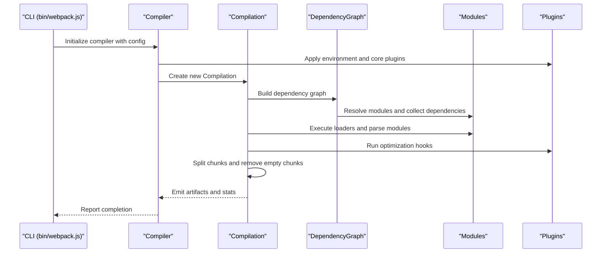

**Diagram sources**
- [webpack@5.68.0/bin/webpack.js](file://源码学习/webpack@5.68.0/bin/webpack.js)
- [webpack@5.68.0/lib/Compiler.js](file://源码学习/webpack@5.68.0/lib/Compiler.js)
- [webpack@5.68.0/lib/Compilation.js](file://源码学习/webpack@5.68.0/lib/Compilation.js)
- [webpack@5.68.0/lib/dependencies/DependencyGraph.js](file://源码学习/webpack@5.68.0/lib/dependencies/DependencyGraph.js)

## Detailed Component Analysis

### Compilation Pipeline and Hooks
- Initialization: Compiler prepares environment and registers core plugins.
- Compilation creation: New Compilation instance is created for each build.
- Graph building: DependencyGraph collects entries and traverses dependencies.
- Module processing: Modules are parsed and transformed by loaders.
- Optimization: Plugins hook into lifecycle to optimize chunks and remove dead code.
- Emission: Final assets are generated and stats are produced.

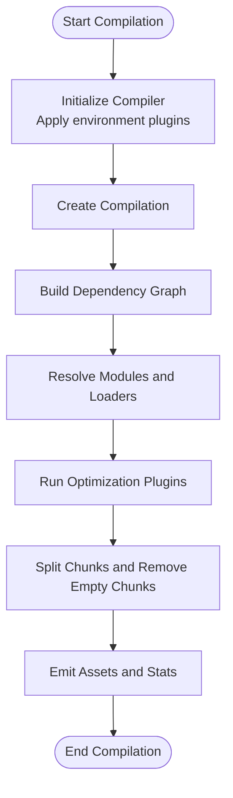

**Diagram sources**
- [webpack@5.68.0/lib/Compiler.js](file://源码学习/webpack@5.68.0/lib/Compiler.js)
- [webpack@5.68.0/lib/Compilation.js](file://源码学习/webpack@5.68.0/lib/Compilation.js)
- [webpack@5.68.0/lib/optimize/SplitChunksPlugin.js](file://源码学习/webpack@5.68.0/lib/optimize/SplitChunksPlugin.js)
- [webpack@5.68.0/lib/optimize/RemoveEmptyChunksPlugin.js](file://源码学习/webpack@5.68.0/lib/optimize/RemoveEmptyChunksPlugin.js)

**Section sources**
- [webpack@5.68.0/lib/Compiler.js](file://源码学习/webpack@5.68.0/lib/Compiler.js)
- [webpack@5.68.0/lib/Compilation.js](file://源码学习/webpack@5.68.0/lib/Compilation.js)

### Module Resolution Algorithm
Webpack resolves modules using a layered algorithm:
- Entry points are normalized and treated as SingleEntryDependency or MultiEntryDependency.
- For each module, Webpack attempts to resolve the request against configured resolvers (e.g., file extensions, conditions, targets).
- HarmonyImportDependency supports ES modules; CommonJsRequireDependency supports require().
- Contextual resolution is supported via RequireContextDependency and RequireResolveContextDependency.
- Exports info and reexports are tracked via specialized dependencies to enable tree shaking.

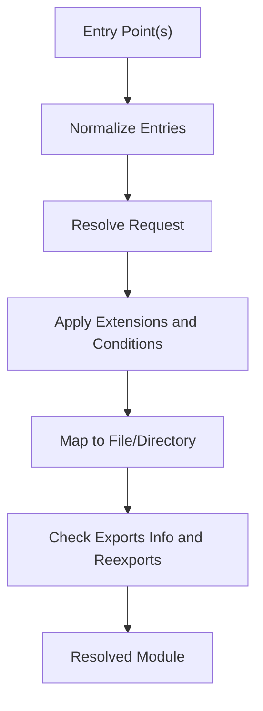

**Diagram sources**
- [webpack@5.68.0/lib/dependencies/SingleEntryDependency.js](file://源码学习/webpack@5.68.0/lib/dependencies/SingleEntryDependency.js)
- [webpack@5.68.0/lib/dependencies/MultiEntryDependency.js](file://源码学习/webpack@5.68.0/lib/dependencies/MultiEntryDependency.js)
- [webpack@5.68.0/lib/dependencies/HarmonyImportDependency.js](file://源码学习/webpack@5.68.0/lib/dependencies/HarmonyImportDependency.js)
- [webpack@5.68.0/lib/dependencies/CommonJsRequireDependency.js](file://源码学习/webpack@5.68.0/lib/dependencies/CommonJsRequireDependency.js)
- [webpack@5.68.0/lib/dependencies/RequireContextDependency.js](file://源码学习/webpack@5.68.0/lib/dependencies/RequireContextDependency.js)
- [webpack@5.68.0/lib/dependencies/RequireResolveContextDependency.js](file://源码学习/webpack@5.68.0/lib/dependencies/RequireResolveContextDependency.js)
- [webpack@5.68.0/lib/ExportsInfo.js](file://源码学习/webpack@5.68.0/lib/ExportsInfo.js)

**Section sources**
- [webpack@5.68.0/lib/dependencies/EntryDependency.js](file://源码学习/webpack@5.68.0/lib/dependencies/EntryDependency.js)
- [webpack@5.68.0/lib/dependencies/HarmonyImportDependency.js](file://源码学习/webpack@5.68.0/lib/dependencies/HarmonyImportDependency.js)
- [webpack@5.68.0/lib/dependencies/CommonJsRequireDependency.js](file://源码学习/webpack@5.68.0/lib/dependencies/CommonJsRequireDependency.js)
- [webpack@5.68.0/lib/dependencies/RequireContextDependency.js](file://源码学习/webpack@5.68.0/lib/dependencies/RequireContextDependency.js)
- [webpack@5.68.0/lib/dependencies/RequireResolveContextDependency.js](file://源码学习/webpack@5.68.0/lib/dependencies/RequireResolveContextDependency.js)
- [webpack@5.68.0/lib/ExportsInfo.js](file://源码学习/webpack@5.68.0/lib/ExportsInfo.js)

### Dependency Graph Construction
The DependencyGraph tracks relationships between modules and enables:
- Reachability analysis
- Export/import tracking
- Dead code elimination
- Chunk placement decisions

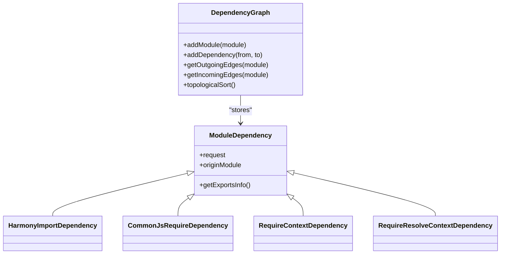

**Diagram sources**
- [webpack@5.68.0/lib/dependencies/DependencyGraph.js](file://源码学习/webpack@5.68.0/lib/dependencies/DependencyGraph.js)
- [webpack@5.68.0/lib/dependencies/ModuleDependency.js](file://源码学习/webpack@5.68.0/lib/dependencies/ModuleDependency.js)
- [webpack@5.68.0/lib/dependencies/HarmonyImportDependency.js](file://源码学习/webpack@5.68.0/lib/dependencies/HarmonyImportDependency.js)
- [webpack@5.68.0/lib/dependencies/CommonJsRequireDependency.js](file://源码学习/webpack@5.68.0/lib/dependencies/CommonJsRequireDependency.js)
- [webpack@5.68.0/lib/dependencies/RequireContextDependency.js](file://源码学习/webpack@5.68.0/lib/dependencies/RequireContextDependency.js)
- [webpack@5.68.0/lib/dependencies/RequireResolveContextDependency.js](file://源码学习/webpack@5.68.0/lib/dependencies/RequireResolveContextDependency.js)

**Section sources**
- [webpack@5.68.0/lib/dependencies/DependencyGraph.js](file://源码学习/webpack@5.68.0/lib/dependencies/DependencyGraph.js)
- [webpack@5.68.0/lib/dependencies/ModuleDependency.js](file://源码学习/webpack@5.68.0/lib/dependencies/ModuleDependency.js)

### Loader Chain Processing
Loaders transform modules before they enter the module graph. The Compilation coordinates loader execution:
- NormalModule applies loader rules to module requests
- LoaderDependency captures loader-specific metadata
- Loader chains are ordered and applied per module

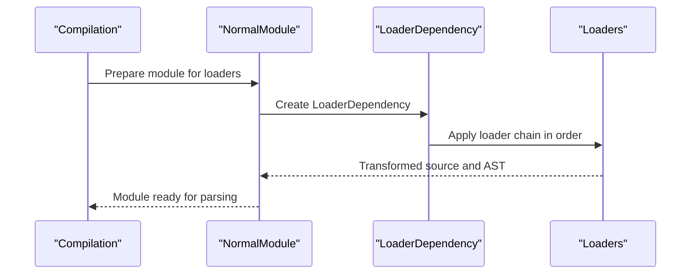

**Diagram sources**
- [webpack@5.68.0/lib/Compilation.js](file://源码学习/webpack@5.68.0/lib/Compilation.js)
- [webpack@5.68.0/lib/NormalModule.js](file://源码学习/webpack@5.68.0/lib/NormalModule.js)
- [webpack@5.68.0/lib/dependencies/LoaderDependency.js](file://源码学习/webpack@5.68.0/lib/dependencies/LoaderDependency.js)

**Section sources**
- [webpack@5.68.0/lib/NormalModule.js](file://源码学习/webpack@5.68.0/lib/NormalModule.js)
- [webpack@5.68.0/lib/dependencies/LoaderDependency.js](file://源码学习/webpack@5.68.0/lib/dependencies/LoaderDependency.js)

### Plugin System Hooks
Plugins integrate via Compiler and Compilation hooks:
- Compiler hooks: Setup, done, emit, afterEmit
- Compilation hooks: BuildModule, SucceedModule, FinishModules, OptimizeChunkModule
- Optimization hooks: RemoveEmptyChunks, SplitChunks, etc.

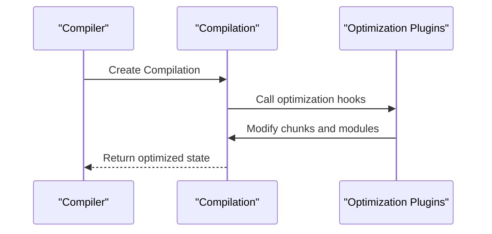

**Diagram sources**
- [webpack@5.68.0/lib/Compiler.js](file://源码学习/webpack@5.68.0/lib/Compiler.js)
- [webpack@5.68.0/lib/Compilation.js](file://源码学习/webpack@5.68.0/lib/Compilation.js)
- [webpack@5.68.0/lib/optimize/RemoveEmptyChunksPlugin.js](file://源码学习/webpack@5.68.0/lib/optimize/RemoveEmptyChunksPlugin.js)
- [webpack@5.68.0/lib/optimize/SplitChunksPlugin.js](file://源码学习/webpack@5.68.0/lib/optimize/SplitChunksPlugin.js)

**Section sources**
- [webpack@5.68.0/lib/Compiler.js](file://源码学习/webpack@5.68.0/lib/Compiler.js)
- [webpack@5.68.0/lib/Compilation.js](file://源码学习/webpack@5.68.0/lib/Compilation.js)

### Code Splitting Implementation
SplitChunksPlugin controls chunk splitting:
- Dynamic imports trigger new chunks
- Strategies: cache groups, sizes, and shared modules
- RemoveEmptyChunksPlugin prunes unused chunks post-splitting

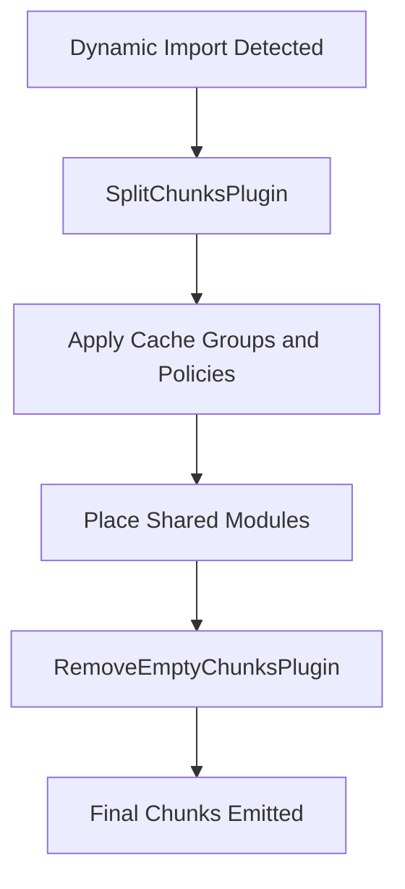

**Diagram sources**
- [webpack@5.68.0/lib/optimize/SplitChunksPlugin.js](file://源码学习/webpack@5.68.0/lib/optimize/SplitChunksPlugin.js)
- [webpack@5.68.0/lib/optimize/RemoveEmptyChunksPlugin.js](file://源码学习/webpack@5.68.0/lib/optimize/RemoveEmptyChunksPlugin.js)

**Section sources**
- [webpack@5.68.0/lib/optimize/SplitChunksPlugin.js](file://源码学习/webpack@5.68.0/lib/optimize/SplitChunksPlugin.js)
- [webpack@5.68.0/lib/optimize/RemoveEmptyChunksPlugin.js](file://源码学习/webpack@5.68.0/lib/optimize/RemoveEmptyChunksPlugin.js)

### Tree Shaking and Exports Tracking
Tree shaking relies on accurate export/import tracking:
- ExportsInfo records named and namespace exports
- StaticExportsDependency marks statically analyzable exports
- ReexportDependency handles re-exports
- DependencyGraph and ExportsInfo drive dead code elimination

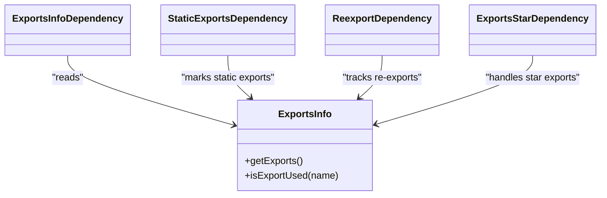

**Diagram sources**
- [webpack@5.68.0/lib/ExportsInfo.js](file://源码学习/webpack@5.68.0/lib/ExportsInfo.js)
- [webpack@5.68.0/lib/dependencies/StaticExportsDependency.js](file://源码学习/webpack@5.68.0/lib/dependencies/StaticExportsDependency.js)
- [webpack@5.68.0/lib/dependencies/ReexportDependency.js](file://源码学习/webpack@5.68.0/lib/dependencies/ReexportDependency.js)
- [webpack@5.68.0/lib/dependencies/ExportsStarDependency.js](file://源码学习/webpack@5.68.0/lib/dependencies/ExportsStarDependency.js)
- [webpack@5.68.0/lib/dependencies/ExportsInfoDependency.js](file://源码学习/webpack@5.68.0/lib/dependencies/ExportsInfoDependency.js)

**Section sources**
- [webpack@5.68.0/lib/ExportsInfo.js](file://源码学习/webpack@5.68.0/lib/ExportsInfo.js)
- [webpack@5.68.0/lib/dependencies/StaticExportsDependency.js](file://源码学习/webpack@5.68.0/lib/dependencies/StaticExportsDependency.js)
- [webpack@5.68.0/lib/dependencies/ReexportDependency.js](file://源码学习/webpack@5.68.0/lib/dependencies/ReexportDependency.js)
- [webpack@5.68.0/lib/dependencies/ExportsStarDependency.js](file://源码学习/webpack@5.68.0/lib/dependencies/ExportsStarDependency.js)
- [webpack@5.68.0/lib/dependencies/ExportsInfoDependency.js](file://源码学习/webpack@5.68.0/lib/dependencies/ExportsInfoDependency.js)

### Development Server and Hot Module Replacement
- WebEnvironmentPlugin configures web-specific behavior.
- HotModuleReplacementPlugin integrates HMR logic into the compilation.
- Dev server typically leverages middleware to serve bundles and handle updates.

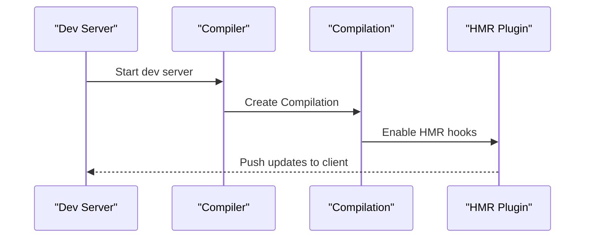

**Diagram sources**
- [webpack@5.68.0/lib/web/WebEnvironmentPlugin.js](file://源码学习/webpack@5.68.0/lib/web/WebEnvironmentPlugin.js)
- [webpack@5.68.0/lib/HotModuleReplacementPlugin.js](file://源码学习/webpack@5.68.0/lib/HotModuleReplacementPlugin.js)

**Section sources**
- [webpack@5.68.0/lib/web/WebEnvironmentPlugin.js](file://源码学习/webpack@5.68.0/lib/web/WebEnvironmentPlugin.js)
- [webpack@5.68.0/lib/HotModuleReplacementPlugin.js](file://源码学习/webpack@5.68.0/lib/HotModuleReplacementPlugin.js)

### Asset Handling and Source Maps
- SourceMapDevToolModuleOptionsPlugin allows fine-grained control over source map generation per module.
- ModuleFilenameHelpers and RequestShortener assist in path normalization and readability.
- Hashing utilities support long-term caching and content-based filenames.

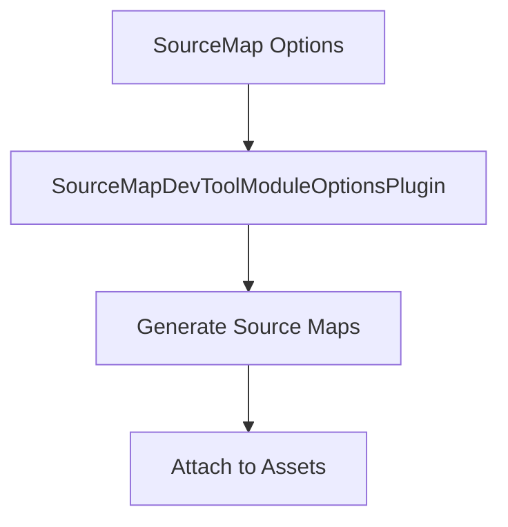

**Diagram sources**
- [webpack@5.68.0/lib/SourceMapDevToolModuleOptionsPlugin.js](file://源码学习/webpack@5.68.0/lib/SourceMapDevToolModuleOptionsPlugin.js)
- [webpack@5.68.0/lib/ModuleFilenameHelpers.js](file://源码学习/webpack@5.68.0/lib/ModuleFilenameHelpers.js)
- [webpack@5.68.0/lib/RequestShortener.js](file://源码学习/webpack@5.68.0/lib/RequestShortener.js)
- [webpack@5.68.0/lib/util/createHash.js](file://源码学习/webpack@5.68.0/lib/util/createHash.js)

**Section sources**
- [webpack@5.68.0/lib/SourceMapDevToolModuleOptionsPlugin.js](file://源码学习/webpack@5.68.0/lib/SourceMapDevToolModuleOptionsPlugin.js)
- [webpack@5.68.0/lib/ModuleFilenameHelpers.js](file://源码学习/webpack@5.68.0/lib/ModuleFilenameHelpers.js)
- [webpack@5.68.0/lib/RequestShortener.js](file://源码学习/webpack@5.68.0/lib/RequestShortener.js)
- [webpack@5.68.0/lib/util/createHash.js](file://源码学习/webpack@5.68.0/lib/util/createHash.js)

### Extensibility Through Plugins and Loaders
- Plugins: Register hooks at Compiler and/or Compilation level to customize behavior.
- Loaders: Transform module content before entering the module graph.
- Environment plugins: Configure platform-specific behavior (web vs Node.js).

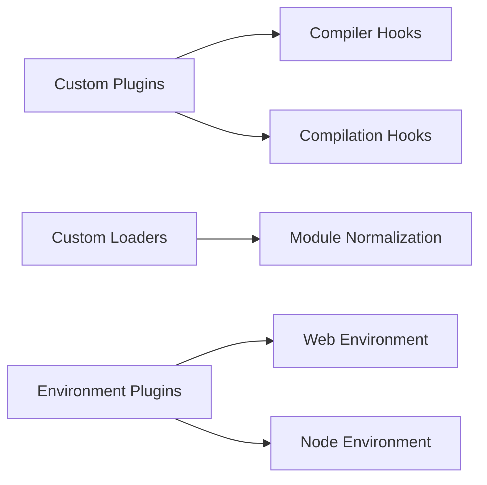

**Diagram sources**
- [webpack@5.68.0/lib/Compiler.js](file://源码学习/webpack@5.68.0/lib/Compiler.js)
- [webpack@5.68.0/lib/Compilation.js](file://源码学习/webpack@5.68.0/lib/Compilation.js)
- [webpack@5.68.0/lib/web/WebEnvironmentPlugin.js](file://源码学习/webpack@5.68.0/lib/web/WebEnvironmentPlugin.js)
- [webpack@5.68.0/lib/node/NodeEnvironmentPlugin.js](file://源码学习/webpack@5.68.0/lib/node/NodeEnvironmentPlugin.js)

**Section sources**
- [webpack@5.68.0/lib/Compiler.js](file://源码学习/webpack@5.68.0/lib/Compiler.js)
- [webpack@5.68.0/lib/Compilation.js](file://源码学习/webpack@5.68.0/lib/Compilation.js)
- [webpack@5.68.0/lib/web/WebEnvironmentPlugin.js](file://源码学习/webpack@5.68.0/lib/web/WebEnvironmentPlugin.js)
- [webpack@5.68.0/lib/node/NodeEnvironmentPlugin.js](file://源码学习/webpack@5.68.0/lib/node/NodeEnvironmentPlugin.js)

## Dependency Analysis
Webpack’s internal dependencies emphasize separation of concerns:
- Compiler depends on environment plugins and core plugins
- Compilation depends on module systems, dependency graph, and optimization plugins
- Dependencies subsystem encapsulates import/export semantics and graph traversal

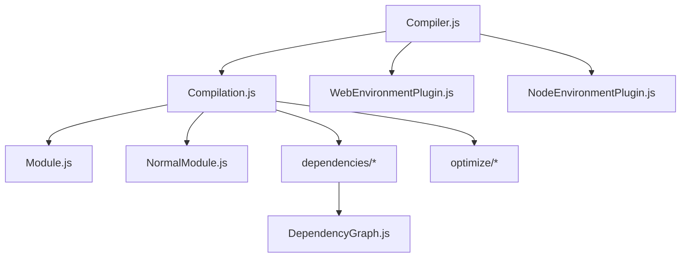

**Diagram sources**
- [webpack@5.68.0/lib/Compiler.js](file://源码学习/webpack@5.68.0/lib/Compiler.js)
- [webpack@5.68.0/lib/Compilation.js](file://源码学习/webpack@5.68.0/lib/Compilation.js)
- [webpack@5.68.0/lib/web/WebEnvironmentPlugin.js](file://源码学习/webpack@5.68.0/lib/web/WebEnvironmentPlugin.js)
- [webpack@5.68.0/lib/node/NodeEnvironmentPlugin.js](file://源码学习/webpack@5.68.0/lib/node/NodeEnvironmentPlugin.js)
- [webpack@5.68.0/lib/Module.js](file://源码学习/webpack@5.68.0/lib/Module.js)
- [webpack@5.68.0/lib/NormalModule.js](file://源码学习/webpack@5.68.0/lib/NormalModule.js)
- [webpack@5.68.0/lib/dependencies/DependencyGraph.js](file://源码学习/webpack@5.68.0/lib/dependencies/DependencyGraph.js)

**Section sources**
- [webpack@5.68.0/lib/Compiler.js](file://源码学习/webpack@5.68.0/lib/Compiler.js)
- [webpack@5.68.0/lib/Compilation.js](file://源码学习/webpack@5.68.0/lib/Compilation.js)
- [webpack@5.68.0/lib/dependencies/DependencyGraph.js](file://源码学习/webpack@5.68.0/lib/dependencies/DependencyGraph.js)

## Performance Considerations
- Tree shaking: Accurate exports tracking reduces bundle size by eliminating unused code.
- Code splitting: SplitChunksPlugin improves load performance by deferring non-critical code.
- Hashing and caching: Content-based hashing enables long-term caching.
- Optimization bailouts: OptimizationBailoutPlugin helps diagnose when optimizations are skipped.
- Dev server and HMR: Efficient incremental updates reduce rebuild times during development.

[No sources needed since this section provides general guidance]

## Troubleshooting Guide
Common issues and diagnostics:
- Entry/module resolution errors: Inspect EntryDependency and ModuleDependencyError for actionable messages.
- Dependency resolution failures: Review HarmonyImportDependency and CommonJsRequireDependency usage.
- Optimization issues: Use OptimizationBailoutPlugin to understand why certain optimizations were skipped.
- Chunk anomalies: Verify SplitChunksPlugin and RemoveEmptyChunksPlugin interactions.

**Section sources**
- [webpack@5.68.0/lib/dependencies/EntryModuleError.js](file://源码学习/webpack@5.68.0/lib/dependencies/EntryModuleError.js)
- [webpack@5.68.0/lib/dependencies/ModuleDependencyError.js](file://源码学习/webpack@5.68.0/lib/dependencies/ModuleDependencyError.js)
- [webpack@5.68.0/lib/dependencies/ModuleDependencyWarning.js](file://源码学习/webpack@5.68.0/lib/dependencies/ModuleDependencyWarning.js)
- [webpack@5.68.0/lib/optimize/OptimizationBailoutPlugin.js](file://源码学习/webpack@5.68.0/lib/optimize/OptimizationBailoutPlugin.js)

## Conclusion
Webpack’s architecture centers on a robust Compiler/Compilation model, a precise dependency graph, and a powerful plugin system. By leveraging accurate module resolution, loader chains, and optimization plugins, Webpack delivers efficient bundling, effective code splitting, and strong developer ergonomics through HMR and dev servers. Understanding these internals empowers teams to configure builds effectively and extend Webpack with custom plugins and loaders.

[No sources needed since this section summarizes without analyzing specific files]

## Appendices
- CLI entry point: [bin/webpack.js](file://源码学习/webpack@5.68.0/bin/webpack.js)
- Core runtime: [lib/Compiler.js](file://源码学习/webpack@5.68.0/lib/Compiler.js), [lib/Compilation.js](file://源码学习/webpack@5.68.0/lib/Compilation.js)
- Module abstractions: [lib/Module.js](file://源码学习/webpack@5.68.0/lib/Module.js), [lib/NormalModule.js](file://源码学习/webpack@5.68.0/lib/NormalModule.js)
- Dependencies: [lib/dependencies/*](file://源码学习/webpack@5.68.0/lib/dependencies/)
- Optimizations: [lib/optimize/*](file://源码学习/webpack@5.68.0/lib/optimize/)
- Environments: [lib/web/WebEnvironmentPlugin.js](file://源码学习/webpack@5.68.0/lib/web/WebEnvironmentPlugin.js), [lib/node/NodeEnvironmentPlugin.js](file://源码学习/webpack@5.68.0/lib/node/NodeEnvironmentPlugin.js)
- Utilities: [lib/util/createHash.js](file://源码学习/webpack@5.68.0/lib/util/createHash.js), [lib/ModuleFilenameHelpers.js](file://源码学习/webpack@5.68.0/lib/ModuleFilenameHelpers.js), [lib/RequestShortener.js](file://源码学习/webpack@5.68.0/lib/RequestShortener.js)